# 哈佛 CS50-CS 8：输入输出、存储与内存管理 1 💾


在本节课中，我们将要学习计算机内存的基础知识，包括如何表示内存地址、理解指针的概念，以及如何通过编程来操作内存。我们将从熟悉的C语言出发，逐步揭开计算机内部工作的神秘面纱。

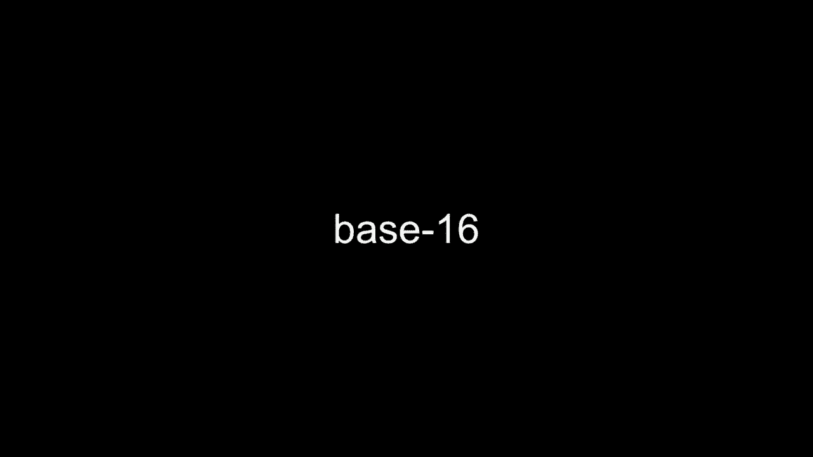


## 内存地址与十六进制 🔢


上一节我们介绍了计算机内存的基本概念。本节中我们来看看计算机科学家如何表示内存地址。

计算机内存中的所有字节都可以被编号。我们可以称之为字节0、1、2、3，一直到字节15，等等。在讨论计算机内存时，计算机科学家倾向于使用一种叫做十六进制的计数系统。

十六进制是一个不同的基数系统。它不使用10个数字或2个数字，而是使用16个数字。因此，当计算机科学家谈论计算机内存时，他们会使用0、1、2、3、4、5、6、7、8、9，但在那之后，不是继续使用十进制到10，他们会开始使用字母表中的几个字母来计数。

在十六进制中，`hex`表示16，总共有16个独立的数字：0到9和a到f。因此我们不需要引入第二个数字，只需计数到16。我们可以使用单个数字0到f，并且我们可以通过使用多个十六进制数字继续计数。

十六进制的工作原理与我们熟悉的十进制系统非常相似。就像在十进制世界中，我们使用了基数10，或者在二进制世界中我们使用了基数2，现在我们将使用基数16。

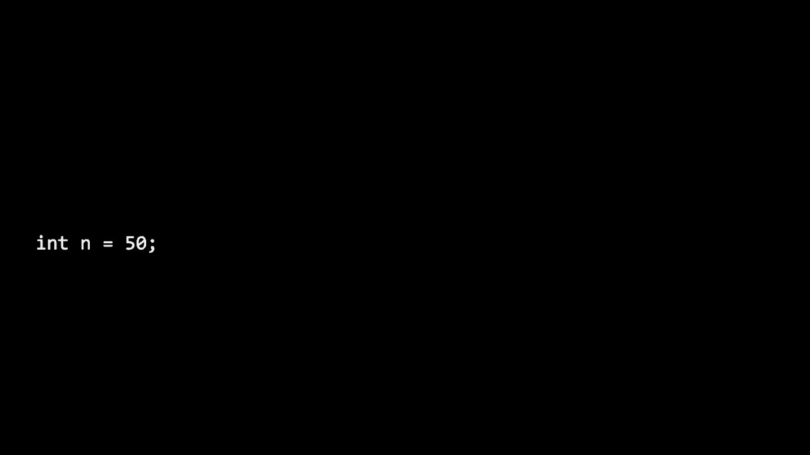

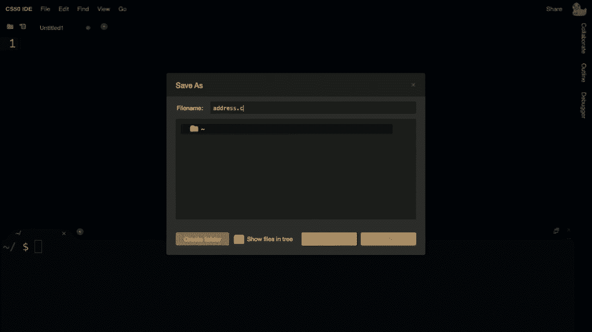

以下是十六进制计数的示例：
*   0, 1, 2, 3, 4, 5, 6, 7, 8, 9
*   在9之后，我们数到a, b, c, d, e, f
*   在f之后，我们进位，所以下一个数是`10`（十六进制），它代表十进制的16。

计算机世界中的一个约定是，每当你表示十六进制数字时，使用前缀`0x`。这只是一个前缀，用于明确这些是十六进制数字。

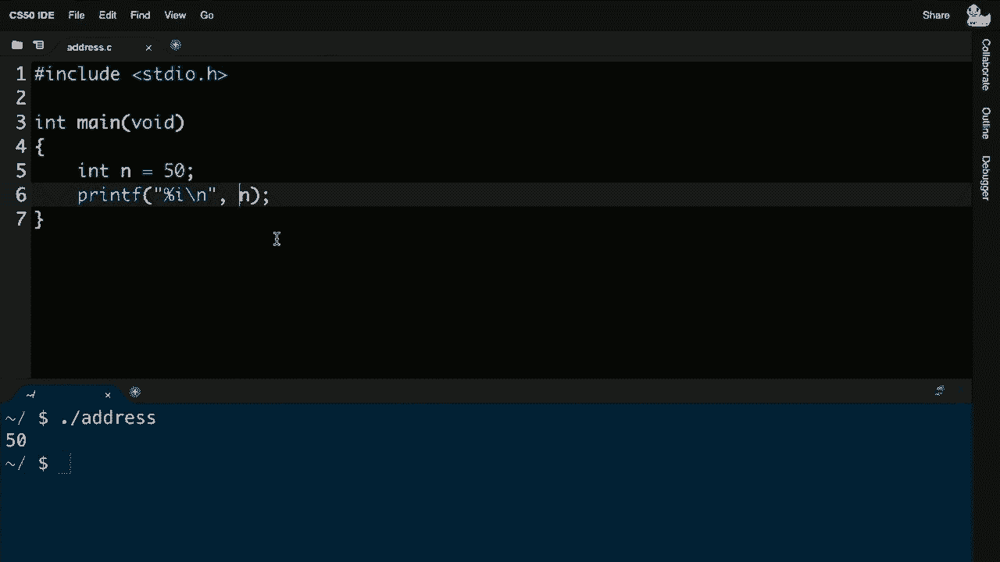


## 指针：内存地址的变量 🎯


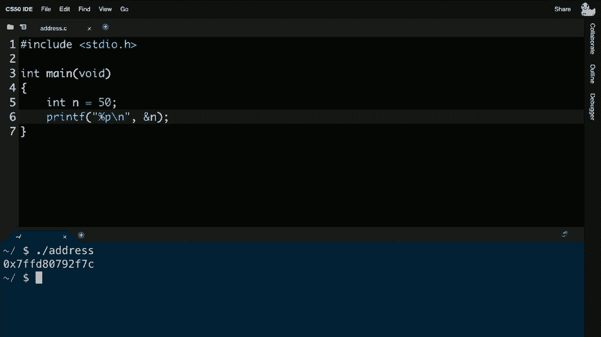

上一节我们学习了如何用十六进制表示内存地址。本节中我们来看看如何在程序中获取和使用这些地址。


这里有一行简单的代码：
```c
int n = 50;
```
那么实际上存储在我们电脑内存中的是什么呢？变量`n`需要放在你电脑的内存中。一个整数通常在CS50 IDE和现代系统上占用四个字节。这个值`50`就存储在这四个字节中。

在你的电脑内存中，还有这些隐含存在的地址。即使我们根据代码中给它的变量名`n`来引用这个变量，这个变量也肯定存在于内存中的一个特定位置。这个位置就是它的地址。

为了探索计算机内存的内部，C语言提供了两个新的运算符。

第一个是`&`符号（地址运算符）。在任何变量名之前加上前缀`&`，我们可以告诉C语言：“请告诉我这个变量存储在什么地址”。

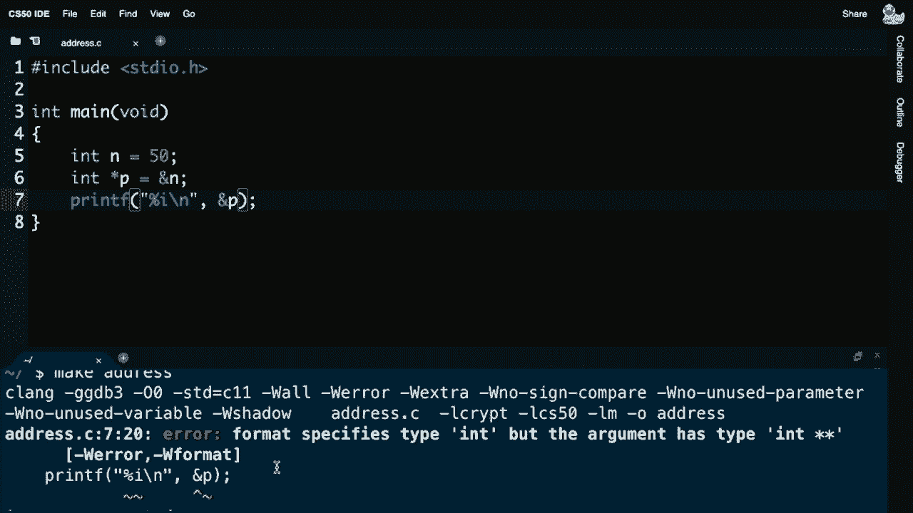

第二个是`*`符号（解引用运算符）。当你使用`*`时，你实际上可以告诉你的程序去查看特定内存地址的内容。

因此，`&`告诉你什么是地址，`*`意味着去到那个地址。它们是一种反向操作。

我们可以使用`printf`和格式代码`%p`来打印出地址。

以下是一个示例程序：
```c
#include <stdio.h>

int main(void)
{
    int n = 50;
    printf("%p\n", &n); // 打印变量n的地址
}
```
运行这个程序会输出一个类似`0x7ffd80792f7c`的十六进制数，这就是变量`n`在内存中的地址。

## 指针变量 📍

上一节我们学会了如何获取一个变量的地址。本节中我们来看看如何将地址存储起来以便后续使用。

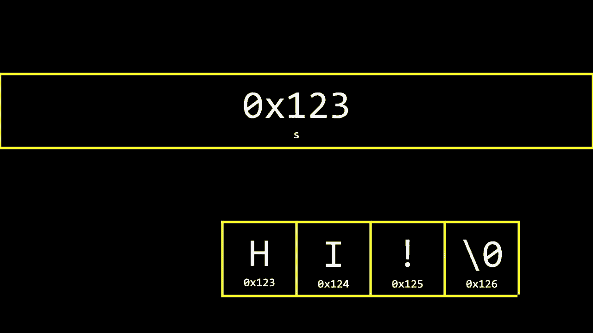

指针是一种变量，它包含某个其他值的地址。我们之前见过整数、浮点数、字符和字符串，现在指针只是另一种变量类型。你可以有指向整数的指针、指向字符的指针、指向布尔值或任何其他数据类型的指针。

声明一个指针的语法是`type *variable_name;`。例如，一个指向整数的指针声明为`int *p;`。

我们可以将之前获取的地址存储在一个指针变量中：
```c
#include <stdio.h>

int main(void)
{
    int n = 50;
    int *p = &n; // p是一个指针，存储了n的地址
    printf("%p\n", p); // 打印指针p中存储的地址（即n的地址）
}
```
现在，变量`p`存储了变量`n`的地址。如果我们想通过指针`p`来获取`n`的值，我们可以使用解引用运算符`*`：
```c
printf("%i\n", *p); // 打印p所指向地址的值（即n的值，50）
```
在计算机内存中，可以这样理解：变量`n`占用了四个字节存储值`50`。指针变量`p`占用了八个字节（在现代64位系统中），它存储的值是`n`的地址（例如`0x123`）。我们可以将指针`p`图形化地看作一个箭头，指向变量`n`。

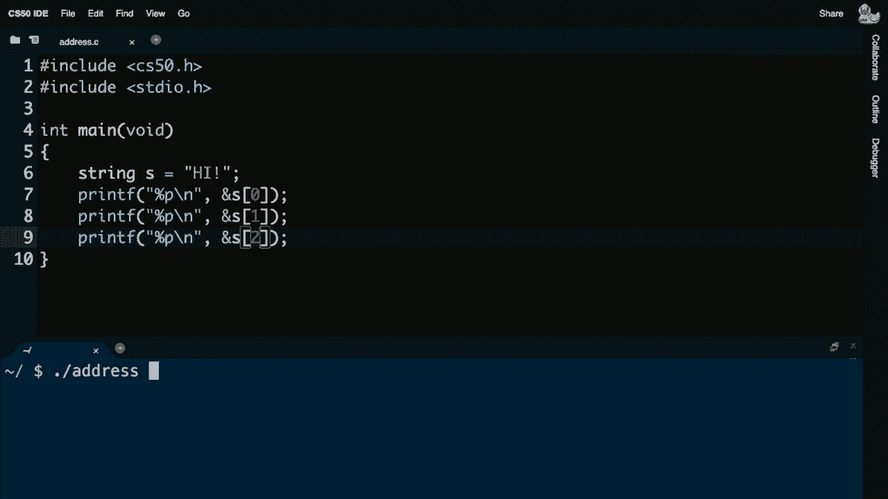

## 字符串的本质 🧵

上一节我们探讨了整数和指针。本节中我们来看看字符串在内存中是如何表示的。

对于字符串，你可能有一行代码看起来像这样：
```c
string s = "HI!";
```
在底层，字符串`"HI!"`存储在内存中连续的字节里：`'H'`, `'I'`, `'!'`, `'\0'`。每个字符占用一个字节。

那么，变量`s`究竟是什么呢？从今天开始，我们可以将字符串视为技术上仅仅是一个地址——字符串中第一个字符的地址。

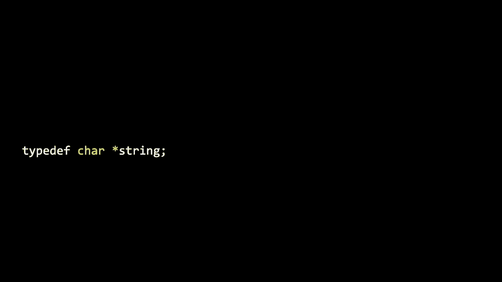

为什么这就足够了？因为字符串在C语言中是以字符数组的形式存储的，并且每个字符串都以空字符`\0`结尾。所以，如果你知道字符串开始的地址，你就可以通过顺序读取字符直到遇到`\0`来获取整个字符串。

实际上，在C语言中，并没有内置的`string`类型。在CS50库中，`string`是通过`typedef`定义的一个别名：
```c
typedef char *string;
```
这意味着`string`其实就是`char *`，即一个指向字符的指针。所以，当我们写`string s = "HI!";`时，`s`就是一个存储着字符`'H'`地址的指针。

我们可以通过编程来验证这一点：
```c
#include <stdio.h>
#include <cs50.h>

int main(void)
{
    string s = "HI!";
    printf("%p\n", s);       // 打印字符串s的地址（第一个字符'H'的地址）
    printf("%p\n", &s[0]);   // 打印第一个字符'H'的地址
    printf("%p\n", &s[1]);   // 打印第二个字符'I'的地址
    printf("%p\n", &s[2]);   // 打印第三个字符'!'的地址
}
```
运行这个程序，你会看到输出的地址是连续的，每个相差1个字节。

## 指针运算与字符串访问 ➕

上一节我们明白了字符串本质上是一个地址。本节中我们来看看如何利用这个特性来访问字符串。

既然字符串`s`是一个地址（例如`0x123`），指向第一个字符`'H'`，那么我们可以使用指针运算来访问其他字符。

`*(s + 0)` 等价于 `s[0]`，即第一个字符。
`*(s + 1)` 等价于 `s[1]`，即第二个字符。
`*(s + 2)` 等价于 `s[2]`，即第三个字符。

以下是一个示例：
```c
#include <stdio.h>
#include <cs50.h>

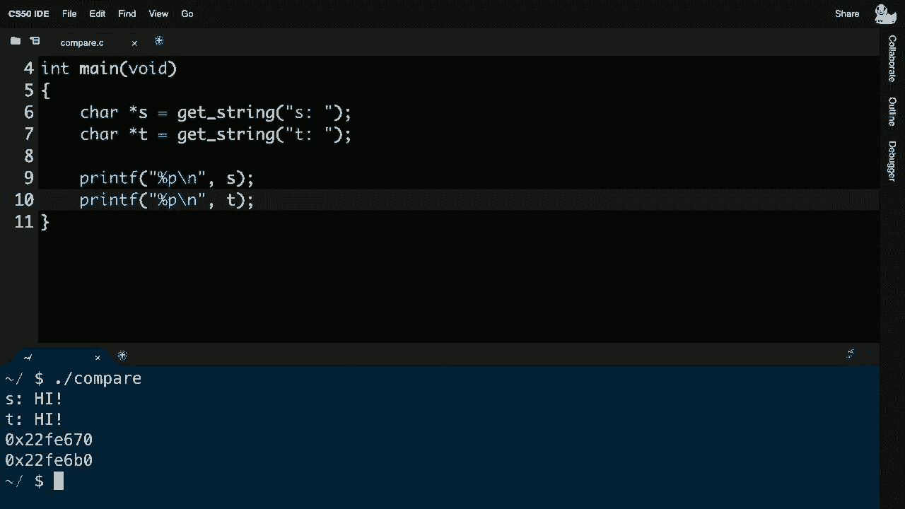

int main(void)
{
    string s = "HI!";
    printf("%c", *(s + 0)); // 打印 'H'
    printf("%c", *(s + 1)); // 打印 'I'
    printf("%c\n", *(s + 2)); // 打印 '!'
}
```
第二周我们使用的方括号表示法`[i]`，实际上只是一种更友好、语法糖式的方式，底层做的就是这种指针运算。`s[i]`在C语言中完全等价于`*(s + i)`。

## 比较与复制字符串的陷阱 ⚠️

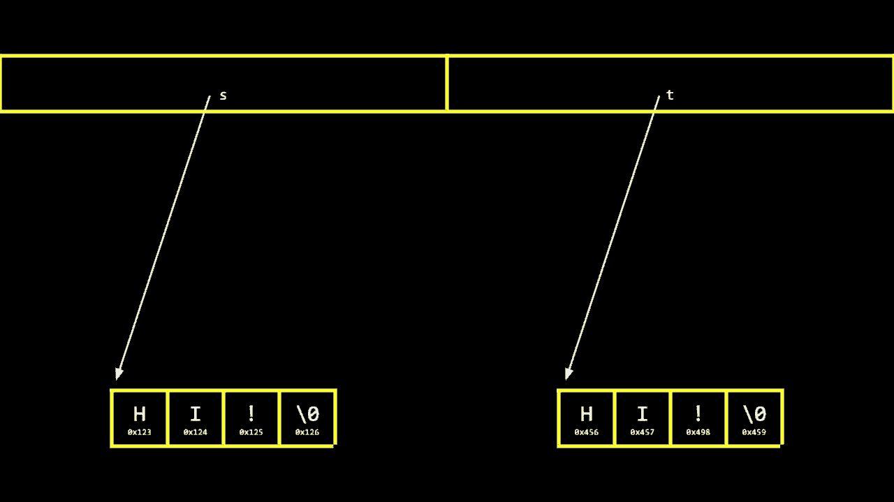

上一节我们学会了用指针访问字符串。本节中我们来看看直接比较或复制字符串时常见的错误。

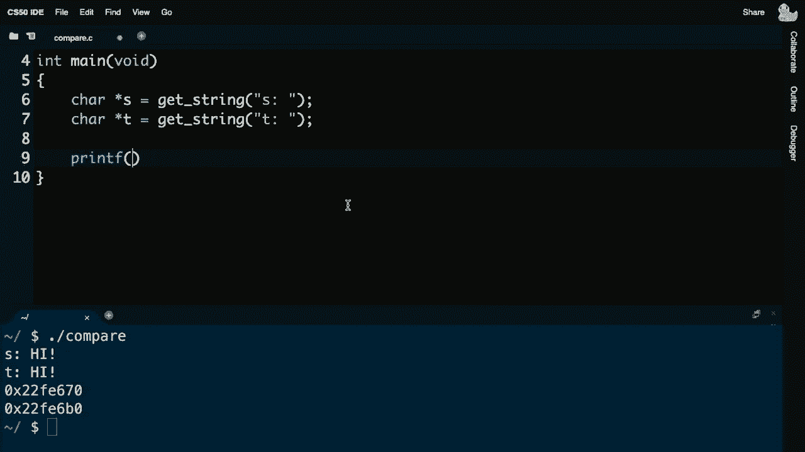

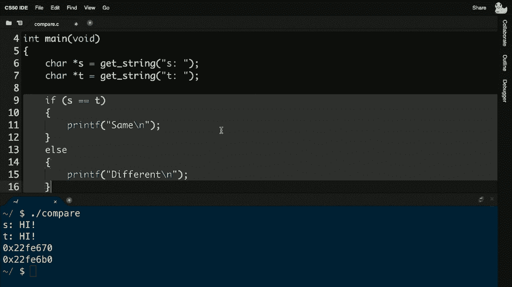

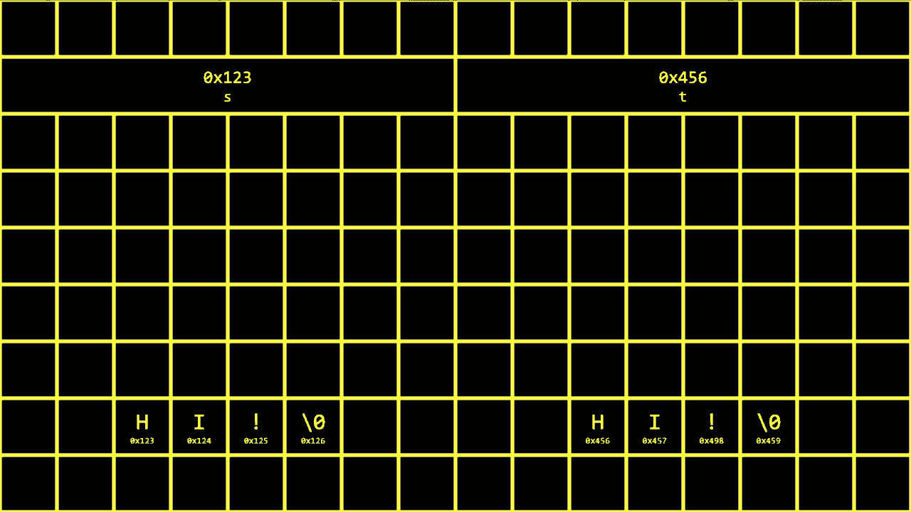

考虑以下程序，它试图比较两个用户输入的字符串：
```c
#include <cs50.h>
#include <stdio.h>

int main(void)
{
    char *s = get_string("s: ");
    char *t = get_string("t: ");

    if (s == t) // 这是错误的比较方式！
    {
        printf("Same\n");
    }
    else
    {
        printf("Different\n");
    }
}
```
即使用户输入了相同的字符串（如两次都输入`"hi"`），程序也会输出`"Different"`。为什么？

因为`s`和`t`是指针，它们存储的是各自字符串第一个字符的地址。`get_string`每次都会从内存中找一块新地方来存放用户输入的字符串。所以即使内容相同，`s`和`t`的值（即地址）也是不同的。`s == t`比较的是地址是否相同，而不是地址所指向的内容是否相同。

正确的比较字符串内容的方法是使用`strcmp`函数（来自`string.h`）：
```c
#include <cs50.h>
#include <stdio.h>
#include <string.h>

int main(void)
{
    char *s = get_string("s: ");
    char *t = get_string("t: ");

    if (strcmp(s, t) == 0) // 比较字符串内容
    {
        printf("Same\n");
    }
    else
    {
        printf("Different\n");
    }
}
```
类似地，直接使用赋值运算符`=`复制字符串也会有问题：
```c
char *s = "hi";
char *t = s; // 这只是复制了地址，没有复制内容！
t[0] = toupper(t[0]); // 这同时修改了s和t指向的字符串！
printf("%s\n", s); // 输出 "Hi"
printf("%s\n", t); // 输出 "Hi"
```
因为`t = s`只是让`t`指向了和`s`相同的内存地址，它们共享同一份数据。修改`t`就等于修改`s`。

## 正确复制字符串 ✅

上一节我们看到了错误复制字符串的后果。本节中我们来看看如何正确地为字符串内容分配新的内存并进行复制。

要真正复制一个字符串，我们需要做两件事：
1.  为新的字符串分配足够的内存。
2.  将原字符串中的每一个字符（包括结尾的空字符`\0`）复制到新分配的内存中。

我们可以使用`malloc`函数（来自`stdlib.h`）来动态分配内存。它接受一个参数：你需要的字节数。

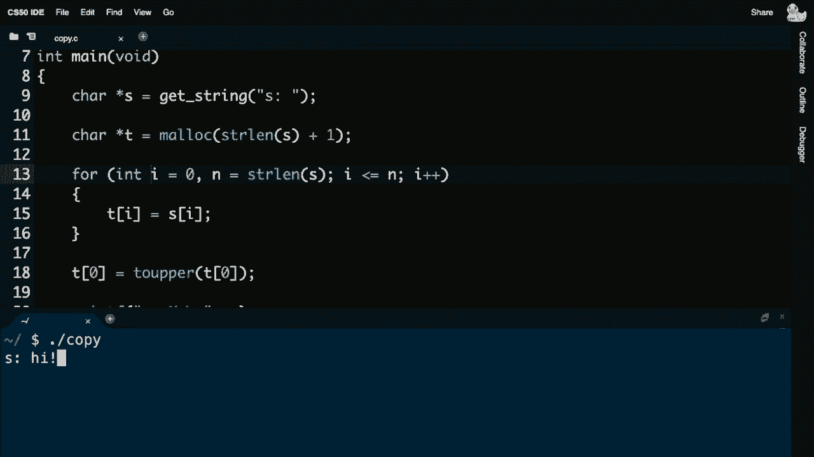

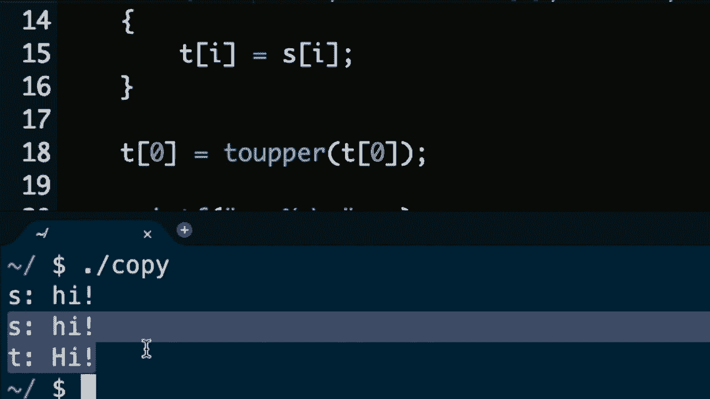

以下是手动复制字符串的示例：
```c
#include <cs50.h>
#include <ctype.h>
#include <stdio.h>
#include <stdlib.h>
#include <string.h>

int main(void)
{
    char *s = get_string("s: ");
    if (s == NULL) // 良好的习惯：检查输入是否有效
    {
        return 1;
    }

    // 分配内存：字符串长度 + 1 (用于 '\0')
    char *t = malloc(strlen(s) + 1);
    if (t == NULL) // 检查内存是否分配成功
    {
        return 1;
    }

    // 手动复制字符
    for (int i = 0, n = strlen(s); i <= n; i++) // i <= n 确保复制 '\0'
    {
        t[i] = s[i];
    }

    // 现在可以安全地修改t而不影响s
    if (strlen(t) > 0)
    {
        t[0] = toupper(t[0]);
    }

    printf("s: %s\n", s);
    printf("t: %s\n", t);

    // 重要：释放分配的内存
    free(t);
    return 0;
}
```
实际上，有一个标准库函数`strcpy`（来自`string.h`）可以帮我们完成复制循环的工作，使代码更简洁：
```c
strcpy(t, s); // 将字符串s复制到t指向的内存中
```
使用`malloc`分配的内存，在使用完毕后，程序员有责任使用`free`函数将其释放，归还给操作系统，以避免内存泄漏。

---

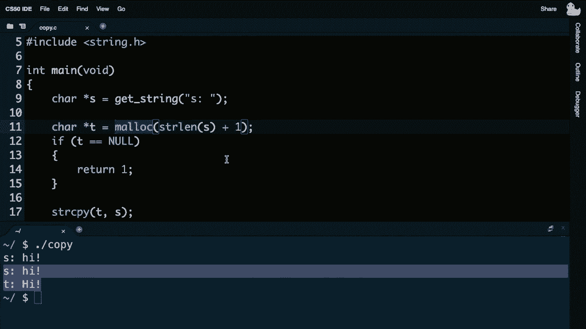

本节课中我们一起学习了计算机内存的基础表示法（十六进制）、指针的概念与操作、字符串在内存中的本质（即字符指针），以及如何正确地比较和复制字符串。理解这些底层概念是写出高效、正确程序的关键，也为我们后续学习更复杂的数据结构和内存管理打下了坚实的基础。