# 哈佛 CS50-CS 9：输入输出、存储与内存管理 2 🖥️

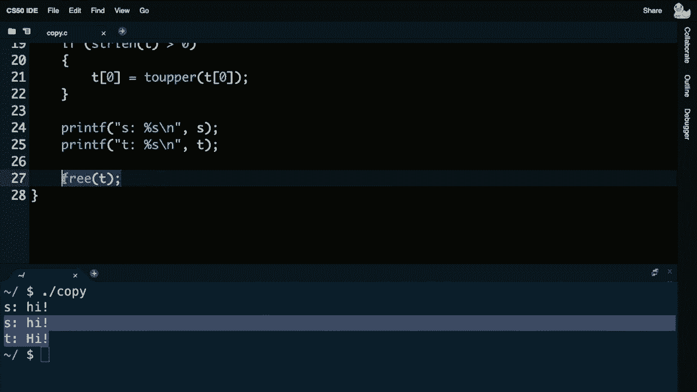

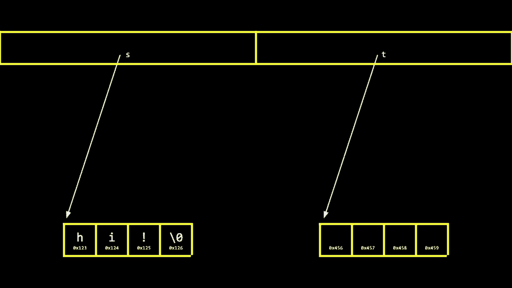

在本节课中，我们将深入学习内存管理、指针的深入应用、常见内存错误及其调试工具，以及文件输入输出的基本操作。我们将从手动管理内存开始，逐步理解指针如何帮助我们更精确地控制程序，并最终探索如何读写文件以实现数据的持久化存储。

## 📚 概述：内存管理与指针

上一节我们介绍了指针的基本概念和 `malloc` 函数。本节中，我们将看看如何正确地释放内存，并深入探讨指针在函数参数传递和数据结构操作中的强大作用。

### 释放内存：`free` 函数

当你使用 `malloc` 分配内存后，最好的做法是在使用完毕后将其释放。与 `malloc` 相对应的操作是 `free` 函数。`free` 函数的输入是 `malloc` 返回的地址，即分配给你的内存块的第一个字节的地址。

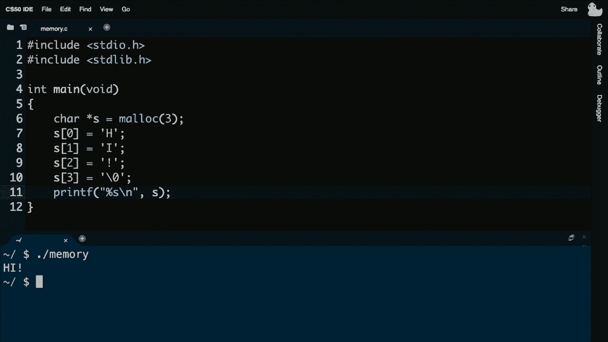

如果你使用 `malloc` 请求了四个字节，你会得到这些字节的第一个地址。你需要记住你请求了多少字节。对于 `free`，你只需告诉它 `malloc` 返回给你的地址。

例如，如果你将 `malloc` 返回的地址存储在变量 `t` 中，当你完成那段内存的使用时，只需调用 `free(t)`。计算机会为你释放那段内存。之后你可能再次得到它，但至少你的计算机不会那么快耗尽内存，因为它现在可以将那段空间重用于其他用途。

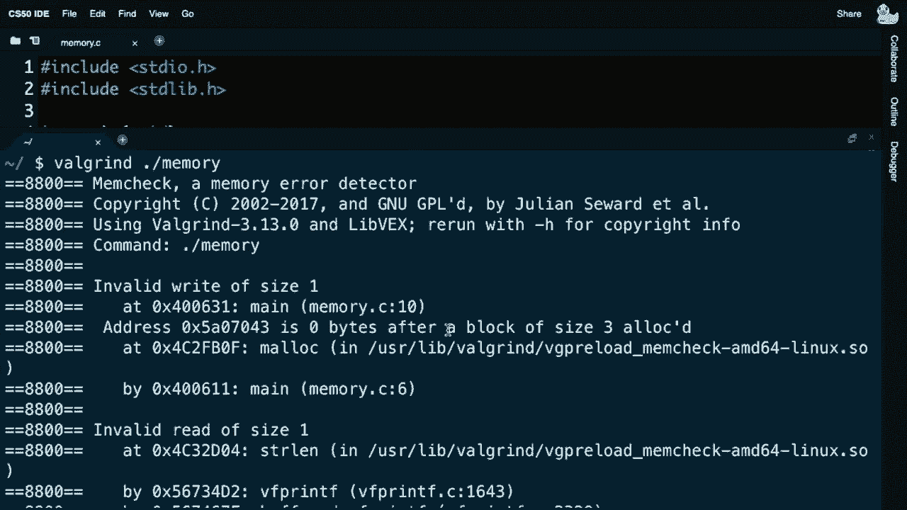

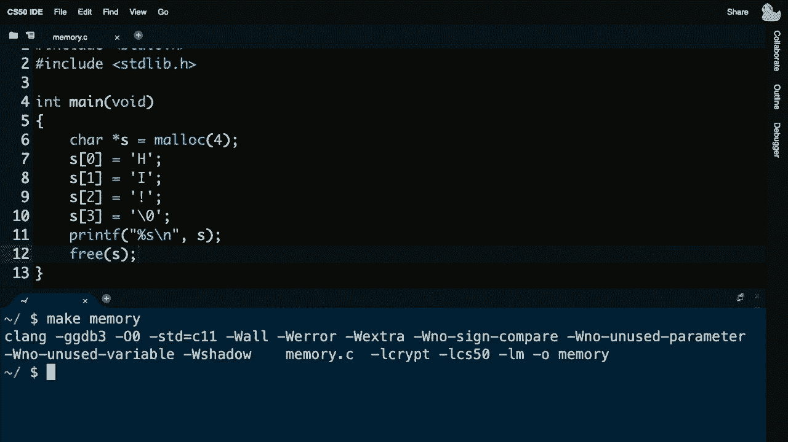

以下是核心操作的代码描述：
```c
char *t = malloc(4); // 分配4个字节
// ... 使用 t ...
free(t); // 释放内存
```

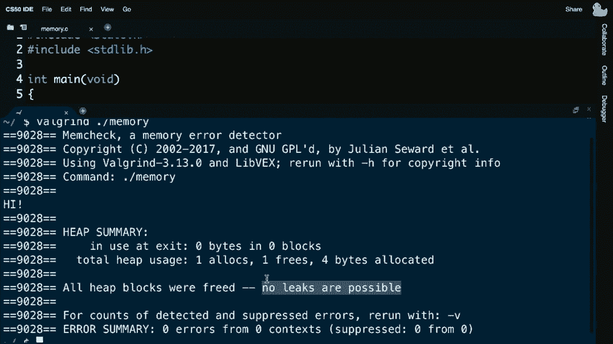

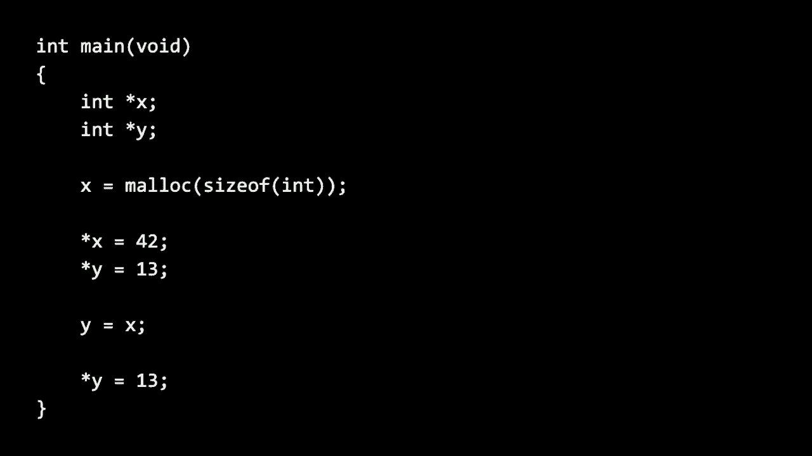

### 内存布局与程序状态

让我们绘制一幅图来展示程序在内存中的新状态。假设我们复制一个字符串。原始的字符串 `s` 指向 "hi!"。当我们使用 `malloc` 为新字符串 `t` 分配内存时，`malloc` 的返回值将是那段内存第一个字节的地址（例如 `0x456`）。后续的字节地址会依次递增（`0x457`, `0x458`...）。当我们把 `malloc` 的返回值赋给 `t` 时，`t` 中存储的就是那个起始地址。

指针的抽象表示就是一个指向内存中实际位置的箭头。现在，如果我们在 `for` 循环中复制 `s` 到 `t`，我们会将 `'h'`、`'i'`、`'!'` 和终止空字符 `'\0'` 逐个从 `s` 复制到 `t` 指向的内存位置。

现在的图景从根本上不同了：`t` 不再指向和 `s` 相同的内容，它指向自己独立的一块内存，并且其中逐步复制了所有字符。这显然是一个合适的程序副本。


### 关于 `strcpy` 和 `free`


即使你使用 `strcpy` 函数来复制字符串，而不是手动逐个字符复制，你仍然需要使用 `free` 来释放内存。每次使用 `malloc` 后，你必须使用 `free`。`strcpy` 只是将一块内存的内容复制到另一块，它并不为你分配或管理目标内存。它本质上实现了那个复制循环。

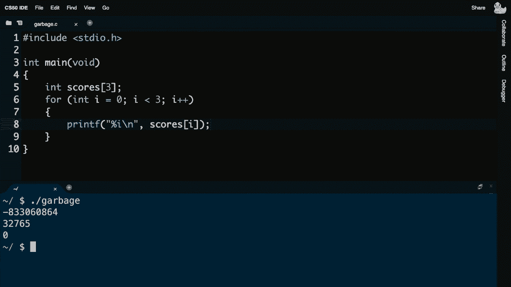

`cs50` 库中的 `get_string` 函数在内部使用了 `malloc` 来确保有足够的内存存储输入的字符串，并且库在幕后为你调用了 `free`。然而，当你自己使用 `malloc` 时，你必须负责调用 `free`。


## 🔍 检测内存错误：Valgrind 工具

引入这些新技术的同时，我们也需要工具来处理可能出现的、与内存相关的复杂问题。值得庆幸的是，有一个叫做 `valgrind` 的程序可以帮助你。

`valgrind` 程序存在于 CS50 IDE、Mac、PC 和 Linux 计算机上。它可以检测你在内存方面可能犯的错误。

你可能会在内存方面犯什么错？例如，之前我们触发的分段错误，就是因为触碰了不该触碰的内存。`valgrind` 可以帮助你找出触碰非法内存的位置。此外，`valgrind` 还可以检测你是否忘记了调用 `free`，这种情况称为**内存泄漏**。

内存泄漏与我们日常使用的设备也相关。如果你长时间使用电脑或手机，打开了很多浏览器标签页和程序，设备可能会变得非常缓慢。这可能是因为某个程序存在内存泄漏，从未释放它分配的内存。每个浏览器标签页都可能在使用 `malloc` 请求内存来存储网页内容。如果你不断打开新标签，就像不断调用 `malloc`，最终可能耗尽内存。

### 如何使用 Valgrind

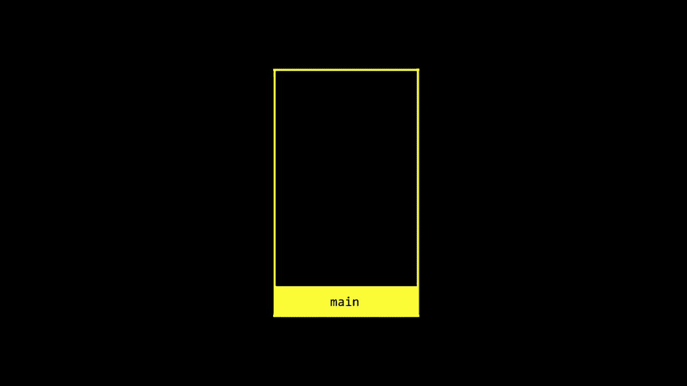

`valgrind` 是一个命令行工具。为了演示，我们创建一个包含多个内存错误的程序 `memory.c`。

以下是 `memory.c` 的一个有问题的示例：
```c
#include <stdio.h>
#include <stdlib.h>

int main(void)
{
    char *s = malloc(3); // 只分配了3个字节
    s[0] = 'H';
    s[1] = 'i';
    s[2] = '!';
    s[3] = '\0'; // 错误：写入第4个字节（无效写入）
    printf("%s\n", s); // 错误：读取了未分配的内存（无效读取）
    // 忘记调用 free(s); （内存泄漏）
    return 0;
}
```
编译并运行这个程序，它可能看起来正常工作。但使用 `valgrind` 检查时，它会报告“无效写入”、“无效读取”和“内存泄漏”错误。

`valgrind` 的输出可能看起来很复杂，但关键信息会指出错误发生的行号（例如“第10行无效写入”）。通过修复这些错误（分配足够内存、释放内存），再次运行 `valgrind`，输出会显示“所有堆块都被释放…没有泄漏是可能的”，这表明内存管理是正确的。

从本周的问题集开始，即使你的代码看起来正确，输出也正确，也请使用 `valgrind` 来追查潜在的错误。

## ⚠️ 未初始化的指针与垃圾值

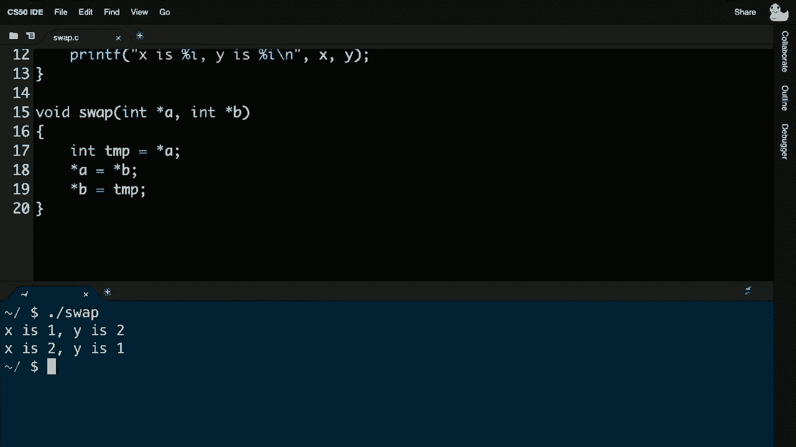


到目前为止，我们几乎总是初始化变量。但如果我们不初始化，计算机会怎么做？考虑以下代码：
```c
int *x;
int *y;
x = malloc(sizeof(int));
*x = 42;
*y = 13; // 危险：y 未初始化！
```
这里，我们声明了两个指针 `x` 和 `y`，但只给 `x` 分配了内存并赋值。`y` 没有被初始化，它包含一个所谓的**垃圾值**——一个看似是地址但无效的随机值。当执行 `*y = 13` 时，程序试图向这个虚假地址写入数据，这很可能导致程序崩溃（分段错误）。

你永远不应该信任计算机内存中未初始化的内容。一个编程术语叫做“垃圾值”。如果你自己没有放入一个值，你应该安全地假设内存中的那个位置是一个垃圾值。

我们可以用一个小程序来观察垃圾值：
```c
#include <stdio.h>
int main(void)
{
    int scores[3]; // 未初始化的数组
    for (int i = 0; i < 3; i++)
    {
        printf("%i\n", scores[i]); // 打印垃圾值
    }
}
```
运行这个程序，你会看到一些无法预测的数值，这就是之前留在内存中的“垃圾”。

## 🔄 指针在函数参数传递中的应用

让我们回顾一个基本操作：交换两个值。在排序算法中，交换频繁发生。考虑这个简单的交换程序：
```c
#include <stdio.h>
void swap(int a, int b); // 原型
int main(void)
{
    int x = 1;
    int y = 2;
    printf("x is %i, y is %i\n", x, y);
    swap(x, y);
    printf("x is %i, y is %i\n", x, y); // x 和 y 并未交换！
}
void swap(int a, int b)
{
    int tmp = a;
    a = b;
    b = tmp;
    printf("a is %i, b is %i\n", a, b); // 这里 a 和 b 交换了
}
```
为什么 `x` 和 `y` 没有交换？这是因为 C 语言是“按值传递”的。当 `swap(x, y)` 被调用时，`x` 和 `y` 的**值**（1 和 2）被复制给了函数参数 `a` 和 `b`。函数内部交换的只是副本 `a` 和 `b`，原始的 `x` 和 `y` 并未被触及。

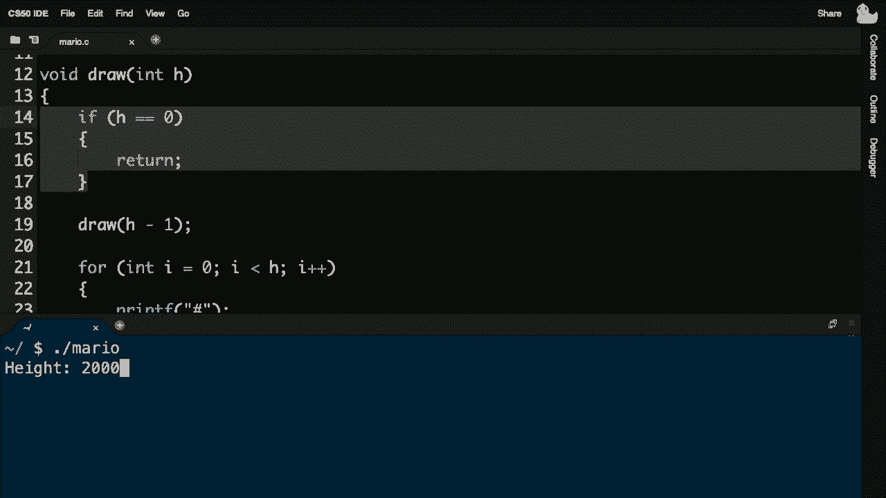

为了真正交换 `x` 和 `y`，我们需要传递它们的**地址**，让函数能够修改原始内存位置的内容。这就需要使用指针。

修改后的 `swap` 函数：
```c
#include <stdio.h>
void swap(int *a, int *b); // 原型：参数是指向 int 的指针
int main(void)
{
    int x = 1;
    int y = 2;
    printf("x is %i, y is %i\n", x, y);
    swap(&x, &y); // 传递 x 和 y 的地址
    printf("x is %i, y is %i\n", x, y); // 成功交换！
}
void swap(int *a, int *b) // 接收地址
{
    int tmp = *a; // 获取 a 地址处的值
    *a = *b;      // 将 b 地址处的值放到 a 的地址
    *b = tmp;     // 将临时值放到 b 的地址
}
```
现在，`swap` 函数接收的是指向整数的指针（即地址）。通过解引用操作符 `*`，我们可以访问和修改这些地址所指向的原始值，从而实现了真正的交换。


## 🏗️ 栈与堆的内存模型

理解函数调用和内存分配有助于我们看清上面交换例子背后的原理。计算机内存被不同区域使用：
*   **机器码**：程序的指令位于内存顶部。
*   **全局变量**：位于机器码下方。
*   **堆**：用于动态内存分配（如 `malloc`）。当调用 `malloc` 时，内存从堆中分配，地址向上增长。
*   **栈**：用于函数调用。当调用函数时，其参数和局部变量在栈上分配，地址向下增长。

每次调用函数，都会在栈上使用一块称为“栈帧”的内存。当函数返回，它的栈帧就被释放（但内容可能残留为垃圾值）。在之前的错误 `swap` 中，`main` 的栈帧中有 `x` 和 `y`，`swap` 的栈帧中有 `a`、`b` 和 `tmp`。`swap` 只修改了自己栈帧中的副本。

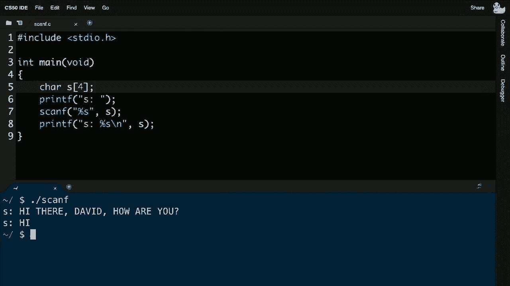

在正确的指针版本中，`swap` 的栈帧里存储的是 `x` 和 `y` 的地址（指针），通过解引用这些指针，它直接修改了 `main` 栈帧中 `x` 和 `y` 位置的值。

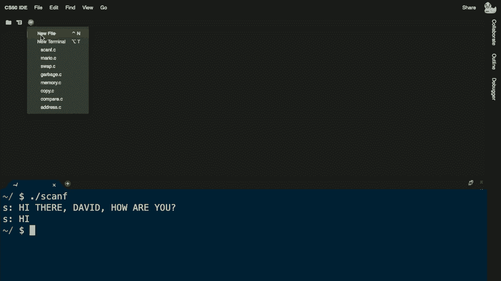

## 💥 递归与栈溢出

递归函数是调用自身的函数。例如，用递归打印一个金字塔：
```c
void draw(int h)
{
    if (h == 0) { return; } // 基本情况
    draw(h - 1); // 递归调用
    for (int i = 0; i < h; i++) { printf("#"); }
    printf("\n");
}
```
这里存在危险。每次递归调用 `draw`，都会在栈上创建一个新的栈帧。如果递归深度过大（例如 `draw(20000)`），栈空间可能会被耗尽，导致程序崩溃，这称为**栈溢出**。

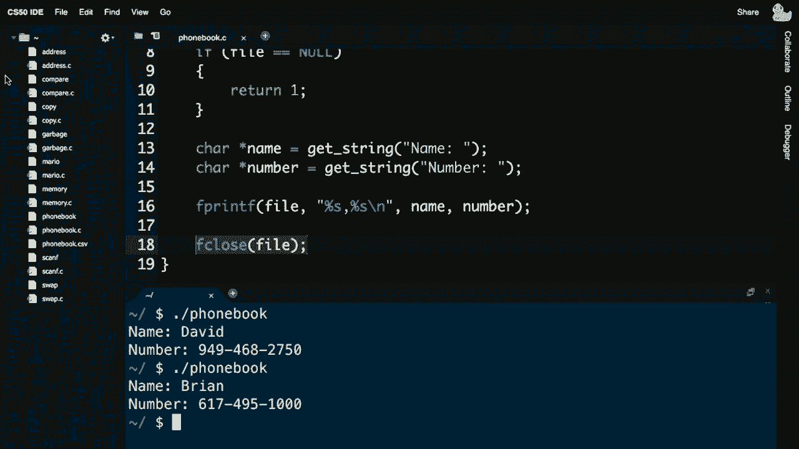

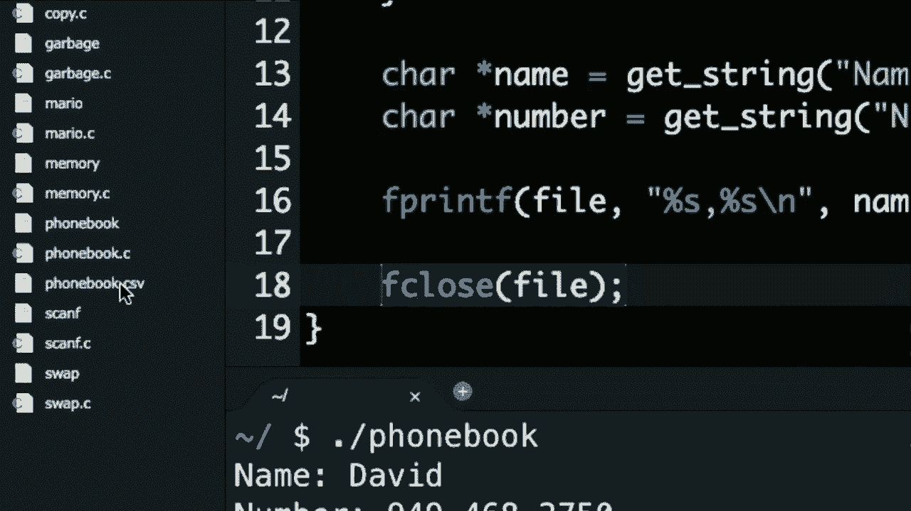

迭代版本通常没有这个风险，因为它只使用固定次数的循环，不会增加栈帧。选择递归还是迭代，需要权衡代码的优雅性与潜在的风险。

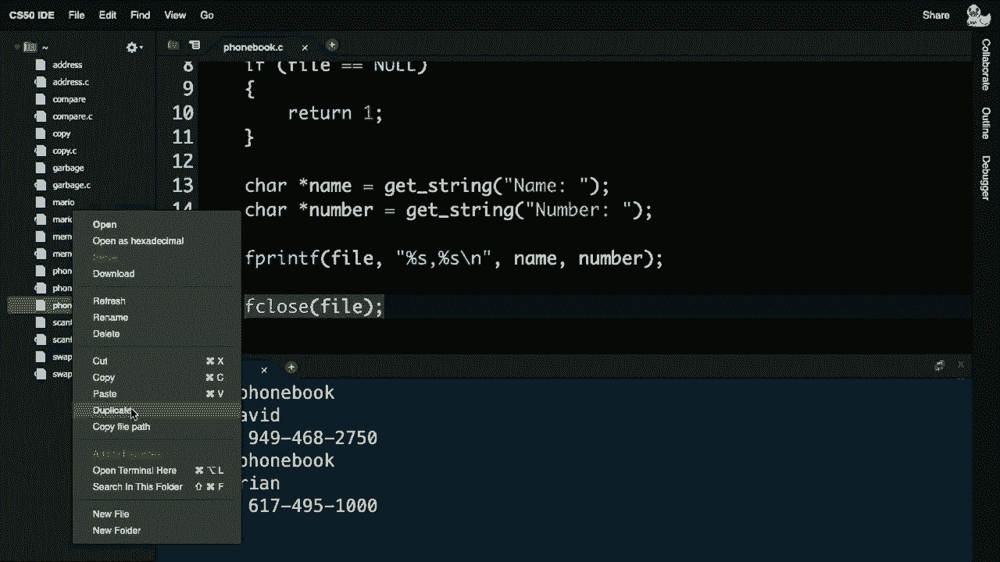


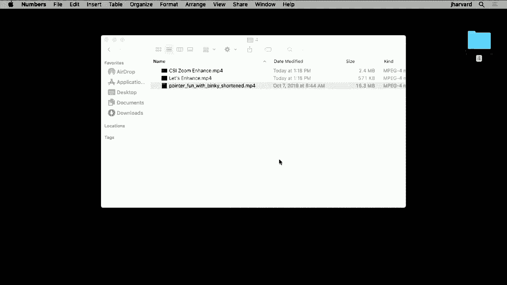

## 📄 文件输入输出

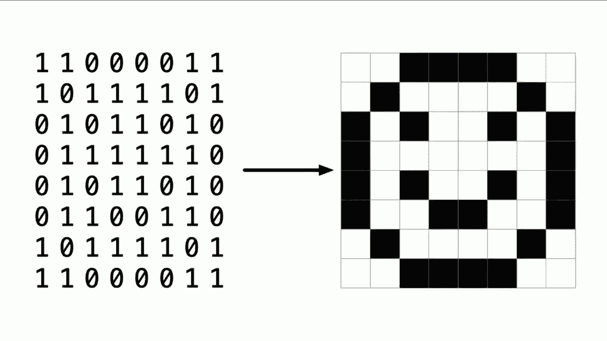


到目前为止，我们的程序几乎只使用内存，程序结束后数据就消失了。文件则允许我们永久保存数据。在 C 语言中，我们可以使用文件 I/O 操作来读写文件。


### 基本文件操作


以下是一个将联系人信息保存到文件的简单电话簿程序：
```c
#include <cs50.h>
#include <stdio.h>
#include <string.h>
int main(void)
{
    FILE *file = fopen("phonebook.csv", "a"); // 以追加模式打开文件
    if (file == NULL) { return 1; } // 检查文件是否成功打开
    char *name = get_string("Name: ");
    char *number = get_string("Number: ");
    fprintf(file, "%s,%s\n", name, number); // 写入文件
    fclose(file); // 关闭文件
}
```
*   `FILE *` 是一个指向文件的数据类型。
*   `fopen` 打开文件，第一个参数是文件名，第二个参数是模式（`"r"` 读，`"w"` 写，`"a"` 追加）。
*   `fprintf` 类似于 `printf`，但是将格式化的字符串写入指定的文件。
*   `fclose` 关闭文件，确保所有数据都写入磁盘。

运行此程序后，会在当前目录生成一个 `phonebook.csv` 文件，内容可以用电子表格软件打开。

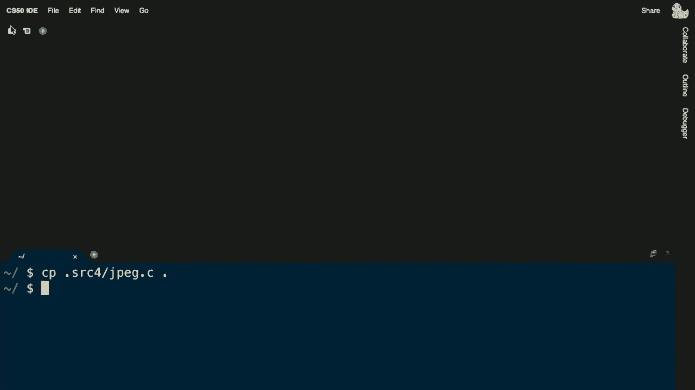

### 读取文件与文件格式识别

我们也可以读取文件。例如，判断一个文件是否为 JPEG 图片。JPEG 文件的开头有几个特定的“魔数”字节。
```c
#include <stdint.h>
typedef uint8_t BYTE; // 定义 BYTE 类型为 8 位无符号整数
bool is_jpeg(FILE *file)
{
    BYTE buffer[3];
    fread(buffer, sizeof(BYTE), 3, file); // 从文件读取3个字节到缓冲区
    // 检查是否是 JPEG 的魔数
    if (buffer[0] == 0xff && buffer[1] == 0xd8 && buffer[2] == 0xff)
    {
        return true;
    }
    return false;
}
```
*   `fread` 从文件读取数据到内存中的缓冲区。
*   许多文件格式（如图片、文档）都有独特的起始字节序列，用于识别文件类型。

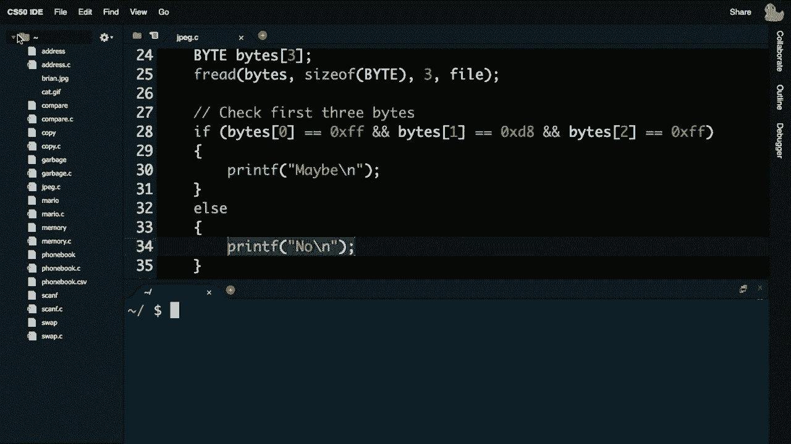


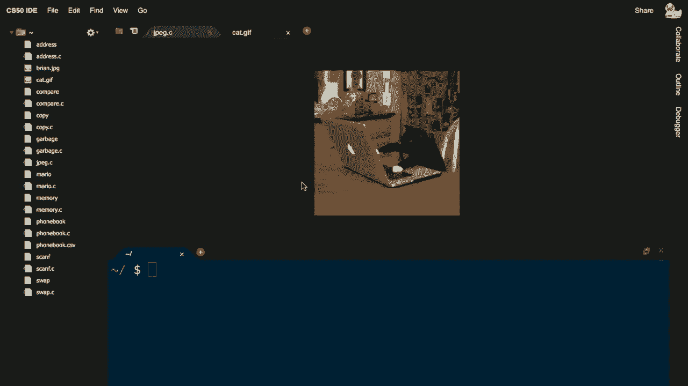

### 复制文件

我们甚至可以重新实现 `cp` 命令来复制文件：
```c
#include <stdint.h>
#include <stdio.h>
typedef uint8_t BYTE;
int main(int argc, char *argv[])
{
    if (argc != 3) { return 1; } // 检查参数数量
    FILE *source = fopen(argv[1], "r");
    FILE *destination = fopen(argv[2], "w");
    BYTE buffer;
    while (fread(&buffer, sizeof(BYTE), 1, source))
    {
        fwrite(&buffer, sizeof(BYTE), 1, destination);
    }
    fclose(source);
    fclose(destination);
}
```
这个程序打开源文件用于读取，打开目标文件用于写入，然后逐个字节地从源文件读取并写入目标文件，最终实现文件复制。

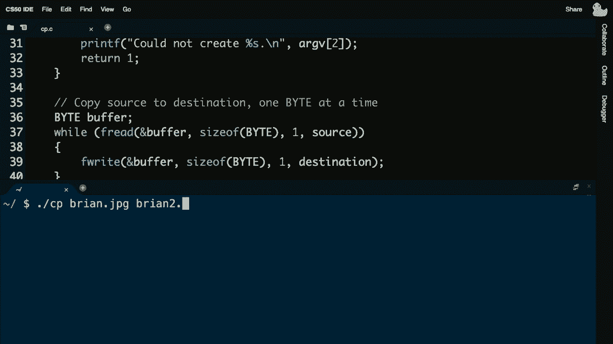

## 🎯 总结


本节课中我们一起学习了：
1.  **内存管理**：使用 `malloc` 动态分配内存，并必须使用 `free` 释放，避免内存泄漏。
2.  **调试工具**：使用 `valgrind` 检测内存错误，如无效访问和内存泄漏。
3.  **指针深入**：理解了未初始化指针的危险（垃圾值），以及如何通过传递指针（地址）让函数修改调用者的变量。
4.  **内存布局**：了解了栈（用于函数调用）和堆（用于动态分配）的基本概念，以及递归可能导致的栈溢出问题。
5.  **文件 I/O**：学习了如何使用 `fopen`、`fprintf`、`fscanf`、`fread`、`fwrite` 和 `fclose` 来读写文件，实现数据的持久化存储。

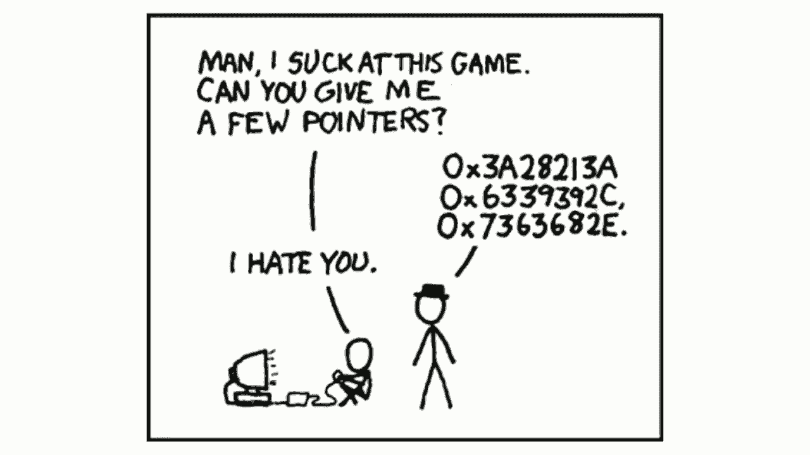

这些概念是进行系统编程和深入理解计算机如何工作的基石。在接下来的问题集中，你将有机会应用这些知识，例如恢复已删除的图片文件或为图片实现滤镜效果。