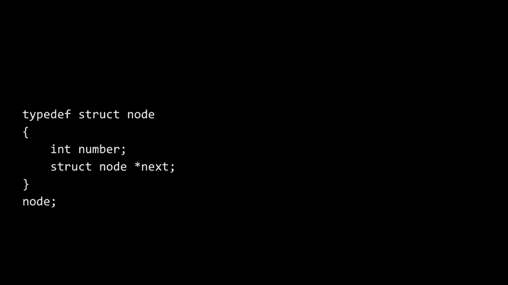
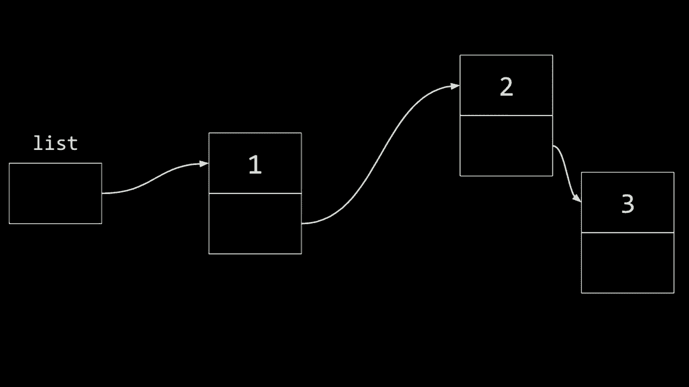
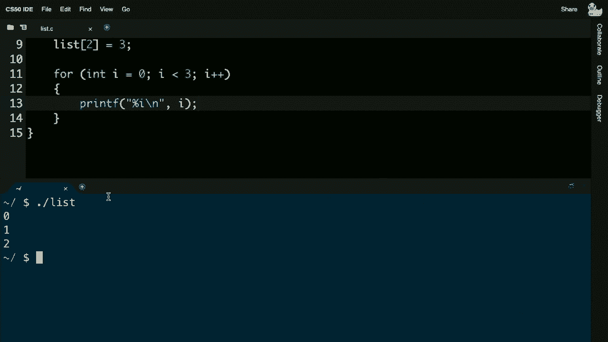
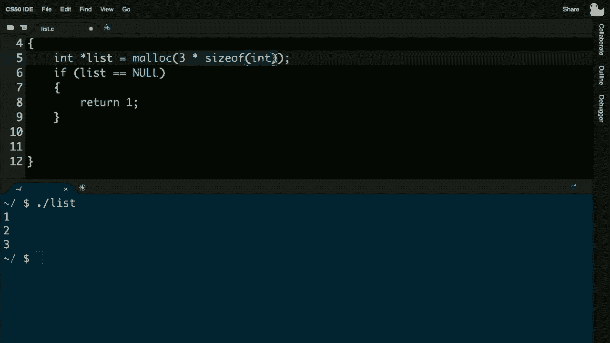
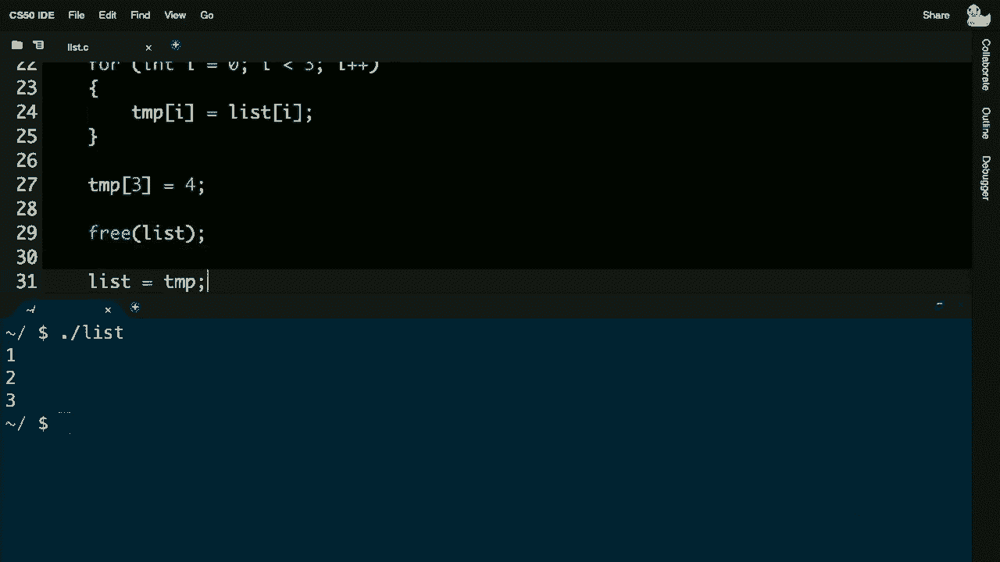
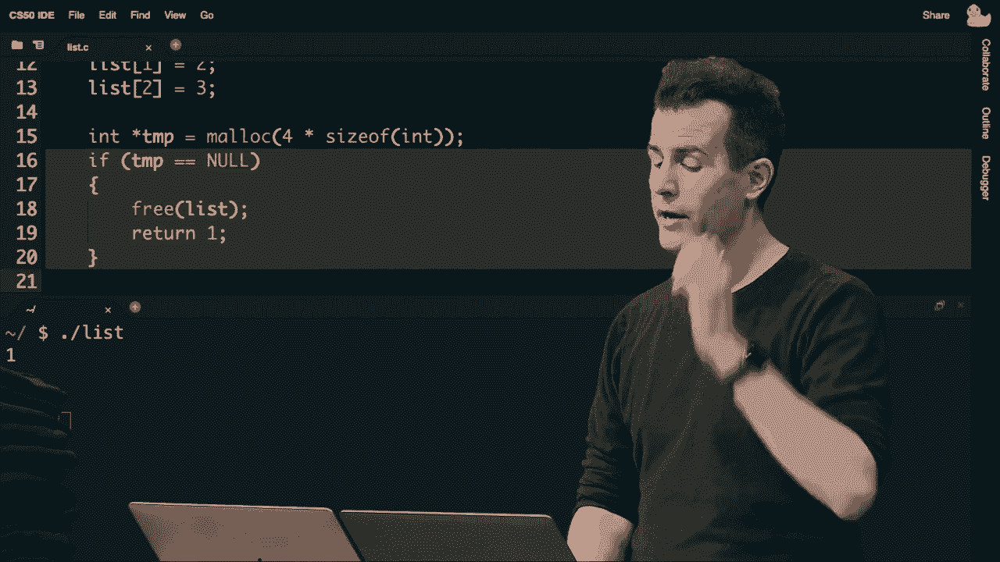
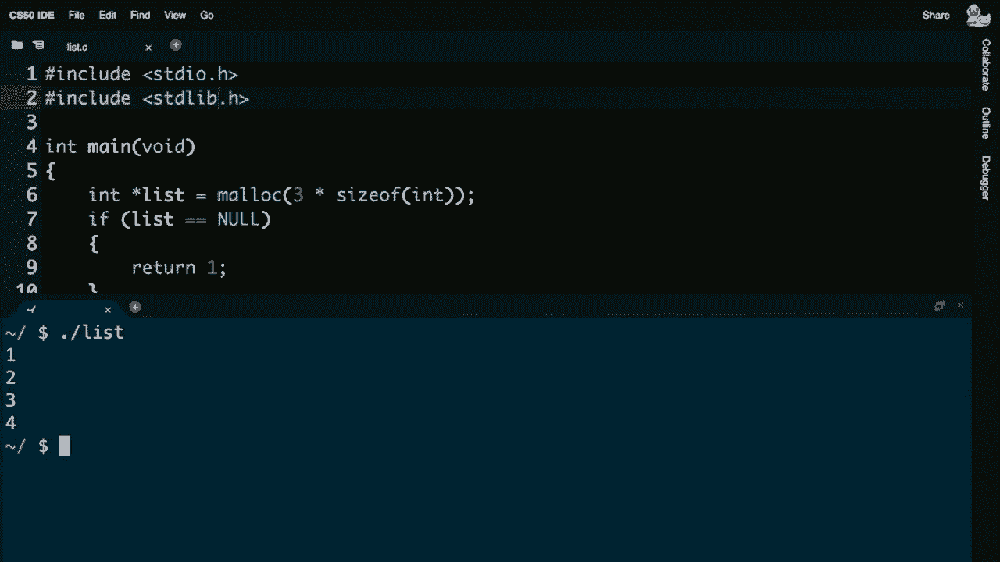
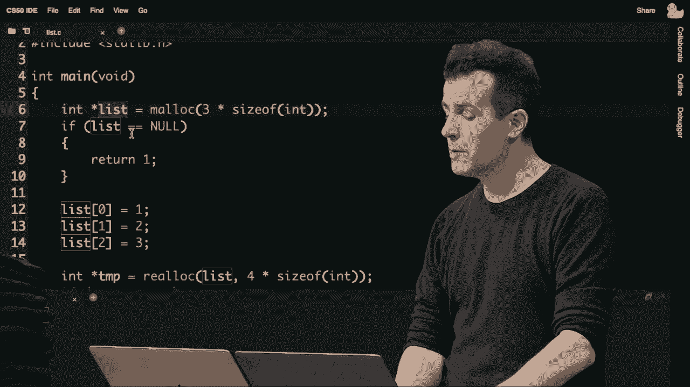
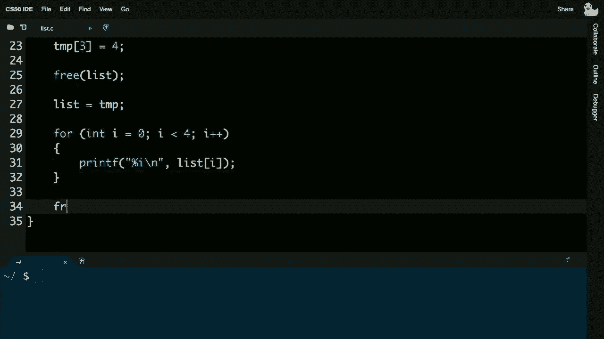
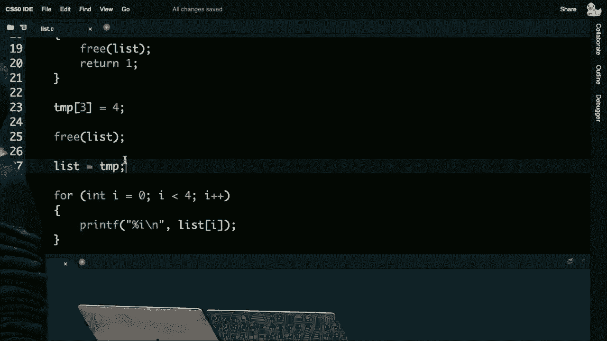

# 哈佛 CS50课程笔记 📚｜ 计算机科学导论(2020·完整版) - P10：L5- 数据结构 1（数组、链表、树、哈希表、字典树、堆、栈、队列）


## 概述


在本节课中，我们将要学习数据结构的基础知识。我们将从回顾数组开始，探讨其局限性，并学习如何使用指针来构建更灵活、更动态的数据结构——链表。我们将通过代码示例来理解这些概念，并分析不同操作的运行时间。

---

## 回顾数组

回想一下，在第二周我们介绍了数组的概念。数组是内存中一个连续的块，用于存储一系列相同类型的值，例如整数。


例如，一个大小为3的整数数组可以这样表示：
```c
int array[3] = {1, 2, 3};
```
在内存中，这三个整数会一个接一个地连续存放。


然而，数组有一个主要的限制：一旦创建，其大小就固定了。如果你想向一个已满的数组添加新元素，你不能简单地扩展它，因为数组后面的内存可能已经被其他数据占用。


## 数组的插入问题


假设我们有一个大小为3的数组，包含数字1、2、3。现在，我们想添加数字4。由于数组是连续的，而数组末尾之后的内存可能已被占用（例如，存储着字符串“hello, world”），我们无法直接将4放在数组后面。

一个直观的解决方案是创建一个新的、更大的数组（例如大小为4），将旧数组的所有元素复制到新数组中，然后在新数组的末尾添加新元素。最后，释放旧数组的内存。

这个过程可以用以下伪代码表示：
```c
// 假设已有数组 `old_array` 大小为 3
int *new_array = malloc(4 * sizeof(int));
for (int i = 0; i < 3; i++) {
    new_array[i] = old_array[i];
}
new_array[3] = 4;
free(old_array);
// 现在 `new_array` 是大小为4的新数组
```

## 插入操作的运行时间分析


让我们分析一下向数组中插入一个元素的运行时间。


*   **最坏情况（上限 O(n)）**：当数组已满时，我们需要将全部 n 个元素复制到新数组中。这需要 n 步操作，因此运行时间是 **O(n)**。
*   **最好情况（下限 Ω(1)）**：如果数组尚未满，有可用空间，我们可以直接将新元素放入空位。由于数组支持随机访问（通过索引直接跳转到任何位置），这一步是常数时间操作，即 **Ω(1)**。

因此，数组插入的时间复杂度在 **Ω(1)** 和 **O(n)** 之间。


数组是我们遇到的第一个也是最简单的数据结构。但它的固定大小特性限制了其灵活性。现在，借助指针（可以引用内存地址），我们可以构建更复杂、更动态的数据结构。

---



## 引入链表


上一节我们介绍了数组及其在插入操作上的局限性。本节中我们来看看一种更动态的数据结构——链表。


链表由一系列“节点”组成，每个节点包含两部分：
1.  实际存储的数据（例如，一个整数）。
2.  一个指向下一个节点的“指针”（即内存地址）。


通过这种方式，节点可以分散在内存的任何位置，而不必连续存放。每个节点通过指针“链接”到下一个节点，从而形成一条链。

### 链表的表示

假设我们想存储数字1、2、3。在链表中，它可能看起来像这样（地址是示例）：
*   节点1： 数据 = 1， 下一个指针 = 0x456 (节点2的地址)
*   节点2： 数据 = 2， 下一个指针 = 0x789 (节点3的地址)
*   节点3： 数据 = 3， 下一个指针 = NULL (表示链表结束)


`NULL` 是一个特殊值，表示指针不指向任何有效地址，在这里标识链表的末尾。


抽象地看，链表可以图示为：
```
[1] -> [2] -> [3] -> NULL
```
每个方框代表一个节点，箭头代表指针。

### 在C语言中定义链表节点

我们可以使用C语言中的 `struct` 来定义节点：
```c
typedef struct node
{
    int number;
    struct node *next;
}
node;
```
这段代码定义了一个名为 `node` 的新类型。每个 `node` 包含一个整数 `number` 和一个指向另一个 `node` 的指针 `next`。`typedef` 允许我们之后直接使用 `node` 而不是 `struct node`。

### 链表的构建过程

构建链表通常从一个指向 `NULL` 的指针开始，表示一个空链表。
```c
node *list = NULL;
```
然后，我们动态创建并连接节点：
1.  使用 `malloc` 为新节点分配内存。
2.  检查分配是否成功（指针是否为 `NULL`）。
3.  初始化节点的数据和指针。
4.  将新节点链接到链表中的适当位置。

以下是逐步构建一个包含1、2、3的链表的代码概念：
```c
// 创建第一个节点
node *n = malloc(sizeof(node));
if (n != NULL) {
    (*n).number = 1; // 或 n->number = 1;
    n->next = NULL;
}
list = n; // 链表现在指向第一个节点

// 创建并链接第二个节点
n = malloc(sizeof(node));
if (n != NULL) {
    n->number = 2;
    n->next = NULL;
    list->next = n; // 第一个节点指向第二个
}

// 创建并链接第三个节点
n = malloc(sizeof(node));
if (n != NULL) {
    n->number = 3;
    n->next = NULL;
    list->next->next = n; // 第二个节点指向第三个
}
```
注意：在实际程序中，我们会使用循环来避免这种重复且冗长的代码，并更优雅地遍历链表来找到插入点。

### 链表的优缺点




*   **优点（动态大小）**：可以轻松地添加或移除节点，无需像数组那样复制所有现有元素。只需调整指针即可。
*   **缺点（内存开销和访问速度）**：每个节点都需要额外的内存来存储指针。此外，你无法像数组那样通过索引直接访问任意元素（随机访问）。要找到第 i 个元素，必须从链表头开始，沿着指针逐个遍历 i 个节点。


### 链表操作的运行时间分析


以下是链表常见操作的时间复杂度分析：


*   **搜索**：在最坏情况下，可能需要遍历所有 n 个节点才能找到目标或确认其不存在。因此，搜索的运行时间是 **O(n)**。
*   **插入（在开头）**：如果不在乎顺序，在链表开头插入一个新节点是常数时间操作。只需创建节点，让其指向原来的链表头，然后更新链表头指针。这只需要固定几步，运行时间是 **O(1)**。
*   **插入（在末尾或特定位置）**：如果需要在链表末尾或保持排序顺序插入，则需要先遍历链表找到正确位置，这需要 **O(n)** 时间，然后执行常数时间的指针调整。


因此，链表在需要频繁在开头插入元素时非常高效，但牺牲了随机访问和有序插入的效率。


---

## 从数组代码到链表代码



上一节我们探讨了链表的理论概念。本节中我们通过一个具体的代码演变示例，看看如何从使用数组和 `malloc` 的代码过渡到使用链表的代码。


### 版本1：使用固定大小数组

```c
#include <stdio.h>




int main(void)
{
    int list[3];
    list[0] = 1;
    list[1] = 2;
    list[2] = 3;

    for (int i = 0; i < 3; i++)
    {
        printf("%i\n", list[i]);
    }
}
```
这个程序使用栈分配的固定大小数组。大小无法改变。

### 版本2：使用 `malloc` 模拟动态数组

```c
#include <stdio.h>
#include <stdlib.h> // 包含 malloc 和 free



int main(void)
{
    // 动态分配相当于大小为3的数组
    int *list = malloc(3 * sizeof(int));
    if (list == NULL)
    {
        return 1;
    }

    list[0] = 1;
    list[1] = 2;
    list[2] = 3;

    // 现在假设我们需要添加数字4
    int *temp = malloc(4 * sizeof(int));
    if (temp == NULL)
    {
        free(list);
        return 1;
    }

    // 复制旧数组到新数组
    for (int i = 0; i < 3; i++)
    {
        temp[i] = list[i];
    }
    temp[3] = 4; // 添加新值

    free(list);    // 释放旧内存
    list = temp;   // 让 list 指向新内存

    // 打印新数组
    for (int i = 0; i < 4; i++)
    {
        printf("%i\n", list[i]);
    }

    free(list); // 最终释放内存
    return 0;
}
```
这个版本使用 `malloc` 在堆上分配内存，并手动实现“调整大小”：分配新内存、复制数据、释放旧内存。插入操作仍然是 **O(n)**。



### 版本3：使用 `realloc` 简化


`realloc` 函数可以调整已分配内存块的大小，并可能自动复制数据。
```c
#include <stdio.h>
#include <stdlib.h>



int main(void)
{
    int *list = malloc(3 * sizeof(int));
    if (list == NULL)
    {
        return 1;
    }

    list[0] = 1;
    list[1] = 2;
    list[2] = 3;

    // 使用 realloc 调整大小
    int *temp = realloc(list, 4 * sizeof(int));
    if (temp == NULL)
    {
        free(list);
        return 1;
    }
    list = temp; // realloc 成功，list 指向新内存块
    list[3] = 4; // 现在可以安全地添加

    for (int i = 0; i < 4; i++)
    {
        printf("%i\n", list[i]);
    }

    free(list);
    return 0;
}
```
`realloc` 可能原地扩展内存（如果后面有空间），也可能分配新内存并复制数据。但无论如何，对于程序员来说，插入操作在逻辑上仍然是 **O(n)** 的复杂度，因为可能涉及复制。


### 向链表版本过渡



以上版本本质上还是在操作数组（连续内存块）。要获得真正的 **O(1)** 头部插入，我们需要放弃“连续”和“索引访问”的概念，转而使用节点和指针的链表结构。这将是我们接下来实践的重点，通过节点结构体和指针操作来动态管理数据。

---




## 总结




本节课中我们一起学习了数据结构的基础，重点比较了数组和链表：


1.  **数组**：内存连续，支持快速随机访问（O(1)），但大小固定，插入/删除元素（特别是在需要调整大小时）可能较慢（O(n)）。
2.  **链表**：由节点通过指针链接而成，内存不必连续。它可以动态增长和收缩。在链表开头插入/删除节点很快（O(1)），但随机访问元素较慢（O(n)），因为需要从头遍历。
3.  **权衡**：在编程中经常面临权衡。链表用额外的内存开销（存储指针）和更慢的访问速度，换来了动态插入的灵活性。选择哪种数据结构取决于程序最频繁的操作是什么。


我们还回顾了使用 `malloc`、`free` 和 `realloc` 进行动态内存管理，这是构建链表等动态数据结构的基础。在接下来的课程中，我们将继续探索其他更复杂的数据结构。