# 哈佛 CS50｜计算机科学导论(2020·完整版) - P11：L5- 数据结构 2（数组、链表、树、哈希表、字典树、堆、栈、队列） 📚

在本节课中，我们将要学习多种核心数据结构，包括数组、链表、树、哈希表、字典树、堆、栈和队列。我们将探讨它们各自的优缺点、实现原理以及适用场景，并通过代码和公式来理解其核心概念。

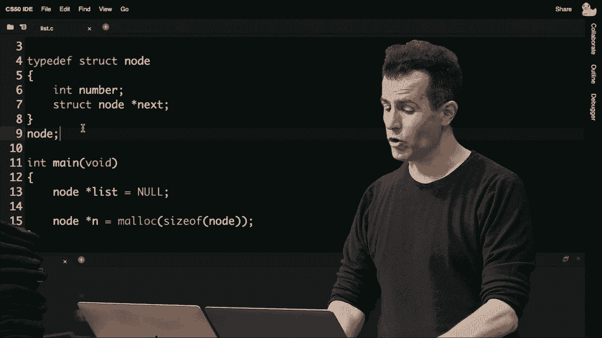


---

## 回顾数组与链表的权衡 🔄

上一节我们介绍了数组和链表的基本概念。数组在搜索时表现良好，但动态修改（如插入或删除）的成本非常高，可能需要O(n)步来复制数据到新数组。为了避免这种高成本，我们引入了指针和链表。

链表通过指针将节点连接在一起，带来了动态性。插入操作可以实现常数时间O(1)，但牺牲了像可排序性这样的特性，并且增加了内存消耗。

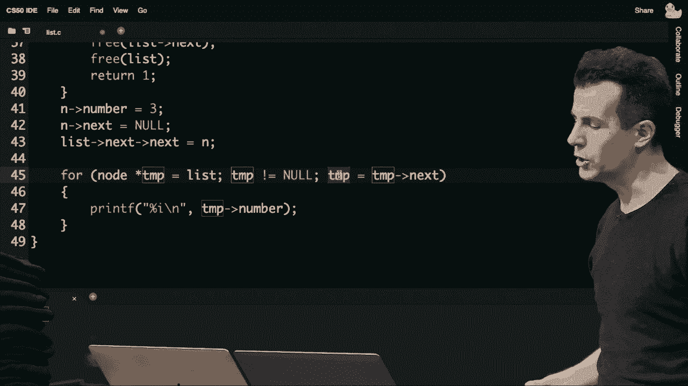

以下是链表节点的基本结构定义：
```c
typedef struct node
{
    int number;
    struct node *next;
}
node;
```

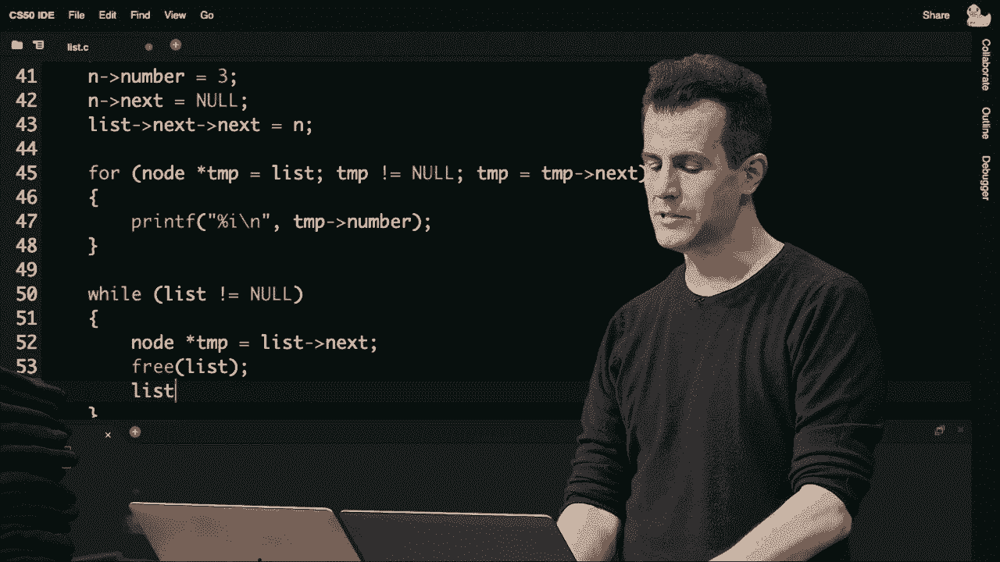

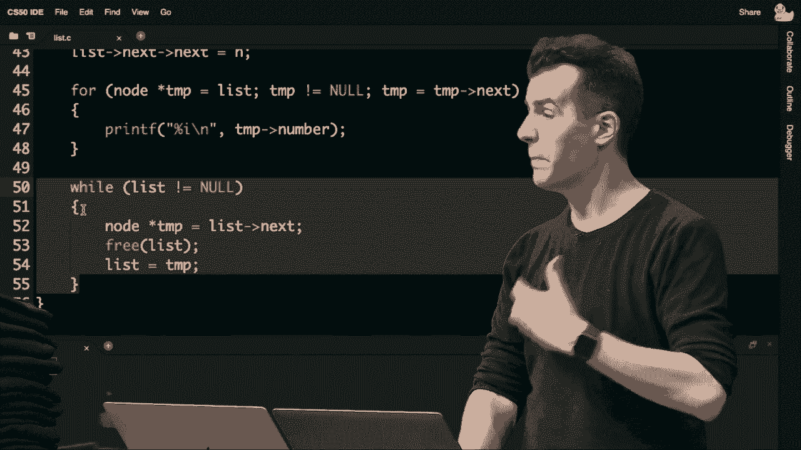

---

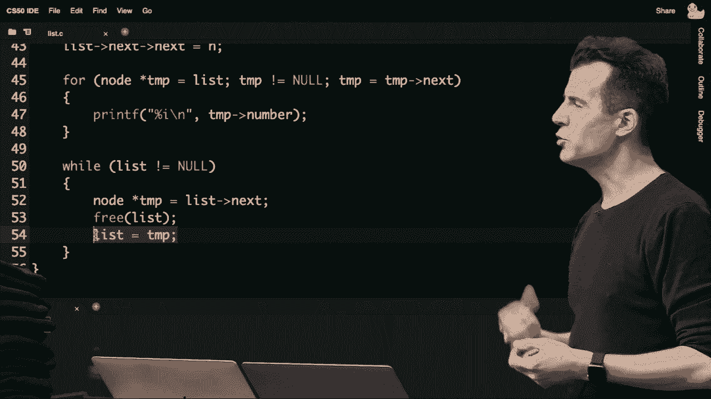

## 链表的C语言实现 🧱

本节中我们来看看如何在C语言中实现一个简单的链表。我们将逐步构建链表，并演示插入和遍历操作。

首先，我们需要在`main`函数内部声明节点类型并初始化一个空链表。将指针初始化为`NULL`至关重要，以避免指向垃圾内存导致段错误。

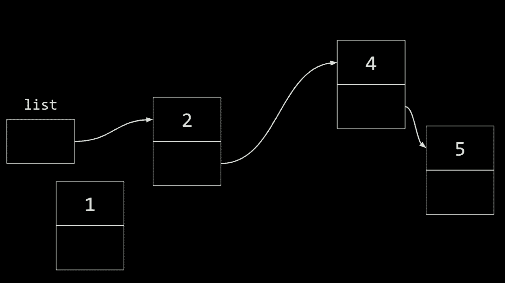


```c
node *list = NULL;
```


假设我们想依次插入数字1、2、3。以下是插入第一个节点的步骤：


1.  使用`malloc`分配一个新节点。
2.  检查分配是否成功（是否为`NULL`）。
3.  初始化节点的`number`字段。
4.  将节点的`next`指针设为`NULL`。
5.  更新`list`指针，使其指向新节点。

```c
node *n = malloc(sizeof(node));
if (n == NULL)
{
    return 1;
}
n->number = 1;
n->next = NULL;
list = n;
```

插入后续节点（如数字2）时，我们需要遍历到链表末尾，然后将最后一个节点的`next`指针指向新节点。

```c
n = malloc(sizeof(node));
if (n == NULL)
{
    free(list);
    return 1;
}
n->number = 2;
n->next = NULL;
node *tmp = list;
while (tmp->next != NULL)
{
    tmp = tmp->next;
}
tmp->next = n;
```

为了遍历并打印链表中的所有值，我们可以使用一个`for`循环：

```c
for (node *tmp = list; tmp != NULL; tmp = tmp->next)
{
    printf("%i\n", tmp->number);
}
```

循环结束后，务必释放所有已分配的内存以避免内存泄漏：

```c
while (list != NULL)
{
    node *tmp = list->next;
    free(list);
    list = tmp;
}
```

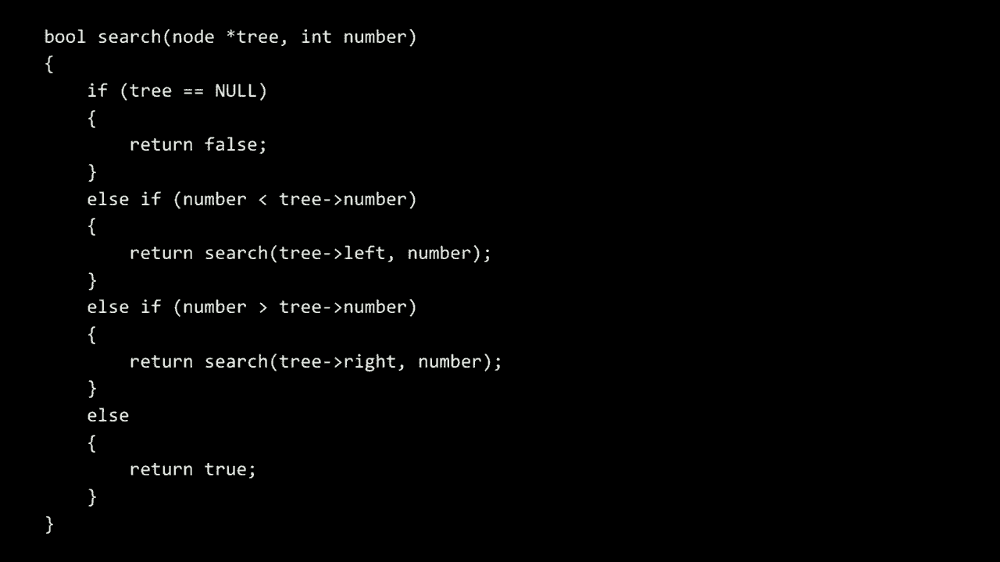

---

## 在链表中插入节点 📍

如果我们想在链表中间（例如按排序顺序）插入一个节点，操作顺序就非常重要。错误的顺序可能导致节点被孤立，从而引发内存泄漏。

例如，我们有一个包含数字2、4、5的链表，现在想插入数字1。正确的步骤是：
1.  让新节点`n`的`next`指针指向当前`list`指向的节点（即数字2）。
2.  然后更新`list`指针，使其指向新节点`n`。

```c
n->next = list;
list = n;
```

如果先执行`list = n`，就会丢失对原链表的引用，导致内存泄漏。

---

## 二叉搜索树 🌳

链表是一维结构。如果我们引入第二个维度，就可以构建树形结构，例如二叉搜索树（BST）。在BST中，任何节点的左子树所有值都小于该节点，右子树所有值都大于该节点。

这种结构结合了链表的动态性和数组的有序性，允许我们进行高效的二分搜索。

一个BST节点的结构可能如下所示：
```c
typedef struct node
{
    int number;
    struct node *left;
    struct node *right;
}
node;
```

在BST中搜索一个值的递归函数实现如下：

```c
bool search(node *tree, int number)
{
    if (tree == NULL)
    {
        return false;
    }
    else if (number < tree->number)
    {
        return search(tree->left, number);
    }
    else if (number > tree->number)
    {
        return search(tree->right, number);
    }
    else
    {
        return true;
    }
}
```

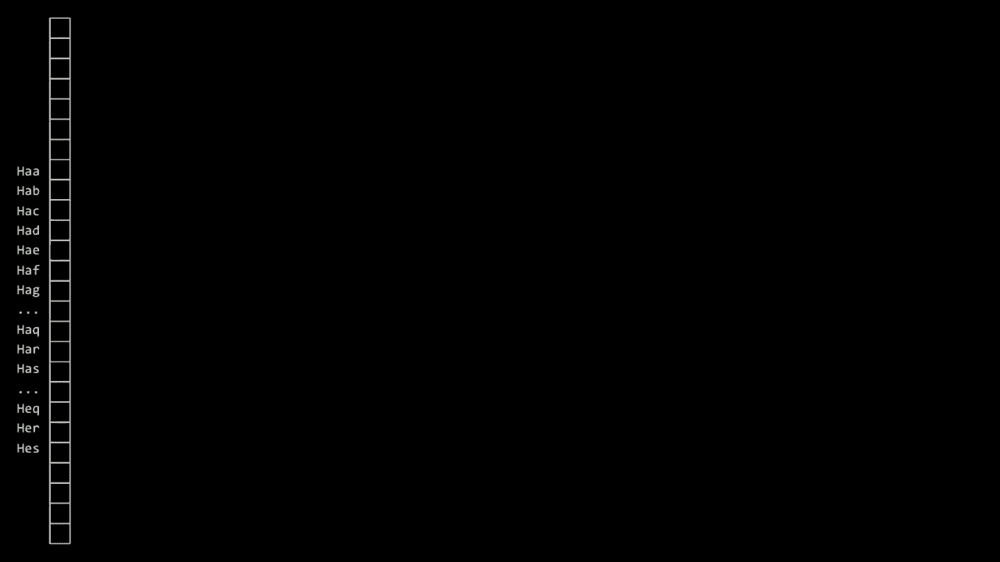

在平衡的BST中，搜索和插入的理想时间复杂度是**O(log n)**。然而，如果插入顺序不当（例如按顺序插入1,2,3），树会退化成类似链表的结构，时间复杂度恶化到**O(n)**。高级的树结构（如AVL树、红黑树）通过旋转操作保持平衡，但需要更复杂的代码。

---

## 哈希表 🗂️

哈希表是一种结合了数组和链表优点的数据结构，目标是实现平均接近常数时间**O(1)**的查找和插入。

一个简单的哈希表可以是一个链表数组。我们使用一个哈希函数将输入（例如名字）映射到数组的特定索引（桶）。例如，可以根据名字的首字母映射到0-25的索引。

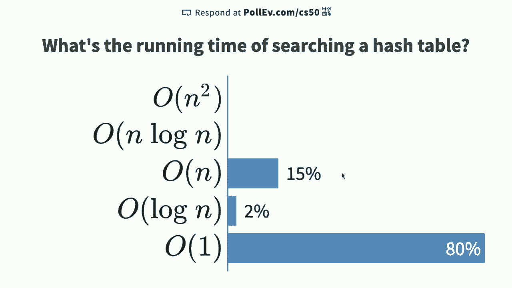

```c
int hash_function(char *name)
{
    return toupper(name[0]) - 'A';
}
```

如果多个输入映射到同一个桶（哈希冲突），我们就在该索引对应的链表中追加新节点。

哈希表的性能取决于哈希函数将数据均匀分布到各个桶的能力。如果某个链表过长，性能就会下降。优化方法包括使用更复杂的哈希函数（例如考虑前两个或三个字母），但这会增加内存开销，因为数组会变得非常稀疏。

---

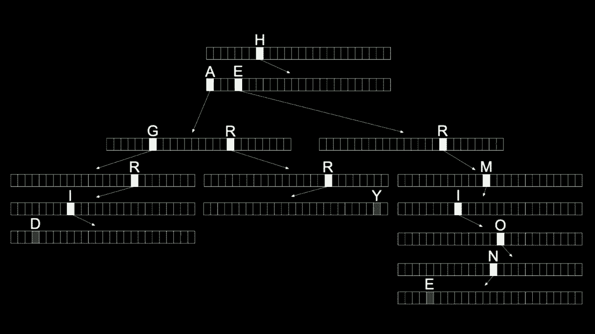

## 字典树 (Trie) 🔤

字典树（Trie）是一种树形结构，专门用于存储字符串集合。每个节点包含一个指针数组（例如对应26个字母），路径代表字符串的字符序列。


例如，存储“HAGRID”和“HARRY”：
*   从根节点开始，跟随`H`指针。
*   然后跟随`A`指针。
*   在第三个节点，`G`指针指向“HAGRID”的剩余路径，`R`指针指向“HARRY”的剩余路径。
*   在单词结尾的节点，会有一个布尔标记（如`is_word`）表示这是一个完整单词。


在Trie中查找一个单词的时间复杂度是**O(k)**，其中k是单词的长度。如果单词长度有上限，这可以视为常数时间**O(1)**。然而，Trie消耗大量内存，因为即使很多指针是`NULL`，每个节点也需要为所有可能的字符分配指针空间。

---

## 抽象数据类型：栈、队列、字典 🧾

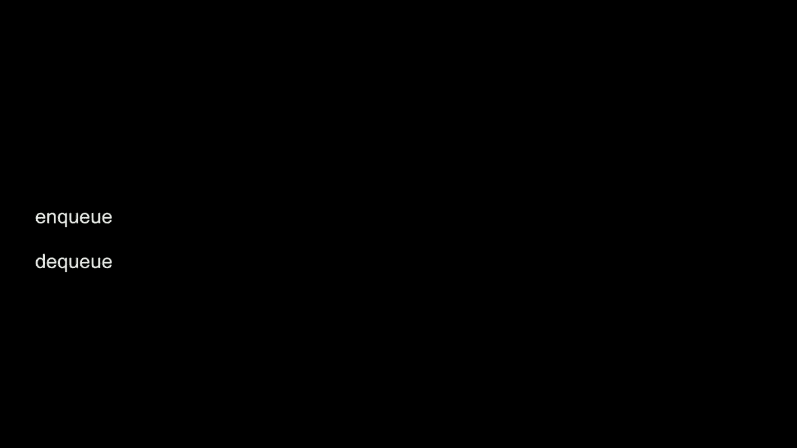

以上是底层数据结构。在此基础上，我们可以构建具有特定行为和接口的抽象数据类型（ADT）。


**栈 (Stack)** 遵循**后进先出 (LIFO)** 原则。主要操作是`push`（压入）和`pop`（弹出）。现实类比是自助餐厅的托盘架。

**队列 (Queue)** 遵循**先进先出 (FIFO)** 原则。主要操作是`enqueue`（入队）和`dequeue`（出队）。现实类比是排队等待的队伍。


**字典 (Dictionary)** 是一种将键与值关联的抽象数据类型，支持通过键插入、查找和删除值。它可以用数组、链表、哈希表或Trie等多种底层结构实现。

这些ADT的关注点在于其行为规范，而不限定底层实现，为我们提供了更高层次的编程抽象。

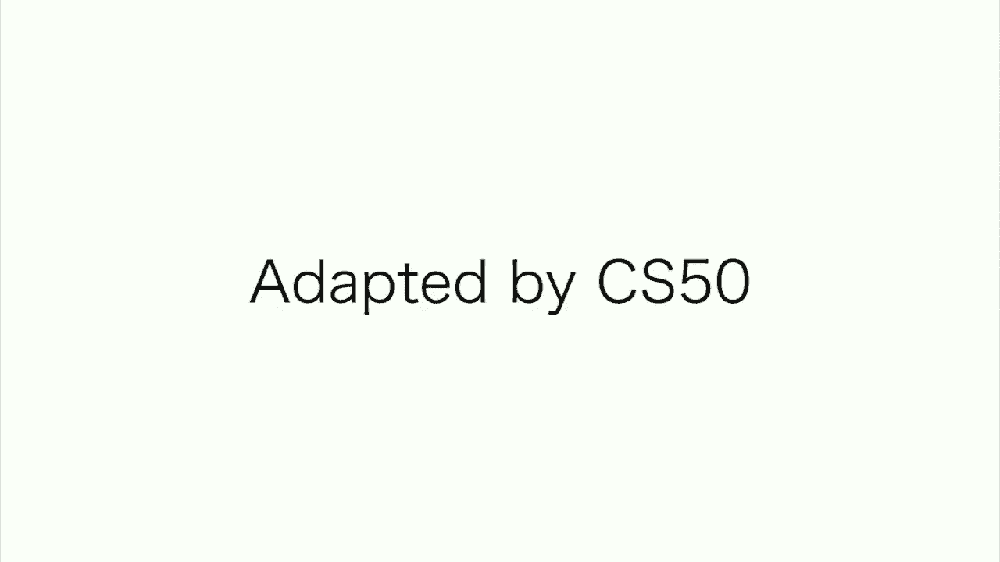

---


## 总结 📝


本节课中我们一起学习了多种关键数据结构。我们从数组和链表的权衡开始，探讨了如何用C语言实现链表。接着，我们引入了二维的二叉搜索树，它结合了有序性和动态性。为了追求更快的常数时间操作，我们研究了哈希表和字典树，但也理解了它们在内存使用上的代价。最后，我们了解了栈、队列和字典这些抽象数据类型，它们基于底层结构构建，提供了更清晰的编程接口。


每种数据结构都有其时间与空间的权衡，没有一种结构在所有情况下都是最优的。理解这些特性，并根据具体问题选择合适的数据结构，是计算机科学中的核心技能。