# 哈佛 CS50课程笔记 📘｜ 计算机科学导论(2020·完整版) - P12：L6- Python从语法到应用实战 1

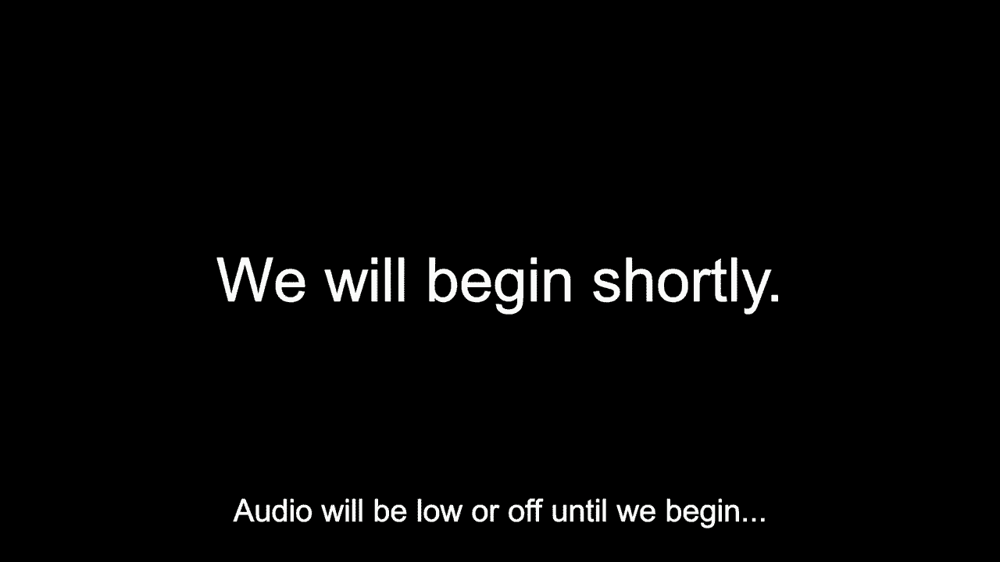


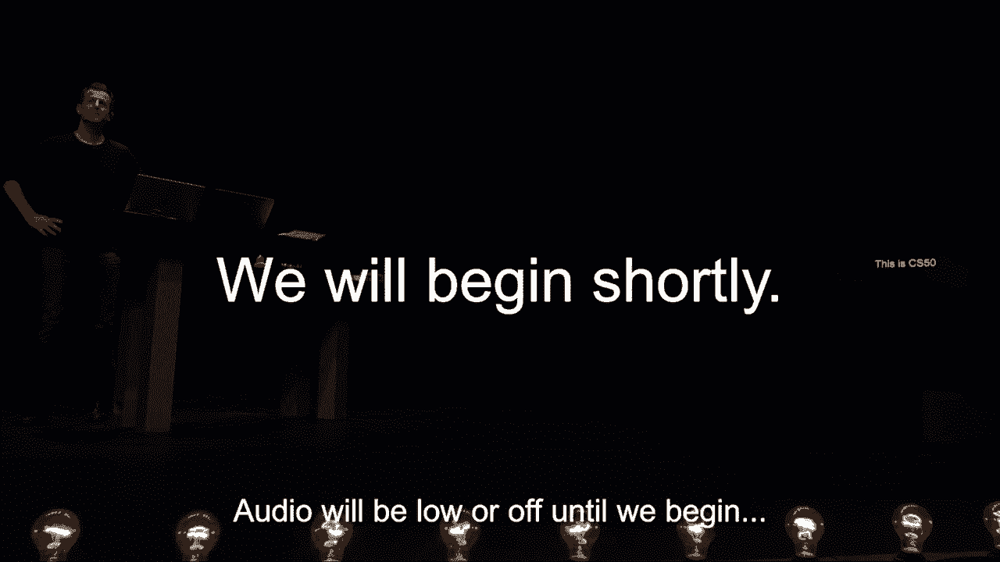


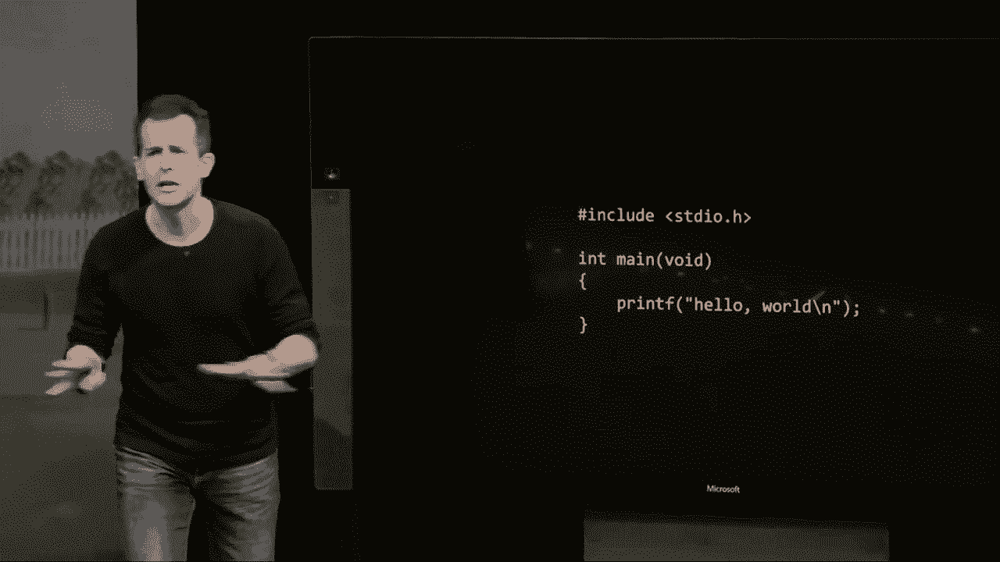

在本节课中，我们将要学习一种新的编程语言——Python。我们将通过对比之前学过的Scratch和C语言，来快速掌握Python的基本语法和核心概念，并体验其简洁、强大的特性。

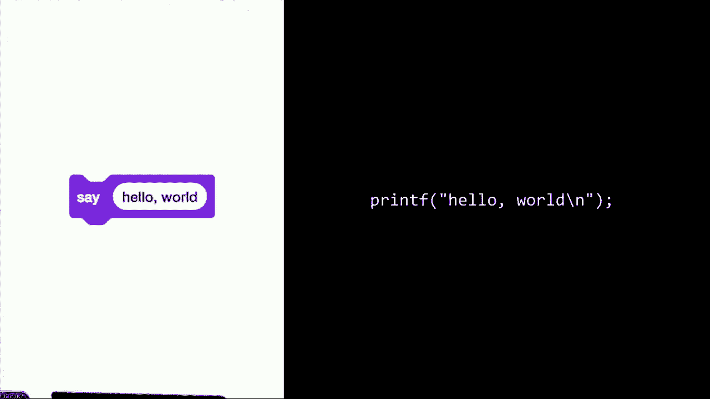

## 概述：从C到Python的演变

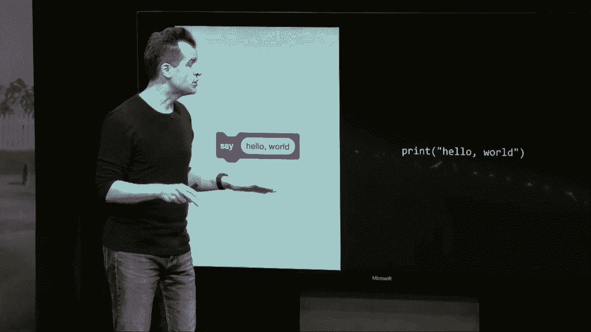

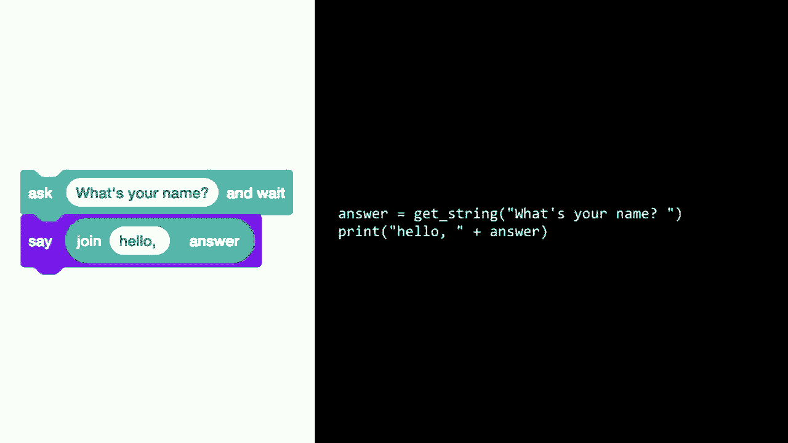

上一节我们介绍了C语言中复杂的语法细节。本节中我们来看看如何用更简洁的Python语言实现相同的功能。

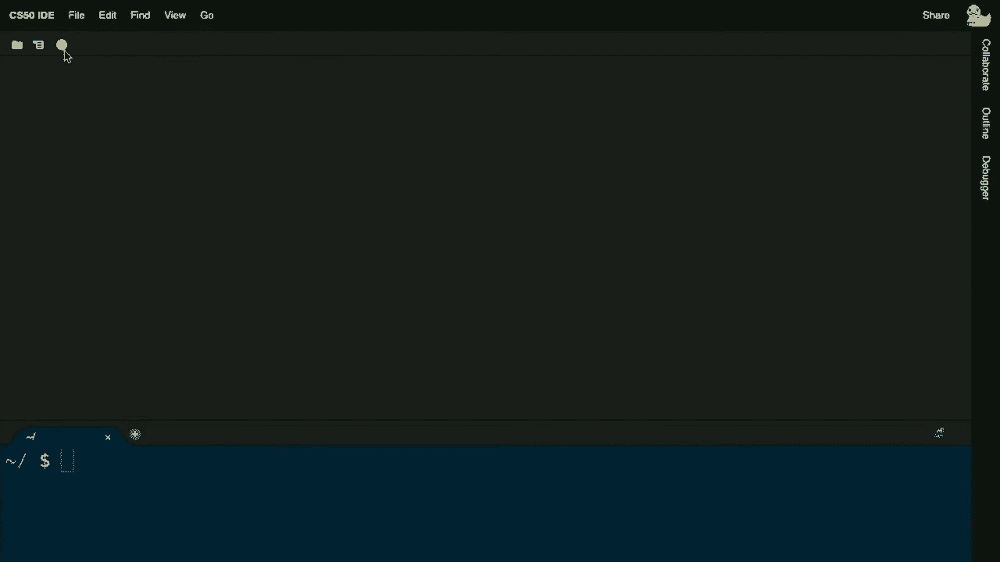

在课程开始时，我们用Scratch的“说你好，世界”积木块打印文字。在C语言中，这需要写成 `printf("hello, world\n");`，其中包含了反斜杠`n`和分号等语法。

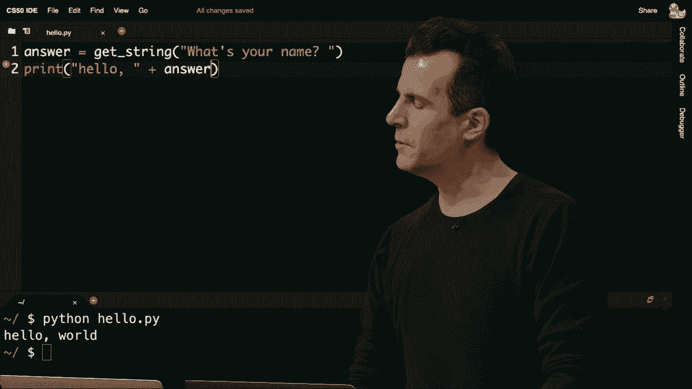

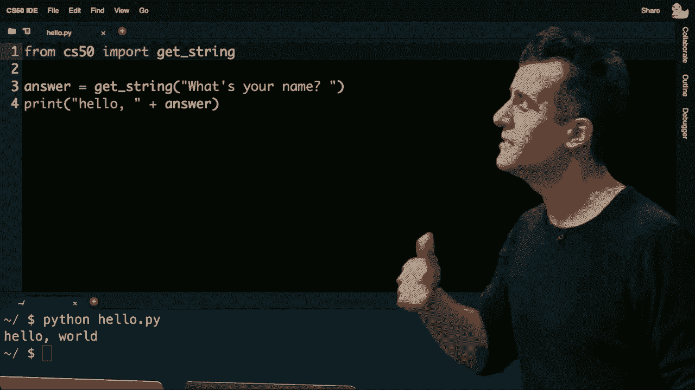

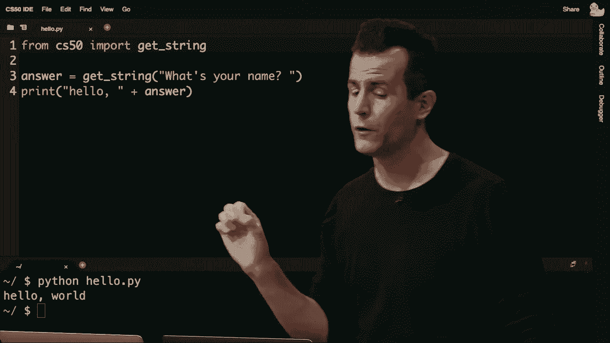

在Python中，实现同样目标的代码变得非常简单：
```python
print("hello, world")
```
Python建立在C语言等低级语言的基础上，通过识别并改进其中的痛点，提供了更高级、更易用的功能。它是一种目前非常流行的语言。

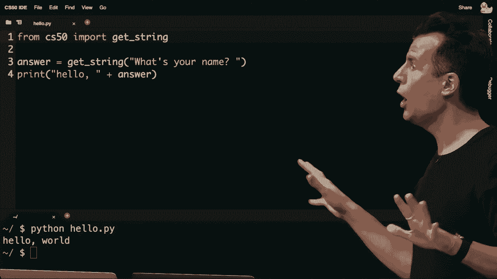

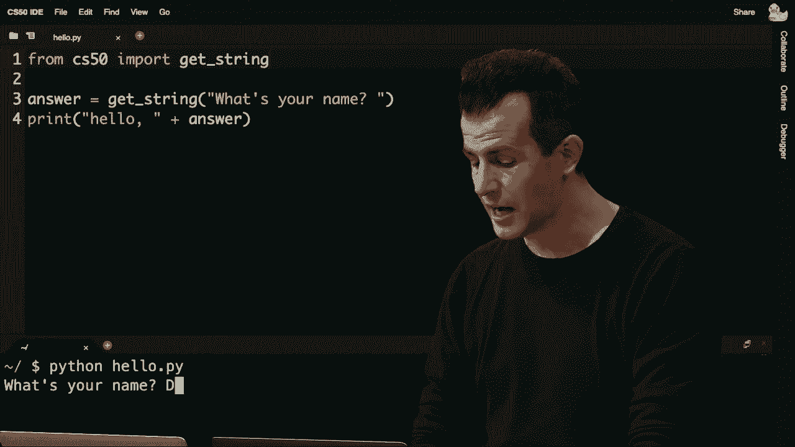

## 基础语法对比

以下是几个核心编程概念在C语言和Python中的对比，我们可以看到Python语法是如何简化的。


### 1. 获取用户输入

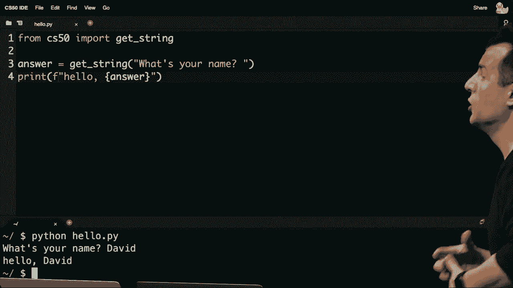

在Scratch中，我们使用“询问并等待”积木块。在C语言中，这需要调用`get_string`函数并配合`printf`进行格式化输出。

在Python中，我们可以使用`input`函数直接获取输入，并使用加号`+`进行字符串连接：
```python
answer = input("What's your name? ")
print("hello, " + answer)
```
另一种更现代、更推荐的方式是使用**格式化字符串（f-string）**：
```python
answer = input("What's your name? ")
print(f"hello, {answer}")
```
这里的`f`前缀告诉Python这是一个需要格式化的字符串，花括号`{}`内的变量名会被其实际值替换。

### 2. 变量与递增

在C语言中声明和递增一个计数器变量：
```c
int counter = 0;
counter = counter + 1; // 或 counter += 1; 或 counter++;
```
在Python中，代码更加简洁，无需声明类型，并且使用`+=`进行递增（Python没有`++`运算符）：
```python
counter = 0
counter = counter + 1  # 或 counter += 1
```

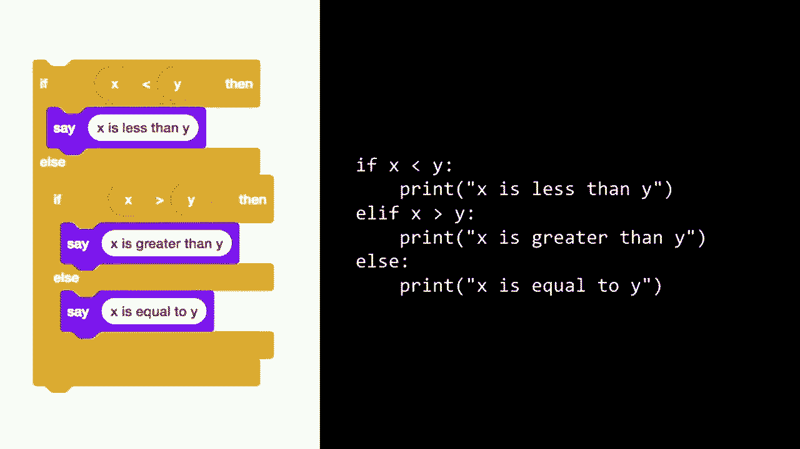

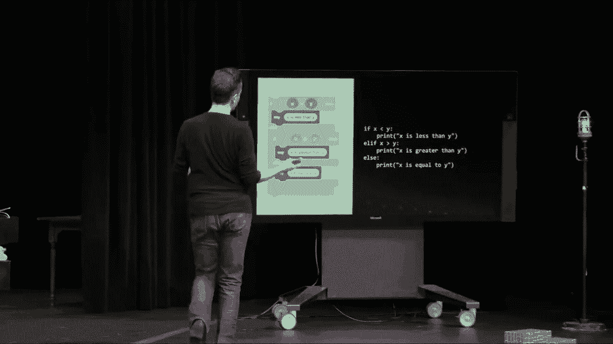

### 3. 条件语句

C语言中的条件语句需要括号、花括号和分号：
```c
if (x < y) {
    printf("x is less than y\n");
}
```
在Python中，我们使用冒号`:`和缩进来定义代码块，括号和分号都消失了：
```python
if x < y:
    print("x is less than y")
```
**缩进在Python中至关重要**，它取代了花括号的作用，用于界定代码块的范围。

对于`if-else if-else`结构，Python使用`elif`关键字：
```python
if x < y:
    print("x is less than y")
elif x > y:
    print("x is greater than y")
else:
    print("x is equal to y")
```

### 4. 循环


实现一个无限循环，在C语言中：
```c
while (true) {
    printf("hello, world\n");
}
```
在Python中，布尔值`True`和`False`需要大写：
```python
while True:
    print("hello, world")
```
实现一个执行特定次数的循环，在C语言中通常需要初始化、条件和递增三个步骤：
```c
for (int i = 0; i < 3; i++) {
    printf("hello, world\n");
}
```
在Python中，`for`循环通常与`range()`函数一起使用，语法更加直观：
```python
for i in range(3):
    print("hello, world")
```
`range(3)`会生成一个序列`[0, 1, 2]`。`range()`函数非常灵活，例如，要生成0到100之间的所有偶数，可以写为：
```python
for i in range(0, 101, 2):
    print(i)
```
这里的三个参数分别是**起始值**、**终止值（不包含）**和**步长**。


## Python的数据类型与库

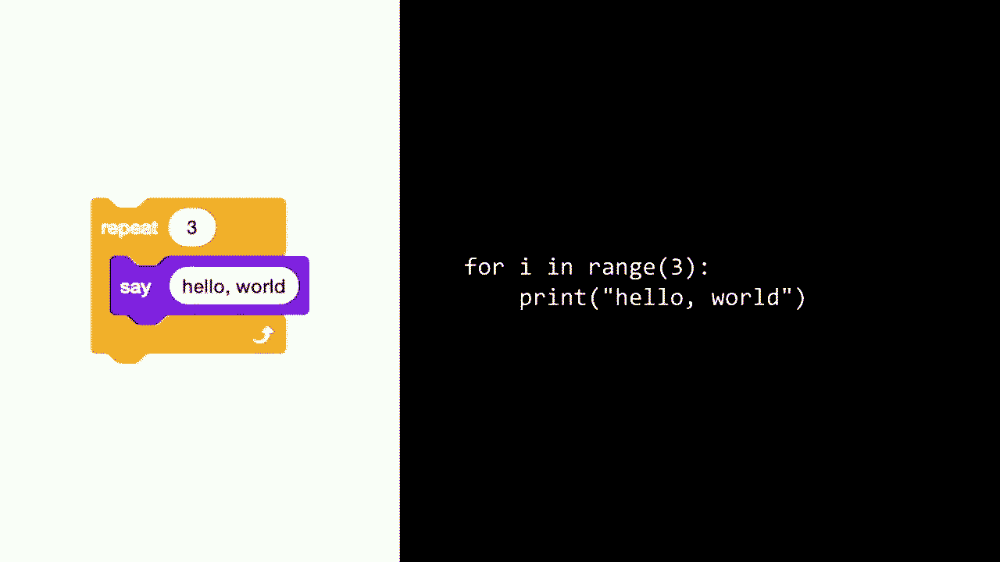

上一节我们对比了基础语法。本节中我们来看看Python内置的数据类型以及如何使用外部库。

### Python的数据类型

Python是一种**动态强类型语言**。这意味着变量在赋值时无需显式声明类型，解释器会自动推断，但类型本身是严格存在的。

以下是Python中的一些核心数据类型：
*   **`bool`**: 布尔值，`True` 或 `False`（注意首字母大写）。
*   **`float`**: 浮点数，即带小数的实数。
*   **`int`**: 整数。
*   **`str`**: 字符串，这是Python中真正的一级数据类型，功能强大。
*   **`list`**: 列表，类似于数组，但可以动态调整大小。
*   **`tuple`**: 元组，不可变的有序序列，常用于存储一组相关的值（如坐标）。
*   **`dict`**: 字典，存储键值对映射的集合。
*   **`set`**: 集合，存储不重复元素的无序集合。

### 使用库函数

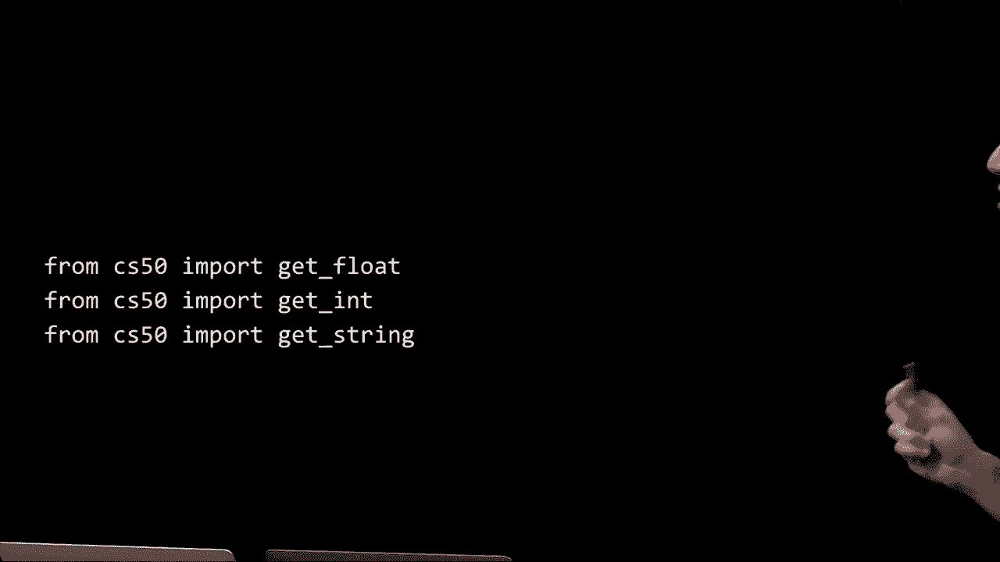

在C语言中，我们使用`#include `来引入CS50库以使用`get_string`等函数。


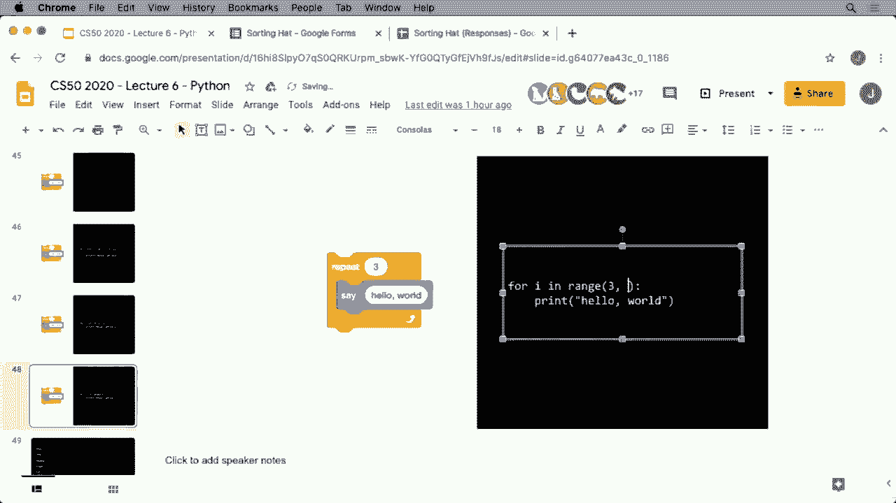

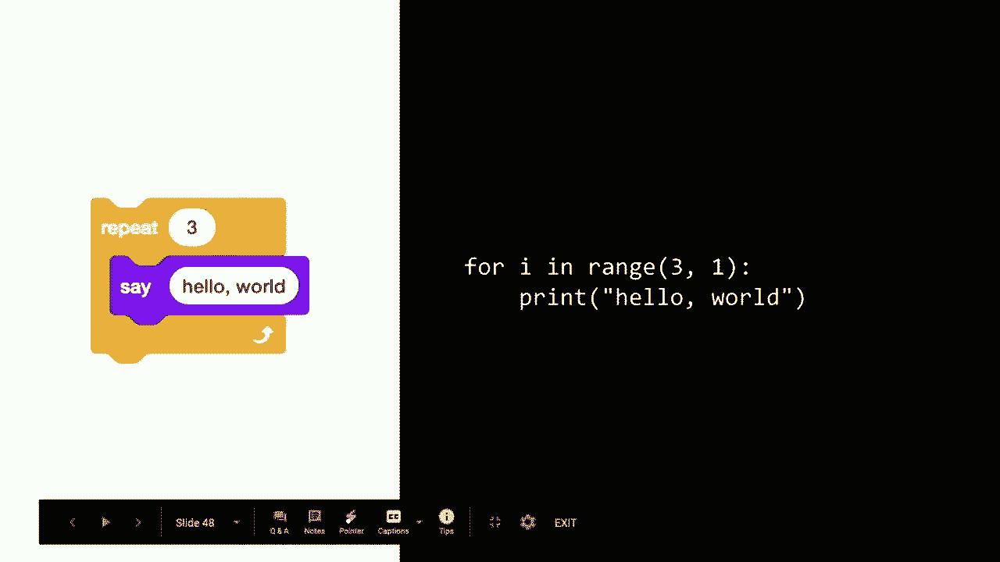

在Python中，我们使用`import`语句。可以导入整个模块，也可以导入特定的函数：
```python
# 方法一：导入整个cs50模块，使用时需加前缀
import cs50
answer = cs50.get_string("What's your name? ")


# 方法二：从cs50模块中导入特定的get_string函数
from cs50 import get_string
answer = get_string("What's your name? ")


# 方法三：导入多个函数
from cs50 import get_string, get_int
```
为了从C语言平稳过渡，本周我们会使用CS50库。但最终，我们会使用Python原生的`input()`等函数来编写代码。

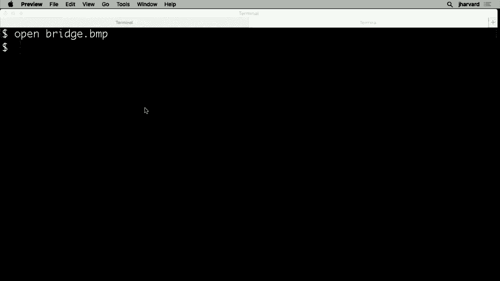


## Python的强大之处：站在巨人的肩膀上

前面我们学习了Python的基础。本节中我们来看看Python如何通过利用他人编写好的库，让我们用极少的代码完成复杂任务。

### 示例一：图像模糊

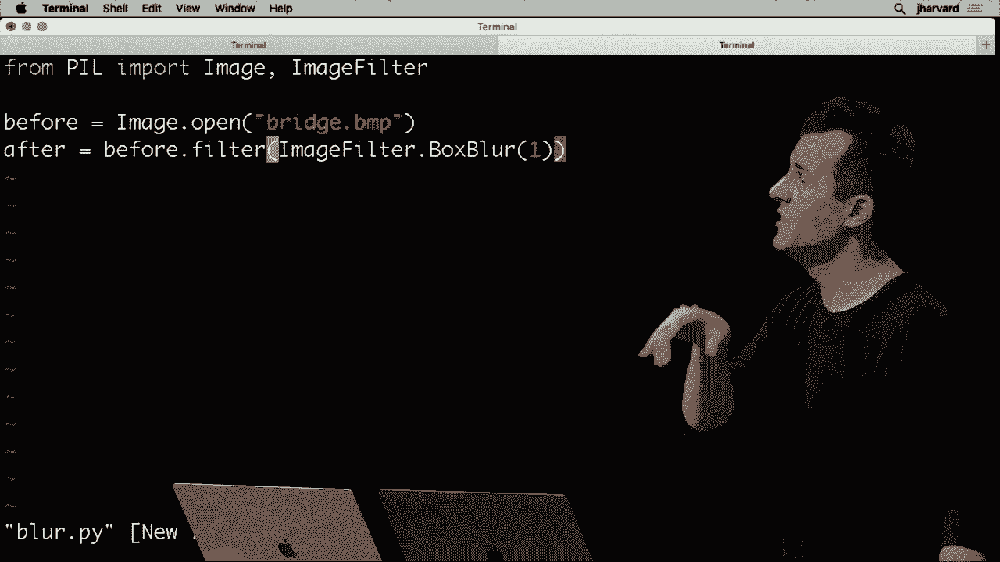

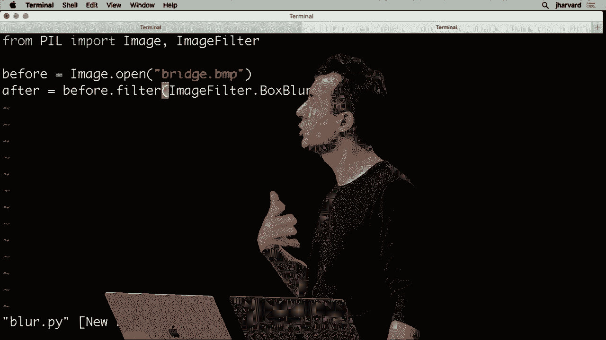

在之前的课程中，模糊一张图片需要手动处理每个像素，计算周围像素的平均值，代码相当复杂。

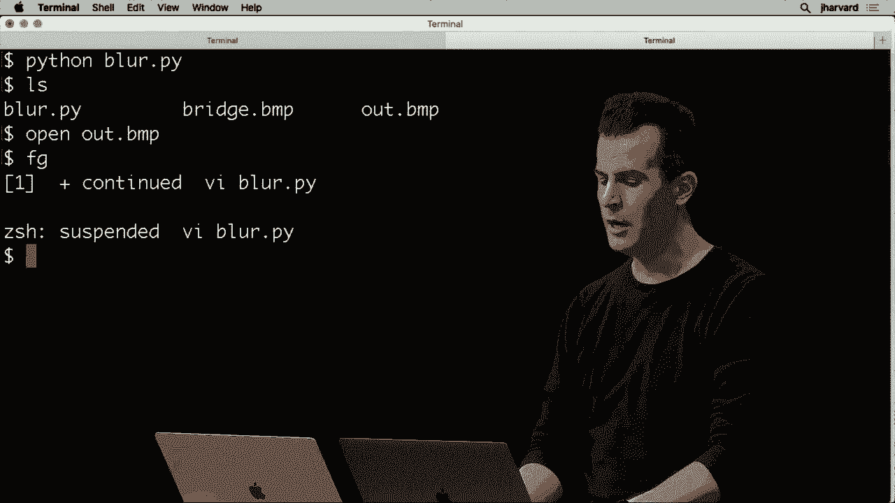

在Python中，利用`PIL`（Python Imaging Library）库，只需几行代码即可实现：
```python
from PIL import Image, ImageFilter

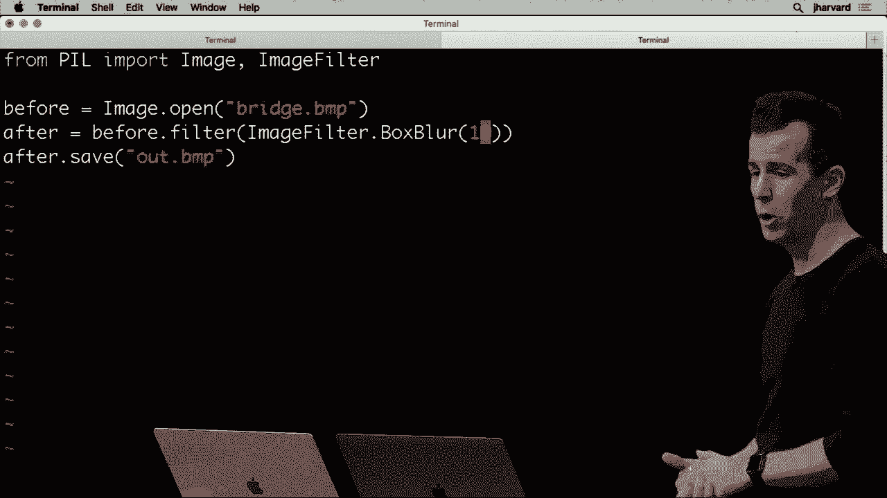

# 打开图片
before = Image.open("bridge.bmp")
# 应用模糊滤镜，参数代表模糊半径
after = before.filter(ImageFilter.BoxBlur(10))
# 保存图片
after.save("out.bmp")
```
这段代码借助库函数，抽象掉了所有底层细节，让我们可以专注于解决问题的逻辑。

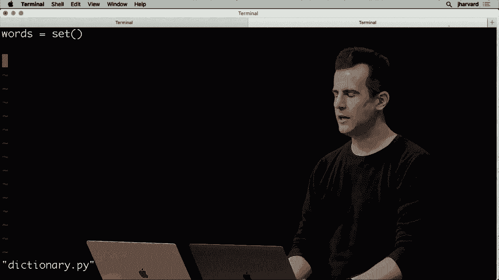


### 示例二：拼写检查器

回顾之前用C语言实现的拼写检查器，我们需要手动管理哈希表、链表和内存。

用Python实现核心的字典功能则简洁得多：
```python
# 初始化一个集合来存储单词（自动去重）
words = set()

def load(dictionary):
    """从字典文件加载单词到内存"""
    file = open(dictionary, "r")
    for line in file:
        word = line.rstrip()  # 去掉行尾换行符
        words.add(word)       # 添加到集合
    file.close()
    return True

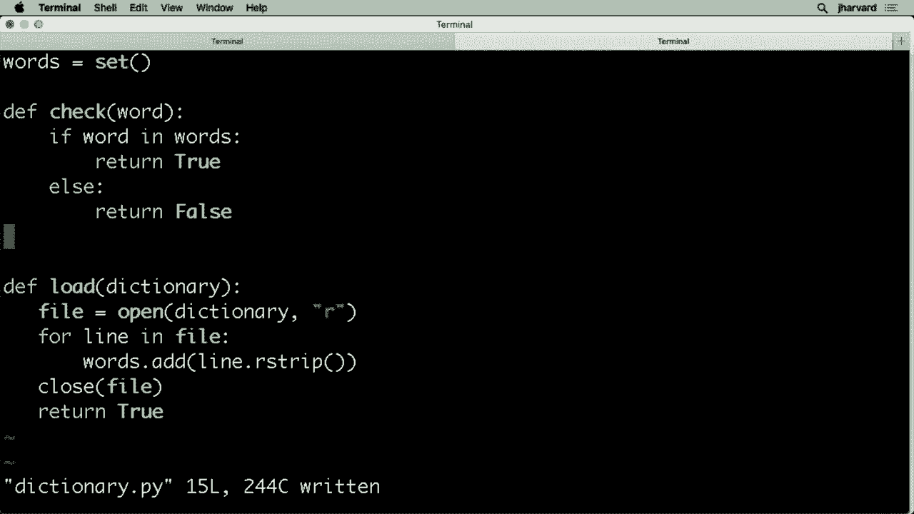

def check(word):
    """检查单词是否在字典中"""
    return word.lower() in words  # 转换为小写后检查是否存在


def size():
    """返回字典中的单词数量"""
    return len(words)

def unload():
    """‘卸载’字典（Python自动管理内存，此处只需返回True）"""
    return True
```
Python的`set`数据结构自动处理了去重和高效查找，字符串方法（如`.lower()`, `.rstrip()`）让处理文本变得异常简单，并且无需手动进行内存管理。

### 性能权衡

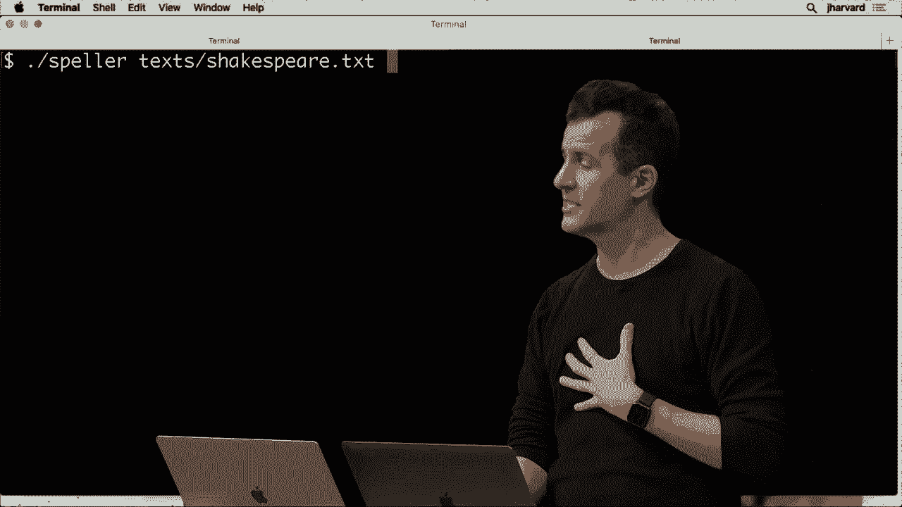

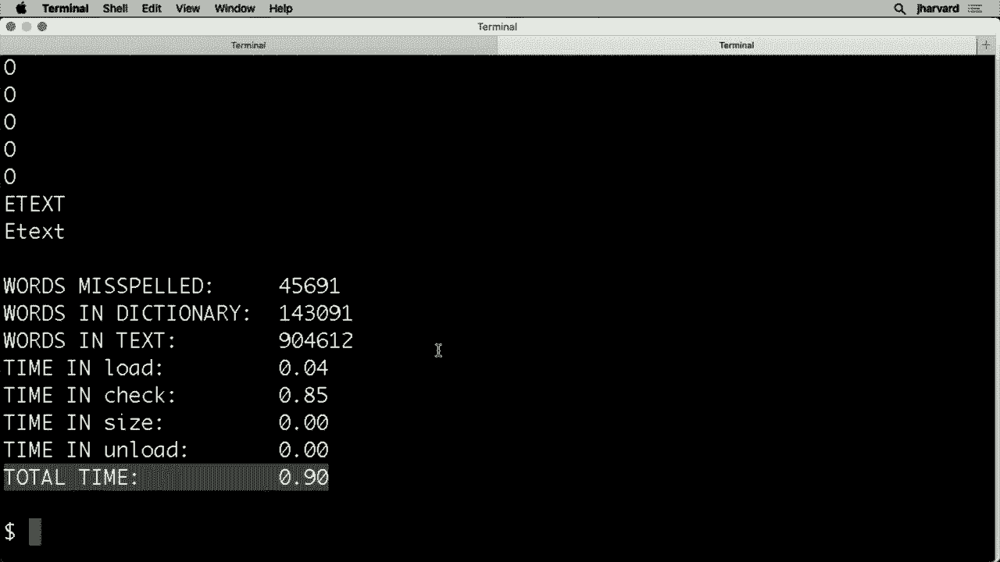

需要注意的是，这种便利性有时会带来性能上的代价。在上述拼写检查器的例子中，用C语言精心优化的版本可能比等价的Python版本运行得更快。


这是因为Python是一种**解释型语言**。运行Python程序时，有一个叫做“解释器”的程序会逐行读取你的源代码，并动态地将其翻译成计算机能理解的指令。这个过程比直接运行编译好的C语言机器码要慢。


而C语言是**编译型语言**，源代码会先被`clang`编译器一次性全部转换成高效的机器码，然后直接由CPU执行。


这体现了计算机科学中一个永恒的**权衡**：**开发效率 vs 运行效率**。Python通过牺牲一些运行速度，换来了更高的开发效率和更简洁的代码。对于许多现代应用（如Web开发、数据分析、人工智能）来说，开发效率的提升远比那一点运行时的开销重要。

## 实践：编写一个加法程序


让我们通过一个完整的例子来巩固所学。我们将编写一个提示用户输入两个数字并进行加法的程序，并逐步去掉CS50库的“辅助轮”。


首先，使用CS50库的版本：
```python
from cs50 import get_int

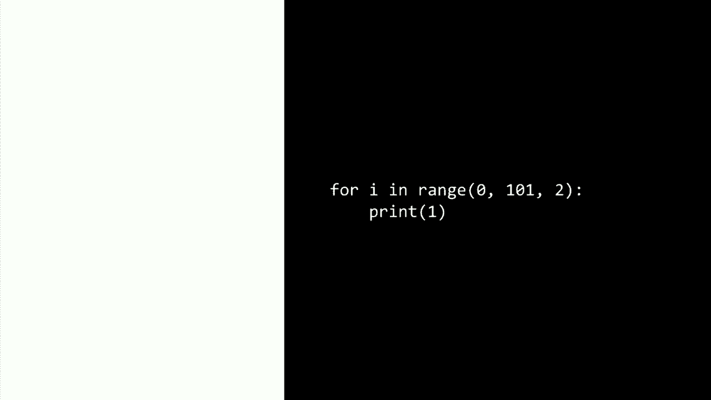

# 提示用户输入x
x = get_int("x: ")
# 提示用户输入y
y = get_int("y: ")

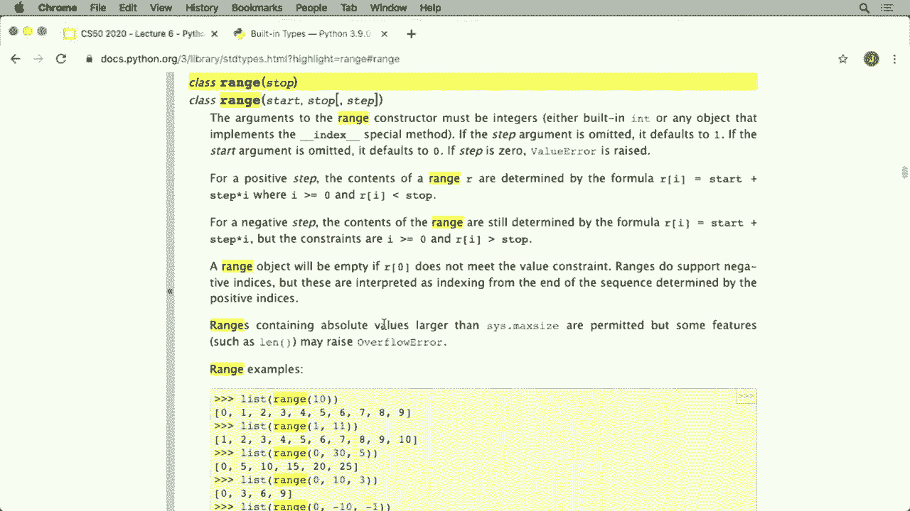

# 执行加法并打印结果
print(x + y)
```

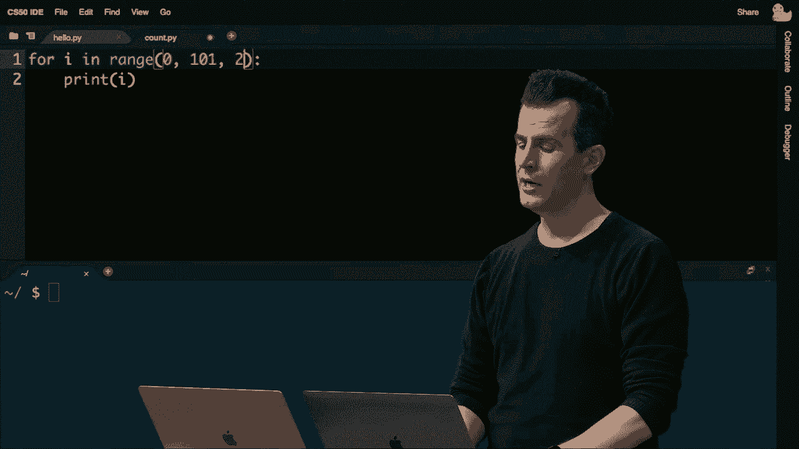

现在，我们改用Python原生的`input()`函数。但要注意，`input()`始终返回字符串（`str`），我们需要用`int()`函数将其转换为整数：
```python
# 获取输入，返回的是字符串
x = input("x: ")
y = input("y: ")

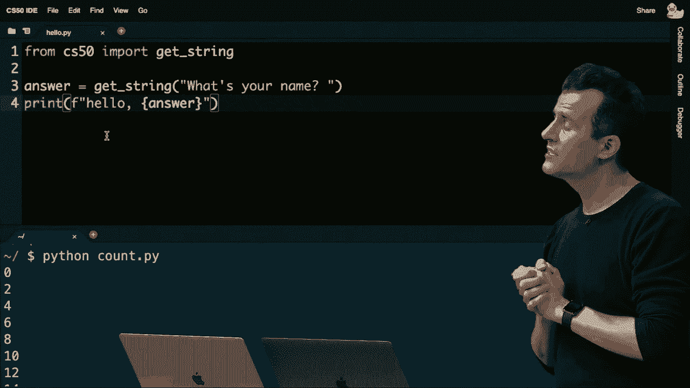

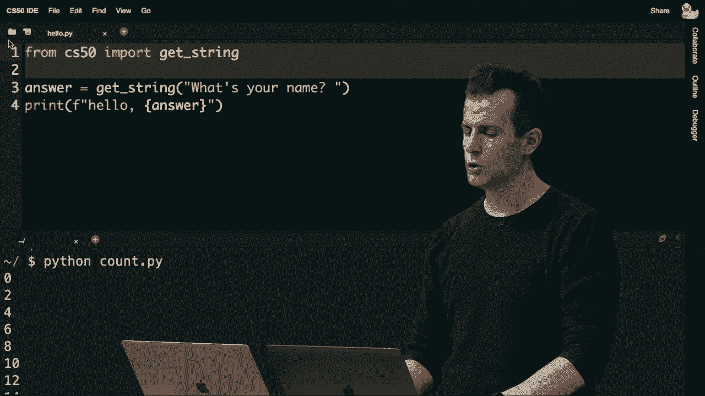

# 将字符串转换为整数
x = int(x)
y = int(y)

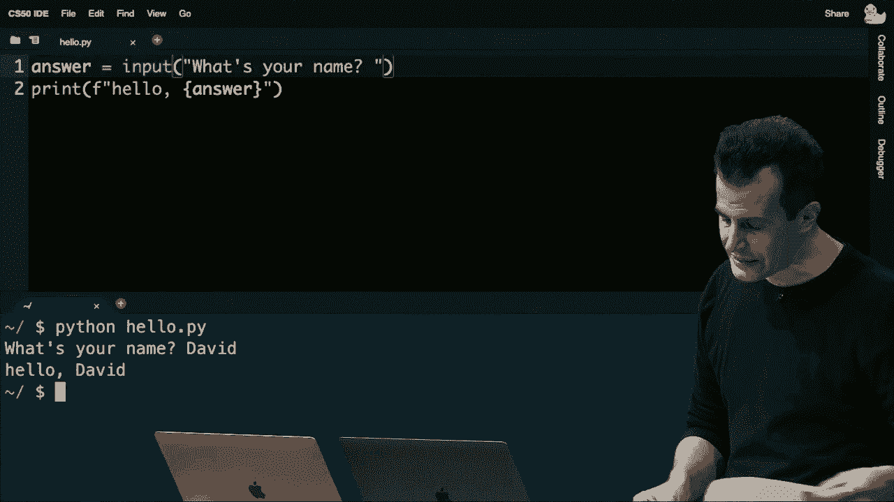

# 现在可以执行加法
print(x + y)
```
如果用户输入的不是有效的整数（例如输入了“cat”），`int()`函数会抛出`ValueError`错误。CS50库中的`get_int()`帮我们处理了这种错误检查，而使用原生方法则需要我们自己编写额外的代码来验证输入，这再次体现了使用库的便利性。

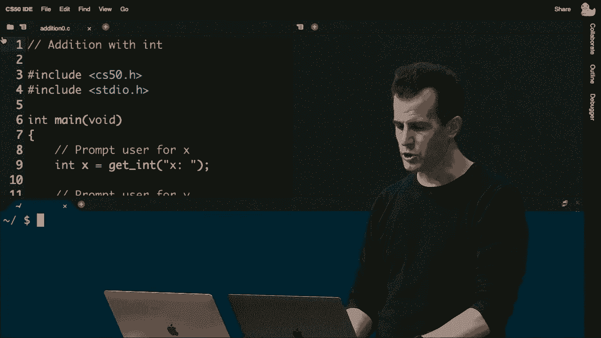

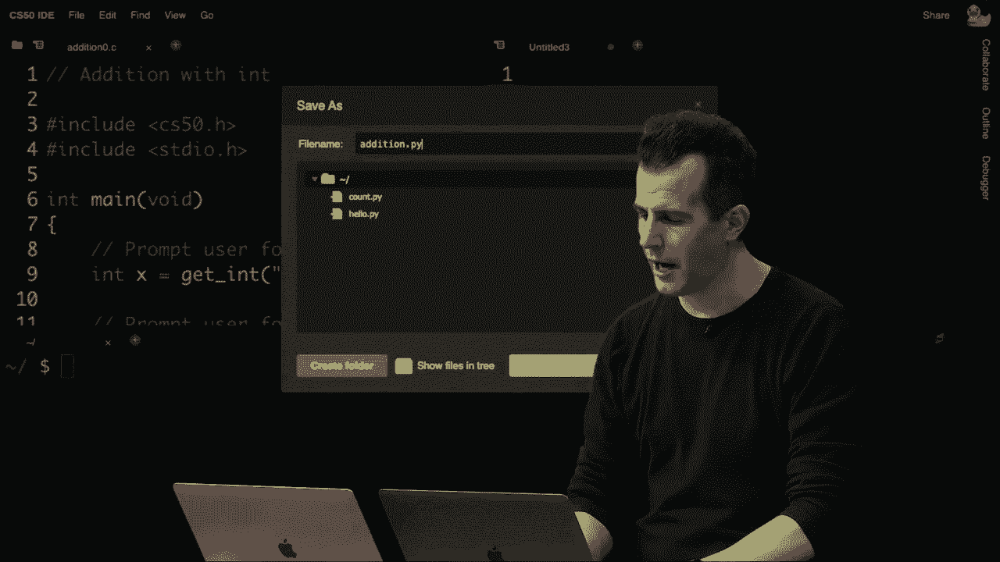

此外，在Python中进行除法运算时，即使两个操作数都是整数，结果也会是浮点数，避免了C语言中的整数截断问题：
```python
z = x / y  # 即使x和y是int，z也会是float
```

## 总结

本节课中我们一起学习了Python编程语言的基础。我们从与C语言的对比入手，看到了Python在语法上的巨大简化：去除了分号、花括号，使用缩进定义代码块，让代码更加清晰。

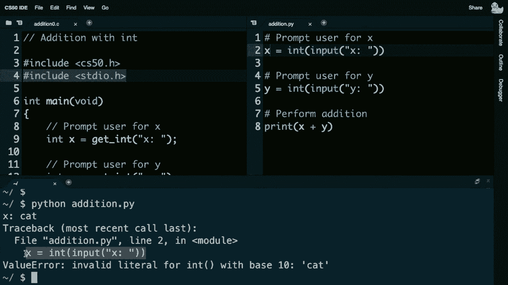

我们学习了Python的核心概念，包括变量、数据类型（`int`, `str`, `list`, `dict`, `set`等）、条件语句（`if/elif/else`）、循环（`while`, `for ... in range()`）以及函数的定义和使用。

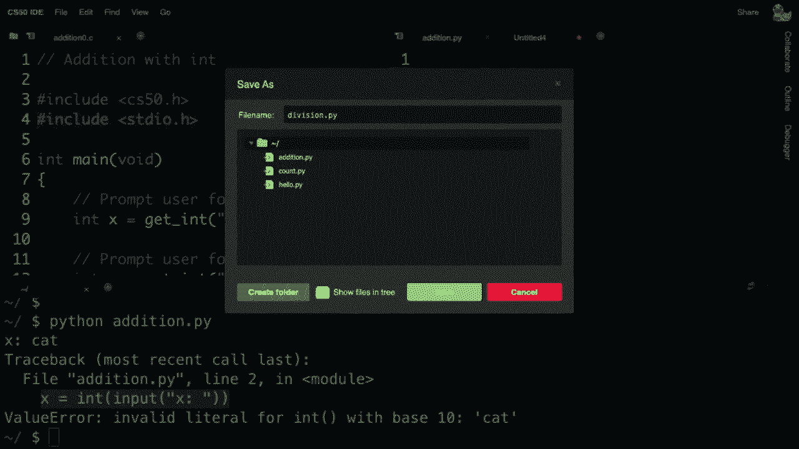

更重要的是，我们体验了Python生态系统的强大。通过`import`使用丰富的第三方库，我们可以用极少的代码完成如图像处理、拼写检查等复杂任务，这极大地提升了开发效率。我们也了解了这种便利性背后“解释执行”所带来的性能权衡。

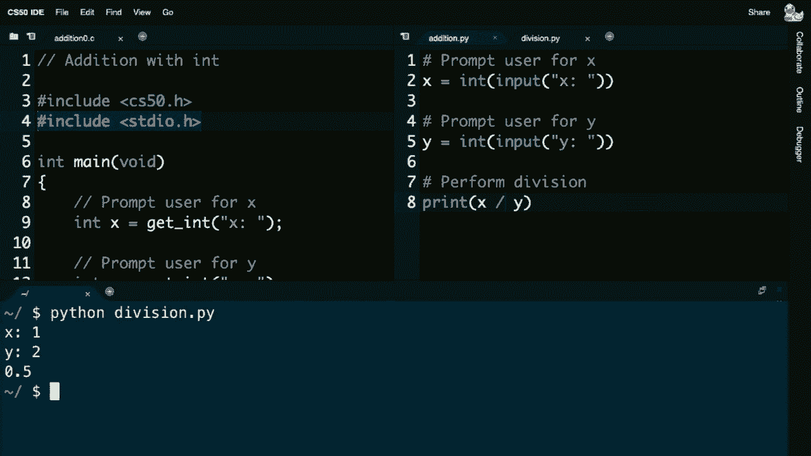

Python是一门注重可读性和开发效率的语言，它的设计哲学是“用一种方法，最好是只有一种方法来做一件事”。写出符合这种哲学的代码，通常被称为具有“Pythonic”风格。在接下来的学习中，我们将继续探索Python的更多功能，并运用它来解决实际问题。