# 哈佛 CS50-CS 14：L7- 数据库与SQL知识体系 1


## 📚 概述

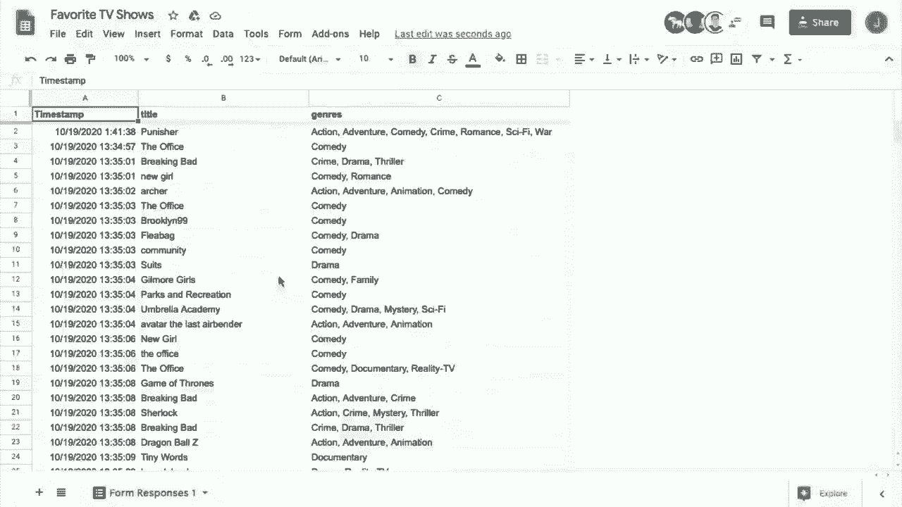

在本节课中，我们将要学习如何从简单的数据收集和处理，过渡到使用更强大的关系数据库。我们将从分析一个关于最喜爱电视剧的CSV文件开始，探讨平面文件数据库的局限性，并最终引入SQLite和SQL语言，学习如何高效地存储、查询和管理数据。


## 从数据收集到CSV文件

上一节我们介绍了如何使用Python处理数据。本节中我们来看看如何从零开始收集数据并进行分析。

我们通过一个谷歌表单收集了大家最喜爱的电视剧及其类型信息。表单收集的数据会自动存储在一个谷歌电子表格中。

为了能在自己的程序中使用这些数据，我们将其导出为CSV（逗号分隔值）文件。CSV文件是一种简单的文本文件，每行代表一条记录，每个值用逗号分隔。


## 电子表格与平面文件数据库


电子表格（如Google Sheets, Excel）是处理数据的常见工具。它们擅长快速排序、筛选和存储适量数据。然而，当数据量变得非常庞大时，电子表格可能会遇到性能瓶颈或行数限制。


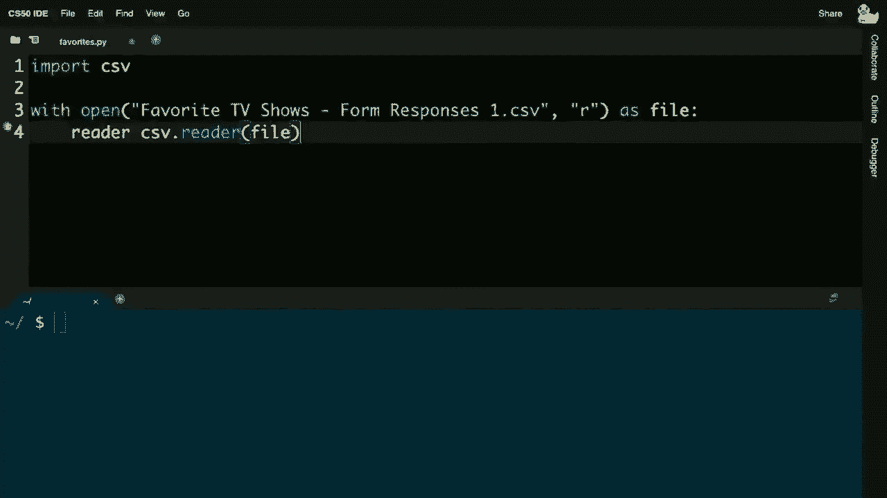

平面文件数据库，如CSV文件，将数据以纯文本形式存储。它们具有很好的可移植性，可以被多种程序和语言读取。但是，它们缺乏高级功能，并且在处理包含逗号本身的数据时可能遇到解析问题。解决方案是用双引号将包含逗号的字段括起来。

以下是一个CSV文件的示例结构：
```csv
时间戳,标题,类型
2023-10-26 10:00:00,办公室,喜剧
2023-10-26 10:01:00,绝命毒师,剧情,犯罪
```


## 使用Python分析CSV数据

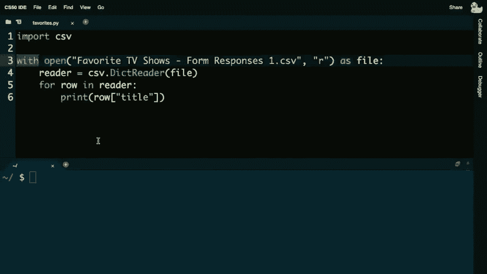

有了CSV文件后，我们可以使用Python来分析和处理数据。Python的`csv`库让读取CSV文件变得非常简单。


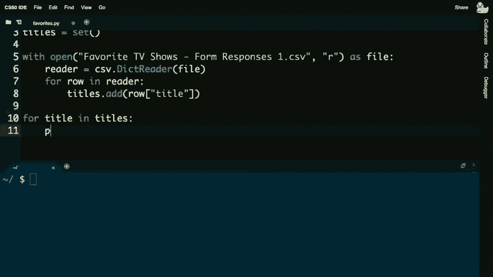

以下是读取CSV文件并打印所有电视剧标题的Python代码：
```python
import csv


with open(“最喜欢的电视节目.csv”, “r”) as file:
    reader = csv.DictReader(file)
    for row in reader:
        print(row[“标题”])
```

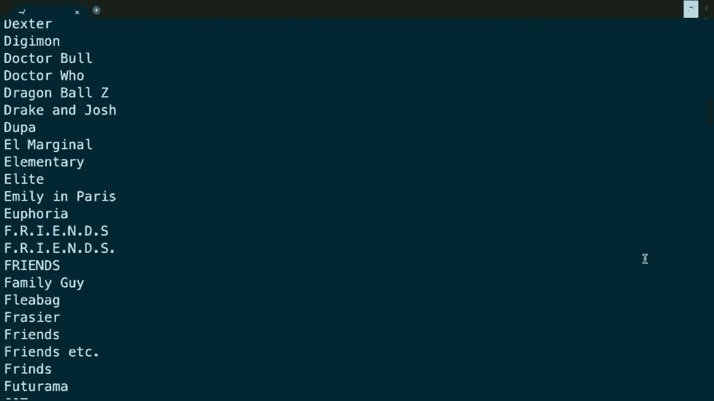


使用`DictReader`可以让我们通过列名（如`“标题”`）而不是列索引来访问数据，这样即使列的顺序发生变化，代码也不会出错。

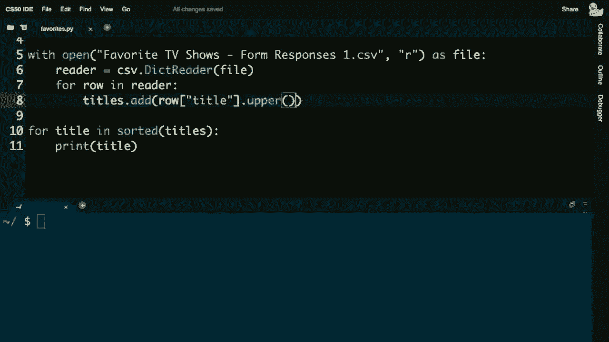

## 数据清洗与规范化


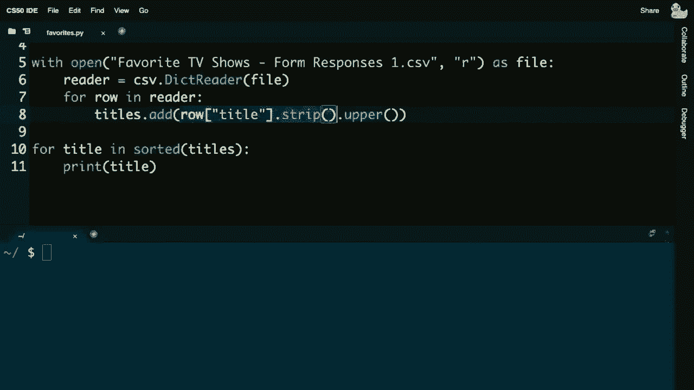


在处理真实世界的数据时，我们经常会遇到不一致的情况，例如大小写不统一或存在多余空格。这会导致在统计时，本应相同的数据被当作不同的条目处理。


为了解决这个问题，我们需要在分析前对数据进行清洗和规范化。这意味着将数据转换为统一的标准格式。


以下是改进后的代码，它在添加标题到集合前，先进行去除空格和转换为大写操作：
```python
import csv


titles = set()


with open(“最喜欢的电视节目.csv”, “r”) as file:
    reader = csv.DictReader(file)
    for row in reader:
        title = row[“标题”].strip().upper()
        titles.add(title)

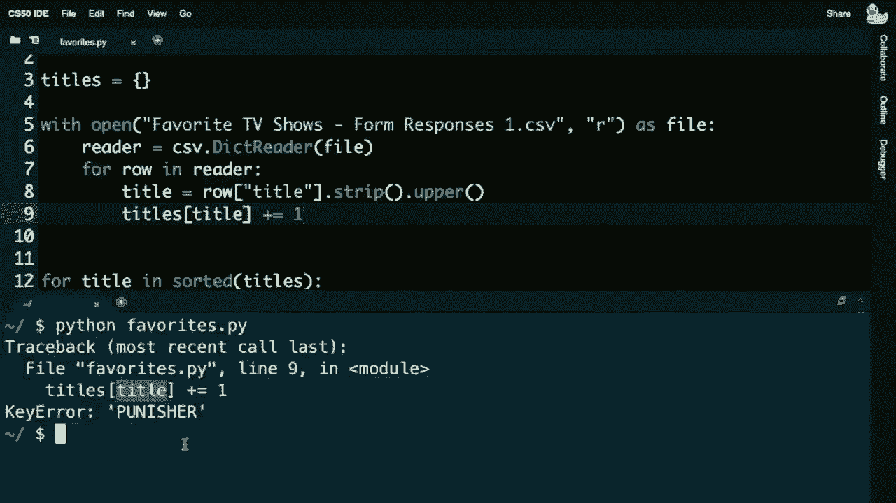


for title in sorted(titles):
    print(title)
```
*   `strip()`: 去除字符串两端的空白字符。
*   `upper()`: 将字符串转换为大写。


## 统计节目受欢迎程度

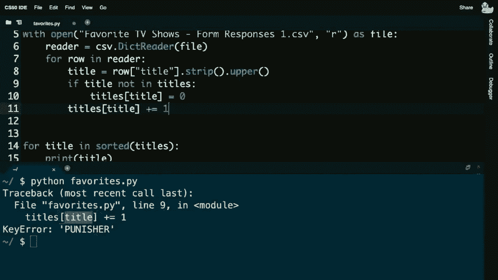


仅仅列出唯一标题还不够，我们通常更关心每个节目的受欢迎程度，即它被提及的次数。


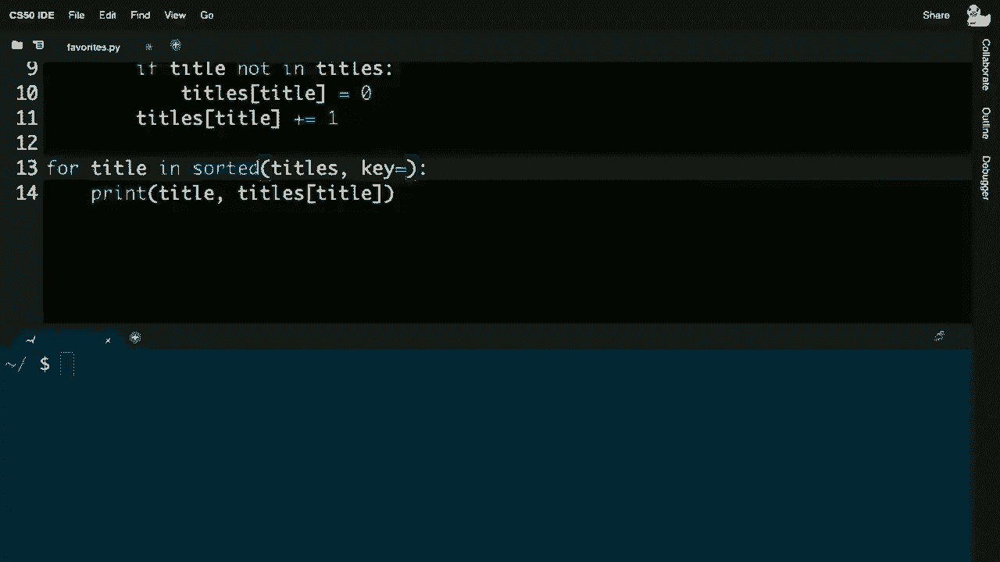

为了统计频率，集合不再适用，因为它会丢弃重复项。此时，字典（Dictionary）是一个理想的数据结构。我们可以将节目标题作为键（Key），将该标题出现的次数作为值（Value）。


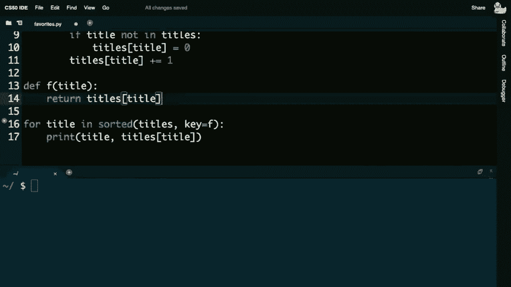

以下是使用字典统计节目出现次数的代码：
```python
import csv


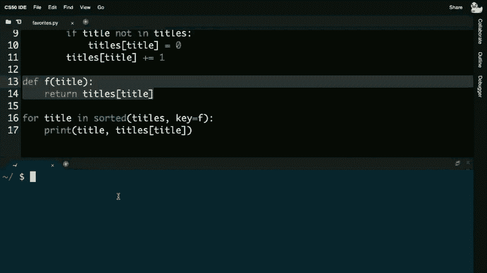

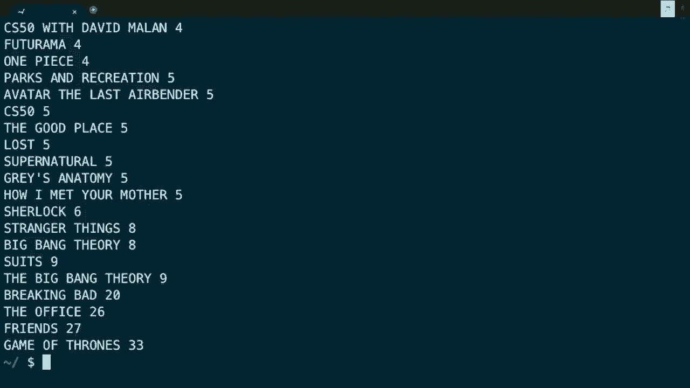

titles = {} # 创建一个空字典

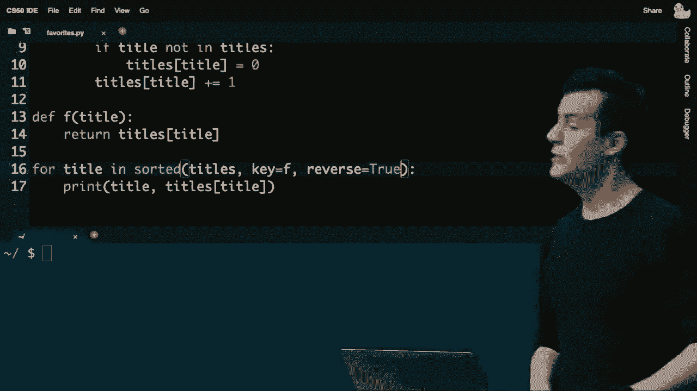


with open(“最喜欢的电视节目.csv”, “r”) as file:
    reader = csv.DictReader(file)
    for row in reader:
        title = row[“标题”].strip().upper()
        if title not in titles:
            titles[title] = 0
        titles[title] += 1

for title in sorted(titles, key=lambda title: titles[title], reverse=True):
    print(title, titles[title])
```
*   `titles = {}`: 创建一个空字典。
*   `if title not in titles`: 检查该标题是否已经是字典的键。
*   `titles[title] += 1`: 增加该标题的计数。
*   `sorted(…, key=lambda title: titles[title], reverse=True)`: 这是一个排序技巧。`key`参数指定排序依据，这里我们使用`lambda`函数告诉`sorted`函数根据每个标题对应的值（即计数）进行排序。`reverse=True`表示降序排列，最受欢迎的节目排在最前面。

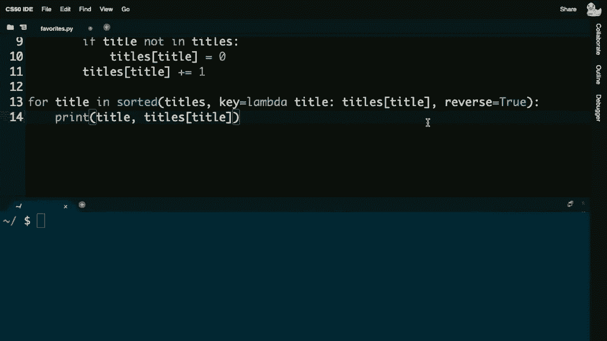


## 平面文件数据库的局限性

我们刚刚编写的查询程序有一个效率问题。无论我们想查找哪个节目的受欢迎程度，程序都需要从头到尾遍历整个CSV文件。这在计算机科学中被称为**O(n)**时间复杂度，意味着运行时间随着数据记录数（n）的增长而线性增长。

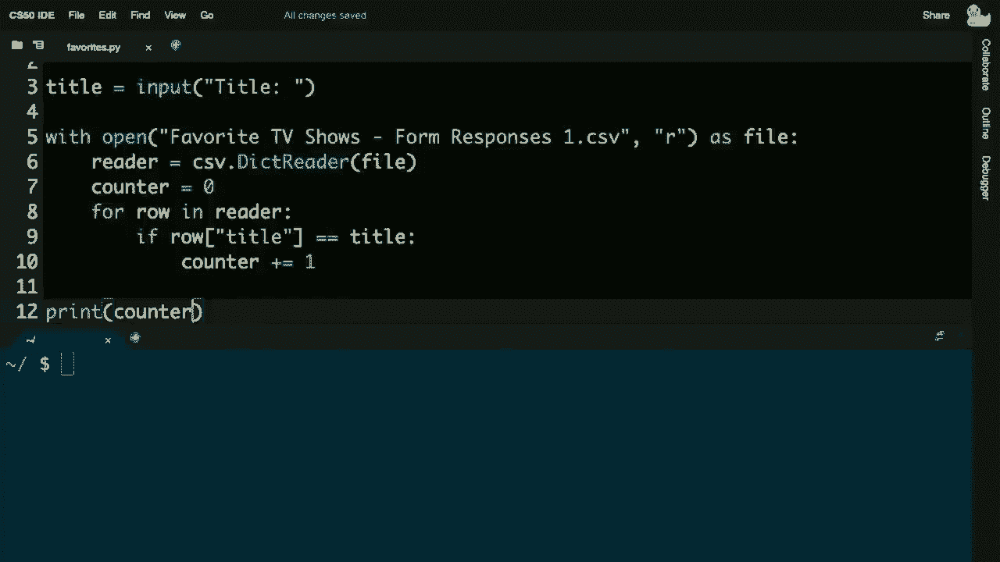


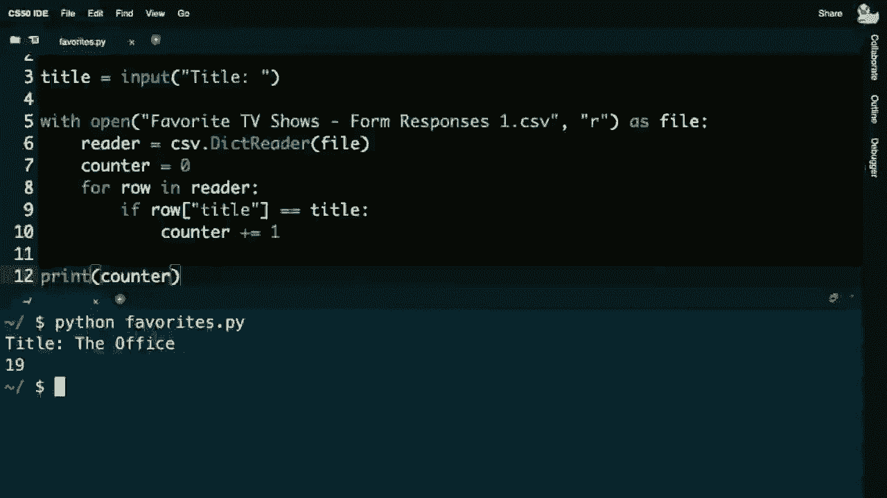

对于小型数据集，这没有问题。但对于像IMDb这样拥有海量数据的情况，这种线性搜索的效率就太低了。我们希望能以更快的速度，例如常数时间**O(1)**，来回答查询。


## 引入关系数据库与SQL

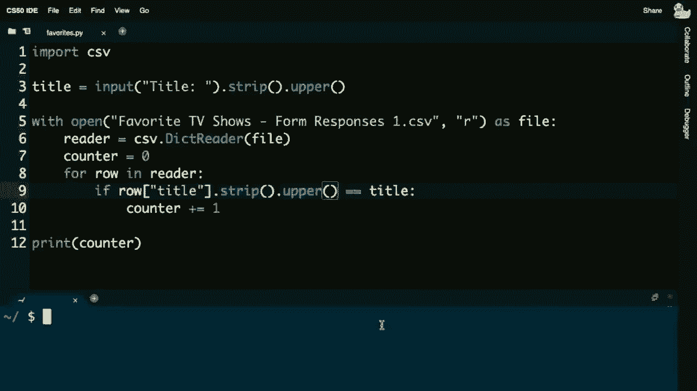


为了解决上述问题，我们引入**关系数据库**。它也是一种以表格（行和列）形式存储数据的系统，但它是通过一个专门的程序（数据库管理系统）来管理数据文件。


SQLite是一种轻量级、广泛使用的关系数据库，尤其常见于移动应用程序中。与数据库交互的语言叫做**SQL**（结构化查询语言）。


关系数据库通常支持四种核心操作，可以用缩写**CRUD**来记忆：
*   **C**reate（创建）
*   **R**ead（读取）
*   **U**pdate（更新）
*   **D**elete（删除）


## 将CSV数据导入SQLite


在使用SQLite之前，我们需要将数据从CSV文件导入到SQLite数据库文件中。SQLite提供了一个命令行工具`sqlite3`来完成这个操作。

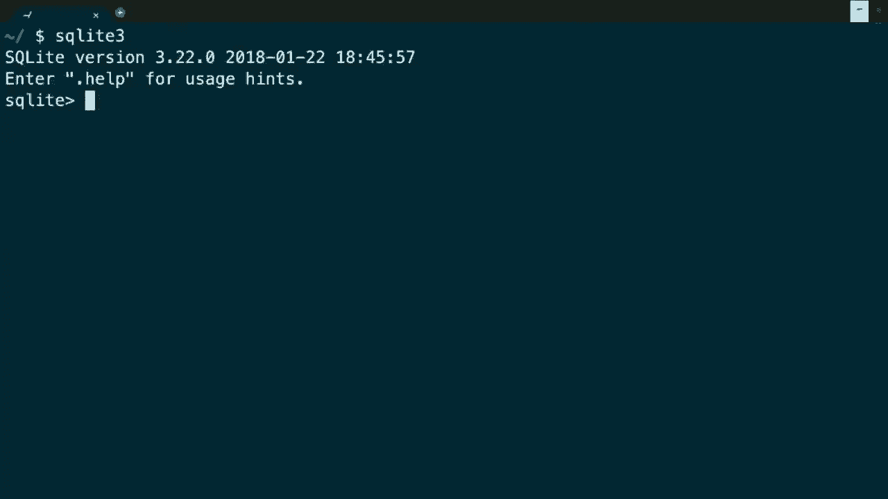


以下是导入CSV文件并创建名为`shows`的表的步骤：
1.  在终端运行 `sqlite3` 进入交互环境。
2.  设置模式为CSV：`.mode csv`
3.  导入文件并创建表：`.import “最喜欢的电视节目.csv” shows`


导入后，我们可以使用 `.schema` 命令查看自动创建的表结构，它会显示列名（如`时间戳`，`标题`，`类型`）及其数据类型。


## 总结

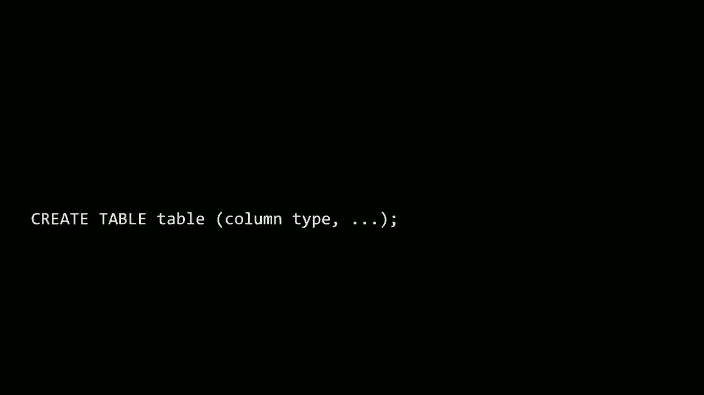


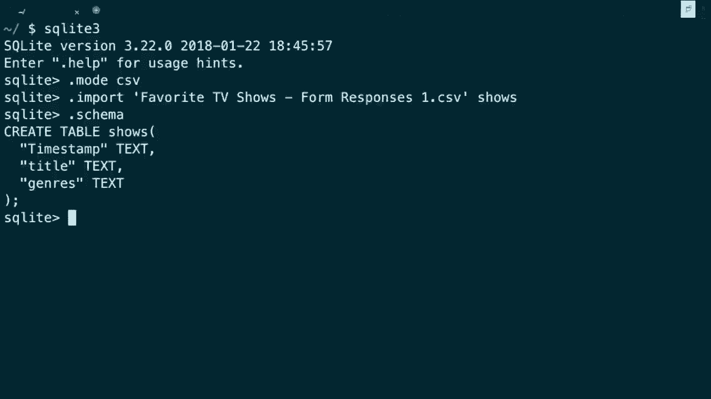

本节课中我们一起学习了数据处理的全流程。我们从收集数据开始，将其存储在CSV平面文件数据库中，并使用Python进行清洗、规范和基础分析。我们认识到对于大规模数据，平面文件在查询效率上的局限性。最后，我们引入了关系数据库的概念和SQLite工具，并成功将CSV数据导入其中，为下一节课学习强大的SQL查询语言打下了基础。