# 哈佛CS50｜计算机科学导论(2020·完整版) - P15：L7- 数据库与SQL知识体系 2 🗄️


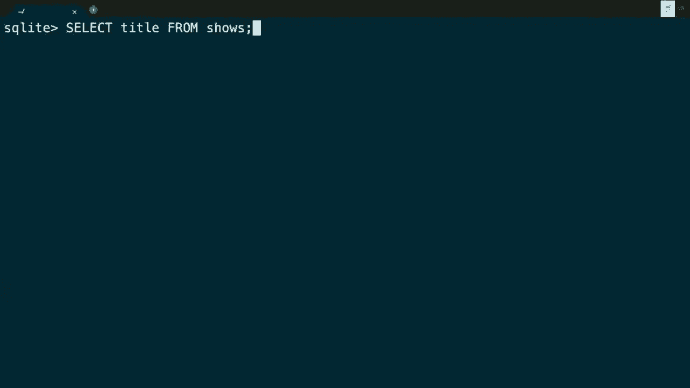


## 概述


在本节课中，我们将深入学习SQL数据库的核心操作，包括如何从数据库中查询数据、使用函数和子句来过滤和排序结果。我们还将探讨如何通过创建多个表来更好地组织数据，理解主键和外键的概念，并初步了解如何通过索引提升查询性能。最后，我们将讨论SQL注入攻击和竞争条件这两个重要的安全问题。


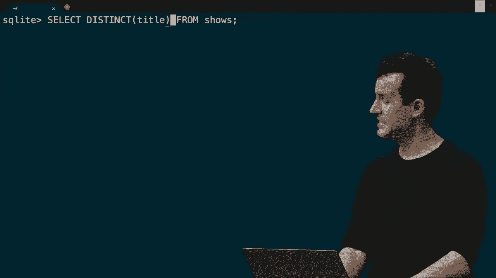


---


## 从数据库查询数据

上一节我们介绍了如何将CSV数据导入数据库并创建表。本节中，我们来看看如何使用SQL从这些表中获取数据。

SQL中的`SELECT`命令相当于“读取”操作，它允许你从指定的表中选择一个或多个列的数据。这个功能非常强大，许多数据科学家和统计学家都喜欢使用SQL来处理、过滤和分析数据。

以下是`SELECT`命令的基本语法：
```sql
SELECT column_name FROM table_name;
```
按照惯例，SQL关键字（如`SELECT`、`FROM`）通常使用大写，而列名和表名使用小写。

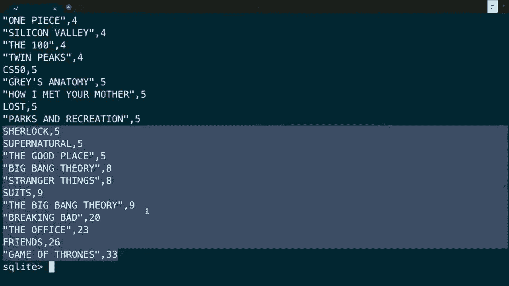

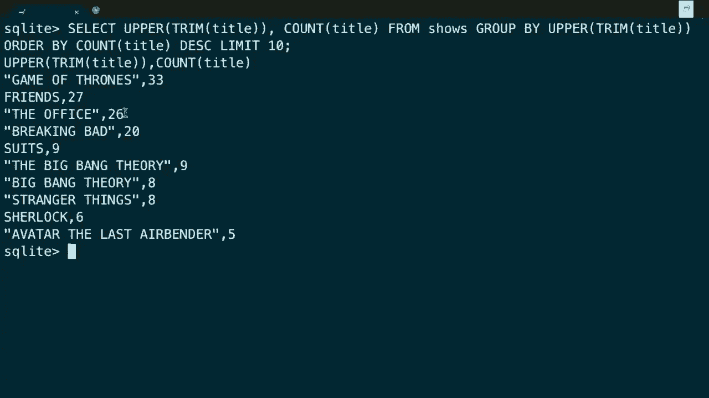

例如，要获取`shows`表中所有节目的标题，可以执行：
```sql
SELECT title FROM shows;
```
这将返回`shows`表中`title`列的所有数据。


如果你想查看表中的所有列，可以使用星号`*`作为通配符：
```sql
SELECT * FROM shows;
```
这将返回`shows`表中从左到右的所有列。

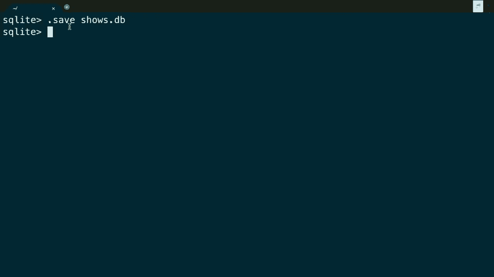


---

## 使用函数处理数据

SQL内置了许多有用的函数，可以在查询时改变返回数据的格式，类似于Excel中的函数。

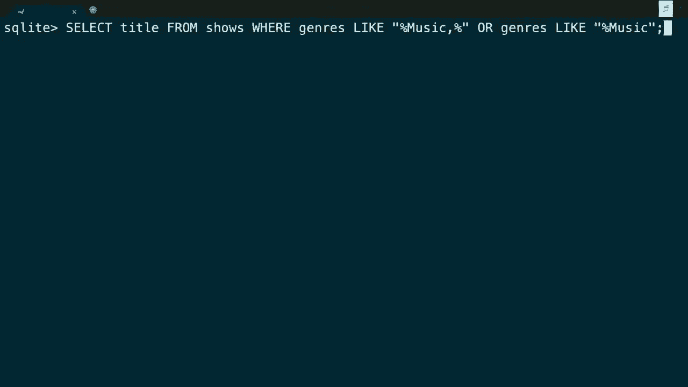

例如，如果我们想获取所有不重复的节目标题，可以使用`DISTINCT`函数：
```sql
SELECT DISTINCT title FROM shows;
```
`DISTINCT`函数会过滤掉所有重复的标题，只返回唯一值。

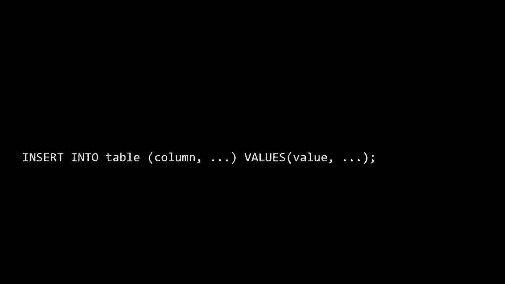

我们还可以嵌套函数。例如，先将所有标题转换为大写，再获取唯一值：
```sql
SELECT DISTINCT UPPER(title) FROM shows;
```
`UPPER()`函数会将文本转换为大写。通过函数组合，我们可以对数据进行标准化处理。

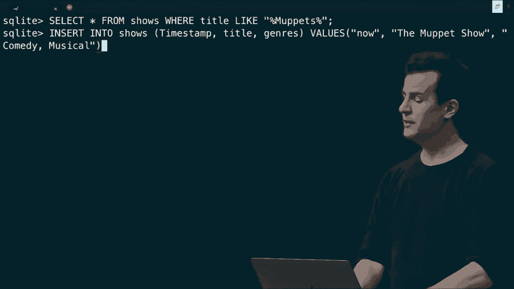

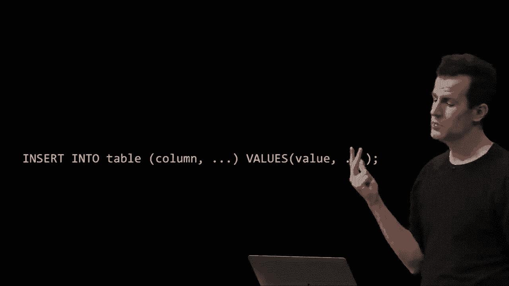

---

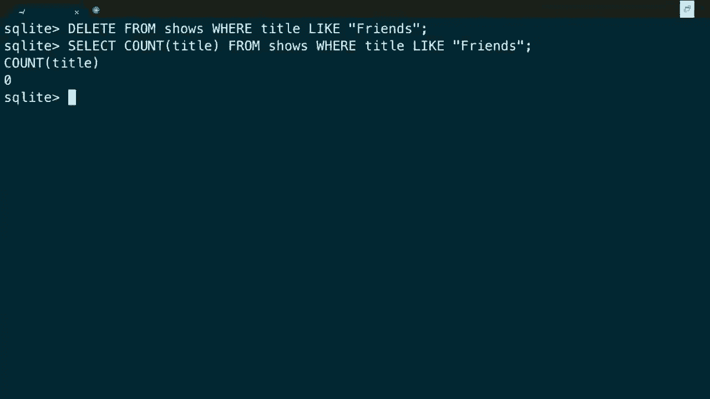

## 使用子句精确查询


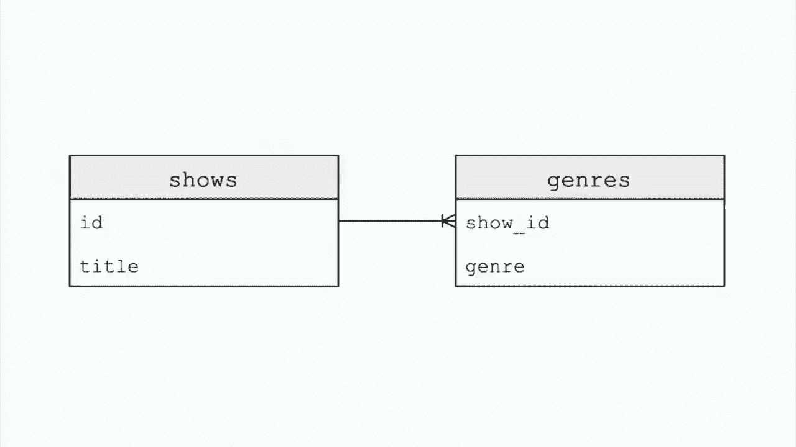

除了函数，SQL还提供了多种子句（Clause）来使查询更加精确和强大。

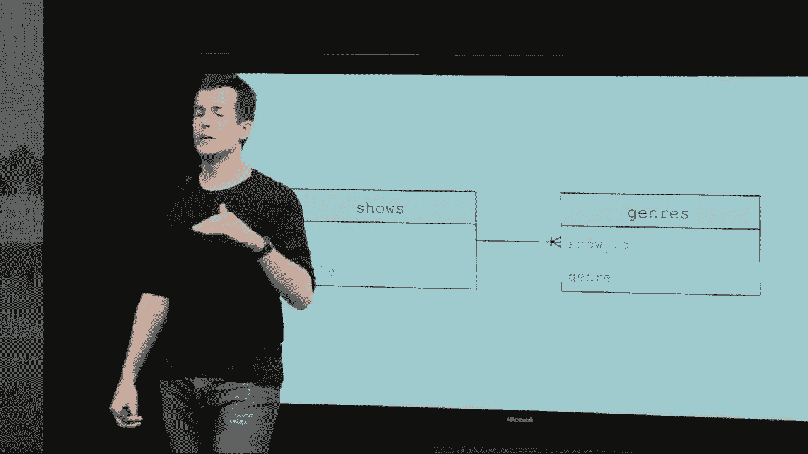

以下是几个常用的子句：
*   **`WHERE`**：用于指定查询条件，类似于编程中的`if`语句。
*   **`ORDER BY`**：用于按指定列对结果进行排序。
*   **`LIMIT`**：用于限制返回的行数。
*   **`GROUP BY`**：用于将相同的值分组，常与聚合函数（如`COUNT`）一起使用。


让我们看几个例子。


使用`WHERE`子句进行条件过滤。例如，查找标题为“The Office”的节目：
```sql
SELECT title FROM shows WHERE title = ‘The Office’;
```
为了进行更宽松的匹配（例如包含“office”的标题），可以使用`LIKE`操作符和通配符`%`：
```sql
SELECT title FROM shows WHERE title LIKE ‘%office%’;
```
`%`表示零个或多个任意字符。`LIKE`操作符在默认情况下是大小写不敏感的。


使用`ORDER BY`对结果进行排序。例如，按大写后的标题字母顺序排序：
```sql
SELECT DISTINCT UPPER(title) FROM shows ORDER BY UPPER(title);
```

使用`GROUP BY`和`COUNT`进行分组计数。例如，统计每个节目被喜欢的次数：
```sql
SELECT UPPER(title), COUNT(title) FROM shows GROUP BY UPPER(title);
```
`COUNT()`是一个聚合函数，用于计算行数。`GROUP BY UPPER(title)`会将所有大写标题相同的行合并，并计算每组的数量。


我们可以在此基础上按计数降序排列，并只查看前10个结果：
```sql
SELECT UPPER(title), COUNT(title) FROM shows GROUP BY UPPER(title) ORDER BY COUNT(title) DESC LIMIT 10;
```
`DESC`表示降序（Descending），`ASC`表示升序（Ascending，默认）。


---

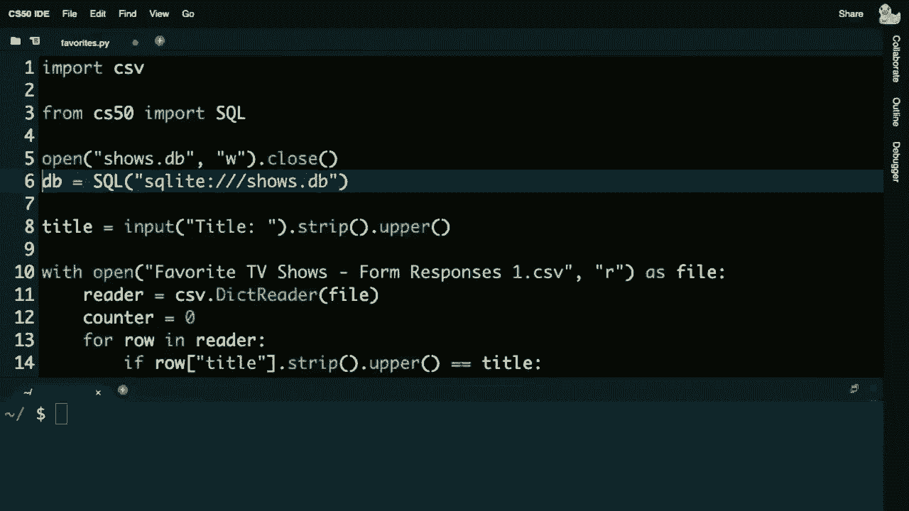

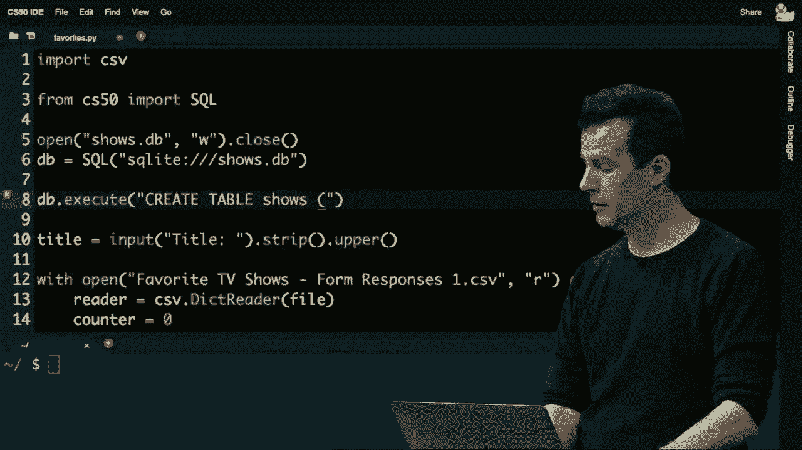

## 设计更好的数据库结构

目前，我们的`shows`表中有一个`genre`列，里面存放着用逗号分隔的多种类型（如“喜剧，剧情”）。这种设计在SQL中并不理想，因为它使得查询变得复杂（例如，查找所有“音乐剧”时需要处理字符串匹配）。

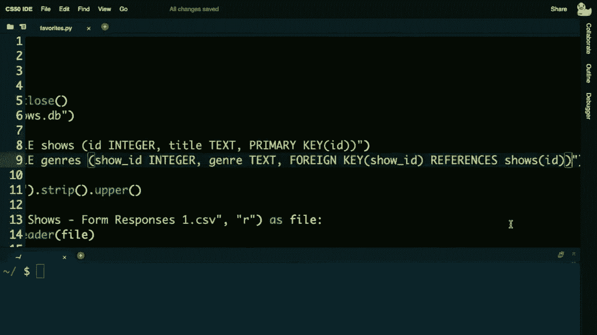

关系数据库的核心优势在于通过多个表以及表之间的关系来规范化数据，消除冗余。

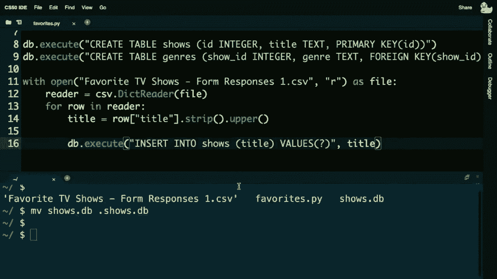

我们建议设计两个表：
1.  **`shows`表**：包含`id`（主键）和`title`两列。
2.  **`genres`表**：包含`show_id`（外键）和`genre`两列。


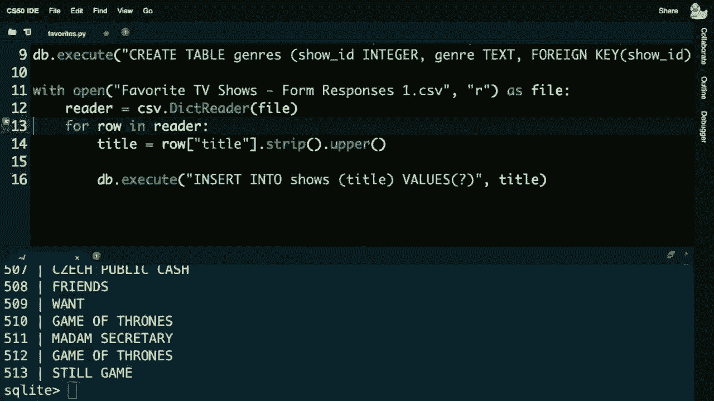

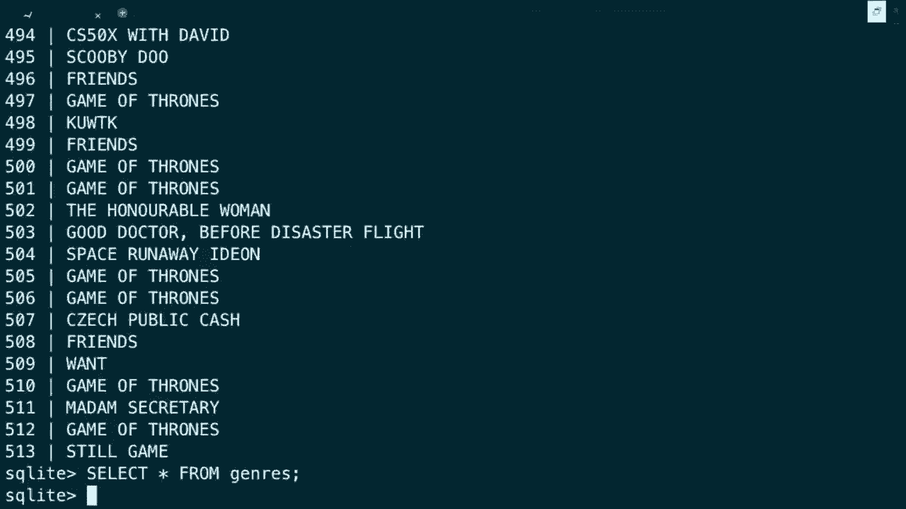

这样，一个节目（如ID为1的“The Office”）的多种类型（喜剧、剧情）就会在`genres`表中表示为多行独立的记录（`1，喜剧`、`1，剧情`）。这被称为“一对多”关系。

**主键**是表中唯一标识每一行的列。
**外键**是另一个表中引用了主键的列，用于建立表与表之间的关联。

---

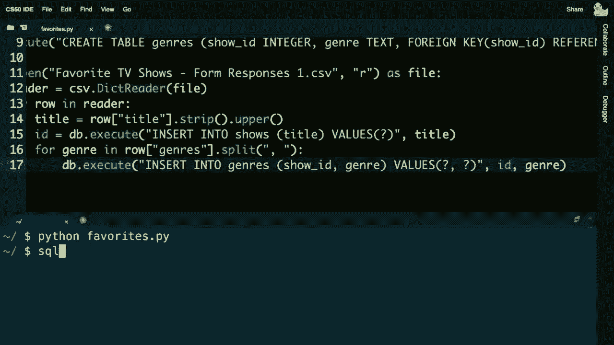


## 使用Python操作SQL数据库

手动输入SQL命令来插入大量数据效率很低。我们可以编写Python脚本，使用库（如CS50库）来连接并操作SQLite数据库。

以下是一个示例代码框架，展示了如何创建表、读取CSV文件并将数据插入到我们新设计的两个表中：
```python
import csv
from cs50 import SQL


# 打开（或创建）数据库连接
db = SQL(“sqlite:///shows.db”)

# 创建 shows 表
db.execute(“CREATE TABLE shows (id INTEGER, title TEXT, PRIMARY KEY(id))”)

# 创建 genres 表，并设置外键关联
db.execute(“””
    CREATE TABLE genres (
        show_id INTEGER,
        genre TEXT,
        FOREIGN KEY(show_id) REFERENCES shows(id)
    )
“””)

# 打开CSV文件
with open(“favorites.csv”, “r”) as file:
    reader = csv.DictReader(file)
    for row in reader:
        title = row[“title”].strip().upper() # 清理数据

        # 插入节目，并获取自动生成的主键id
        show_id = db.execute(“INSERT INTO shows (title) VALUES(?)”, title)

        # 分割类型字符串，并逐个插入到genres表
        for genre in row[“genre”].split(“, “):
            db.execute(“INSERT INTO genres (show_id, genre) VALUES(?, ?)”, show_id, genre)
```
在这段代码中：
*   `?` 是占位符，用于安全地插入变量值，防止SQL注入攻击。
*   将`shows`表的`id`列设为主键后，数据库会自动为其生成唯一的、递增的整数值。
*   通过`FOREIGN KEY`语句，我们建立了`genres.show_id`对`shows.id`的引用关系。

---


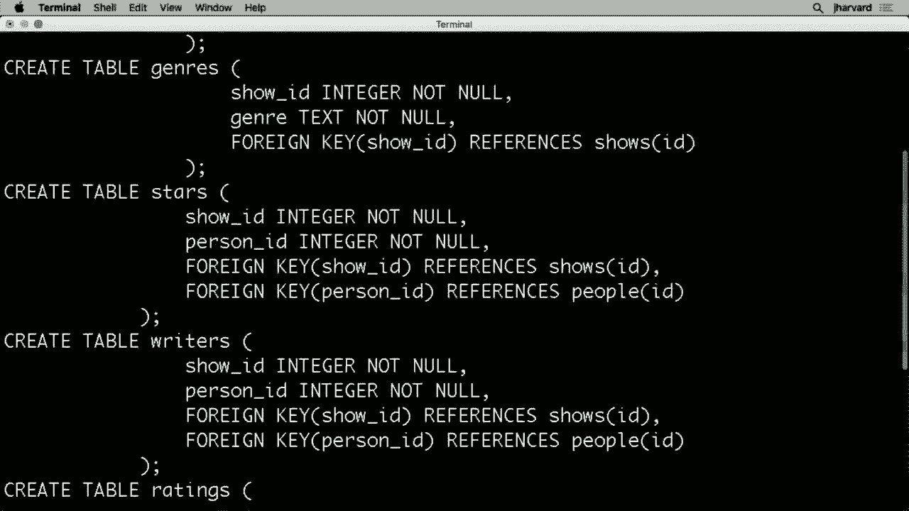

## 连接多个表进行查询

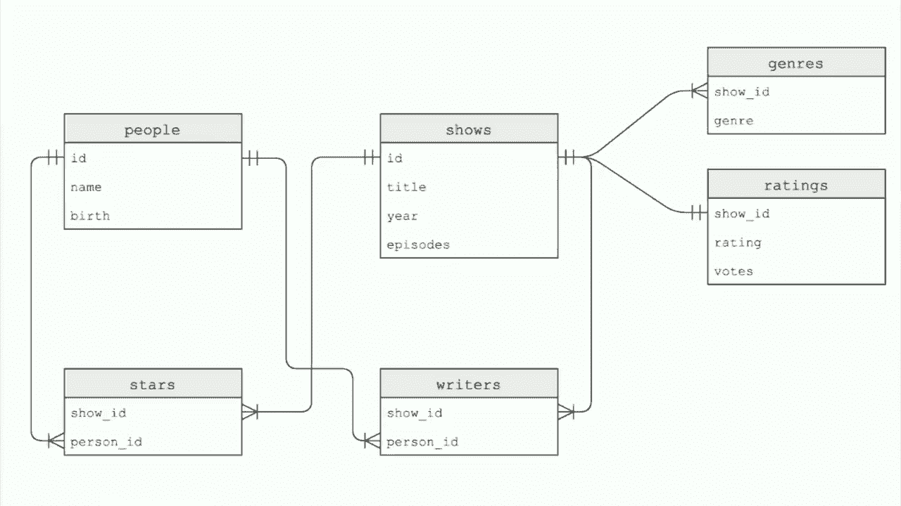

当数据分布在多个表中时，我们需要使用`JOIN`操作来根据关联关系重新组合数据。

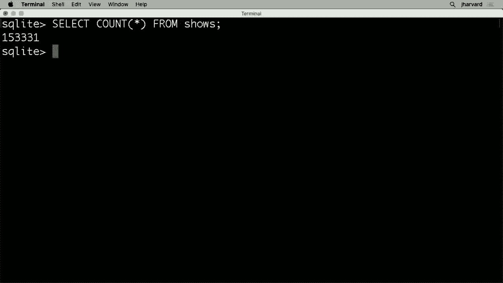

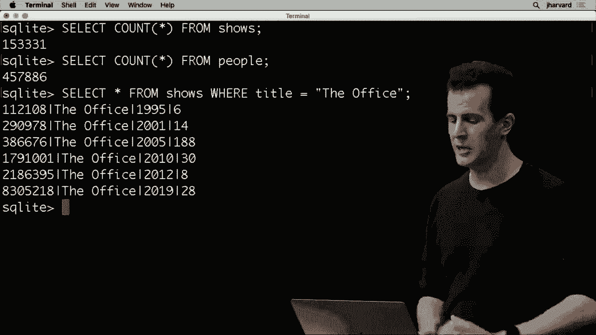

例如，我们想找出所有由“Steve Carell”主演的节目。这涉及到`people`、`stars`和`shows`三个表。
```sql
SELECT title FROM people
JOIN stars ON people.id = stars.person_id
JOIN shows ON stars.show_id = shows.id
WHERE name = ‘Steve Carell’;
```
这条查询语句的逻辑是：
1.  将`people`表与`stars`表连接，连接条件是人的ID相等。
2.  将连接后的结果再与`shows`表连接，连接条件是节目的ID相等。
3.  最后，从整个连接结果中筛选出名字为“Steve Carell”的行，并选择标题。

---

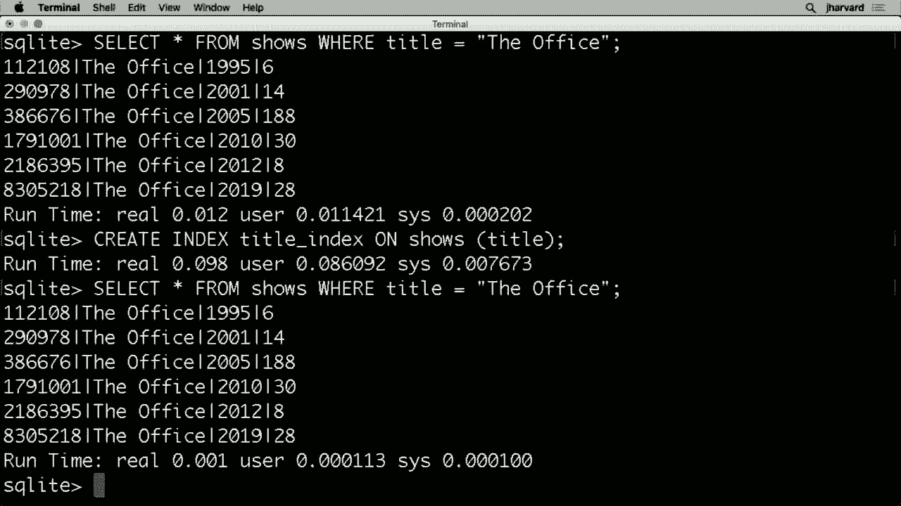

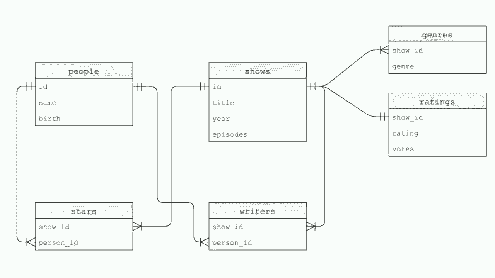

## 使用索引提升性能

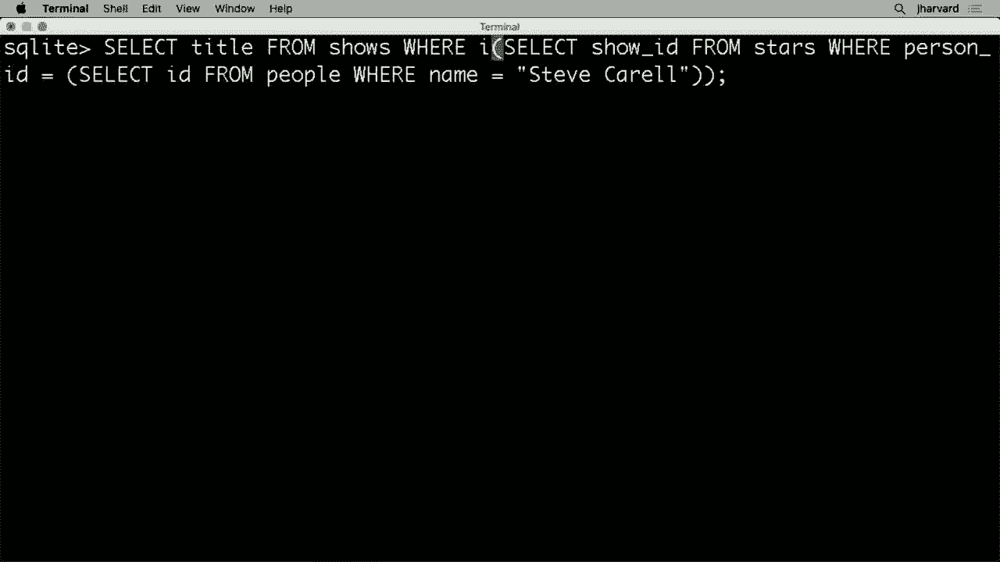

随着数据量增大，查询速度可能会变慢，因为默认情况下数据库是线性扫描（时间复杂度O(n)）。为了获得对数级（O(log n)）的查询效率，我们可以创建**索引**。

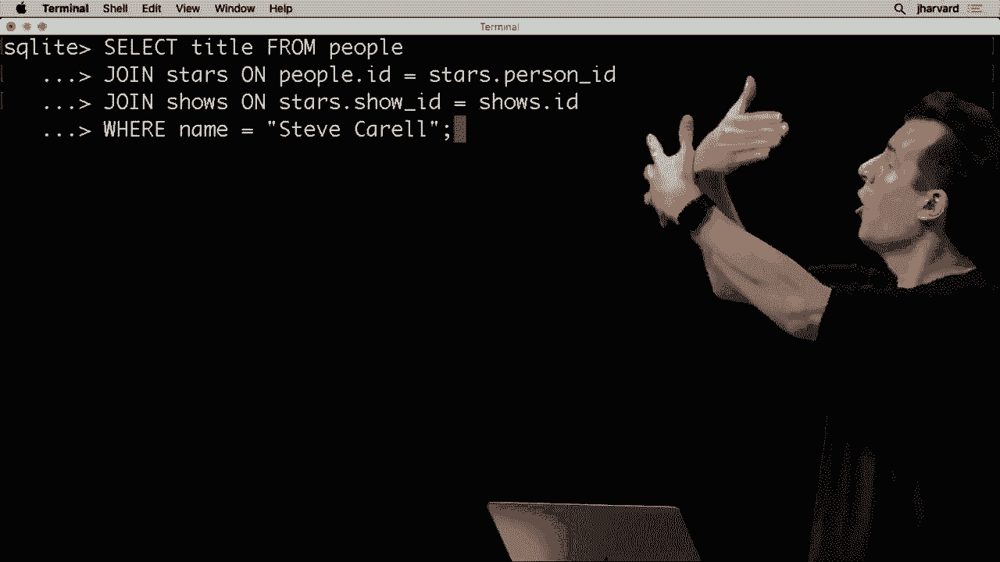


索引是数据库在后台创建的一种高效数据结构（如B树），可以大大加快基于特定列的搜索速度。

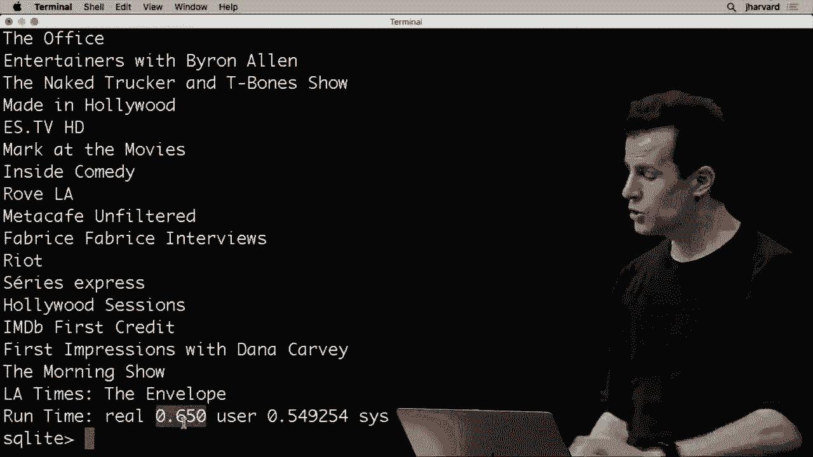


例如，为`people`表的`name`列创建索引：
```sql
CREATE INDEX person_index ON people (name);
```
创建索引可能需要一些时间，但这是一次性的开销。之后，所有基于`name`列的查询（如`WHERE name = ‘…’`）都会快得多。

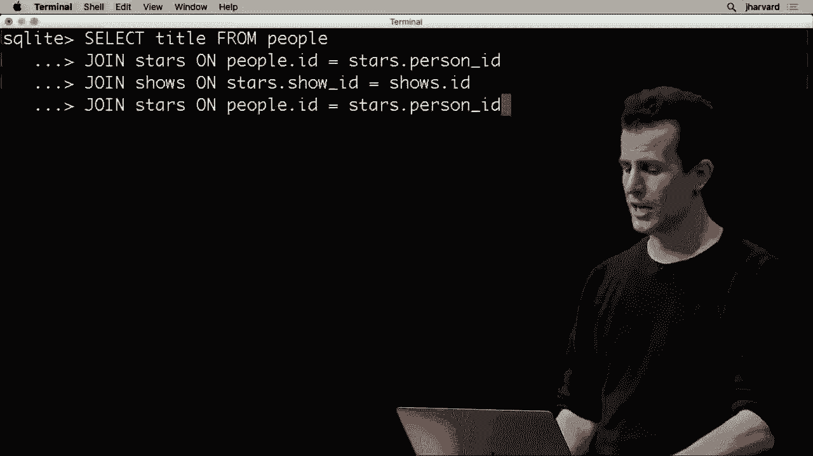

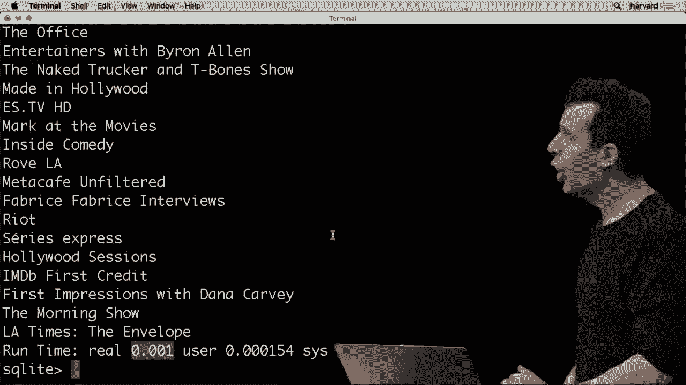

---

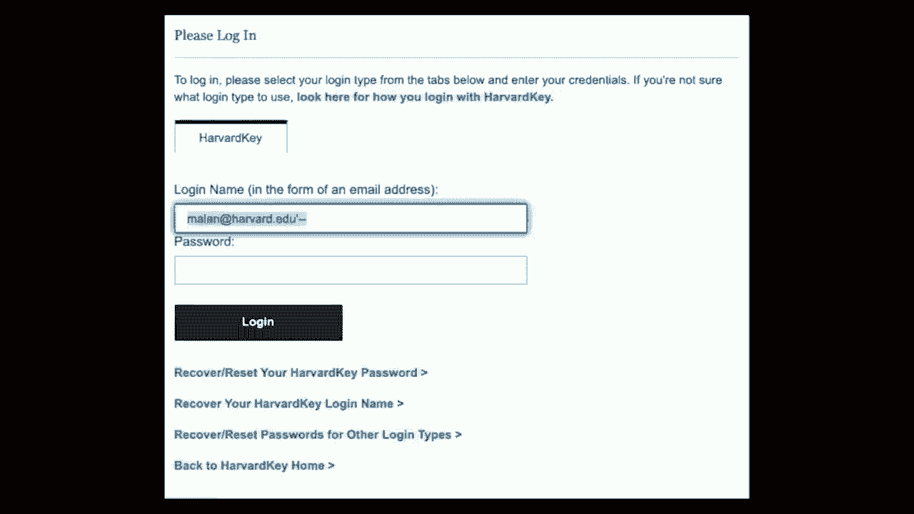

## 安全与并发问题

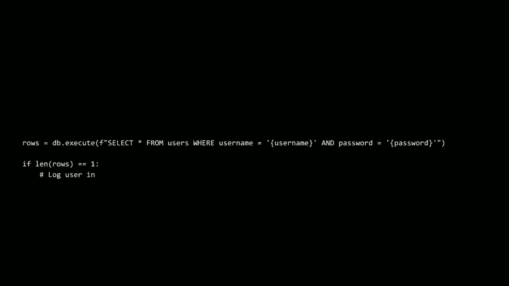


### SQL注入攻击
如果直接将用户输入拼接到SQL查询字符串中，恶意用户可能输入特殊字符来改变查询逻辑，从而未经授权访问或破坏数据。这被称为SQL注入攻击。

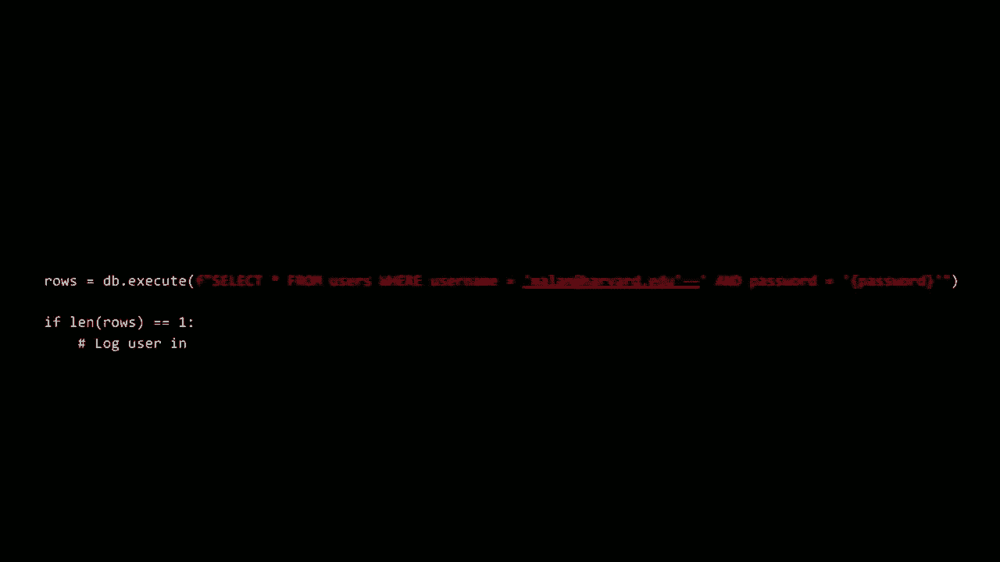


**危险的做法（Python f-string）：**
```python
db.execute(f“SELECT * FROM users WHERE username = ‘{username}’ AND password = ‘{password}’“)
```
如果用户输入用户名 `malan@harvard.edu’--`，`--`在SQL中是注释符，会导致密码检查被忽略，从而绕过登录。


**安全的做法（使用占位符）：**
```python
db.execute(“SELECT * FROM users WHERE username = ? AND password = ?”, username, password)
```
使用问号`?`作为占位符，让数据库库来处理参数的插入，可以完全防止SQL注入。


### 竞争条件
当多个操作（如两个用户同时给一个帖子点赞）几乎同时尝试读取和更新同一个数据时，可能会发生竞争条件。

例如，点赞的逻辑是：
1.  `SELECT likes FROM posts WHERE id = 1;` （读取当前点赞数，假设是50）
2.  在代码中将点赞数加1，得到51。
3.  `UPDATE posts SET likes = 51 WHERE id = 1;` （更新点赞数）

如果两个请求交错执行，可能最终点赞数只增加了1，而不是2。

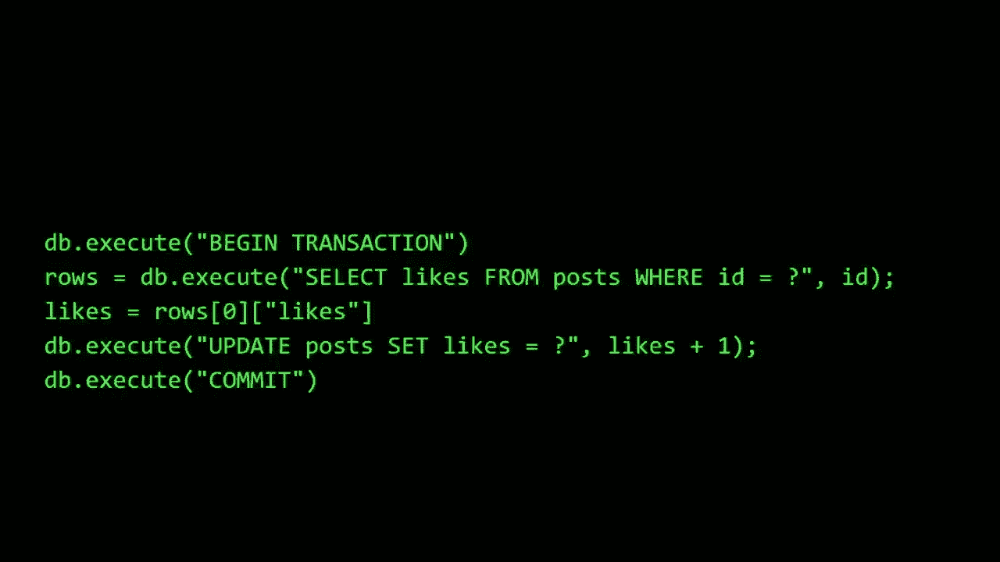

解决方案是使用**事务**。事务可以确保一系列数据库操作要么全部成功，要么全部失败，并且在操作过程中可以锁定相关数据行，防止其他操作干扰。
```sql
BEGIN TRANSACTION;
-- 执行一系列SELECT和UPDATE操作
COMMIT;
```


---


## 总结


本节课我们一起深入学习了SQL数据库的核心知识。我们掌握了使用`SELECT`语句配合`WHERE`、`ORDER BY`、`GROUP BY`等子句以及`DISTINCT`、`COUNT`、`UPPER`等函数来查询和操作数据。我们理解了通过创建多个表并使用主键和外键来规范化数据库设计的重要性。我们还初步了解了如何使用Python程序连接和操作数据库，以及如何通过创建索引来优化查询性能。最后，我们探讨了SQL注入和竞争条件这两个关键的安全与并发问题及其防范措施。SQL是一种强大而表达力丰富的语言，是处理结构化数据的基石。