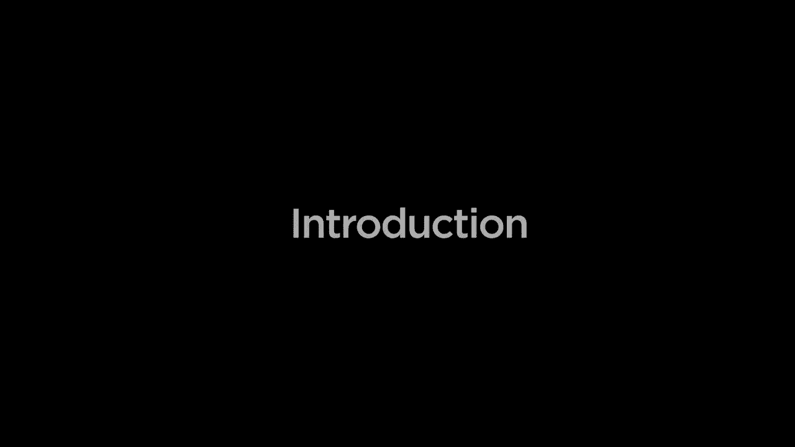
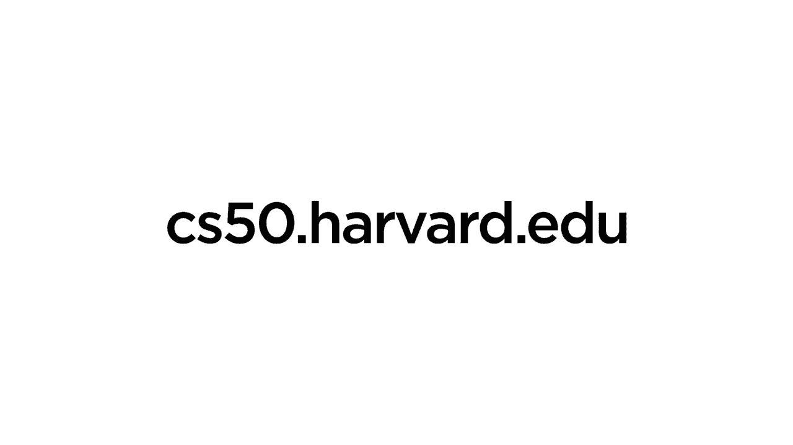

 # 哈佛CS50-WEB1：介绍与入门 🚀

在本节课中，我们将要学习《哈佛CS50-WEB：基于Python／JavaScript的Web编程》课程的第一部分。我们将了解这门课程的整体结构、将要学习的关键技术栈，以及如何从零开始构建现代、动态且安全的网络应用。

这门课程将从CS50的基础知识出发，深入探讨使用Python和JavaScript设计和实现网络应用。我们将使用Django、React和Bootstrap等流行框架，并学习行业最佳实践。

## 📚 课程内容概览

以下是本课程将涵盖的核心模块与技术。

*   **HTML与CSS**：首先，我们将仔细学习HTML和CSS。这两种语言用于描述网页的结构与样式，是构建任何网页的基石。
*   **Git版本控制**：之后，我们将介绍Git版本控制工具。它帮助我们跟踪代码更改，并支持多人在同一项目中高效协作。
*   **深入Python与Django**：接着，我们将更深入地探索Python编程语言的高级特性。重点是学习如何使用Django这一网络框架来创建动态网络应用。我们将充分利用Django处理数据的能力，结合SQL模型与迁移，构建使用数据库的交互式应用。
*   **JavaScript与交互界面**：然后，我们将深入探索JavaScript。我们将学习如何使用它来创建动态、交互式的用户界面，编写响应事件的代码，并根据用户交互来操作网页。
*   **行业最佳实践**：之后，我们将探讨测试、持续集成与持续交付等最佳实践。这能确保我们的代码按预期工作，并能快速、安全地部署更新。
*   **可扩展性与安全性**：最后，当我们将应用从本地部署到网络供所有人访问时，将讨论如何确保应用的可扩展性（以应对大量用户）和安全性（以防范各种网络威胁）。

## 🎯 实践与总结

沿着这条学习路径，你将有机会通过构建自己的网络应用来实践所有学到的概念和技术。

本节课中，我们一起学习了《哈佛CS50-WEB》课程的整体介绍与入门知识。我们了解了课程将引导我们从网页基础（HTML/CSS）开始，逐步掌握后端开发（Python/Django）、前端交互（JavaScript）以及部署运维（Git、测试、CI/CD、安全与扩展）的完整技能栈，为成为一名全栈Web开发者打下坚实基础。