# 哈佛 CS50-WEB 15：L5- JavaScript编程全解 1 (事件，变量) 🚀


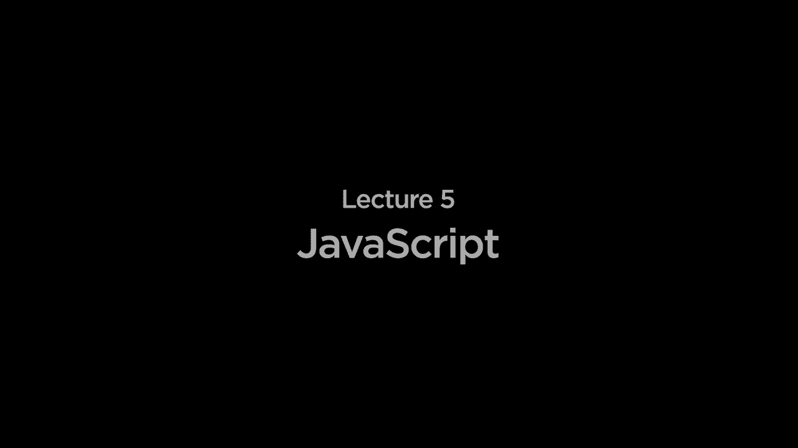


[音乐]


## 概述

在本节课中，我们将要学习JavaScript编程的基础知识。我们将了解JavaScript如何作为客户端脚本语言在用户的网页浏览器中运行，并探索其核心概念，包括事件处理和变量操作。通过本节课的学习，你将能够编写简单的JavaScript代码，使网页具备交互性。

## 从服务器端到客户端

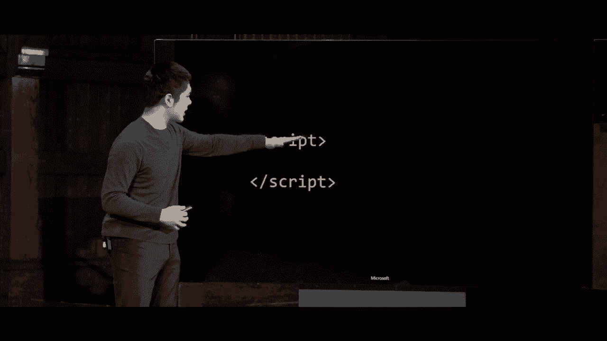

上一节我们介绍了基于Python的服务器端Web编程。本节中我们来看看客户端编程语言JavaScript。

通常，用户（也称为客户端）使用网页浏览器（如Chrome或Safari）向Web服务器发送HTTP请求。服务器处理请求后，返回响应给客户端。到目前为止，我们编写的所有代码（例如在Django Web应用程序中）都在服务器上运行。

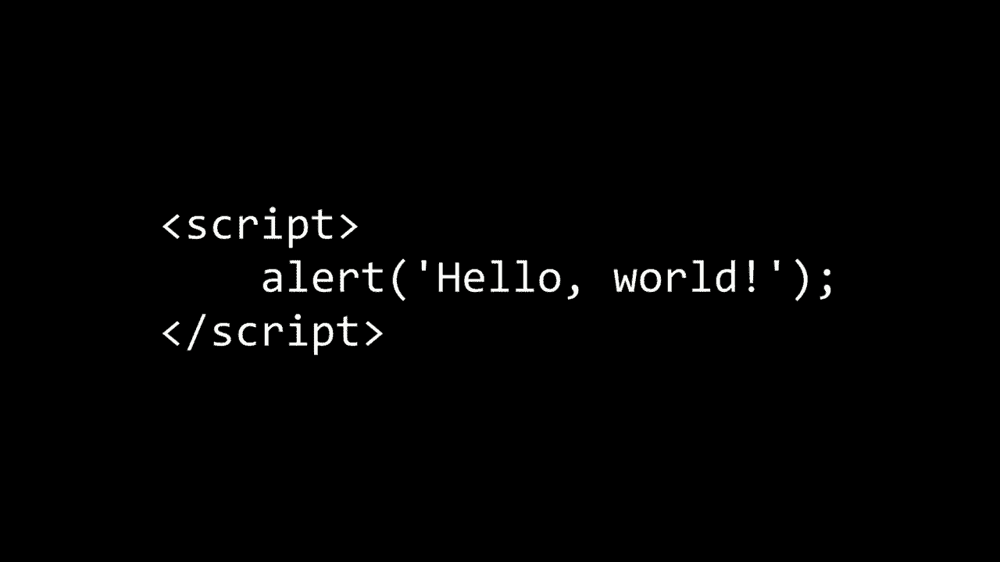

JavaScript使我们能够开始编写在用户网页浏览器中运行的客户端代码。这非常有用，原因如下：
*   首先，如果有些计算不需要与服务器交互，在客户端独立运行代码可以更快。
*   其次，我们可以使网页更具互动性。HTML仅描述页面结构，而JavaScript提供了直接操作DOM（文档对象模型）的能力。DOM代表了用户所查看网页的树状层次结构。

## 如何在网页中添加JavaScript 🛠️

我们如何在网页中使用JavaScript来添加编程逻辑呢？HTML是一种通过嵌套标签描述网页结构的语言。为了将JavaScript添加到网页中，我们使用 `<script>` 标签。

以下是使用 `<script>` 标签的方法：
*   在HTML页面内部使用 `<script>` 标签。
*   浏览器会将 `<script>` 标签之间的任何内容解释为JavaScript代码并执行。

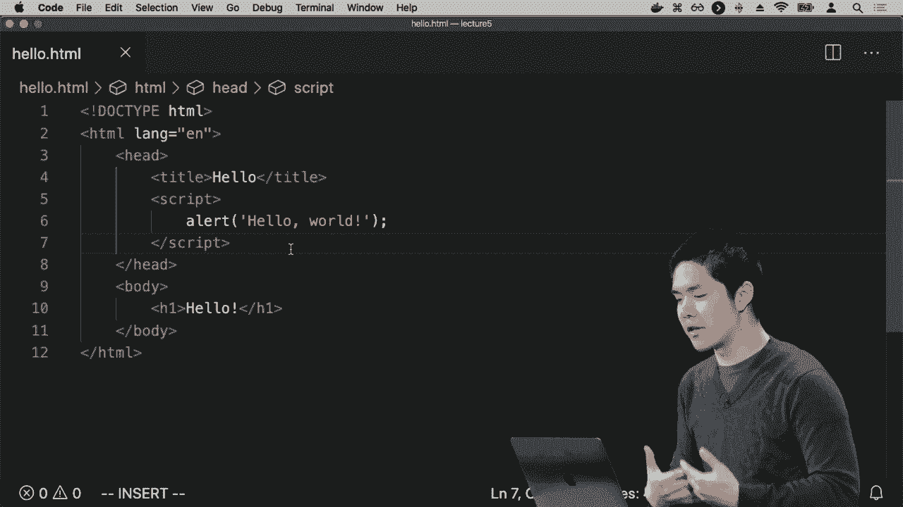

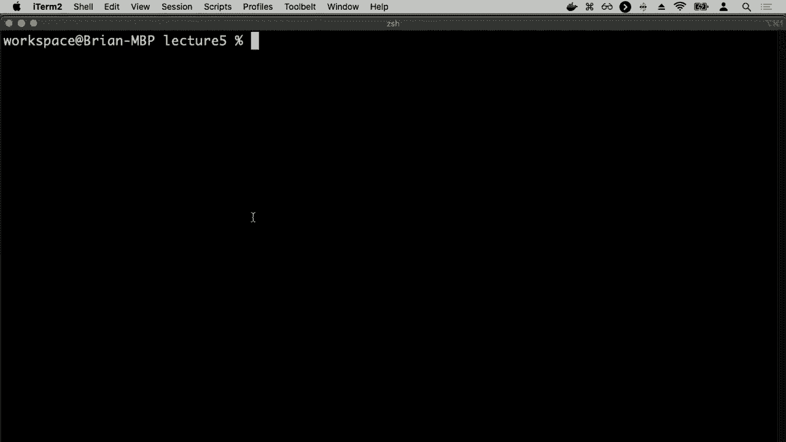

我们的第一个程序可能看起来像这样：

```html
<script>
    alert('你好，世界');
</script>
```

其中 `alert` 是一个函数，它会向用户显示一个包含指定文本的警告框。

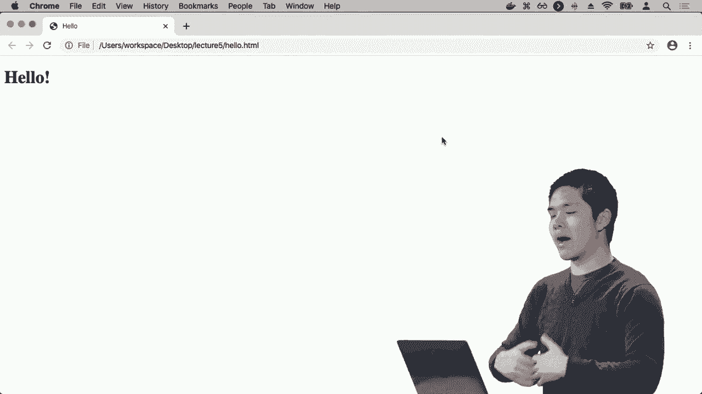

让我们来实践一下。创建一个名为 `hello.html` 的新文件，并包含以下代码：

```html
<!DOCTYPE html>
<html lang="en">
<head>
    <meta charset="UTF-8">
    <title>Hello</title>
    <script>
        alert('你好，世界');
    </script>
</head>
<body>
    <h1>你好</h1>
</body>
</html>
```

当你在浏览器中打开这个文件时，页面顶部会显示一个写着“你好，世界”的警告框。点击“确定”按钮关闭警告后，你将看到原始的“你好”页面。这是我们第一个JavaScript示例，它使用了浏览器内置的 `alert` 函数。

## 事件驱动编程 ⚡

上一节我们介绍了如何执行简单的JavaScript代码。本节中我们来看看JavaScript的核心编程范式：事件驱动编程。

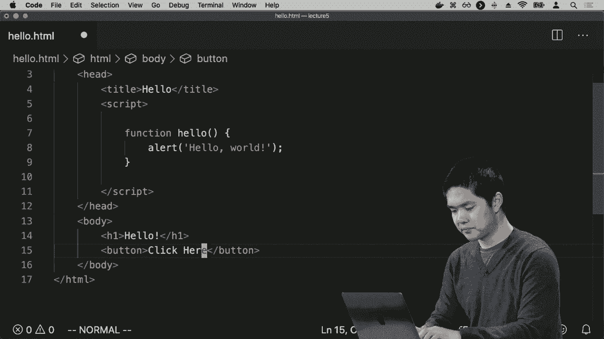

网络上的许多交互都是以事件的形式发生的。事件的例子包括：
*   用户点击按钮。
*   用户从下拉列表中选择选项。
*   用户滚动页面。
*   用户提交表单。

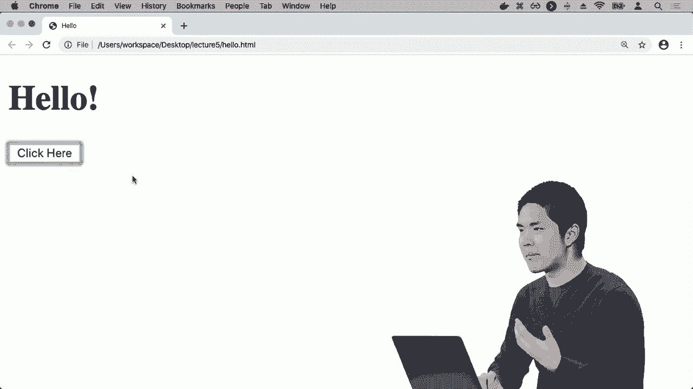

我们可以为这些事件添加“事件监听器”或“事件处理程序”。这些处理程序是当特定事件发生时运行的JavaScript函数。

让我们修改之前的例子，让警告在点击按钮时显示，而不是在页面加载时显示。

首先，我们将警告功能封装到一个函数中：

```javascript
function hello() {
    alert('你好，世界');
}
```

然后，我们在HTML中添加一个按钮，并为其设置 `onclick` 事件处理程序：

```html
<button onclick="hello()">点击这里</button>
```

现在，完整的 `hello.html` 文件如下：

```html
<!DOCTYPE html>
<html lang="en">
<head>
    <meta charset="UTF-8">
    <title>Hello</title>
    <script>
        function hello() {
            alert('你好，世界');
        }
    </script>
</head>
<body>
    <h1>你好</h1>
    <button onclick="hello()">点击这里</button>
</body>
</html>
```

刷新页面后，你会看到“你好”标题和一个“点击这里”按钮。只有当你点击按钮时，才会弹出“你好，世界”的警告框。每次点击按钮，都会调用 `hello` 函数并显示警告。

## 使用变量存储状态 🔢

上一节我们让代码响应了点击事件。本节中我们来看看如何使用变量来跟踪和存储数据。

我们将创建一个简单的计数器程序。创建一个新文件 `counter.html`。

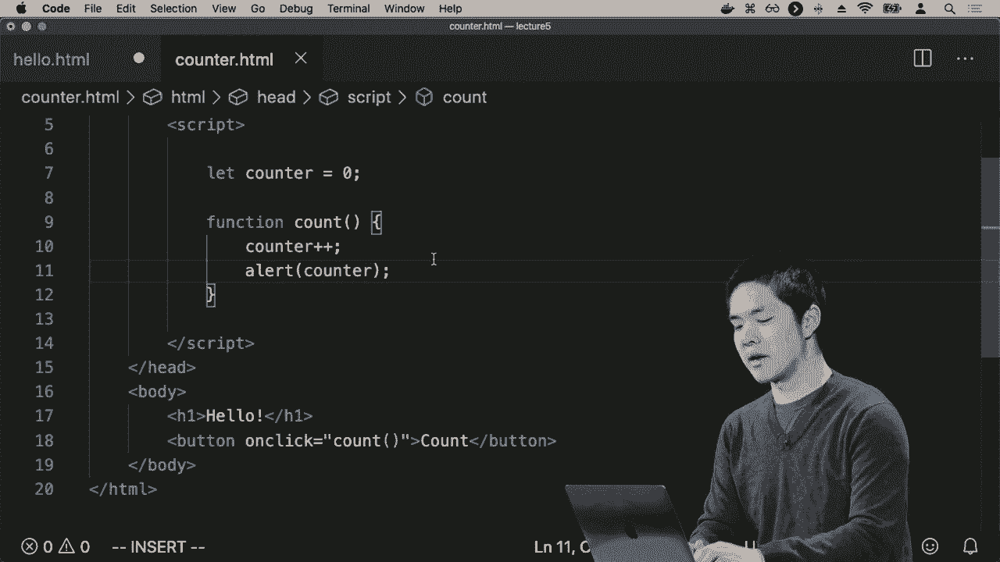

首先，我们定义一个变量来存储当前的计数值，并初始化为0：

```javascript
let counter = 0;
```

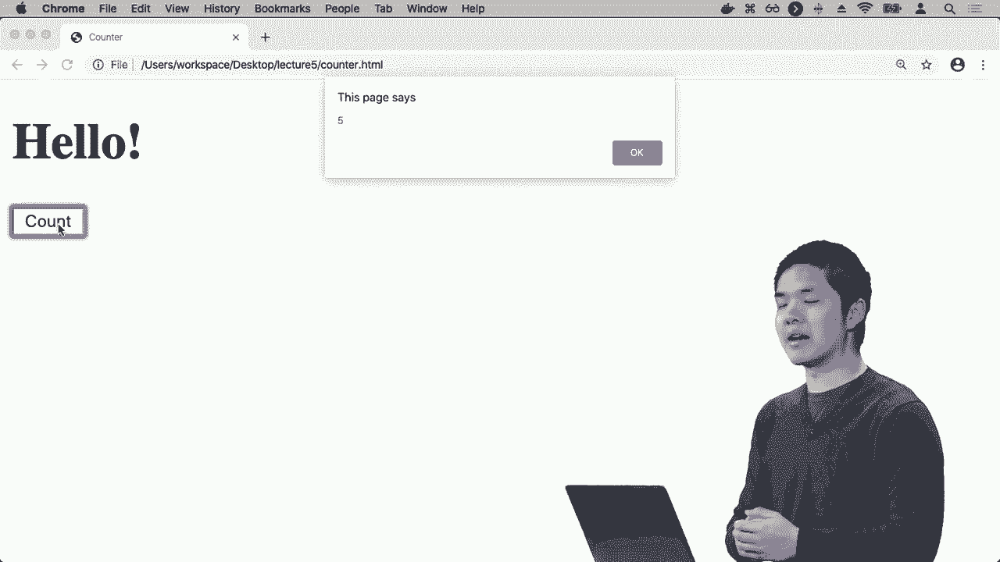

然后，我们创建一个 `count` 函数，每次调用时增加计数器的值并显示它：

```javascript
function count() {
    counter++;
    alert(counter);
}
```

以下是增加变量值的几种等效写法：
*   `counter = counter + 1;`
*   `counter += 1;`
*   `counter++;` (这是增加1的简写)

最后，在HTML中添加一个按钮来触发这个函数：

```html
<button onclick="count()">计数</button>
```

完整的 `counter.html` 文件如下：

```html
<!DOCTYPE html>
<html lang="en">
<head>
    <meta charset="UTF-8">
    <title>Counter</title>
    <script>
        let counter = 0;

        function count() {
            counter++;
            alert(counter);
        }
    </script>
</head>
<body>
    <h1>计数器</h1>
    <button onclick="count()">计数</button>
</body>
</html>
```

打开页面，点击“计数”按钮，你会看到警告框依次显示1, 2, 3... 每次点击，变量 `counter` 的值都会增加，并显示出来。

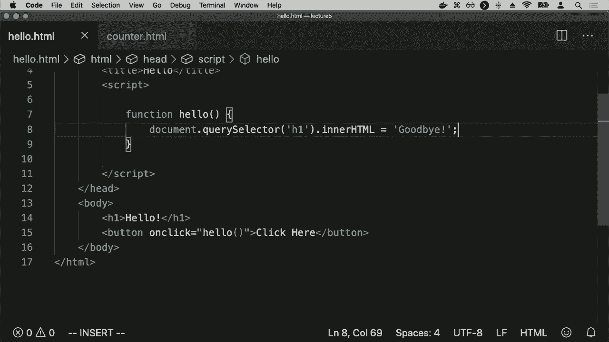

## 操作DOM以更新页面内容 🎨

上一节我们使用警告框来显示信息。本节中我们来看看如何直接操作网页内容，这是JavaScript在Web开发中更强大、更常见的用途。

我们可以使用JavaScript来操作DOM（文档对象模型），即页面上所有元素的表示。让我们回到 `hello.html` 的例子，这次我们不显示警告，而是直接更改页面上的文本。

我们将修改 `hello` 函数，让它找到页面上的 `<h1>` 元素并将其内容从“你好”改为“再见”。

使用 `document.querySelector()` 函数可以选择页面上的元素。它接收一个CSS选择器作为参数（例如 `'h1'` 用于选择第一个 `<h1>` 标签），并返回该元素的JavaScript表示。

然后，我们可以通过修改元素的 `innerHTML` 属性来改变其内容。

修改后的 `hello` 函数如下：

```javascript
function hello() {
    document.querySelector('h1').innerHTML = '再见！';
}
```

现在，完整的 `hello.html` 文件如下：

```html
<!DOCTYPE html>
<html lang="en">
<head>
    <meta charset="UTF-8">
    <title>Hello</title>
    <script>
        function hello() {
            document.querySelector('h1').innerHTML = '再见！';
        }
    </script>
</head>
<body>
    <h1>你好</h1>
    <button onclick="hello()">点击这里</button>
</body>
</html>
```

打开页面，点击按钮，标题会从“你好”变成“再见！”。我们成功使用JavaScript代码查找并操纵了页面元素。

## 添加条件逻辑和优化代码 ⚖️

上一节我们实现了直接更新页面内容。本节中我们来看看如何添加条件逻辑，并优化我们的代码。

如果我们希望点击按钮时，文本在“你好”和“再见”之间切换，而不是永远变成“再见”，就需要使用条件语句。

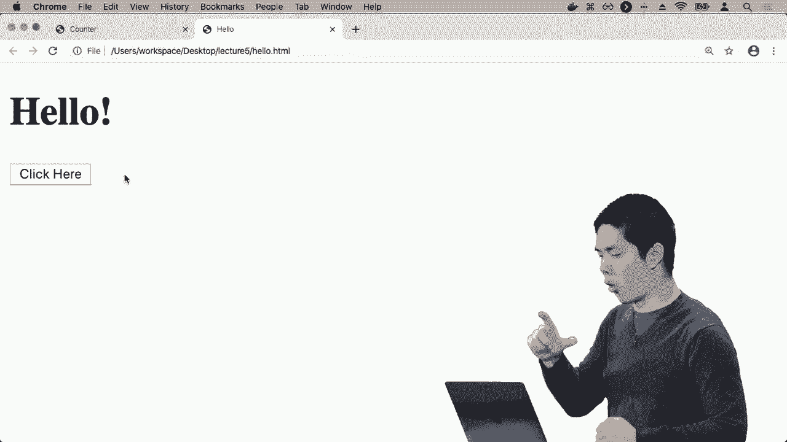

JavaScript的条件语句与Python类似，使用 `if`、`else if` 和 `else`。我们使用 `===` 进行严格相等比较（检查值和类型是否都相同）。也可以使用 `==` 进行宽松比较，但通常推荐使用 `===`。

以下是实现切换功能的 `hello` 函数：

```javascript
function hello() {
    if (document.querySelector('h1').innerHTML === '你好') {
        document.querySelector('h1').innerHTML = '再见！';
    } else {
        document.querySelector('h1').innerHTML = '你好';
    }
}
```

这段代码有一个可以优化的地方：它三次调用了 `document.querySelector('h1')`，效率较低。我们可以将查找到的元素存储在一个变量中，然后重复使用这个变量。

此外，如果我们知道一个变量的值在初始化后不会改变，应该使用 `const` 而不是 `let` 来声明它，这能防止意外修改并提高代码清晰度。

优化后的代码如下：

```javascript
function hello() {
    const heading = document.querySelector('h1');
    if (heading.innerHTML === '你好') {
        heading.innerHTML = '再见！';
    } else {
        heading.innerHTML = '你好';
    }
}
```

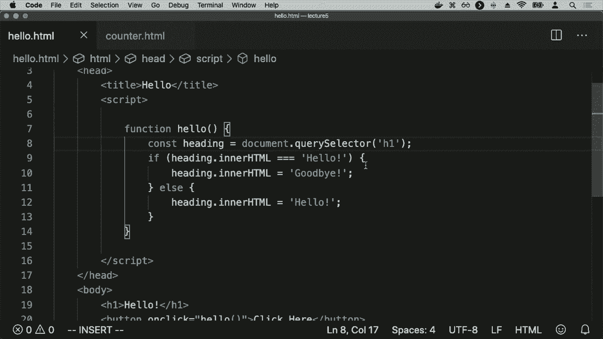

现在，页面标题会在“你好”和“再见！”之间来回切换，并且我们的代码更高效、更易读。

## 总结

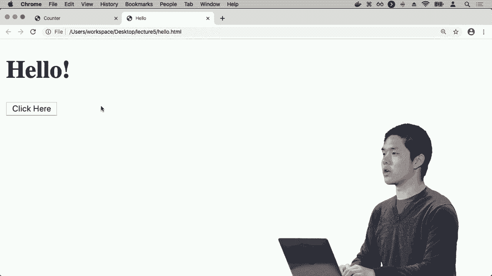

本节课中我们一起学习了JavaScript编程的基础知识。我们了解了JavaScript作为客户端语言的作用，学会了如何在HTML中使用 `<script>` 标签添加JavaScript代码。我们探索了事件驱动编程，通过 `onclick` 属性让函数响应按钮点击事件。我们还学习了如何使用 `let` 和 `const` 声明变量来存储和跟踪数据状态。最后，我们掌握了通过 `document.querySelector()` 操作DOM来动态更新网页内容的方法，并引入了条件逻辑 (`if...else`) 来创建更复杂的交互行为。这些是构建交互式Web应用的基石。