# 哈佛 CS50-WEB ｜ 基于Python / JavaScript的Web编程(2020·完整版) - P14：L4- 数据库、SQL与集成 3 (用户管理) 🧑‍💻

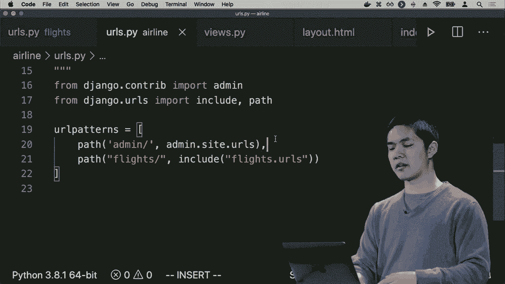

在本节课中，我们将要学习如何利用Django框架内置的强大功能来管理用户和模型数据。我们将重点探索Django的管理应用程序、如何扩展我们的航班应用以包含乘客信息，以及如何实现用户认证系统。通过这些内容，你将学会如何高效地操作数据库，并为你的Web应用添加用户登录和登出功能。

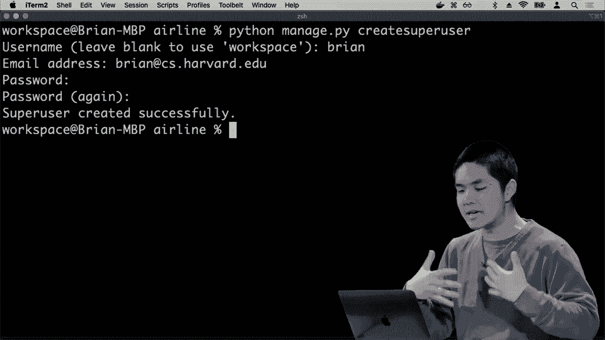

## 概述：Django管理应用程序 🛠️

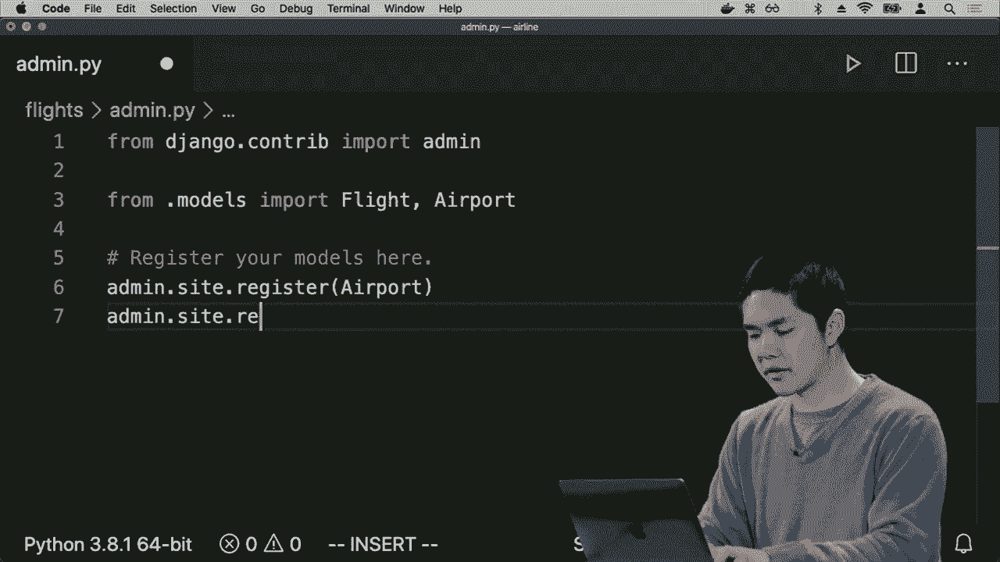

上一节我们介绍了如何创建模型和视图。本节中我们来看看Django如何通过其内置的管理应用程序，让我们无需编写大量代码就能操作数据库模型。

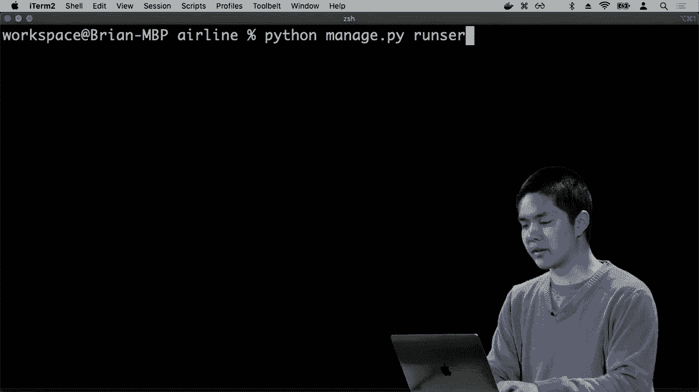

Django基于“不重复造轮子”的理念构建。它不希望程序员重复他人已完成的工作。定义模型并快速创建、编辑和操作模型的过程非常普遍，因此Django已经构建了一个完整的、专门用于操作模型的应用程序，称为**Django管理应用程序**。

我们已经看到过这个应用程序的踪迹。在我们的应用程序内部的`urls.py`配置文件中，除了为我们自己的应用添加路径外，Django还默认提供了一个路径：
```
path('admin/', admin.site.urls)
```
访问 `/admin` 路径会将我们带到管理应用程序。

为了使用这个管理应用程序，我们需要在Django网络应用程序内部创建一个管理员账户。这可以通过命令行完成：
```bash
python manage.py createsuperuser
```
此命令会提示输入用户名、电子邮件地址和密码。Django会为这个网络应用程序创建一个超级用户账户，使我们能够使用这些凭证访问管理网页界面，并操作底层模型。

## 注册模型到管理界面 📝

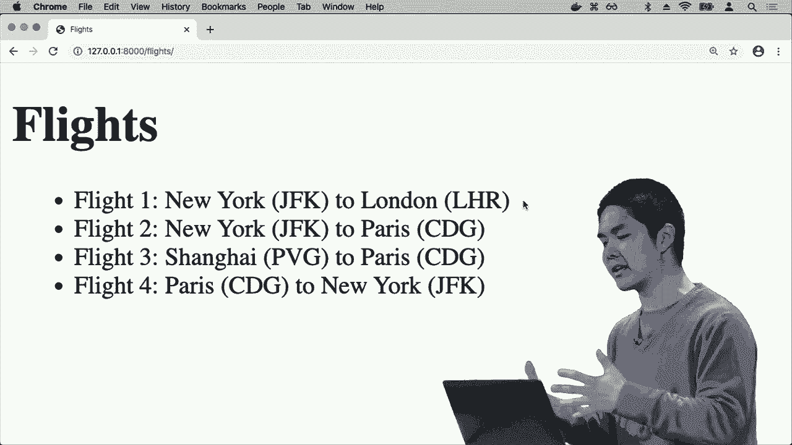

为了在管理界面中操作我们的模型，我们需要做的第一件事是将模型注册到管理应用程序。

在模型的`models.py`文件中，我们定义了`Airport`和`Flight`类。在我们的应用目录中，还有一个名为`admin.py`的文件。在这个文件中，我们首先从模型中导入`Flight`和`Airport`，然后使用`admin.site.register()`方法进行注册。

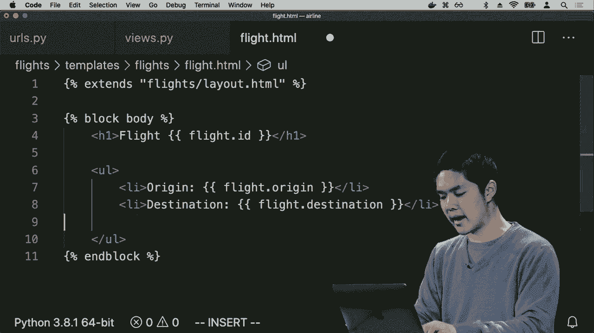

以下是`admin.py`文件的内容示例：
```python
from django.contrib import admin
from .models import Flight, Airport

admin.site.register(Airport)
admin.site.register(Flight)
```
这段代码告诉Django的管理应用程序，我们希望使用它来操作`Airport`和`Flight`模型。

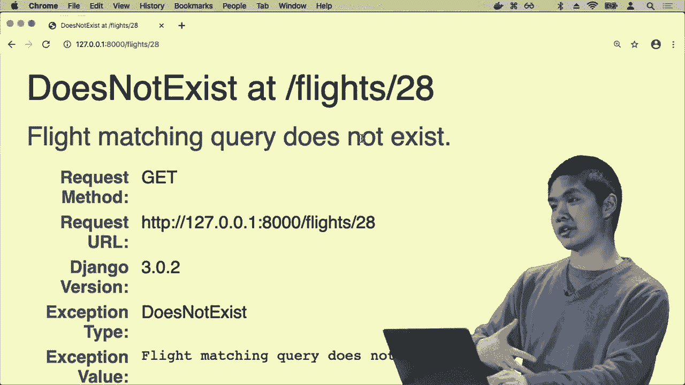

## 使用管理界面操作数据 🖥️

现在让我们启动服务器并查看管理应用程序的实际工作方式。

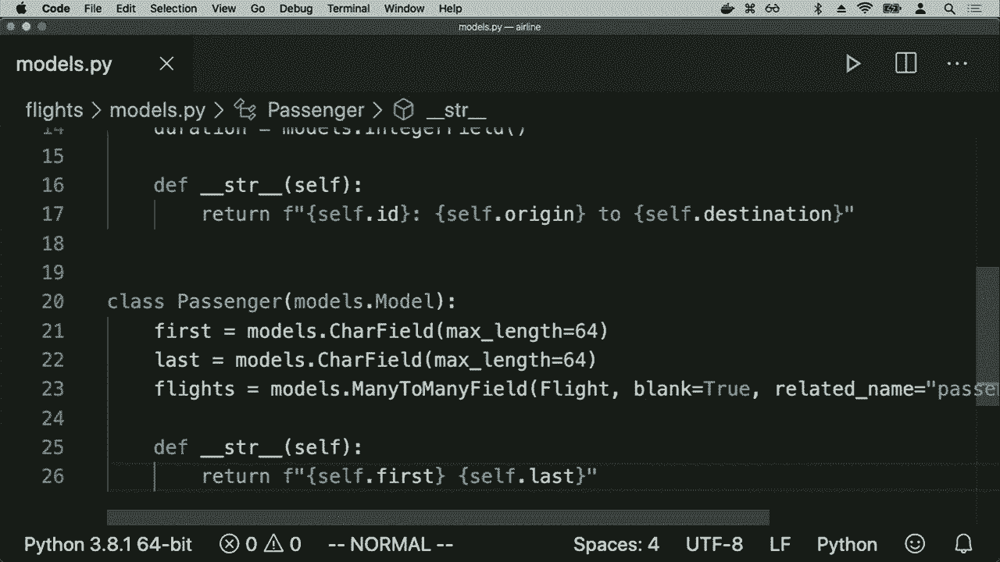

运行以下命令启动网络服务器：
```bash
python manage.py runserver
```
访问 `http://localhost:8000/admin`（而不是 `/flights`），这将打开Django管理应用程序的登录界面。使用之前创建的超级用户凭证登录。

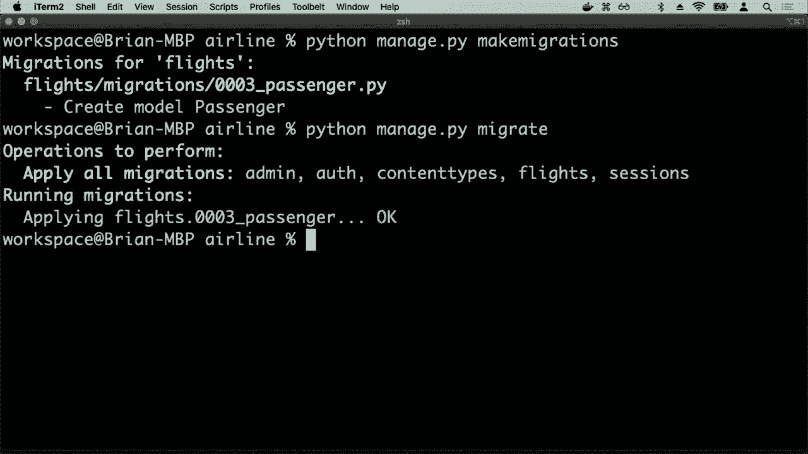

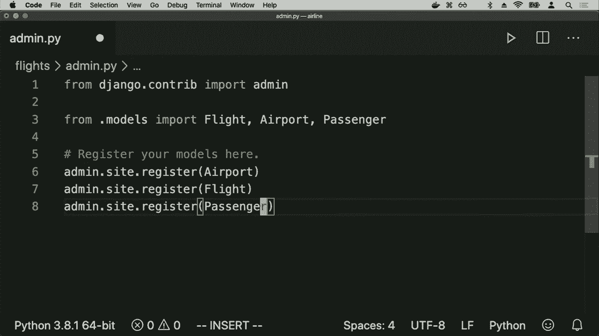

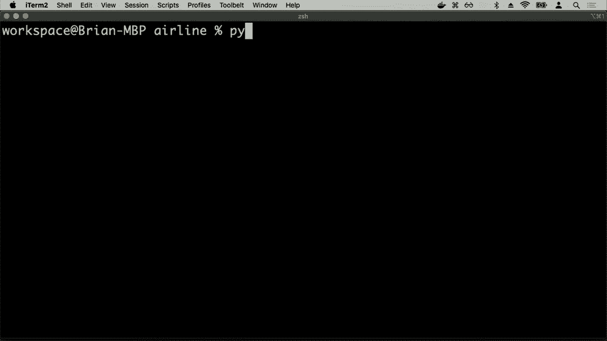

登录后，你将看到Django的站点管理界面。这个界面完全由Django构建，我们无需设计。重要的是，我们现在有能力通过这个网页接口来“添加”和“管理”机场与航班。

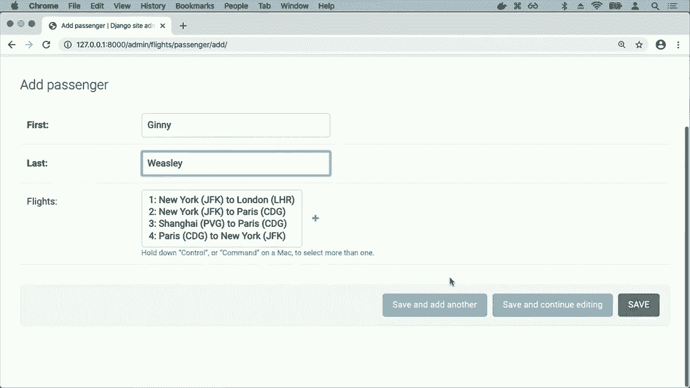

例如，点击“Airports”，可以看到已添加到数据库中的机场（如东京、巴黎、伦敦、纽约）。我们可以点击“ADD AIRPORT”来添加新机场，例如上海（PVG）、伊斯坦布尔、莫斯科和利马。添加后点击保存。

同样，我们可以点击“Flights”来添加新航班，选择出发地、目的地和时长。通过这个界面，我们能够快速地向网站添加新数据。Django最初就是为新闻机构设计的，这种界面使得快速发布新文章变得非常容易。

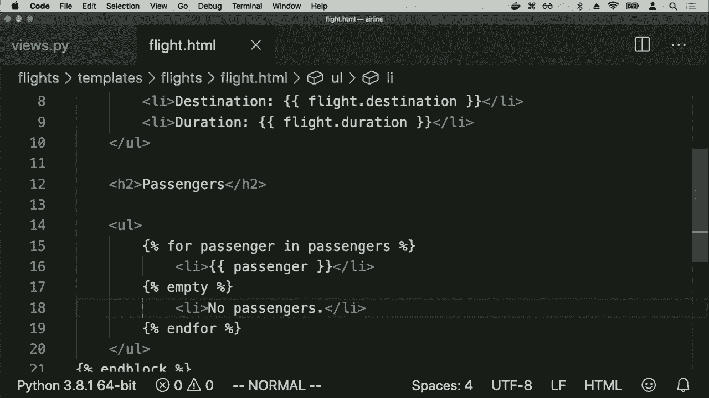

如果我们回到自己编写的航班应用页面（`/flights`），现在可以看到通过Django管理界面添加的所有新航班。

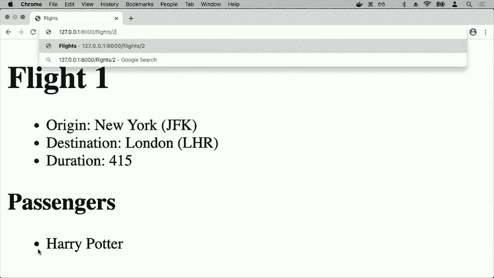

## 创建航班详情页面 🔗

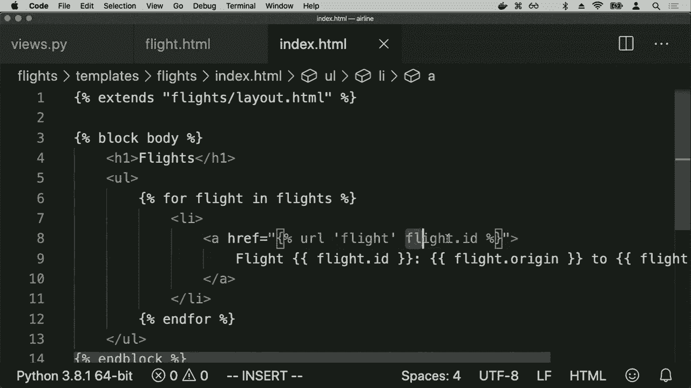

现在，我们希望为Web应用添加更多页面，使其功能更复杂。例如，我们希望能够点击特定航班以查看其详细信息，而不仅仅是`/flights`页面显示的所有航班列表。

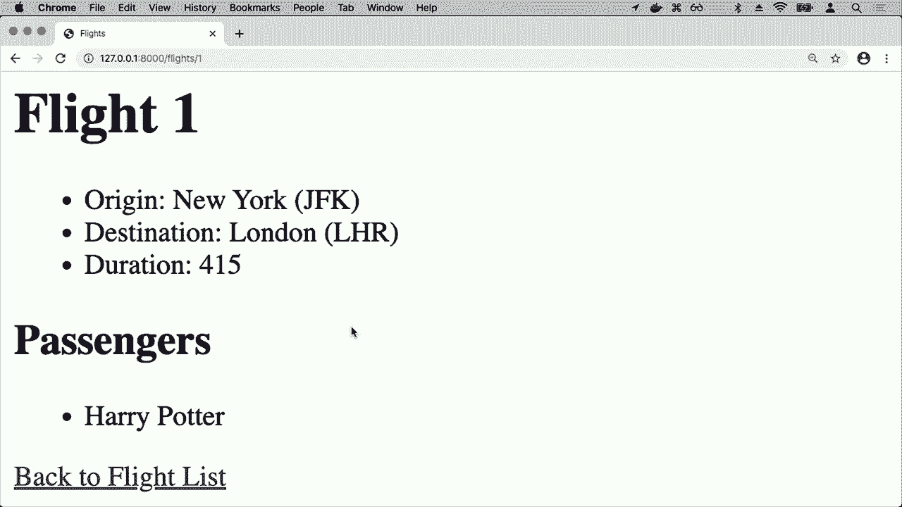

我们希望每个航班都有自己的页面，例如 `/flights/1` 显示航班ID为1的详细信息。

为此，我们需要返回到`urls.py`，创建一个新的路径。这个路径将包含一个航班ID作为参数。
```python
path('flights/<int:flight_id>', views.flight, name='flight')
```
然后，在`views.py`中添加一个名为`flight`的函数，它接受`flight_id`作为参数。
```python
def flight(request, flight_id):
    flight = Flight.objects.get(pk=flight_id)
    return render(request, "flights/flight.html", {
        "flight": flight
    })
```
这个函数首先获取具有指定`flight_id`的`Flight`对象（`pk`是主键`Primary Key`的通用引用方式）。然后，它渲染一个名为`flight.html`的模板，并将航班对象传递给它。

接下来，我们创建`flight.html`模板文件。这个文件将扩展基础布局，并在主体部分显示航班的详细信息。
```html



    <h1>Flight {{ flight.id }}</h1>
    <ul>
        <li>Origin: {{ flight.origin }}</li>
        <li>Destination: {{ flight.destination }}</li>
        <li>Duration: {{ flight.duration }} minutes</li>
    </ul>

```
现在，访问 `/flights/1` 将显示关于航班1的信息，访问 `/flights/2` 将显示航班2的信息。

需要注意的是，目前如果尝试访问一个不存在的航班（例如 `/flights/28`），会引发错误。在实际应用中，应该添加错误检查来处理这种情况，但为了简单起见，我们暂时跳过。

## 扩展模型：添加乘客 👥

上一节我们为航班添加了详情页面。本节中，我们来扩展数据模型，为航班添加乘客信息，以便表示实际搭乘航班的乘客。

我们回到`models.py`，在`Airport`和`Flight`类之外，创建一个新的`Passenger`模型类。
```python
class Passenger(models.Model):
    first = models.CharField(max_length=64)
    last = models.CharField(max_length=64)
    flights = models.ManyToManyField(Flight, blank=True, related_name="passengers")

    def __str__(self):
        return f"{self.first} {self.last}"
```
`Passenger`模型具有以下属性：
*   `first`: 名字，字符字段，最大长度64。
*   `last`: 姓氏，字符字段，最大长度64。
*   `flights`: 一个与`Flight`模型的多对多关系字段。这意味着一个航班可以有多个乘客，一个乘客也可以搭乘多个航班。`blank=True`允许乘客没有关联航班。`related_name="passengers"`意味着，如果我们有一个航班对象，可以通过`flight.passengers`来访问该航班上的所有乘客。

创建模型后，我们需要运行迁移命令来将这些更改应用到数据库。
```bash
python manage.py makemigrations
python manage.py migrate
```
接下来，我们需要在`admin.py`中注册`Passenger`模型，以便在管理界面中操作它。
```python
from .models import Passenger
admin.site.register(Passenger)
```
现在，运行服务器并访问管理界面（`/admin`）。在“Passengers”部分，我们可以添加乘客，例如哈利·波特，并选择他搭乘的航班（可以多选）。我们还可以添加罗恩·韦斯利、赫敏·格兰杰、金妮·韦斯利等乘客。

## 在航班页面显示乘客信息 📋

现在，我们希望在航班详情页面上显示搭乘该航班的乘客信息。

为此，我们需要修改`views.py`中的`flight`视图函数，将乘客信息也传递给模板。
```python
def flight(request, flight_id):
    flight = Flight.objects.get(pk=flight_id)
    passengers = flight.passengers.all()
    return render(request, "flights/flight.html", {
        "flight": flight,
        "passengers": passengers
    })
```
我们通过`flight.passengers.all()`获取该航班上的所有乘客（`passengers`是我们在模型中定义的`related_name`）。

然后，在`flight.html`模板中，我们可以添加一个部分来循环显示乘客。
```html
<h2>Passengers</h2>
<ul>
    
        <li>{{ passenger }}</li>
    
        <li>No passengers on this flight.</li>
    
</ul>
```
现在，访问 `/flights/1`，你会看到“哈利·波特”被列为该航班的乘客。而访问 `/flights/2`，则会显示“No passengers on this flight.”。

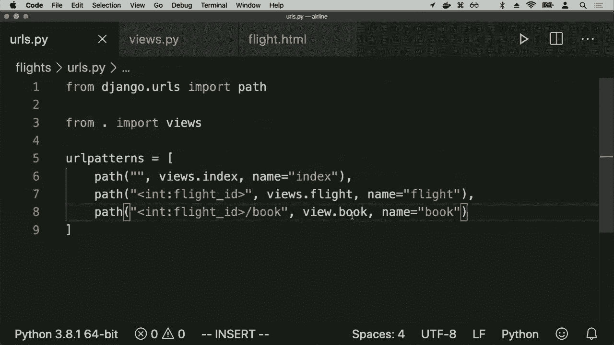

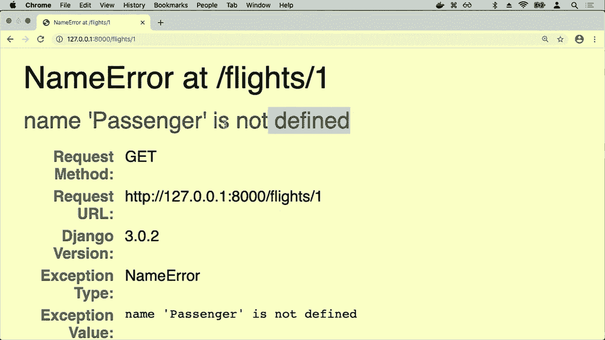

## 添加页面间导航与预订功能 ➕

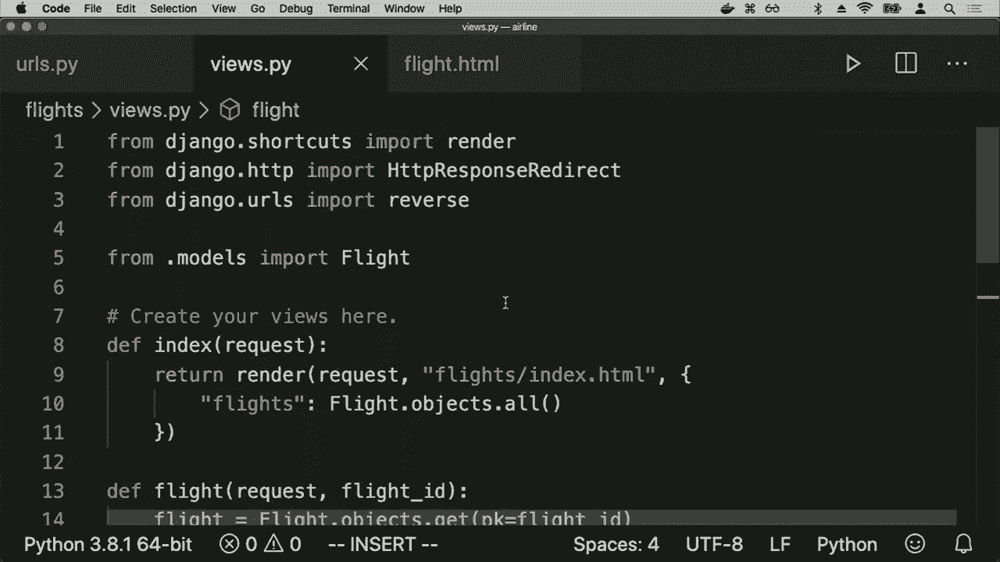

目前，我们必须在浏览器地址栏手动输入URL才能在页面间导航，这很不方便。我们可以在航班列表和详情页面之间添加链接。

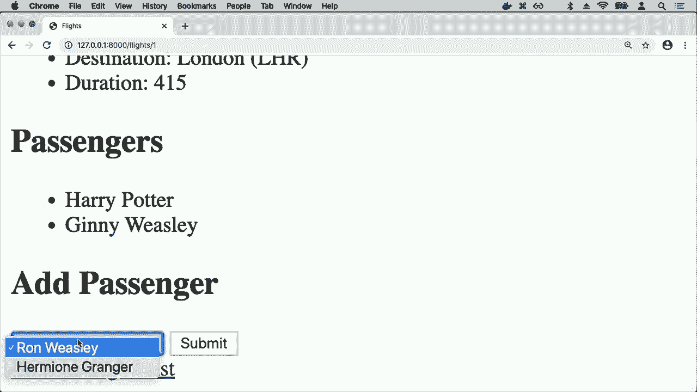

在`flight.html`中，添加一个返回航班列表的链接。
```html
<a href="">Back to Full List</a>
```
在`index.html`（显示所有航班的页面）中，将每个航班列表项变成一个指向该航班详情页面的链接。
```html

    <li>
        <a href="">
            Flight {{ flight.id }}: {{ flight.origin }} to {{ flight.destination }}
        </a>
    </li>

```
现在，在航班列表页面点击任何一个航班，都会跳转到对应的详情页面，详情页面也有链接可以返回列表。

接下来，我们可能还想添加一个功能：为特定航班预订（添加）乘客。

这需要一个新的路由来处理预订。我们在`urls.py`中添加：
```python
path('flights/<int:flight_id>/book', views.book, name='book')
```
然后，在`views.py`中实现`book`视图函数。
```python
from django.http import HttpResponseRedirect
from django.urls import reverse

def book(request, flight_id):
    if request.method == "POST":
        flight = Flight.objects.get(pk=flight_id)
        passenger_id = int(request.POST["passenger"])
        passenger = Passenger.objects.get(pk=passenger_id)
        passenger.flights.add(flight)
        return HttpResponseRedirect(reverse("flight", args=(flight_id,)))
```
这个函数的工作原理：
1.  检查请求方法是否为`POST`（表示提交表单数据）。
2.  获取指定的航班对象。
3.  从表单的`POST`数据中获取乘客ID（表单中会有一个名为`passenger`的字段）。
4.  获取对应的乘客对象。
5.  使用`passenger.flights.add(flight)`将该乘客添加到航班的乘客集合中。Django会在底层处理多对多关系表的更新。
6.  操作完成后，将用户重定向回该航班的详情页面。

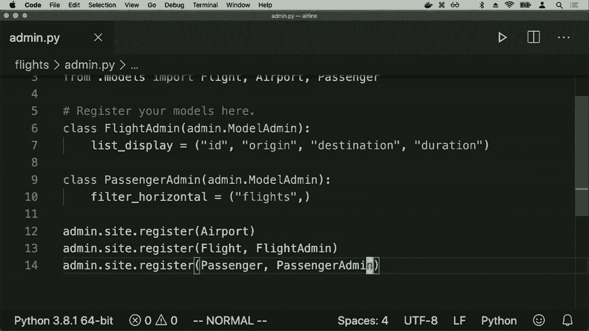

现在，我们需要在航班详情页面上创建这个预订表单。但表单中应该列出所有**未**搭乘该航班的乘客供选择。因此，我们需要修改`flight`视图，将“非乘客”列表也传递给模板。
```python
def flight(request, flight_id):
    flight = Flight.objects.get(pk=flight_id)
    passengers = flight.passengers.all()
    non_passengers = Passenger.objects.exclude(flights=flight).all()
    return render(request, "flights/flight.html", {
        "flight": flight,
        "passengers": passengers,
        "non_passengers": non_passengers
    })
```
`Passenger.objects.exclude(flights=flight).all()`会获取所有`flights`字段中不包含当前航班的乘客。

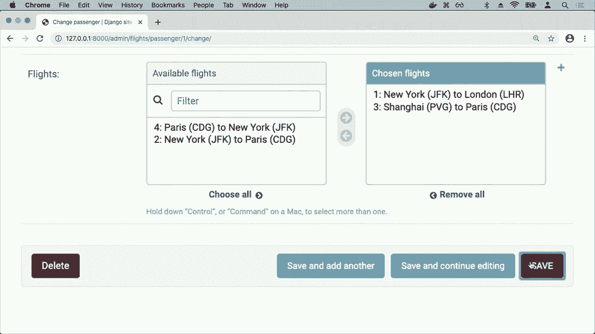

最后，在`flight.html`模板中添加表单。
```html
<h2>Add Passenger</h2>
<form action="" method="post">
    
    <select name="passenger">
        
            <option value="{{ passenger.id }}">{{ passenger }}</option>
        
    </select>
    <input type="submit" value="Book Flight">
</form>
```
这个表单将提交到`book`视图。它包含一个下拉选择框（`<select>`），其选项是所有非乘客。每个选项的值是乘客的ID，显示的文字是乘客的名字。用户选择一个乘客并提交后，该乘客就会被添加到当前航班。

运行应用，现在在航班详情页面底部可以看到“Add Passenger”部分。选择一个未搭乘该航班的乘客（如金妮·韦斯利）并提交，页面刷新后，该乘客就会出现在乘客列表中。

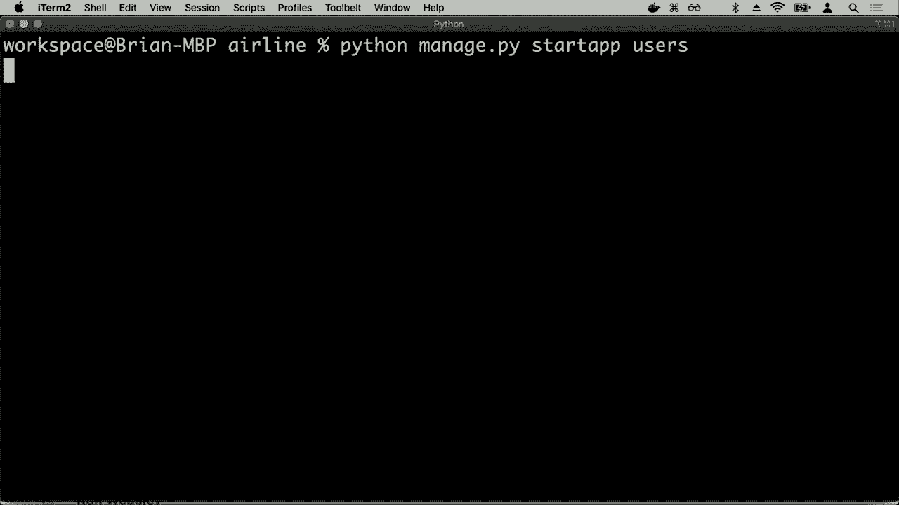

## 自定义管理界面 ⚙️

Django的管理界面虽然是现成的，但高度可定制。例如，默认的航班列表只显示对象的字符串表示（通常是ID）。我们可以自定义显示更多字段。

在`admin.py`中，我们可以为每个模型创建一个管理配置类。
```python
class FlightAdmin(admin.ModelAdmin):
    list_display = ("id", "origin", "destination", "duration")

class PassengerAdmin(admin.ModelAdmin):
    filter_horizontal = ("flights",)
```
`FlightAdmin`中的`list_display`指定了在航班列表页面显示哪些字段。
`PassengerAdmin`中的`filter_horizontal`为多对多字段`flights`提供了一个更友好的水平选择器界面，方便添加或移除航班。

然后，在注册模型时使用这些配置类。
```python
admin.site.register(Flight, FlightAdmin)
admin.site.register(Passenger, PassengerAdmin)
admin.site.register(Airport)
```
现在，在管理界面中查看航班列表，会看到ID、出发地、目的地和时长。编辑乘客时，操作其航班的界面也变成了更直观的水平双选框。

## 实现用户认证系统 🔐

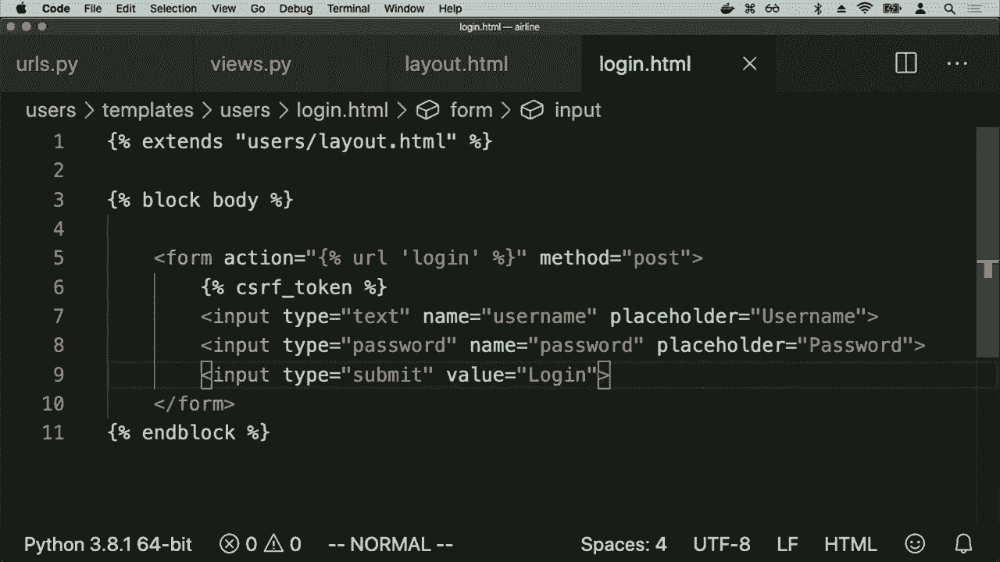

在许多网站中，我们需要用户认证功能，允许用户登录和登出。Django框架内置了完整的认证系统，我们无需从头实现。

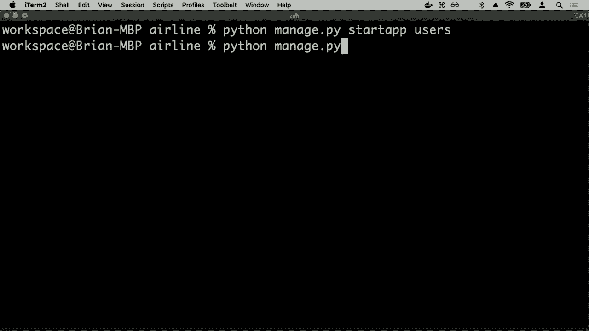

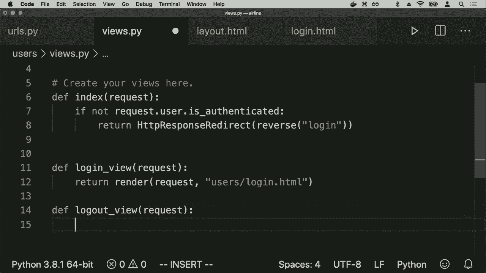

首先，我们创建一个新的Django应用来处理用户相关功能。
```bash
python manage.py startapp users
```
然后，在项目的`settings.py`中的`INSTALLED_APPS`列表里添加`'users'`。接着，在项目的`urls.py`中包含用户应用的URL配置。
```python
path('users/', include('users.urls'))
```
在`users`应用目录下创建`urls.py`文件，定义路由。
```python
from django.urls import path
from . import views

urlpatterns = [
    path('', views.index, name='index'),
    path('login', views.login_view, name='login'),
    path('logout', views.logout_view, name='logout'),
]
```
我们定义了三个路由：主页(`index`)、登录页(`login`)和登出页(`logout`)。

接下来，在`views.py`中实现这些视图。

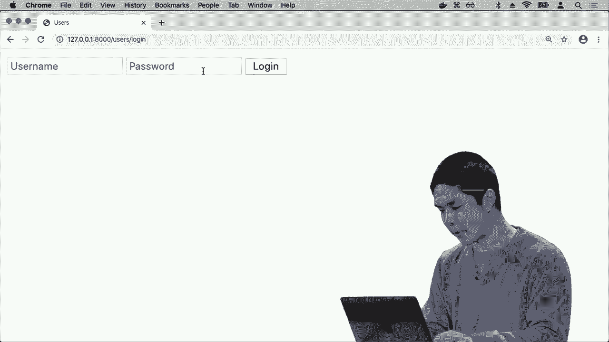

`index`视图显示当前登录用户的信息。如果用户未认证，则重定向到登录页面。
```python
from django.http import HttpResponseRedirect
from django.urls import reverse
from django.contrib.auth import authenticate, login, logout

def index(request):
    if not request.user.is_authenticated:
        return HttpResponseRedirect(reverse("login"))
    return render(request, "users/user.html")
```
`login_view`视图处理登录逻辑。它通过`POST`请求接收用户名和密码，使用Django的`authenticate`函数验证，如果成功则使用`login`函数登录用户。
```python
def login_view(request):
    if request.method == "POST":
        username = request.POST["username"]
        password = request.POST["password"]
        user = authenticate(request, username=username, password=password)
        if user is not None:
            login(request, user)
            return HttpResponseRedirect(reverse("index"))
        else:
            return render(request, "users/login.html", {
                "message": "Invalid credentials."
            })
    return render(request, "users/login.html")
```
`logout_view`视图非常简单，调用Django的`logout`函数即可。
```python
def logout_view(request):
    logout(request)
    return render(request, "users/login.html", {
        "message": "Logged out."
    })
```
现在，我们需要创建对应的模板。首先创建`users/templates/users/layout.html`作为基础模板。
```html
<!DOCTYPE html>
<html>
<head>
    <title>Users</title>
</head>
<body>
    
    
</body>
</html>
```
然后创建登录模板`login.html`。
```html



    <h1>Login</h1>
    
        <div>{{ message }}</div>
    
    <form action="" method="post">
        
        <input type="text" name="username" placeholder="Username">
        <input type="password" name="password" placeholder="Password">
        <input type="submit" value="Login">
    </form>

```
最后创建用户主页模板`user.html`，显示用户信息并提供一个登出链接。
```html


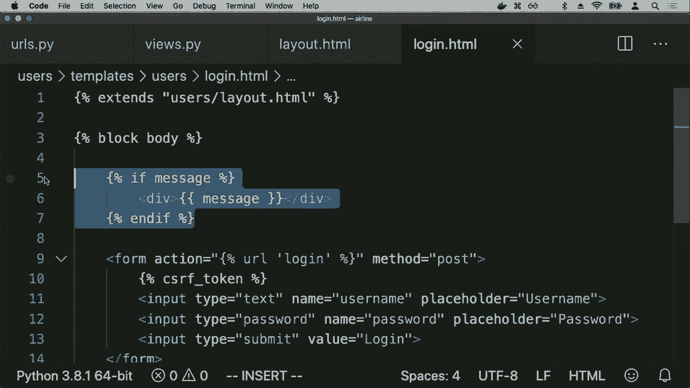

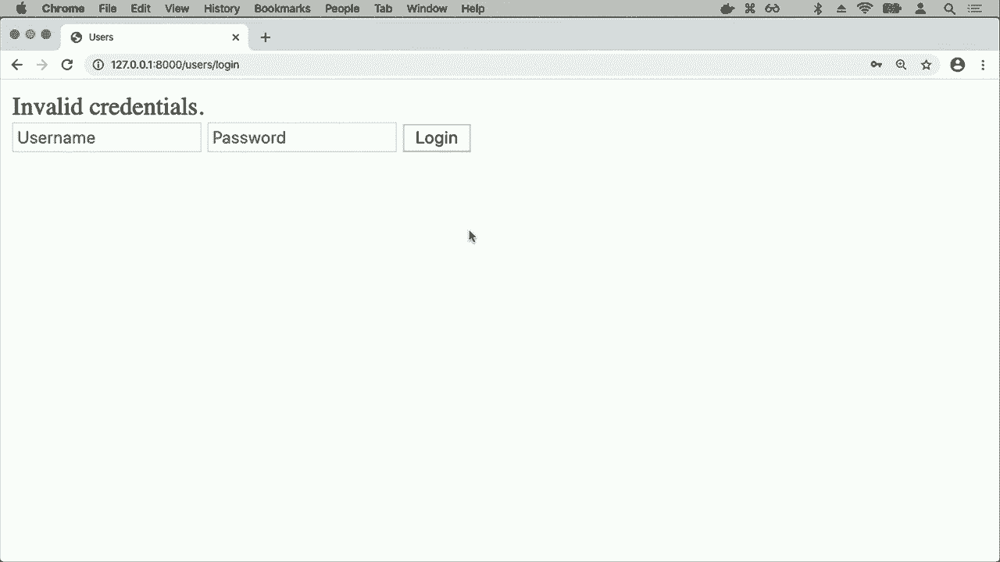


    <h1>Welcome, {{ request.user.first_name }}</h1>
    <ul>
        <li>Username: {{ request.user.username }}</li>
        <li>Email: {{ request.user.email }}</li>
    </ul>
    <a href="">Log Out</a>

```
在Django模板中，可以通过`request.user`访问与当前请求关联的用户对象。

在使用前，我们需要通过Django管理界面（`/admin`）创建一些普通用户（非超级用户）。然后访问`/users`，由于未登录，会被重定向到登录页面。输入正确的用户名和密码后，会跳转到用户主页，显示欢迎信息和用户详情。点击“Log Out”链接即可登出。

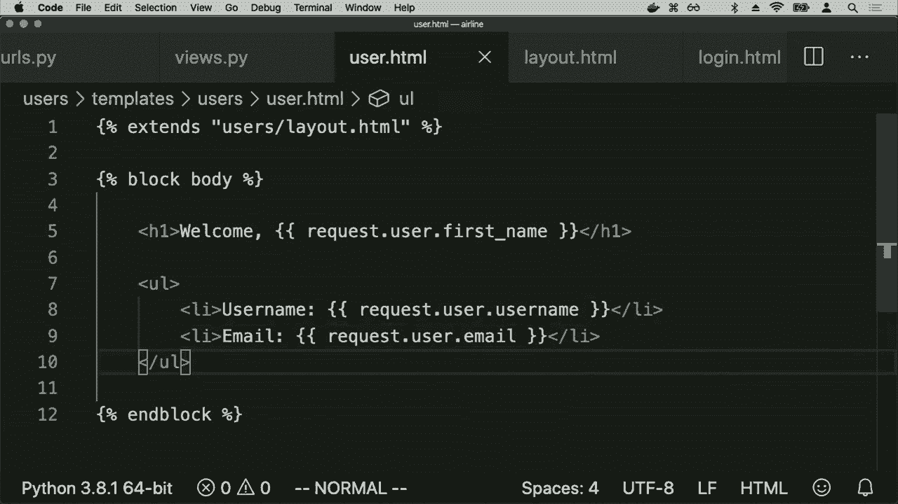

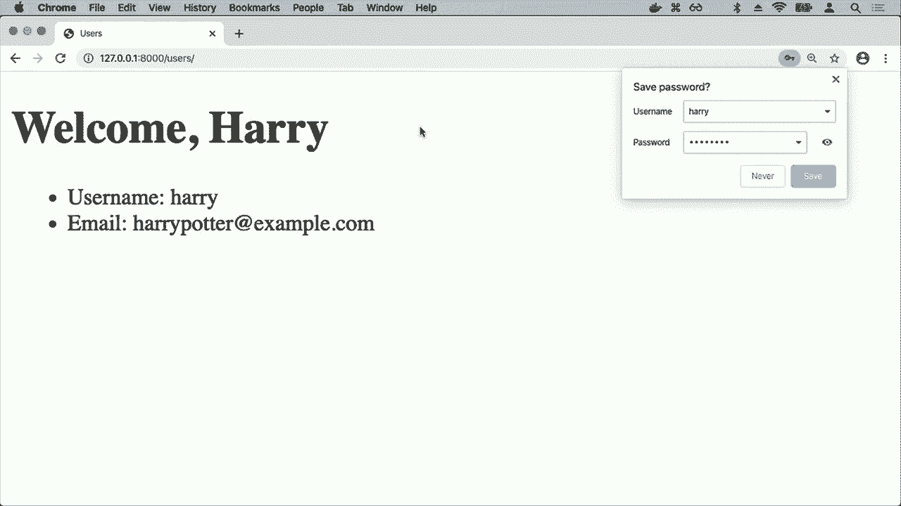

## 总结 📚

本节课中我们一起学习了Django框架中几个核心的高级功能：

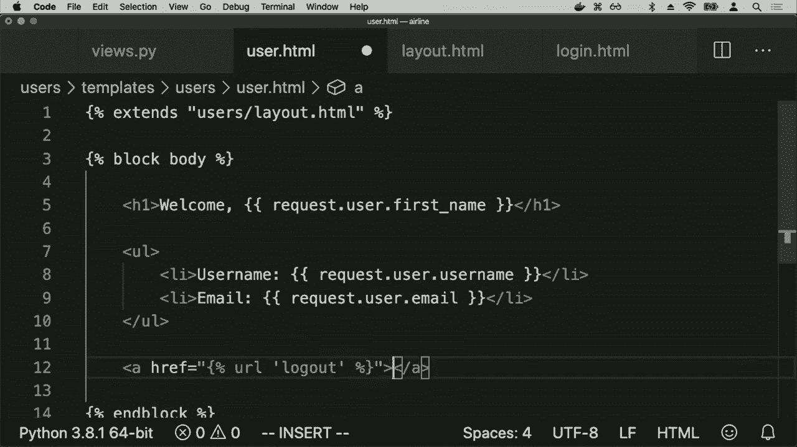

1.  **Django管理应用程序**：一个开箱即用的强大界面，允许我们快速地对数据库模型进行增删改查操作，极大地提高了开发效率。
2.  **模型关系与页面扩展**：我们扩展了航班应用，引入了`Passenger`模型，并建立了与`Flight`的多对多关系。我们创建了航班详情页面，并实现了在页面间导航以及为航班添加乘客的功能。
3.  **用户认证系统**：我们利用Django内置的认证模块，快速实现了一个完整的用户登录、登出和会话管理系统，而无需自己处理密码哈希和会话管理等复杂问题。


Django通过这些内置功能，为我们提供了表示模型、操作数据和管理用户的强大工具集，使得构建数据驱动的动态Web应用变得快速而高效。