# 哈佛 CS50-WEB ｜ 基于Python / JavaScript的Web编程(2020·完整版) - P18：L6- Web用户接口与交互 1 (用户接口，单页面应用) 🖥️➡️🔄


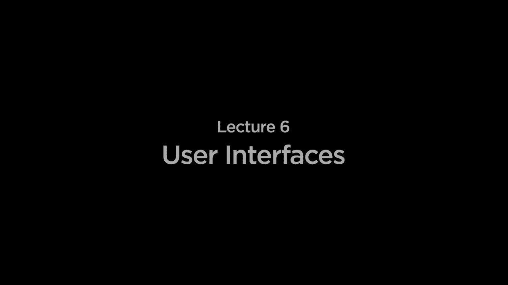


## 概述

在本节课中，我们将要学习如何利用JavaScript创建更具互动性的Web用户界面。我们将重点关注**单页面应用**的设计理念，学习如何在不重新加载整个页面的情况下，动态地更新和切换页面内容，从而提升用户体验。

上一节我们关注了在用户的Web浏览器中运行的JavaScript，这让我们能够做很多事情，使我们的网页更具互动性。JavaScript让我们能够显示警报，操纵DOM，调整网页结构。

添加内容或查看已有的内容，还能让我们响应用户事件。当用户点击按钮、提交表单或在输入字段中输入内容时，我们可以运行JavaScript函数，响应这些事件，以使我们的网页更具互动性。今天我们将继续这个话题。

特别是查看用户界面设计，关注一些常见的用户界面范式，以及我们如何利用JavaScript实现这些目标，创建与用户互动时有价值的互动用户界面。

## 单页面应用 (SPA) 简介

更常见的范式之一，特别是在现代Web编程中，是**单页面应用**的理念。如果我们想创建一个有多个不同页面的Web应用，通常是通过在我们的Django Web应用中使用多个不同的路由来实现，例如你去某个地址可以获取一个页面，而去另一个地址则可以获取另一个页面。

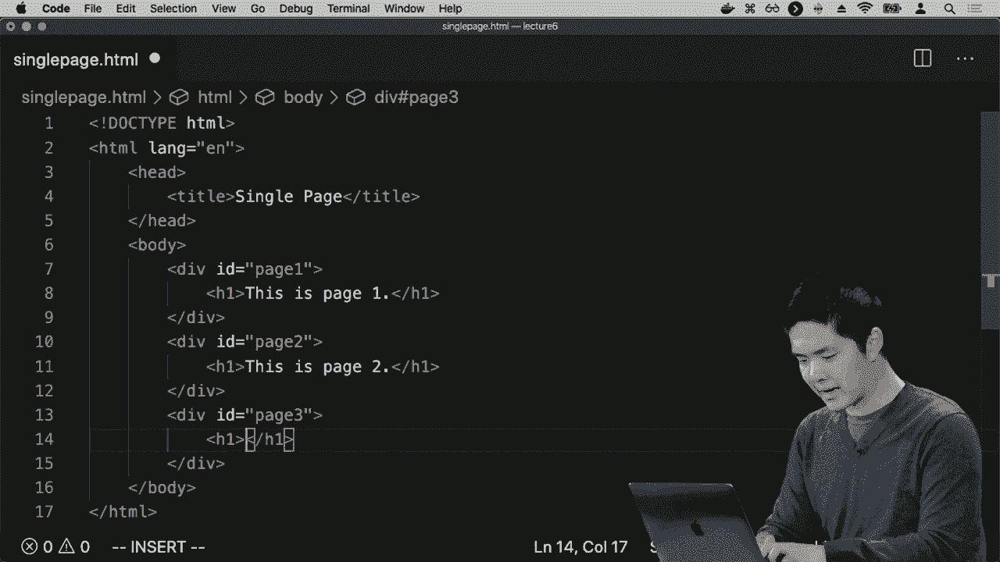

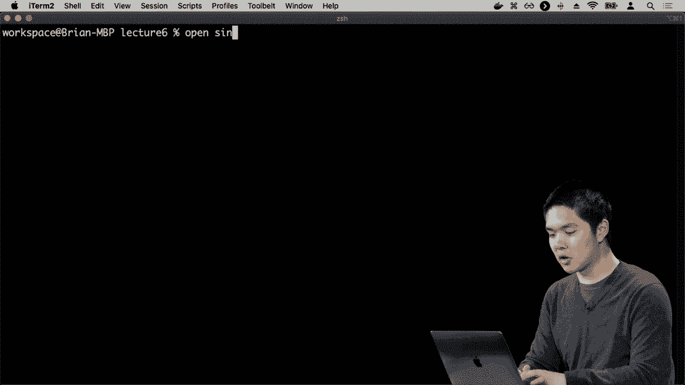

为了获得另一个页面，常用JavaScript的方式，我们可以创建单页面应用，整个网页实际上就是一个单页面，然后我们使用JavaScript来操纵DOM，用我们想替换的内容替换页面的部分，这有很多优势。

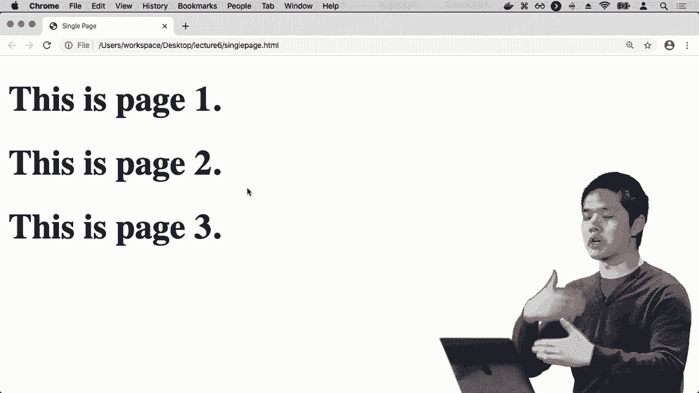

其中一个是我们只需对实际变化的页面部分进行修改，例如如果你有五个不同的页面，但页面的一般布局和结构相似，当你在页面之间切换时，而不是加载一个全新的页面。

你可以只加载页面的一部分，这对于频繁变化的应用非常有帮助。

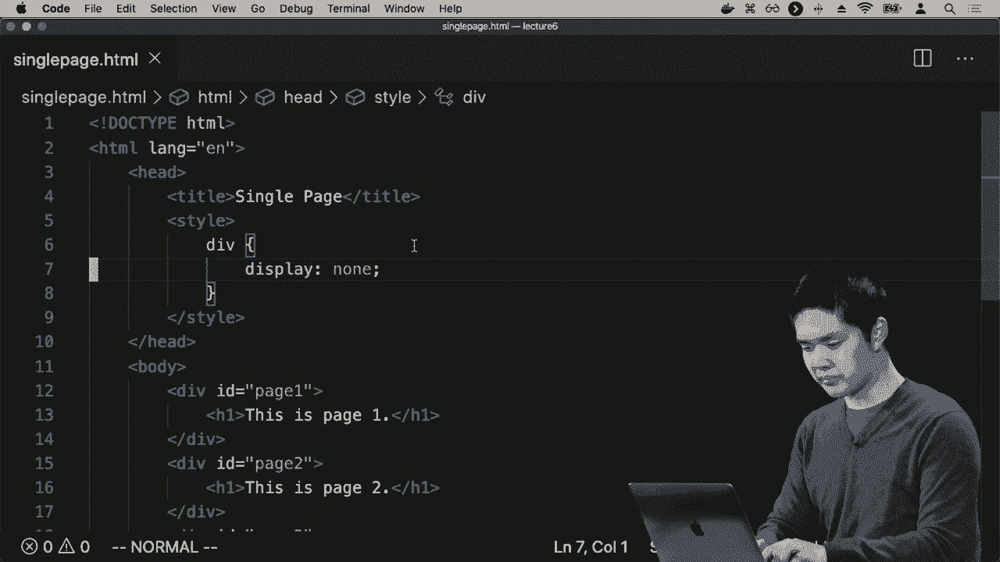

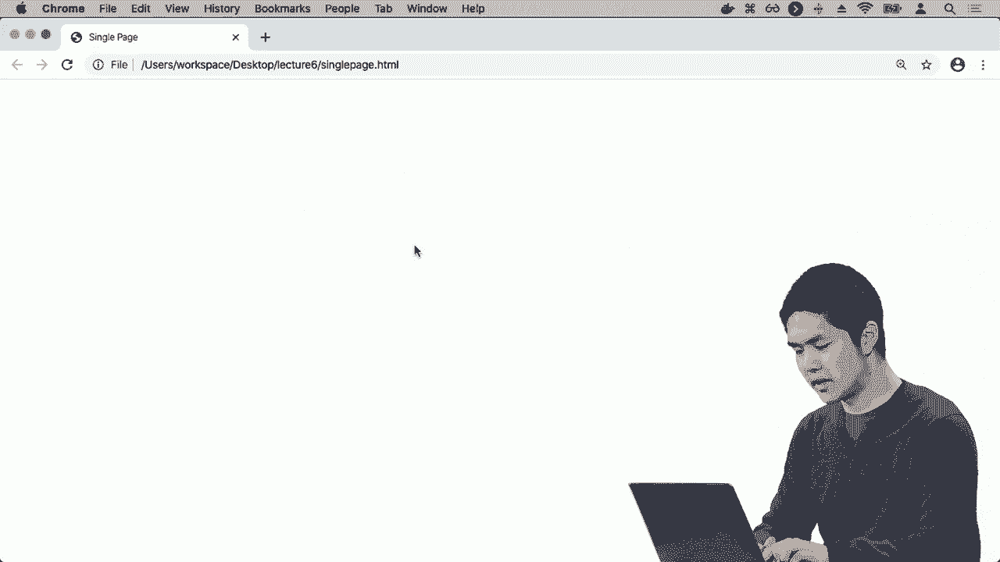

## 实现一个简单的单页面应用

那么现在我们来看看如何实现一个非常简单的单页面应用，假设我们想要一个只显示三个不同页面的单页面应用，但这些内容都是包含在一个页面中。

在同一页面上，我将创建一个新的文件，称为`singlepage.html`。在这个文件中，我们将包含我们的常规内容，并在这个页面的主体中，我将包括三个不同的部分，以代表我可能希望向用户展示的三个不同页面。

因此我将有一个id为`page one`的div，里面可能只是包含一些内容。有一个标题，写着这是页面一，你可以想象这些页面上还有更多内容。同样有一个 id 为`页面二`的 div，我们称之为页面二，然后是一个 id 为`页面三`的最终 div。


它有一个标题，写着这是页面三，例如，现在如果我打开。


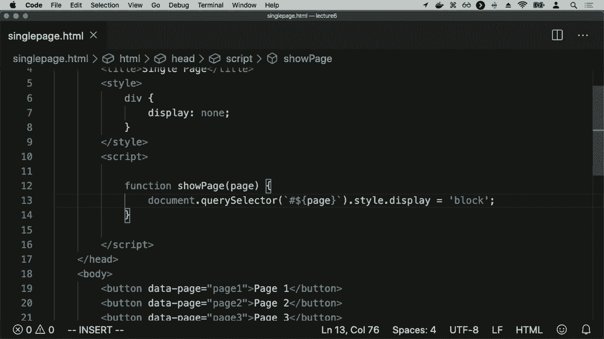

`single page.html`，我们看到的是同时显示所有三个页面，这可能不是我们想要的。我们真正想要的是默认情况下。


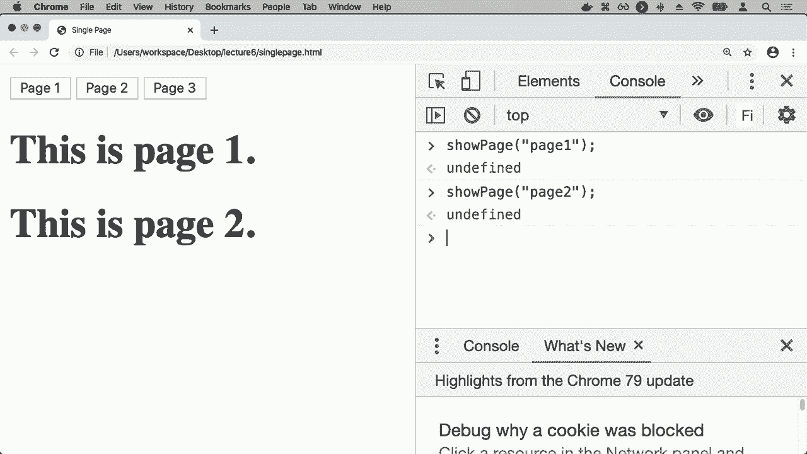

将这些页面隐藏，直到我们想要查看它们，例如一次查看一个页面。所以我可以做的一件事是使用 CSS 来切换，某个内容是否可见。添加一些样式标签到我的页面，默认情况下，我的所有 div 都是不可见的。

```css
div {
    display: none;
}
```

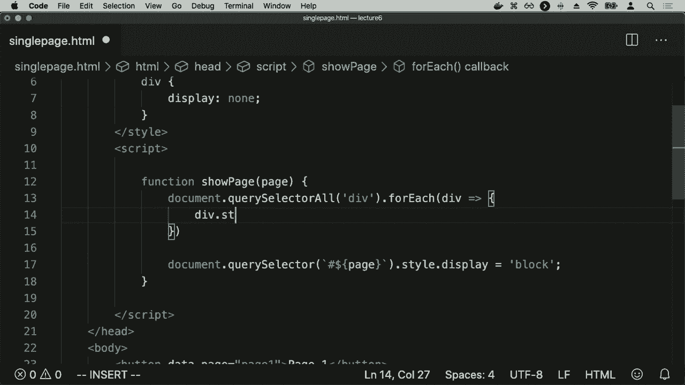


现在在屏幕上显示，如果我刷新页面，我实际上看不到三个标题中的任何一个。


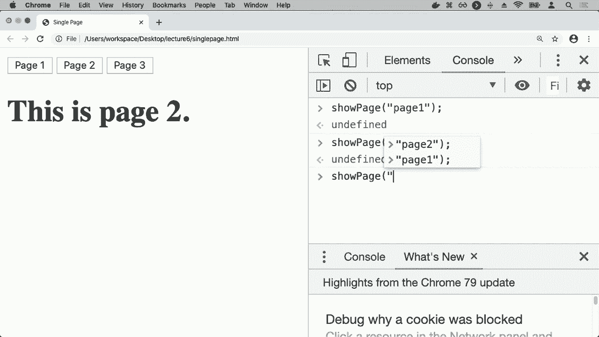

我之前有的，但是我真的希望现在有一些按钮，让我在这三页之间切换。所以我会给自己三个按钮，一个按钮写着页面一，一个按钮写着页面二，一个按钮写着页面三。例如，我需要某种机制，让这些按钮知道当你点击这个。

按钮应该显示哪个页面，因此我将继续使用数据属性，我们上次在 JavaScript 中看到过，给这些特定的 HTML 元素添加一些额外的信息，我会给第一个按钮一个 `data-page` 值为`页面一`，第二个按钮的值为`页面二`。

第三个是`页面三`的 `data-page` 值，这里同样只是提供信息。这样在我稍后写一些 JavaScript 时，可以让 JavaScript 代码查看这个 `data-page` 属性，来判断当你点击这个按钮时，应该让我看到 id 为`页面一`的 div，这就是我们要实现的。

所以现在让我们继续，写代码，做的就是能够说我想显示页面一，隐藏其他两个，或者显示页面二，隐藏其他两个，或者例如显示页面三。

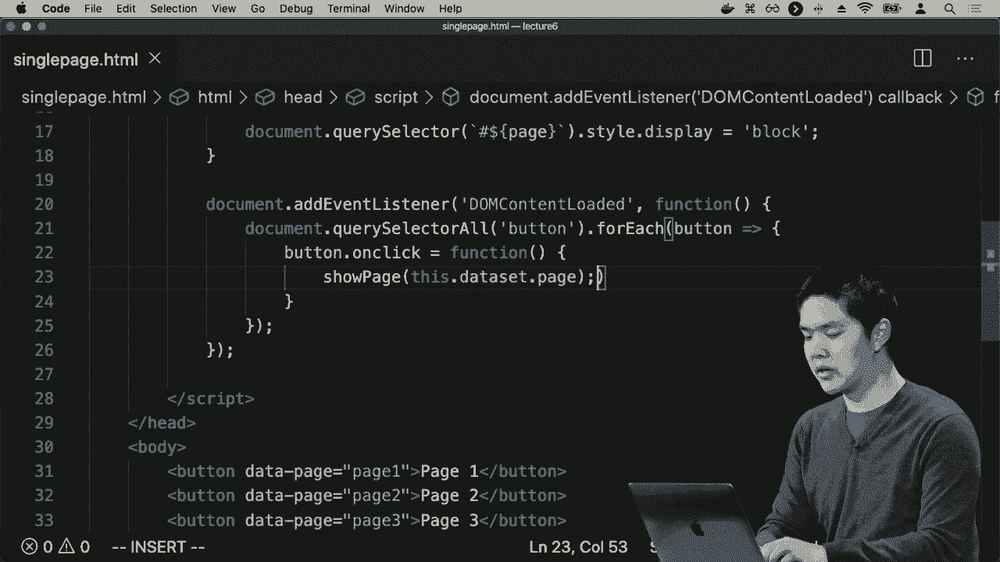

## 编写切换页面的JavaScript函数

为此，我首先会写一个函数，让我实现这一点，我会写一个名为 `showPage` 的函数，它的参数就是要显示的页面。

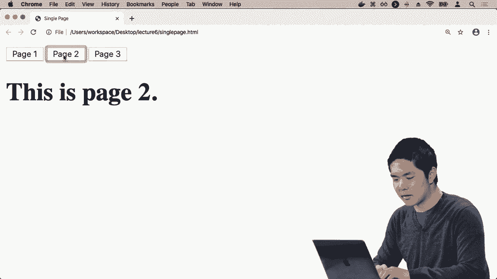

我想显示的页面，所以这个函数应该做什么，我们将要做的是使用 `document.querySelector`，我想获取具有特定 id 的元素。这个页面的 id 将代表我想显示的 div 的 id，所以我会说获取这个 id 的元素。

然后使用模板字面量，我会说好的，获取页面上任意元素的id，并且我想要更改它的样式属性，具体是更改它的显示属性，而不是默认的`none`。我希望更改为`block`，这样它就会显示出来。

块在页面上实际上。

```javascript
function showPage(page) {
    document.querySelector(`#${page}`).style.display = 'block';
}
```


函数，我可以在浏览器中刷新页面进行测试。现在我看到三个按钮，这些按钮暂时没有任何作用。但是我可以在控制台中运行这个函数，像是运行显示页面函数，举个例子，显示页面一。

按下回车，现在页面一，然后页面二，那么页面二将变得可见。好的，这完成了我想要的一半，页面二现在可见，但页面一也可见。因此我可能想要这样，如果我显示一个页面，首先隐藏其他页面，像是隐藏。


所有页面，然后显示页面二，或者隐藏所有页面，然后显示页面三。那么我该如何进行呢？首先，当我显示一个页面时，我想先隐藏所有其他页面，隐藏所有页面。为了获取所有页面，我会用`document.querySelectorAll`获取所有的div，这是我用来封装页面的。

现在对于每一个，再次有效地创建一个循环，我在遍历每个div，对于每个div，我们就这样设置。

```javascript
function showPage(page) {
    // 首先隐藏所有页面
    document.querySelectorAll('div').forEach(function(div) {
        div.style.display = 'none';
    });
    // 然后显示请求的页面
    document.querySelector(`#${page}`).style.display = 'block';
}
```


div的样式属性设置为`none`。所以这个显示页面的函数现在首先查询所有的div，它们模拟着我的单页面应用中的页面，对于每一个div，我们将其作为输入传递给这个函数。

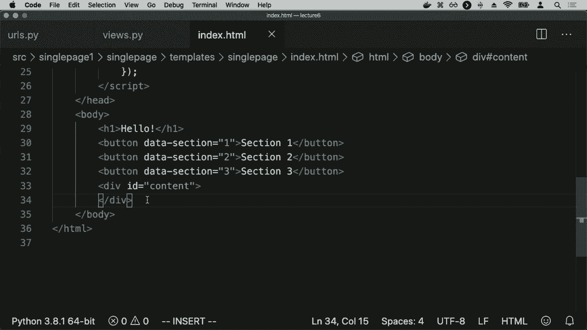

每个使用这个箭头函数的语法，这只是一种简写方式，用于表达一个函数。在这里，我说对于每个div，我们将修改它的样式属性，将显示设置为`none`，意味着不显示任何div，然后只显示被请求的div，现在这应该解决这个问题。

同时出现多个页面，如果我回到这个页面并点击或输入显示页面一，那么页面一会出现，但如果我运行显示页面二，那么页面二会出现，但页面一。

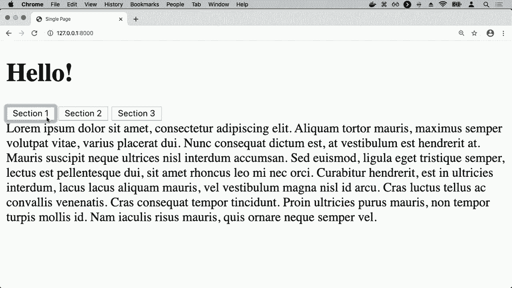


消失，同样，当我显示页面三时，它显示页面三而不显示其他两个，所以我可以通过控制台操控哪个页面是可见的。但现在我希望这些按钮能够真正起作用，当我点击其中一个按钮时，它能实际显示请求的页面。因此，为了做到这一点，我想要。

我需要为这些按钮附加一些事件监听器，这意味着我需要等待这些按钮加载到页面上，所以我们将使用`document.addEventListener`。等待直到页面上所有内容加载完成，然后我才会说让我们查询选择器所有。

对于所有按钮及每一个按钮，让我们为每个按钮附加一个事件监听器，因此我正在查询所有按钮，并说对每个按钮我想这样做，我想要做的是在按钮被点击时执行这个函数。

要显示页面，我想显示哪个页面呢？我想显示按钮数据集中页面部分的内容，而要获取当前按钮，即被点击的按钮，请记住，当我们在事件处理程序内时，我们可以利用javascript关键字`this`。

该关键字指的是接收到点击事件的元素，因此我可以说`this.dataset`。

```javascript
document.addEventListener('DOMContentLoaded', function() {
    document.querySelectorAll('button').forEach(function(button) {
        button.onclick = function() {
            showPage(this.dataset.page);
        }
    });
});
```


点页面意味着，对于每个按钮，当按钮被点击时，我们会为每个按钮运行这个函数。当按钮被点击时，我们想要显示哪个页面，我们将取这个按钮，即接收到事件的按钮，访问它的数据属性。

页面属性，这里有页面一、页面二或页面三。然后我们就可以调用我们刚才写的`showPage`函数。所以现在我们已经完成了，为按钮附加了这些事件处理程序，所以现在如果我刷新页面。

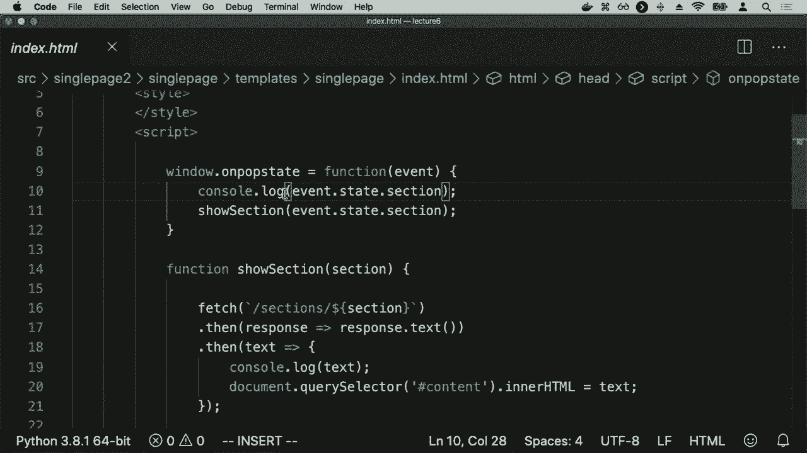


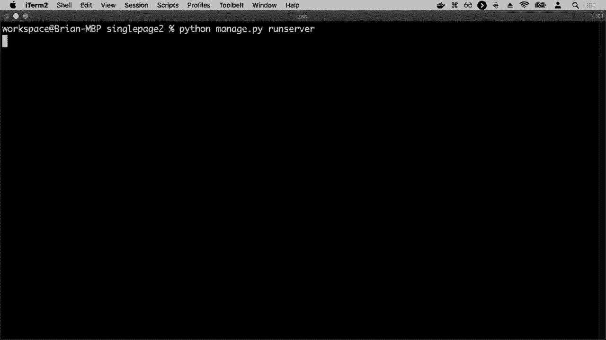

页面上我可以点击这些按钮，切换到任意三个页面之间。现在有趣的是，我们现在可以在一个单一页面中模拟多个页面的概念，所有内容都封装在一个html文件中，但不需要持续向服务器发出额外请求来获取访问权限。

## 动态加载内容与服务器交互

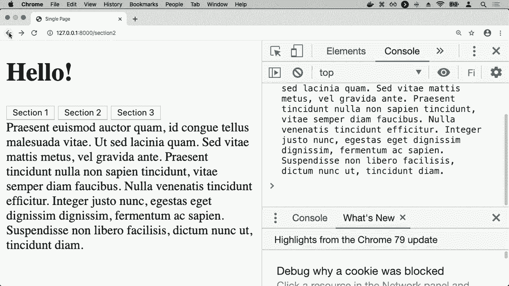

然而，有时当你需要一个页面的新信息时，联系服务器可能是合理的。例如，你可能想象每个页面包含大量文本，如果我们立即将所有数据加载到html中并显示和隐藏，那将是低效的。

需要这样做，因为我们可能加载的信息超过了用户实际上关心的内容，尤其是如果他们从不查看第2页或第3页。所以我们可能想象的一个做法是动态加载这些数据，上次我们讨论的javascript中，我们看到如何使用`fetch`来请求一些额外的信息。

上一次是来自一个网络服务器，货币兑换率，但我们利用返回的数据填充了我们页面上的内容，同样，我们可以在这里做类似的事情，如果我们有一个单页面的总体结构，并且希望加载新内容，而不是完全加载新的HTML内容并重新加载整个页面。

我们可以询问自己的网络服务器，页面的哪个部分需要更改，然后替换页面的那部分，这就是我们现在要看的内容，现在结合Django作为我们的网络服务器，以及JavaScript用于编写客户端代码，以生成单页面应用。

我们将进入一个我提前准备的示例，叫做单页面一，里面只是一个Django应用程序，包含一个叫做单页面的应用。我们会注意到，首先要查看URLs，里面有两个URLs，一个是默认URL，仅加载索引函数，另一个是加载不同内容的URL。

就像是我可能想动态加载的页面部分，例如，我有 `/section/` 加上某个特定数字，如果我们看看这些URL的视图，实际上索引函数只是返回 `index.html`，然后部分函数做的是，它首先确保数字在1到3之间，如果是的话。

响应的是这些字符串之一。

那么这实际上是如何工作的呢？如果我进入。

如果我访问这个URL `/section/one`，我得到的是这一段文本，如果我去 `/section/two`，我得到的是另一段文本，而 `/section/three` 则是完全不同的文本，所以只是不同的文本。

我想将这段文本纳入一个现有的`index.html`模板中，该模板在我访问默认路由时加载，而在`index.html`中，我们会看到我有一个显示部分的函数，其行为与我们刚才看到的显示页面函数非常相似，但不同的是，显示部分将要做的事情。

它将从我的网络服务器获取我应该在页面上显示的文本，我从 `/sections/` 获取数据，填入一个数字，比如一、二或三，当我收到响应时，过去我们已经看到如何将该响应转换为JSON数据，如果它是一些结构化数据，我们也可以直接转换响应。

转换成纯文本后，我将获取该文本并在控制台中记录它，以便我们在日志输出中看到，但接着会查询选择页面内容，某个ID为content的元素，更新其`innerHTML`并将其设置为该文本，所以现在这个整个函数正在做的是，它将联系我的服务器，弄清楚哪些文本内容应该在。

新部分将填充页面相应的部分，并根据来自该 HTTP 请求的文本进行填充，然后在页面的下方，我们会看到我有一个“你好”标题和三个按钮，它们在不同的部分之间切换，每个按钮都有一个 `data-section` 属性。

用于确定应该加载哪个部分，然后是一个最初为空的 div。

```javascript
function showSection(section) {
    fetch(`/sections/${section}`)
        .then(response => response.text())
        .then(text => {
            console.log(text);
            document.querySelector('#content').innerHTML = text;
        });
}
```

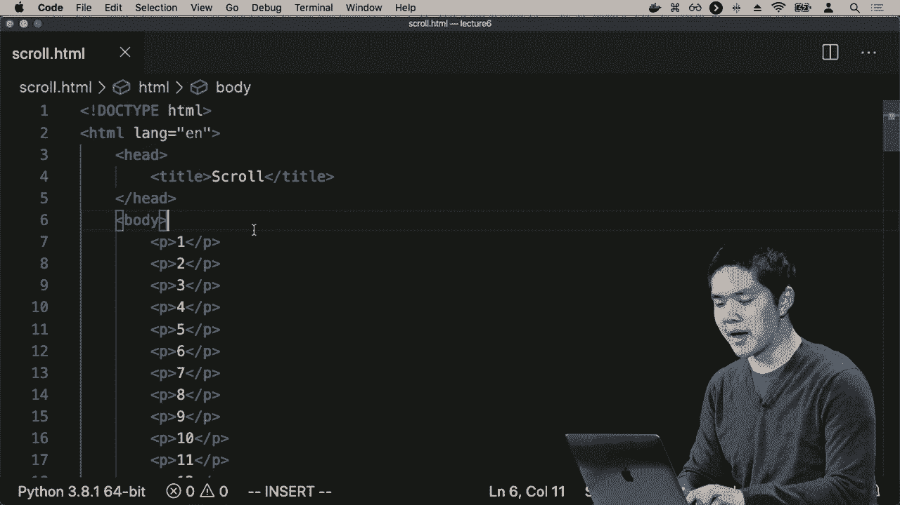


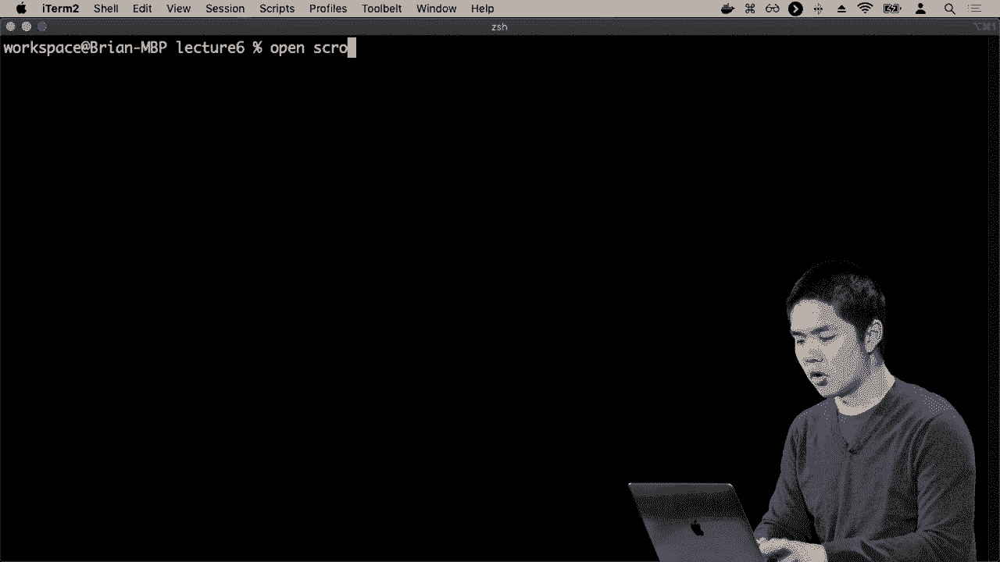

现在把这一切放在一起，如果我访问默认路由，我会看到“你好”，加上三个按钮，给我提供在三个不同部分之间选择的机会，如果我点击第一部分，发生的事情是 JavaScript 将请求 `section/1` 的文本，它会返回文本。

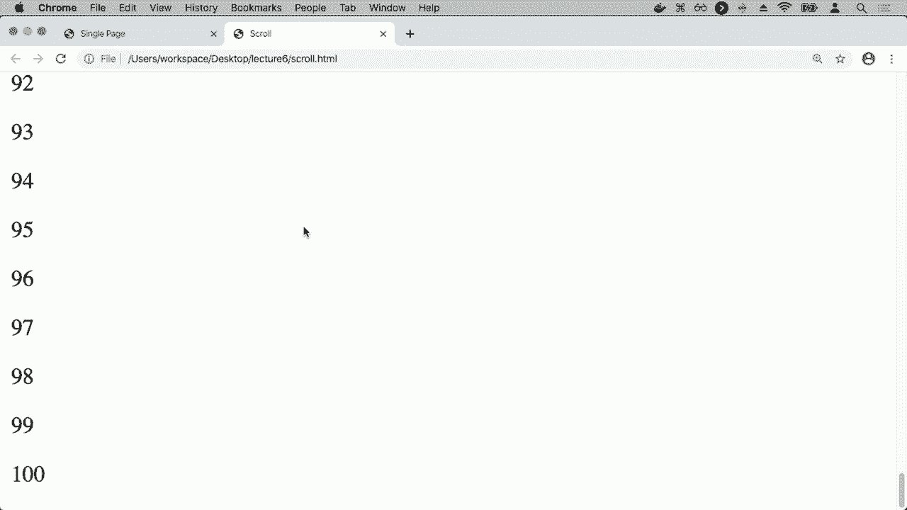


它将填充到页面的第一部分、第二部分和第三部分，所以与之前非常相似，但不同于之前我们所有文本一次性加载到 HTML 页面中，现在我们使用异步 JavaScript 仅在需要时动态加载信息，当我们点击某个部分时，它将发出请求。

请求需要填充的内容，它将进行填充，并生成标题。你可能想象，在一个更复杂的网站中，网页边缘的内容要多得多，所有这些内容保持不变，我们不需要重新加载任何这些信息，我们仅重新加载实际改变的页面部分。

当我们在这些不同的部分标题之间切换时，这在某些方面似乎是一种优势，也许我们可以更高效地运行这样的单页应用。

## 使用历史API管理URL状态

但是，我们似乎失去了在 URL 中保持状态的概念，通常 URL 会给你指示当前页面的信息。

如果你在第一部分，你的 URL 是 `/1`，如果你在第二部分，URL 是 `/2`，第三部分是 `/3`，但当然在所有这些示例中，我们都停留在同一页面，每当我点击一个按钮，无论是第一、第二还是第三部分，URL 永远不会改变，URL 始终保持不变，结果是 JavaScript 中有一种方法。

以更新 URL 的方式操控该 URL，利用所谓的 JavaScript 历史 API，我可以将某些内容推送到历史中，这意味着更新 URL 并实际将其保存到用户的浏览器历史中，这样用户稍后可以潜在地返回到那个位置。为此，我将在类似的单页应用中展示另一个例子。

除了在 `index.html` 内部，我还添加了一些额外的东西。一个是当我点击一个按钮时，也就是说当我点击第一部分、第二部分或第三部分时，我在这里添加了这一行 `history.pushState`，`history.pushState` 的作用是，基本上会向我的浏览历史中添加一个新元素。

我首先指定任何与状态相关的数据，特别是。我存储了一个表示这里所表示的部分编号的javascript对象，下一个是一个标题参数，大多数网页浏览器实际上会忽略，因此通常可以是空字符串。但这里的第三个参数是应该放在url中的内容，我希望放在这个url中。

情况是类似于部分，后跟部分编号，例如我可以输入二。或斜杠部分三，例如，当我点击不同的页面时，这些内容将出现在url栏中，然后我希望能够支持的是，当我回顾我的历史时，如果我在网页浏览器中点击后退按钮。

如果我是之前访问的页面，我想从第3部分返回到第2部分。而且确实有一个事件处理程序，`window.onpopstate`，这意味着当我从历史记录中弹出某个内容时，比如返回我的历史记录。我们可以将一些事件作为参数，如果你查看`event.state`。

我在控制台上运行的部分。日志记录，以便我们可以在稍后查看它。我们将看到存储的状态。

```javascript
// 点击按钮时更新URL和历史
button.onclick = function() {
    const section = this.dataset.section;
    history.pushState({section: section}, '', `/section/${section}`);
    showSection(section);
}

// 监听浏览器前进/后退按钮
window.onpopstate = function(event) {
    console.log(event.state);
    if (event.state && event.state.section) {
        showSection(event.state.section);
    }
};
```


与用户历史的那部分相关联，我可以继续显示该部分。因此，总的来说，当我运行这个网页应用时。


我看到三个部分的按钮，当我点击其中一个按钮时。我不仅看到文本，而且在url栏中也看到我现在在斜杠部分一，这已经被推入我的历史中，我也更新了url以反映这一点。我点击第二部分，更新了url，第三部分也更新了url，当我将内容推入我的部分时。

这样我就可以在需要时返回，事实上，如果我现在打开javascript控制台。如果我返回，例如返回到。

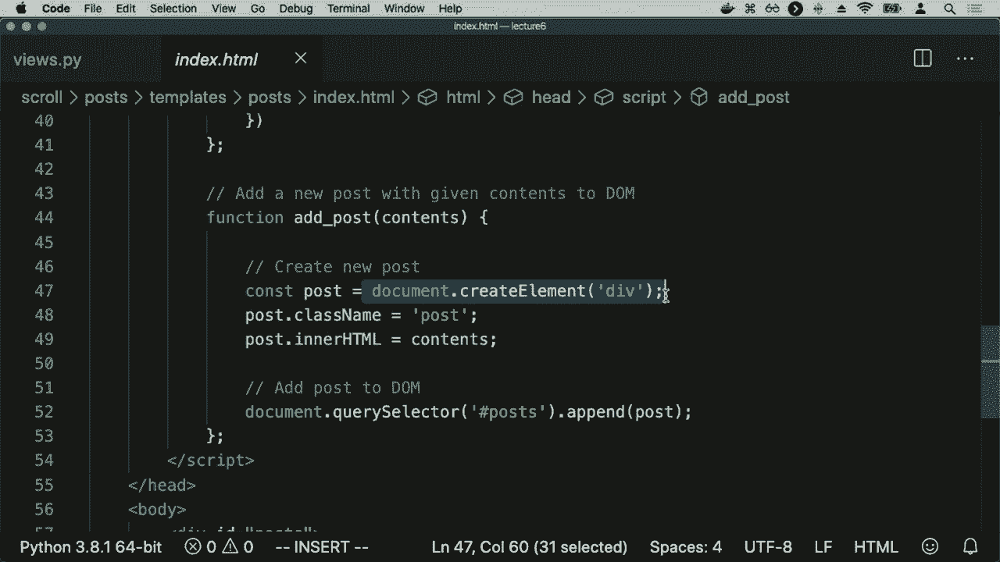


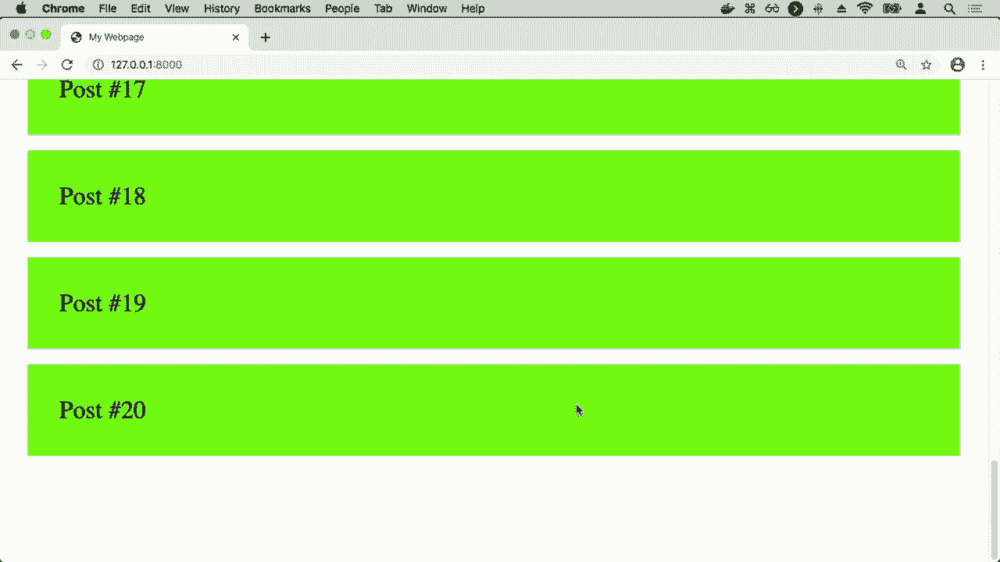

第二部分你会看到的是记录的内容是数字。二当我打印出当前与这个url相关的部分时。它保存了我应该加载第二部分的状态。因此，它确实加载了第二部分，这里当然没有任何问题。

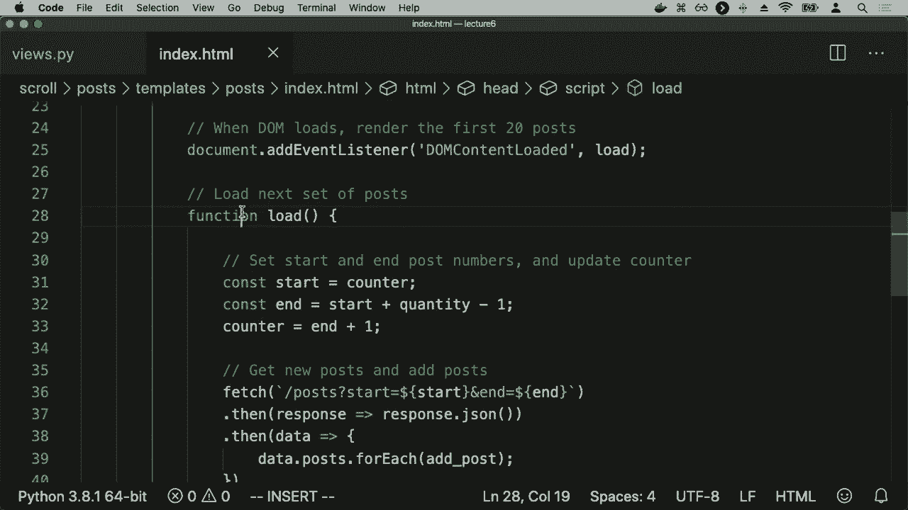

原始范式是仅仅动态加载不同的页面。使用django进行请求并获取响应，但通常当你开始想象许多内容在同一页面上同时变化的应用程序时。你可能会想象社交网络网站，其中许多内容保持不变，你可能会。

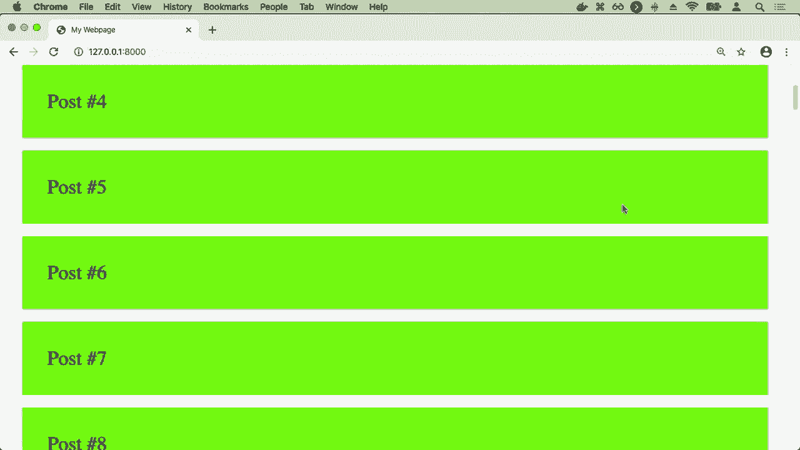

查看同一页面的不同部分，能够动态加载信息，请求额外的信息，然后在页面上显示，这实际上可以是一种非常强大的方式，使你的网页更加互动。因此，这就是我们可能构建单页应用程序的方式，利用javascript来。

异步加载新数据，然后利用这个历史 API，让我们可以向 URL 添加内容，增加用户的浏览历史，以便我们可以稍后通过监听窗口的 `onpopstate` 事件回到它们。

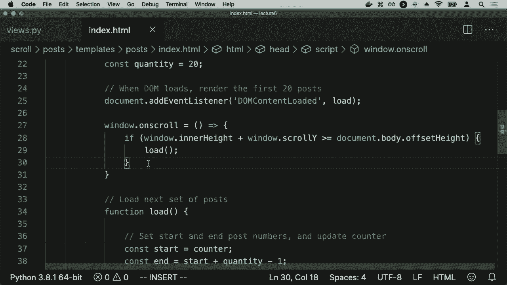

## 窗口对象与滚动检测

而且，事实证明，在 JavaScript 中我们访问到的窗口对象。

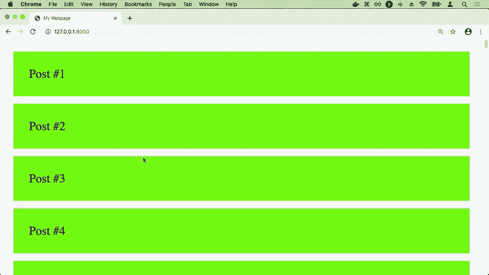

功能非常强大，它表示计算机屏幕上显示所有网页内容的物理窗口，还有一些窗口的属性可以查看，这使我们能够启用一些有趣的功能。例如，窗口的高度确实由用户的。

实际上看到的是他们在 Google Chrome、Safari 或任何他们使用的网页浏览器中的窗口