# 哈佛 CS50-WEB ｜ 基于Python / JavaScript的Web编程(2020·完整版) - P19：L6- Web用户接口与交互 2 (动画与交互) 🎬

## 概述

在本节课中，我们将要学习如何使用CSS和JavaScript为网页元素添加动画效果，并实现用户交互。我们将从基础的CSS动画开始，逐步深入到如何用JavaScript控制动画的播放状态，最后通过一个“隐藏帖子”的实例，展示如何结合两者创建流畅、用户友好的交互体验。

---

## CSS动画基础

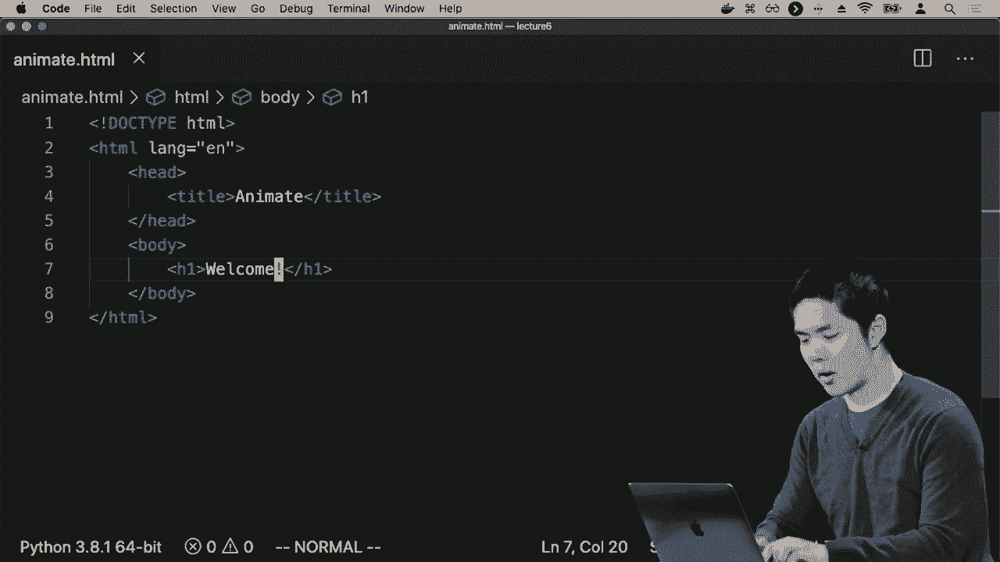

为了让网页元素以某种方式移动或改变其属性，CSS提供了对动画的原生支持。CSS不仅允许我们设置元素的静态样式（如颜色、大小），还赋予我们动态改变这些属性的能力，例如在特定时间段内改变元素的大小或位置。

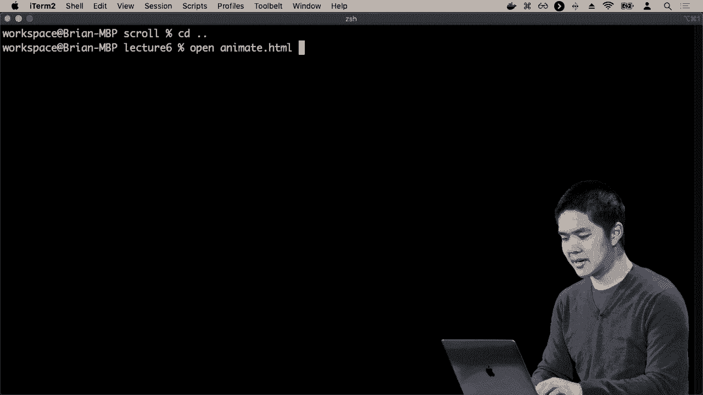

现在，我们来看一个实际的例子。我将创建一个名为 `animate.html` 的新文件。

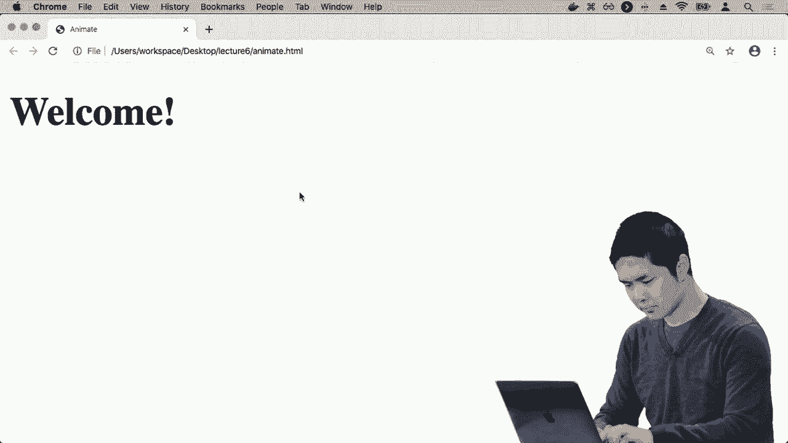

在 `animate.html` 中，我将添加一些动画效果。首先，为这个页面应用CSS样式。我将从一个标题开始，例如“欢迎”，它将显示一条欢迎消息。

现在，如果我打开 `animate.html`，看到的只是一个写着“欢迎”的静态消息。

接下来，让我们为它添加一些CSS样式。在 `<style>` 标签中，针对标题 `h1`，我想为其应用一个特定的动画。

首先，我需要指定动画的名称。我可以为动画选择一个名字，比如“增长”。我会将动画的持续时间设置为两秒。动画填充模式决定了动画的播放方向，通常是向前进行，以便根据我们指定的规则取得进展。

在这里，我声明将使用一个名为“增长”的动画来作用于所有标题。现在，我需要在样式上方定义这个动画的关键帧。

使用 `@keyframes` 规则，我可以为这个特定元素指定关键帧，即定义动画开始和结束时的样式属性。CSS会自动计算并处理中间每一帧的变化。

例如，我可以说在动画开始时（`from`），字体大小为20像素；在动画结束时（`to`），字体大小为100像素。

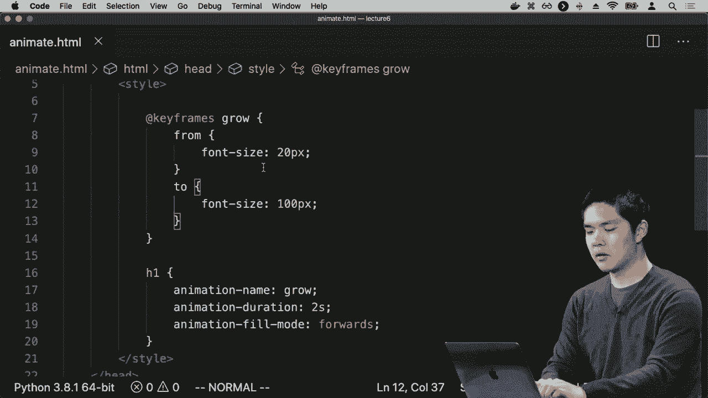

总体来看，这表明我想将名为“增长”的动画应用于所有标题，该动画应持续两秒并向前进行。

而“增长”动画具体会做什么呢？它意味着任何遵循此动画的元素，在开始时字体大小为20像素，在结束时将增长到100像素。

现在我已经定义了这个动画。如果我刷新 `animate.html` 页面，你会看到“欢迎”二字在两秒钟内从小变大，遵循了我设定的关键帧指令。

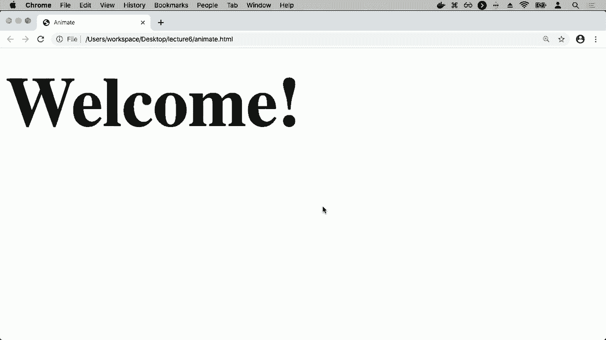

我们可以在页面上查看效果。实际上，你能操控的远不止大小，几乎任何CSS属性都可以被动画化。

---

## 操控位置与多关键帧动画

如果我将标题的定位设置为相对定位（`position: relative`），这意味着它的位置将相对于其父元素或其他元素。然后，我可以让它的位置从屏幕左侧的0%移动到距离左侧50%的位置。

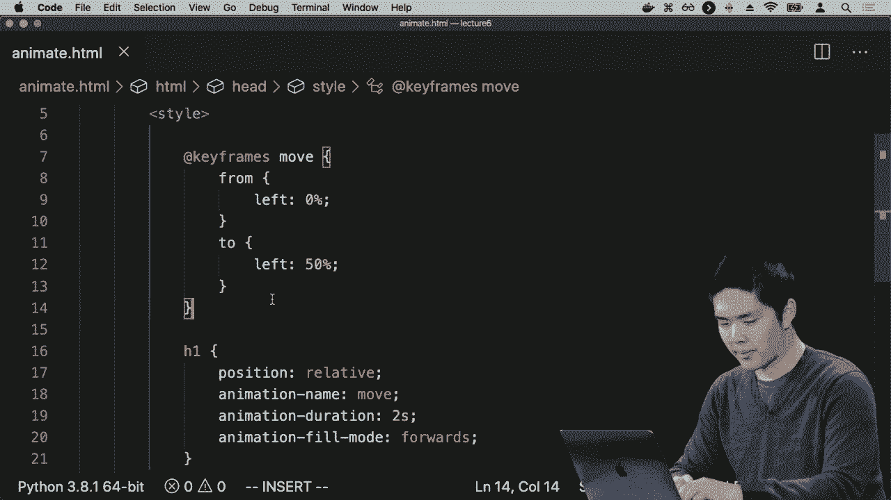

此时，“增长”可能不是这个动画的最佳名称，我会将其改名为“移动”。

现在，这个动画的效果是：当你运行动画时，元素将从紧靠屏幕左侧开始，逐渐调整到距离屏幕左侧大约50%的位置。我们看到的就是这个移动过程。

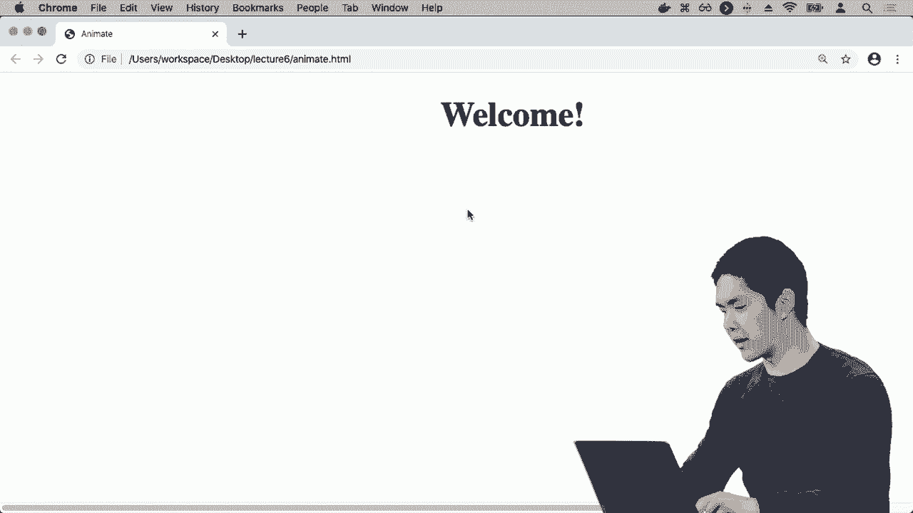

刷新页面，它就会执行完全相同的操作。

我们不仅需要指定动画的起点和终点，还可以在动画的不同时间点设置多个关键帧，以捕捉更复杂的变化。

例如，如果我想让标题不仅向右移动，还要再移动回来，我可以设置三个关键帧：
*   在动画开始时（0%），距离左侧0%。
*   在动画进行到一半时（50%），距离左侧50%。
*   在动画结束时（100%），再次回到距离左侧0%。

现在，当我刷新页面时，标题会先向右移动，然后再移动回来。

---

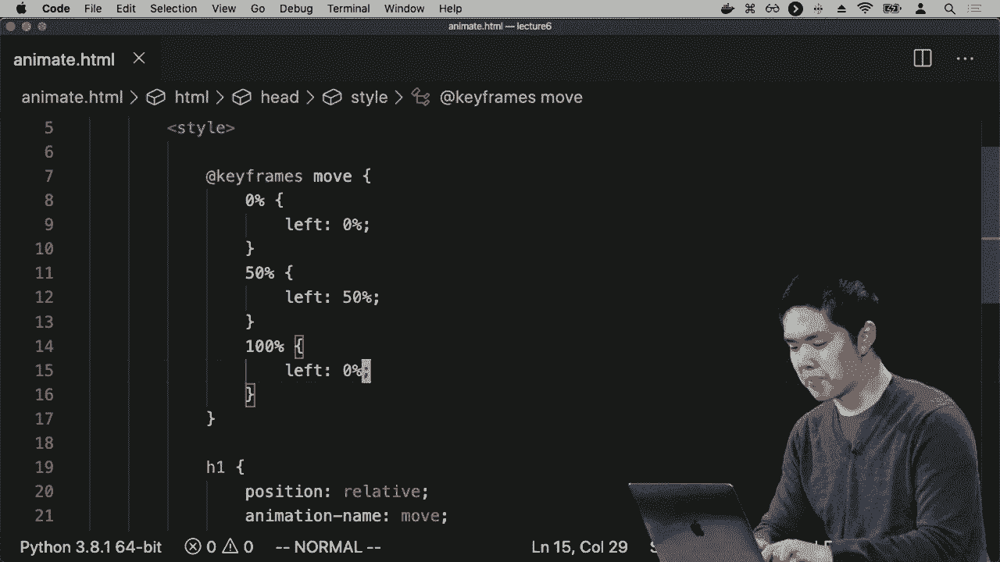

## 控制动画的播放

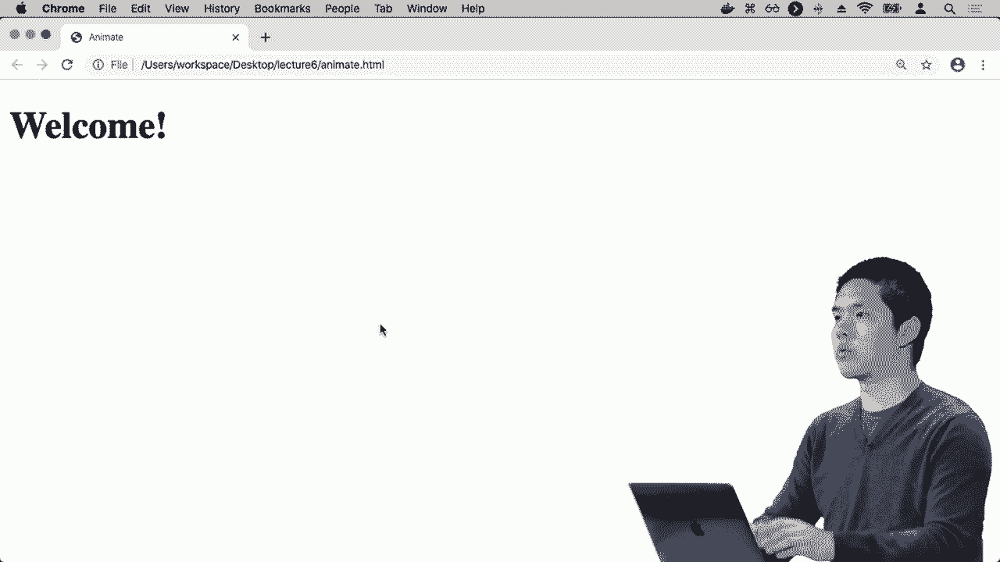

还有其他属性可以控制动画，例如 `animation-iteration-count`（动画迭代次数）。我可以将其设置为2，这意味着动画不是只运行一次然后停止，而是运行两次。

因此，当我刷新时，它会向右移动，然后向左移动，然后再重复一次这个循环。

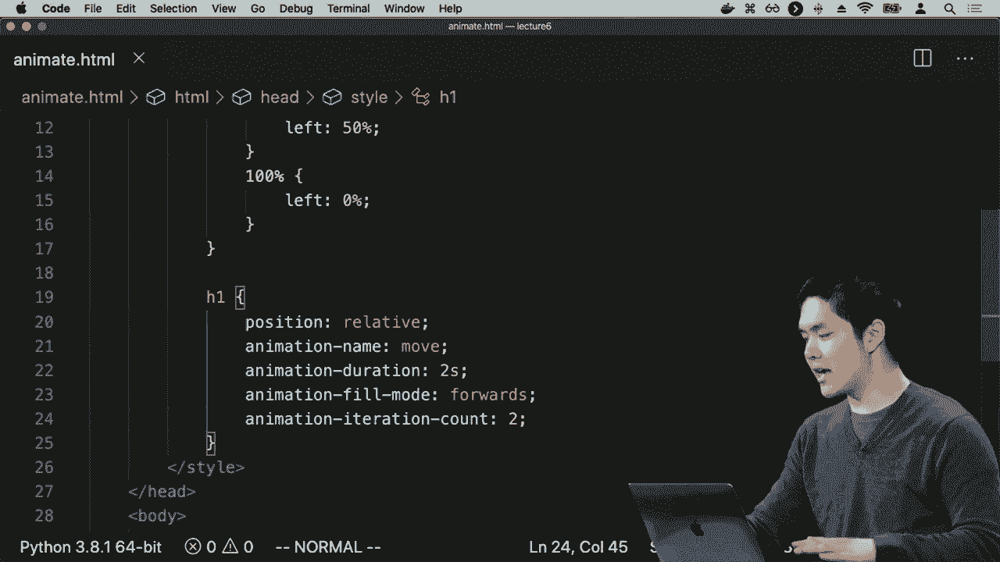

如果你愿意，甚至可以将其设置为 `infinite`（无限），这意味着动画永远不会停止，将始终依据指定的关键帧在右侧和左侧之间来回移动。

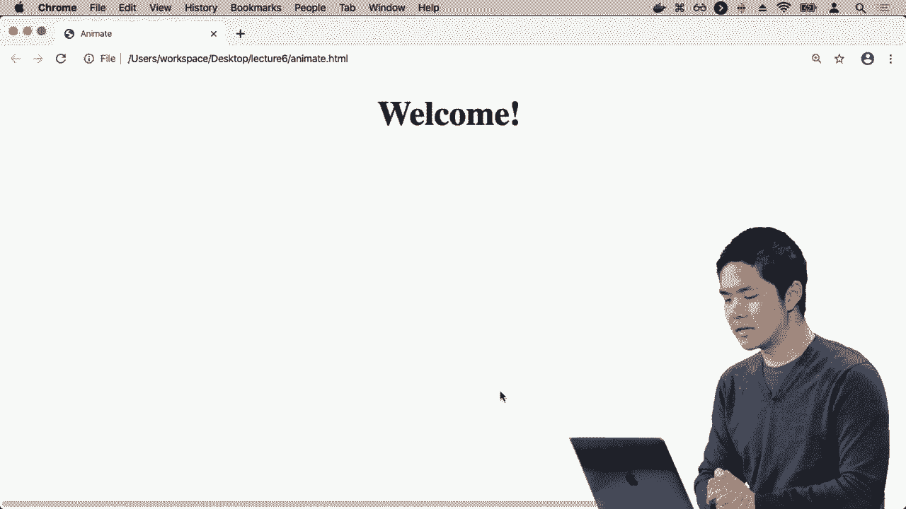

因此，如果你看到页面上有元素以某种方式互动地移动，有很多方法可以实现，但仅使用CSS也能很好地创建这类动画。

目前这个动画只是无限循环。我们还可以使用JavaScript来控制它。

---

## 使用JavaScript控制动画

让我们看看如何实现。我要回到页面的主体部分，除了一个写着“欢迎”的标题，我还会添加一个按钮，上面写着“点击这里”。

接下来，就是添加一些JavaScript，让按钮可以控制动画的开始和停止。

在这个 `<script>` 标签内部，首先使用 `document.addEventListener(‘DOMContentLoaded‘, ...)` 来等待DOM加载完成。

然后，我获取那个 `h1` 元素。最初，我会将其样式中的 `animationPlayState` 属性设置为 `paused`。`animationPlayState` 是样式的一个属性，用于决定动画是正在播放还是暂停，我可以使用JavaScript来控制它。

我希望的情况是：每当有人点击按钮时，就改变动画的播放状态。

所以，我使用 `document.querySelector(‘button‘)` 来获取那个按钮，并为它添加一个点击事件监听器。当按钮被点击时，运行一个函数。

这个函数会检查标题当前的动画播放状态。如果当前是 `paused`，就将其设置为 `running`；否则（如果已经在运行），就将其设置回 `paused`。

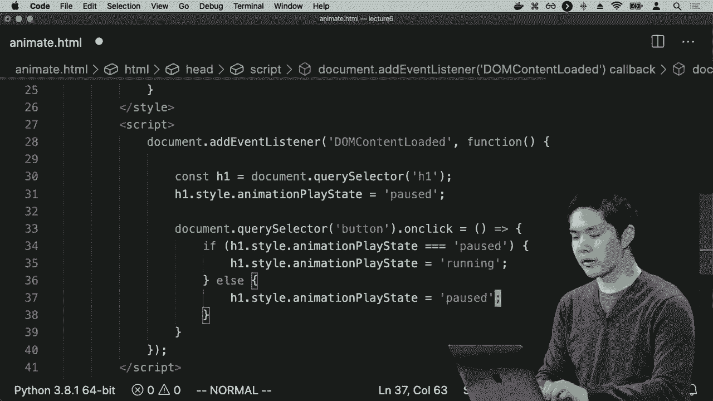

总体来看，这个函数的作用是：获取标题元素，初始状态为暂停。每当按钮被点击时，就切换动画的播放状态。

现在，如果我刷新这个页面，会看到“欢迎”信息和一个写着“点击这里”的按钮。最初动画是暂停的，没有发生任何移动。

但当我点击按钮时，动画开始无限进行。直到我决定停止它，再次点击按钮，动画就会暂停。这样，我就能够控制动画何时开始和何时停止。

这在你想创建更具互动性的页面动画时特别有帮助。这意味着你可以逐渐地改变CSS属性，而不是立即改变，从而创造出更平滑的过渡效果。

---

## 实践：为“隐藏帖子”功能添加动画

那么，让我们看一个如何将这个想法付诸实践的例子。回到我们之前的“帖子”示例，我们有一个无限滚动的帖子列表。现在，我们希望在用户操作后能够优雅地隐藏帖子。

我准备了一个名为“隐藏”的示例，它与之前的非常相似，但这次我为每个帖子添加了一个额外的“隐藏”按钮。

目前，点击“隐藏”按钮什么也不会发生，我们稍后将实现其功能。

首先，看看这是如何工作的。在 `index.html` 模板中，唯一的变化发生在添加新帖子时。

它从服务器加载帖子，然后在获取到那些帖子时，遍历每个帖子（目前只是一个文本字符串）。然后，它通过 `addPost` 函数将这个字符串文本添加到页面的一个元素中。

`addPost` 函数会创建一个 `div` 来存储那个帖子，并给它一个类名（我们将通过这个类名来动画化它）。然后将其内部HTML设置为帖子的内容（如“帖子编号一”），并添加一个只写着“隐藏”的按钮。最后，将这个 `div` 添加到DOM中。

这就是 `addPost` 现在要做的事情：我们通过这段JavaScript代码生成一些HTML，然后将这些HTML添加到页面上。我们添加的是一个包含文本和一个“隐藏”按钮的 `div`。

---

## 实现帖子隐藏功能

我们最终希望能够隐藏那篇帖子。那么，如何让帖子的隐藏功能正常工作呢？

我们想要做的是，检测用户何时点击这些“隐藏”按钮。有多种方法可以做到这一点，其中一种方法是监听整个文档上的点击事件。

每当有人点击文档时，我们可以通过事件对象来查询他们到底点击了什么。对于大多数事件监听器，传入的函数可以接收一个事件对象作为参数。

这个事件对象有一个属性叫 `event.target`，它代表了事件的实际目标，即被点击的元素。我将 `event.target` 保存在一个名为 `element` 的变量中。

现在的想法是：无论被点击的是什么，我们都将其保存在 `element` 中。然后，我想知道 `element` 是否是一个“隐藏”按钮。

我也可以为每个“隐藏”按钮单独附加事件监听器，但这里演示另一种方式。

假设当我们在任何地方点击时，如果被点击的元素具有类名 `hide`（因为我给每个“隐藏”按钮都赋予了这个类名），那么我们就可以认为它实际上是一个“隐藏”按钮。

所以，我可以说：如果 `element.className` 等于 `hide`，那么被点击的对象就是一个“隐藏”按钮。

接下来，我想做的是调用 `element.remove()` 来移除那个元素。

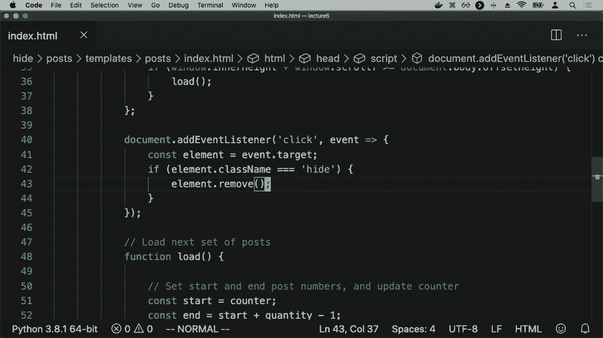

那么，如果我刷新页面并点击“帖子一”的“隐藏”按钮，会有什么效果呢？它移除了“隐藏”按钮本身，但并没有移除整个帖子。

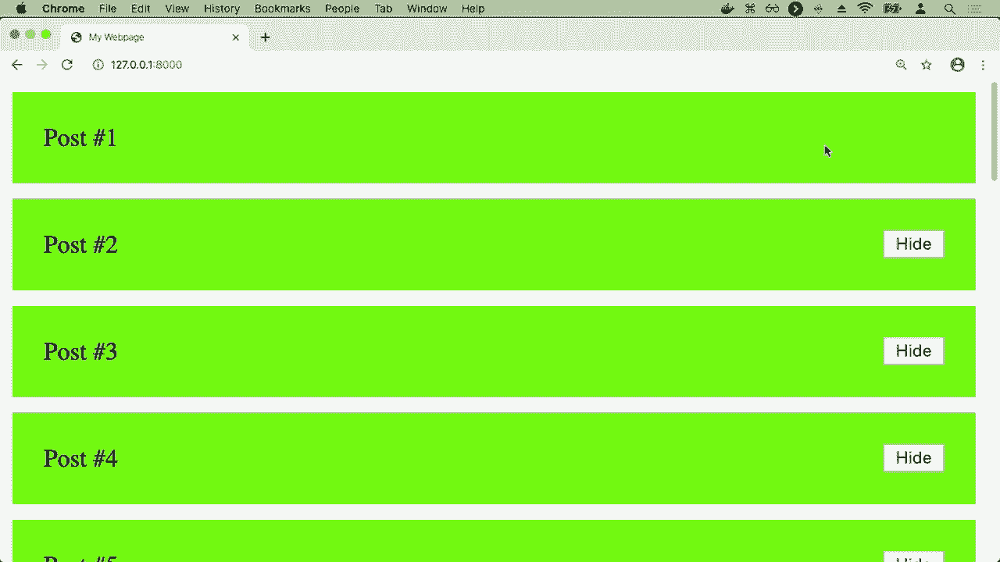

这里发生的情况是：如果元素的类名是 `hide`，意味着我点击了一个“隐藏”按钮。`element.remove()` 只会移除那个按钮元素，并不会移除包含它的整个帖子 `div`。

从DOM结构来看，帖子是一个 `div`，而“隐藏”按钮是它的子元素。因此，移除按钮并不会同时移除帖子。

如果你也想去掉帖子，你需要移除的不是这个元素本身，而是它的父元素。在JavaScript中，可以通过 `element.parentElement.remove()` 来实现。

也就是说，获取这个元素的父级并移除它。现在，如果我点击“隐藏帖子一”，帖子一就消失了，直接看到帖子二。

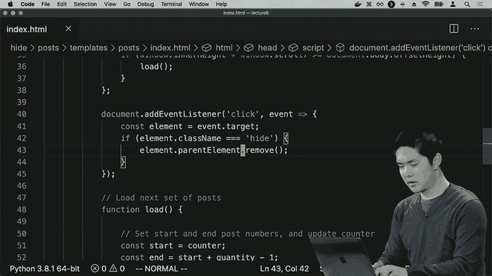

这虽然有效，但效果并不明显，因为所有帖子看起来都一样，用户可能注意不到隐藏成功了。

---

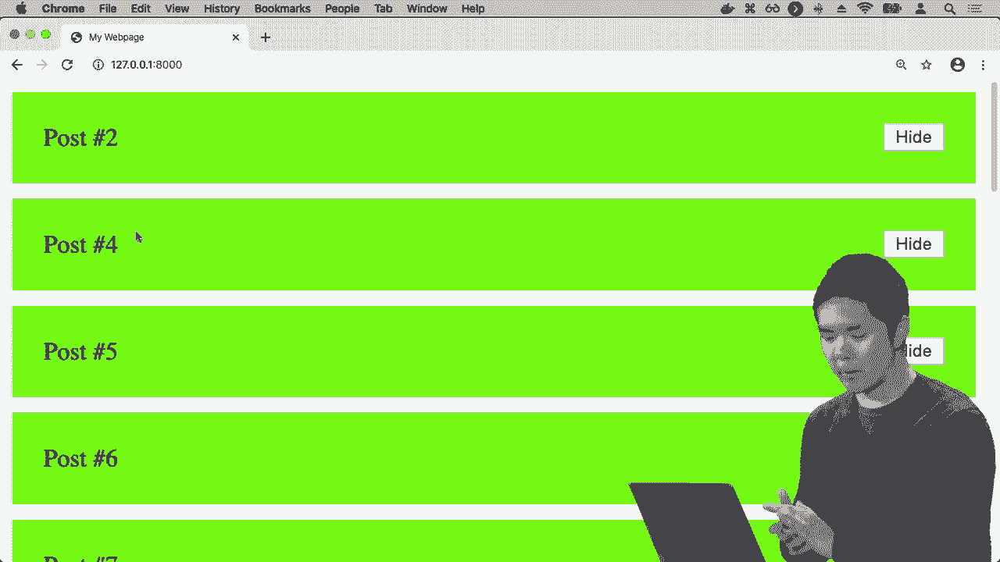

## 为隐藏操作添加淡出动画

因此，这正是动画可以发挥价值的时候。我可以为每个帖子关联一个动画。

我将给帖子 `div` 一个动画名称，叫做“隐藏”，动画持续时间为两秒，动画填充模式为向前（`forwards`）。最初，我将给帖子设置动画播放状态为暂停，因为我不想立即隐藏所有帖子。

稍后，我们会通过JavaScript来运行动画，以便实际隐藏帖子。

接下来，我需要定义“隐藏”动画具体意味着什么。在 `@keyframes hide` 中，我会说：在0%时（动画开始），元素的不透明度为1；在100%时（动画结束），元素的不透明度为0。

不透明度是一个CSS属性，它控制HTML元素的透明度。值为1表示完全不透明（完全可见），值为0表示完全透明（不可见）。

因此，这个动画的效果是：最初元素完全可见，在2秒内逐渐变为完全透明。

现在，我需要在实际的事件监听器中触发这个动画。与其立即移除元素，不如先获取帖子的父元素（即帖子本身），并将其动画播放状态设置为 `running`。

这意味着当我点击“隐藏”按钮时，就开始运行动画。动画将会在几秒钟内将不透明度从1变为0。

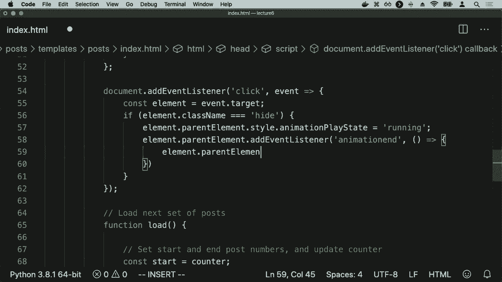

如果我真的想要在动画结束后移除元素，可以添加另一个事件监听器。元素有一个叫做 `animationend` 的事件，当动画结束时就会触发。

然后我可以说：好的，当动画结束后，我们再继续移除这个元素。

因此，总体流程是：当我点击“隐藏”按钮时，不是立即移除元素，而是获取帖子元素本身，将其动画播放状态设置为运行（即触发“隐藏”动画），然后为整个帖子添加一个 `animationend` 事件监听器。当动画结束时，再从DOM中完全移除整个帖子。

那么现在这一切的效果是什么？进行这个动画后，如果我刷新页面，就会看到所有这些帖子。如果我试图隐藏第二个帖子，你会看到它的透明度逐渐变化，慢慢消失，直到完全透明时，帖子才会被完全移除。

这样，当用户点击“隐藏”按钮时，会触发一个优雅的淡出动画。这就是动画的价值之一：它能让我们的用户界面更友好，而不是生硬地立即删除内容。

---

## 优化动画：平滑的高度变化

即使这样，动画可能还不够完美。你可能会注意到，当帖子消失时，下面的帖子会突然跳上来填补位置。

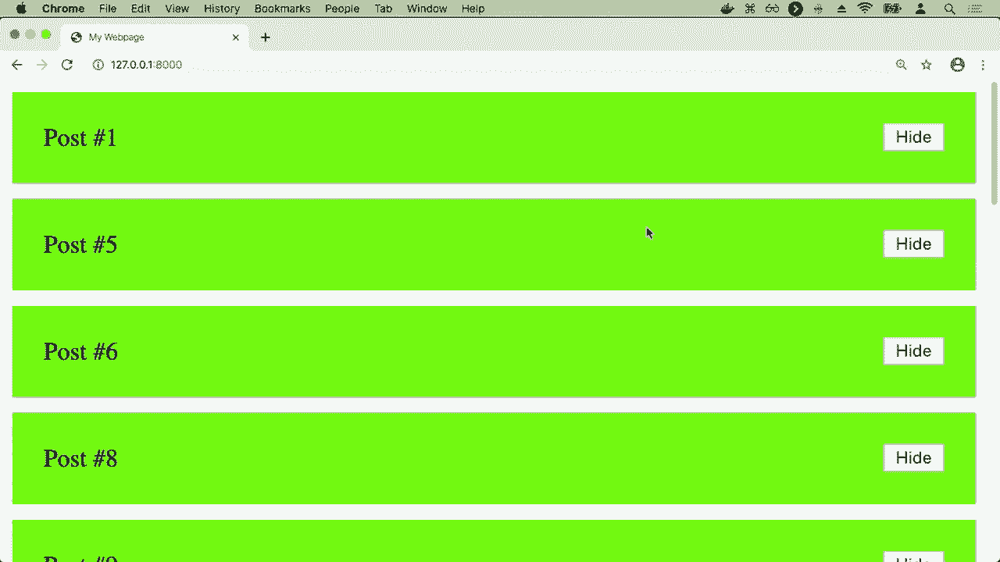

我希望效果能更智能一些，在帖子消失后，能平滑地缩小其占用的空间，这样其他帖子就不会猛地跳入位置，而是更自然地滑入。

这里我可以进一步调整。也许我想将这个动画变成多部分动画。

所以在这里，我不只是简单地将不透明度从1变为0。也许在动画的前75%中，只处理不透明度从1降到0。但在动画的最后25%中，虽然不透明度保持为0，但我希望将所有产生垂直空间的属性减少到零。

所以，高度应该变为0像素，行高（文本的高度）也应该变为0像素，任何内边距我希望消失，实际上我已经在帖子底部添加了一些外边距，我也想去掉它。

所以我希望将所有这些设置为零。最初，高度是`auto`（或具体值），行高是初始值，父元素有大约20像素的内边距和10像素的底部外边距。我希望在动画的75%处这些值仍然保持不变，但只有在动画的最后25%中，才希望将这些垂直高度属性都设置为零。

这样效果就是：我会有一个动画，在动画的前75%中，唯一变化的是不透明度，从1变为0，即从完全可见到完全透明。此时，帖子已经透明了，你看不见它，但它仍然占据页面上的物理空间。

然后，在动画的最后25%，我们将减少这个帖子的高度、行高、内边距和外边距，这样它就完全不占空间了。

所以，如果我刷新这个页面，这里又出现了所有帖子。但如果我点击隐藏某一特定帖子，我们会看到它首先渐渐消失（变透明），然后它的高度缩小，以便下一个帖子能够很顺畅地滑入位置。

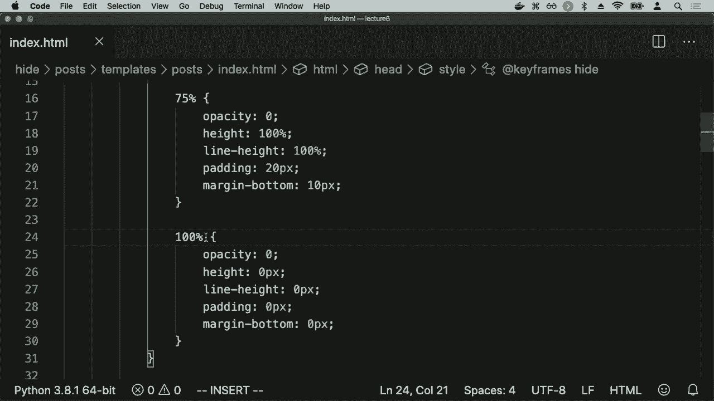

我可以再这样做：隐藏另一个帖子，它先变透明，然后高度缩小，其他帖子平滑地滑入位置。

这再次应用了CSS动画的理念，使用动画属性使我们的界面更好用，视觉上更清晰。一条帖子优雅地消失了，其他帖子平滑地向上滚动以占据它的位置。

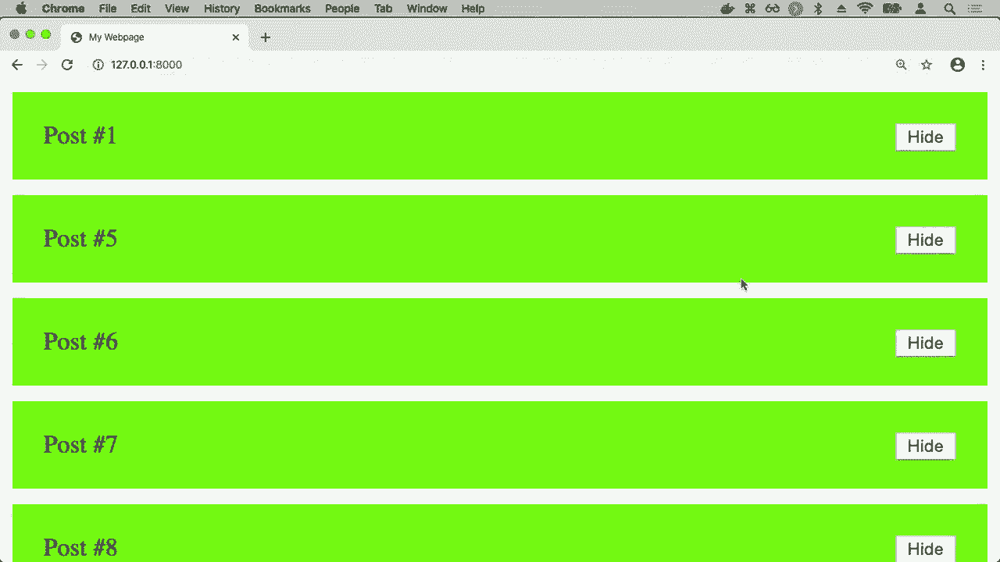

---

## 总结

本节课中，我们一起学习了如何使用CSS创建基础动画（包括大小、位置变化和多关键帧动画），以及如何用JavaScript控制这些动画的播放状态（开始、暂停）。最后，我们通过一个完整的“隐藏帖子”实例，实践了如何结合CSS动画与JavaScript事件监听，创造出流畅、直观的用户交互体验，从而提升Web应用的用户友好性。我们现在能够使用JavaScript创建许多漂亮的用户界面，包括单页面应用程序、无限滚动和丰富的动画效果。