# 哈佛 CS50-WEB ｜ 基于Python / JavaScript的Web编程(2020·完整版) - P2：L0- HTML与CSS语法 1 (web编程与HTML) 📚


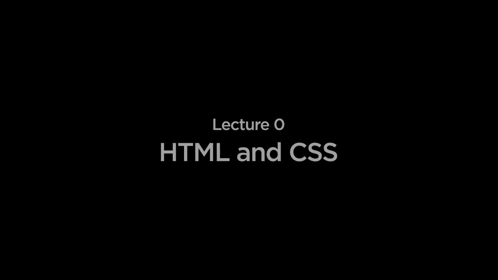


## 概述

在本节课中，我们将要学习网页编程的基础，特别是构成网页骨架的两种核心语言：HTML和CSS。我们将从HTML开始，了解如何使用它来描述网页的结构和内容。

---

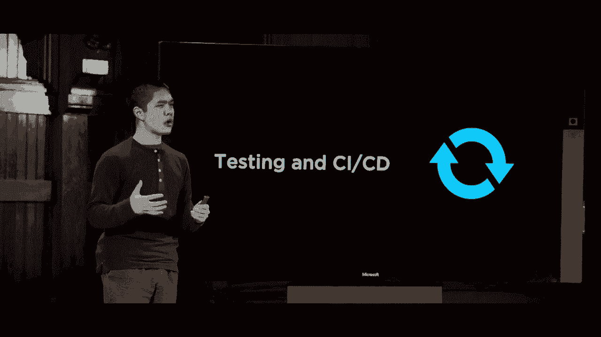

## 课程介绍与目标 🎯

大家好，欢迎来到使用Python和JavaScript的网页编程课程。我叫Brian U。在这个课程中，我们将深入研究网页应用的设计和实现。

在讲座中，我们将有机会讨论和探索许多核心的想法、工具和语言。通过动手项目，你将有机会将这些想法付诸实践，设计多个你自己的网页应用，最终以一个你自己选择的项目作为结尾。

在整个学期中，我们将涵盖网页编程领域的多个主题。

---

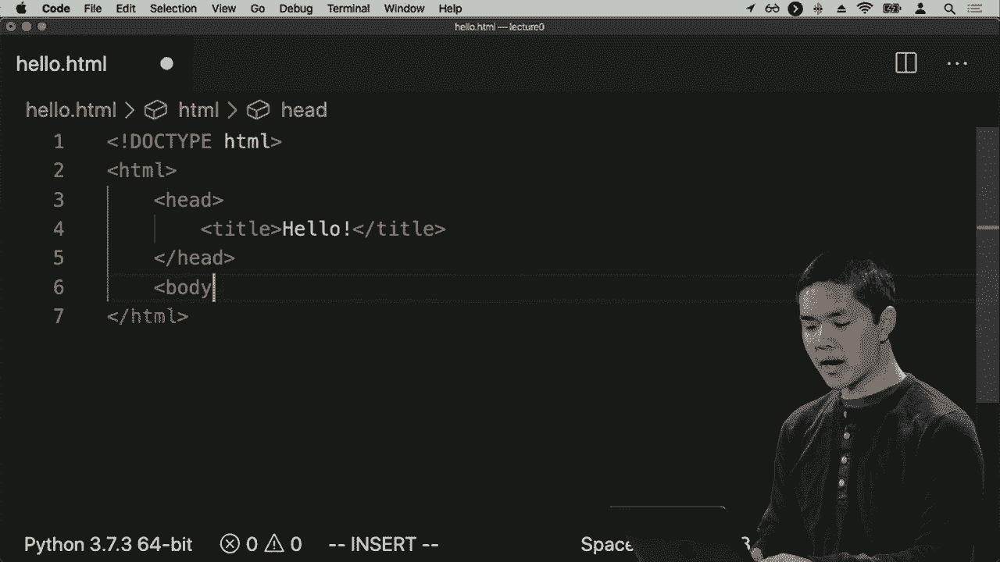

## 网页编程的核心：HTML与CSS 🌐

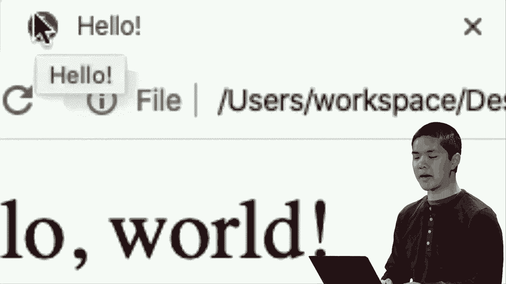

我们将从HTML和CSS开始我们的讨论，这两种语言是理解网页以及网页浏览器如何显示这些网页的基础。

*   **HTML**（超文本标记语言）是一种我们用来描述网页结构的语言。
*   **CSS**（层叠样式表）是一种我们用来描述网页样式的语言，包括颜色、字体、布局和间距。

完成这些之后，我们将关注版本控制工具Git，它可以帮助我们跟踪对网页程序所做的更改，并使我们能够在多个不同项目上协作。

---

## 课程路线图 🗺️

之后，我们将关注Python，这是我们将要探索的第一种主要语言。我们将使用一个叫**Django**的框架来构建网页应用。Django是用Python编写的网页编程框架，它简化了网页应用的设计和开发，特别是使得设计与数据交互的网页应用变得简单。

接着，我们将关注**SQL**，这是一种我们可以用来与数据库互动的语言。我们将研究Django如何允许我们使用模型和迁移来与数据交互。

接下来，我们将探索第二种主要编程语言：**JavaScript**。我们将学习如何使用JavaScript在用户的网页浏览器中运行，使网页变得更加互动。

之后，我们将关注**测试**、**持续集成**和**持续交付**，这些是我们可以使用的软件最佳实践工具，以确保我们能够更有效地编写代码，并确保我们的网络应用程序始终如预期那样运行。

最后，我们将关注**可扩展性**和**互联网安全性**，探讨当我们的网络应用程序用户量增长时，如何进行负载均衡、优化数据库，以及如何主动设计我们的网络应用程序以确保其安全。

---

## 第一个HTML页面 📄

我们的第一个HTML页面将类似于以下代码。它是我们编写的基于文本的代码，然后像Safari、Chrome或Firefox这样的网页浏览器能够查看、解析、理解并显示给用户。

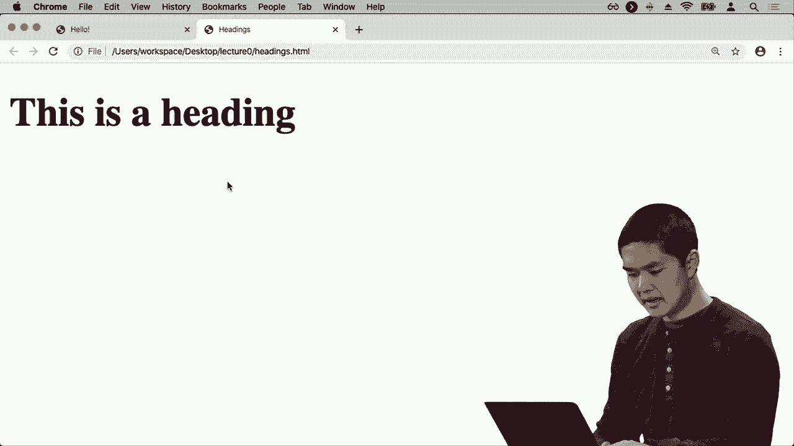

让我们来看一下这个页面，一次一行，逐步理解其工作原理。

```html
<!DOCTYPE html>
<html lang="en">
    <head>
        <title>Hello</title>
    </head>
    <body>
        Hello, world!
    </body>
</html>
```

这个网页实际上会是什么样子呢？我们来看一下。

打开一个文本编辑器（我将使用微软的Visual Studio Code），创建一个新文件，命名为 `hello.html`，并写入上面的代码。

如果你在网页浏览器中打开这个 `hello.html` 文件，你会看到页面主体中显示“Hello, world!”，并且浏览器标签页的标题是“Hello”。

---

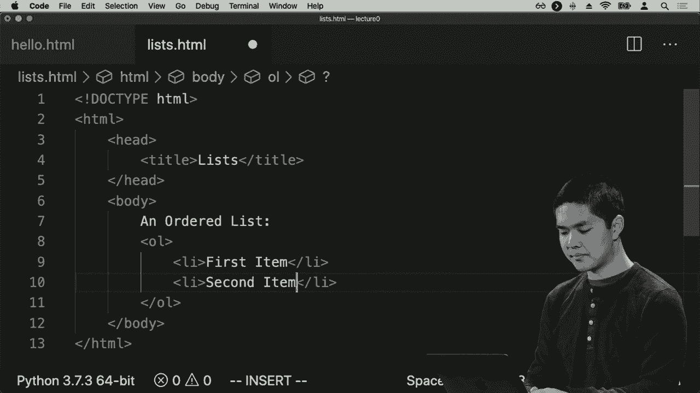

## 解析HTML结构 🔍

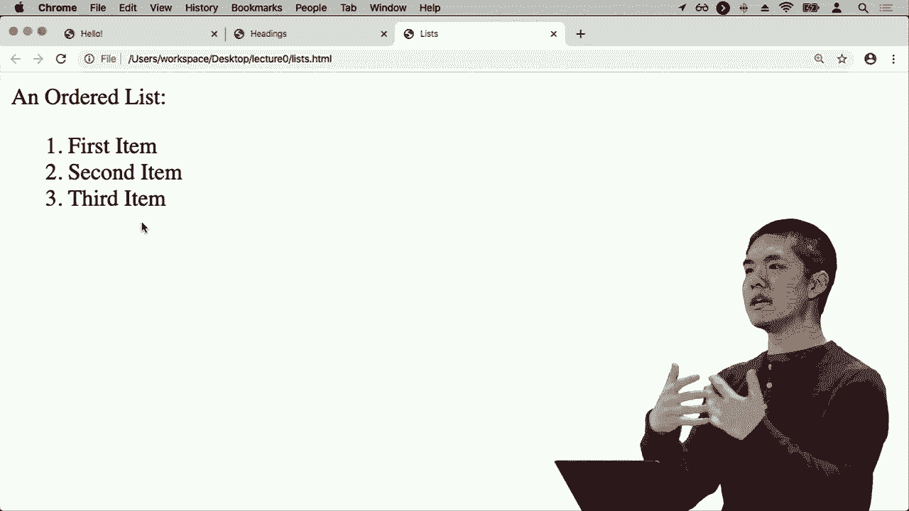

现在让我们更详细地探索这个程序是如何工作的。

*   **`<!DOCTYPE html>`**：这是文档类型声明，告诉网页浏览器我们在这个特定网页上使用哪个版本的HTML。`<!DOCTYPE html>` 表示该页面是用 **HTML5** 编写的。
*   **`<html lang="en">`**：这是HTML页面的根元素。`lang="en"` 是一个属性，它告诉浏览器或搜索引擎这个页面是用英语编写的。
*   **`<head>`**：页面的头部，包含不在网页主体中显示、但对浏览器有用的信息，例如标题。
*   **`<title>`**：标题标签，定义浏览器标签页中显示的标题。在这个例子中是“Hello”。
*   **`<body>`**：页面的主体部分，包含用户可以看到的所有可见内容。在这个例子中是文本“Hello, world!”。

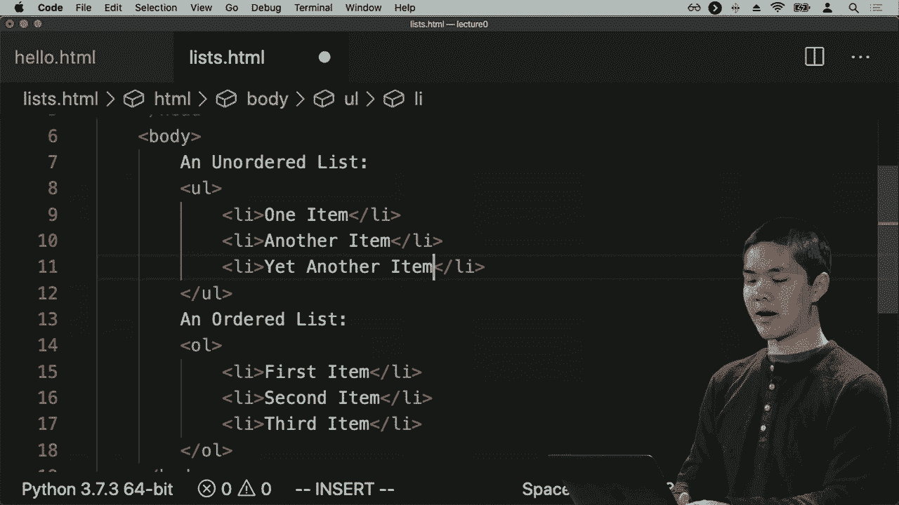

---

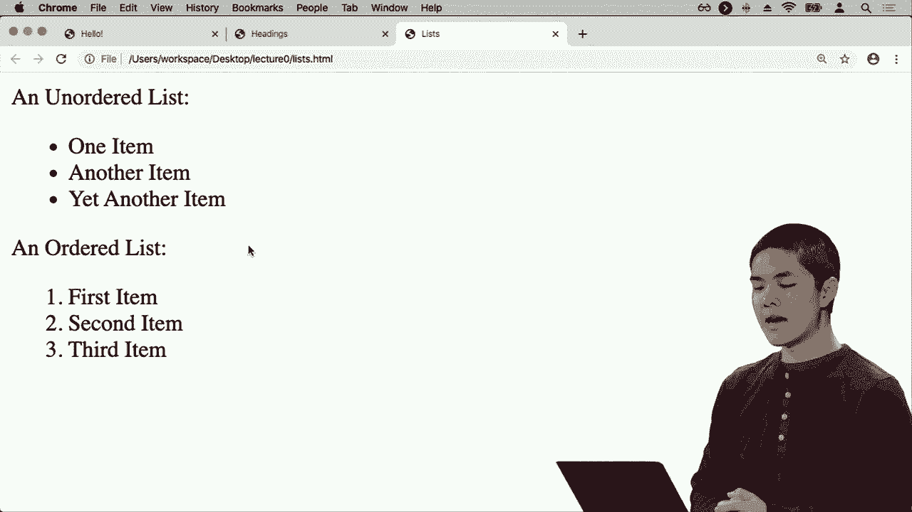

## 文档对象模型 (DOM) 🌳

从结构上思考HTML页面有时很有帮助，这就是我们称之为**文档对象模型 (DOM)** 的树状结构。

对于上面的例子，DOM结构如下：
*   `html` 元素是根节点。
    *   它有两个子元素：`head` 和 `body`。
        *   `head` 元素有一个子元素 `title`，其中包含文本“Hello”。
        *   `body` 元素包含文本“Hello, world!”。

这种树状结构有助于我们理解HTML元素之间的嵌套关系，这在后续使用JavaScript修改页面时尤为重要。

---

## 常见的HTML元素 🧱

上一节我们介绍了HTML的基本结构，本节中我们来看看一些构建网页时常用的HTML元素。

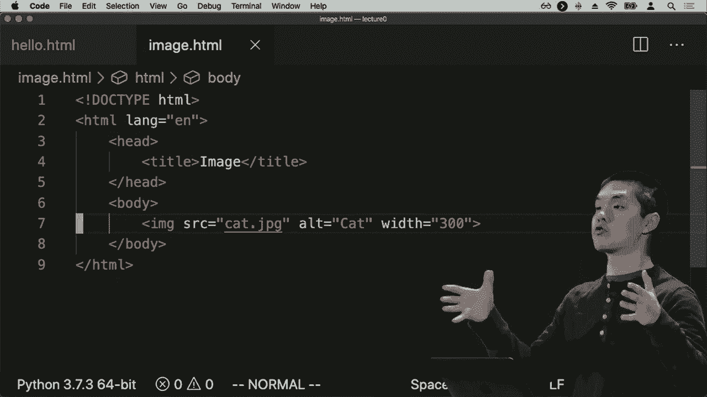

### 标题 (Headings)

标题用于定义页面或章节的标题。HTML提供了六个级别的标题标签，从 `<h1>`（最重要/最大）到 `<h6>`（最不重要/最小）。

```html
<h1>这是一个大标题</h1>
<h2>这是一个较小的标题</h2>
<h3>这是一个更小的标题</h3>
```

以下是不同级别标题的显示效果：
*   `<h1>` 是最大的标题。
*   `<h2>` 是第二大的标题。
*   还有 `<h3>`, `<h4>`, `<h5>`, `<h6>`，`<h6>` 是最小的标题。

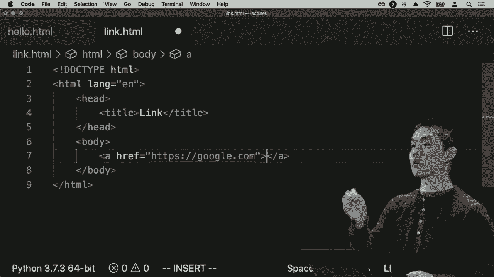

### 列表 (Lists)

列表用于展示一系列项目。HTML有两种基本类型的列表：

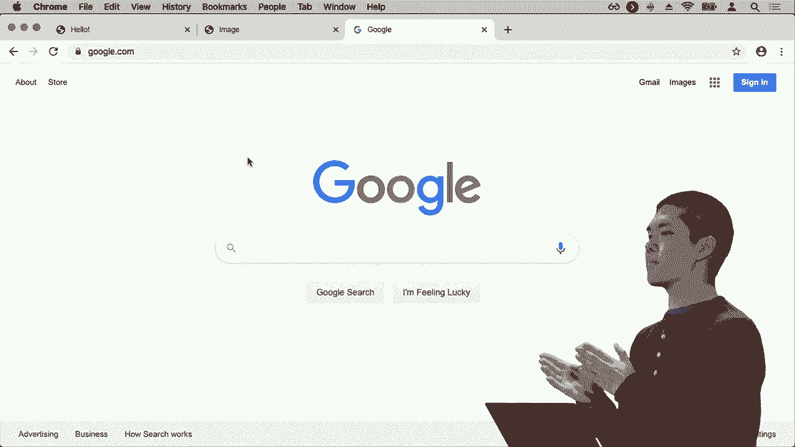

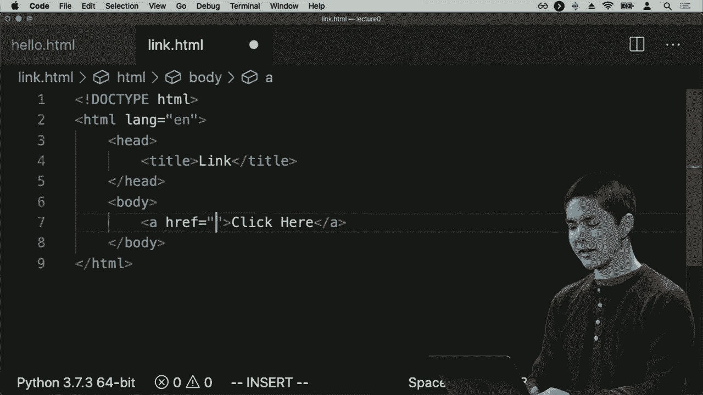

1.  **有序列表 (`<ol>`)**: 项目以特定顺序（如1, 2, 3）编号显示。
2.  **无序列表 (`<ul>`)**: 项目以项目符号（如圆点）显示，没有特定顺序。

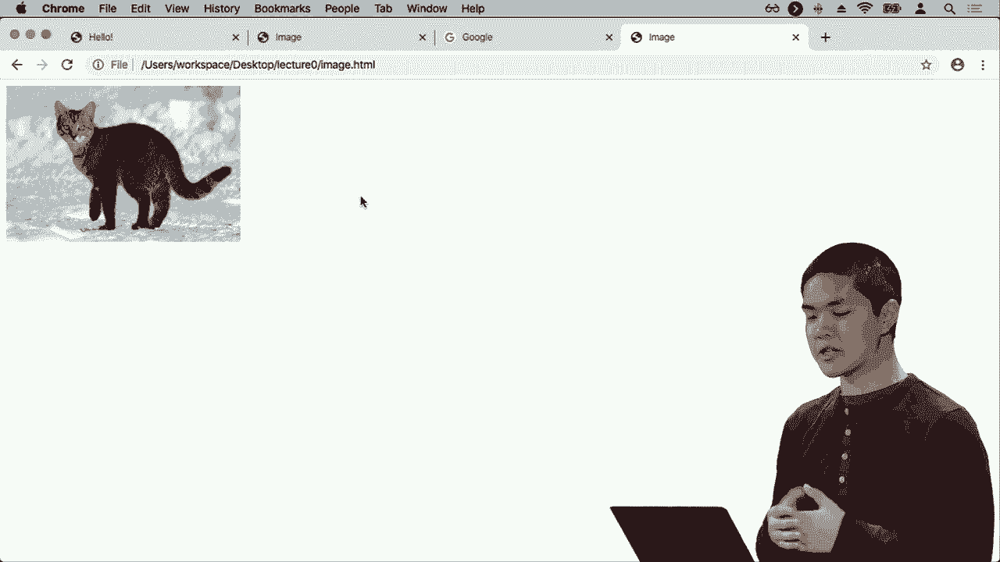

列表中的每个项目都用 `<li>`（列表项）标签表示。

```html
<!-- 有序列表 -->
<ol>
    <li>第一个项目</li>
    <li>第二个项目</li>
    <li>第三个项目</li>
</ol>

<!-- 无序列表 -->
<ul>
    <li>一个项目</li>
    <li>另一个项目</li>
    <li>还有一个项目</li>
</ul>
```

### 图像 (Images)

使用 `` 标签在网页中嵌入图像。它是一个自闭合标签（没有结束标签）。有两个重要属性：
*   `src`: 指定图像文件的路径或URL。
*   `alt`: 提供图像的替代文本，在图像无法加载时显示，也对屏幕阅读器友好。

```html

```
你还可以使用 `width` 或 `height` 属性来控制图像的显示尺寸。

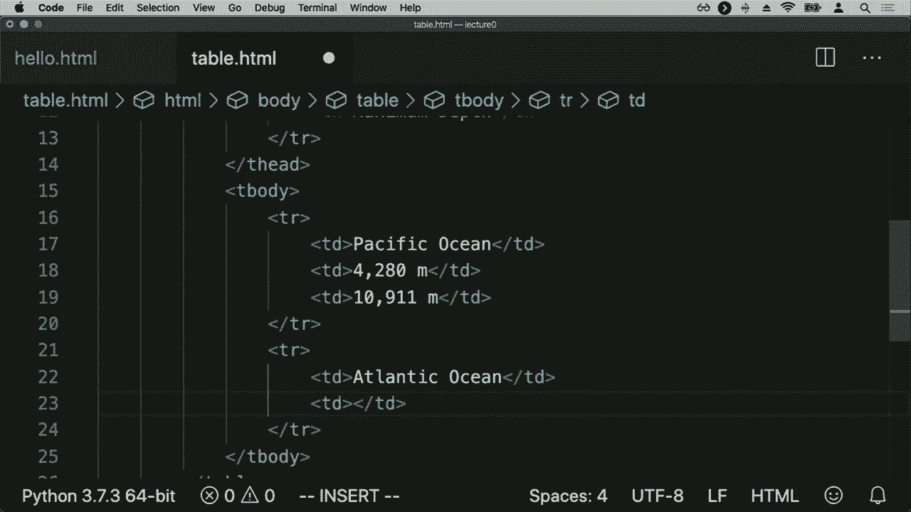

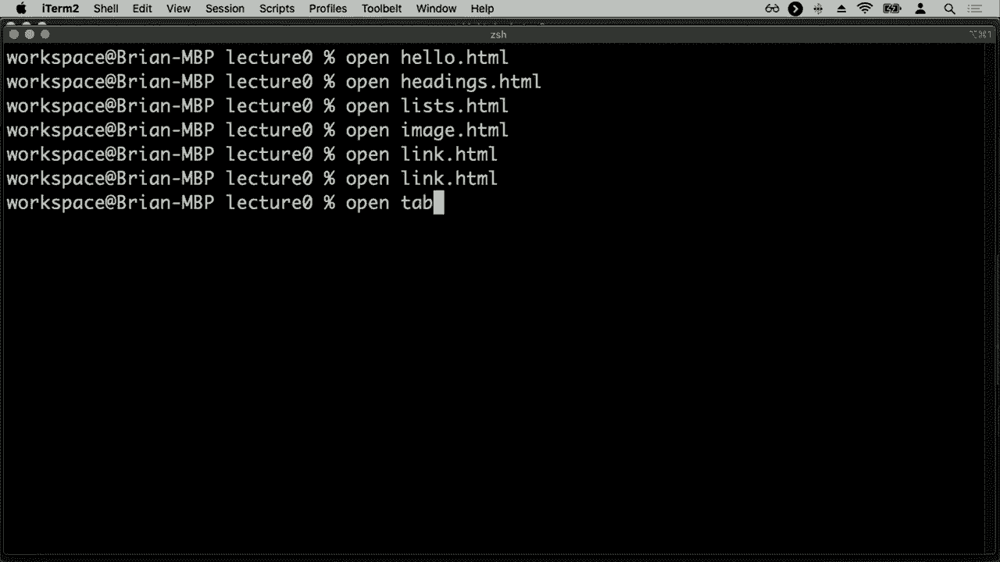

### 链接 (Links)

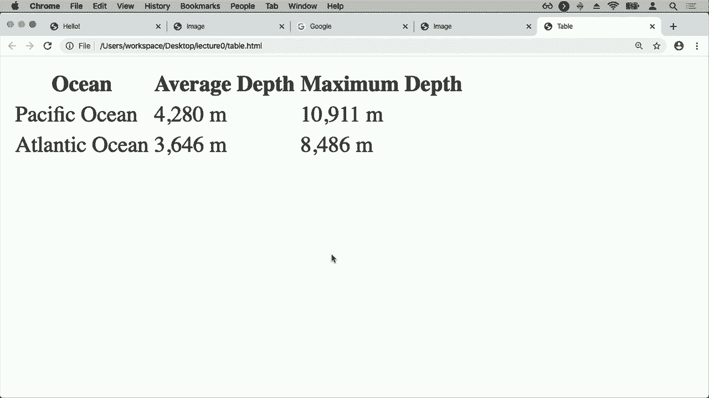

使用 `<a>`（锚点）标签创建超链接。最重要的属性是 `href`（超链接引用），它指定链接的目标地址。

```html
<!-- 链接到外部网站 -->
<a href="http://google.com">点击这里去Google</a>

<!-- 链接到同一网站内的其他页面 -->
<a href="image.html">查看猫咪图片</a>
```

### 表格 (Tables)

表格用于以行和列的形式展示数据。创建表格涉及多个标签：
*   `<table>`: 定义整个表格。
*   `<thead>`: 定义表格的标题部分。
*   `<tbody>`: 定义表格的主体部分。
*   `<tr>`: 定义表格中的一行。
*   `<th>`: 定义标题单元格（通常位于 `<thead>` 内，会加粗显示）。
*   `<td>`: 定义标准数据单元格。

```html
<table>
    <thead>
        <tr>
            <th>海洋</th>
            <th>平均深度 (米)</th>
            <th>最大深度 (米)</th>
        </tr>
    </thead>
    <tbody>
        <tr>
            <td>太平洋</td>
            <td>4280</td>
            <td>19110</td>
        </tr>
        <tr>
            <td>大西洋</td>
            <td>3646</td>
            <td>8486</td>
        </tr>
    </tbody>
</table>
```

### 表单 (Forms)

表单允许用户向网页提供输入。使用 `<form>` 标签定义表单，内部包含各种输入元素 (`<input>`)。
*   `<input>` 的 `type` 属性决定了输入框的类型（如文本、密码、提交按钮）。
*   `placeholder` 属性提供输入框内的提示文本。
*   `name` 属性用于在提交表单后识别不同的输入字段。

```html
<form>
    <input type="text" placeholder="全名" name="name">
    <input type="submit" value="提交">
</form>
```

HTML5 提供了更丰富的输入类型和控件：

```html
<!-- 密码框（隐藏输入字符） -->
<input type="password" placeholder="密码" name="password">

<!-- 单选按钮 -->
<input type="radio" name="color" value="red"> 红色
<input type="radio" name="color" value="blue"> 蓝色

<!-- 带数据列表的输入框（提供选项供选择或自动完成） -->
<input type="text" list="countries" placeholder="选择国家" name="country">
<datalist id="countries">
    <option value="中国">
    <option value="美国">
    <option value="英国">
    <!-- 更多选项... -->
</datalist>
```

---

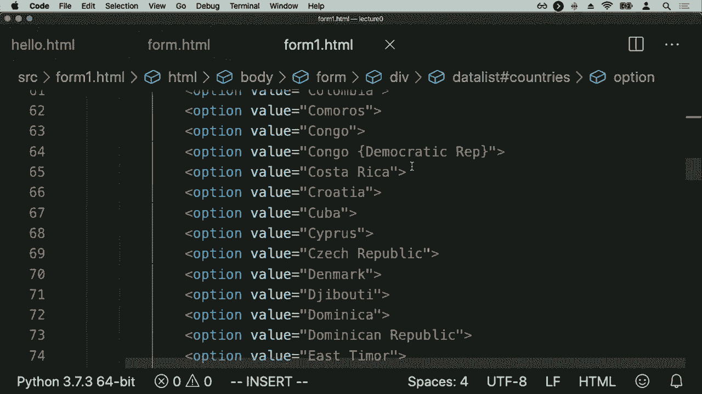

## 总结

在本节课中，我们一起学习了网页编程的起点——HTML。

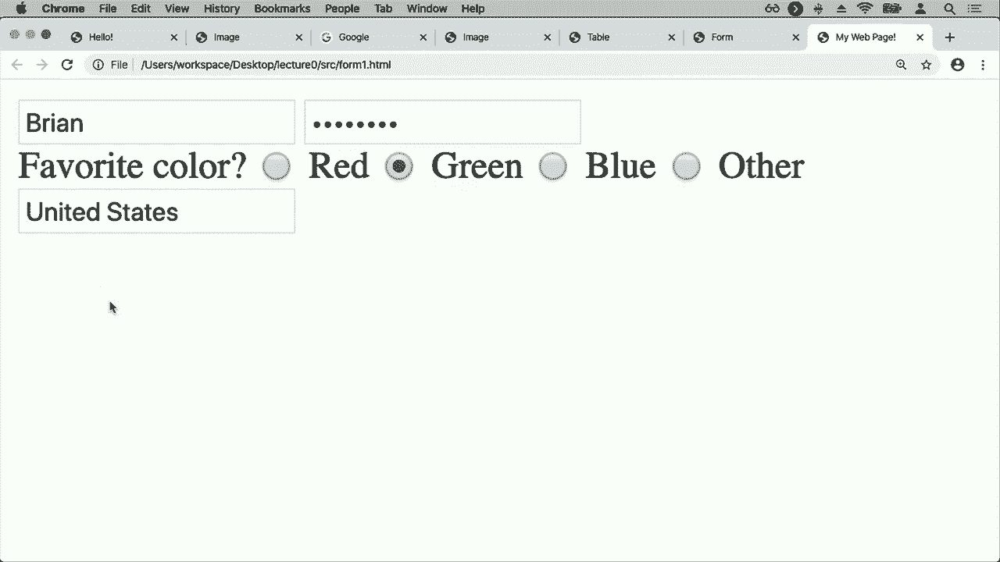

我们了解了HTML是一种用于描述网页结构的标记语言，并探索了其基本语法和常见元素，包括标题、列表、图像、链接、表格和表单。我们还认识了文档对象模型(DOM)的概念，它帮助我们将HTML页面理解为一个树状结构。

记住，构建网页就是将这些HTML元素像搭积木一样组合和嵌套起来。虽然我们现在创建的表单还不会“做事情”（比如保存数据），但在后续课程中，当我们学习Python和JavaScript后，就能让网页真正动起来，与用户进行交互。

下一节，我们将开始学习CSS，看看如何为这些HTML骨架添加色彩、布局和样式，让我们的网页变得美观。