# 哈佛 CS50-WEB ｜ 基于Python / JavaScript的Web编程(2020·完整版) - P22：L7- 测试与前端CI/CD 2 (selenium，CI/CD) 🧪

在本节课中，我们将要学习如何为Web应用程序编写自动化测试，特别是使用Django的测试框架和Selenium进行浏览器端测试。我们还将探讨持续集成（CI）和持续交付/部署（CD）的核心概念，了解它们如何帮助团队更高效、更可靠地开发和发布软件。

## 概述：为何需要自动化测试？ 🤔

上一节我们介绍了单元测试的基本概念，用于验证单个函数（如`is_prime`）的行为。本节中，我们来看看如何将这些测试思想应用于更复杂的Web应用程序，例如使用Django框架构建的网站。我们将测试模型功能、视图响应，甚至模拟用户在浏览器中的交互行为。

## 第一部分：测试Django应用程序 🐍

我们现在希望使用单元测试来验证Django网络应用程序中各种不同功能是否正常工作。让我们以之前讨论过的“航空公司”程序为例，该程序涉及将航班数据存储在数据库中。

### 1.1 定义模型与验证逻辑

首先，我们打开`models.py`文件，查看`Flight`模型。我们为航班定义了三个属性：出发地（`origin`）、目的地（`destination`）和持续时间（`duration`）。出发地和目的地都引用了另一个模型`Airport`。

我们希望有一种方法来验证航班数据是否有效。一个有效的航班需要满足两个条件：
1.  出发地和目的地不应该是同一个机场。
2.  航班的持续时间需要大于零。

我们在`Flight`类中编写了一个名为`is_valid_flight`的函数来实现这个验证逻辑。其核心检查代码如下：

```python
def is_valid_flight(self):
    return (self.origin != self.destination) and (self.duration > 0)
```

### 1.2 使用Django的测试框架

Django应用程序提供了一个`tests.py`文件，专门用于编写测试。我们可以定义一个继承自`TestCase`的类来组织我们的测试。

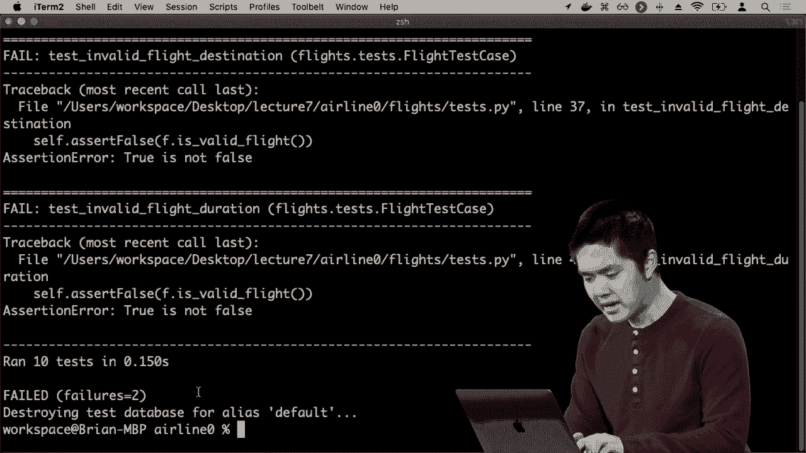

在运行测试时，Django会为我们创建一个完全独立的测试数据库，不会影响生产环境的数据。我们可以在测试类的`setUp`方法中初始化一些测试数据。

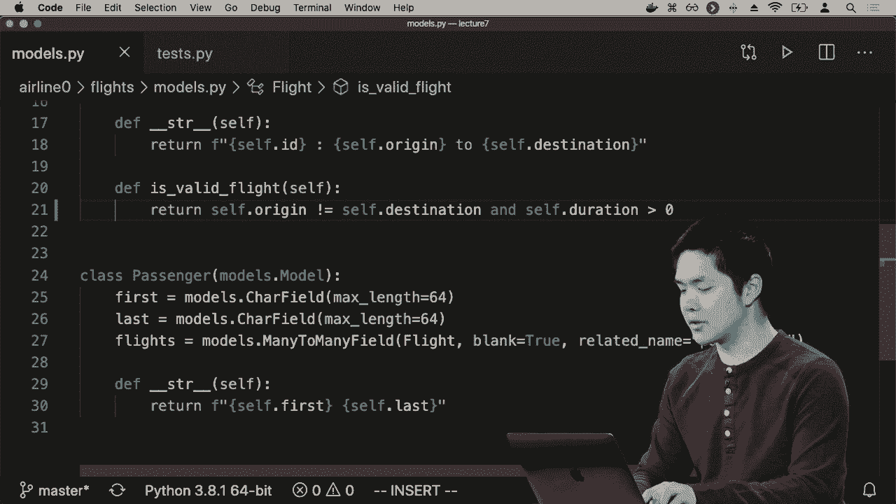

以下是创建测试数据和测试`is_valid_flight`函数的示例：

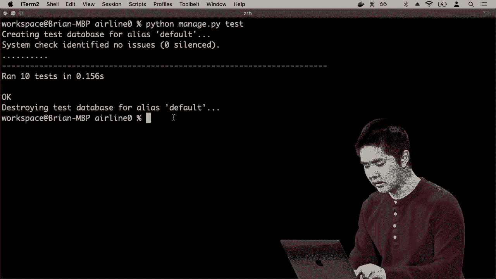

```python
from django.test import TestCase
from .models import Airport, Flight

class FlightTestCase(TestCase):
    def setUp(self):
        # 创建测试用的机场和航班
        a1 = Airport.objects.create(code="AAA", city="City A")
        a2 = Airport.objects.create(code="BBB", city="City B")
        Flight.objects.create(origin=a1, destination=a2, duration=100)
        Flight.objects.create(origin=a1, destination=a1, duration=200)
        Flight.objects.create(origin=a1, destination=a2, duration=-100)

    def test_valid_flight(self):
        a1 = Airport.objects.get(code="AAA")
        a2 = Airport.objects.get(code="BBB")
        f = Flight.objects.get(origin=a1, destination=a2, duration=100)
        self.assertTrue(f.is_valid_flight())

    def test_invalid_flight_destination(self):
        a1 = Airport.objects.get(code="AAA")
        f = Flight.objects.get(origin=a1, destination=a1)
        self.assertFalse(f.is_valid_flight())

    def test_invalid_flight_duration(self):
        a1 = Airport.objects.get(code="AAA")
        a2 = Airport.objects.get(code="BBB")
        f = Flight.objects.get(origin=a1, destination=a2, duration=-100)
        self.assertFalse(f.is_valid_flight())
```

我们可以通过运行`python manage.py test`命令来执行所有测试。如果测试失败，输出会明确指出是哪个断言出了问题，帮助我们快速定位和修复代码中的逻辑错误（例如，最初错误地使用了`or`而不是`and`）。

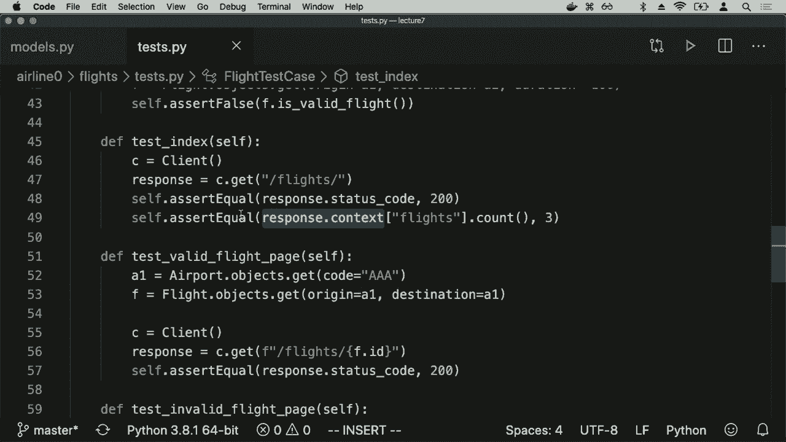

### 1.3 测试视图与HTTP响应

除了测试模型，我们还需要测试特定的网页是否按预期工作。Django的测试客户端允许我们模拟向应用程序发出请求并检查响应。

以下是测试航班列表页（index）和详情页的示例：

```python
def test_index(self):
    # 创建一个测试客户端
    c = Client()
    # 模拟用户访问 /flights 页面
    response = c.get("/flights/")
    # 断言响应状态码是200（成功）
    self.assertEqual(response.status_code, 200)
    # 断言响应上下文中包含3个航班（与setUp中创建的数量一致）
    self.assertEqual(response.context["flights"].count(), 3)

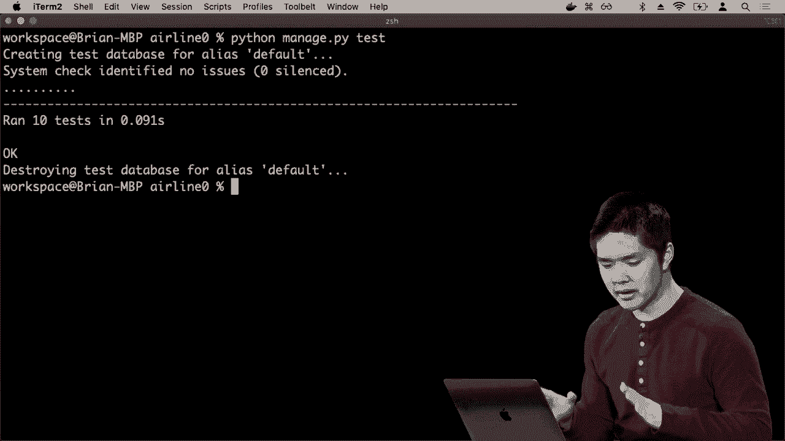

def test_valid_flight_page(self):
    a1 = Airport.objects.get(code="AAA")
    f = Flight.objects.get(origin=a1, destination=a1)
    c = Client()
    # 访问一个存在的航班页面
    response = c.get(f"/flights/{f.id}")
    self.assertEqual(response.status_code, 200)

def test_invalid_flight_page(self):
    # 获取当前最大的航班ID
    max_id = Flight.objects.all().aggregate(Max("id"))["id__max"]
    c = Client()
    # 访问一个不存在的航班页面，应返回404
    response = c.get(f"/flights/{max_id + 1}")
    self.assertEqual(response.status_code, 404)
```

通过这种方式，我们可以确保应用程序的各个部分，从数据库逻辑到用户界面，都按照我们的设计正常运行。

## 第二部分：使用Selenium进行浏览器测试 🌐

上一节我们测试了服务器端的逻辑。但现代Web应用有很多交互发生在用户的浏览器中，使用JavaScript。为了测试这部分功能，我们需要能模拟浏览器行为的工具，Selenium就是其中最流行的框架之一。

### 2.1 一个简单的计数器应用

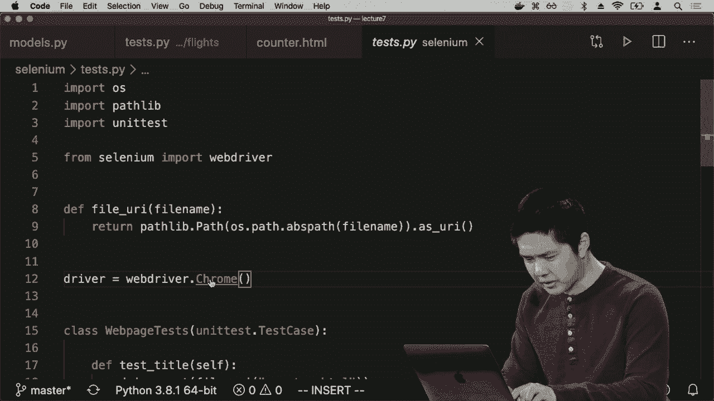

假设我们有一个简单的HTML页面，包含一个显示数字的标题和“增加”、“减少”两个按钮，其功能由JavaScript实现。

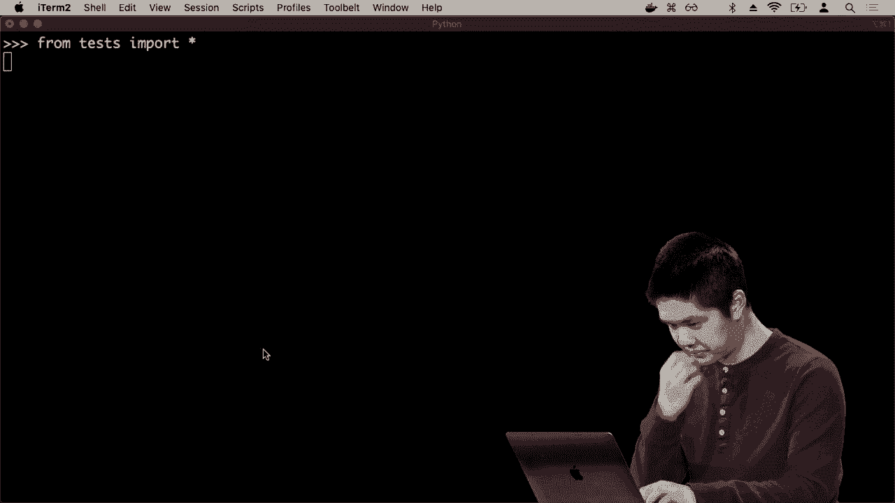

```html
<!DOCTYPE html>
<html>
<head>
    <title>Counter</title>
    <script>
        document.addEventListener('DOMContentLoaded', function() {
            let counter = 0;
            document.querySelector('#increase').onclick = function() {
                counter++;
                document.querySelector('h1').innerHTML = counter;
            };
            document.querySelector('#decrease').onclick = function() {
                counter--;
                document.querySelector('h1').innerHTML = counter;
            };
        });
    </script>
</head>
<body>
    <h1>0</h1>
    <button id="increase">+</button>
    <button id="decrease">-</button>
</body>
</html>
```

### 2.2 使用Selenium WebDriver自动化交互

Selenium WebDriver允许我们用代码（如Python）控制一个真实的浏览器。我们可以命令它打开网页、查找元素、点击按钮，并检查页面的状态。

以下是使用Selenium编写测试的步骤：

1.  **设置WebDriver**：需要下载与浏览器对应的WebDriver（如ChromeDriver）。
2.  **编写测试**：使用`unittest`框架组织测试，在测试方法中使用Selenium的API。

```python
import unittest
from selenium import webdriver
from selenium.webdriver.common.by import By

class CounterTest(unittest.TestCase):
    def setUp(self):
        # 启动Chrome浏览器驱动
        self.driver = webdriver.Chrome()
        # 构建本地HTML文件的URL
        self.uri = "file://" + os.path.abspath("counter.html")
        self.driver.get(self.uri)

    def tearDown(self):
        # 每个测试结束后关闭浏览器
        self.driver.quit()

    def test_title(self):
        # 测试页面标题是否正确
        self.assertEqual(self.driver.title, "Counter")

    def test_increase(self):
        # 找到“增加”按钮并点击
        increase_button = self.driver.find_element(By.ID, "increase")
        increase_button.click()
        # 检查h1标签中的数字是否变为1
        h1 = self.driver.find_element(By.TAG_NAME, "h1")
        self.assertEqual(h1.text, "1")

    def test_decrease(self):
        # 找到“减少”按钮并点击
        decrease_button = self.driver.find_element(By.ID, "decrease")
        decrease_button.click()
        # 检查h1标签中的数字是否变为-1
        h1 = self.driver.find_element(By.TAG_NAME, "h1")
        self.assertEqual(h1.text, "-1")

    def test_multiple_increases(self):
        increase_button = self.driver.find_element(By.ID, "increase")
        for i in range(3):
            increase_button.click()
        h1 = self.driver.find_element(By.TAG_NAME, "h1")
        self.assertEqual(h1.text, "3")
```

运行这些测试时，Selenium会自动打开浏览器窗口，执行点击操作，并验证结果。如果测试失败（例如，减少按钮的JavaScript有bug，导致数字增加而非减少），断言错误信息会清晰地指出期望值和实际值，帮助我们快速定位问题。

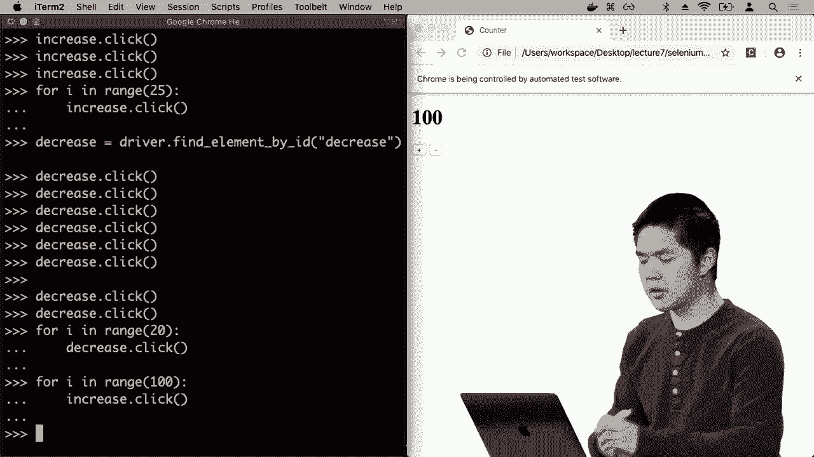

## 第三部分：持续集成与持续交付/部署 (CI/CD) 🔄

在编写了全面的测试之后，如何确保它们在团队开发过程中始终有效，并安全地将代码交付给用户？这就需要CI/CD实践。

### 3.1 持续集成 (Continuous Integration)

持续集成的核心思想是：
*   **频繁合并**：开发者频繁地将代码更改合并到主分支（如Git仓库的main分支），避免长期分支导致的复杂合并冲突。
*   **自动化测试**：每次代码推送或合并请求时，自动运行测试套件（包括单元测试、集成测试等）。如果测试失败，则阻止合并，要求开发者立即修复。

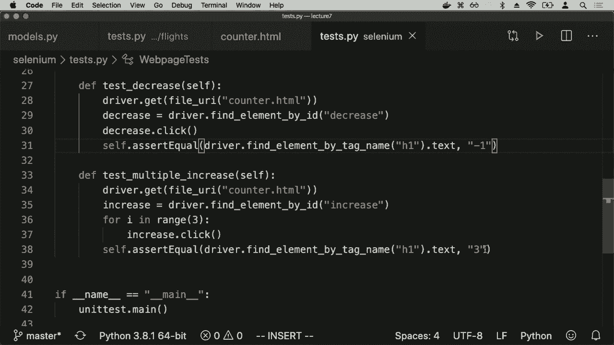

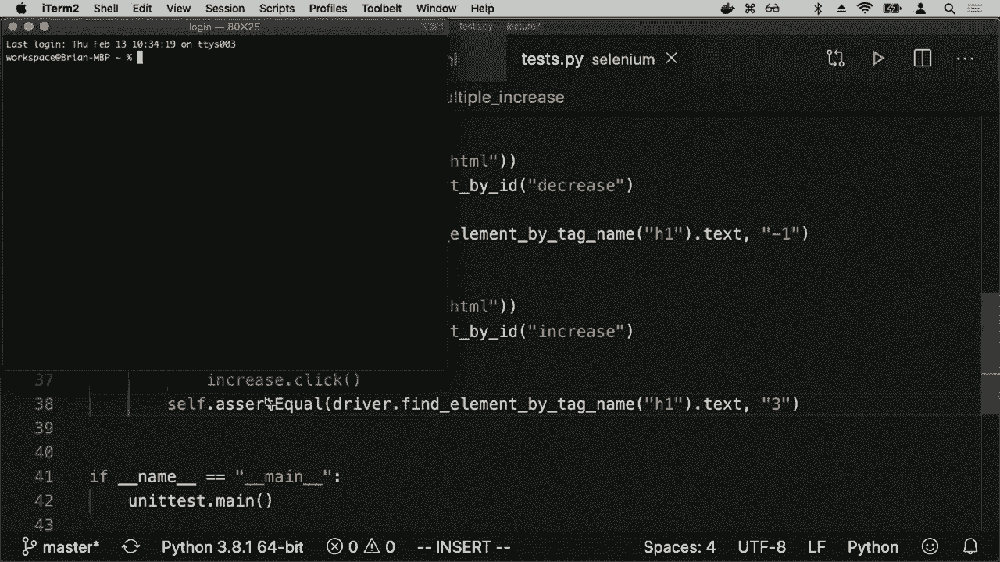

这样做的好处是能快速发现因代码更改引入的错误，而不是等到开发周期末尾才进行集成测试，那时定位问题将非常困难。

### 3.2 持续交付与持续部署 (Continuous Delivery/Deployment)

这是两个紧密相关的概念：
*   **持续交付 (CD)**：指拥有短的发布周期，能够可靠地将软件的任何新版本快速交付给用户。它强调每次通过测试的代码更改都可以随时投入生产环境。
*   **持续部署 (CD)**：是持续交付的更进一步，指通过自动化流程，将通过测试的代码更改**自动**部署到生产环境，无需人工干预。

采用CI/CD的好处包括：
*   **快速反馈**：问题能更早被发现和修复。
*   **降低风险**：小批量的增量更改比一次性的大改动更容易管理和回滚。
*   **加速发布**：新功能可以更快地到达用户手中。

### 3.3 实现CI/CD的工具

市场上有许多工具可以帮助实现CI/CD流水线，例如：
*   **Jenkins**：一个开源的自动化服务器，功能强大，插件丰富。
*   **GitHub Actions**：直接集成在GitHub仓库中，可以轻松配置在代码推送、拉取请求等事件发生时自动运行测试和部署脚本。
*   **GitLab CI/CD**：GitLab内置的持续集成服务。
*   **Travis CI, CircleCI**：流行的第三方云CI/CD服务。

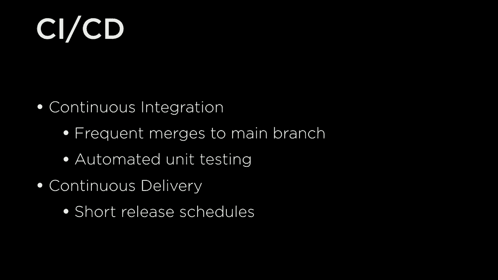

这些工具通常允许你编写一个配置文件（如`.github/workflows/main.yml` for GitHub Actions），定义在什么条件下触发、运行哪些步骤（如安装依赖、运行测试、构建应用、部署到服务器）。

## 总结 📝

本节课中我们一起学习了Web应用程序测试与CI/CD的完整流程。

首先，我们深入探讨了如何为Django应用程序编写测试，包括测试模型中的业务逻辑（如`is_valid_flight`）和使用测试客户端测试视图的HTTP响应。这确保了服务器端代码的健壮性。

接着，我们引入了Selenium，这是一个强大的浏览器自动化工具。我们学习了如何用它来模拟真实用户的交互，例如点击按钮，并验证前端JavaScript代码的行为是否符合预期。这使得我们对应用程序端到端的功能有了信心。

最后，我们探讨了持续集成（CI）和持续交付/部署（CD）的理念。CI强调通过频繁集成和自动化测试来保证代码质量；CD则关注如何将这些高质量的更改快速、安全地交付给最终用户。结合使用测试框架和CI/CD工具，可以构建一个高效、可靠且迭代迅速的现代软件开发流程。

通过本课的学习，你应该能够为自己的项目建立一套从代码验证到自动发布的防护网，显著提升开发效率和软件质量。