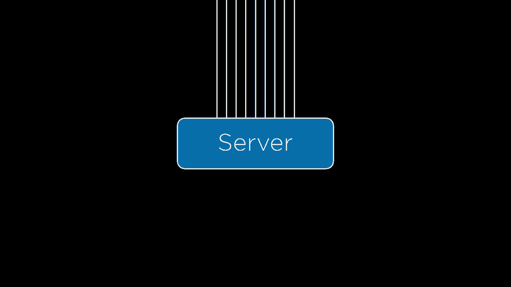
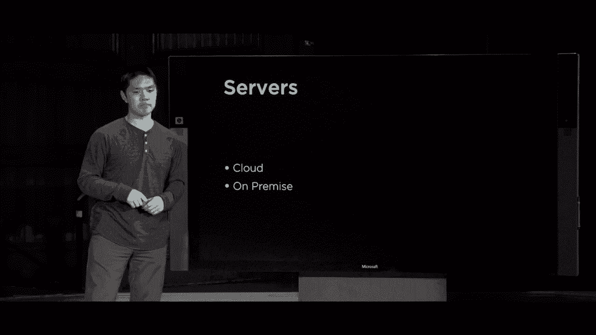
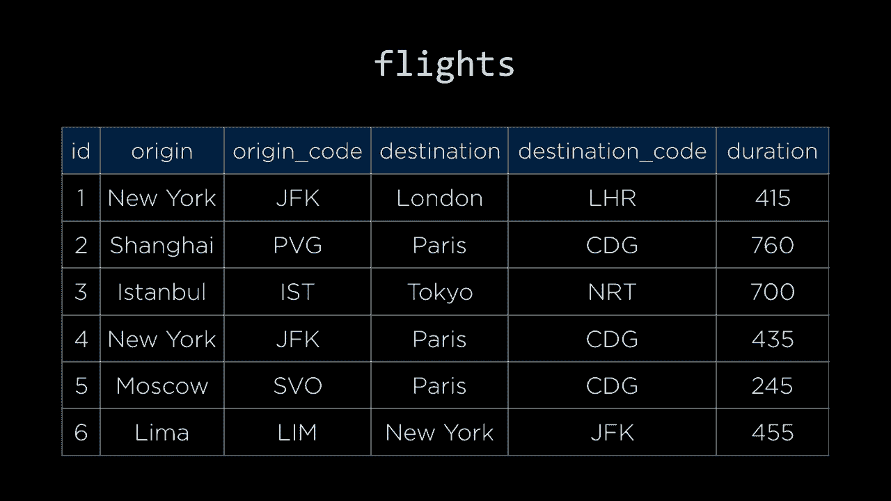

# 哈佛 CS50-WEB ｜ 基于Python / JavaScript的Web编程(2020·完整版) - P24：L8- 拓展性与安全 1 (可扩展性，负载均衡，自动伸缩) 🚀




在本节课中，我们将要学习如何将我们构建的Web应用程序从本地计算机部署到互联网上，并探讨随之而来的可扩展性与安全性问题。我们将首先聚焦于可扩展性，了解当用户数量增长时，如何确保应用程序能够稳定、高效地运行。


## 概述：从本地到全球 🌍

到目前为止，我们一直在自己的计算机上构建和运行Web应用程序。但如果想让全世界的人都能使用我们的应用，就需要将其部署到**Web服务器**上。Web服务器是一种专用硬件，能够监听网络请求并返回响应。



将应用部署到服务器上，会引入一系列关于可扩展性和安全性的新挑战。本节课，我们将首先探讨可扩展性相关的问题及其解决方案。

## 服务器部署：本地与云端 ☁️

服务器主要有两种部署方式：**本地服务器**和**云端服务器**。

*   **本地服务器**：指公司内部拥有并维护的物理服务器。这种方式能提供对硬件的直接控制，但需要自行承担维护和扩展的责任。
*   **云端服务器**：指由亚马逊、谷歌、微软等云服务商提供的远程服务器。这种方式无需管理物理硬件，由服务商负责基础设施的维护，并且通常能提供更便捷的扩展能力。

随着云计算的发展，越来越多的应用选择部署在云端，以便利用其强大的可扩展性。

## 可扩展性的挑战：单台服务器的极限 ⚖️

一台服务器在任何给定时间内能服务的用户数量是有限的。这个上限取决于服务器的计算能力、内存、网络带宽等资源，以及处理单个请求的复杂度。

为了评估服务器的处理能力，我们需要进行**基准测试**。例如，可以使用 `Apache Bench (ab)` 这样的工具来测试服务器在单位时间内能处理多少请求。

```bash
# 示例：使用 Apache Bench 对本地服务器进行压力测试
ab -n 1000 -c 100 http://localhost:8000/
```

*   `-n 1000` 表示总请求数。
*   `-c 100` 表示并发用户数。

当并发用户数超过服务器的处理上限时，应用就会变慢甚至崩溃。为了解决这个问题，我们需要对系统进行**扩展**。

## 扩展策略：垂直扩展与水平扩展 📈

主要有两种扩展策略：

1.  **垂直扩展 (Scale Up)**：通过升级单台服务器的硬件（如更快的CPU、更大的内存）来提升其处理能力。这种方法简单直接，但受物理极限和成本的制约。
2.  **水平扩展 (Scale Out)**：通过增加服务器的数量来分担负载。例如，从一台服务器扩展到两台，理论上处理能力就能翻倍。这是应对大规模用户访问的更常用方法。

上一节我们介绍了扩展的必要性，本节中我们来看看水平扩展的核心组件——负载均衡器。

## 负载均衡器：流量调度员 🚦

当有多台服务器时，需要一个机制来决定将每个用户请求分发到哪台服务器。这个角色由**负载均衡器**承担。

负载均衡器位于所有服务器之前。用户的请求首先到达负载均衡器，然后由它决定将请求转发给后端的哪台服务器进行处理。

负载均衡器可以采用不同的算法来决定请求的分发：

以下是几种常见的负载均衡算法：

*   **随机选择**：简单地将请求随机分配给任意一台服务器。实现简单，但可能导致负载分配不均。
*   **轮询**：按顺序将请求依次分配给每台服务器（如 Server1, Server2, Server3, 再回到 Server1...）。比随机更公平，但未考虑服务器当前的实际负载。
*   **最少连接数**：将新请求分配给当前活动连接数最少的服务器。这种方法能更好地反映服务器的实时负载情况，但计算成本稍高。

## 会话感知：记住用户是谁 🧠

水平扩展带来了一个新问题：**会话保持**。Web应用通常使用会话来跟踪用户状态（例如登录信息）。如果用户第一次请求被发到 Server A 并建立了会话，但第二次请求被负载均衡器发到了 Server B，那么 Server B 无法识别该用户，导致用户需要重新登录。

为了解决这个问题，我们需要**会话感知**的负载均衡。主要有以下方法：

以下是几种实现会话感知的策略：

*   **粘性会话**：负载均衡器记录用户首次访问时被分配到的服务器，并在后续请求中始终将同一用户指向那台服务器。缺点是可能导致服务器间负载不均衡。
*   **集中式会话存储**：不将会话数据存储在单台服务器上，而是存储在一个所有服务器都能访问的**中央数据库**（如 Redis）中。这样无论请求被发到哪台服务器，都能获取到会话信息。
*   **客户端会话存储**：将会话数据加密后存储在客户端的 **Cookie** 中。这种方式无需服务器存储状态，但增加了网络传输开销，并需注意安全性（防篡改）。

## 自动伸缩：弹性应对流量波动 📊

我们很难精确预测在任何时刻会有多少用户访问应用。流量可能随时波动（例如新闻网站遇到突发新闻时）。如果始终按最大流量配置服务器，在低峰期会造成资源浪费。



**自动伸缩** 是云平台提供的一种解决方案。它可以监控应用的负载指标（如CPU使用率、请求数量），并自动增加或减少服务器实例的数量。

例如，可以配置规则：当平均CPU使用率超过70%时，自动增加一台服务器；当低于30%时，减少一台服务器。这样既能应对流量高峰，又能在平时节约成本。

## 避免单点故障：高可用性设计 🛡️

在分布式系统中，需要避免**单点故障**——即某个关键组件失效导致整个系统瘫痪。

*   **服务器层**：使用多台服务器和负载均衡器，当一台服务器宕机时，负载均衡器可以通过**心跳检测**（定期向服务器发送健康检查请求）发现故障，并不再向其分发流量。
*   **负载均衡器层**：负载均衡器本身也可能成为单点故障。解决方案是部署多个负载均衡器，形成主备或集群模式，当一个失效时，另一个能立即接管。
*   **数据库层**：数据库也是关键的单点。我们可以通过**数据库复制**来提升可用性。

## 数据库的可扩展性 🗃️

随着应用规模增长，数据库也可能成为瓶颈。除了升级数据库服务器硬件（垂直扩展），我们还可以采用以下策略：

1.  **数据库分区**：
    *   **垂直分区**：将一个包含多列的大表拆分成多个关联的小表（即数据库规范化）。例如，将用户信息和登录凭证分表存储。
    *   **水平分区/分片**：将同一个表的数据按某种规则（如用户ID范围、地域）拆分到多个结构相同的表中。例如，将用户表按注册年份分表。

2.  **数据库复制**：
    *   **主从复制**：设置一个**主数据库**负责处理所有写入操作，多个**从数据库**同步主库的数据并负责读取操作。这提升了读性能，但写入仍集中在主库，且主库是单点故障。
    *   **多主复制**：多个数据库都可以处理读写操作，并相互同步数据。这提升了写能力和可用性，但带来了数据同步冲突的复杂性（如更新冲突、唯一键冲突），需要额外的冲突解决机制。

3.  **缓存**：对于不经常变化但访问频繁的数据（如新闻网站首页），可以将其查询结果存储在 **Redis** 或 **Memcached** 等内存缓存中。后续请求可以直接从缓存读取，极大减轻数据库压力。

```python
# 伪代码示例：使用缓存获取首页文章
def get_homepage_articles():
    cache_key = "homepage_articles"
    articles = cache.get(cache_key) # 首先尝试从缓存获取
    if articles is None:
        articles = db.query("SELECT * FROM articles ORDER BY publish_time DESC LIMIT 10") # 缓存未命中，查询数据库
        cache.set(cache_key, articles, timeout=300) # 将结果存入缓存，有效期300秒
    return articles
```

## 总结 🎯

本节课中我们一起学习了Web应用可扩展性的核心概念。我们了解到，当用户量增长时，可以通过**水平扩展**增加服务器数量，并使用**负载均衡器**分发流量。为了保持良好的用户体验，需要实现**会话感知**。利用云平台的**自动伸缩**功能，可以弹性应对流量变化。设计系统时，要时刻注意避免**单点故障**，并通过**数据库分区、复制和缓存**等策略来提升数据层的性能和可靠性。这些策略各有权衡，需要根据应用的具体需求进行选择和设计。