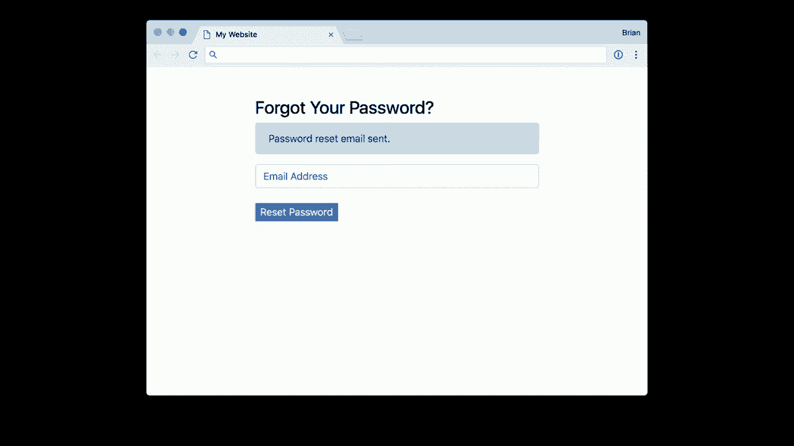
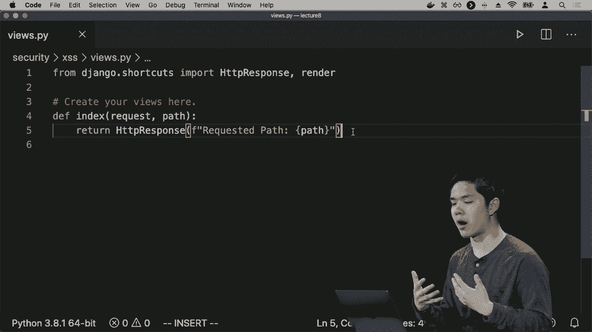
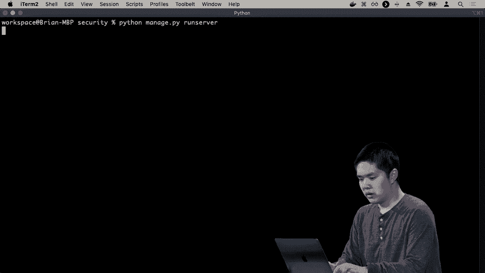
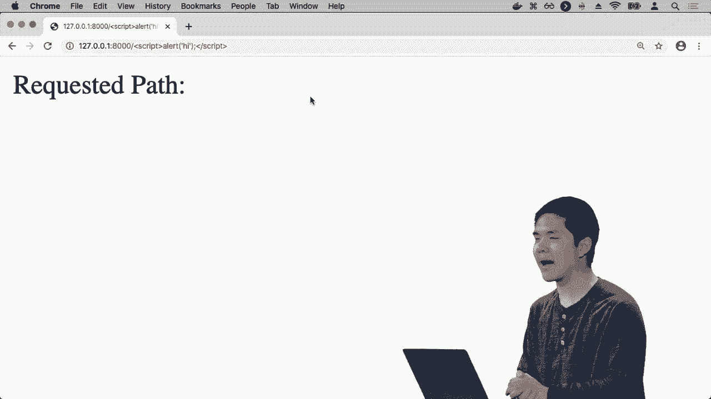

# 哈佛 CS50-WEB ｜ 基于Python / JavaScript的Web编程(2020·完整版) - P26：L8- 拓展性与安全 3 (数据库，JS) 🛡️

在本节课中，我们将要学习Web应用开发中与数据库和JavaScript相关的核心安全概念。我们将探讨如何安全地存储用户数据，以及如何防范常见的网络攻击，如SQL注入和跨站脚本攻击。

## 概述

我们将从数据库安全开始，讨论密码存储的最佳实践。接着，我们会分析JavaScript运行环境带来的安全挑战，并学习如何保护我们的应用免受恶意代码的侵害。理解这些概念对于构建健壮、可信赖的Web应用至关重要。

---

## 数据库安全：密码存储 🔐



上一节我们介绍了服务器端的安全考量，本节中我们来看看如何安全地在数据库中处理用户凭证。

将密码以明文形式存储在数据库中是非常不安全的做法。明文存储意味着密码以其原始文本形式直接保存在数据库中。

**不安全示例（伪代码）**：
```sql
CREATE TABLE users (
    id INT,
    username VARCHAR(255),
    password VARCHAR(255) -- 明文存储密码
);
```

这种做法存在严重的安全漏洞。如果数据库因某种原因泄露，攻击者就能直接获取所有用户的密码。

因此，推荐的方法是存储密码的哈希版本，而不是实际的密码。哈希函数是一种单向加密函数，它将密码作为输入，并输出一个固定长度的字符串（哈希值）。

**核心概念**：
*   **哈希函数**：一个数学函数，满足 `哈希值 = H(密码)`。
*   **单向性**：从哈希值反向推导出原始密码在计算上是极其困难的。

这意味着应用本身并不知道用户的真实密码。当用户尝试登录时，系统会对用户输入的密码进行哈希计算，然后将得到的哈希值与数据库中存储的哈希值进行比较。

**登录验证流程**：
1.  用户输入密码。
2.  系统计算 `输入哈希 = H(用户输入)`。
3.  系统从数据库读取 `存储哈希`。
4.  比较 `输入哈希 == 存储哈希`。若相等，则登录成功。


正因为如此，遵循最佳实践的公司无法告知用户其密码是什么。如果用户忘记密码，公司只能提供“重置密码”的功能，而无法“找回密码”。

---

## 信息泄露与用户隐私 🕵️

在设计用户交互功能时，需要注意避免无意中泄露敏感信息。

例如，在“忘记密码”页面，如果用户输入一个不存在的邮箱，系统返回“该邮箱未注册”的错误信息，这就会泄露信息。攻击者可以通过尝试不同的邮箱地址，来探测哪些用户在网站上拥有账户。

以下是需要注意的潜在信息泄露点：

*   **错误信息**：过于详细的错误信息（如“用户名不存在”与“密码错误”）可能被用来枚举有效用户。
*   **响应时间**：数据库查询的响应时间差异可能间接泄露信息（例如，查询一个拥有大量数据的用户可能比查询新用户更慢）。

开发者需要根据应用的安全需求，决定是否隐藏这类信息，以保护用户隐私。

---

## SQL注入攻击 💉

处理SQL时，另一个重大安全威胁是SQL注入。这种攻击发生在攻击者能够将恶意的SQL代码“注入”到应用程序的数据库查询中。





假设一个登录查询如下：
```sql
SELECT * FROM users WHERE username = ‘[用户输入]’ AND password = ‘[用户输入]’;
```

如果用户输入普通的用户名和密码，例如 `harry` 和 `12345`，查询会正常工作。
```sql
SELECT * FROM users WHERE username = ‘harry’ AND password = ‘12345’;
```



然而，如果攻击者输入 `admin’--` 作为用户名，并将密码字段留空，查询就会变成：
```sql
SELECT * FROM users WHERE username = ‘admin’--’ AND password = ‘’;
```
在SQL中，`--` 是注释符号，这意味着其后的所有内容（包括密码检查）都会被数据库忽略。这可能导致攻击者无需密码就能以管理员身份登录。

**解决方案**：使用参数化查询或ORM（对象关系映射）。这些技术能确保用户输入被当作数据处理，而非可执行的SQL代码。

在Django框架中，使用其内置的ORM（例如 `User.objects.filter(username=username)`）可以自动防止SQL注入攻击。

---

## API 安全与最佳实践 🔑

当我们讨论与其他服务器交互（如调用API）时，也需要考虑安全性和可扩展性。

以下是保护API的两种常见技术：

*   **速率限制**：限制单个用户或IP地址在特定时间窗口内可发出的请求数量。这有助于防止拒绝服务攻击，即攻击者通过海量请求使服务器瘫痪。
*   **身份验证**：使用API密钥等凭证来验证请求者的身份。这确保只有授权用户才能访问特定数据。

**重要警告**：绝对不要将API密钥等敏感信息硬编码在源代码中（尤其是提交到Git等版本控制系统）。否则，任何能访问代码的人都能窃取并使用该密钥。

**安全实践**：使用环境变量来存储敏感信息。这样，密钥被保存在运行应用程序的服务器环境中，而不是在代码文件里。

**示例（Python中获取环境变量）**：
```python
import os
api_key = os.environ.get(“MY_API_KEY”)
```

---

## JavaScript 安全：跨站脚本攻击 🚨

JavaScript在浏览器中运行，拥有强大的能力来操控网页内容。这也带来了独特的安全挑战，最主要的是跨站脚本攻击。

XSS攻击允许攻击者将恶意JavaScript代码注入到其他用户浏览的网页中。这些代码不是开发者编写的，却能在受害者的浏览器中执行。

**一个简单示例**：
假设一个网页显示URL中的路径：`https://example.com/page?msg=<script>alert(‘Hacked!’)</script>`
如果应用没有正确处理输入，直接将其插入到HTML中，那么 `<script>alert(‘Hacked!’)</script>` 就会被浏览器当作JavaScript代码执行，弹出一个警告框。

这不仅仅是恶作剧。注入的脚本可以窃取用户的Cookie、会话令牌，篡改页面内容，或将用户重定向到恶意网站。

**防御方法**：对用户输入进行严格的过滤和转义。确保所有用户提供的数据在插入到HTML页面之前，都被当作纯文本处理，而不是可执行的代码。现代前端框架（如React, Vue）和模板引擎通常内置了XSS防护机制。

---

## 跨站请求伪造攻击 🔄

CSRF攻击诱使已登录的用户在不知情的情况下，向一个他们已认证的Web应用提交恶意请求。

**攻击场景**：
1.  用户登录了银行网站 `bank.com`。
2.  用户访问了恶意网站 `evil.com`。
3.  `evil.com` 的页面中包含一个隐藏的表单或图片，其目标指向 `bank.com/transfer?to=attacker&amount=1000`。
4.  用户的浏览器会自动携带 `bank.com` 的Cookie（登录凭证）发起这个请求。
5.  银行服务器看到合法的凭证，便执行了转账操作。

**防御方法**：使用CSRF令牌。
1.  服务器在返回表单时，生成一个随机、唯一的令牌，并将其嵌入表单中（通常是一个隐藏字段）。
2.  当用户提交表单时，必须将这个令牌一并提交。
3.  服务器验证提交的令牌是否与之前生成的匹配。
4.  由于恶意网站无法获取或预测这个令牌，因此无法伪造有效的请求。

Django等Web框架默认提供了CSRF防护中间件，极大地简化了防护工作。

---

## 总结

本节课中我们一起学习了Web应用后端与前端的关键安全议题。

我们首先探讨了数据库安全，明白了**永远不要明文存储密码**，而应存储其**哈希值**。接着，我们分析了因设计不当导致的**信息泄露**问题。

然后，我们深入研究了两种主要的代码注入攻击：**SQL注入**和**跨站脚本攻击**，并了解了通过参数化查询、输入转义等方式进行防御。

最后，我们讨论了API的**速率限制**与**认证**机制，以及如何利用**CSRF令牌**来防范跨站请求伪造攻击。

安全性是Web开发的基石。作为开发者，我们必须时刻保持警惕，在设计之初就将安全考虑融入其中，这样才能构建出既强大又值得用户信赖的应用程序。