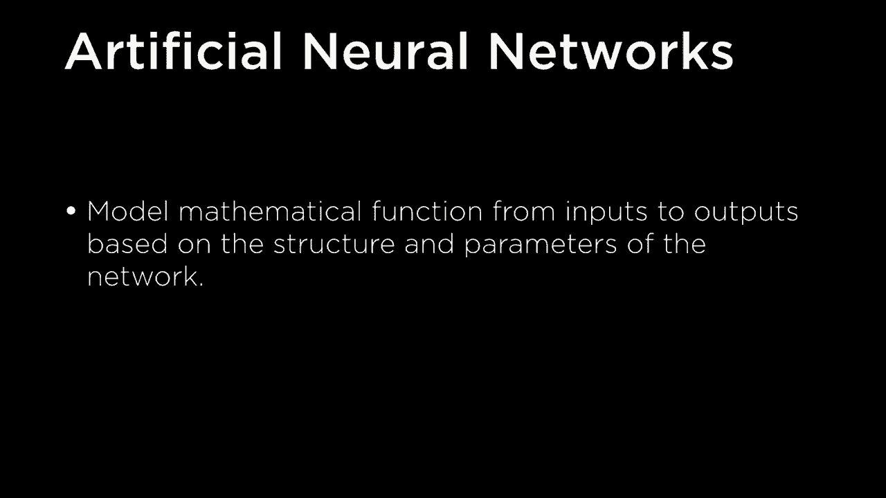
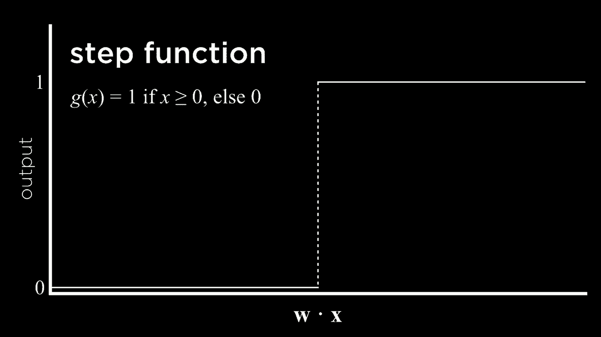
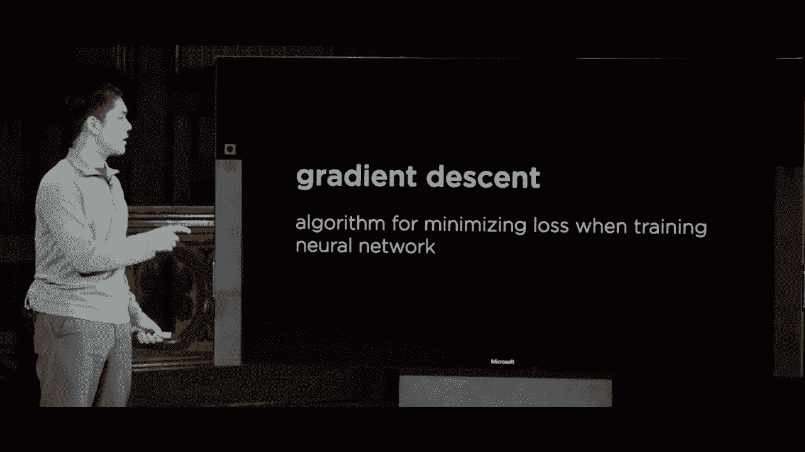
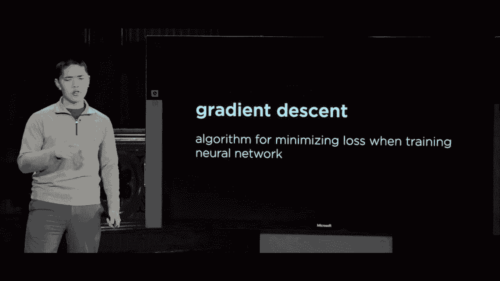

# 哈佛CS50-AI ｜ Python人工智能入门(2020·完整版) - P17：L5- 神经网络 1 (神经网络，激活函数，梯度下降，多层网络) 🧠

在本节课中，我们将要学习神经网络的基础知识。神经网络是机器学习中最流行的技术之一，它受到人类大脑结构的启发，能够学习数据中的复杂模式并执行任务。我们将从最简单的神经网络模型开始，逐步了解其核心组件，包括激活函数、梯度下降算法，以及如何通过增加网络层数来构建更强大的模型。

## 神经网络简介 🧩

上一节我们介绍了机器学习的基本概念。本节中我们来看看一种重要的机器学习模型——神经网络。

神经网络的研究始于20世纪40年代。研究人员受到人类大脑学习方式的启发，尝试将类似的原理应用于计算机，模拟计算机以人类为基础进行学习。

大脑由许多相互连接的神经元组成。神经元接收来自其他神经元的电信号，处理这些输入信号，并在被激活时向其他神经元传播信号。

基于此生物学原理，我们设计出人工神经网络。人工神经网络是一个受生物神经网络启发的数学模型。它能够模拟某种数学函数，将特定的输入映射到特定的输出。网络的结构和内部神经元的参数决定了这个函数的具体形式。

## 人工神经元与简单网络 ⚙️

为了构建人工神经网络，我们使用称为“单元”或“人工神经元”的组件。在图中，我们用一个节点（例如蓝色圆圈）来表示一个单元。这些人工神经元可以彼此连接，边表示它们之间的连接关系。

我们可以将这种连接关系视为从输入到输出的映射。例如，一个单元连接到另一个单元，我们可以将一边视为输入，另一边视为输出。我们的目标是弄清楚如何建模一个数学函数来解决特定问题。

一个常见的问题是：给定输入变量 `x1` 和 `x2`（例如湿度和气压），我们想要预测是否会下雨（一个布尔分类问题）。我们希望通过一个假设函数 `H` 来处理输入，并做出判断。

我们使用输入变量的线性组合来定义假设函数。公式如下：

`H(x) = w0 + w1*x1 + w2*x2`

在这个公式中：
*   `x1` 和 `x2` 是输入变量。
*   `w1` 和 `w2` 是权重，是与输入相乘的数字。
*   `w0` 是偏差（或偏置），用于上下移动函数的值。它有时被视为与一个固定值（如1）相乘的权重。

为了将线性组合的结果转化为分类（例如下雨或不下雨），我们需要一个**激活函数**。它决定神经元何时被“激活”并产生输出。

## 激活函数 📈

激活函数接收加权求和的结果，并产生最终的输出。

一种简单的激活函数是**阶跃函数**。它的定义是：如果输入大于等于0，则输出1；否则输出0。它在图形上表现为一条在阈值点从0跳跃到1的线。

`step(x) = 1 if x >= 0 else 0`

然而，我们有时不仅需要二元输出（0或1），还需要一个概率值。为此，我们可以使用**逻辑Sigmoid函数**。它的图形是一条S形曲线，输出值在0到1之间，可以解释为概率。

`sigmoid(x) = 1 / (1 + e^(-x))`

另一种流行的激活函数是**整流线性单元**。它的输出是输入和0之间的最大值。如果输入为正，则输出等于输入；如果输入为负或零，则输出为0。

`ReLU(x) = max(0, x)`

简而言之，激活函数 `g` 被应用于线性组合的结果 `z`（`z = w0 + w1*x1 + w2*x2`），从而得到最终输出 `output = g(z)`。这就是最简单的神经网络模型。

## 神经网络的图形表示 🖼️

我们可以用图形来表示这个数学模型。这是一个有两个输入（`x1`, `x2`）和一个输出的神经网络。

在这个结构中：
*   输入 `x1` 和 `x2` 通过带有权重（`w1`, `w2`）的边连接到输出单元。
*   输出单元计算 `z = w0 + w1*x1 + w2*x2`。
*   然后将 `z` 传递给激活函数 `g` 以产生最终输出。

这个网络的目标是学习权重 `w0`, `w1`, `w2` 和选择合适的激活函数，以便计算出我们想要的函数。

## 实例：建模逻辑函数 🔌

让我们看一个简单的例子：建模逻辑“或”函数。

“或”函数接受两个布尔输入（0或1）。只要有一个输入为1，输出就为1；仅当两个输入都为0时，输出才为0。

我们可以训练一个神经网络来学习这个函数。假设我们设置权重 `w1=1`, `w2=1`，偏差 `w0=-1`，并使用阶跃函数作为激活函数。

以下是计算过程：
*   输入 `(0, 0)`：`z = -1 + 1*0 + 1*0 = -1`。阶跃函数在 `-1` 时输出 `0`。✅
*   输入 `(1, 0)`：`z = -1 + 1*1 + 1*0 = 0`。阶跃函数在 `0` 时输出 `1`。✅
*   输入 `(0, 1)`：输出同样为 `1`。✅
*   输入 `(1, 1)`：`z = -1 + 1*1 + 1*1 = 1`。阶跃函数输出 `1`。✅

类似地，我们可以建模“与”函数（仅当两个输入都为1时输出1）。只需将偏差 `w0` 改为 `-2`，并使用相同的权重和激活函数即可验证。

## 更多输入与输出 🔄

上一节我们介绍了具有两个输入和一个输出的简单网络。本节中我们来看看如何扩展网络以处理更复杂的问题。

在实际问题中，我们通常有多个输入。神经网络可以轻松扩展以容纳任意数量的输入。每个输入都会乘以一个对应的权重，然后求和并加上偏差。

`z = w0 + w1*x1 + w2*x2 + ... + wn*xn`

同样，我们也可以有多个输出。例如，在天气预测中，我们可能希望将天气分类为“下雨”、“晴天”、“多云”或“下雪”四个类别，而不仅仅是“下雨/不下雨”。

具有多个输出的网络可以视为多个共享输入的独立神经网络的组合。每个输出单元都有自己的权重集。最终，所有输出值通常会通过一个函数（如Softmax）转化为概率分布，值最高的类别即为预测结果。

## 训练神经网络：梯度下降 📉

如何自动找到神经网络中合适的权重呢？我们无法总是像“与/或”函数那样手动设置。答案是使用一种称为**梯度下降**的优化算法。

梯度下降是一种用于最小化损失函数的算法。损失函数衡量了我们的模型预测值与真实值之间的差距。

其核心思想如下：
1.  **随机初始化**所有权重。
2.  **重复以下过程**：
    a. **计算梯度**：基于当前所有权重和所有训练数据，计算损失函数的梯度。梯度指示了为了减少损失，权重应向哪个方向调整。
    b. **更新权重**：沿着梯度的反方向，以一个小步长（学习率）更新所有权重。

`新权重 = 旧权重 - 学习率 * 梯度`

通过不断重复这个过程，权重会逐渐调整，使得损失函数的值减小，模型预测变得更准确。

## 梯度下降的变体 🚀

标准的梯度下降（批量梯度下降）在每次更新时需要使用全部训练数据计算梯度，这在数据量很大时计算成本很高。

为了提高效率，有两种常见的变体：
*   **随机梯度下降**：每次更新只随机使用**一个**训练数据点来计算梯度并更新权重。速度更快，但更新方向波动较大。
*   **小批量梯度下降**：每次更新使用一小批（例如32、64个）训练数据来计算梯度。这是实践中最常用的方法，它在计算效率和梯度稳定性之间取得了良好的平衡。

## 多层神经网络 🏗️

到目前为止，我们看到的网络都是输入直接连接到输出。这种单层网络（或称感知器）有一个根本性限制：它只能学习线性可分的模式。这意味着它只能用一条直线（或超平面）来划分数据。

然而，许多真实世界的数据是非线性可分的。例如，数据点可能呈环形分布，红点在内部，蓝点在外部，没有一条直线能完美分开它们。

解决方案是引入**隐藏层**，构建多层神经网络。

在一个多层神经网络中，除了输入层和输出层，中间还有一层或多层隐藏层。每个隐藏层的神经元都会根据其输入计算一个值（激活值）。

工作流程如下：
1.  输入层的值乘以权重，传递给第一个隐藏层。
2.  隐藏层的每个神经元计算其加权和并应用激活函数，得到激活值。
3.  这些激活值作为新的“输入”，乘以另一组权重，传递给下一层（可能是另一个隐藏层或输出层）。
4.  最终，输出层产生结果。

隐藏层的每个神经元可以学习输入数据的不同特征或模式。通过将这些特征组合起来，网络就能够学习非常复杂的非线性决策边界，解决单层网络无法处理的问题。

训练带有隐藏层的网络更为复杂，因为我们没有隐藏层节点的目标值。这需要通过**反向传播算法**来解决，该算法能够将输出层的误差反向传播到隐藏层，从而更新所有权重。这将是后续课程的重点。

## 总结 🎯

本节课中我们一起学习了神经网络的基础知识。

我们首先了解了神经网络受生物大脑启发的起源。然后，我们构建了最基本的人工神经元模型，它通过加权求和与激活函数将输入映射到输出。我们看到了如何使用简单的网络来建模“与”、“或”等逻辑函数。

为了处理多类别和更复杂的问题，我们探讨了如何扩展网络的输入和输出。接着，我们介绍了训练神经网络的**梯度下降**算法及其变体（随机、小批量），这是让网络自动学习正确权重的核心方法。

最后，我们认识到单层网络的局限性，并引入了**多层神经网络**的概念。通过增加隐藏层，网络获得了学习复杂非线性模式的能力，为解决现实世界中的各种问题（如图像识别、自然语言处理）奠定了基础。

在接下来的课程中，我们将深入探讨如何训练这些多层网络，并了解它们在人工智能领域的强大应用。