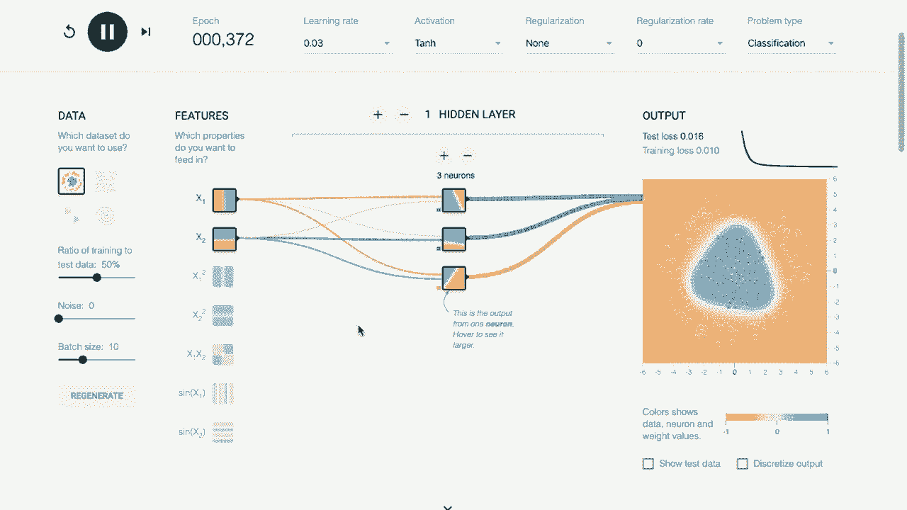
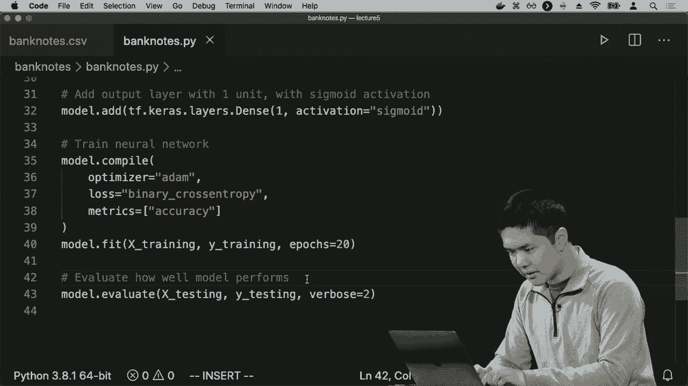
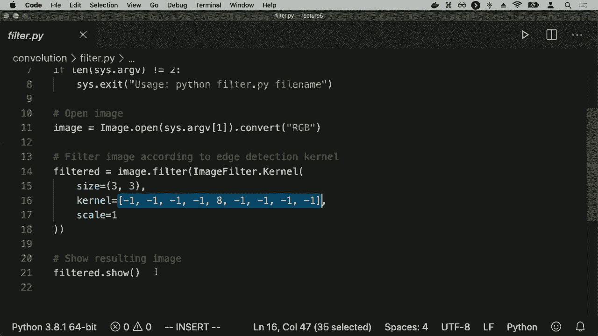
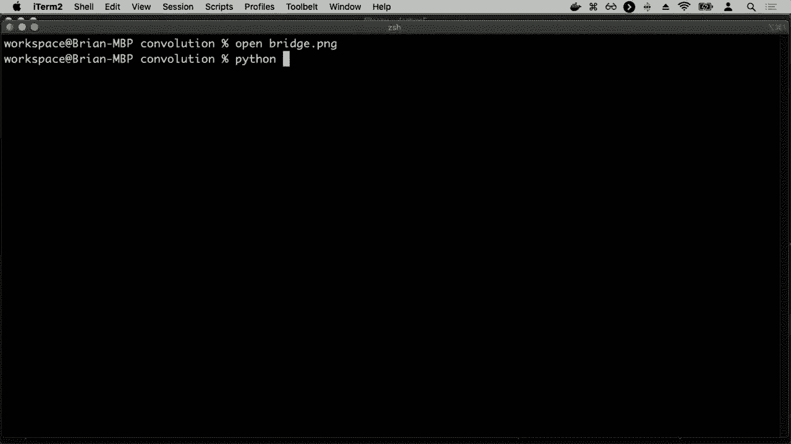

# 🧠 哈佛CS50-AI ｜ Python人工智能入门(2020·完整版) - P18：L5- 神经网络 2 (反向传播，过拟合，tensorflow，计算机视觉)

在本节课中，我们将深入学习神经网络的核心训练算法——反向传播，探讨模型复杂化带来的过拟合问题及其应对策略，并介绍如何使用强大的TensorFlow库快速构建神经网络。最后，我们将把神经网络的应用场景扩展到计算机视觉领域，了解图像处理的基本概念。

## 🔄 反向传播算法

上一节我们介绍了神经网络的基本结构和前向传播过程。本节中我们来看看如何通过反向传播算法来训练网络，即调整网络中的权重以最小化预测误差。

实际上，人们提出的策略是，如果你知道输出节点上的错误或损失是什么，那么基于这些权重，如果其中一个权重比另一个高，你可以计算出这个节点的错误在多大程度上是由于这个隐藏节点的部分，或者隐藏层的这一部分，或者隐藏层的这一部分造成的。

基于这些权重的值，实际上是在说，根据输出的错误，我可以反向传播错误，并弄清楚每个隐藏层节点的错误估计是什么。这里还有一些微积分，我们不会详细讨论。

这个算法的思想被称为反向传播，它是一个用于训练神经网络的算法，具有多个不同的隐藏层。

以下是使用反向传播进行梯度下降的伪代码流程：

1.  **初始化权重**：从随机选择的权重开始。
2.  **重复训练过程**：
    *   **计算输出层错误**：我们知道输出应该是什么，也知道我们计算了什么，因此可以弄清楚有什么错误。
    *   **反向传播错误**：对每一层进行重复，从输出层开始，向回移动到隐藏层，然后是之前的隐藏层（如果有多个隐藏层，将一直向回到最初的隐藏层）。每一层，无论输出的错误是什么，都基于权重的值计算前一层的错误。
    *   **更新权重**：根据传播回来的错误更新每一层的权重。

从图形上来看，你可能会想到这一点：我们首先从输出开始，我们知道输出应该是什么，我们知道计算出的输出是什么，基于此我们可以弄清楚我们需要如何更新这些权重，将错误反向传播到这些节点，并利用它，我们可以弄清楚我们应该如何更新这些权重。

你可能想象一下，如果有多个层，我们可以重复这个过程一次又一次，以开始弄清楚所有这些权重在这个反向传播算法中应该如何更新。这确实是关键算法，它使得神经网络成为可能，它使得我们能够进行这些多层结构，能够训练这些结构，具体取决于这些权重的值，以弄清楚我们应该如何更新这些权重，从而创建一个能够最小化总损失的函数，找出一些好的权重设置将输入转换为我们期望的输出。

## 🏗️ 深度神经网络

正如我们所说，这不仅适用于单个隐藏层。您可以想象多个隐藏层，在每个隐藏层中定义所需的节点数量，每个节点都可以连接到下一个层的节点，从而定义越来越复杂的网络，能够建模越来越复杂类型的函数。

因此这种类型的网络可以称为深度神经网络，属于深度学习算法的大家族。所有深度学习关注的就是利用多个层来预测并建模输入中的高级特征，以确定输出应该是什么。

一个深度神经网络就是一个具有多个隐藏层的神经网络，从输入开始计算对于这一层的值，然后是这一层，然后是这一层，最终得到输出。这使我们能够建模越来越复杂的函数，每一层可以计算一些略有不同的内容，我们可以结合这些信息来确定输出应该是什么。

## ⚠️ 过拟合与 Dropout 技术

当然，在任何机器学习的情况下，随着我们开始使模型变得越来越复杂，以建模越来越复杂的函数，我们面临的风险是过拟合。上次我们在过拟合的上下文中讨论了这一点：我们在训练模型时，试图学习某种决策边界，过拟合发生在我们对训练数据拟合得过于紧密，因此我们对其他情况的泛化效果较差。

而我们在一个复杂的神经网络中面临的风险是：不同的节点可能会因为输入数据而导致过拟合，我们可能过于依赖某些节点，仅仅基于输入数据进行计算，这不允许我们很好地泛化到输出。

有很多策略可以应对过拟合。在神经网络的背景下，最流行的技术被称为 **Dropout**。

Dropout 的作用是在训练神经网络时，暂时移除某些单元，随机选择这些人工神经元，从而防止对某些单元的过度依赖。过拟合通常发生在我们开始过于依赖神经网络内部的某些单元，以告诉我们如何解读输入数据。



以下是 Dropout 的工作方式：

1.  我们有一个网络，在训练时，第一次我们将随机选择一定百分比（例如50%）的节点从网络中丢弃（就好像那些节点的权重根本不存在一样），然后以这种方式进行训练。
2.  接下来当我们更新权重时，我们将选择另一组随机节点并继续训练。
3.  这个过程在训练中不断重复。

目标是，在训练过程中，如果通过随机丢弃网络内部的节点进行训练，希望最终得到一个更健壮的网络，不会过于依赖任何特定节点，而是更普遍地学习如何近似一个函数。

## 🛠️ 使用 TensorFlow 构建神经网络

现在，我们想将这些想法付诸于代码。为此，有许多不同的机器学习库和神经网络库可以使用，这些库允许我们访问某些人的反向传播实现和所有这些隐藏层。最受欢迎的由谷歌开发的库被称为 **TensorFlow**。

这是一个我们可以用来快速创建神经网络并对其进行建模和在一些样本数据上运行的库，以查看输出将是什么。

在我们实际上开始编写代码之前，我们将先查看 TensorFlow 的 **游乐场**，这将为我们提供一个机会，让我们玩一玩神经网络和不同层次的概念，以便更好地理解我们可以利用神经网络做什么。

### TensorFlow 游乐场演示

在游乐场中，我们可以尝试学习对于特定输出的决策边界。例如，我们想学习如何将蓝点与橙点分离。我们可以访问的输入数据特征是 x 值和 y 值。

*   **简单线性可分案例**：仅使用两个输入特征（x 和 y），没有隐藏层，神经网络很快学会用一条直线作为决策边界完美分开两个点，训练损失为零。
*   **复杂非线性案例（如异或问题）**：没有一条直线能够将两类点分开。如果仅用输入层，网络无法得出清晰结论。添加一个包含两个神经元的隐藏层后，网络能做得稍好，每个隐藏神经元学习自己的决策边界（如一条线），但可能仍无法完美分类。继续添加神经元（如三个或四个），网络通过学习多个不同的决策边界并将它们组合，能够更好地对复杂数据进行分类。



通过调整隐藏层和神经元的数量，我们可以观察网络如何学习数据中的结构，找出重要的决策边界。反向传播算法则负责确定这些权重的值，以训练网络区分不同类别的点。

### 代码示例：钞票真伪分类

让我们看一个实际代码例子。我们将使用上次提到的钞票数据集，根据四种面值特征判断钞票是真钞还是伪钞。

以下是使用 TensorFlow (`tf`) 构建和训练神经网络的关键步骤：

```python
import tensorflow as tf

# 1. 准备数据（划分训练集和测试集）
# ... (数据加载和预处理代码)

# 2. 定义模型结构
model = tf.keras.Sequential([
    # 添加一个密集连接（全连接）的隐藏层，包含8个神经元
    # 输入形状为4（因为有4个输入特征），使用ReLU激活函数
    tf.keras.layers.Dense(8, input_shape=(4,), activation='relu'),
    # 添加输出层，包含1个神经元（二分类），使用Sigmoid激活函数输出概率
    tf.keras.layers.Dense(1, activation='sigmoid')
])

# 3. 编译模型
# 指定优化器（如adam）、损失函数（binary_crossentropy用于二分类）和评估指标（accuracy）
model.compile(optimizer='adam',
              loss='binary_crossentropy',
              metrics=['accuracy'])

# 4. 训练模型
# 使用训练数据和标签，训练20个周期（epoch）
model.fit(training_data, training_labels, epochs=20)

# 5. 评估模型
# 在测试集上评估模型性能
model.evaluate(test_data, test_labels)
```

运行此代码后，神经网络将被训练，并能在测试数据上达到很高的准确率（例如99.8%）。TensorFlow 的价值在于，我们只需定义网络结构和数据，它就会自动运行反向传播算法来学习最优的权重。

## 👁️ 神经网络与计算机视觉

我们可以开始想象将神经网络应用于更一般的问题，尤其是计算机视觉的问题。计算机视觉涉及对图像进行分析和理解的计算方法。

计算机视觉的应用非常广泛：
*   **社交媒体**：识别人脸并自动标记。
*   **自动驾驶汽车**：识别交通灯、周围车辆和行人。
*   **手写识别**：识别手写数字（如MNIST数据集中的数字）。

### 挑战与思路

我们如何使用神经网络处理图像呢？图像本质上是一个像素网格，每个像素有数值（例如，黑白图像是0-255的灰度值，彩色图像是红、绿、蓝三个通道的值）。我们可以将每个像素值作为神经网络的输入。

但这种方法有缺点：
1.  **输入维度巨大**：大图像意味着极多的输入和需要计算的权重，计算成本高。
2.  **丢失空间结构信息**：将图像扁平化为像素列表，忽略了相邻像素之间重要的空间关系（如形状、轮廓）。

为了更好处理图像，我们需要利用图像本身的结构化特性。接下来介绍两个关键概念：**图像卷积**和**池化**。

### 图像卷积

图像卷积是关于过滤图像，以提取有用或相关特征（如边缘、纹理）的方法。我们通过应用一个特定的**卷积核**（或滤波器）来实现。

**工作原理**：
1.  定义一个卷积核（例如一个3x3的矩阵）。
2.  将卷积核覆盖在图像的某个区域（如第一个3x3区域）上。
3.  将覆盖区域的每个像素值与卷积核对应位置的值相乘，然后将所有乘积相加，得到一个输出值。
4.  将卷积核在图像上滑动（通常每次移动一个像素），重复步骤3，最终生成一个新的图像，称为**特征图**。





**示例**：一个著名的边缘检测卷积核是：
```
-1  -1  -1
-1   8  -1
-1  -1  -1
```
这个核能突出像素值与其周围像素差异大的区域（即边缘），而均匀区域输出值接近0。通过应用此类过滤器，我们可以从图像中提取出轮廓和边界等关键特征，这些特征对于后续的图像识别任务非常有用。

### 池化

池化（如最大池化）的目的是通过下采样来减小图像的尺寸，从而减少计算量并增加一定程度的平移不变性。

**最大池化工作原理**：
1.  将图像划分为不重叠的区域（例如2x2的区域）。
2.  对每个区域，取其中所有像素值的最大值作为该区域的代表值。
3.  用这些代表值组成一个新的、更小的图像。

**优势**：
*   **降低维度**：减少了输入到神经网络的数据量。
*   **增强鲁棒性**：网络不再过分关心某个特征精确出现在哪个像素，只要它出现在某个局部区域内即可，这使得算法对微小位移更加健壮。

---

本节课中我们一起学习了神经网络的核心训练算法——反向传播，了解了深度网络的概念以及过拟合的应对方法 Dropout。我们实践了如何使用 TensorFlow 库高效地构建和训练神经网络模型。最后，我们将视野拓展到计算机视觉，学习了图像卷积和池化这两个预处理图像、提取关键特征的基础操作，为神经网络处理图像数据奠定了基础。