# 哈佛CS50-AI ｜ Python人工智能入门(2020·完整版) - P21：L6- 自然语言处理 2 (马尔可夫，词袋，朴素贝叶斯，信息检索，tf-idf) 📚

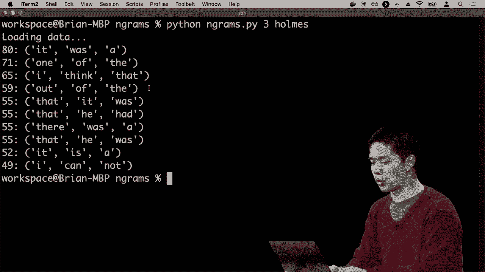

在本节课中，我们将要学习自然语言处理中的几个核心模型与技术，包括马尔可夫模型、词袋模型、朴素贝叶斯分类器、信息检索以及TF-IDF算法。我们将探讨如何利用这些技术让AI生成文本、分析情感并从文档中提取关键信息。

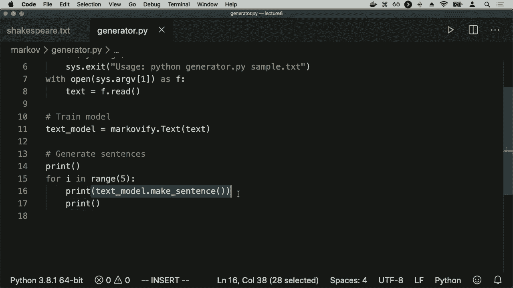

## 马尔可夫模型与文本生成 🤖

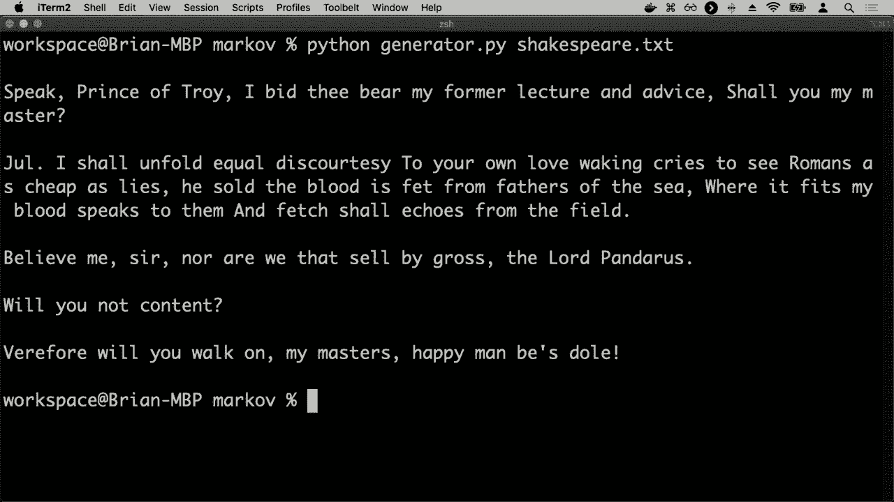

上一节我们介绍了n-gram模型，它用于分析单词序列的频率。本节中我们来看看如何利用这些数据来预测和生成文本。

这个特定的语料库，那么这里的潜在使用案例是什么？现在我们有一些数据，我们有关于特定单词序列出现的频率，按特定顺序排列，并利用这些数据，我们可以开始做一些预测。我们可能会说，如果你看到这些单词，它有合理的机会，后面跟着的单词应该是单词“a”。如果我看到单词“one of”，可以合理地想象下一个单词可能是单词“the”，例如，因为我们有关于三元组序列的数据，以及它们出现的频率。现在基于两个单词，你可能会能够预测第三个单词是什么。

而我们可以用来实现这一点的模型是我们之前见过的模型，它是马尔可夫模型。再次回想，马尔可夫模型实际上只指某种事件序列。发生在一个时间步之后，每个单位都有某种能力来预测下一个单位会是什么，或者可能是过去两个单位预测下一个单位会是什么，或者过去三个单位预测下一个单位会是什么。我们可以使用马尔可夫模型并将其应用于语言。

一种非常幼稚且简单的方法来尝试生成自然语言，让我们的AI能够像英语文本一样说话，它的工作方式是，我们将说一些内容，比如在给定这两个单词的情况下，得到一些概率分布，这个概率分布是什么？根据所有的数据，第三个单词可能是什么，如果你看到它，可能的第三个单词有哪些，它们出现的频率如何。利用这些信息，我们可以尝试构建我们期望的第三个单词是什么。如果你不断这样做，效果就是我们的马尔可夫模型可以有效地开始生成文本并能够生成不在原始语料库中的文本，但听起来有点像原始语料库，使用相同的规则。

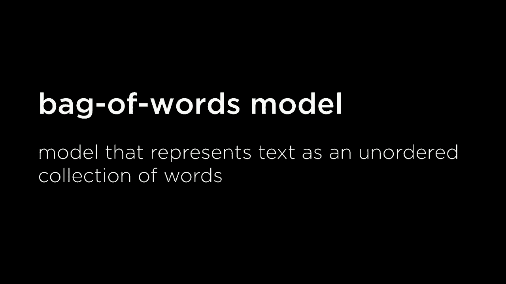

那么我们也来看看一个例子。我们现在在这里，我还有另一个语料库，这是我手上的语料库：威廉·莎士比亚的所有作品，所以我有一整堆故事。来自莎士比亚，所有的故事都在这个大的文本文件中。因此，我想做的是看看，所有的语言图式，也许看看莎士比亚文本中的所有三元组，然后弄清楚给定两个单词的情况下，我能预测第三个单词可能是什么，然后继续。重复这个过程，我有两个单词，预测第三个单词，然后从第二和第三个单词预测第四个单词，从第三和第四个单词预测第五个单词，最终生成随机句子。听起来像莎士比亚的句子，使用莎士比亚所使用的相似单词模式，但实际上从未在莎士比亚中出现过。

为了做到这一点，我将展示 `generator.py`，这将从特定文件读取数据。我使用的一个Python库叫做 `Markovify`，将为我完成这个过程，所以这里有一些库，可以训练一堆文本，并基于该文本生成马尔可夫模型。我将继续并且生成五个随机生成的句子，所以我们接下来将深入探讨。马尔可夫，我将对莎士比亚的文本运行生成器，我们看到的是它会加载这些数据，然后这是我们得到的五个不同的句子，这些是句子在任何地方都没有出现在莎士比亚的戏剧中，但设计成听起来像莎士比亚，旨在仅仅取两个单词，并且预测给定这两个单词莎士比亚可能会选择的第三个单词，跟随他，你知道这些句子可能没有任何意义，不是说人工智能尝试表达任何潜在的含义，这只是试图理解基于单词的顺序，接下来可能会出现什么。作为下一个单词，例如，这些是它能够生成的句子类型。如果你多次运行这个，你最终会得到不同的结果，我可能再次运行这个，然后得到一个完全不同的一组五个不同句子也应该是听起来有点像莎士比亚的句子声音一样。

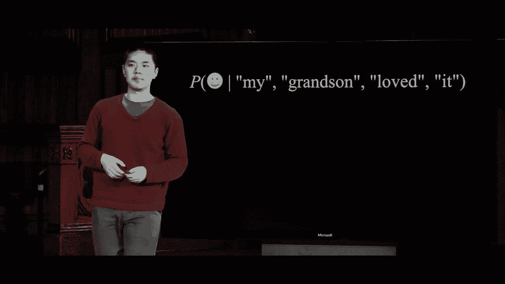

因此，这就是我们如何使用马尔可夫模型，简单地尝试生成语言，语言目前并没有太多意义。你不想在这个当前形式下使用系统来做像机器翻译这样的事情，因为它无法封装任何意义，但我们现在开始看到我们的人工智能逐渐变得更好，尝试说我们的语言或以某种方式处理自然语言，具有一定的意义。

## 文本分类与词袋模型 📦

上一节我们介绍了如何使用马尔可夫模型生成文本。本节中我们来看看如何让AI对文本进行分类，例如判断一段评论是正面还是负面。

因此我们现在将看一下几项其他任务，我们可能希望我们的人工智能能够执行的任务之一是文本分类，这实际上就是一种分类问题，我们已经讨论过分类问题。这些问题是，我们希望将某个对象分类到多个不同类别。这种文本的表现方式是，无论何时你有一些文本样本，并且想把它归入某个类别，比如说，给定一封邮件，它是否属于收件箱，还是属于垃圾邮件？这两个类别中它属于哪个，你是通过查看文本来实现的。能够对这些文本进行某种分析，以得出结论，比如说根据出现在邮件中的词汇，我认为这可能属于收件箱，或者我认为它可能属于垃圾邮件，你可能会想象为多种不同类型的这种分类问题。

你可能想象另一个常见的例子是情感分析，我想分析给定的文本样本，是否有正面情感，还是有负面情感，这可能出现在例如网站上的产品评论，或是你有的反馈！一堆由网站用户提供的数据样本，你想能够快速分析这些评论是正面的还是负面的，人们在说什么，以便了解他们在说什么，以便将文本分类为这两种不同的类别。

所以怎么我们可以如何处理这个问题呢？让我们看看一些示例产品评论，这里有一些可能出现的产品评论：“我孙子非常喜欢这个，有趣的产品”，“几天后坏了”，这是我很久以来玩过的“最好的”游戏，“有点廉价和脆弱，不值得买”。你可能在亚马逊或易贝或其他某些人们销售产品的网站上看到的不同产品评论，我们人类可以相对容易地将其分类为正面情感或负面情感。我们可能会说第一条和第三条是正面情感的信息，第二和第四条可能是负面情感的信息，但我们如何尝试评估这些评论呢？你知道它们是正面还是负面，这最终取决于这些特定评论中的词汇。

在这些特定句子中，现在我们将忽略结构，以及词汇之间的关系，我们只关注词汇本身，所以这里可能有一些关键词，例如“喜欢”、“有趣”和“最好”，这些词可能在更多的正面评论中出现。而像“破碎”、“廉价”和“脆弱”这样的词，可能更容易出现在负面评论中，而非正面评论。因此，一种处理这种文本分析的方法是，暂时忽略这些句子的结构，也就是说我们不关心的是单词之间的关系，我们不会尝试解析这些句子以构建它们的语法结构，就像我们刚才看到的那样，但我们可能只依赖于实际使用的单词，依赖于积极评价更有可能拥有“最好”、“喜爱”和“有趣”等单词，负面评论更可能包含我们在这种模型中突出显示的负面词汇。

这种思考语言的方法通常被称为词袋模型，我们将对其进行建模。文本样本，不关心它的结构，但仅仅关注样本中出现的无序单词集合，我们关心的只是文本中的单词，而不关心这些单词的顺序，也不关心单词的结构，我们不在意什么名词与什么形容词搭配，事物之间如何相互关联，我们只关心单词，结果证明这种方法在进行分类时，比如积极情感或消极情感，效果相当不错。

## 朴素贝叶斯分类器 🧮

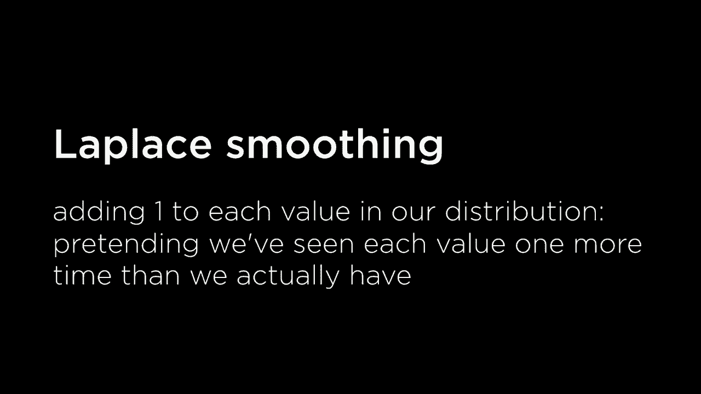

上一节我们介绍了词袋模型，它忽略文本结构，只关注单词本身。本节中我们来看看如何利用朴素贝叶斯算法，基于词袋模型对文本进行概率分类。

你可以想象用我们讨论过的多种方式来实现分类样式的问题，但在自然语言中，最流行的方法之一是朴素贝叶斯方法，这是分析某事物是否是积极情感或消极情感的一种方法，或者只是试图将一些文本进行分类可能的类别，它不仅适用于文本，也适用于其他类型的概念，但在分析文本和自然语言的领域中相当流行。

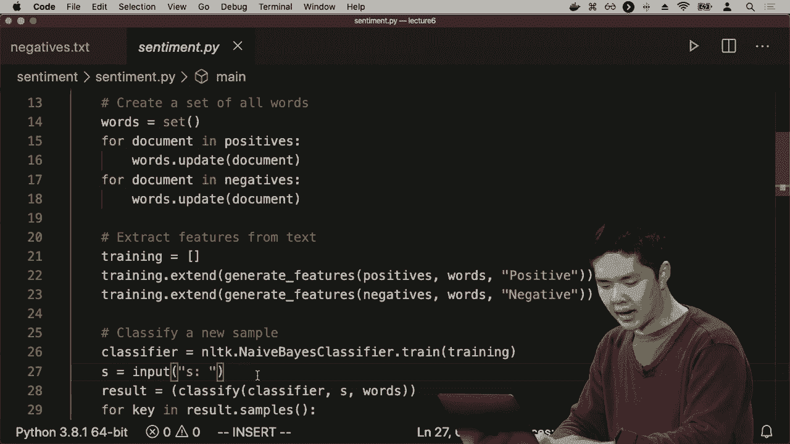

朴素贝叶斯方法基于贝叶斯规则，你可能还记得我们讨论概率时提到的贝叶斯规则。规则看起来是这样的，给定某事件A的事件B的概率可以用这个表达式来表示，给定A的B的概率等于给定B的A的概率乘以B的概率除以A的概率，我们看到这只是因为条件独立性的定义，以及两个事件一起发生的意义，这就是我们的贝叶斯规则的公式，结果证明它非常有用，我们能够通过翻转这些事件的顺序在这个概率计算中预测一个事件。这种方法将非常有帮助，我们稍后会看到原因。

它能够进行情感分析，因为我想说，消息是积极的概率是多少，或消息是消极的概率是多少，我会简化这个使用表情符号只是为了简单，比如积极的概率、消极的概率，这就是我想计算的，但我想在给定一些信息的情况下计算，比如这里是一个文本样本，我的孙子喜欢它，我想知道的不仅仅是什么任何消息是积极的概率是什么，但在给定我的孙子喜欢它作为样本文本的情况下，消息是积极的概率是什么？那么，在给定这个信息，即样本中包含单词“我的孙子喜欢它”的情况下，这个是积极消息的概率又是多少呢？

根据词袋模型，我们将真正忽略单词的顺序，而不是将其视为有某种结构的单个句子，而是将其视为一堆不同的单词，我们将要说的是，这个是积极的概率是多少？给定单词“我的”在消息中的情况下，给定单词“孙子”在消息中的情况下，给定单词“喜欢”在消息中的情况下，以及给定单词在消息中的情况下，词袋模型在这里我们将整个样本视为一堆不同的单词。这就是我想计算的概率，给定这些单词，这个是积极消息的概率是多少。

现在我们可以应用贝叶斯定理，这实际上是某个事件给定某个事件的概率，这正是我想要的。根据贝叶斯定理，这整个表达式等于……好吧，是我交换了它们的顺序，是所有这些单词在它是积极消息的情况下的概率，乘以它是积极消息的概率，除以所有单词的概率。所以这只是贝叶斯定理的一个应用，我们已经看到我想要将给定单词的积极概率表示为与积极消息的单词概率相关，结果是你可能会记得我们讨论过的关于概率，这个分母无论我们看积极还是消极消息都是相同的，这些单词的概率并没有变化，因为我们下面没有积极或消极的东西，所以我们可以说，rather than just say that this expression up 这里等于下面这个表达式，它实际上只是与分子成比例，我们可以暂时忽略分母，使用分母会得到一个确切的概率，但实际上我们要做的就是弄清楚概率与什么成比例。最后，我们必须归一化概率分布，确保概率分布最终的总和为一。

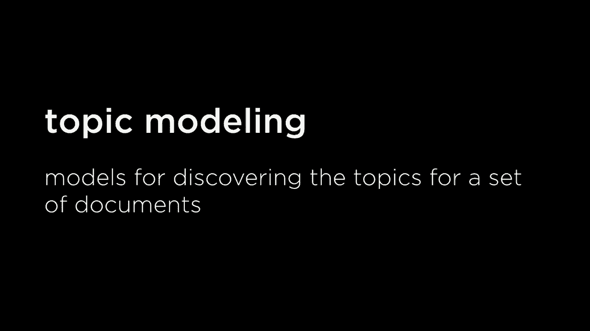

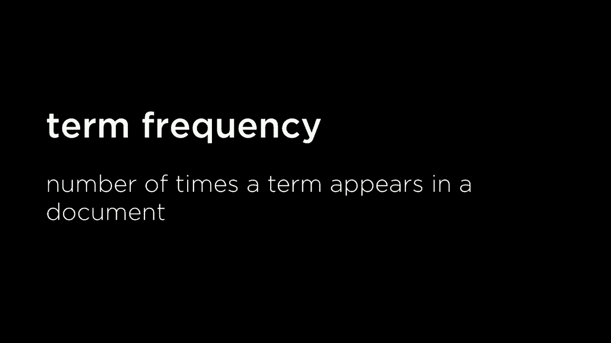

所以现在我已经能够形成这个概率，这是我关心的，与这两件事相乘成比例，即单词的概率给定正面消息，乘以正面消息的概率，但再次如果你回想我们的概率规则，我们实际上可以将其计算为所有这些事情发生的联合概率，即正面消息的概率乘以这些概率给定正面消息的词，实际上就是这些事情的联合概率。这与它是正面消息的概率，以及 my 在句子或消息中，grandson 在样本中，love 在样本中，以及 it 在样本中是一样的。所以，利用这个规则来定义联合概率我能够说，这整个表达式现在是与这序列成比例的，这些词的联合概率以及其中的正面内容。

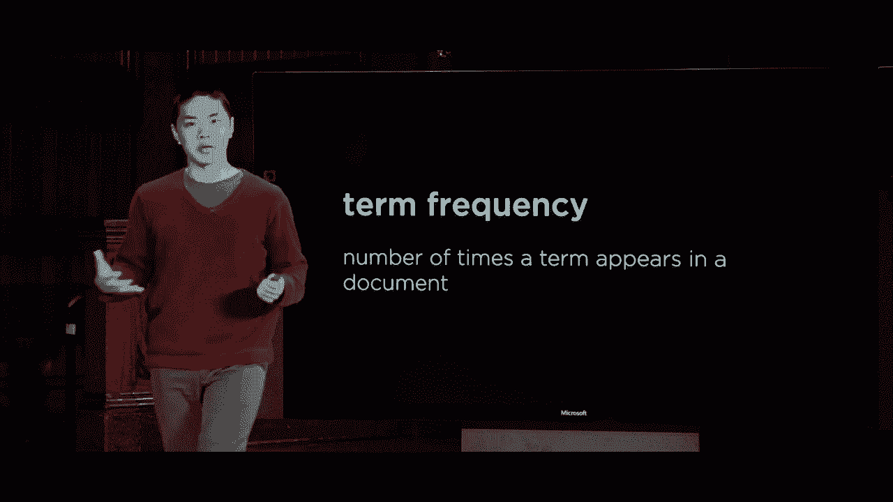

所以，现在有趣的问题就是如何计算这个联合概率，我如何弄清楚概率给定某个任意消息，它是正面的，并且其中包含单词 my，单词 grandson，单词 loved 和单词 it。你会记得，我们可以通过将所有这些条件概率相乘来计算联合概率。我想知道 A、B 和 C 的概率，我可以将其计算为 A 的概率乘以给定 A 的 B 的概率乘以给定 A 和 B 的 C 的概率。我可以将这些条件概率相乘，以获得我关心的总体联合概率。

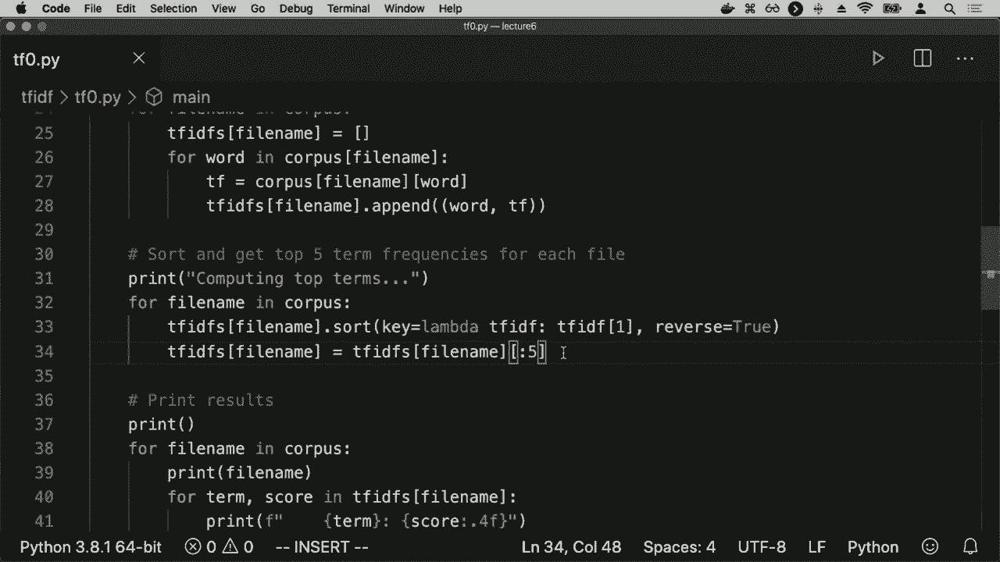

我可以在这里做同样的事情，我可以说，让我们将正面的概率与单词 my 在消息中出现的概率相乘，前提是它是正面的，乘以给定单词 my 在那里且它是正面的情况下，grandson 出现在消息中的概率。乘以给定这三样东西的 loved 的概率，乘以给定这四样东西的 it 的概率，而这将是一个相当复杂的计算，我们可能没有好的方法去知道答案，比如，孙子出现的概率是多少在消息中，前提是它是正面的，且单词 my 在消息中。这并不是我们会有一个容易回答的事情，这就是朴素贝叶斯的朴素之处。我们将简化这个概念，而不是精确计算这个概率分布。

我们假设这些词在已知是积极信息的情况下彼此独立。如果这是一个积极的信息，那么“grandson”在消息中出现的概率并不会因为我知道“loved”不是消息而改变。在实际情况中，这可能并不一定成立，现实世界中这些词可能并不独立，但我们假设它们独立，以简化我们的模型。事实证明，这种简化仍然让我们获得相当不错的结果，所以我们要做的假设是所有这些词出现的概率仅仅取决于消息是积极还是消极。我仍然可以说，“loved”在积极信息中出现的可能性高于在消极信息中出现的可能性，这可能是对的，但我们也会说这不会改变“loved”出现的可能性如果我知道“my”这个词出现在消息中，那么它出现的可能性不会因为这是一个积极的信息而变得更可能或不太可能。这些是我们要做的假设，所以虽然上面的表达式与下面的表达式成正比，我们将简单地说它与这个表达式的概率成正比。积极的信息，然后对于样本中出现的每个单词，我将乘以在已知这是积极的情况下，给定的不是消息的概率，乘以在已知这是积极的情况下，“grandson”出现在消息中的概率，然后依此类推，对其他出现的单词进行同样的处理。这些数据会包含在样本中，结果是这些数字我们可以计算。

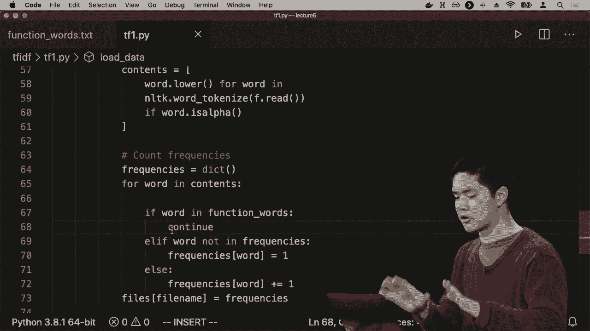

我们之所以做这些数学运算，是为了能够计算我们关心的概率分布，基于这些我们实际上可以计算的项。基于我们可用的一些数据，这就是如今许多自然语言处理的内容，它涉及分析数据。如果我给你一堆标记为积极或消极的评论数据，那么你就可以开始计算这些特定的项。我可以仅通过查看我的数据来计算一条消息是积极的概率，看看有多少个正样本，然后将其除以总样本数，这就是我认为一条消息是积极的概率，以及“loved”这个词出现在消息中的概率这肯定是积极的，我可以根据我的数据来计算。让我看看样本中有多少个包含“love”这个词的正样本，并将其除以我的正样本总数，这将给我一个关于“love”在评论中出现的概率的近似值。鉴于我们知道评论是正面的，因此这使我们能够计算这些概率。

那么我们不妨进行这项计算，计算“我孙子喜欢它”这句话，是正面还是负面的评论。我们如何能够得出这些概率呢？再次上面的数据是我们要计算的表达式，以及在这种情况下可用的数据。解读这些数据的方式是，在所有消息中，49%的消息是正面的，51%的消息是负面的，或许在线评论往往会稍微偏向负面。他们是正面的，至少基于这个特定的数据样本。这就是我所拥有的，然后我有各种不同词的分布，假设这是一个正面消息，那么有多少正面消息包含“我”这个词呢？你知道，大约是30%，而对于负面消息。消息中有多少条包含“我”的词，大约是20%。所以似乎“我”这个词在正面消息中出现得更频繁，至少在这个分析中稍微多一些。以“孙子”为例，可能在1%的所有正面消息中出现，而在2%的所有负面消息中出现。“孙子”这个词出现在32%的所有正面消息中，8%的所有负面消息中，例如，“它”这个词在30%的正面消息中出现，而在40%的负面消息中再次出现，这里是一些任意的数据，仅供参考，但现在我们有了可以开始计算的数据。

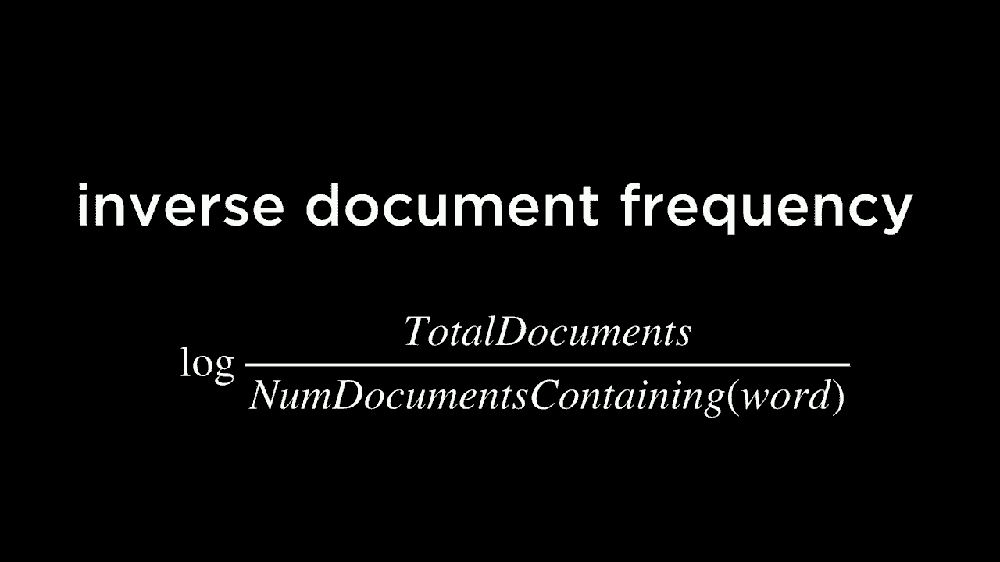

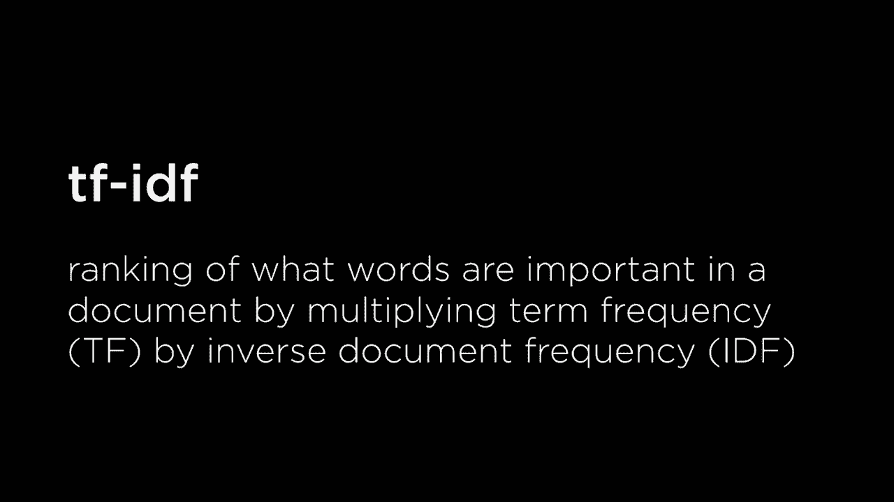

那么这个表达式，我该如何计算呢？将所有这些值相乘。这实际上是正面概率乘以我所给定的正面概率，再乘以孙子在正面消息中的概率，依此类推，针对其他每个单词，如果你这样做的话。将所有这些值相乘，你会得到这个0.00014112，单独看这个数字并没有什么特别的意义，但如果你将这个表达式与我知道它是正面的概率相乘，再乘以给定的所有词的概率。消息是正面的，并且将其与负面情感消息进行比较。我想知道它是负面消息的概率，乘以给定的所有这些词的概率，得出这是一个负面消息的概率。那么我该如何做到这一点呢？为了做到这一点，你只需将负面概率与所有这些条件概率相乘。如果我将这五个值相乘，那么我得到的值是负面0.00006528，再次强调，这个数值在孤立状态下并没有特别的意义，真正有意义的是处理这两个值。作为一种概率分布，并且，通过归一化它们，使得这两个值的总和为1，这就是概率分布应有的方式。我们通过将这两个值相加，然后将每个值除以它们的总和来实现归一化——以便能够做到这一点。

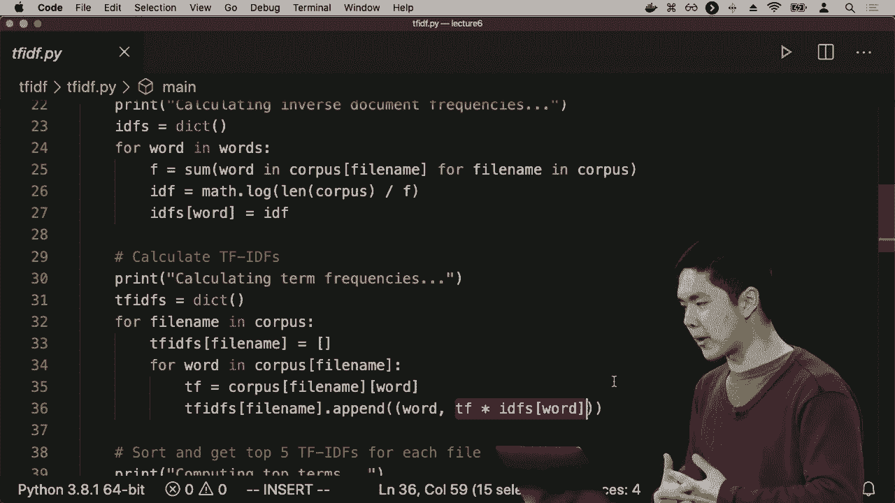

当归一化这个概率分布时，你最终得到的结果大概是这样的：正面0.6837，负面0.3163。这似乎让我们能够得出结论，我们对这个消息的正面概率大约有68%的信心。“我孙子喜欢这个”，为什么我们有68%的信心呢？似乎我们比不更有信心，因为“喜欢”这个词在32%的正面消息中出现，但在8%的负面消息中仅出现，因此这是一个相当强的指标。而对于其他词来说，确实像是这个词出现在负面消息中更常出现，无法抵消那种爱在积极消息中远远更常出现，因此这种类型的分析就是我们如何应用朴素贝叶斯，我们刚刚进行了这个计算，最终不仅得到了正面或负面的分类。但我获得了一种信心，比如我认为它是正面的概率是什么。我可以说，我认为它是正面的概率是这样，因此朴素贝叶斯在尝试实现这一点时可以非常强大，只需使用这个词袋模型。通过查看样本中出现的单词，我能够得出这些结论。

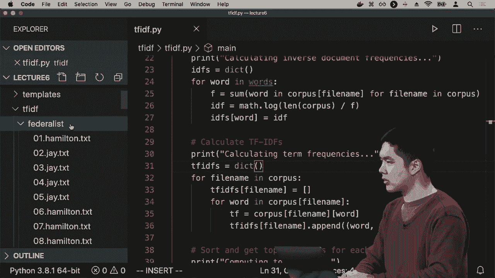

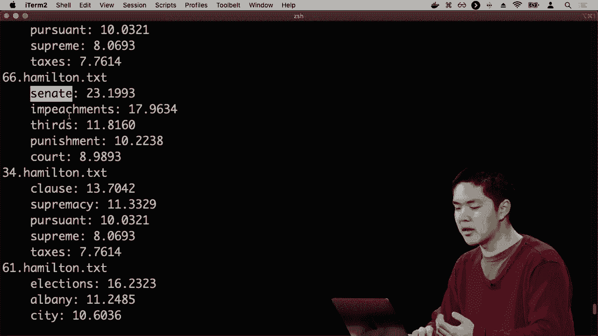

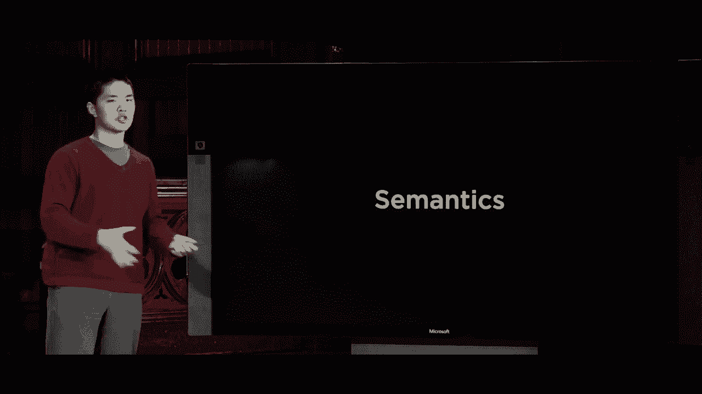

现在一个潜在的缺点是，如果你开始严格按照这个规则应用，你会很快注意到的事情是，数据中如果包含零的话会发生什么，假设例如这个情况。相同的句子“我孙子喜欢这个”，但我们假设这里的值不是0.01，而是在我们的数据集中，从未发生过在正面消息中出现“孙子”这个词，这确实是可能的，如果我有一个相对较小的数据集可能并不一定所有消息都会包含“孙子”这个词，也许在我的数据集中没有任何正面消息包含“孙子”这个词，但如果有2%的负面消息仍然包含“孙子”这个词，那我们就会遇到一个问题。有趣的挑战在于，当我将所有正数相乘并将所有负数相乘以计算这两种概率时，最终得到的是一个值为零的正值。我得到的是纯零，因为当我将所有的当我将某个数乘以零时，无论其他数字是什么，结果都会是零，负数也是如此，因此这似乎是一个问题，因为“孙子”从未出现在任何正面消息中。在我们的符号内部，我们似乎得出的结论是，信息是正面的概率为零，因此它必须是负面的，因为我们看到“孙子”这个词的唯一情况是在负面消息中。正面消息更可能包含“爱”这个词，因为我们乘以零，这意味着其他概率完全无关紧要，因此这是我们需要面对的挑战，这意味着我们可能不会每个值在我们的分布中，以便稍微平滑数据。如果我们纯粹使用这种方法，就能够获得正确的结果，正因为如此，有很多方法可以确保我们不会将某个东西乘以零，将某个东西乘以一个小数字是可以的，因为它可以被其他更大的数字抵消。但将数字乘以零似乎意味着故事结束了，你将一个数字乘以零，输出将是零，无论其他任何数字有多大，因此，在朴素贝叶斯中，一个相对常见的方法是这种加法平滑的想法，给其他概率加上一个值α。一种这样的方式称为拉普拉斯平滑。这基本上意味着对我们分布中的每个值加一，所以如果我有100个样本，且其中0个包含“孙子”这个词，我可能会说，不如假设我看到了一个额外的样本，其中出现了“孙子”这个词。“孙子”没有出现，所以我会说，现在我有102个样本中有1个样本包含“孙子”这个词，我基本上创造了两个之前不存在的样本，但通过这样做，我已经能够稍微平滑分布，以确保我从未乘以数字。通过假设每个类别中都有一个额外的值，我实际上没有的，这让我们得出了一个