# 哈佛CS50-AI ｜ Python人工智能入门(2020·完整版) - P4：L0- 搜索算法 3 (极大极小算法，剪枝，深度限制) 🧠⚔️

在本节课中，我们将要学习对抗性搜索算法。与之前寻找从A点到B点路径的经典搜索不同，对抗性搜索模拟的是两个或多个具有对立目标的智能体之间的互动，例如棋类游戏。我们将重点探讨**极大极小算法**，它是处理此类问题的核心方法，并学习如何通过**剪枝**和**深度限制**来优化它，以应对更复杂的游戏。

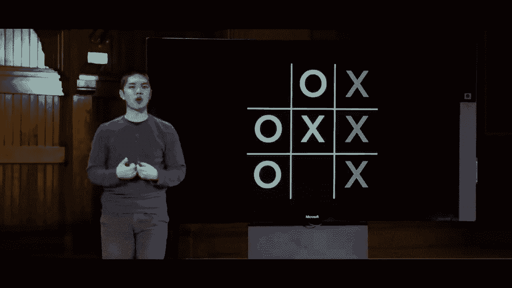

## 对抗性搜索问题概述

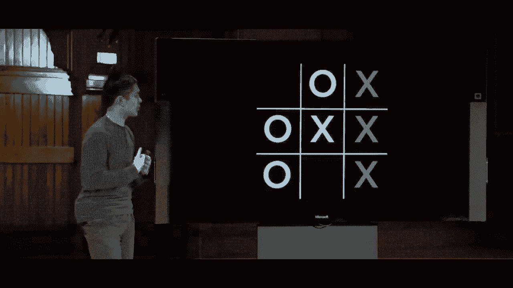

上一节我们介绍了经典搜索问题，本节中我们来看看对抗性搜索。在这种情境中，存在一个试图做出智能决策的智能体（例如玩家），同时有另一个智能体（对手）正在对抗它，并且双方目标相反。一方试图成功，另一方则希望其失败。这种情况在游戏中非常常见。

以井字棋为例，我们有一个3x3的网格，X和O轮流在方格中落子。X玩家的目标是获得三个连续的X，O玩家的目标是获得三个连续的O。计算机在玩这类游戏时可以表现得相当出色。


井字棋的规则相对简单，但对于更复杂的游戏，智能决策会是什么样子呢？

## 游戏中的智能决策

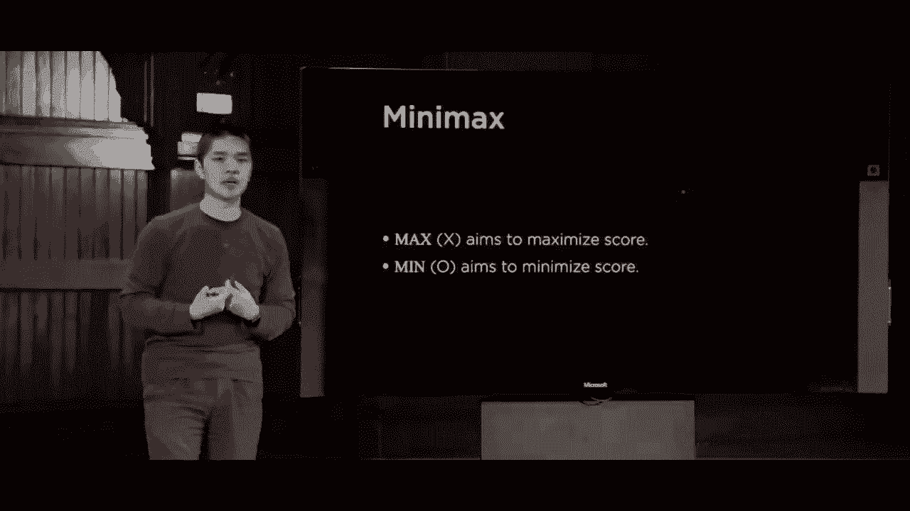

假设在井字棋中，X先手将棋子放在中间，O随后落子。

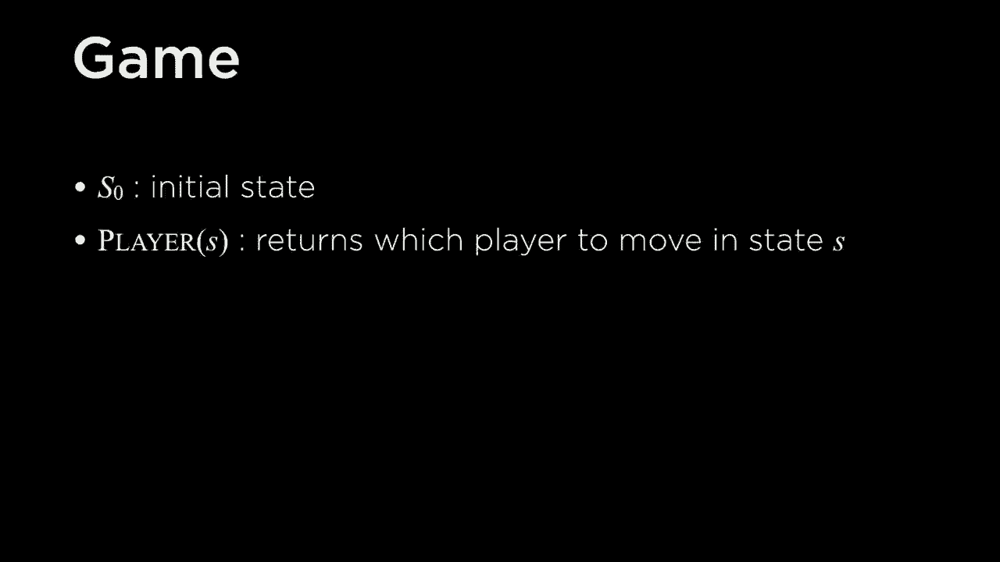

那么，在这种情况下，智能的X应该如何移动？最终结果有几种可能性。如果AI以最佳方式游戏，它可能会选择右上方的位置。因为此时O的目标与X相反：O试图阻止X获得三连，而X则试图达成这个目标。

因此，O会在这里落子进行阻挡。但现在X可以做出一个相当聪明的移动：X可以进行这样的移动，从而制造出两个可能获胜的路径。X既可以通过横向获得三连，也可以通过纵向获得三连来赢得游戏。因此，O的下一步移动将无关紧要。例如，O可以在这里落子阻挡横向的三连，但随后X将通过纵向的三连赢得游戏。

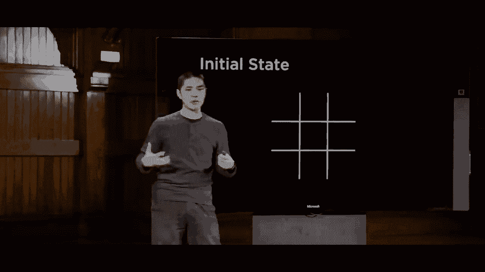

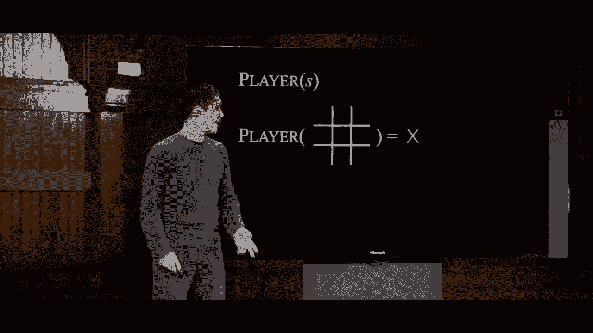

要让计算机能够解决这类问题，需要一种与我们目前所见问题相似但又有区别的框架。这涉及到棋盘的状态和从一个动作到下一个动作的转变。这与传统搜索问题不同，因为现在这是一个**对抗性搜索问题**：一个玩家试图找到最佳移动，但知道有对手在阻止自己。

因此，我们需要一种专门的算法来处理这种对抗性的情况。

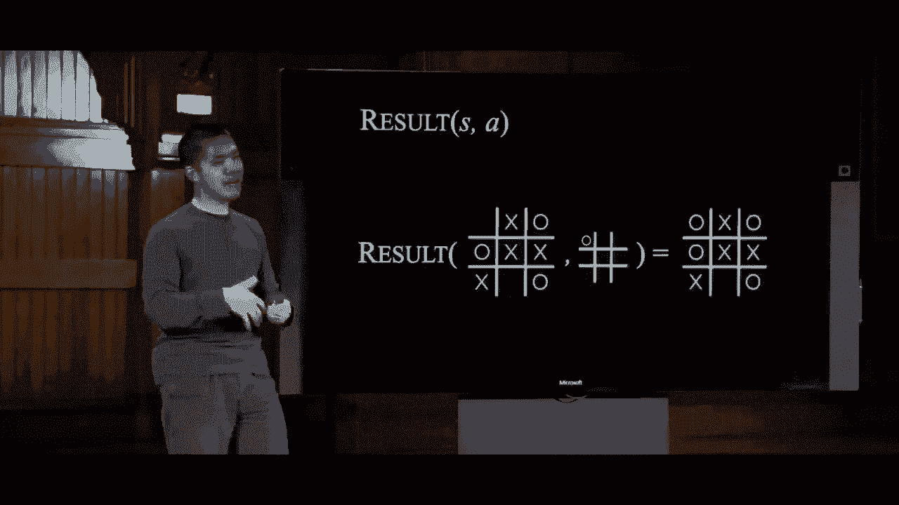

## 极大极小算法基础

我们要学习的算法叫做**极大极小算法**。它在确定性双人游戏中效果很好，也可以适用于其他类型的游戏。我们现在关注的是双方轮流行动、目标对立的游戏：一方试图赢，另一方也试图赢（即努力让对方输）。

为了将“赢”和“输”的人类概念转化为计算机可以处理的形式，我们需要将其数值化。计算机理解数字，因此我们需要一种方式将游戏结果（如井字棋的输、赢、平）转化为数值。

在井字棋中，可能的结果有三种：O赢、X赢或平局。我们可以为这些结果分配数值：
*   O胜利：值设为 **-1**
*   平局：值设为 **0**
*   X胜利：值设为 **1**

我们有两个玩家：X玩家和O玩家。在极大极小算法中，**X玩家被称为最大化玩家**，因为它旨在最大化最终得分（希望得到1）。**O玩家被称为最小化玩家**，因为它旨在最小化最终得分（希望得到-1）。

这样，赢、输和平局的概念就被简化为数学上的最大化或最小化分数问题。

## 游戏的形式化定义

为了让AI能够玩像井字棋这样的游戏，我们需要将游戏规则形式化，编码成计算机可以理解的结构。这需要以下几个组成部分：

以下是定义游戏所需的组件：

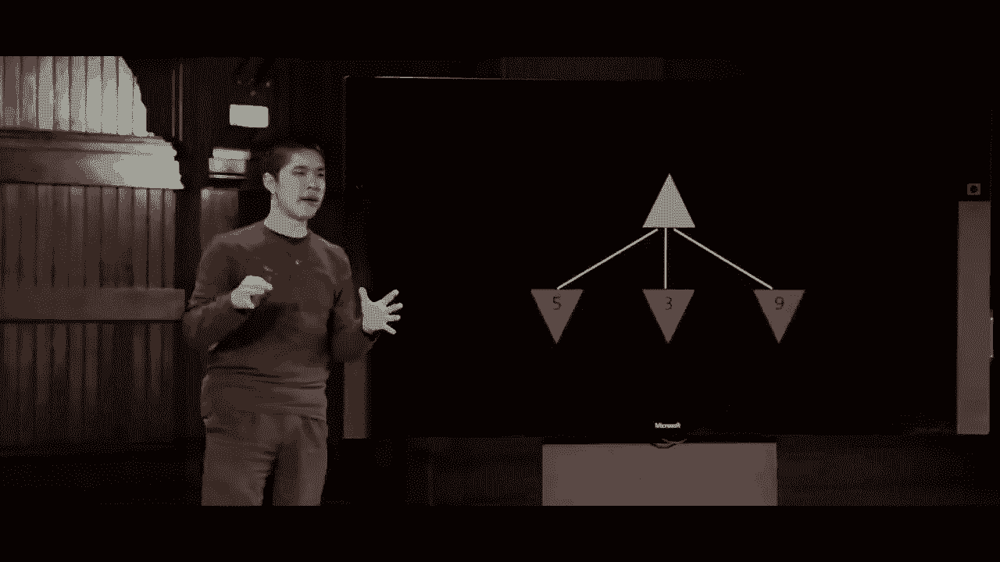

1.  **初始状态 `s0`**：游戏开始时的状态。例如，一个空的井字棋棋盘。
2.  **玩家函数 `Player(s)`**：接受一个状态 `s` 作为输入，输出当前轮到哪个玩家行动（X或O）。
3.  **行动函数 `Actions(s)`**：接受一个状态 `s` 作为输入，输出在该状态下所有可能采取的行动集合。
4.  **转移模型 `Result(s, a)`**：接受一个状态 `s` 和一个行动 `a` 作为输入，输出采取行动 `a` 后得到的新状态。
5.  **终止测试 `Terminal(s)`**：检查一个状态 `s` 是否为终止状态（即游戏结束）。在井字棋中，当一方三连或棋盘填满时游戏终止。
6.  **效用函数 `Utility(s)`**：仅对终止状态 `s` 有效，返回该状态的数值分数（例如，X赢为1，O赢为-1，平局为0）。

通过这些函数，我们告诉AI游戏的规则、如何进行以及如何评估结果。

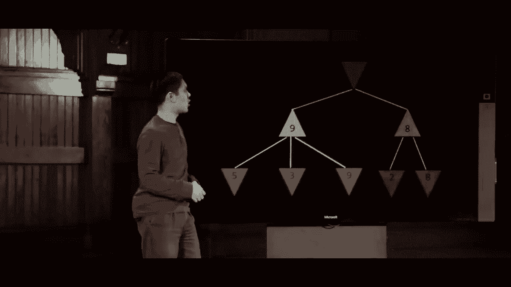

## 极大极小算法的工作原理

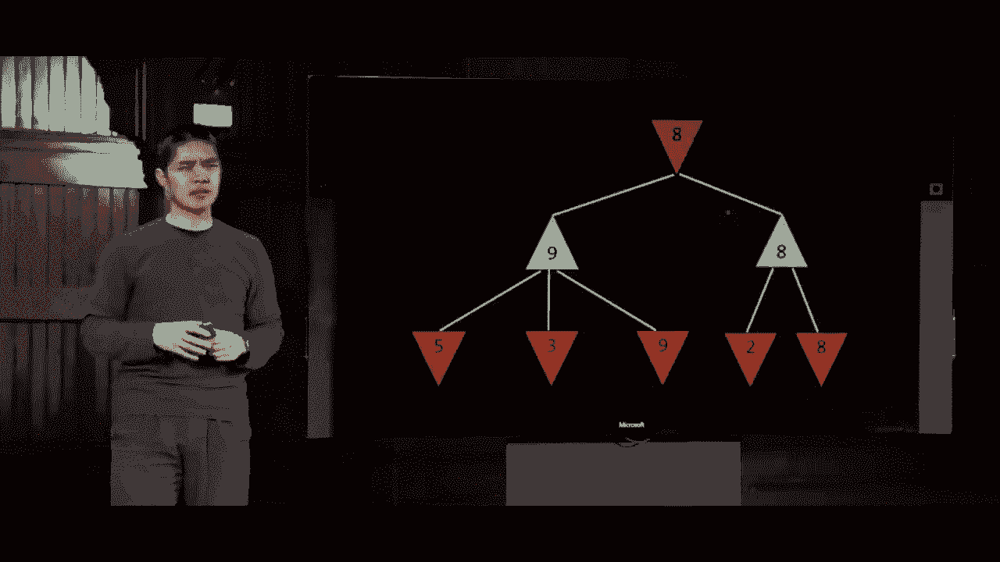

对于非终止状态，我们如何确定其价值并做出最佳决策？这就需要**极大极小算法**。其核心思想是：站在当前玩家的角度，考虑所有可能的行动，并递归地模拟对手会如何最优应对，一直推导到游戏结束的终止状态，然后反向推导出当前状态的价值。


以一个具体的中间棋盘状态为例，假设轮到O玩家行动。O有两个可能的落子点：左上角和下中间。算法会分别考虑这两个选择：

1.  如果O选择左上角，那么接下来轮到X行动。在这个新状态下，X只有一个选择（完成三连），这将导致X获胜，效用为1。因此，从O的角度看，选择这个行动会导致一个价值为1的后续状态。
2.  如果O选择下中间，那么接下来X也只能在左上角落子，这将导致平局，效用为0。因此，这个行动会导致一个价值为0的后续状态。

现在，作为**最小化玩家**的O，会在两个选择的价值（1和0）中，选择**最小**的那个，即0。因此，O的最佳移动是选择下中间，这个决策状态的价值也就被评估为0。

这个过程可以抽象成一棵**极大极小树**。树中的节点代表游戏状态，向上指的箭头（或标记为MAX的节点）代表**最大化玩家**的回合，它选择能带来**最大**价值的子节点；向下指的箭头（或标记为MIN的节点）代表**最小化玩家**的回合，它选择能带来**最小**价值的子节点。通过从终止节点的效用值反向传播，我们可以计算出根节点（当前状态）的价值，从而决定最佳行动。

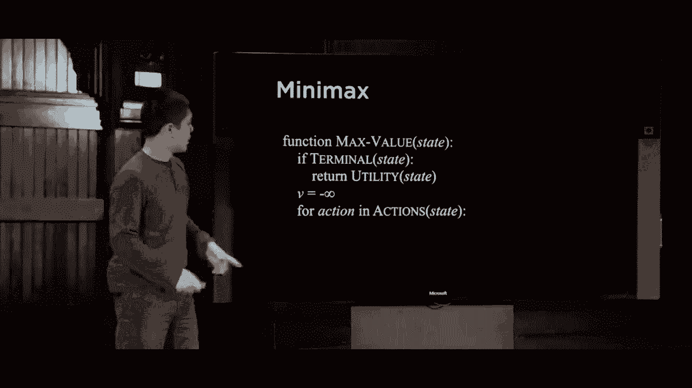

## 算法伪代码实现

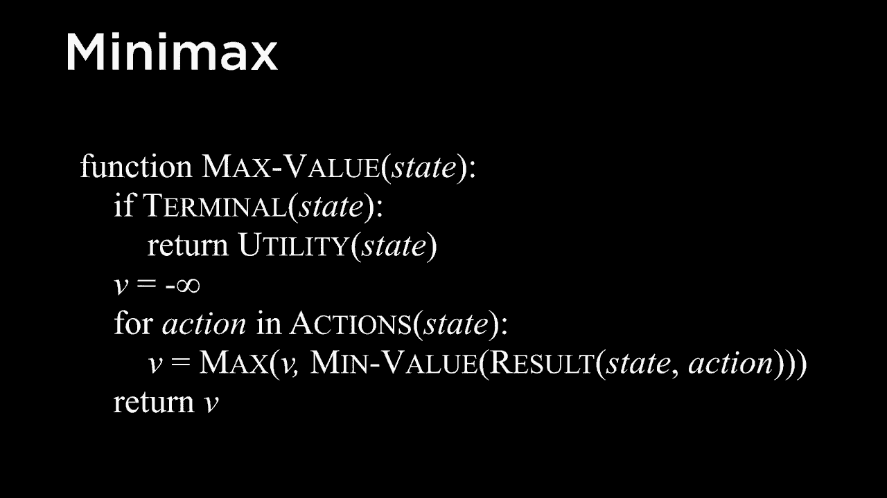

以下是极大极小算法的伪代码实现，包含两个核心函数：`Max-Value`（为最大化玩家计算状态价值）和 `Min-Value`（为最小化玩家计算状态价值）。

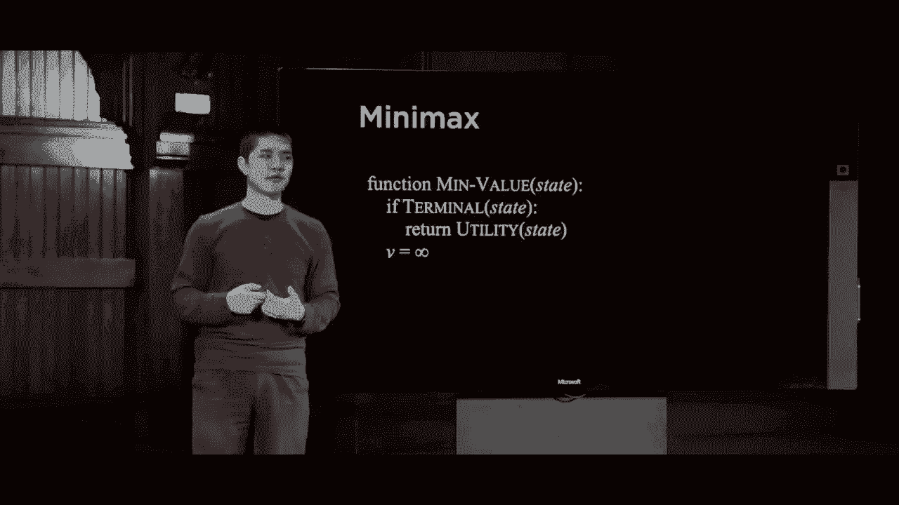

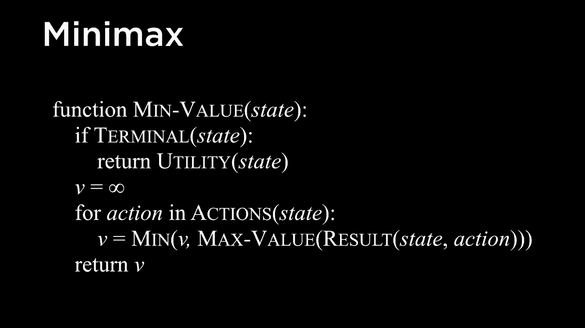

```python
function Max-Value(state):
    if Terminal(state):
        return Utility(state)
    v = -∞
    for action in Actions(state):
        v = max(v, Min-Value(Result(state, action)))
    return v

function Min-Value(state):
    if Terminal(state):
        return Utility(state)
    v = +∞
    for action in Actions(state):
        v = min(v, Max-Value(Result(state, action)))
    return v
```

要做出决策，最大化玩家只需选择能产生最高 `Min-Value` 结果的行动。

## 优化一：Alpha-Beta 剪枝

极大极小算法需要探索整个游戏树，对于复杂游戏（如国际象棋）这是不可行的。**Alpha-Beta 剪枝**是一种优化技术，可以在不改变最终结果的情况下，剪除（跳过）树中不需要探索的分支，从而大幅减少计算量。

其核心思想是跟踪两个值：
*   **α**：在当前路径上，最大化玩家**至少**能保证的分数（下界）。
*   **β**：在当前路径上，最小化玩家**至多**能允许的分数（上界）。

在搜索过程中，如果发现某个节点的价值对于当前玩家来说已经不可能优于已知的最佳选择，就可以停止探索该节点的其余分支。

例如，在最大化玩家的回合，如果它已经发现一个行动能保证得分至少为4（α=4），而在评估另一个行动时，发现最小化玩家可以轻松地将得分限制在3或更低（即该分支的β ≤ 3）。由于3 < 4，这个分支无论如何都不会被最大化玩家选中，因此可以立即“剪枝”，不再探索该分支下的其他节点。

Alpha-Beta剪枝能极大提升搜索效率，但其效果依赖于节点探索顺序，好的顺序能带来更多的剪枝。

## 优化二：深度限制与评估函数

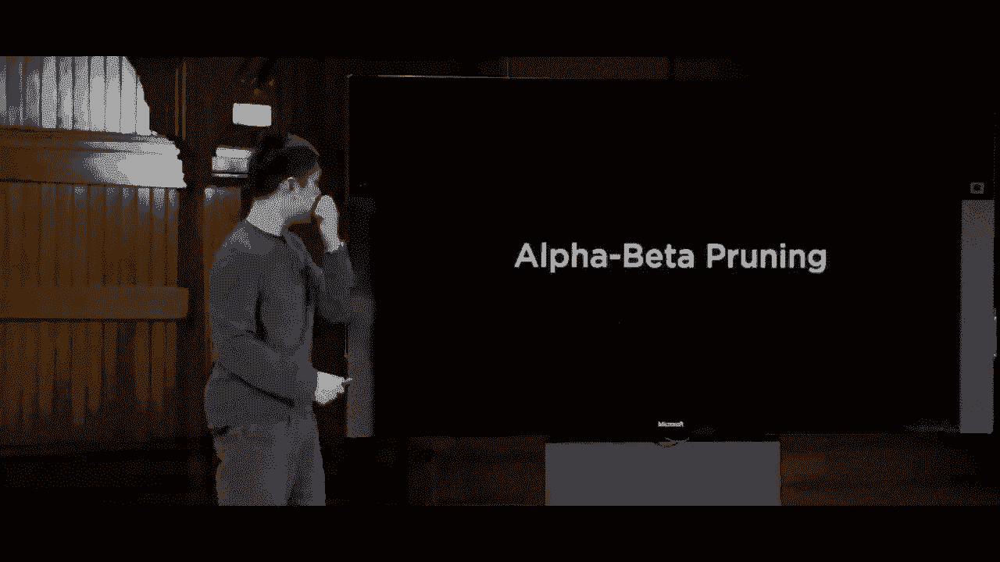

即使使用剪枝，对于像国际象棋这样分支因子巨大、步数很长的游戏，搜索到终局仍然不可能。解决方案是采用**深度限制的极大极小算法**。

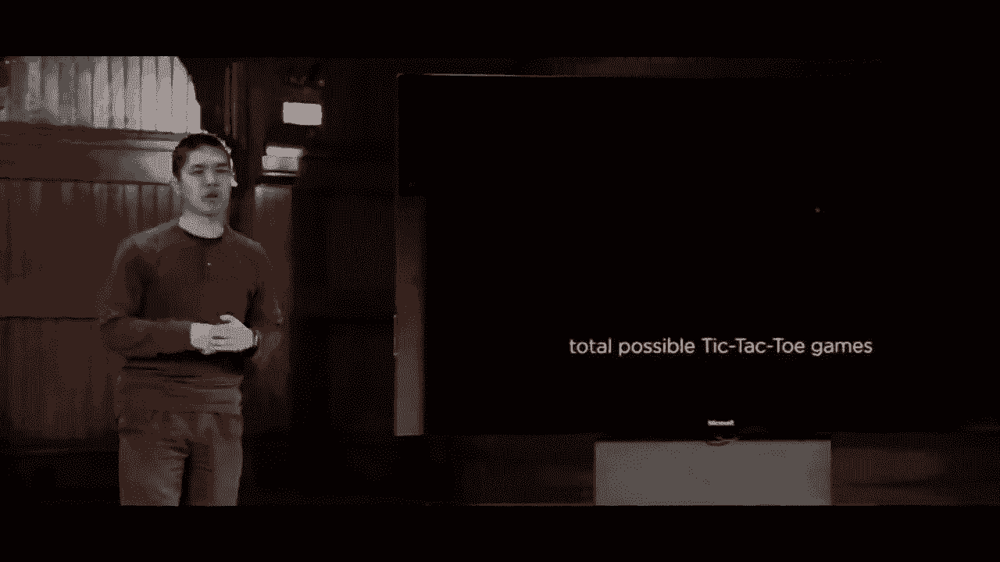

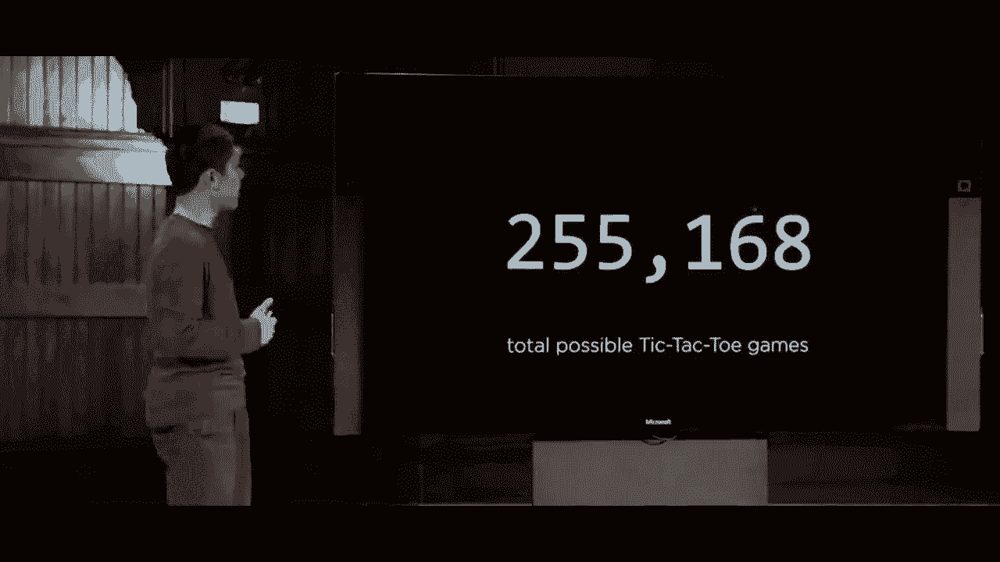

我们不再搜索到游戏结束，而是设定一个最大搜索深度（例如，向前看10步）。当达到深度限制时，游戏很可能尚未结束，因此无法使用 `Utility` 函数。这时，我们需要一个**评估函数 `Evaluation Function`**。

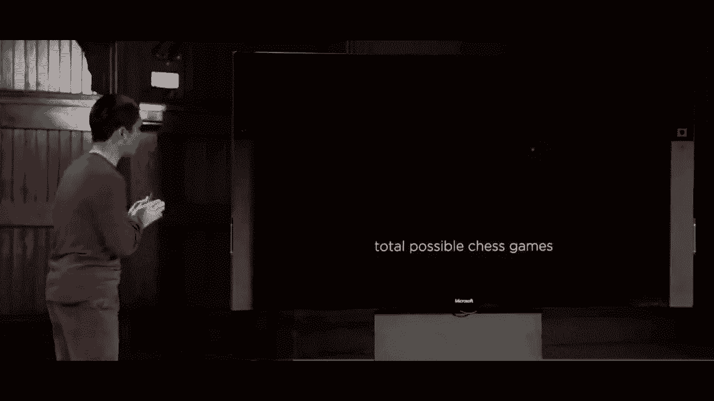

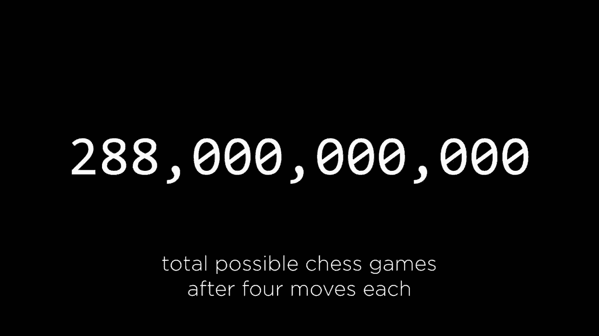

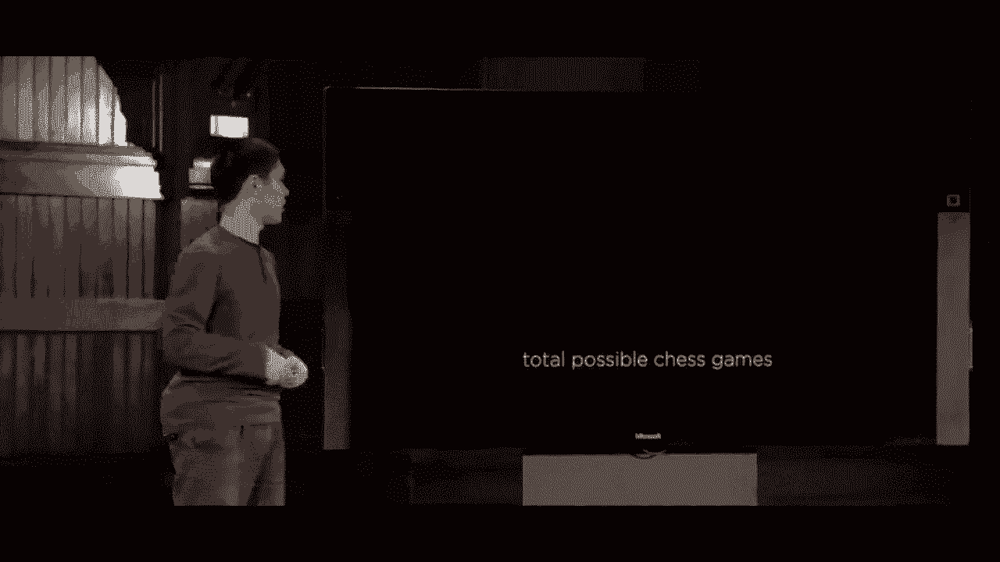

评估函数的作用是：对于一个非终止状态，**估计**其对于最大化玩家的期望效用。它是一个启发式函数，质量高低直接决定AI的强弱。

例如，在国际象棋中，一个简单的评估函数可能基于棋子价值（后=9，车=5，象/马=3，兵=1），计算双方棋子总价值的差值。更复杂的评估函数会考虑棋子位置、国王安全性、控制中心等因素。

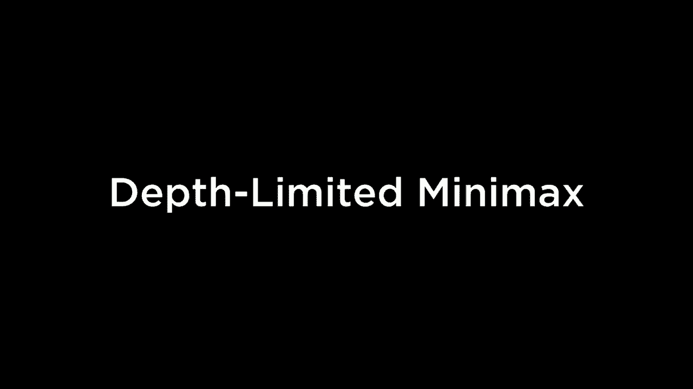

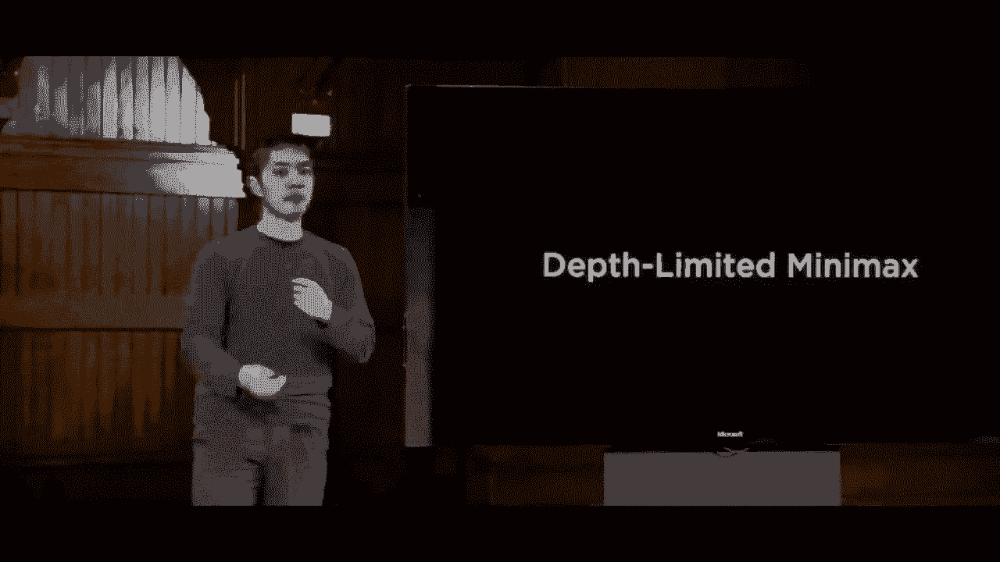

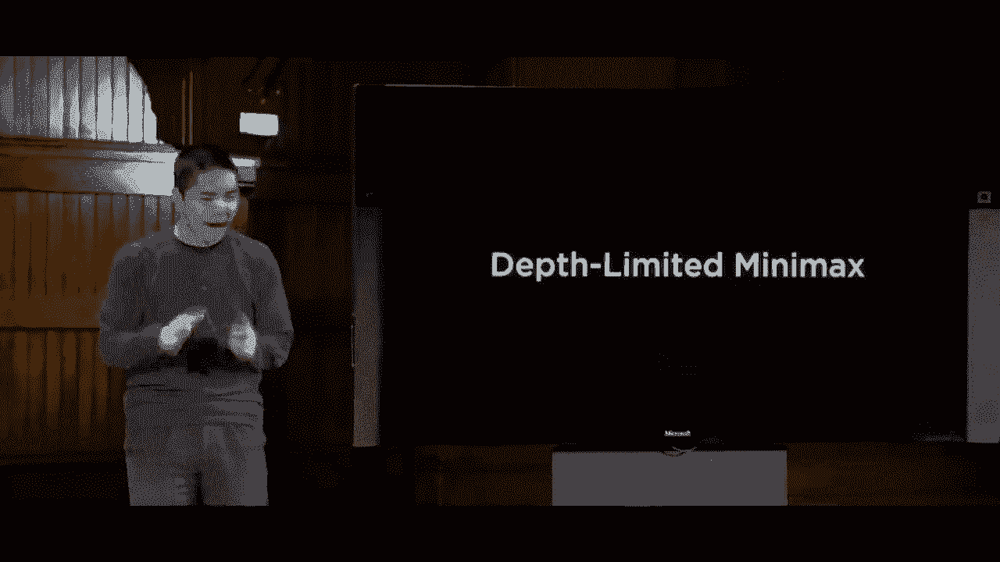

深度限制的极大极小算法在达到深度限制时，不再递归调用 `Min-Value` 或 `Max-Value`，而是直接返回评估函数对该状态的计算结果。

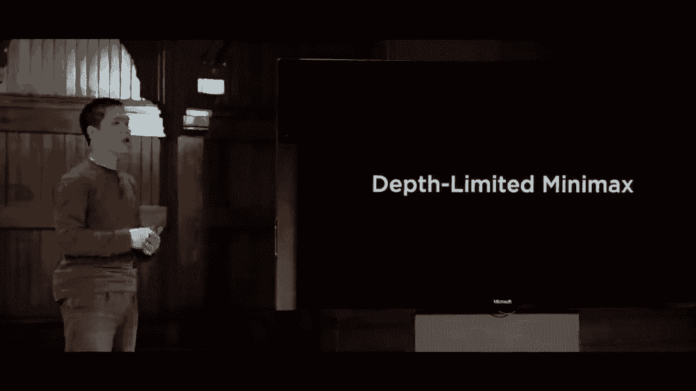

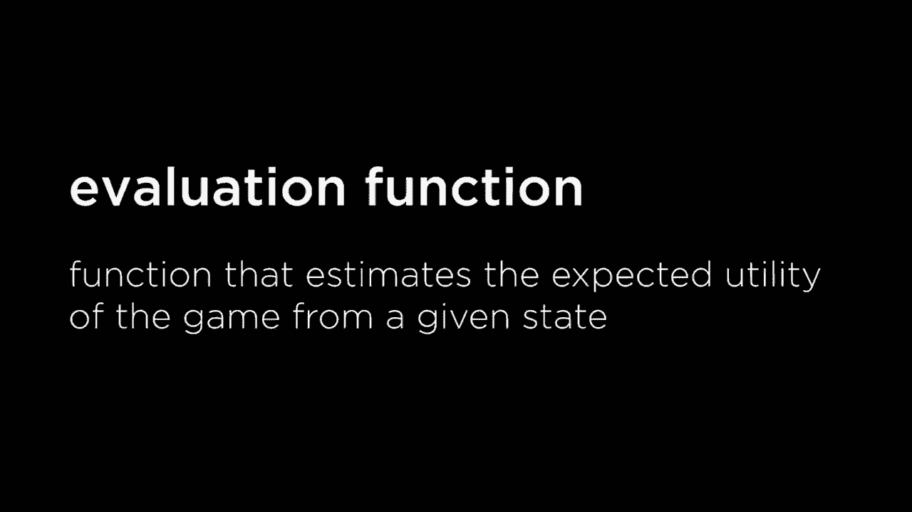

## 总结

本节课中我们一起学习了对抗性搜索的核心算法——**极大极小算法**。我们从对抗性问题的定义出发，学习了如何将游戏形式化，并详细阐述了极大极小算法通过递归模拟对手最优应对来进行决策的原理。

为了应对复杂游戏的计算挑战，我们介绍了两种关键优化技术：
1.  **Alpha-Beta剪枝**：通过跟踪α和β值来剪除不必要的搜索分支，提高效率。
2.  **深度限制与评估函数**：通过限制搜索深度并在深层节点使用评估函数来估计局面价值，使算法能够处理像国际象棋这样庞大的状态空间。

这些算法是AI在棋类游戏等对抗性环境中做出智能决策的基础。虽然井字棋可以被完全求解，但更复杂的游戏需要这些优化技术和精心设计的评估函数，AI才能进行有效的决策。