# 🧠 哈佛CS50-AI ｜ Python人工智能入门(2020·完整版) - P9：L2- 不确定性 2 (联合概率，贝叶斯网络)


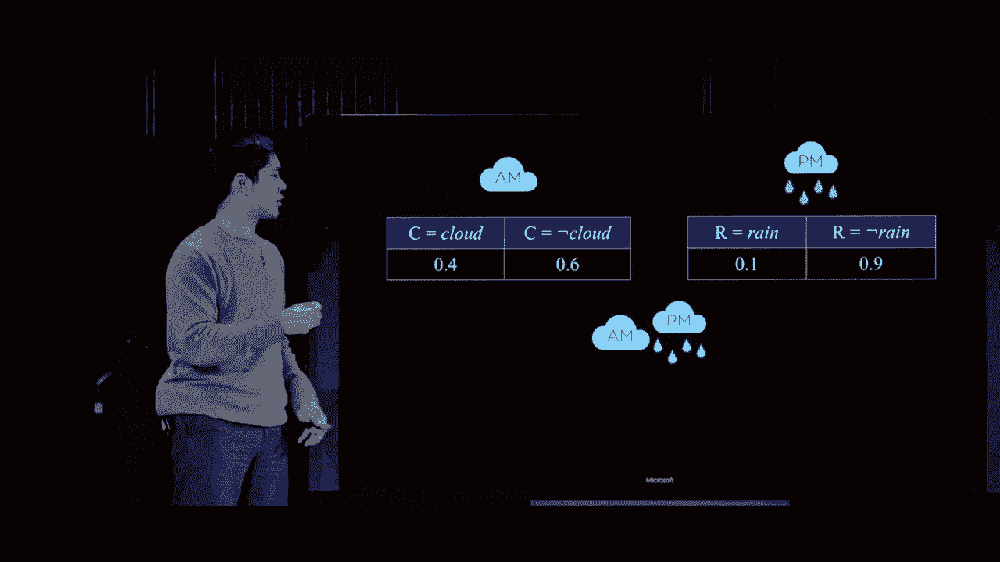


在本节课中，我们将要学习概率论中两个核心概念：**联合概率**与**贝叶斯网络**。我们将了解如何用联合概率描述多个事件同时发生的可能性，并学习如何使用贝叶斯网络这一强大的工具来建模和推理随机变量之间的复杂依赖关系。

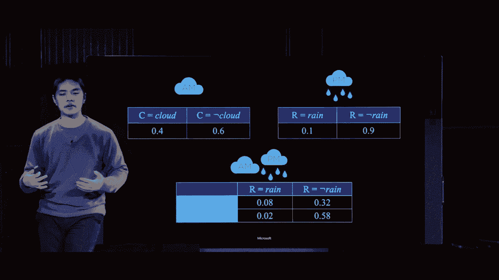

## 📊 联合概率


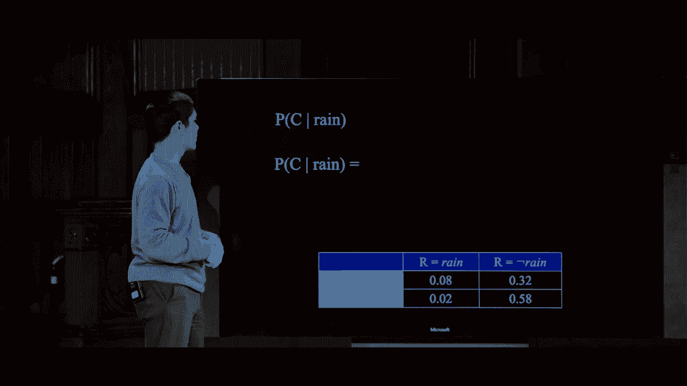

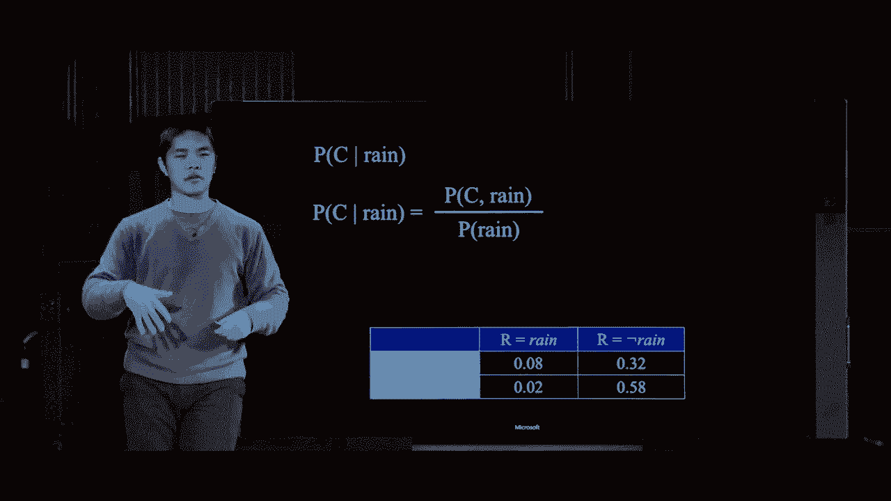

上一节我们介绍了单一事件的概率。本节中我们来看看如何描述多个事件同时发生的可能性，这就是**联合概率**。

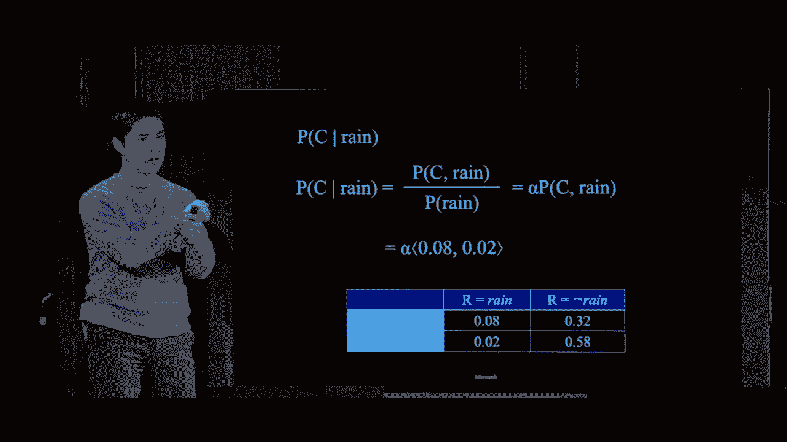

联合概率涉及同时考虑多个不同事件的可能性。例如，我们可能关心“早上阴天”和“下午下雨”这两个事件同时发生的概率。

假设我们有两个随机变量：
*   `C`（Cloudy，早上是否阴天）：取值为 `阴天` 或 `不阴天`。
*   `R`（Rain，下午是否下雨）：取值为 `下雨` 或 `不下雨`。

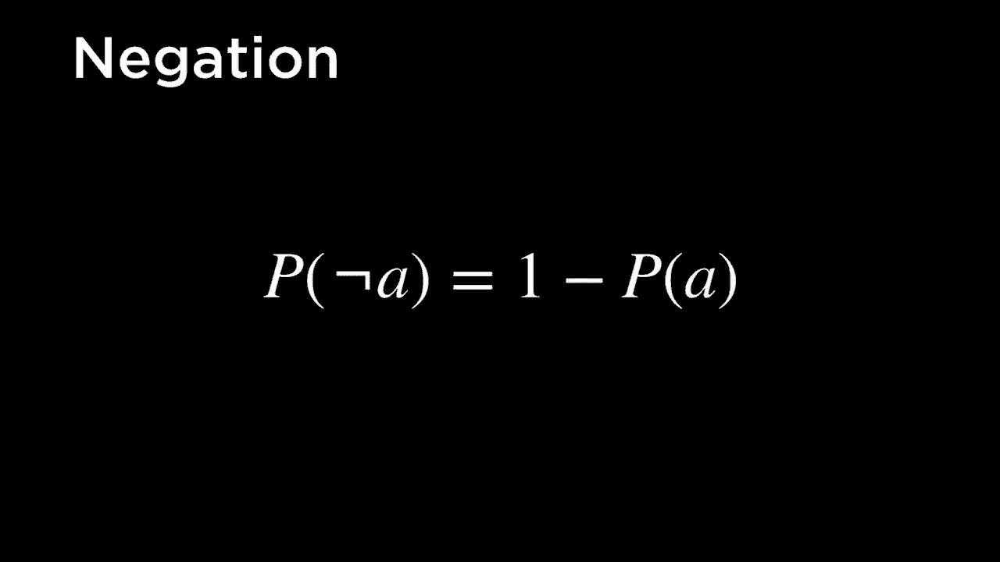

我们可以为每个变量建立独立的概率分布：
*   `P(C=阴天) = 0.4`
*   `P(C=不阴天) = 0.6`
*   `P(R=下雨) = 0.1`
*   `P(R=不下雨) = 0.9`


然而，这两个分布并未告诉我们两个变量之间的关系。**联合概率分布**则提供了更丰富的信息，它列出了所有可能组合的概率。

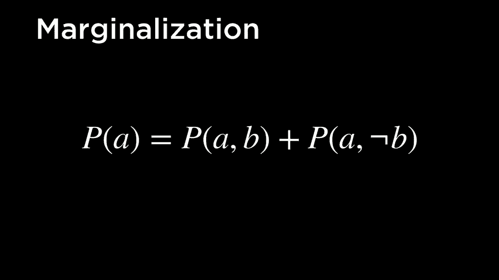


我们可以将联合概率整理成一个表格：

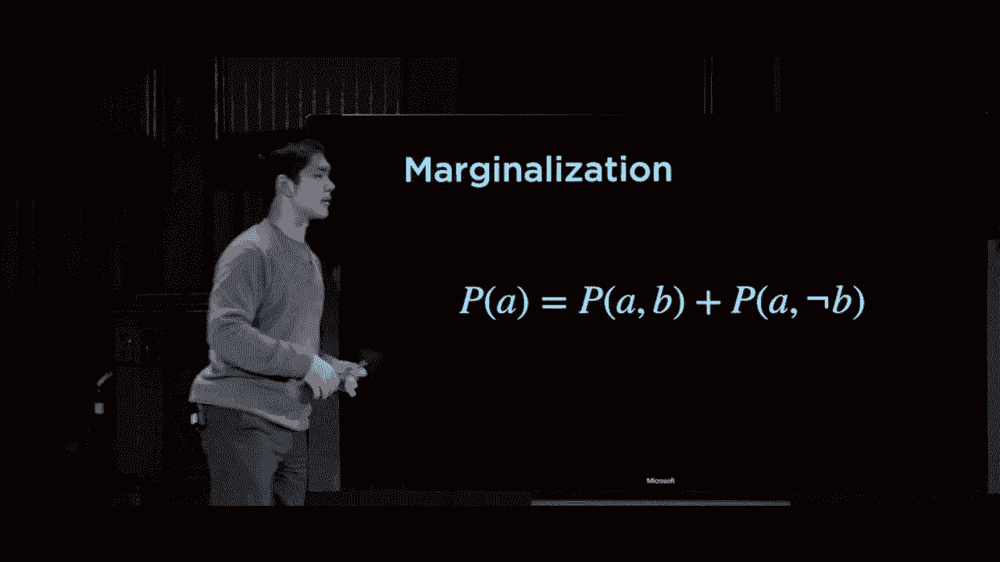


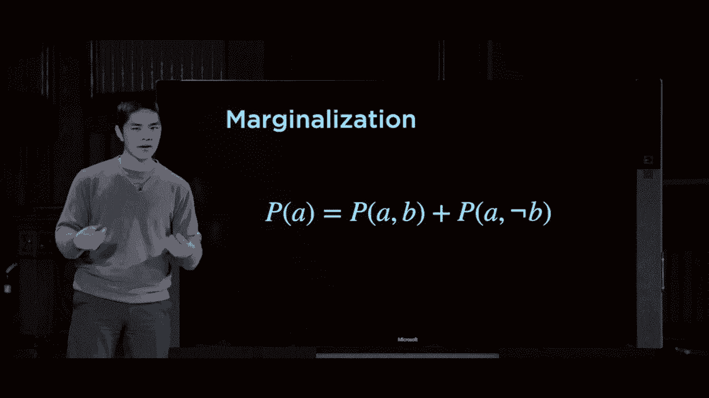

| 早上阴天 (C) | 下午下雨 (R) | 联合概率 P(C, R) |
| :--- | :--- | :--- |
| 是 | 是 | 0.08 |
| 是 | 否 | 0.32 |
| 否 | 是 | 0.02 |
| 否 | 否 | 0.58 |


这个表格告诉我们，例如，`P(C=阴天, R=下雨) = 0.08`，即早上阴天**且**下午下雨的概率是 8%。


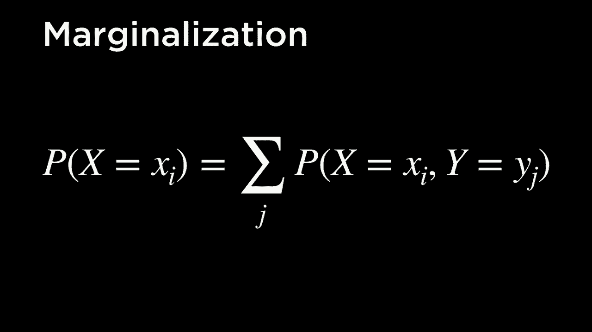

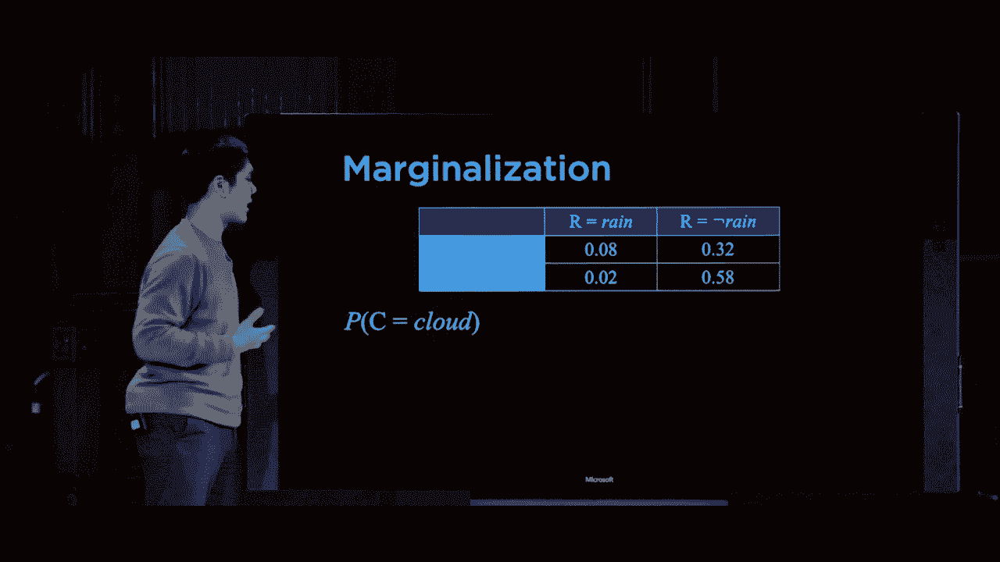

利用联合概率，我们可以计算**条件概率**。例如，我们想知道“在已知下午下雨的条件下，早上阴天的概率”，即 `P(C=阴天 | R=下雨)`。

根据条件概率公式：
`P(A | B) = P(A, B) / P(B)`

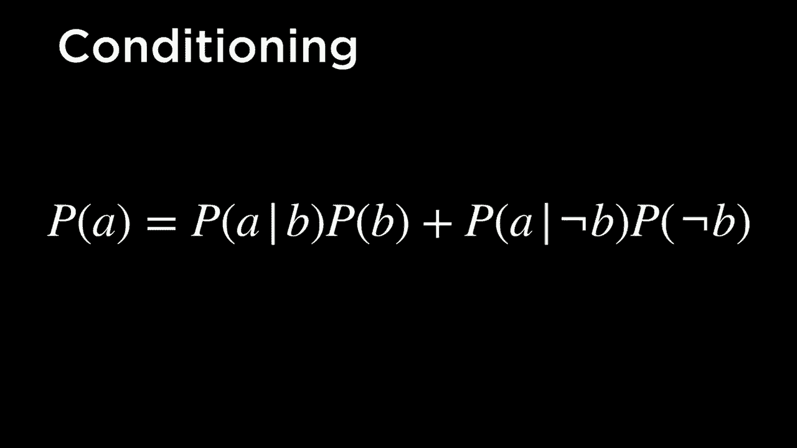


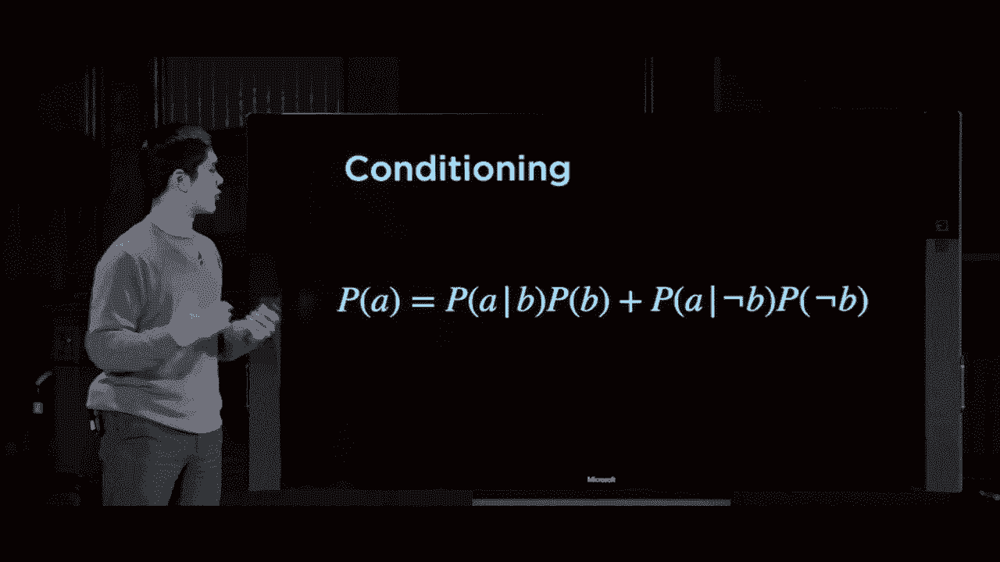

我们可以计算：
`P(C=阴天 | R=下雨) = P(C=阴天, R=下雨) / P(R=下雨) = 0.08 / 0.1 = 0.8`

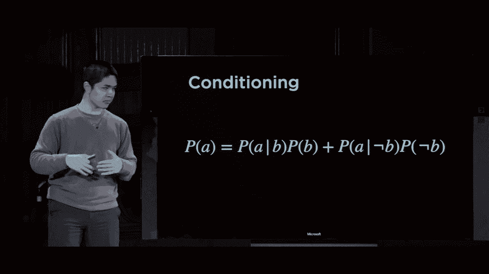


这里有一个关键思想：**条件概率与联合概率成正比**。我们常写作：
`P(C | R=下雨) ∝ P(C, R=下雨)`
其中 `∝` 表示“成正比”，我们只需要找到一个归一化常数 `α`，使得所有概率之和为 1。在上例中，`P(C=阴天, R=下雨)=0.08`，`P(C=不阴天, R=下雨)=0.02`，总和为 0.1。乘以 `α=10` 后，我们得到归一化的条件概率分布：`{阴天: 0.8, 不阴天: 0.2}`。

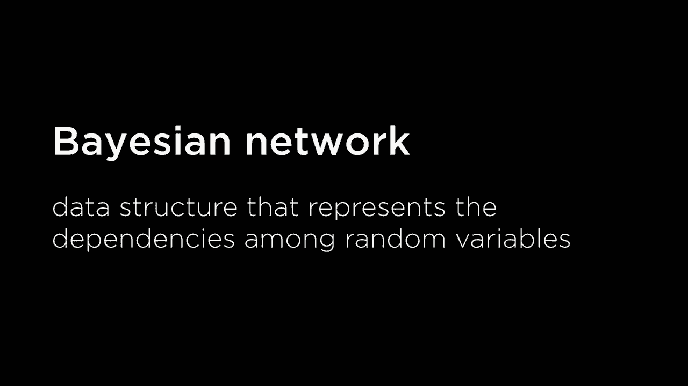

## 📚 重要的概率规则

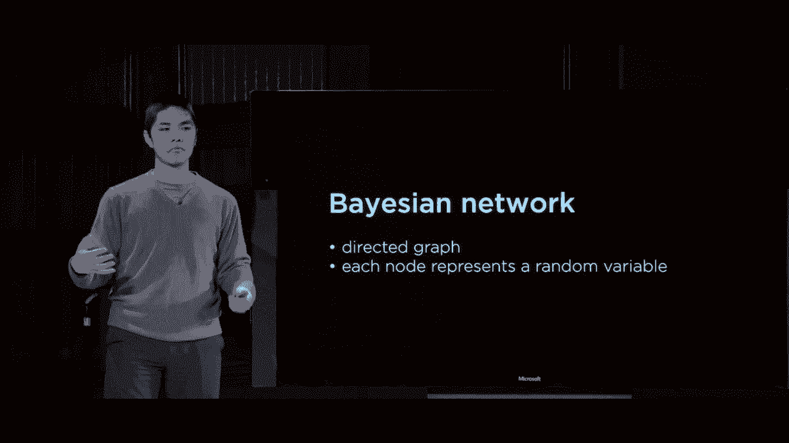

基于联合概率和条件概率，有几个重要的概率规则对我们后续的分析非常有用。


以下是几个核心的概率规则：


1.  **否定规则**：事件 `A` 不发生的概率是 1 减去它发生的概率。
    `P(¬A) = 1 - P(A)`

2.  **加法规则（容斥原理）**：事件 `A` **或** 事件 `B` 发生的概率。
    `P(A ∨ B) = P(A) + P(B) - P(A ∧ B)`
    我们需要减去 `P(A ∧ B)` 以避免将 `A` 和 `B` 同时发生的情况重复计算两次。

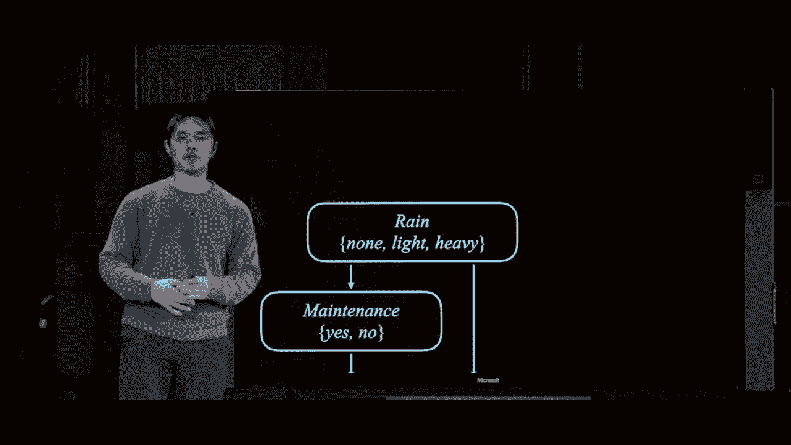

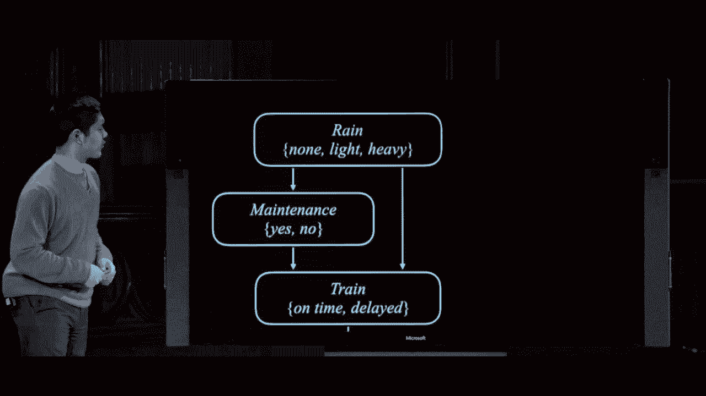

3.  **边际化规则**：通过求和“隐藏”变量所有可能取值下的联合概率，来计算某个变量的（无条件）概率。
    *   对于事件：`P(A) = P(A ∧ B) + P(A ∧ ¬B)`
    *   对于随机变量（更通用的形式）：`P(X=x_i) = Σ_j P(X=x_i, Y=y_j)`
        其中 `Σ_j` 表示对随机变量 `Y` 所有可能的取值 `y_j` 进行求和。

    例如，利用前面的联合概率表计算 `P(C=阴天)`：
    `P(C=阴天) = P(C=阴天, R=下雨) + P(C=阴天, R=不下雨) = 0.08 + 0.32 = 0.4`

4.  **条件化规则**：边际化规则的条件概率版本。
    *   对于事件：`P(A) = P(A | B) * P(B) + P(A | ¬B) * P(¬B)`
    *   对于随机变量：`P(X=x_i) = Σ_j P(X=x_i | Y=y_j) * P(Y=y_j)`

## 🕸️ 贝叶斯网络

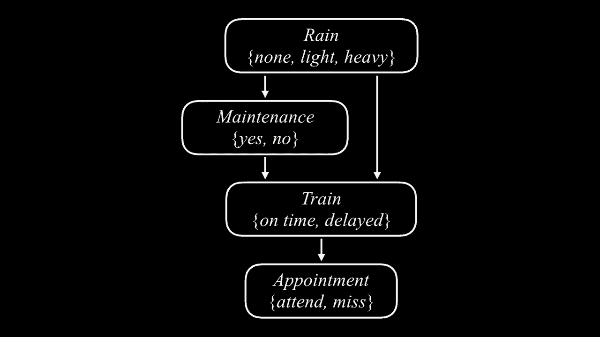

现实世界中的随机变量通常不是独立的，它们之间存在依赖关系。**贝叶斯网络**是一种用于表示这些依赖关系的概率图模型。

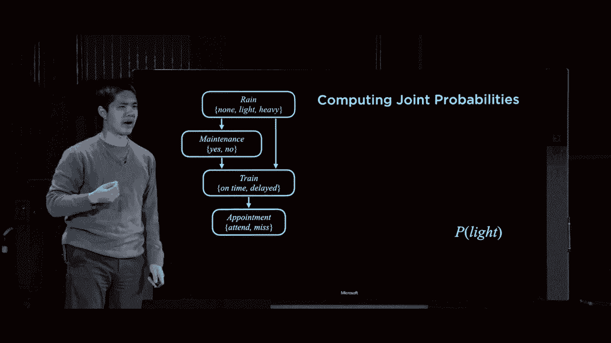

一个贝叶斯网络是一个**有向无环图**：
*   **节点**：代表随机变量（例如：天气、火车是否准点）。
*   **边（箭头）**：表示变量间的依赖关系。如果有一条从节点 `X` 指向节点 `Y` 的边，那么 `X` 被称为 `Y` 的**父节点**，表示 `Y` 的概率分布依赖于 `X` 的取值。
*   **条件概率表**：每个节点都附有一个条件概率分布 `P(节点 | 父节点)`。对于没有父节点的根节点，则是其无条件概率分布。

### 贝叶斯网络实例：赴约之旅


假设我们要去城外赴约，需要考虑以下因素：
1.  **降雨 (Rain)**：可能为 `无雨`、`小雨`、`大雨`。
2.  **轨道维护 (Maintenance)**：可能为 `有` 或 `无`。大雨可能减少维护的概率。
3.  **火车准点 (Train)**：可能为 `准点` 或 `延误`。受降雨和维护情况影响。
4.  **赴约 (Appointment)**：可能为 `参加` 或 `错过`。直接受火车是否准点影响。


我们可以构建如下贝叶斯网络：
```
        Rain
       /    \
      /      \
Maintenance  Train
              \
               \
            Appointment
```
*   箭头从 `Rain` 指向 `Maintenance` 和 `Train`，表示这两个变量的概率受降雨影响。
*   箭头从 `Maintenance` 指向 `Train`，表示火车是否准点也受维护情况影响。
*   箭头从 `Train` 指向 `Appointment`，表示能否赴约直接取决于火车是否准点。

每个节点都有自己的（条件）概率表，例如：
*   `P(Rain)`：根节点的无条件分布。`{无雨: 0.7, 小雨: 0.2, 大雨: 0.1}`
*   `P(Maintenance | Rain)`：条件概率表。
    | Rain | P(Maintenance=有) | P(Maintenance=无) |
    | :--- | :--- | :--- |
    | 无雨 | 0.4 | 0.6 |
    | 小雨 | 0.2 | 0.8 |
    | 大雨 | 0.1 | 0.9 |
*   `P(Train | Rain, Maintenance)`：依赖于两个父节点的条件概率表。
*   `P(Appointment | Train)`：条件概率表。


### 使用贝叶斯网络进行推理


贝叶斯网络的核心用途是进行**概率推理**：在观察到某些变量（证据）后，计算其他变量（查询变量）的概率分布。

推理问题包含：
*   **查询变量 (X)**：我们想了解其分布的变量（例如：`Appointment`）。
*   **证据变量 (E)**：我们已经观察到的变量及其取值（例如：`Rain=小雨`, `Maintenance=无`）。
*   **隐藏变量 (Y)**：既非查询也非证据的变量（例如：`Train`）。

一种基础的推理算法是**枚举推理**。其核心思想是利用条件概率的定义和边际化规则：
`P(X | e) ∝ Σ_y P(X, e, y)`
其中，`Σ_y` 表示对**所有隐藏变量 `Y` 的所有可能取值组合 `y`** 进行求和。`P(X, e, y)` 是联合概率，可以通过贝叶斯网络中每个节点的条件概率表相乘得到。

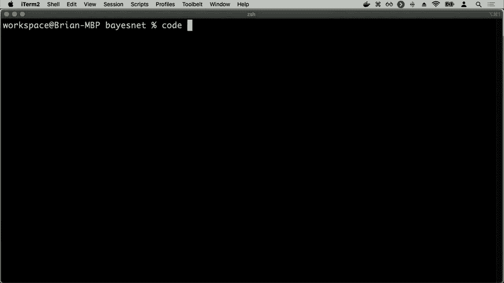

最后，需要对结果进行归一化，使其总和为 1。

## 💻 Python 实现：使用 `pomegranate` 库


在实际应用中，我们可以使用 Python 库（如 `pomegranate`）来构建贝叶斯网络并进行推理，而无需手动实现复杂的数学计算。

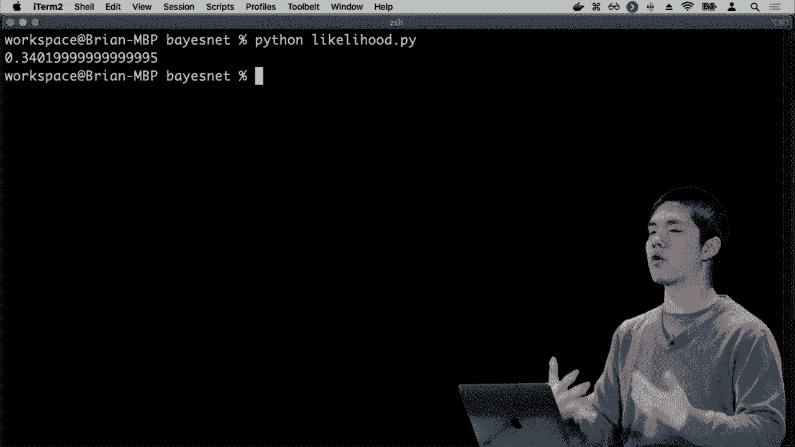


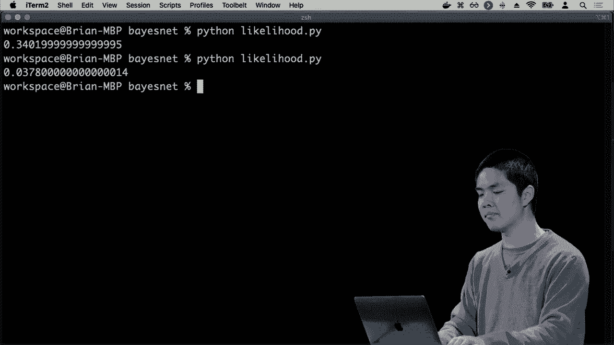

以下是使用 `pomegranate` 库的基本步骤：

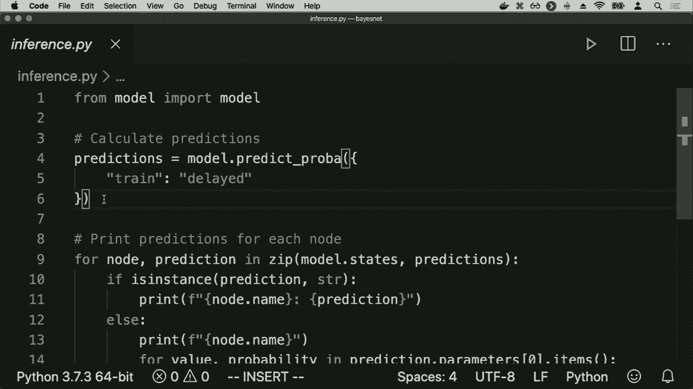

1.  **定义节点及其概率分布**：
    ```python
    from pomegranate import *

    # 定义根节点：降雨
    rain = DiscreteDistribution({'无雨': 0.7, '小雨': 0.2, '大雨': 0.1})

    # 定义条件概率节点：轨道维护（依赖于降雨）
    maintenance = ConditionalProbabilityTable(
        [['无雨', '有', 0.4],
         ['无雨', '无', 0.6],
         ['小雨', '有', 0.2],
         ['小雨', '无', 0.8],
         ['大雨', '有', 0.1],
         ['大雨', '无', 0.9]], [rain])

    # 类似地定义 Train 和 Appointment 节点...
    ```
2.  **创建节点状态并构建网络**：
    ```python
    s1 = State(rain, name="rain")
    s2 = State(maintenance, name="maintenance")
    # ... 创建其他状态

    network = BayesianNetwork("赴约之旅")
    network.add_states(s1, s2, s3, s4) # 添加所有状态
    network.add_edge(s1, s2) # Rain -> Maintenance
    network.add_edge(s1, s3) # Rain -> Train
    network.add_edge(s2, s3) # Maintenance -> Train
    network.add_edge(s3, s4) # Train -> Appointment
    network.bake() # 最终化模型
    ```
3.  **进行概率计算与推理**：
    ```python
    # 计算联合概率：无雨、无维护、火车准点、能赴约
    prob = network.probability([['无雨', '无', '准点', '参加']])
    print(f"联合概率: {prob}")

    # 进行推理：已知火车延误，预测其他变量的分布
    beliefs = network.predict_proba({'train': '延误'})
    for state, belief in zip(network.states, beliefs):
        print(f"{state.name}: {belief}")
    ```
通过库函数，我们可以轻松计算复杂场景下的概率，并基于观察到的证据进行推理，得出其他未知变量的概率分布。

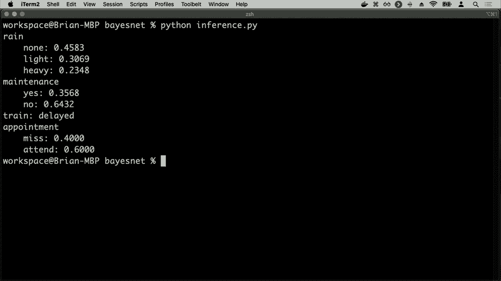

## 🎯 总结


本节课中我们一起学习了：
1.  **联合概率**：用于描述多个事件同时发生的可能性，是计算条件概率的基础。
2.  **重要的概率规则**：包括否定规则、加法规则、边际化规则和条件化规则，这些是进行概率推导的基石。
3.  **贝叶斯网络**：一种用有向图表示随机变量间依赖关系的强大模型。每个节点关联一个条件概率表。
4.  **概率推理**：在贝叶斯网络中，根据已知证据，计算查询变量的后验概率分布。枚举推理是一种基础方法。
5.  **实践工具**：我们可以利用如 `pomegranate` 这样的 Python 库来方便地构建贝叶斯网络并执行推理任务，从而将理论应用于实际问题。


贝叶斯网络为我们处理不确定性问题提供了一个结构化的框架，是人工智能中表示知识和进行推理的关键技术之一。