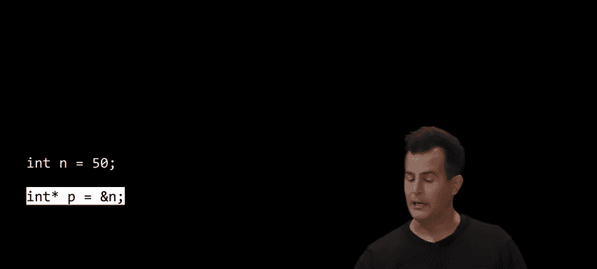
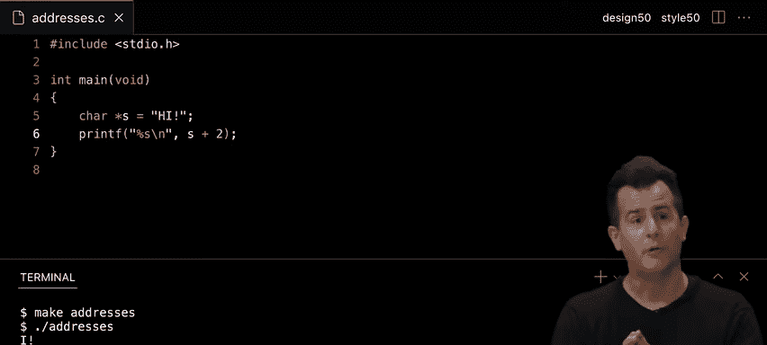
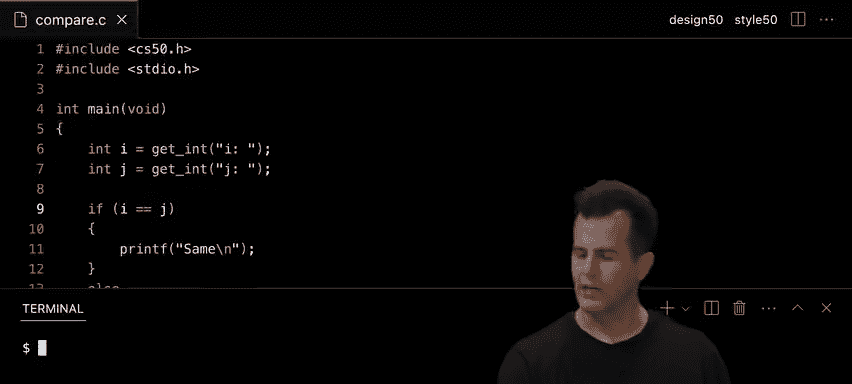
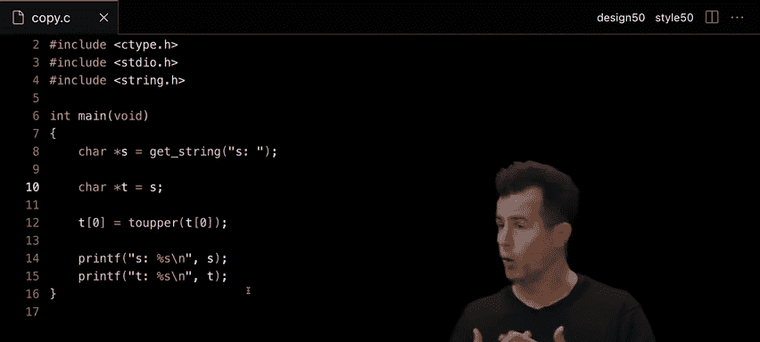
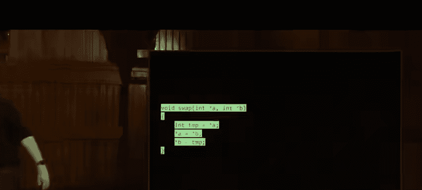
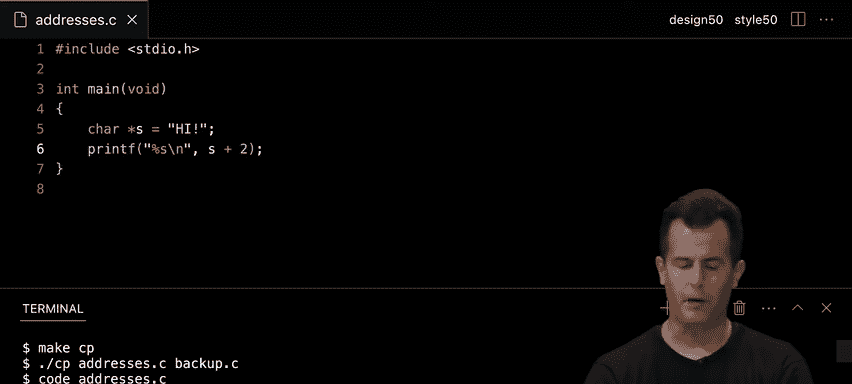
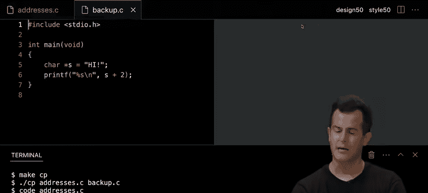

# 001：内存

## 概述

在本节课中，我们将要学习计算机内存的底层工作原理，包括指针、内存地址、十六进制表示法，以及如何通过C语言直接操作内存。我们还将探讨字符串的真实本质、动态内存分配，并理解一些常见编程错误的根源。

---

## 内存与图像表示 🖼️


上一节我们介绍了课程的整体目标，本节中我们来看看计算机如何表示像图像这样的信息。

图像由像素组成，每个像素由若干比特或字节来描述其颜色。但图像中的信息是有限的。放大图像并不会让你看得更清楚，只会让像素点变得更大，从而看到图像的“抖动”效果，即像素之间的硬边缘。

那么，如何实现或表示一个图像呢？有多种图像文件格式，如GIF、JPEG、PNG等。但其中最简单的位图（bitmap）图像，本质上就是一张水平和垂直方向上的比特地图。


例如，这里有一个由0和1组成的网格。假设0代表黑色，1代表白色。你能看出这是什么图像吗？


这是一个笑脸。因为如果0是黑色，1是白色，那么这张图像实际上描绘的就是一个笑脸。当然，在这个尺寸下很难看清。但如果我们将它缩小，并使用正方形的黑白像素，图像就会清晰得多。


当然，只用单个像素（即1比特）来存储信息并不实用，因为它只能表示两种状态（如黑和白）。对于彩色图像，我们需要更多的比特来表示每个像素，通常需要24比特（3字节）来分别表示红、绿、蓝（RGB）三种颜色。




---

## 十六进制表示法 🔢

在深入探讨内存操作之前，我们需要扩充一下我们的词汇表，引入另一种进制系统。

我们已经有二进制（基数为2）和十进制（基数为10）。今天，我们将引入十六进制（基数为16），这在计算机内存和图像处理中非常有用。

如果你接触过网页设计或图像编辑软件（如Photoshop），你可能已经见过十六进制表示法。例如，在颜色选择器中，你可能会看到类似 `#000000` 的代码，这表示黑色（没有红、绿、蓝）。而 `#FFFFFF` 则表示白色（最大值的红、绿、蓝）。

十六进制使用16个符号：0-9 和 A-F。其中，A代表10，B代表11，依此类推，F代表15。这样，我们就可以用单个符号表示0到15的值。

十六进制之所以有用，是因为一个十六进制数字（0-F）正好可以用4个二进制位（比特）来表示。而两个十六进制数字（例如 `FF`）可以表示一个字节（8比特）的所有可能值（0-255），这比用8个二进制数字表示要简洁得多。

在计算机科学中，我们经常用十六进制来表示内存地址。为了与十进制数字区分，我们通常在十六进制数前加上 `0x` 前缀。例如，`0x123` 表示一个十六进制数。

---

## 指针与内存地址 🧭


上一节我们介绍了十六进制，本节中我们来看看如何利用它来理解和操作内存地址。


在C语言中，我们可以使用 `&`（取地址）运算符来获取一个变量的内存地址，使用 `*`（解引用）运算符来访问该地址存储的值。`printf` 函数中的 `%p` 格式说明符用于打印地址（指针）。

考虑以下简单的代码：
```c
int n = 50;
printf("%p\n", &n);
```
这段代码会打印出变量 `n` 在内存中的地址，这个地址通常是一个很大的十六进制数。

为了存储地址，我们需要指针变量。指针是一个存储其他变量地址的变量。

声明指针的语法如下：
```c
int *p = &n;
```
这里，`int *p` 声明了一个指向整数的指针 `p`，并将 `n` 的地址赋值给它。




我们可以通过解引用指针来访问或修改它指向的值：
```c
printf("%i\n", *p); // 打印 n 的值，即 50
*p = 100; // 将 n 的值改为 100
```





指针本身也是一个变量，它存储在内存中的某个地址上，并且通常占用8个字节（64位系统）。

---

## 字符串的本质 🧵

上一节我们探讨了指针，本节中我们来看看一个我们一直在使用的概念——字符串——在C语言中的真实本质。

在C语言中，实际上并没有名为 `string` 的内置数据类型。我们一直使用的 `string` 类型，实际上是CS50库通过 `typedef` 定义的一个别名。

字符串在C语言中本质上是一个字符数组，以空字符 `\0` 结尾。更准确地说，一个字符串变量（如 `char *s`）存储的是该字符数组中第一个字符的地址。




例如：
```c
char *s = "HI!";
```
在内存中，`s` 是一个指针，它存储着字符 `'H'` 的地址。后续的字符 `'I'`、`'!'` 和 `\0` 依次存储在相邻的内存位置。

因此，当我们使用 `printf("%s", s)` 时，`printf` 函数从 `s` 指向的地址开始，逐个打印字符，直到遇到空字符 `\0` 为止。

这意味着字符串的比较不能使用 `==` 运算符，因为 `==` 比较的是两个指针（地址）是否相等，而不是字符串的内容是否相同。正确的字符串比较应使用 `strcmp` 函数。


---

## 动态内存分配与复制 📝

上一节我们揭示了字符串的指针本质，本节中我们来看看如何正确地复制和操作字符串，这涉及到动态内存分配。

简单地使用赋值操作符复制字符串指针，只会复制地址，而不会复制字符数据本身。这会导致两个指针指向同一块内存，修改一个会影响另一个。

为了创建字符串的真正独立副本，我们需要：
1.  使用 `malloc` 函数分配足够的新内存。
2.  使用 `strcpy` 函数（或手动循环）将原字符串的内容复制到新内存中。
3.  使用完毕后，使用 `free` 函数释放分配的内存，防止内存泄漏。

以下是手动复制字符串的示例：
```c
char *source = get_string("Input: ");
// 分配内存，+1 是为了存放空字符 \0
char *dest = malloc(strlen(source) + 1);
// 检查 malloc 是否成功
if (dest == NULL) {
    return 1;
}
// 复制字符，包括 \0
for (int i = 0; i <= strlen(source); i++) {
    dest[i] = source[i];
}
// 使用 dest...
free(dest); // 释放内存
```
在实际编程中，我们通常直接使用 `strcpy(dest, source)` 来完成复制。

`malloc` 可能失败（例如内存不足），此时它会返回 `NULL`。因此，检查 `malloc` 的返回值是良好的编程习惯。

---


## 内存错误与调试工具 🐛

上一节我们学习了如何分配内存，本节中我们来看看与之相关的常见错误以及如何发现它们。

直接操作内存带来了强大的能力，也带来了风险。常见的错误包括：
*   **缓冲区溢出**：访问数组或分配内存块之外的数据。
*   **使用未初始化的指针**：指针包含垃圾地址，解引用会导致访问非法内存。
*   **内存泄漏**：分配了内存但忘记释放。
*   **释放后使用**：释放了内存后，仍然尝试访问它。

为了帮助发现这些错误，我们可以使用名为 **Valgrind** 的工具。Valgrind 可以检测程序中的内存管理问题，如内存泄漏、非法读写等。

使用 Valgrind 的基本命令是：
```bash
valgrind ./your_program
```
Valgrind 的输出可能看起来很复杂，但关键是要寻找错误信息，例如“Invalid write of size 4”或“bytes in blocks are definitely lost”，并注意它指出的文件名和行号。

---

## 堆、栈与函数参数传递 🥞

上一节我们介绍了内存错误，本节中我们来看看程序运行时内存是如何组织的，以及这如何影响函数的行为。




程序运行时，内存被划分为几个区域：
*   **代码区**：存储程序的机器指令。
*   **全局/静态区**：存储全局变量和静态变量。
*   **堆**：用于动态内存分配（`malloc`）。堆从低地址向高地址增长。
*   **栈**：用于函数调用。存储局部变量、函数参数和返回地址。栈从高地址向低地址增长。

当函数被调用时，会在栈上为其分配一个“栈帧”。函数内的局部变量和参数都存储在这个帧中。

在C语言中，函数参数默认是 **按值传递** 的。这意味着传递给函数的是实参值的副本。因此，在函数内部修改参数，不会影响函数外部的原始变量。

如果希望函数修改外部变量，需要传递该变量的 **地址**（即指针）。这被称为 **按引用传递**（实际上是通过传递地址的值来实现）。


例如，一个交换两个变量值的函数 `swap` 需要接收指针：
```c
void swap(int *a, int *b) {
    int tmp = *a;
    *a = *b;
    *b = tmp;
}
// 调用时
int x = 1, y = 2;
swap(&x, &y);
```


---

## 文件输入/输出 📁

上一节我们探讨了内存布局，本节中我们来看看如何利用这些知识进行文件操作，这是本周问题集的核心。

C语言提供了一系列函数用于文件操作，如 `fopen`, `fclose`, `fprintf`, `fscanf`, `fread`, `fwrite` 等。

要操作一个文件，首先需要获取一个指向该文件的指针（`FILE *`）：
```c
FILE *file = fopen("filename.txt", "r"); // "r" 表示读取模式
if (file == NULL) {
    // 处理错误，例如文件不存在
}
// ... 操作文件
fclose(file); // 关闭文件
```

常见的文件模式有：
*   `"r"`：读取。
*   `"w"`：写入（会覆盖已存在文件）。
*   `"a"`：追加。
*   `"r+"`：读写。

我们可以使用 `fprintf` 向文件写入格式化的文本，就像使用 `printf` 向屏幕输出一样：
```c
fprintf(file, "Name: %s, Age: %d\n", name, age);
```

对于非文本文件（如图像），我们可以使用 `fread` 和 `fwrite` 进行二进制读写，按字节处理数据。

---

## 总结





本节课中我们一起深入探索了计算机内存的底层世界。我们学习了：
*   如何使用十六进制表示内存地址。
*   **指针** 的概念，以及如何使用 `&` 和 `*` 运算符。
*   字符串在C语言中实际上是 **字符指针**，以空字符结尾。
*   如何使用 `malloc` 和 `free` 进行 **动态内存分配** 与管理。
*   常见的 **内存错误**（如缓冲区溢出、内存泄漏）及其危害。
*   如何使用 **Valgrind** 工具调试内存问题。
*   程序内存的布局：**堆** 和 **栈**，以及它们对函数参数传递（**按值传递** vs **按引用传递**）的影响。
*   如何进行 **文件输入/输出** 操作。


这些概念是理解计算机如何工作的关键，也是完成本周问题集（涉及图像处理和文件恢复）的基础。虽然指针和内存管理初学时有挑战性，但掌握它们将极大地提升你解决问题的能力。