# 003：数组

在本节课中，我们将学习数组的概念，这是C语言中用于存储多个同类型数据项的一种数据结构。我们将探讨如何声明、初始化和使用数组，以及如何利用数组来解决实际问题，例如计算平均值和操作字符串。此外，我们还将深入了解程序的编译过程、调试技巧以及命令行参数的使用。

---

## 调试技巧 🐛

上一节我们介绍了数组的基本概念，本节中我们来看看如何调试程序中的错误。调试是编程中不可或缺的一部分，它帮助我们识别和修复代码中的问题。

### 语法错误与逻辑错误

在编程中，错误主要分为两类：语法错误和逻辑错误。语法错误会阻止程序编译，而逻辑错误则会导致程序运行结果不符合预期。

例如，以下代码存在语法错误：

```c
#include <stdio.h>

int main(void)
{
    printf("Hello, world")
}
```

缺少分号会导致编译失败。编译器会显示错误信息，提示我们缺少分号。

### 使用 `printf` 进行调试

`printf` 函数不仅可以用于输出结果，还可以作为调试工具，帮助我们了解程序执行过程中的变量值。

例如，以下代码用于打印三个砖块，但错误地打印了四个：

```c
#include <stdio.h>

int main(void)
{
    for (int i = 0; i <= 3; i++)
    {
        printf("#\n");
    }
}
```

通过添加 `printf` 语句，我们可以查看循环变量 `i` 的值：

```c
#include <stdio.h>

int main(void)
{
    for (int i = 0; i <= 3; i++)
    {
        printf("i is %i\n", i);
        printf("#\n");
    }
}
```

运行程序后，我们会发现 `i` 的值从0到3，导致循环执行了四次。通过这种方式，我们可以快速定位问题所在。

### 使用 `debug50` 进行调试

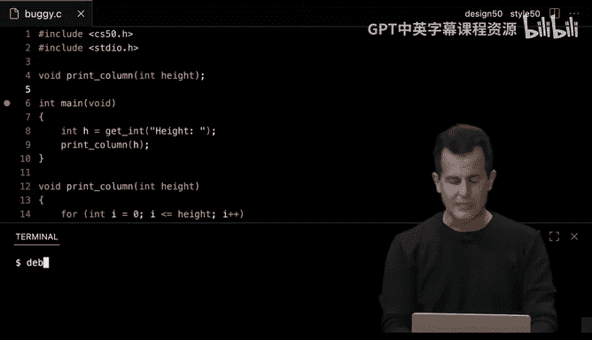

`debug50` 是一个强大的调试工具，允许我们逐行执行代码，并查看变量的实时值。

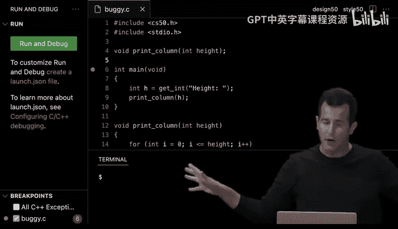

以下是使用 `debug50` 的步骤：

1.  在代码行号左侧点击，设置断点。
2.  在终端中运行 `debug50 ./program_name`。
3.  使用调试器控制按钮逐步执行代码。

通过 `debug50`，我们可以更直观地观察程序执行过程，从而更容易发现逻辑错误。

---

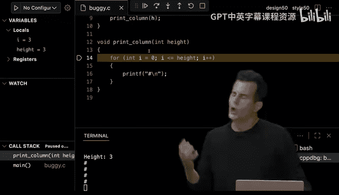

## 编译过程详解 🔧

上一节我们学习了调试技巧，本节中我们来看看程序从源代码到可执行文件的完整编译过程。编译过程包括四个主要步骤：预处理、编译、汇编和链接。

### 预处理

预处理阶段处理源代码中以 `#` 开头的指令，例如 `#include`。预处理器会将头文件的内容复制到源代码中。

例如，以下代码：

```c
#include <stdio.h>
#include <cs50.h>

int main(void)
{
    string name = get_string("What's your name? ");
    printf("Hello, %s\n", name);
}
```

在预处理后，`stdio.h` 和 `cs50.h` 中的函数原型会被插入到源代码中，使编译器知道 `printf` 和 `get_string` 的存在。

### 编译

编译阶段将预处理后的代码转换为汇编代码。汇编代码是一种低级语言，更接近机器指令。

例如，以下C代码：

```c
int main(void)
{
    printf("Hello, world\n");
}
```

可能被编译为类似以下的汇编代码：

```assembly
main:
    push    rbp
    mov     rbp, rsp
    mov     edi, OFFSET FLAT:.LC0
    call    puts
    mov     eax, 0
    pop     rbp
    ret
```

### 汇编

汇编阶段将汇编代码转换为机器代码，即由0和1组成的二进制指令。

### 链接

链接阶段将生成的机器代码与库文件（如 `cs50` 库和标准库）的机器代码合并，形成最终的可执行文件。

例如，使用 `clang` 编译程序时，需要链接 `cs50` 库：

```bash
clang -o hello hello.c -lcs50
```

`make` 命令自动完成了这些步骤，简化了编译过程。

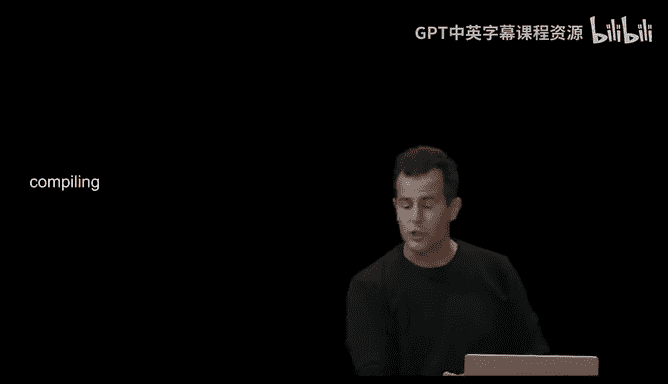

---

## 数组基础 📊

上一节我们深入了解了编译过程，本节中我们来看看数组的基本概念和用法。数组是一种用于存储多个同类型数据项的数据结构。

### 声明和初始化数组

以下是声明和初始化数组的示例：

```c
int scores[3];
scores[0] = 72;
scores[1] = 73;
scores[2] = 33;
```

或者，可以在声明时直接初始化数组：

```c
int scores[] = {72, 73, 33};
```

### 使用循环处理数组

通过循环，我们可以更高效地处理数组中的元素。例如，计算平均分：

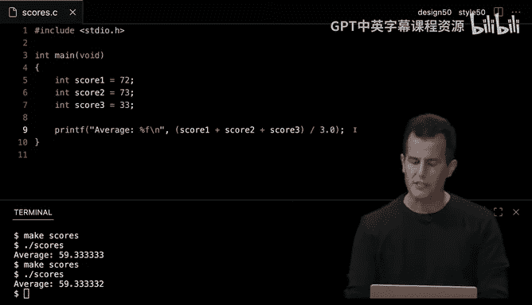

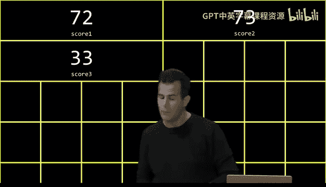

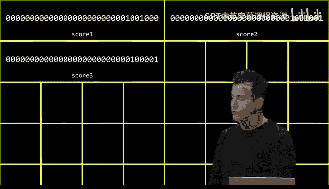

```c
#include <stdio.h>

float average(int length, int array[]);

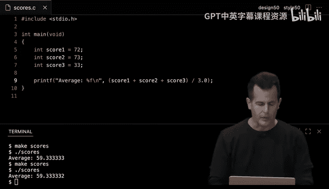

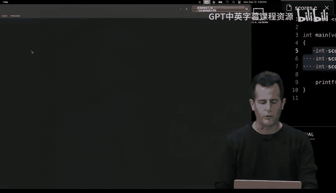

int main(void)
{
    int n = 3;
    int scores[n];

    for (int i = 0; i < n; i++)
    {
        scores[i] = get_int("Score: ");
    }

    printf("Average: %f\n", average(n, scores));
}

float average(int length, int array[])
{
    int sum = 0;
    for (int i = 0; i < length; i++)
    {
        sum += array[i];
    }
    return (float) sum / length;
}
```

### 数组在内存中的布局

数组在内存中是连续存储的。例如，`int scores[3]` 会占用12个字节（每个 `int` 占4个字节），依次存储三个整数值。

---

## 字符串与数组 🔤

上一节我们介绍了数组的基本操作，本节中我们来看看字符串在C语言中的实现。字符串本质上是一个字符数组，以空字符 `\0` 结尾。

### 字符串作为字符数组

以下代码演示了字符串的存储方式：

```c
#include <stdio.h>
#include <cs50.h>
#include <string.h>

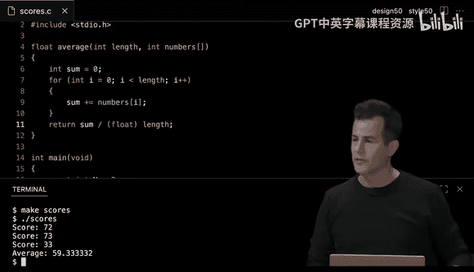

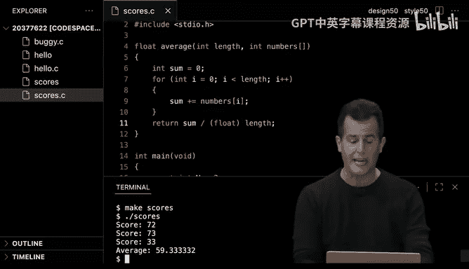

int main(void)
{
    string s = "HI!";
    printf("%c %c %c %c\n", s[0], s[1], s[2], s[3]);
}
```

输出结果为：

```
H I ! 
```

注意，字符串 `"HI!"` 实际上包含四个字符：`'H'`、`'I'`、`'!'` 和 `'\0'`。

### 使用 `strlen` 获取字符串长度

`string.h` 库提供了 `strlen` 函数，用于计算字符串的长度（不包括空字符）。

```c
#include <stdio.h>
#include <cs50.h>
#include <string.h>

int main(void)
{
    string name = get_string("Name: ");
    printf("Length: %i\n", strlen(name));
}
```

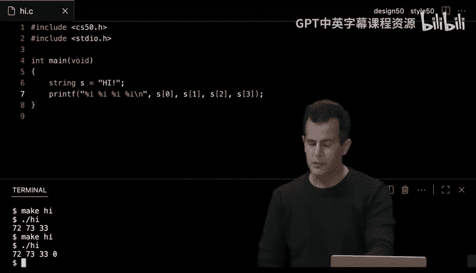

### 字符串数组

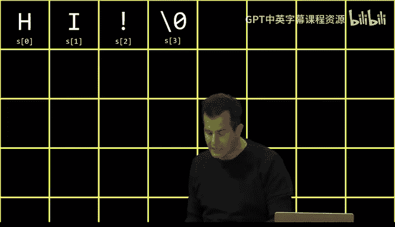

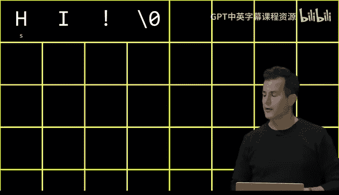

字符串数组实际上是二维字符数组。例如：

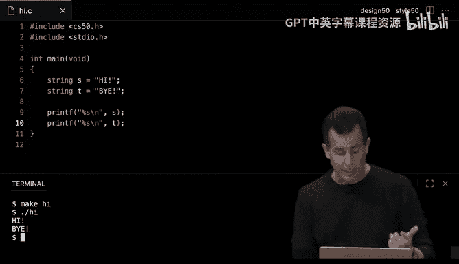

```c
#include <stdio.h>
#include <cs50.h>

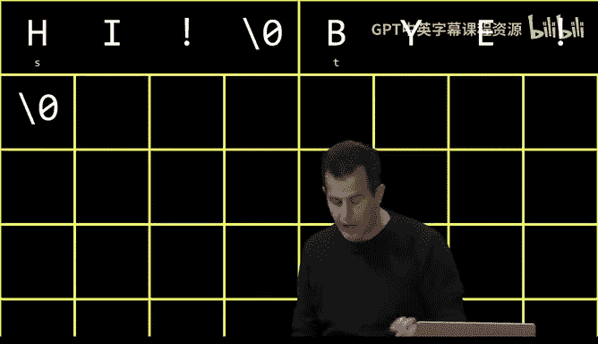

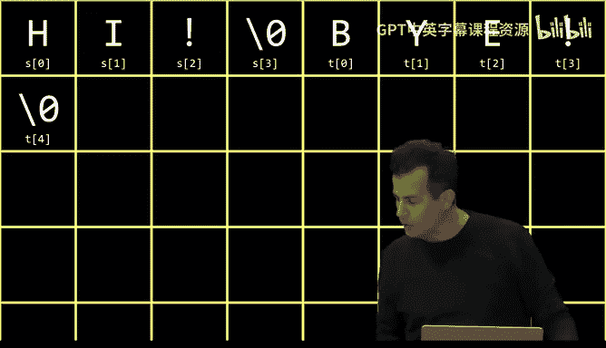

int main(void)
{
    string words[2];
    words[0] = "HI!";
    words[1] = "BYE!";

    printf("%s\n", words[0]);
    printf("%s\n", words[1]);
}
```

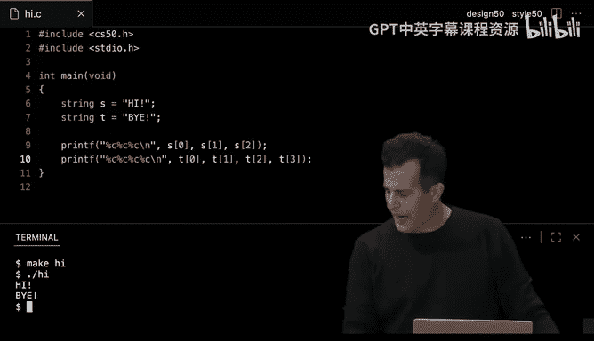

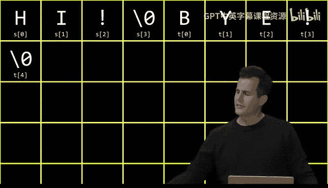

---

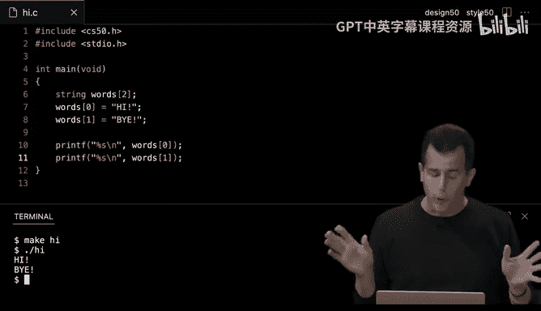

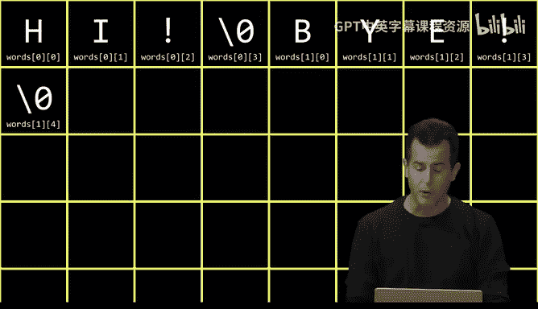

## 命令行参数 🖥️

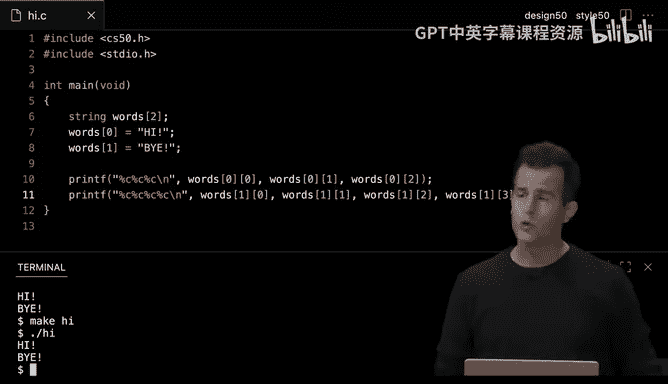

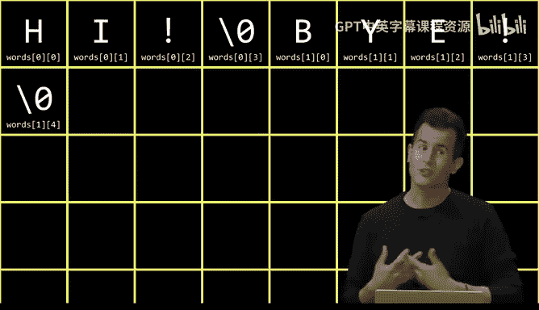

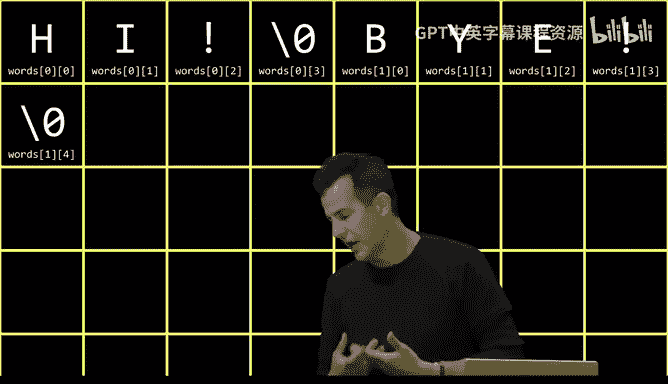

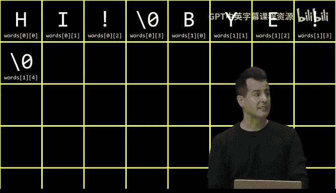

上一节我们探讨了字符串与数组的关系，本节中我们来看看如何使用命令行参数。命令行参数允许用户在运行程序时传递输入。

### `main` 函数的参数

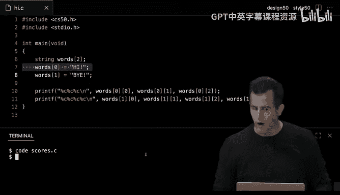

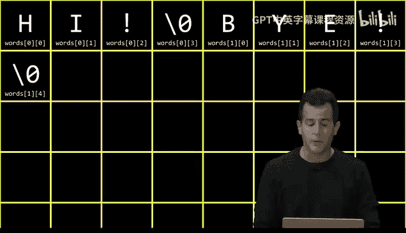

`main` 函数可以接受两个参数：`argc` 和 `argv`。`argc` 表示参数的数量，`argv` 是一个字符串数组，包含所有参数。

```c
#include <stdio.h>
#include <cs50.h>

int main(int argc, string argv[])
{
    if (argc == 2)
    {
        printf("Hello, %s\n", argv[1]);
    }
    else
    {
        printf("Hello, world\n");
    }
}
```

### 使用命令行参数

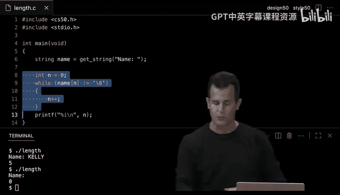

运行程序时，可以传递参数：

```bash
./greet David
```

输出结果为：

```
Hello, David
```

如果未提供参数，则输出：

```
Hello, world
```

### 退出状态

`main` 函数可以返回一个退出状态，表示程序执行的成功或失败。通常，返回 `0` 表示成功，非零值表示错误。

```c
#include <stdio.h>
#include <cs50.h>

int main(int argc, string argv[])
{
    if (argc != 2)
    {
        printf("Missing command line argument\n");
        return 1;
    }
    printf("Hello, %s\n", argv[1]);
    return 0;
}
```

---

## 加密简介 🔐

上一节我们学习了命令行参数的使用，本节中我们来看看加密的基本概念。加密是将信息转换为密文的过程，以确保只有授权用户能够读取。

### 凯撒密码

凯撒密码是一种简单的加密算法，通过将字母按字母表顺序移动固定位置来加密文本。

例如，将字母移动1位：

-   明文：`HI!`
-   密文：`IJ!`

解密时，将字母反向移动相同位置即可恢复原文。

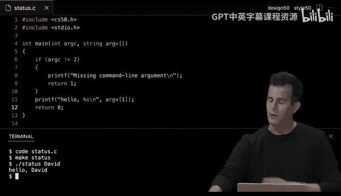

### 加密与解密算法

以下是凯撒密码的加密和解密示例：

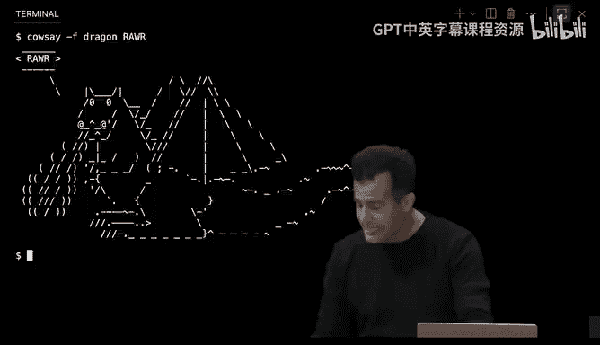

```c
#include <stdio.h>
#include <cs50.h>
#include <string.h>
#include <ctype.h>

int main(void)
{
    string plaintext = get_string("Plaintext: ");
    int key = 1;

    printf("Ciphertext: ");
    for (int i = 0; i < strlen(plaintext); i++)
    {
        if (isalpha(plaintext[i]))
        {
            char base = isupper(plaintext[i]) ? 'A' : 'a';
            printf("%c", (plaintext[i] - base + key) % 26 + base);
        }
        else
        {
            printf("%c", plaintext[i]);
        }
    }
    printf("\n");
}
```

---

## 总结 📝

本节课中我们一起学习了数组的基本概念和用法，包括如何声明、初始化和操作数组。我们还深入探讨了字符串作为字符数组的实现方式，以及如何使用命令行参数和调试工具。最后，我们简要介绍了加密的基本原理，为后续学习奠定了基础。通过本节课的内容，你应该能够更熟练地使用数组解决实际问题，并理解程序从源代码到可执行文件的完整过程。