# 004：算法


## 概述

在本节课中，我们将学习算法的核心概念，包括搜索和排序。我们将分析不同算法的效率，学习使用大O、Ω和Θ符号来描述算法的运行时间，并探索递归这一强大的编程技术。通过将算法从概念转化为实际代码，我们将建立起解决问题的不同思维模型。

---

## 算法简介

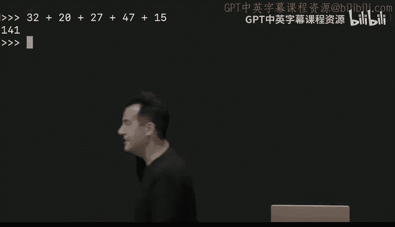


回想第0周的内容，算法就是解决某个问题的一系列步骤指令。排序信息，就像在现实世界中一样，意味着将其按从小到大、字母顺序或其他启发式方法进行排列。搜索则是寻找信息，正如我们在第0周所做的那样。

今天的目标之一是让你了解某些计算机科学的基础构建模块。例如，存在许多经典的算法，任何学习过计算机科学的人都会知道，任何技术面试官都会问到。但更重要的是，目标是通过让你了解这些真实世界的算法如何转化为你我都能控制的实际计算机代码，为你提供实际解决问题的不同思维模型和方法论。

---

## 点名的算法

我们想从一种实际的点名算法开始今天的内容。当然，我们通常使用外面的扫描仪来做这件事。但我们可以用老式的方法，只用我的手或我的大脑，开始数1，2，3，4，5，6，7，8，9，10，11，12，依此类推。这将需要相当多的步骤，因为我必须指向房间里的每个人并报出一个数字。

我可以做我小学老师教我的事，就是两个两个地数，这似乎更快。比如2，4，6，8，10，12，14，16，18，20。这听起来确实更快。但我想，如果运用一点直觉，回想一下第0周的内容，我敢说我们实际上可以做得比那好得多。

所以，如果你不介意，我想请你配合我们，所有人原地起立，并想着数字一，加入我们这个算法。

所以，起立。原地起立并想着数字一。在故事的这个节点，每个人都应该想着数字一。

这个算法的第二步对你来说将是：与一个站着的人配对。将他们的数字加到你的数字上，记住总和。开始。

在故事的这个节点，除了可能一个单独的人（如果房间里的人数是奇数），每个人都在想什么数字？2，好的，那么下一步。

每对中的一个人应该坐下。好的。很好，从没见过有人坐得这么快。

所以，你们这些还站着的人，算法还在继续。对于仍然站着的人，下一步是：如果仍然站着，回到第2步。也就是说，重复或循环。

请注意，如果你回到第2步，那会引导你到第3步，那会让你们中的一些人到第4步，这又引导你回到第2步。所以这是一个循环。

好的。继续，如果仍然站着，与另一个仍然站着的人配对，加在一起，然后你们中的一个人坐下。

所以随着每一秒过去，应该有越来越多的人坐下，越来越少的人站着。好的，几乎每个人都坐下了。你们彼此之间的距离越来越远，没关系。我可以在最后这里帮忙做一些算术。

好的，我看到你们中还有几个人站着。所以我来帮忙，把你们聚在一起。我看到你在这里中间。你的数字是多少？32，好的，请坐下。我把你和你的数字配对？20，好的，你可以坐下了。谁还站着？27，好的，你可以坐下。

你们还在加在一起，谁要继续站着？好的，你的数字是多少？最糟糕的部分是在拥挤的房间里做算术，但是。27也是。47，好的，你可以坐下。还有人站着吗？是的。很好，15。好的，你可以坐下。还有人站着吗？好的。

我所做的只是在最后这里自动化了将人们配对的过程。当我按下回车键时，我们应该会看到，哦，数字有点……那里怎么回事。好了。当我按下回车键时，我们将把所有剩下的数字加在一起。

如果你想想我们刚刚执行的算法，你们每个人都从数字一开始。然后你们中的一半人交出了你们的数字。然后你们中的一半人交出了你们的数字，然后你们中的一半人交出了你们的数字。所以理论上，我们开始时所有这些一都应该聚合到最终的计数中，如果这个房间不是这么大，这个计数就会在一个人脑中，他会宣布房间里总共有多少人。

我将通过按键盘上的回车键来加速这个过程。如果你的算法执行正确，房间里应该有141人，根据我们老式的人工方法。然而，凯莉手动一个一个地数，根据凯莉的说法，房间里总共有大约160人，我想是160。所以不完全一样，但已经很不错了。为你们的准确性鼓掌。

所以，理想情况下，一个一个地数会是完全正确的。我们只差了一点。现在，大概只是因为算法执行中的一些错误，也许一些心算没有完全按计划进行。但理论上，你们参与的第三个也是最后一个算法应该比我的算法或凯莉的算法快得多，无论我们是一个一个数还是两个两个数。为什么？回想第0周，当我们做整个电话簿的例子时，它的最终形式特别快，因为我们采用了分而治之的方法，把问题的一半去掉，再去掉一半。

尽管在这样的房间里很难看到，但可以推断，当你们都站着时，我们从第一个问题中咬了一大口，然后你们中的一半人坐下，一半人坐下，一半人坐下，理论上，如果你们在空间上更近，就会有一个单独的人拥有最终的计数。

---

## 算法分析

让我们看看是否可以通过考虑我们所做的事情来分析一下。

所以这是同一个算法。回想一下，在第0周，我们是如何通过电话簿（无论是数字形式，就像你在iPhone或Android设备上看到的那样）来寻找某人，比如约翰·哈佛，他可能在该电话簿的开头、中间或结尾，但我们分析了那个算法，就像我们现在可以分析这个一样。

所以，在我第一个口头化的算法1，2，3，4中，你可以将其画成一条直线，因为房间里的人数和所需时间之间的关系是线性的，是一条直线，每增加一个人，我就需要多一个步骤。所以，如果你想到高中数学，那里有一个斜率为一的直线。所以这个表示房间人数的数字n确实是一条直线，在x轴上，正如第0周一样，我们有问题的规模（人数），以及解决问题所需的时间（步骤数或秒数，无论你的度量单位是什么）。

如果我开始两个两个地数，2，4，6，8，10，依此类推，那仍然是一条直线，因为我持续地从问题中每次取走两个，直到最后可能只剩下一个人，但它仍然是一条直线。不过，无论问题规模如何，它都严格更快，因为如果你垂直画一条线，你会看到你先碰到黄线，然后才碰到红线，因为它本质上快了两倍。

但是第三个也是最后一个算法，尽管在现实中感觉花了很长时间，而且我不得不通过做一些算术来把我们带到激动人心的结论，但它看起来更像我们第三个也是最后一个电话簿的例子。因为如果你从相反的角度考虑，假设房间里的人数翻倍。那么，理论上你们所有人只需要多一个步骤。当然，可能还有其中的一些子步骤，但它本质上只是多了一个步骤。如果房间里的人数翻两番，是原来的四倍。那么，这只是多了两个步骤。相应地，使用第三个也是最后一个算法解决点名问题所需的时间增长得非常缓慢，因为在你开始感受到这种增长的影响之前，需要房间里的人数增加非常多。

所以今天，确实，当我们谈论算法的正确性时，我们也将讨论算法的设计，就像我们有代码一样。因为你的设计越聪明，你的算法最终效率就越高，其成本增长就越慢。这里的成本，我指的是时间，就像这里一样，也许是金钱，也许是你需要的存储空间量，任何有限的资源，我们最终可以度量的东西。我们不会非常精确地去做，实际上，我们将使用一些粗略的笔触和一些标准机制来描述算法或代码最终运行所需的时间。

---

## 运行时间与大O符号

我们如何做到这一点？上周，我们为讨论称为数组的东西奠定了基础，这是计算机内部最简单的数据结构，你只需取计算机中的内存，将其分成块，然后可以存储一堆整数、一堆字符串等，一个接一个地存储。这就是数组的关键特征，它是一块内存，其中的所有值都是背靠背存储的，即在内存中彼此相邻。

我们通过绘制这样的网格来相当抽象地表示这一点。我说，好吧，也许这是字节0，这是字节10亿，无论你拥有的内存总量是多少。我们放大并查看类似这样的东西，一块内存画布。我们讨论了可以放什么以及放在哪里。但今天，让我们假设我们目前需要1，2，3，4，5，6，7块内存。在它们里面，我们可能会放入像这里这些数字一样的东西。

计算机的有趣之处在于，即使我要求你们所有人“在这个数组中找到数字50”，我们的眼睛很快就能看到它在哪里，因为我们有整个屏幕的鸟瞰图，50在哪里很明显。但计算机和代码的难点在于，这些数组，这些内存块，实际上相当于一大堆关闭的门。计算机不能只是鸟瞰一切；如果计算机想查看某个位置的值，它必须做相当于去那个位置、打开门、查看、然后关上门并移动到下一个位置的隐喻性操作。也就是说，计算机一次只能查看或访问一个值。这是最简单的形式。你可以构建更花哨的计算机，理论上可以做更多事情，但我们编写的所有代码通常都会假设那个模型。你不能一次看到所有东西；你必须逐个访问这些位置。

从今天开始，当我们谈论内存中的位置时，我们将使用我们旧的从零开始的索引术语。也就是说，我们从0开始计数，而不是从1开始。所以这将是储物柜0，储物柜1，储物柜2，依此类推，直到储物柜6。所以请记住，如果你听到类似“位置6”的说法，那实际上意味着至少有七个总位置，因为我们从零开始计数。这是有意的。

在现实世界中，我们没有黄色的储物柜。所以我们将把这个隐喻变成红色。我们这里有这些储物柜，假设在这些物理舞台上的7个储物柜里，我们放了一大堆钱，可以说是大富翁的钱。但这里最初的目标是搜索某个特定面额的钞票，并使用这些物理储物柜作为隐喻，来表示你的计算机将要做什么，以及你的代码最终将要做什么，如果我们正在搜索像这样的问题的解决方案。

手头问题的输入是7个储物柜，所有的门在隐喻上都是关闭的。我们想要的输出是一个布尔值真或假的答案，是或否，那个数字在那里或不在。所以今天，我们算法的第一个黑匣子将是我们解决问题的第一步一步的指令，这里的问题定义是在所有这些钞票中，特别是那张50美元的钞票。

---

## 线性搜索与二分搜索

如果我们能请两位志愿者上台来。最好是真的很擅长大富翁。好的，这边前面的怎么样？让我再看远一点和后面一点。好的，那边和后面，请下来。

当这些志愿者好心地来到舞台上时，我们将依次要求他们搜索我们预先藏好的那张50美元钞票。如果我的同事凯莉也能上来，因为我们要做两次，一次用一种算法搜索，第二次用另一种算法。

让我打个招呼。如果你们想向小组介绍一下自己，我是何塞·加西亚。嗨，我是凯特琳·C。好的，是何塞和凯特琳，很高兴见到你们两位。过来，让我提议，何塞，我希望你做的第一个算法是找到数字50。我们保持简单，从左开始，向右进行。每次你打开门时，站到一边，让人们看到里面是什么，并举起钞票面额让全世界看到。

好的，舞台交给你了。给我们找到那张50美元的钞票。20。不，没关系。演得很好。谢谢。不，你可以像电脑一样关上它，好的。没有，很清楚，谢谢。还没有。10美元钞票。下一个储物柜。5美元钞票。不太顺利。100美元钞票，但不是我们想要的。这个。1美元钞票，仍然没有50。当然，你被安排得有点失败。但这里，太棒了，鼓掌。他们找到了50美元的钞票。

好的，让我问你，何塞，你找到了50美元的钞票。显然花了你很长时间。用你自己的话描述一下，你的算法是什么，尽管我给了你提示。是的，所以我的算法基本上是走到第一个可用的门，打开它，检查钞票是否是我要找的钞票，然后放回去，再去下一个。

好的，这很合理，因为如果50美元的钞票在那里，何塞最终绝对会找到它，即使很慢。与此同时，凯莉会在这些门后面重新排列数字。即使何塞在这里花了很长时间，我的意思是，如果何塞聪明地从另一端开始呢？你认为不一定，因为我们不知道50是否正好在那一端。所以如果他无视我的建议，不从左边开始，而是从右边开始，他可能会很幸运，一步就解决了这个问题。但一般来说，这并不真的有效，可能一半时间会成功，一半时间不会，但这并不是算法的根本改变，无论你是从左到右还是从右到左。

根据何塞的观点，如果你事先不知道任何关于数字的信息，你可能做的最好的事情就是线性地遍历，从左到右或从右到左，只要你保持一致。现在，你能随机地跳来跳去吗？我想我可以。但如果同样，如果它们没有任何指定的顺序，我认为这也不会有什么帮助。是的，此外，如果你只是随机跳来跳去，你可能会很幸运，它可能在第一个，最终可能花费更少的步骤。但大概你必须跟踪哪些储物柜门你已经打开过。所以这需要一些内存或空间，对于7个储物柜来说没什么大不了的，但如果是70个储物柜，700个储物柜，即使是随机可能也不是最好的选择。

所以让我把麦克风拿走，交给凯特琳。你可以和我们一起留在舞台上。凯特琳，我希望你通过分而治之的方法更智能地处理这个问题，但我们会给你一个优于何塞的优势。凯莉已经好心地将数字从左到右从小到大排序了。

因此，你的策略是什么？从中间开始。好的，请。像以前一样，向观众展示你找到了什么。不是50，是20。但凯特琳，在这一点上你知道什么？它会在左边，正确。所以20会在左边。那么对于这三个储物柜的问题，你接下来可能会去哪里？我建议你也许去这三个的中间。好了。中间的中间。那样本来会很好。但是，哦不，哦不，是100，你失败了。但现在你知道什么？它在中间。我本来应该让你去的，但是……现在为凯特琳也找到了50而热烈鼓掌。

这个特定演示的一个问题是，因为他们大概知道大富翁钞票的面额，因为我们刚刚做了这个练习，而且黑板上有一整张备忘单，你可能对50会在哪里有一些直觉，尽管我试图让你配合。但在一般情况下，如果你不知道数字是什么，也不知道有特定的面额，但你知道它们是从小到大排序的，那么去中间，然后去中间的中间，然后再去中间的中间，依此类推，就会产生从一个大问题开始，然后不断减半的效果，就像电话簿一样。

所以感谢你们两位，我们有一些在哈佛广场找到的精彩离别礼物，如果你喜欢大富翁，你会喜欢剑桥版的，里面充满了哈佛广场的地名。所以感谢你们两位，并为我们的志愿者鼓掌。

---

## 算法形式化

好的，让我们看看是否可以将这两种算法形式化一点，称为线性搜索（因为何塞本质上是沿着一条线从左到右搜索）和二分搜索（因为暗示着2，因为我们一次又一次地将问题分成两半）。

例如，对于从左到右（或等效地从右到左）的线性搜索，我们可以将伪代码记录如下：

```
对于每个门，从左到右：
    如果50在门后：
        那么，我们完成了，返回真。
```

这是布尔值，这是这个练习的目标，说是的，这里有50。否则，在这个伪代码的最底部，我们可以直接说`返回假`。因为如果你遍历了所有的储物柜，并且从未通过找到50而声明为真，你最好在最后默认说假，我没有找到它。

但请注意，就像在第0周我们讨论搜索电话簿的伪代码时一样，我的缩进实际上是非常有意的。这个版本的代码将是错误的。我反而使用了我们的老朋友`if else`，并做出了这个条件决定。

为什么这个现在标红的代码在正确性方面是错误的？是的，完全正确。因为如果数字50不在第一个门后面，`else`会告诉你就在那时那地`返回假`。但正如我们在C代码中看到的，每当你返回一个值时，函数就完成了它的工作。所以如果你立即返回假，而没有查看其他六个储物柜，你很可能会得到错误的答案。

所以第一个版本的代码，那里没有`else`，而是在最后有一个显式的代码行，只是说如果你到达这行代码就`返回假`，这解决了那个问题。需要明确的是，即使它紧接着缩进的`返回真`之后，当你在C中返回一个值时，就到此为止了，至少对于该函数或本例中的伪代码来说是这样。

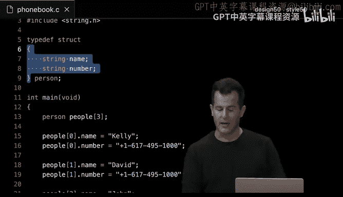

好的，所以这是一种更计算机科学化的描述相同算法的方式。即使它开始看起来有点……实际上，当你开始使用变量和某种标准符号时，你可以更清晰、更精确地表达自己，尽管可能需要一点练习来习惯。

以下是计算机科学家如何表达那个确切的想法：与其说“对于每个门，从左到右”，我们可能会引入一些数字。

所以对于`i`（一个变量），从值0到值`n-1`（这是这个简写符号的含义），如果50在`doors[i]`后面，可以这么说。所以现在我正在使用我们上周的符号将门的概念视为一个数组。如果50在`doors[i]`后面，`返回真`。否则，如果你遍历了整个门数组，你仍然可以`返回假`。

现在，请注意，`n-1`看起来有点奇怪，因为不是有`n`个门吗？为什么我想从0到`n-1`，而不是0到`n`？是的，完全正确。如果你从0开始计数，并且有`n`个元素，最后一个的地址将是`n-1`，而不是`n`，因为如果是`n`，那么你实际上有`n+1`个元素，这不是我们讨论的情况。所以再次强调，这只是标准符号，这样写更简洁，坦率地说，它更适应代码。

所以你会发现，随着我们分配的问题集和编程挑战变得稍微复杂一些，写出这样的伪代码通常很有帮助，混合使用英语、C语言以及最终的Python代码，因为之后将你的伪代码翻译成实际代码会容易得多。

好的，那么在第二个算法中，凯特琳好心地再次搜索50，但凯莉给了她提前排序数字的优势，现在她不必仅仅诉诸于暴力尝试，可以这么说，尝试从左到右所有可能的门。她可以更智能地选择她打开的储物柜。

所以对于二分搜索，正如我们所说的那样，我们可以为其实现伪代码如下。我们可能会说：如果50在中间门后面，那么继续并`返回真`。否则，如果它不在中间门后面，但50小于中间门后面的数字，我们想去搜索左半部分。这在凯特琳的情况下没有发生，因为我们最终去了右边。所以这只是这里的另一个分支。否则，如果50大于中间门后面的数字，我们想搜索右半部分。

但这里可能还有另一个我们应该考虑的条件，那就是什么？它是在这里，在左边，还是在右边？但还有另一个边界情况会更好。跟踪还有什么可能发生。如果它不在数组中，或者真的没有门可搜索了，我们可以用不同的方式实现这个。

我在顶部给自己留了一些空间，因为如果没有门可搜索，我根本不应该做任何这些。所以我应该有这种健全性检查，如果没有门剩下或者一开始就没有门，让我们立即`返回假`。为什么？请注意，当我说搜索左半部分和搜索右半部分时，这隐含地告诉我再做一次这个，再做一次，但门越来越少。这是一种解决问题的技术和实现算法的方法，我们将在今天的讨论结束时谈到，因为“搜索左半部分，搜索右半部分”这种看似非常口语化和直接的说法，实际上是一种非常强大的编程技术，它将使我们能够编写更优雅的代码，有时用更少的代码来解决这样的问题，稍后再详细讨论。

---

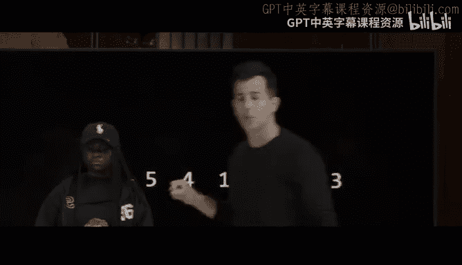

## 运行时间分析

但现在我们如何使用一些数组符号来形式化这个呢？它看起来有点复杂，但其实并不是。与其只用英语提问，我可能会说：如果50在`doors[middle]`后面。这假设我做了一些数学计算，并找出了中间元素的数字地址、数字索引。我怎么能做到这一点呢？如果我有7个门，除以2，那是什么？7除以2是3.5。3.5如果我用整数来寻址就没有意义。所以也许我们只是向下取整。所以是3。那将是储物柜编号0，1，2，3，确实，如果你看这7个储物柜，那实际上是中间。

这就是说，使用一些相对简单的算术，我可以找出中间门的地址、索引，如果我知道有多少个门，除以2并向下取整。同时，如果我没有在中间门后面找到50，让我们问这个问题：如果50小于中间门处的值，那么让我们搜索左半部分本身，更具体地说，搜索`doors[0]`到`doors[middle-1]`。否则，如果50大于中间门处的值，继续搜索`doors[middle+1]`到`doors[n-1]`。

现在，让我们依次考虑这些。所以搜索左半部分，正如我们之前描述的，似乎与这个想法一致。比如从`doors[0]`开始搜索，第一个门，但为什么我们搜索`doors[middle-1]`而不是`doors[middle]`？是的，完全正确。我们已经通过问前一个问题检查了中间门。所以如果你把一半分开，仍然认为那个门可以再次检查，你就是在浪费大家的时间。同样在这里，我们检查`middle+1`到储物柜数组的末尾，因为我们已经检查了中间的那个。所以同样的原因，即使它只是让数学看起来有点复杂。但这实际上只是使用变量和算术来描述相同储物柜的位置。

---

## 大O、Ω和Θ符号

但现在让我们考虑一下运行时间的含义，即算法运行所需的时间，并考虑为什么其中一个算法比另一个更好。

一般来说，当谈论运行时间时，我们实际上可以使用这样的图片。这不会是一些非常低级的数学分析，我们计算很多值。这将是大致的描述，以便我们可以与同事、与其他人类交流一个算法是否比另一个更好，以及如何比较两者。

例如，这里是两种不同算法的图示分析：第0周的电话簿和今天的点名。让我们像以前一样，大致标记这些东西。所以第一个算法在最坏情况下需要n步，如果我必须搜索整个电话簿，或者如果我必须数房间里的每个人。所以第一个算法确实需要n步。第二个算法需要一半那么多，也许再加一，但我们会保持简单。所以我们称之为`n/2`。第三个也是最后一个算法，无论是第0周的电话簿还是今天的点名，技术上都是`log₂ n`。如果你对算法有点生疏，没关系，只要相信以2为底的对数意味着取一个大小为n的问题，并尽可能多次地将其分成两半，直到你只剩下一人站着或电话簿中的一页。这就是你可以将一个大小为n的问题分成两半的次数。

事实证明，当描述算法的效率时，我们比大多数计算机科学家关心的要更详细一些。所以实际上，我们将开始使用一些符号。与其精确地数学计算今天和未来的算法需要多少步，我们将大致讨论它们有多少步，我们将使用所谓的大O符号，字面上就是一个大O，然后是一些括号。你把它读作“大O某个东西”。

所以第一个算法似乎是大O(n)，这意味着它大致是n步，或多或少。这个算法，你可能会倾向于做类似的事情，它大致是`n/2`步。而这个大致是`log₂ n`步。但事实证明，对于算法，我们真正关心的是时间如何随着问题本身规模的增大而增长。所以n越大，我们就越关心算法的效率，仅仅因为今天的计算机非常快，无论你是处理一千个数字还是两百个数字，都只需要一瞬间，无论如何。但如果你处理10个数字与一百万个数字与十亿个数字，那才是我们人类真正开始能感觉到差异的地方，我们真的开始关心这些值。

所以一般来说，当使用这样的大O符号时，你会忽略低阶项，或者等效地，你只关心任何数学表达式中的主导项。所以大O(n)仍然是大O(n)。大O(n/2)实际上和大O(n)是一样的。它们本质上都是线性的。一个以这个速率增长，另一个以那个速率增长，但就所有意图和目的而言，它们是相同的。它们都以恒定速率增长。这个大致是`log n`，底数是多少，谁在乎呢。

简而言之，这到底是什么意思？想象一下，我们即将放大这个图表，使得x轴不是从0到比如一百万，而是现在从0到十亿，y轴也一样从0到一百万。让我们放大。所以你会看到0到十亿。在你的想象中，你可能会想象，当你放大时，所有东西在视觉上变得越来越压缩，因为你在不断放大。但这些东西看起来仍然像直线，这个东西看起来仍然像曲线，也就是说，随着n变大，显然，这个绿色算法，无论它是什么，似乎都比这两个算法更有吸引力。如果我们继续放大，在某个点上，墨水会如此接近，以至于它们就所有意图和目的而言，几乎都是相同的算法。

这就是说，计算机科学家不关心低阶项，比如除以2或以2为底之类的。我们关注的是随着n变得越来越大，真正重要的主导项。那就是大O符号。这是我们几乎每次分析或谈论某个算法有多好或多坏时都会反复使用的东西。

---

## 常见运行时间

这里有一个常见运行时间的小备忘单。例如，这是我们的朋友大O(n)，意味着算法大致需要n步。这是一个大致需要`log n`步的。这里还有一些我们还没见过的。有些算法需要`n log n`步。有些算法需要`n²`步，有些算法只需要一步，也许两步或四步或十步，但步数是恒定的。

让我问一下，在我们迄今为止看过的算法中，例如，线性搜索是今天的第一个，线性搜索在大O符号下的运行时间是多少？也就是说，如果舞台上有n个储物柜。在那些n个储物柜中找到一个数字可能需要多少步？大O，是的。大O(n)，事实上，这正是我会归类线性搜索的地方。为什么？因为如果你在最坏情况下使用线性搜索，例如，你要找的数字可能像何塞那样在最后。所以你可能会很幸运，它可能不在最后。但一般来说，在最坏情况下使用大O符号是有用的，因为这确实能让你感觉到这个算法在最坏情况下可能表现得多差，如果你的数据集真的不走运的话。

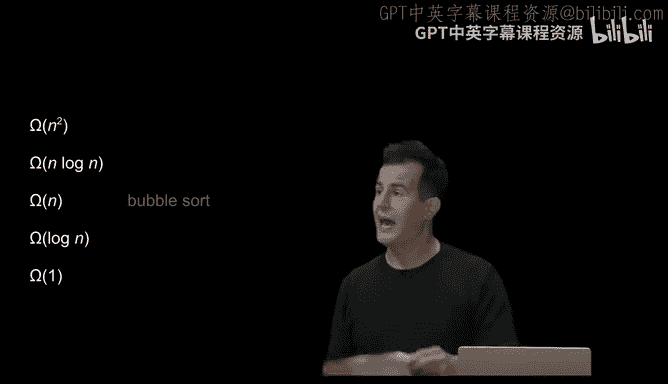

所以即使大O实际上只是指一个上界，比如它可能需要多少步，但通常考虑最坏情况是有用的，比如我关心的数字实际上在很远的地方。但是二分搜索呢？即使在最坏情况下，只要数据是排序的，相比之下二分搜索可能需要多少步？大O(log n)。所以二分搜索我们会放在这里，也就是说，一般来说，尤其是随着n变大，二分搜索要快得多。它花费的时间少得多。为什么？因为假设数字是排序的，你会像第0周的电话簿一样，将问题分成两半、再两半，你会更快地得到解决方案。

为什么你不应该在未排序的储物柜数组上使用二分搜索呢？比如一组随机数字？是的，因为你不知道。完全正确，你基于不等式（小于或大于）做出这些决定，但如果没有规律可循，你向左走或向右走，但没有理由相信较小的数字在这个方向，较大的数字在那个方向。所以你可能会一个接一个地做出错误的决定，很可能完全错过那个数字。所以二分搜索在未排序的数组上只是算法的错误使用。但像凯莉那样，如果你提前排序数据，或者你拿到的是已排序的数据，那么你实际上可以完美地应用二分搜索，并且效率更高。

是的，绝对。如果排序数据然后使用二分搜索需要更多时间，线性搜索有时是否更高效？绝对是的。这将是任何算法实现背后的设计决策之一，因为如果排序数据需要非常长的时间，不是排序7个数字，而是70个，700个，7700万个，但你只需要搜索数据一次，那你到底在做什么？如果你只关心得到一次答案，你不如直接使用线性搜索，或者见鬼，甚至随机做，希望运气好，如果你不关心重现相同的结果。

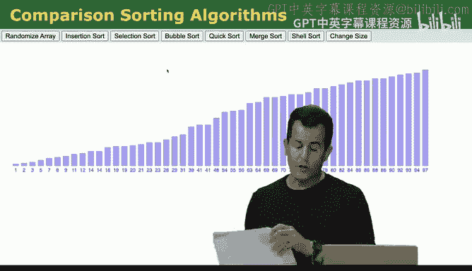

现在，一般来说，世界不是这样运作的。例如，谷歌正在努力开发越来越快的算法，因为我们不是搜索一次谷歌就再也不做了。我们一次又一次地做，所以他们可以分摊排序数据的成本，可以这么说，分摊到大量搜索中。但有时情况恰恰相反。我想起研究生院的时候，我经常编写代码来分析大型数据集。我本可以用正确的方式，用CS50的方式，通过微调我的算法并认真思考我的代码。但老实说，有时写非常糟糕但正确的代码更容易，然后去睡七个小时，然后我的电脑会在早上给出答案。缺点是，诚然，不止一次发生过，如果你的代码有错误，你去睡觉，然后七小时后，你发现有一个错误，你刚刚浪费了整个晚上。所以在做出这些资源决策时，也存在权衡，但这完全是今天的内容：做出明智的决策，有时做出更昂贵的决定可能更聪明、更明智，但至少不是不知不觉地。

---

## 数据结构：结构体

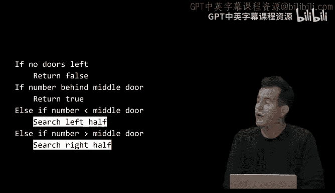

好了，所以我们有了我们的前两个算法。但让我们考虑另一种描述算法效率的方式。大O是一个上界，表示在最坏情况下可能有多糟糕，在这些情况下，也许数据真的对我们不利。Ω（一个大写的Ω符号）在这里用于表示下界。所以也许在最坏情况下我们可能有多幸运，可以这么说，一个算法可能采取的最少步骤数。在这种情况下，这里只是一个常见运行时间的备忘单，尽管有无限多个其他可能，但我们通常关注像这样的函数。

让我们考虑那些相同的算法。对于从左到右的线性搜索，该算法可能采取的最少步骤数是多少？例如，在最好的情况下。是的，这是一只即将举起的手吗？是的，所以是一步，为什么？因为也许何塞可能很幸运，打开门，瞧，那就是50。虽然实际情况不是那样，但在一般情况下，你要找的数字很可能就在开头。所以我们将线性搜索放在Ω(1)。所以是一步。也许技术上比那多几步，但这是一个固定的步数，与储物柜的数量无关。举例来说，如果我给你的不是7个而是70个储物柜，你仍然可能很幸运，仍然只需要一步。所以Ω是我们的下界，大O是我们的上界。

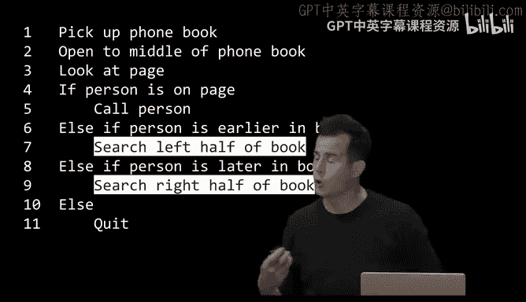

剧透一下。二分搜索的下界是什么？显然，它也是Ω(1)，但为什么？这实际上是正确的，是的。同样的原因，你可能在最好的情况下很幸运，它正好在所有数据的中间。所以二分搜索可能采取的最少步骤数实际上也是一步。这就是为什么我们谈论上界和下界，因为性能的范围。有时它会超级快，这很好。但某种感觉告诉我，在一般情况下，我们不会每次使用算法都那么幸运。所以它可能更接近那些上界，大O。

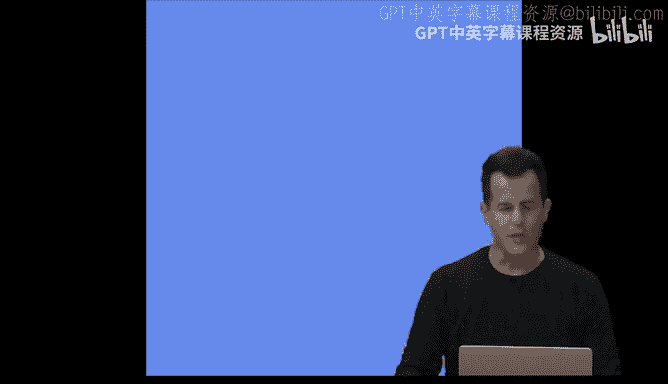

现在，顺便说一下，在计算机科学中，我们使用第三个也是最后一个符号来描述算法，那就是大写的Θ。当大O和Ω恰好相同时，你可以使用Θ这个术语。我们今天会看到这种情况，并非总是如此，但这里有一个类似的备忘单。迄今为止，没有一个算法可以用Θ符号来描述，因为它们的上界和下界并不相同。在我们的分析中，它们都不同。但我们至少会看到一个例子，我们可以用Θ来描述它。这就像用你的话向另一个计算机科学家传达两倍多的信息，而不是同时给出上界和下界。


描述我们在这里讨论的所有内容的更高级方式是渐近符号。渐近符号指的是一个值变得越来越大、越来越大、越来越大，但不一定达到某个边界，当n变得非常大时，简而言之，这就是我们使用这些符号时的意思。

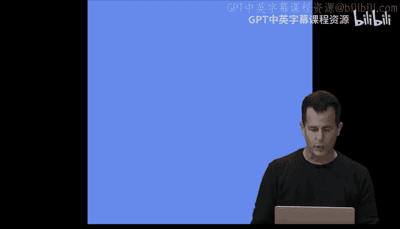

---

## 实现线性搜索

好的，对于这些东西中的第一个，比如线性搜索，让我们实际上让它更真实一点。让我稍后切换到我的另一个屏幕。让我们打开我们的朋友VS Code，并继续实现线性搜索的某个版本，只是为了让它更具体一些，特别是因为我们只在隐喻形式中使用过线性搜索。

我将继续创建一个名为`search.c`的程序，在这个程序里面，我将继续做以下事情。让我继续……所以，给我一秒钟。重新加载，我们的行号奇怪地小。好了。那是一个错误，来吧。一秒钟。再次关闭这个。这个，好的，抱歉。让我们再做一次。

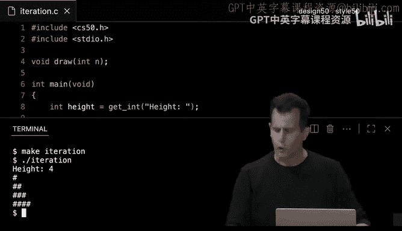

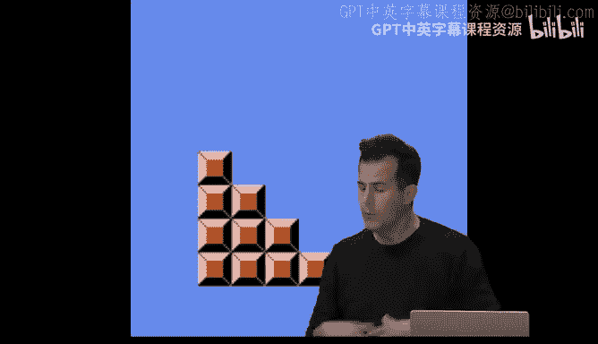

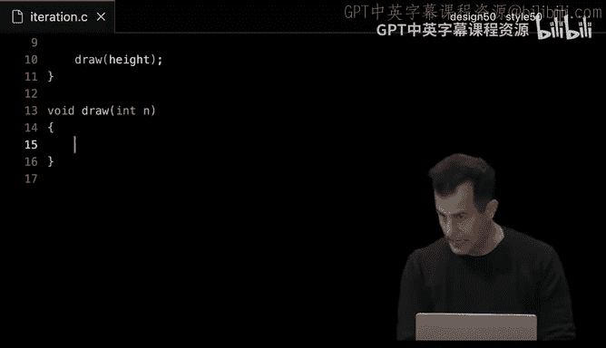

好的，在VS Code中，让我继续创建一个名为`search.c`的程序。在`search.c`中，让我们继续实现一个相当简单的线性搜索版本。

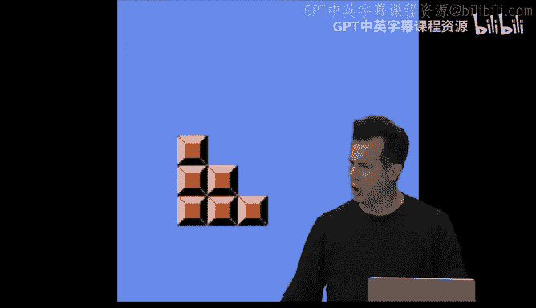

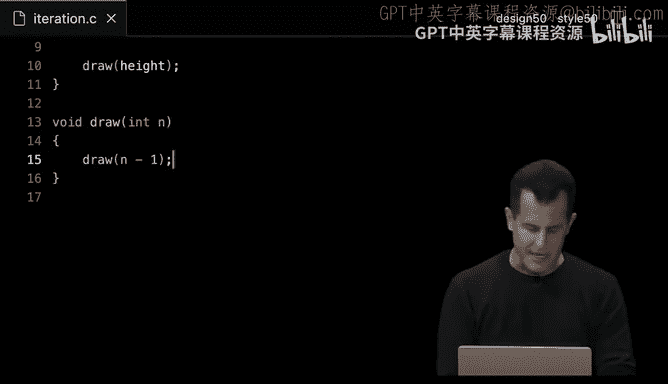

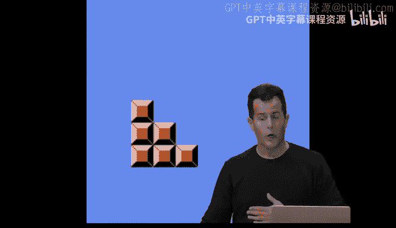

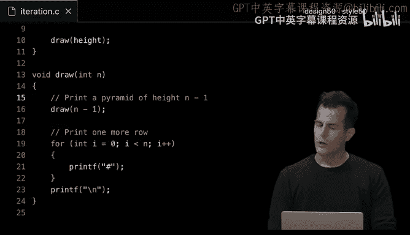

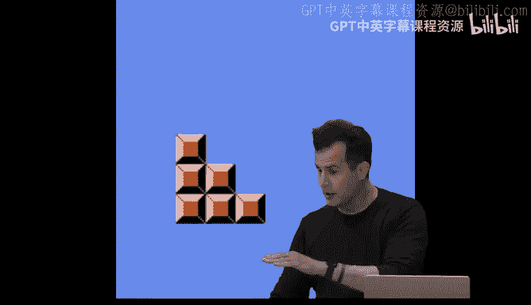

让我继续包含，例如，`cs50.h`。让我继续包含`stdio.h`。然后让我继续做`main void`。所以我们暂时不处理任何命令行参数。

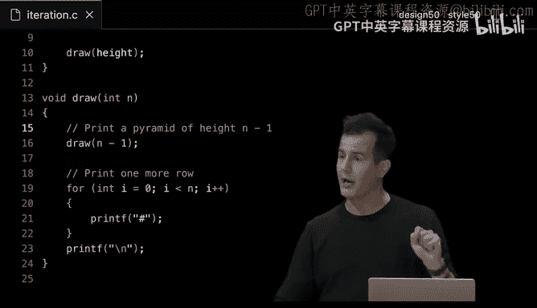

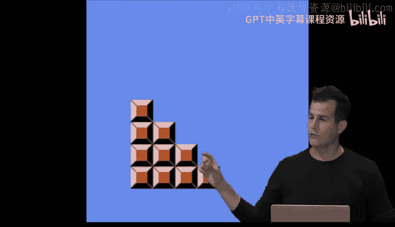

然后让我继续给自己一个数字数组来操作。我们上周在一个问题的答案中简要地做过这个，但现在我要具体地做，而不是使用更手动的方法将所有数字放入数组。

我要说给我一个名为`numbers`的数组，我想放入这个数组的数字最初将是我们一直在玩的完全相同的面额：2，50，10，5，100，1，50。再次强调，这是我上周在一个问题的答案中提到的符号，如果你想静态初始化一个数组，即预先给它所有值，而不需要人类全部手动输入，你可以使用这样的花括号。编译器足够聪明。你不必费心告诉编译器你想要多少个数字，1，2，3，4，5，6，7，因为它显然可以计算花括号里有多少个数字。但你可以明确地说7，只要你的计数确实是正确的。

所以在第6行，一个包含7个数字的数组，初始化为从左到右的那个数字列表。好的，现在让我们询问用户，他们想搜索什么数字，就像我对两位志愿者所做的那样，说`int n = get_int`，然后让我们询问用户他们想要搜索的数字。

然后让我们实现线性搜索。如果我想用我们迄今为止见过的编程结构来实现线性搜索，比如在C中我应该使用什么类型、什么关键字？什么编程技术？是的，也许是`for`循环或`while`循环，但`for`循环最近是我的首选。所以让我们做`for (int i = 0; i < 7; i++)`。硬编码7并不好，但我不会再次使用7，所以我认为在这个演示中放在一个地方是可以的。

然后在这个数组里面，让我们继续问一个问题，就像何塞那样，通过打开每个门，说`if (numbers[i] == n)`，我们询问的数字。那么让我们继续打印一些信息性的消息，比如“找到\n”，然后为了保险起见，像上周一样，让我们`return 0`来表示成功。这有点等同于返回真，但在`main`中，回想一下，你必须返回一个`int`。这就是为什么我们在第2周结束时揭示了`main`的返回类型是`int`，因为这就是给计算机的所谓退出状态，如果一切顺利就是0，或者任何非零值，如果出了问题。但我认为找到数字算是一切顺利。

但是如果我们遍历了整个循环，并且仍然没有打印“找到”或返回0，我认为我们可以继续安全地说“未找到\n”，然后让我们只返回1作为我们的退出状态，表示我们没有找到实际的数字。

简而言之，我认为在C中，这就是线性搜索。让我再次打开我的终端窗口。让我`make search`，回车。让我做`./search`，回车，我将搜索，就像我问何塞的那样，数字50，我们确实在最后找到了它。让我继续重新运行`./search`，让我们搜索开头的另一个数字，20，然后有效。只是为了疯狂一下，让我们搜索一个我们知道不在那里的数字，比如1000，那确实是未找到。

所以我认为我们有了线性搜索的实现。但让我在这里暂停一下，询问是否有任何关于这段代码以及算法到C的翻译的问题。

---

## 搜索字符串

好的，如果没有，让我们继续，也许将这个线性搜索转换为一个更有趣的，涉及搜索文本字符串的版本。毕竟，我们在第0周开始时，在电话簿中搜索名字，比如约翰·哈佛。让我们看看是否不能调整我们的代码来搜索字符串而不是整数。

所以在我这里的代码中，让我们继续删除`main`中的所有内容，给自己一个干净的画布。让我继续给我另一个数组。这个就叫`strings`，因为这是这个练习的目标，并将它们设置为大富翁游戏中一些熟悉的棋子，如果你可能玩过的话。所以那里有一个战舰棋子，一个靴子，一个加农炮，一个熨斗，一个顶针和一顶大礼帽，尽管现在根据你拥有的版本有所不同。

所以是一个相当长的数组，但我有1，2，3，4，5，6个值在这个字符串数组中。现在让我们向用户询问一个字符串。我们简称它为`s`，说`get_string`，“你在那六个中寻找什么字符串？”然后我认为我们可以再次使用一个`for`循环：`for (int i = 0; i < 6; i++)`。然后在这个循环里面，让我们做同样的事情。如果，比如说，`strings[i]`等于用户输入的字符串`s`，我认为我们可以继续说“找到\n”。然后像以前一样，`return 0`表示成功。如果我们没有，在那个整个`for`循环之后，让我们打印`printf`“未找到\n”，然后在这里返回1表示错误。

所以目前真的是一样的，只是我实际上使用的是字符串而不是整数。

好的，让我继续打开我的终端窗口并清除它。让我继续重新编译这段代码。`make search.c`似乎编译了。好的，让我做`./search`。让我们继续搜索第一个，战舰怎么样？回车。未找到。好的，那么也许拼写错误。也许让我搜索一些更容易拼写的，靴子。未找到。这很奇怪。这两个都在数组的开头。让我们再次`./search`并搜索大礼帽，回车。未找到。怎么回事？

嗯，这实际上并不明显我做错了什么。但事实证明，当我们在C中实际比较字符串而不是整数时，我们实际上将不得不使用另一个库，至少今天，我们上周简要介绍过。上周我们介绍了它，因为一个名为`strlen`的函数，它给了我们字符串的长度。事实证明，根据其文档，`string.h`还附带另一个有用的函数，称为`strcmp`，用于字符串比较。它的目的是实际比较两个字符串，左和右，以确保它们实际上是相同的。

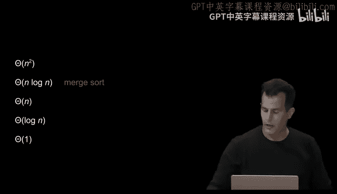

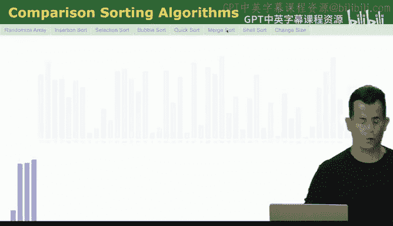

所以对于今天的目的，只要说你不能使用`==`来比较两个字符串就足够了。直观地说，为什么？对于计算机来说，比较两个整数超级容易，因为它们要么在内存中，要么不在。但对于字符串，它不仅仅是一个字符和另一个字符，而是这里的几个字符和那里的几个字符，也许几个，也许更多，你必须比较字符串中的每个字符以确保它们实际上是相同的。所以`strcmp`正是做这个的。可能在`strcmp`的实现中，比如多年前，有人写了一个`while`循环或`for`循环，从左到右查看每个字符串，并比较其中的每个字符，然后给我们返回一个答案。

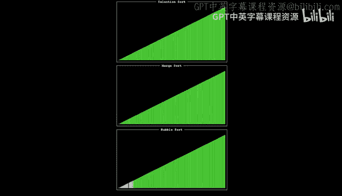

那么我们如何使用这个呢？要使用`strcmp`，我实际上可以在VS Code中这样更改我的代码：而不是使用`==`，我将根据其文档实际使用这个函数。我将调用`strcmp`，然后我将传入其中一个字符串，即`strings[i]`，然后我将传入第二个字符串，即`s`。然而，阅读文档后，这有点不明显，事实证明`strcmp`将在字符串相等时返回0，否则它将返回一个正数