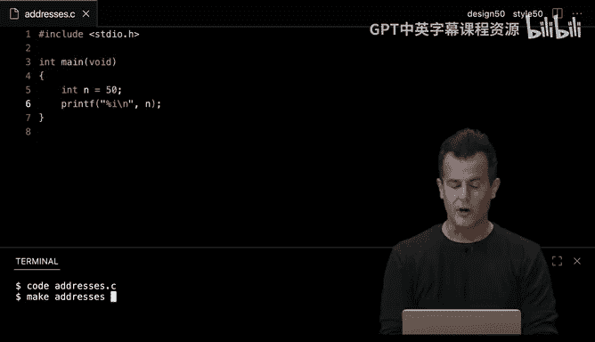
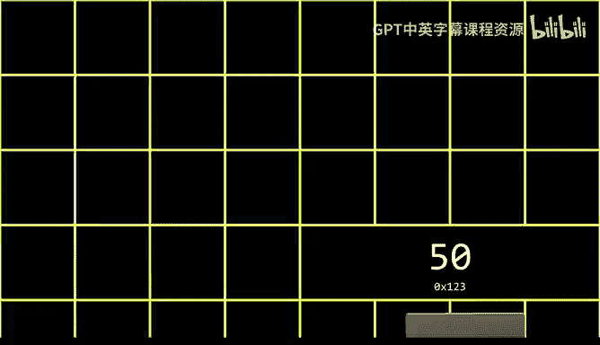
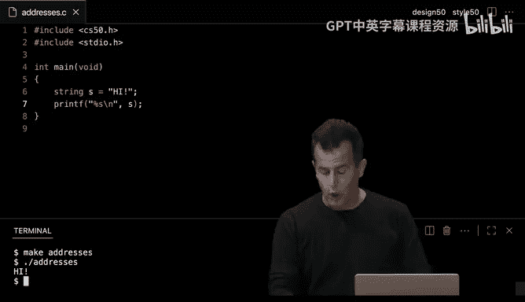
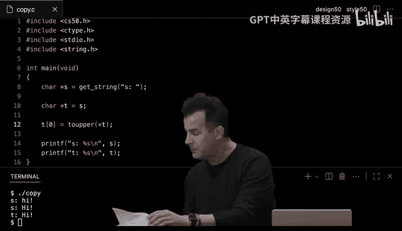
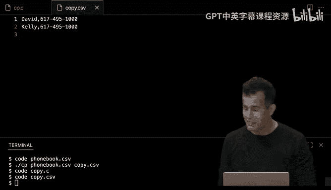

# 004：内存 🧠

在本节课中，我们将学习计算机内存的工作原理，包括如何存储和访问数据，以及如何使用指针来操作内存地址。我们还将探讨文件操作，学习如何持久化存储信息。


---


### **图像与内存表示 🖼️**



上一节我们介绍了计算机内存的基本概念，本节中我们来看看图像是如何在内存中表示的。



任何屏幕上的图像都是由成千上万个微小的点组成的，这些点被称为像素。每个像素都有一种颜色，这些颜色共同构成了我们看到的图像。在计算机中，图像以二进制形式存储，每个像素的颜色由特定的数值表示。

例如，一个简单的黑白图像可以用0和1来表示，其中0代表黑色，1代表白色。通过这种方式，计算机可以存储和显示复杂的图像。

---

### **颜色表示：RGB与十六进制 🎨**

在计算机中，颜色通常使用RGB（红、绿、蓝）系统来表示。每种颜色由0到255之间的数值表示，分别对应红、绿、蓝的强度。




然而，在编程中，我们经常使用十六进制来表示颜色。十六进制使用0-9和A-F共16个数字，可以更简洁地表示数值。例如，白色在十六进制中表示为`FFFFFF`，黑色表示为`000000`。


以下是RGB与十六进制之间的转换示例：

- 白色：`RGB(255, 255, 255)` → `FFFFFF`
- 红色：`RGB(255, 0, 0)` → `FF0000`
- 绿色：`RGB(0, 255, 0)` → `00FF00`
- 蓝色：`RGB(0, 0, 255)` → `0000FF`

十六进制的优势在于，每个十六进制数字可以表示4位二进制数，这使得它在表示颜色和内存地址时更加方便。

---

### **内存地址与指针 📍**

在计算机内存中，每个字节都有一个唯一的地址。我们可以使用指针来存储和操作这些地址。指针是一种变量，它存储的是内存地址，而不是实际的值。

以下是声明和使用指针的示例：



```c
int n = 50;      // 声明一个整数变量n，并赋值为50
int *p = &n;     // 声明一个指针p，指向n的地址
printf("%p\n", p); // 打印指针p存储的地址
```

在上面的代码中：
- `&n` 获取变量`n`的地址。
- `int *p` 声明一个指向整数的指针。
- `%p` 是用于打印地址的格式符。

指针允许我们直接访问和修改内存中的数据，这在许多高级编程任务中非常有用。

---

### **字符串与指针 🔤**

在C语言中，字符串实际上是一个字符数组，而字符串变量存储的是该数组第一个字符的地址。这意味着字符串变量本质上是一个指针。

以下是字符串与指针的关系示例：

```c
char *s = "HI!"; // 字符串s实际上是一个指向字符'H'的指针
printf("%p\n", s); // 打印字符串s的地址
printf("%p\n", &s[0]); // 打印第一个字符的地址
```

通过指针，我们可以遍历字符串中的每个字符，甚至修改字符串的内容。

---

### **内存分配与释放 🧩**

在C语言中，我们可以使用`malloc`函数动态分配内存，并使用`free`函数释放内存。这对于处理可变大小的数据（如字符串）非常有用。


以下是动态分配内存的示例：

```c
char *s = malloc(4); // 分配4字节的内存
if (s == NULL) {
    return 1; // 如果内存分配失败，退出程序
}
strcpy(s, "HI!"); // 将字符串复制到分配的内存中
free(s); // 释放内存
```

动态分配内存时，必须确保在不再需要时释放内存，否则会导致内存泄漏。


---

### **文件操作 📂**

文件操作允许我们将数据持久化存储到磁盘中。在C语言中，我们可以使用`fopen`、`fprintf`、`fclose`等函数来读写文件。

以下是向文件写入数据的示例：

```c
FILE *file = fopen("phonebook.csv", "a");
if (file == NULL) {
    return 1;
}
fprintf(file, "%s,%s\n", name, number);
fclose(file);
```

通过文件操作，我们可以创建、读取和修改文件，实现数据的长期存储。

---

### **总结 📝**

在本节课中，我们一起学习了计算机内存的基本原理，包括图像的表示、颜色的十六进制编码、内存地址与指针的使用、字符串的指针表示、动态内存分配与释放，以及文件操作。这些知识为我们进一步学习计算机科学和编程打下了坚实的基础。



通过掌握这些概念，我们可以更高效地操作内存和数据，编写出更强大、更灵活的程序。