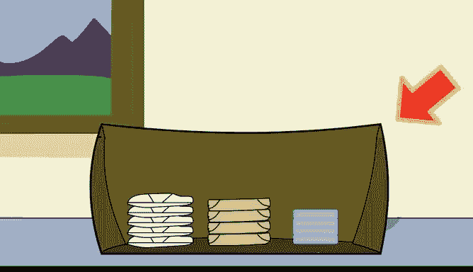
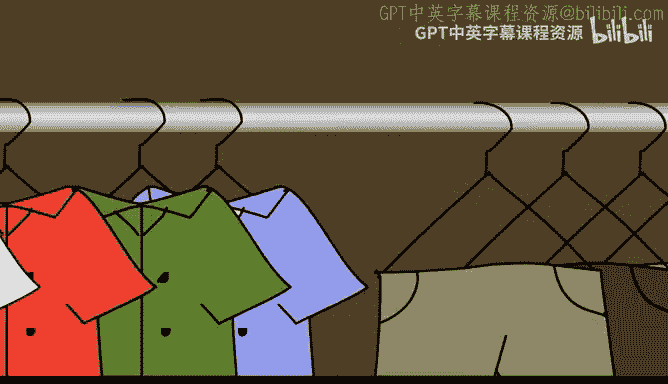
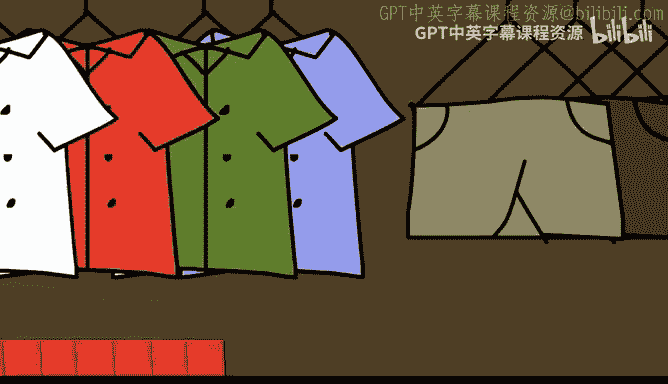
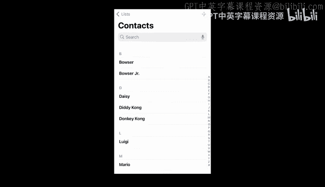
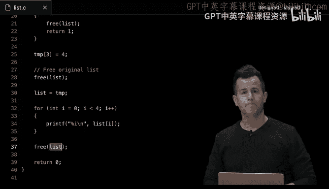
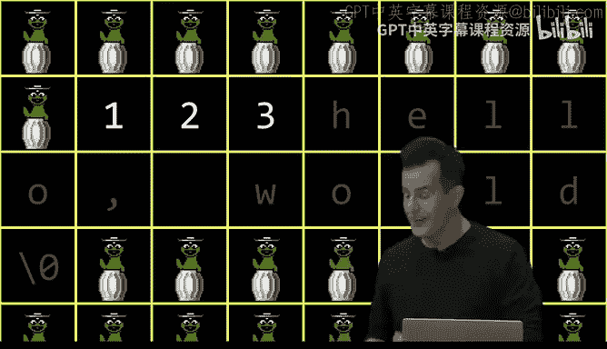
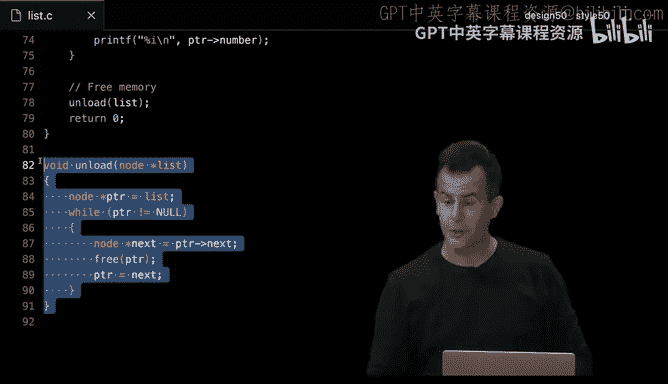
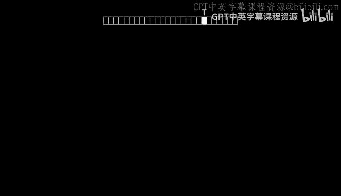

# 006：数据结构 🧱











## 概述

在本节课中，我们将深入学习数据结构。数据结构是组织和存储数据的方式，它决定了我们如何高效地访问和操作数据。我们将探讨几种常见的数据结构，包括栈、队列、链表、树、哈希表和字典树，并理解它们各自的优缺点及适用场景。

---

## 栈与队列 📚



上一节我们介绍了数据结构的基本概念，本节中我们来看看两种基础的抽象数据类型：栈和队列。

栈和队列都是我们日常生活中常见的数据组织方式。栈遵循“后进先出”的原则，就像叠放的餐盘，你总是从最上面取放。队列则遵循“先进先出”的原则，就像排队，先来的人先得到服务。

以下是栈和队列的核心操作：

*   **栈**：
    *   `push`：将元素压入栈顶。
    *   `pop`：从栈顶弹出元素。
*   **队列**：
    *   `enqueue`：将元素加入队尾。
    *   `dequeue`：从队首移除元素。

在C语言中，我们可以用数组初步实现它们，但这种方式有固定大小的限制。

```c
// 一个基于数组的简单队列结构示例
#define CAPACITY 50



typedef struct
{
    Person people[CAPACITY];
    int size;
}
queue;
```



这种静态数组实现的缺点是容量固定。如果第51个人想加入队列，我们无法处理。虽然可以重新编译代码修改容量，但这要么可能浪费内存（分配过多），要么可能不够用（分配过少）。理想情况是数据结构能根据需要动态增长和收缩。

---

## 从数组到链表 🔗

上一节我们看到了静态数组的局限性，本节中我们来看看如何实现动态的数据结构——链表。

数组要求内存连续，这限制了其灵活性。链表则通过指针将分散在内存各处的节点“串联”起来，每个节点不仅存储数据，还存储指向下一个节点的地址。

一个链表节点的结构可以这样定义：

```c
typedef struct node
{
    int number;          // 节点存储的数据
    struct node *next;   // 指向下一个节点的指针
}
node;
```

链表的优势在于可以动态分配内存，无需预先知道数据总量，也无需移动大量数据来调整大小。然而，为了获得这种灵活性，我们需要付出额外的空间来存储指针。

遍历链表查找一个元素，在最坏情况下需要检查所有N个节点，因此搜索的时间复杂度是 **O(n)**。如果我们在链表头部插入新节点，插入操作的时间复杂度是 **O(1)**，但如果我们希望保持链表有序，插入操作在最坏情况下也需要 **O(n)** 的时间来找到正确位置。

---

## 二叉搜索树 🌳

上一节我们讨论了链表的线性搜索问题，本节中我们来看看如何通过引入维度来提升效率——二叉搜索树。

二叉搜索树是一种节点最多有两个子节点的树形结构，并遵循一个关键属性：对于任意节点，其左子树中的所有值都小于该节点的值，其右子树中的所有值都大于该节点的值。

这种结构允许我们进行类似二分查找的操作。从根节点开始，比较目标值与当前节点值，根据比较结果决定进入左子树或右子树，从而每次都能排除一半的数据。

在平衡的二叉搜索树中，搜索、插入和删除操作的时间复杂度都可以达到 **O(log n)**。然而，如果数据按顺序插入（例如1, 2, 3, 4...），树会退化成一条链，时间复杂度又会退化到 **O(n)**。高级的树结构（如AVL树、红黑树）通过旋转操作保持平衡，但实现更复杂。

此外，每个树节点需要存储数据和两个指针，比链表消耗更多内存。



---

## 哈希表 🗂️

上一节我们看到了树结构在平衡时的优秀性能，本节中我们探索另一种追求极致速度的思路——哈希表，目标是接近常数时间 **O(1)** 的操作。

哈希表的核心思想是使用一个哈希函数，将输入（如一个名字）映射到一个固定范围内的数组索引（即“桶”）。例如，一个简单的哈希函数可以取名字的首字母，将其映射到0-25的索引。

```c
unsigned int hash(const char *name)
{
    // 将名字首字母转换为0-25的数字
    return toupper(name[0]) - ‘A’;
}
```

然而，不同的输入可能被映射到同一个桶，这称为“哈希冲突”。解决冲突的常见方法是“链地址法”：每个桶不再直接存储一个元素，而是存储一个链表。所有映射到该桶的元素都添加到这个链表中。

因此，哈希表的搜索时间取决于链表长度。在理想情况下，元素均匀分布在各个桶中，每个链表的平均长度是 **n / k**（k为桶的数量），这比单纯的链表快得多，但理论上平均时间复杂度仍是 **O(n)**。通过设计良好的哈希函数和足够多的桶，我们可以使操作在实践中非常快，接近常数时间。

哈希表是实现“字典”（键值对集合）的常用方式，是计算机科学中极其重要和实用的数据结构。

---

## 字典树 🌲

上一节我们接近了常数时间的目标，本节中我们来看一种真正能在字符串搜索中实现常数时间的数据结构——字典树。

字典树是一种树形结构，用于高效存储和检索字符串集合。树的每个节点代表一个字符（例如a-z），从根节点到某个节点的路径就构成了一个字符串前缀。节点通常用一个布尔值标记路径是否代表一个完整的单词。

查找一个长度为L的单词是否在字典树中，只需要沿着路径向下走L步，检查每一步对应的指针是否存在，以及最后节点的标记是否为真。这个步骤数**只取决于单词长度L，而与字典树中存储的单词总数N无关**。由于单词长度有上限，因此查找操作的时间复杂度是 **O(1)**（常数时间）。

但是，字典树的空间消耗可能非常大。每个节点都需要一个大小为字母表数量的指针数组，即使很多指针是空的。这是一种典型的“空间换时间”的权衡。



---

## 总结

本节课中我们一起学习了多种核心数据结构：
*   **栈和队列** 是管理数据顺序的抽象模型。
*   **数组** 简单快速但大小固定。
*   **链表** 提供了动态增长的能力，但牺牲了随机访问的速度。
*   **二叉搜索树** 在平衡时能实现高效的 **O(log n)** 搜索，但可能退化和占用更多空间。
*   **哈希表** 通过映射函数将数据分散，在实践中能实现接近常数时间的操作，是用途极广的“瑞士军刀”。
*   **字典树** 专门针对字符串，能实现真正的常数时间查找，但可能消耗大量内存。


每种数据结构都在时间、空间和易用性之间做出了不同的权衡。理解这些权衡，并根据具体问题选择最合适的数据结构，是成为优秀程序员的关键。下周，我们将转向Python语言，许多这些底层细节将被高级语言特性所隐藏，使我们能更专注于问题本身。