# CS50：6：Python入门教程 🐍

## 概述

在本节课中，我们将学习Python编程语言的基础知识。我们将从C语言过渡到Python，了解Python作为高级语言的特点，以及它如何简化编程过程。我们将通过对比C和Python的代码示例，展示Python的简洁性和强大功能。

---

## 从C到Python的过渡

上一节我们介绍了Python作为高级语言的优势，本节中我们来看看如何编写第一个Python程序。

在C语言中，我们通常使用`make`工具编译程序，然后运行生成的可执行文件。而在Python中，我们直接运行Python解释器来执行代码。

以下是编写和运行第一个Python程序的步骤：

1. 创建一个名为`hello.py`的文件。
2. 在文件中输入以下代码：
   ```python
   print("hello, world")
   ```
3. 在终端中运行以下命令：
   ```bash
   python hello.py
   ```

与C语言相比，Python代码更加简洁。我们不需要包含头文件、定义`main`函数或使用分号。此外，`print`函数默认会在输出后添加换行符。

---

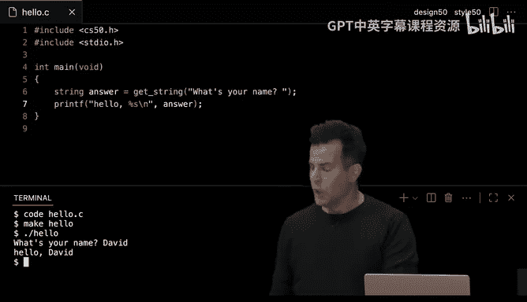

## Python的基本语法

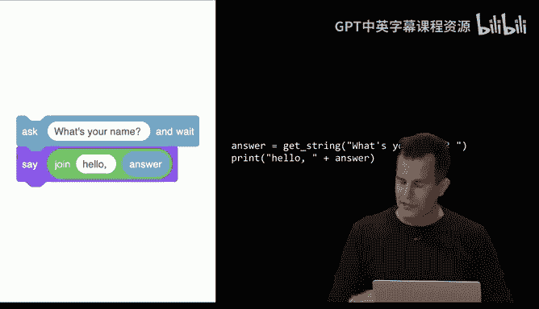

上一节我们介绍了如何编写简单的Python程序，本节中我们来看看Python的基本语法和变量。

### 变量

在Python中，声明变量时不需要指定数据类型。Python会根据赋值自动推断变量的类型。

以下是声明变量的示例：

```python
counter = 0
```

与C语言不同，Python没有`++`运算符。递增变量可以使用以下方式：

```python
counter += 1
```

### 数据类型

Python支持多种数据类型，包括布尔值、整数、浮点数和字符串。与C语言不同，Python没有指针，这简化了内存管理。

以下是Python中常见的数据类型：

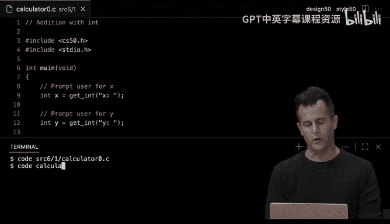

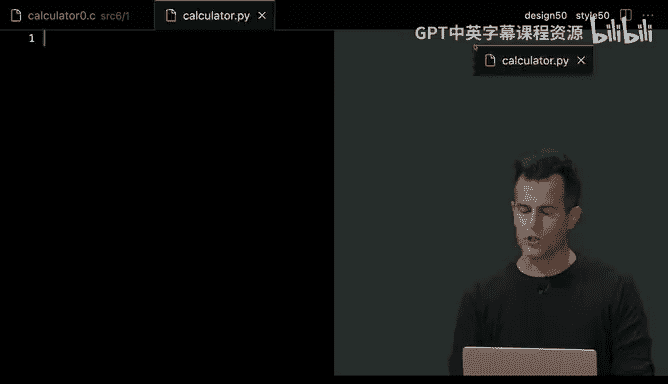

- **布尔值**：`bool`
- **整数**：`int`
- **浮点数**：`float`
- **字符串**：`str`

---

## 条件语句和循环

上一节我们介绍了Python的基本语法和变量，本节中我们来看看条件语句和循环。

### 条件语句

Python中的条件语句使用`if`、`elif`和`else`关键字。与C语言不同，Python不需要括号，但需要使用冒号和缩进来表示代码块。

以下是一个条件语句的示例：

```python
if x < y:
    print("x is less than y")
elif x > y:
    print("x is greater than y")
else:
    print("x is equal to y")
```

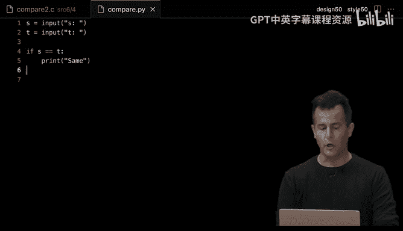

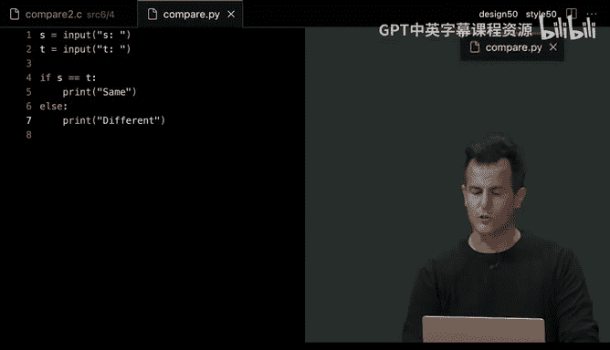

### 循环

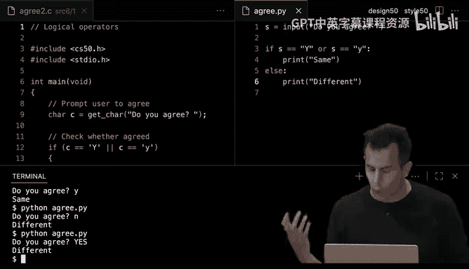

Python支持`for`循环和`while`循环。`for`循环通常与`range`函数一起使用，用于迭代一系列数字。


以下是一个`for`循环的示例：

```python
for i in range(3):
    print("meow")
```

`while`循环的语法与C语言类似，但不需要括号和分号。

以下是一个`while`循环的示例：

```python
i = 0
while i < 3:
    print("meow")
    i += 1
```

---

## 函数和模块

上一节我们介绍了条件语句和循环，本节中我们来看看函数和模块。

### 函数

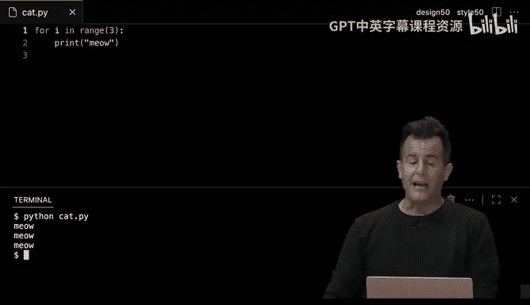

在Python中，使用`def`关键字定义函数。函数可以接受参数，并返回结果。

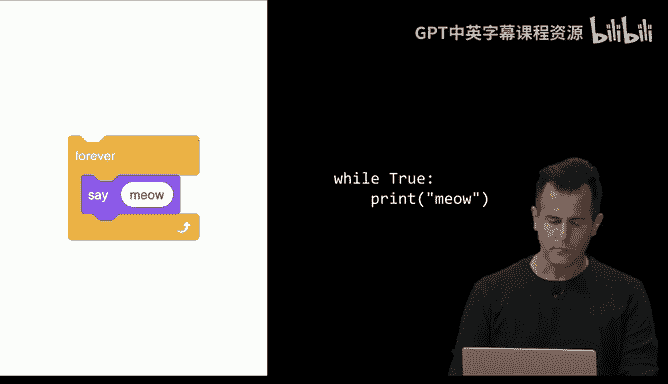

以下是一个函数的示例：

```python
def meow(n):
    for i in range(n):
        print("meow")
```

### 模块

Python中的模块类似于C语言中的库。我们可以使用`import`语句导入模块，并使用其中的函数。

以下是一个导入模块的示例：

```python
import math
print(math.sqrt(16))
```

---

## 列表和字典

上一节我们介绍了函数和模块，本节中我们来看看列表和字典。

### 列表

列表是Python中用于存储多个值的数据结构。与C语言的数组不同，列表可以动态调整大小。

以下是一个列表的示例：

```python
scores = [72, 73, 33]
average = sum(scores) / len(scores)
print(f"Average: {average}")
```

### 字典

字典用于存储键值对。它类似于哈希表，可以通过键快速查找对应的值。

以下是一个字典的示例：

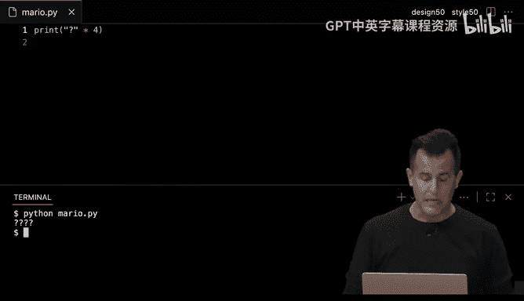


```python
people = {
    "Kelly": "+1-617-495-1000",
    "David": "+1-617-495-1000",
    "John": "+1-949-468-2750"
}
name = input("Name: ")
if name in people:
    print(f"Number: {people[name]}")
```

---

## 文件操作和异常处理

上一节我们介绍了列表和字典，本节中我们来看看文件操作和异常处理。

### 文件操作

Python提供了简单的文件操作功能。我们可以使用`open`函数打开文件，并使用`with`语句自动关闭文件。

以下是一个文件操作的示例：

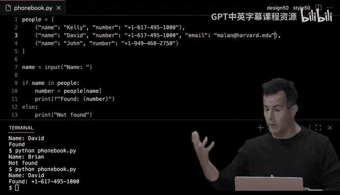

```python
with open("phonebook.csv", "a") as file:
    writer = csv.DictWriter(file, fieldnames=["name", "number"])
    writer.writeheader()
    writer.writerow({"name": name, "number": number})
```

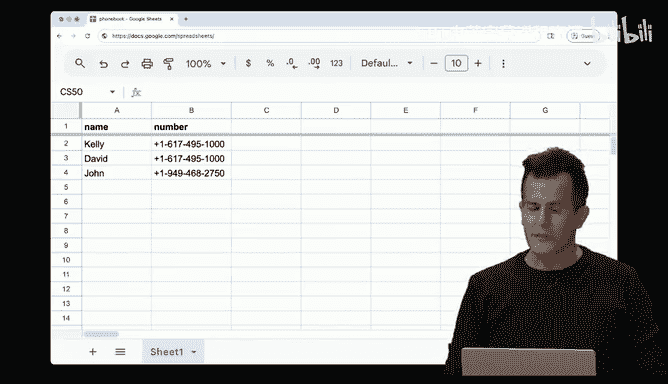

### 异常处理

Python使用`try`和`except`语句处理异常。这允许我们在程序出错时执行特定的代码。

以下是一个异常处理的示例：

```python
try:
    x = int(input("x: "))
    y = int(input("y: "))
    print(x / y)
except ValueError:
    print("Invalid input")
except ZeroDivisionError:
    print("Cannot divide by zero")
```

---

## 第三方库

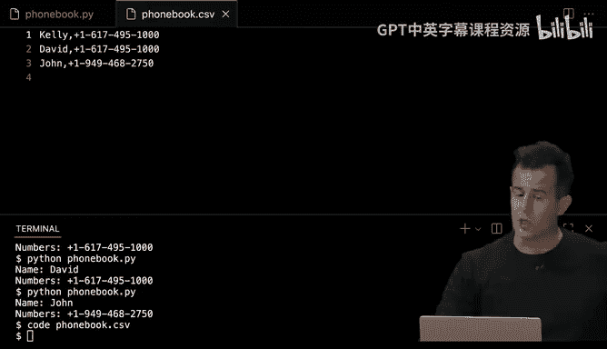

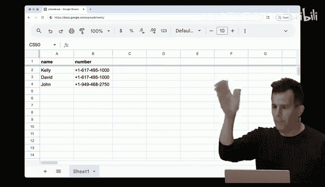

上一节我们介绍了文件操作和异常处理，本节中我们来看看如何使用第三方库。

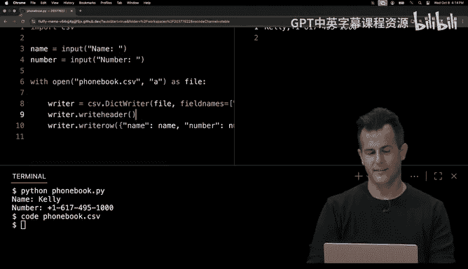

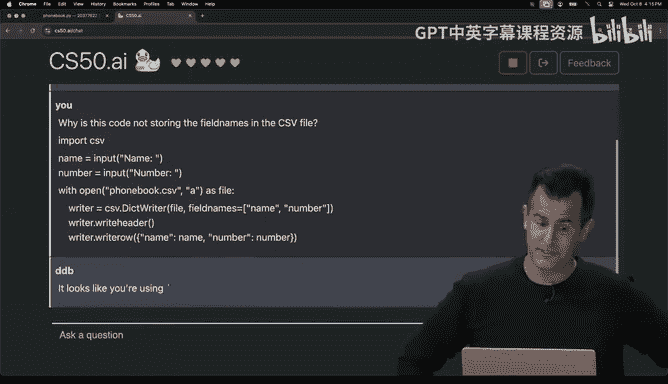

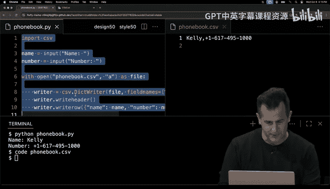

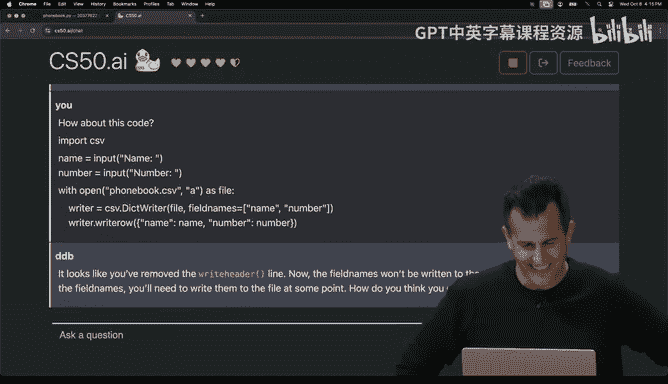

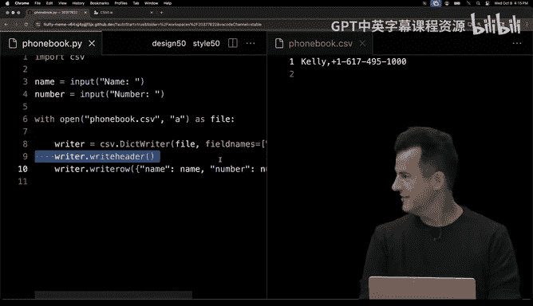

Python拥有丰富的第三方库，可以通过`pip`工具安装。这些库可以扩展Python的功能，例如生成QR码或进行文本转语音。

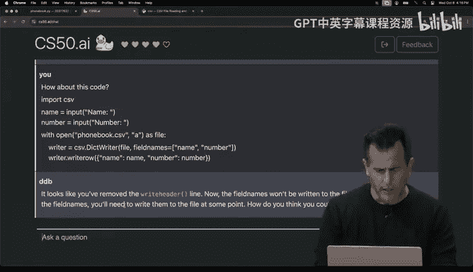

以下是安装和使用第三方库的示例：

1. 安装QR码生成库：
   ```bash
   pip install qrcode
   ```
2. 使用该库生成QR码：
   ```python
   import qrcode
   img = qrcode.make("https://youtube.com/xvfzjO5pGG0")
   img.save("qr.png")
   ```

---

## 总结

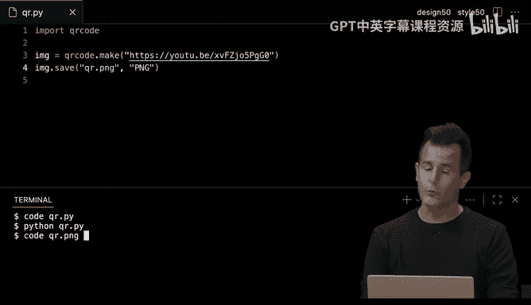

在本节课中，我们一起学习了Python编程语言的基础知识。我们从C语言过渡到Python，了解了Python的简洁性和强大功能。我们学习了变量、数据类型、条件语句、循环、函数、模块、列表、字典、文件操作、异常处理以及第三方库的使用。通过这些知识，你可以开始使用Python解决实际问题，并探索更多高级功能。