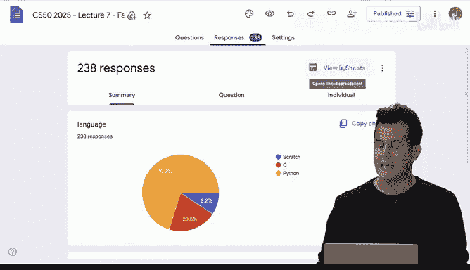
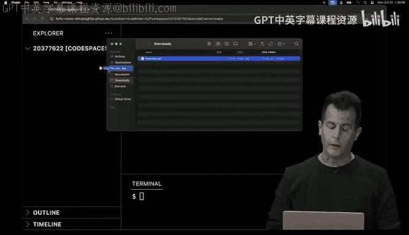
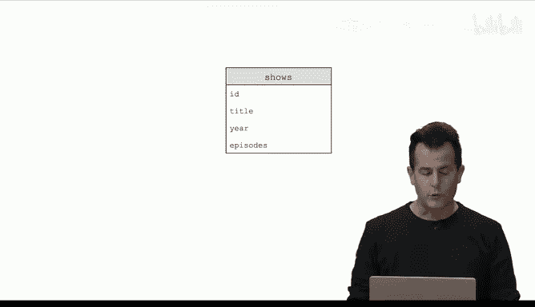
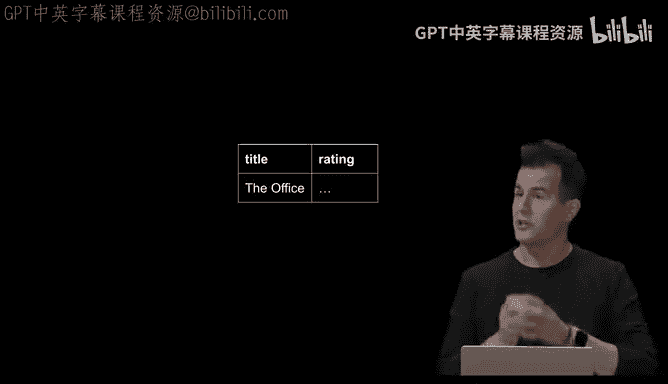
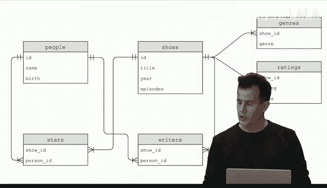
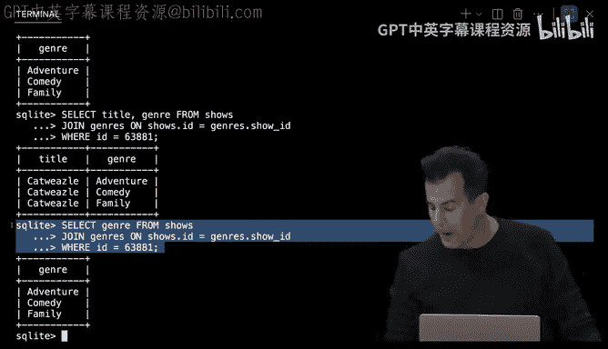
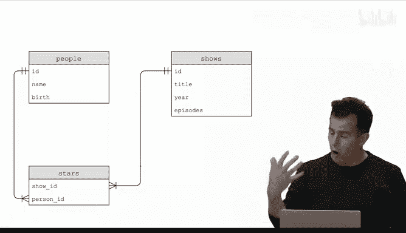
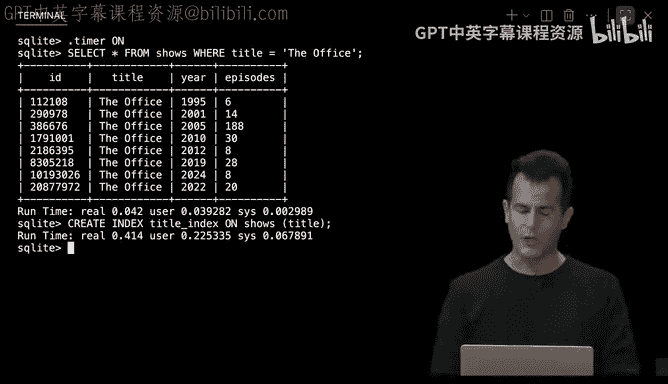

# 008：SQL 🗄️




在本节课中，我们将学习结构化查询语言（SQL），这是一种用于管理和查询关系型数据库的声明式编程语言。我们将看到SQL如何让我们以更简洁、更强大的方式处理数据，并探索它与Python等过程式语言的结合使用。




---

## 概述

本节课我们将学习SQL的基础知识。我们将从处理一个简单的CSV文件开始，逐步过渡到使用SQLite数据库。我们将学习如何创建、读取、更新和删除数据，以及如何通过连接多个表来处理复杂的关系。最后，我们将探讨如何安全地在Python中使用SQL，并了解SQL注入攻击和竞态条件等高级概念。

---

## 从CSV文件到SQL数据库

上一节我们介绍了如何使用Python处理CSV文件。本节中，我们来看看如何将数据导入SQL数据库，以便使用SQL进行查询。

首先，我们从一个Google表单收集数据，并将其下载为CSV文件。这个文件包含时间戳、语言选择和问题选择三列数据。

为了在SQL中处理这些数据，我们使用SQLite3创建一个数据库文件，并将CSV数据导入其中。

以下是导入CSV文件到SQLite数据库的步骤：
1.  运行 `sqlite3 favorites.db` 创建数据库。
2.  在SQLite提示符下，输入 `.mode csv` 设置模式。
3.  输入 `.import favorites.csv favorites` 导入数据并创建名为 `favorites` 的表。

现在，我们可以使用SQL查询来探索这个数据库。

---

## SQL基础：SELECT查询

SQL的核心操作之一是`SELECT`，用于从数据库中读取数据。与过程式语言不同，SQL是声明式的：你只需声明你想要什么数据，数据库会负责如何获取它。

以下是一些基本的SELECT查询示例：
*   `SELECT * FROM favorites;` – 选择`favorites`表中的所有列。
*   `SELECT language FROM favorites;` – 只选择`language`列。
*   `SELECT language, problem FROM favorites;` – 选择`language`和`problem`两列。

SQL还内置了许多函数，可以方便地对数据进行聚合和转换。

以下是SQL中常用的聚合函数示例：
*   `SELECT COUNT(*) FROM favorites;` – 计算表中的总行数。
*   `SELECT DISTINCT language FROM favorites;` – 获取`language`列中所有不重复的值。
*   `SELECT COUNT(DISTINCT language) FROM favorites;` – 计算不重复语言的数量。

---


## 使用WHERE子句过滤数据

为了更精确地获取数据，我们可以使用`WHERE`子句来添加条件。

以下是使用WHERE子句进行过滤的示例：
*   `SELECT COUNT(*) FROM favorites WHERE language = 'C';` – 计算喜欢C语言的人数。
*   `SELECT COUNT(*) FROM favorites WHERE language = 'C' AND problem = 'hello, world';` – 计算同时喜欢C语言和“hello, world”问题的人数。
*   `SELECT COUNT(*) FROM favorites WHERE language = 'C' AND problem LIKE 'hello%';` – 使用`LIKE`和通配符`%`进行模式匹配，查找所有以“hello”开头的问题。

---

## 使用GROUP BY和ORDER BY分组与排序

为了分析数据的分布，我们可以使用`GROUP BY`子句将数据按相同值分组，然后使用聚合函数（如`COUNT`）进行计算。

以下是如何使用GROUP BY和ORDER BY：
*   `SELECT language, COUNT(*) FROM favorites GROUP BY language;` – 按语言分组并计算每种语言的数量。
*   `SELECT language, COUNT(*) AS n FROM favorites GROUP BY language ORDER BY n DESC;` – 按数量降序排列结果，并使用`AS`为列设置别名。
*   `SELECT language, COUNT(*) AS n FROM favorites GROUP BY language ORDER BY n DESC LIMIT 1;` – 只返回最受欢迎的语言。


---

## 数据的创建、更新与删除（CRUD）

除了读取数据，SQL还支持创建（Create）、更新（Update）和删除（Delete）操作，合称CRUD。

以下是CRUD操作的示例：
*   **插入数据**：`INSERT INTO favorites (language, problem) VALUES ('SQL', 'Fiftyville');`
*   **更新数据**：`UPDATE favorites SET language = 'SQL', problem = 'Fiftyville';` （注意：此命令会更新所有行，通常需要配合WHERE子句）
*   **删除数据**：`DELETE FROM favorites WHERE timestamp IS NULL;`
*   **删除表**：`DROP TABLE favorites;` （谨慎使用）



---

## 关系型数据库设计

当数据变得复杂时，使用单个表会导致数据冗余和不一致。关系型数据库通过将数据拆分到多个表中，并使用关系（外键）连接它们来解决这个问题。

考虑一个存储电视节目和演员的例子。糟糕的设计可能是一个表中有多列`star1`， `star2`...，或者重复的节目名称。好的设计是使用三个表：
1.  `shows` 表：存储节目信息（ID， 标题）。
2.  `people` 表：存储演员信息（ID， 姓名）。
3.  `stars` 表：存储节目与演员的关联关系（show_id， person_id）。

这种设计消除了冗余，并建立了“多对多”关系（一个节目有多个演员，一个演员参演多个节目）。

---



## 连接多个表（JOIN）

为了从多个相关表中获取信息，我们需要使用`JOIN`操作。`JOIN`允许我们根据相关联的列（通常是主键和外键）将两个或多个表的行组合起来。



以下是连接`shows`表和`ratings`表的示例：
```sql
SELECT title, rating
FROM shows
JOIN ratings ON shows.id = ratings.show_id
WHERE rating >= 6.0
LIMIT 10;
```
这个查询返回评分在6.0以上的节目标题和评分。

对于更复杂的“多对多”关系，例如查找“The Office (2005)”的所有演员，我们可以使用嵌套查询或多次`JOIN`。

以下是查找特定节目所有演员的嵌套查询示例：
```sql
SELECT name FROM people
WHERE id IN (
    SELECT person_id FROM stars
    WHERE show_id = (
        SELECT id FROM shows
        WHERE title = 'The Office' AND year = 2005
    )
);
```

---

## 使用索引优化查询





随着数据量增长，查询速度可能变慢。索引是一种数据结构（通常是B树），它可以帮助数据库快速定位数据，而无需扫描整个表。

创建索引的语法如下：
```sql
CREATE INDEX title_index ON shows (title);
```
创建索引后，基于`title`列的查询速度会显著提升。但请注意，索引会占用额外空间，并在插入、更新和删除数据时带来一些开销。

---

## 在Python中使用SQL

在实际应用中，我们经常需要将SQL与其他编程语言（如Python）结合使用。CS50库提供了一个简便的接口来执行SQL查询。

以下是在Python中执行SQL查询的示例：
```python
from cs50 import SQL

# 连接到数据库
db = SQL("sqlite:///favorites.db")

# 执行查询
rows = db.execute("SELECT language, COUNT(*) AS n FROM favorites GROUP BY language ORDER BY n DESC")



# 处理结果
for row in rows:
    print(row["language"], row["n"])
```

---

## 安全注意事项：SQL注入

直接将用户输入拼接到SQL查询字符串中是极其危险的，这会引发“SQL注入”攻击。攻击者可以输入恶意字符串来操纵或破坏数据库。

**错误做法（易受攻击）**：
```python
problem = input("Favorite problem: ")
rows = db.execute(f"SELECT COUNT(*) AS n FROM favorites WHERE problem = '{problem}'")
```

**正确做法（使用参数化查询）**：
```python
problem = input("Favorite problem: ")
rows = db.execute("SELECT COUNT(*) AS n FROM favorites WHERE problem = ?", problem)
```
使用问号`?`作为占位符，库会自动对用户输入进行转义，确保安全。

---

## 并发问题：竞态条件

当多个用户或进程同时尝试读写数据库的同一数据时，可能会发生竞态条件，导致数据不一致。

例如，两个服务器几乎同时读取一个帖子的点赞数（比如100），然后都将其加1（得到101）并写回。最终点赞数会是101，而不是正确的102。

解决方案是使用**事务**。事务将一系列操作包装成一个原子单元：要么全部成功，要么全部失败，期间数据会被锁定，防止其他操作干扰。

在SQL中，可以使用`BEGIN TRANSACTION`、`COMMIT`和`ROLLBACK`命令来管理事务。一些数据库包装库也提供了相应的接口。

---

## 总结


本节课我们一起学习了SQL，一种强大的声明式查询语言。我们从处理平面文件开始，逐步深入到关系型数据库的核心概念，包括表的设计、CRUD操作、多表连接以及索引优化。我们还探讨了如何在Python中安全地执行SQL查询，并了解了SQL注入和竞态条件等重要的安全与并发问题。掌握SQL将使你能够高效地管理和分析各种规模的数据集。