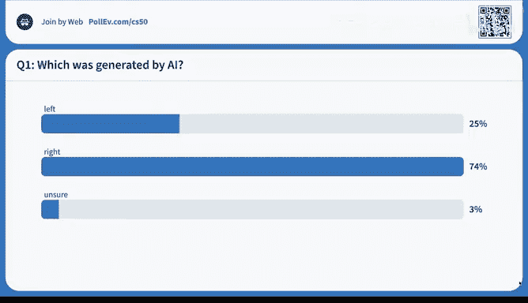
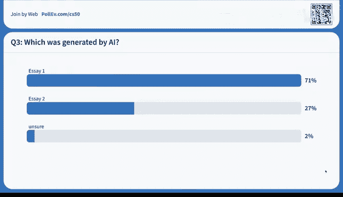
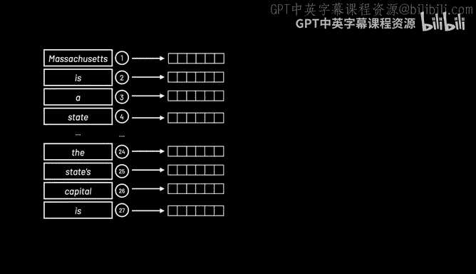
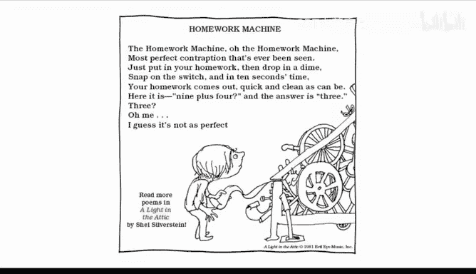

# 009：人工智能

在本节课中，我们将学习人工智能（AI）的基本概念，特别是生成式人工智能。我们将探讨AI如何工作，从简单的决策树到复杂的神经网络，并了解像CS50的“橡皮鸭”助手和ChatGPT这样的工具是如何构建的。课程将从有趣的识别AI生成内容的游戏开始，逐步深入到机器学习和大型语言模型的核心原理。

---

## 橡皮鸭的演变 🦆


在编程圈，有一个传统是在桌上放一只橡皮鸭。当遇到代码错误或难题时，可以向它“解释”你的问题，这个过程常常能帮助你理清思路，自己找到答案。



CS50将这一概念虚拟化。最初，虚拟橡皮鸭只会用“嘎嘎”声回应学生。然而，在2023年，它开始用英语回答学生的问题。现在的“鸭子”是一个基于AI的教学助手，旨在引导学生找到解决方案，而不是直接给出答案，这类似于一位优秀的导师。


## 识别AI：一个挑战性游戏 🎮



为了让大家感受当前AI技术的强大，我们进行了一个小游戏：区分AI生成的内容与真实内容。

以下是游戏中的几个例子：

*   **图像识别**：我们展示了两张人像照片。大多数观众认为右边的是AI生成的，但答案就是右边。在另一轮中，两张照片看起来都很真实，而实际上它们都是AI生成的，这说明技术已经非常先进。
*   **文本识别**：我们展示了两段描述午餐的文字。一段写道：“我喜欢带一个美味的三明治和一盒冰果汁当午餐……”，另一段写道：“妈妈给我打包了三明治、饮料、水果和零食……”。大多数观众认为第一段是AI写的，事实也确实如此。第二段更像一个真实学生会写的内容。

这个游戏在未来会越来越难，因为AI生成的内容将越来越难以辨别。

## 提示工程：与AI对话的钥匙 🔑

像CS50橡皮鸭这样的工具，其背后是“提示工程”的应用。这不是真正的工程学，而是一种通过提出清晰、具体的问题来引导AI给出理想答案的技巧。

在实现橡皮鸭时，我们使用了两种提示：

1.  **系统提示**：这是我们编写的指令，用于塑造AI的“性格”和专业领域。例如，我们的系统提示是：“你是一个友好且支持性的CS50教学助手。你也是一只橡皮鸭。只回答与CS50和计算机科学相关的问题，不要提供作业的完整答案……”
2.  **用户提示**：这是学生输入的具体问题。

通过结合系统提示和用户提示，我们让AI表现得像一只专注于CS50课程的“鸭子”。

在课程早期的第0周，我们甚至用几行Python代码演示了如何调用OpenAI的API来实现一个简单的问答程序，其核心就是传递系统提示和用户提示。

## AI辅助编程：能力的放大器 💻

现在，让我们看看AI如何帮助编程。在CS50中，学生需要完成一个用C语言实现拼写检查器的作业，这通常需要数小时。

在编程环境VS Code中，我启用了名为Copilot的AI辅助工具。我只需在聊天窗口中用自然语言提出请求，例如“使用哈希表在C语言中实现检查函数”，Copilot就能根据当前代码文件和注释，生成相应的代码建议。

同样，我可以让它“实现加载函数”，它也能快速生成代码。我甚至可以让它从头开始实现一个完整的“马里奥金字塔”程序，只需用英语描述需求。

**核心概念示例：AI生成代码**
```python
# 用户向Copilot提出的请求（自然语言）
“请用C语言实现一个程序，使用#符号打印一个左对齐的金字塔，并使用CS50库向用户请求一个非负整数作为高度。”
```

这并不意味着学习编程不再必要。相反，只有当你具备编程知识和“肌肉记忆”后，AI才能成为强大的工具，帮你处理繁琐细节，让你更专注于高层次的问题设计和解决。在期末项目中，这将允许你实现更宏大、更复杂的创意。

## 人工智能的基本原理 🧠

那么，这些功能背后的基本原理是什么？AI并非新生事物，其基础已经发展数十年。

*   **垃圾邮件过滤**：系统通过学习海量邮件样本，自动识别并过滤垃圾邮件。
*   **手写识别**：通过训练不同人的笔迹样本，系统可以识别新的手写内容。
*   **推荐系统**：Netflix等平台根据你和其他人的观看历史，动态预测你可能喜欢的影片。
*   **语音助手**：Siri、Alexa等能理解多样化的语音指令，而非依赖预设的“如果-那么”规则。

## 从游戏到决策树 🎲

让我们从经典游戏《Pong》和《打砖块》开始思考。在《打砖块》中，控制挡板接球的逻辑可以用一个简单的决策树来描述：

1.  如果球在挡板左侧，则向左移动挡板。
2.  否则，如果球在挡板右侧，则向右移动挡板。
3.  否则，保持不动。

这可以很容易地转化为代码。但并非所有问题都如此简单。

## 极小化极大算法：玩转井字棋 ⭕❌

井字棋（Tic-Tac-Toe）比看起来复杂。最优策略是使用“极小化极大”算法。我们将游戏结果数值化：
*   X赢：得分为 +1
*   O赢：得分为 -1
*   平局：得分为 0

X的目标是**最大化**分数，O的目标是**最小化**分数。算法会模拟所有可能的走法，为X选择能导向最高分数的路径，为O选择能导向最低分数的路径。虽然井字棋只有约25万种可能局面，计算机可以轻松处理，但人类在脑中完成所有这些计算并不容易。

对于更复杂的游戏，如国际象棋（开局四步后就有约850亿种可能）或围棋（开局四步后可能性更是天文数字），穷举所有可能是不现实的。这时就需要更智能的方法。

## 机器学习：让计算机自己学习 📈

这就是机器学习的用武之地：我们编写代码，让机器通过大量数据**训练**自己来解决问题，而不是直接为每个具体问题编码。

*   **强化学习**：一个生动的例子是教机器人翻煎饼。研究人员通过“奖励”成功动作和“惩罚”失败动作，让机器人通过多次尝试自我学习。这类似于训练宠物或孩子。

在游戏场景中，想象一个角色在迷宫中寻找出口，同时要避开岩浆。通过随机探索，角色记住哪些路径导致惩罚（掉入岩浆），哪些路径导致奖励（找到出口）。但如果我们总是走已知的安全路径，可能永远找不到**最优**捷径。

## 探索与利用的平衡 ⚖️

这里的关键是平衡“探索”与“利用”。
*   **利用**：使用已知的好方法。
*   **探索**：偶尔尝试随机的新方法，以发现潜在更好的方案。

我们可以引入一个随机因子（例如 ε=10%）。在10%的情况下，角色进行随机移动（探索）；在90%的情况下，它选择已知的最佳移动（利用）。长期来看，这有助于找到更优解。

在《打砖块》游戏中，一个经过强化学习训练的AI甚至能发现人类玩家都未必知道的高分技巧：将球打到顶部后，让球在顶部持续弹跳得分。

## 监督学习与无监督学习 🏷️

机器学习主要分为两类：
*   **监督学习**：训练数据被明确标注（例如，邮件被标记为“垃圾”或“非垃圾”）。需要大量人工标注，成本高昂。
*   **无监督学习**：训练数据没有标签，算法自行发现其中的模式或结构。这对于处理海量数据至关重要。

## 神经网络与深度学习 🧠🔗

深度学习是无监督学习的一种强大形式，其核心是受生物学启发的**神经网络**。

简化来说，一个神经元接收输入，进行处理，然后产生输出。将许多神经元连接起来，就形成了网络。

假设我们想根据坐标（X, Y）预测一个点是红色还是蓝色。我们可以设计一个简单的网络：
*   **输入层**：两个神经元，代表X坐标和Y坐标。
*   **输出层**：一个神经元，代表预测颜色（红/蓝）。

网络的目标是学习一个公式（例如：A*X + B*Y + C），并根据结果大于或小于0来预测颜色。通过大量数据训练，网络会自动调整参数A、B、C，找到最佳的分界线。

真实的神经网络（如大型语言模型中的）则复杂得多，包含数十亿甚至上万亿的参数（神经元之间的连接权重）。这些参数通过海量文本数据训练得到，以至于我们无法解释中间每一层具体代表什么，但整个系统在输入和输出之间建立了强大的统计关联。

## 大型语言模型（LLM）与注意力机制 📖

ChatGPT等大型语言模型本质上是基于神经网络的复杂统计模型。它们通过在互联网规模的文本数据上进行训练，学会了预测下一个词的概率。

以句子“马萨诸塞州是美国东北部新英格兰地区的一个州，东临大西洋。该州的首府是____”为例。模型的工作流程如下：

1.  **分词与编码**：将句子分解成单词，并将每个单词转换为一个高维数字向量（例如，用1536个数字代表“马萨诸塞州”），将其置于一个数学空间中。
2.  **计算注意力**：模型计算句子中所有单词对之间的“注意力”权重。关系密切的单词（如“马萨诸塞州”和“州”）权重更高。
3.  **生成预测**：基于整个句子的上下文和注意力权重，模型计算出概率最高的下一个词应该是“波士顿”。

**核心概念示例：注意力权重**
在神经网络中，“注意力”机制让模型能够衡量句子中不同词之间的关联强度，从而更好地理解上下文。

然而，这些模型并非完美。它们有时会产生“幻觉”，即生成不正确或虚构的信息。这可能是因为训练数据中存在错误，或者模型在概率采样中出现了偏差。

## 总结 📝

本节课我们一起探索了人工智能的世界。我们从CS50的橡皮鸭助手出发，体验了识别AI生成内容的挑战。我们了解了提示工程如何塑造AI的行为，并见证了AI如何辅助编程，放大我们的能力。



我们回顾了AI的基本原理，从基于规则的系统（决策树）到能够自我学习的机器学习算法。我们探讨了强化学习中的探索与利用平衡，以及从监督学习到无监督学习（特别是深度学习）的演进。

最后，我们深入了解了神经网络和大型语言模型如何通过处理海量数据来生成文本，同时也认识到它们存在“幻觉”等局限性。正如谢尔·希尔弗斯坦诗中的“作业机器”并非完美，当今的AI也是强大但需要谨慎使用的工具。理解其原理，将帮助我们更好地驾驭它，解决未来的问题。



这节课到此结束，我们下次再见！