# CS50 计算机科学导论：第8讲：HTML, CSS, JavaScript 🖥️

## 概述
在本节课中，我们将学习互联网如何工作，并介绍构建现代网页应用的三大核心技术：HTML、CSS 和 JavaScript。我们将从网络基础概念开始，逐步深入到如何创建和设计交互式网页。

---

## 网络基础 🌐

到目前为止，我们在许多问题集中编写的都是命令行代码，运行在黑白终端窗口中，一切操作都基于键盘和文本。然而，我们每天使用的应用程序，无论是手机上的还是电脑上的，大多以网页浏览器的形式存在。从今天开始，在本学期剩余的时间里，我们将利用过去几周积累的所有编程基础，将它们重新部署到网页应用（甚至移动应用）的上下文中。

### 什么是互联网？
互联网本质上是网络的网络。当我们将世界各地的计算机网络（无论是有线还是无线）连接起来时，就形成了互联网。你家里有网络，校园里有网络，公司里也有网络。一旦开始将这些网络互联，你就拥有了互联网——一个由计算机、服务器和设备组成的全球互联系统。

### 互联网的起源
如果追溯到1969年，互联网的原始形式被称为ARPANET（高级研究计划局网络），由美国国防部设计，旨在连接当时数量有限、地理上难以访问的超级计算机。最初的ARPANET只连接了加州大学洛杉矶分校等少数几个节点。大约一年后，东海岸的哈佛大学和麻省理工学院等机构也加入了进来。发展到今天，我们几乎可以在世界任何地方路由数据。

### 数据包与路由
现实世界中充满了称为“路由器”的设备。路由器本质上是一台计算机或服务器，负责在地理上上下左右地路由数据。数据以“数据包”的形式在网络中传输。你可以将数据包想象成一个白色的小信封，就像我们通过邮政系统寄信一样。

为了更形象地展示数据包如何在互联网上传输，我们的助教团队曾通过Zoom表演了一个小品。在这个小品中，每位助教代表互联网上的一个路由器，他们的任务是路由数据包（即信封）。例如，从右下角的Phyllis发送一个数据包到左上角的Brian。

**核心概念：数据包路由**
数据包从Phyllis到Brian可以采取多种路径：可以向上然后向左，可以向左然后向上，也可以曲折前进。这实际上反映了当今世界的网络状况：由于存在大量有线和无线连接，数据从A点到B点实际上有很多条路径。数据包选择的路径不一定是最短的，可能是成本最低的，或者仅仅是某些服务器自动配置路由的结果。

---

## 网络协议 📡

互联网上的所有设备，包括你口袋里的手机或膝盖上的笔记本电脑，都使用一种语言进行通信，更技术性地讲，是一种协议。如今，这组协议被称为TCP/IP。

### 什么是协议？
协议是一套规范，规定了计算机在互联网上的行为方式。在人类世界中，我们也有协议。例如，当我第一次见到某人时，我通常会本能地伸出手，希望对方也伸出手来握手。这就是一种人类协议，它规范了两个人之间的交流方式。服务器也有类似的协议，只不过它们是基于文本或比特的，而不是物理的。

TCP和IP是解决两个不同问题的两种不同协议。

### IP协议
IP（互联网协议）负责为世界上的每台设备分配一个唯一的地址，即IP地址。IP地址是一个数字地址，用于唯一标识互联网上的每台计算机。

在现实世界中，我们也有地址。例如，我们所在的这座建筑Memorial Hall的地址是：45 Quincy Street, Cambridge, Massachusetts, 02138, USA。理论上，这个唯一的标识符应该能将一个物理信封从世界任何地方送到这个地点。

IP地址应用于互联网时，意味着设备（Mac、PC、手机等）也有一个唯一的标识符，称为IP地址。它是一个数字，但通常以“点分十进制”格式表示，例如：`1.2.3.4`。

**核心概念：IP地址格式**
每个点之间的数字代表一个0到255的值。因此，一个IP地址由四个这样的数字组成。由于每个数字有256种可能性（0-255），即2^8，需要8位（bit）来表示。所以，一个IP地址的总位数是：
`8位 * 4 = 32位`

这意味着IP地址是32位的。这引出了一个有趣的问题：32位能表示多少个不同的地址？大约是2^32，即大约40亿个。这个数字看起来很大，但考虑到如今世界上的人口数量，以及每个人可能拥有多个设备（手机、笔记本电脑、智能家居设备等），IP地址的数量可能不够用。

因此，世界正在逐渐从IPv4（32位）过渡到IPv6（128位）。IPv6提供了几乎用不完的地址数量，足以满足可预见的未来需求。不过，为了简单起见，在本课程和一般讨论中，我们仍将主要使用IPv4，因为它更容易理解。

### IP数据包
IP数据包（或更通俗地说，数据包）的结构如下所示。它本质上是一个比特网格，总共包含多个32位的行。当计算机（如Phyllis）在互联网上发送一个信息信封时，它至少包含这些信息。

**核心概念：IP数据包结构**
数据包中包含许多比特，分解为字节。我们今天真正关心的是“源地址”和“目的地址”。当Phyllis发送数据包时，她会在信封外部写下她的源IP地址（例如`5.6.7.8`）和Brian的目的IP地址（例如`1.2.3.4`）。数据包中还有许多其他有用的比特，但今天我们暂时忽略它们。

简而言之，IP确保我们都有唯一的地址，数据可以通过这些地址从我们发出或发送给我们。

### TCP协议
然而，IP只解决了设备寻址的问题。如今，服务器可以提供多种服务，如电子邮件、聊天、视频会议、游戏等。我们希望单个服务器能够同时处理多种服务。事实上，情况正是如此。

TCP（传输控制协议）允许计算机唯一地标识它们向世界提供的服务。例如，TCP允许计算机区分接收到的数据包是电子邮件、聊天消息还是视频会议的一部分。

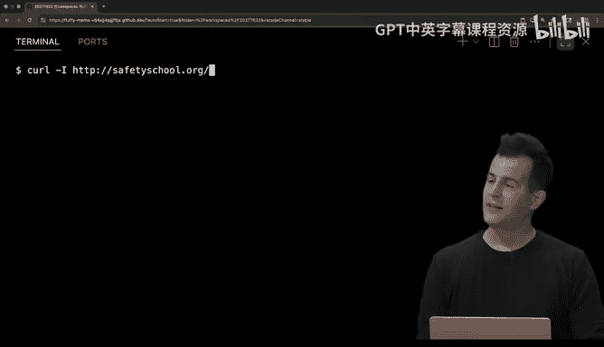

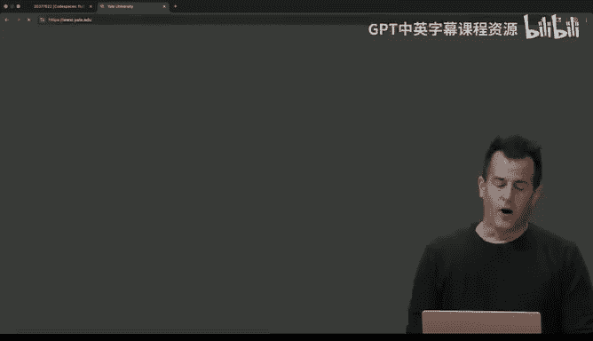

**核心概念：端口号**
除了IP地址之外，这些虚拟信封上还有所谓的“端口号”。端口号也是数字值，通常在0到几千的范围内，并且是标准化的。例如：
*   当你使用HTTP请求网页时（你很可能熟悉这个），你的计算机会在虚拟信封上写入端口号`80`。服务器收到后就知道：“哦，这个用户是在请求网页，而不是电子邮件或其他东西。”
*   如今，如果你使用HTTPS（URL中的S代表安全），你实际上使用的是端口`443`。这只是一群人多年前在房间里决定的一个任意数字，用于标准化信封外部的内容。

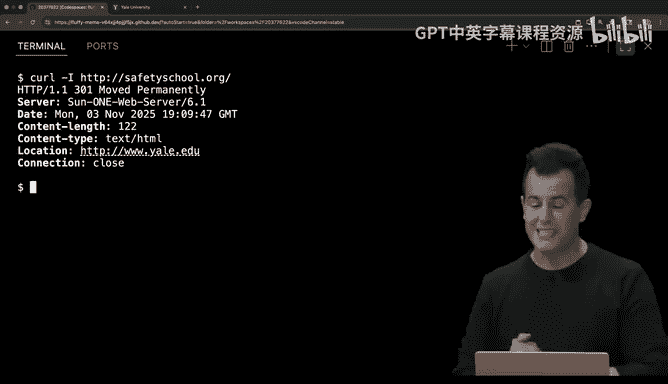

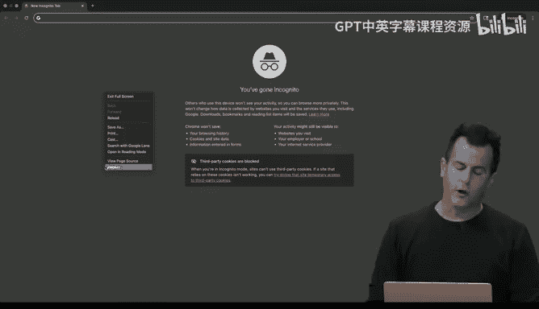

为了更清楚地说明，当Phyllis向Brian发送请求时，如果Phyllis是客户端（使用计算机的人），而Brian是网络服务器（更具体地说，是一个安全网络服务器），那么在Brian的IP地址（`1.2.3.4`）之后，Phyllis还会写上数字`443`。这样，当Brian收到并打开这个信封时，他就知道这是一个网页请求。

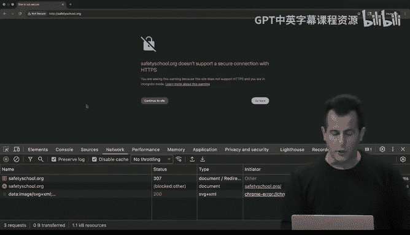

此外，Phyllis还会在信封的左上角写下她的IP地址（例如`5.6.7.8`）以及某个端口号。这样，Brian就可以通过这个端口号回复她。通过这种方式，Phyllis可以同时打开多个标签页，使用Zoom、聊天软件或其他程序，而她的计算机知道哪些数据包属于哪个标签页或应用程序。

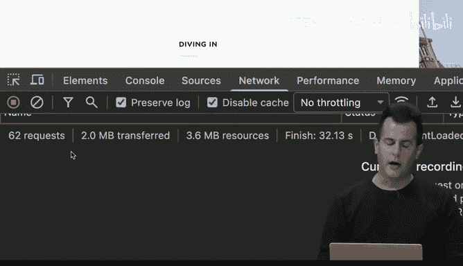

**核心概念：TCP序列号**
TCP还在信封外部添加了16位来指定端口号，这意味着你确实可以有数万个可能的端口号。此外，还有一个“序列号”，这是一个32位的值，非常重要。

因为很多时候在互联网上发送的消息非常大。如果一个人下载一个大图片或一部电影（或流式传输电影）意味着其他人在那一刻不能做其他事情，那将非常不便。因此，为了讨论方便，假设我们有一只非常快乐的猫，它是一个很大的JPEG图像文件。如果Phyllis试图发送或接收像这样大的图像，最好不要只用一个巨大的信封，以免阻止其他用户在同一时刻使用互联网。

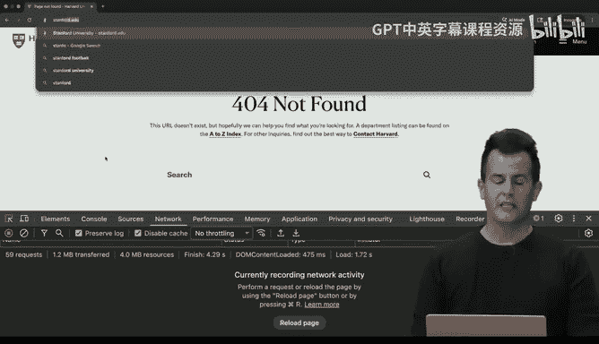

我们可以冒险将这只猫“撕成”两半（实际上是分片）。然后，在Phyllis的信封（或Brian的回复，取决于这只猫的来源或去向）中，猫的一部分可以放在这个信封里。现在，在这个信封的左下角，Phyllis或Brian可以写下序列号，例如“四分之一”、“四分之二”、“四分之三”、“四分之四”。这样，当这些数据包（希望还有其他数据包）到达目的地时，接收方的计算机可以检查：“这是一个很大的文件，我是否拥有所有部分？”是的，可以从所谓的序列号中推断出来。

TCP还包括其他功能，如数据优先级排序。但最终，TCP只是允许服务器处理多种类型的服务，并且允许它可靠地接收数据。因为，例如，如果接收方只收到四个数据包中的两个或三个，序列号的存在就足以让接收方告诉发送方：“嘿，我 missing 了一个或两个或三个或更多的数据包，请重新发送。”

**总结：TCP的作用**
简而言之，IP允许我们唯一地标识计算机，而TCP保证交付，并允许我们在同一设备上的多个服务之间进行“多路复用”。

---

## DNS：域名系统 🏷️

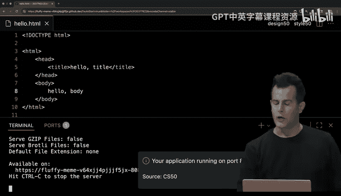

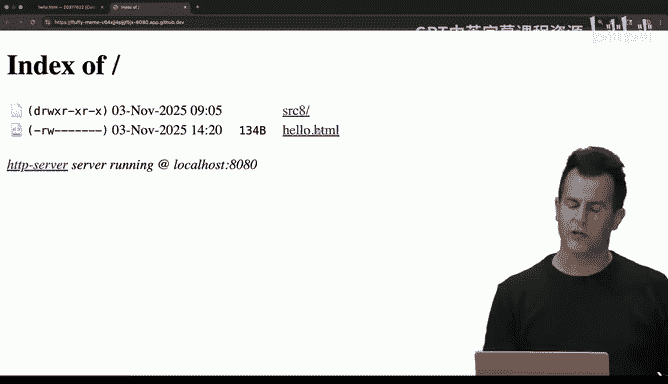

如果Phyllis、Brian和我们所有人类都必须在浏览器中手动输入IP地址来访问网站，那将非常繁琐。事实上，我们大多数人从不这样做。相反，我们会访问`google.com`或`harvard.edu`这样的域名，这对我们人类来说比那些任意分配的IP地址更容易记住。

互联网上还有另一种技术和另一个缩写：DNS（域名系统）。这只是一种特定类型的服务器，每个家庭、校园、公司都有，即使你不知道。世界上有这么多DNS服务器，但它们的目的很简单：将你我熟知的域名（如`google.com`、`harvard.edu`等）翻译成相应的IP地址。

**核心概念：DNS查询**
简而言之，这些DNS服务器内部本质上像一个两列的表格或电子表格。一边是世界上所有的域名，另一边是所有对应的IP地址。当你的Mac、PC或手机试图访问`google.com`或`harvard.edu`时，你的设备在首次启动时肯定不知道该服务器的IP地址。苹果或谷歌不会在我们的设备中预装数十亿个IP地址。但你的设备足够聪明，会询问家庭、校园或工作场所的本地网络：“`google.com`的IP地址是什么？`harvard.edu`的IP地址是什么？”然后，你的设备在从这些本地DNS服务器之一得到答案后，实际上会将相应的IP地址写在那个虚拟信封的外部。

这是一个非常有用的服务，它使互联网对我们来说更加实用，因为我们可以使用名称而不是IP地址。

### 完全限定域名
从技术上讲，这些被称为“完全限定域名”。它们从哪里来？你们中的一些人可能拥有自己的个人网站，可能经历过这个过程。获取自己的域名其实并不难。你可以去任何所谓的“互联网注册商”那里支付一些费用，这本质上是租赁形式。你可以租用一个域名一年、三年或五年，他们会自动向你收费。域名可能低至每年一美元，也可能高达每年数千美元，这取决于是否有人已经抢注了它。

从技术上讲，你最终要做的就是付钱给别人，他们给你使用该域名的权利。然后，你可以配置世界上某个地方的DNS服务器，使其知道你的服务器的最终IP地址，该服务器将为你提供域名的网页。

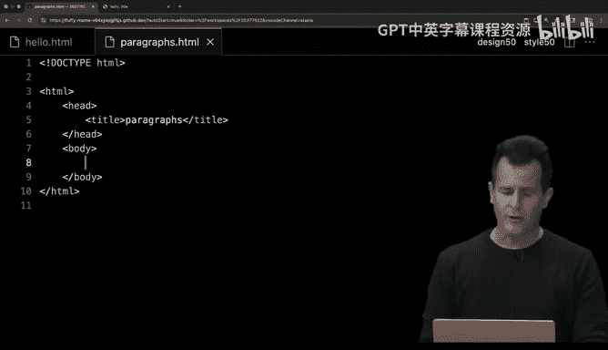

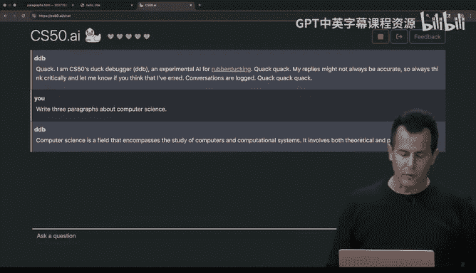

**核心概念：DNS层次结构**
简而言之，DNS具有非常层次化的结构。世界上存在所谓的“根服务器”，它们基本上知道所有`.com`或所有`.edu`等的IP地址。但我的Mac不知道这些。所以我的Mac可能会询问根服务器：“那个IP地址是什么？”但更有效的是，我的Mac最好先询问本地网络。在家里，它询问我家的DNS服务器（内置在你家里的那个小路由器中）；在校园里，它询问哈佛的DNS服务器。整个设计是“递归的”（借用几周前的一个术语）。如果我的计算机不知道某个域名的IP地址，如果哈佛的DNS服务器不知道答案，最终问题会升级到那些根服务器。然后，沿途的所有其他DNS服务器都会“缓存”（即记住）这个答案。这是一个非常优雅的层次化设计，但归根结底，它只是做这件事：它是一个从域名到IP地址的大备忘单，服务器为我们响应查询。

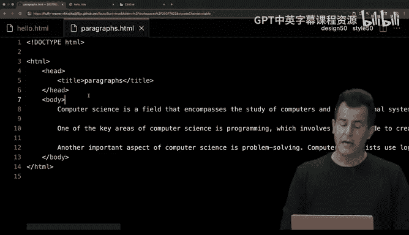

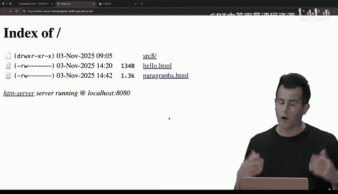

---

## DHCP：动态主机配置协议 ⚙️

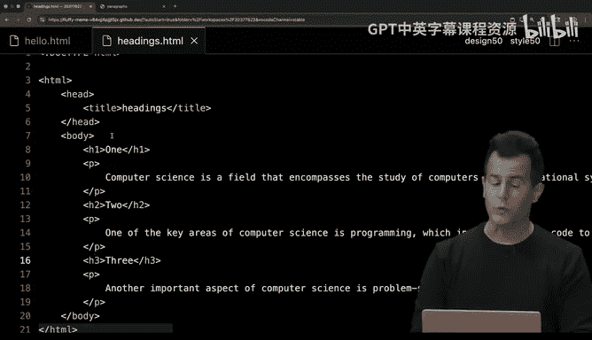

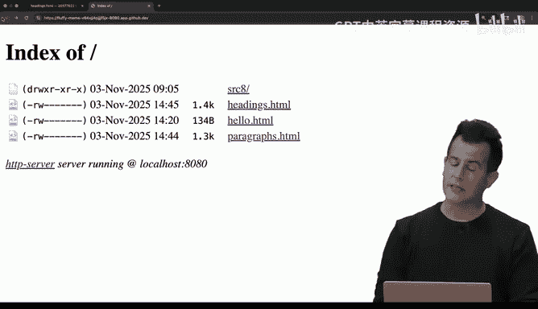

我如何知道我的Mac的IP地址应该是什么？我如何知道我手机的IP地址应该是什么？我如何知道应该向哪个DNS服务器询问这些问题？我如何知道应该将数据交给哪个路由器？在我们讲述的故事中，内置了许多假设。答案不幸是另一个缩写：DHCP。

DHCP解决了所有这些问题。过去并非总是如此。在我那个年代，我们必须根据别人告诉我们的信息手动输入计算机的IP地址、DNS服务器地址和路由器地址。但现在，DHCP只是运行在你的家庭网络、校园网络或公司网络中的另一个服务器，其目的是回答诸如“我的IP地址是什么？”这样的问题。

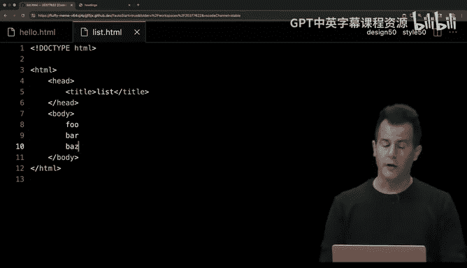

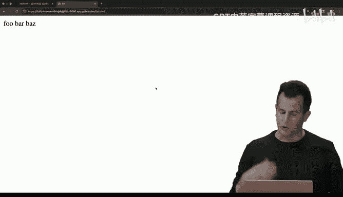

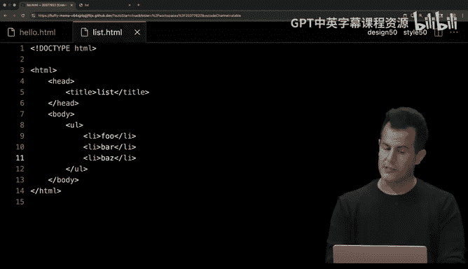

**核心概念：DHCP工作流程**
也就是说，当你首次启动Mac、PC或手机时，它本质上会广播一条消息：“你好，世界，我的IP地址是什么？”希望在该本地网络（有线或无线）上有一个DHCP服务器，它会根据哈佛、康卡斯特、威瑞森或家庭中某人的配置来响应，告诉你设备的IP地址、本地路由器的IP地址、DNS服务器的IP地址等。

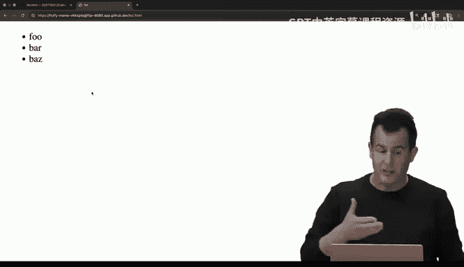

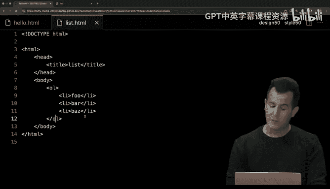

这就是为什么如今一旦你连接到Wi-Fi网络或物理插入网络，一切就能正常工作的原因。动态主机配置协议并非一直存在，但很高兴它现在存在。


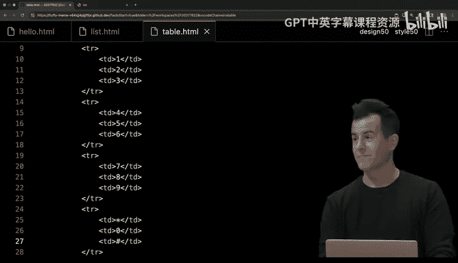

---

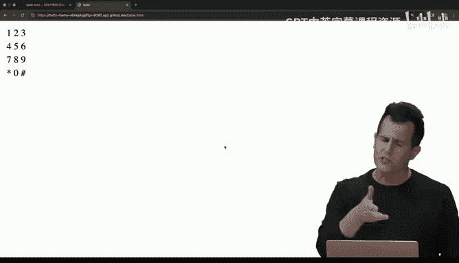

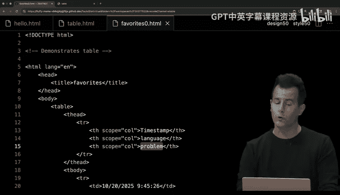

## HTTP：超文本传输协议 🌍

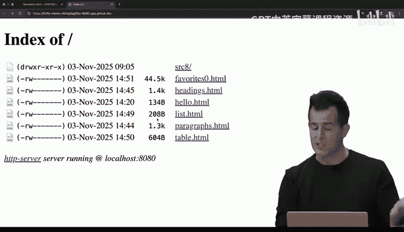

好了，关于信封外部的内容已经讲得够多了。今天剩下的内容将深入探讨这个信封内部，看看我们实际发送和接收的消息是什么，以及如何构建网页和设计从服务器返回到客户端的所有内容。

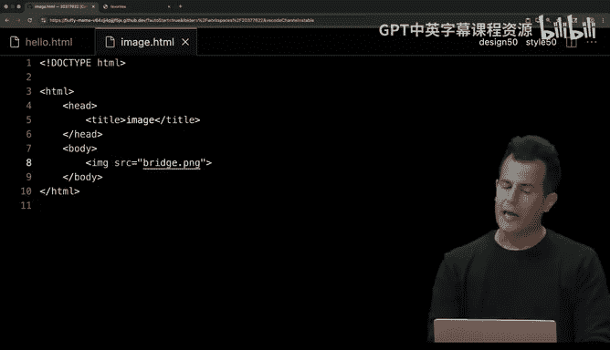

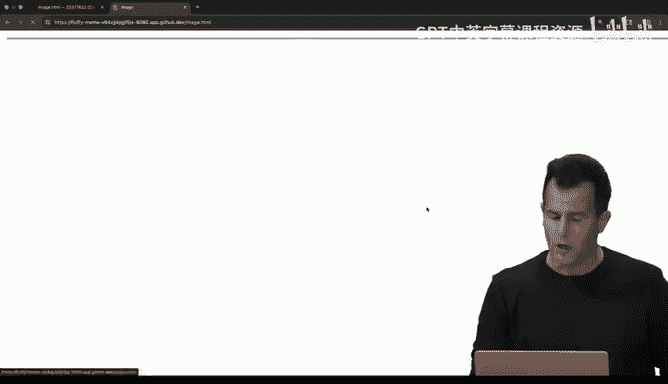

让我们深入探讨这个缩写：HTTP。多年来你一直在输入或看到它，尽管你现在不再需要手动输入，因为浏览器默认假设你想要这个。但HTTP是另一种协议——超文本传输协议。其目的是请求和接收网页。作为一种协议，它只是标准化了当你尝试使用网络时，信封内部应该放什么。电子邮件、Zoom、Discord等都有不同的协议。今天我们将主要关注HTTP，它恰好使用端口`80`和`443`。

### URL的组成部分
让我们看看HTTP（或HTTPS，其对应的安全版本）是怎么回事。以下是一个典型的URL，它包含许多组成部分。让我们考虑一下我们将开始视为理所当然的一些术语。

如果你访问 `https://www.example.com/`，你隐式地请求该网站的“根目录”。“根目录”只是默认目录或默认文件夹。这里黄色高亮的斜杠 `/` 就意味着“给我默认的网页”。从技术上讲，你在浏览器中收到的将是一个实际文件，按照惯例，它是一个名为 `index.html`、`index.htm` 或其他名称的文件。如果我们作为人类都必须输入我们想要的实际文件名，那将非常愚蠢。因此，服务器默认会返回你网站的根目录。

但是，如果你在一个文件夹内，或者你点击了一个指向文件的链接，你很可能在域名末尾有一个完整的“路径”，其中可能包含零个或多个文件夹名称和零个或一个文件名。事实上，它可能是明确的 `/file.html` 或 `/folder/` 或 `/folder/file.html`。随着时间的推移，你可能已经见过成千上万个这样的URL，即使你没有过多思考过。

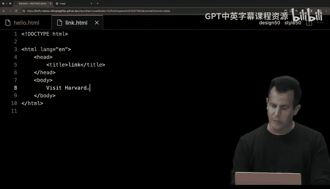

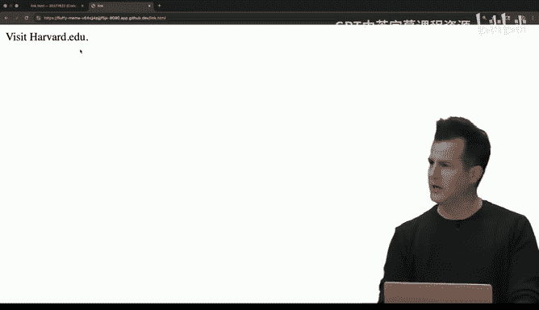

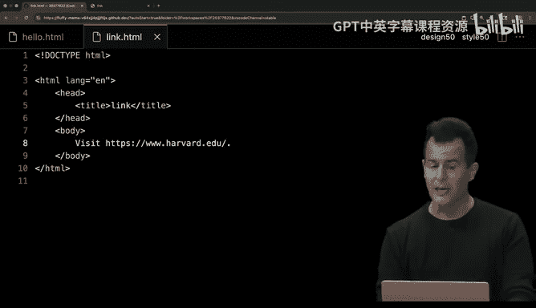

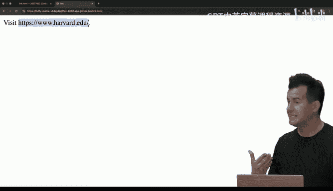

从今天开始，我们将创建所有这些内容，但我们需要理解左边部分的内容。这里是所谓的“域名”，或者更准确地说，是“完全限定域名”。它也有几个不同的部分。从技术上讲，这是我们通常所指的域名：`something.something`。`.com` 表示商业，而 `.co` 更具体地被称为“顶级域”或TLD。

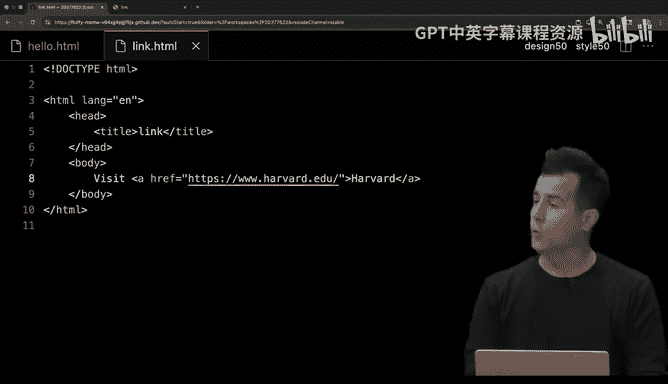

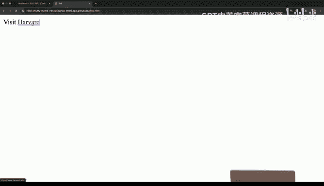

在过去，只有少数几个TLD：`.com`、`.co`、`.net`、`.org`、`.edu` 等。现在有数百甚至数千个。其中许多在野外并不常用，但有一些不在原始列表中，比如CS50经常使用 `.io`，它并不代表输入/输出。它实际上是一个两个字母的国家代码，本质上租给了我们和任何使用相同TLD的人，因为在英语世界中，`.io` 听起来很酷，确实让人联想到输入和输出。`.tv` 是另一个例子，它实际上属于一个国家，但在英语中也听起来像“电视”，因此也被使用。

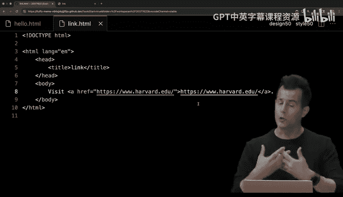

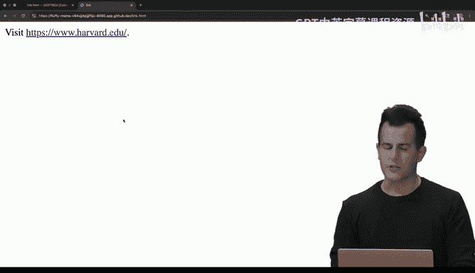

但总的来说，有像这样的顶级域。其中一些现在是完整的单词，一些是两个字符，表示它们属于一个国家。它们是对所有这些网站的最高级别的分类。

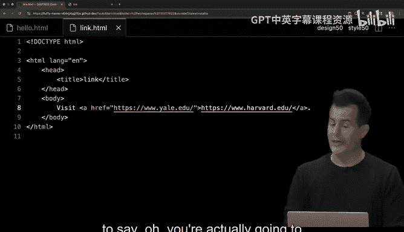

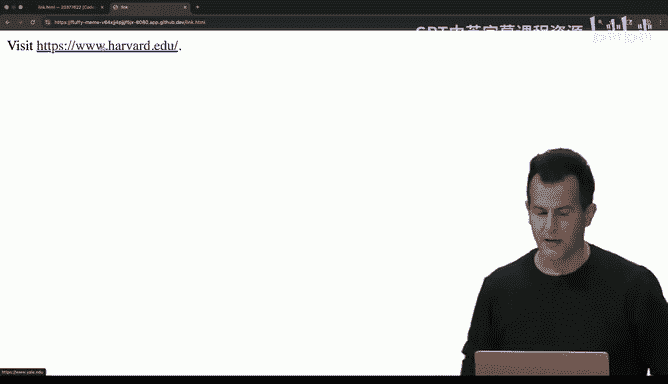

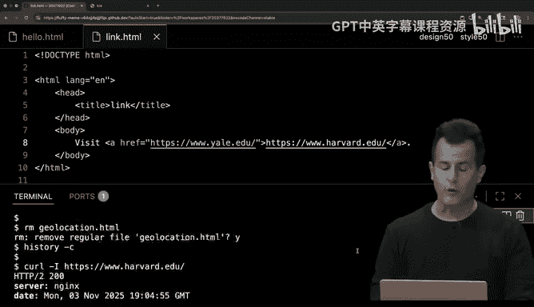

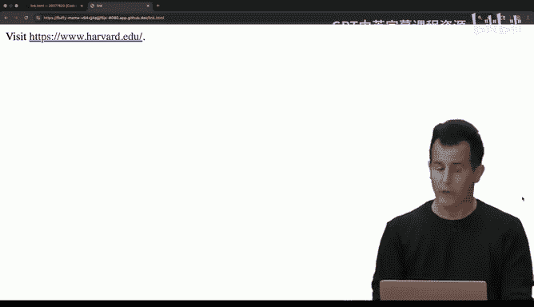

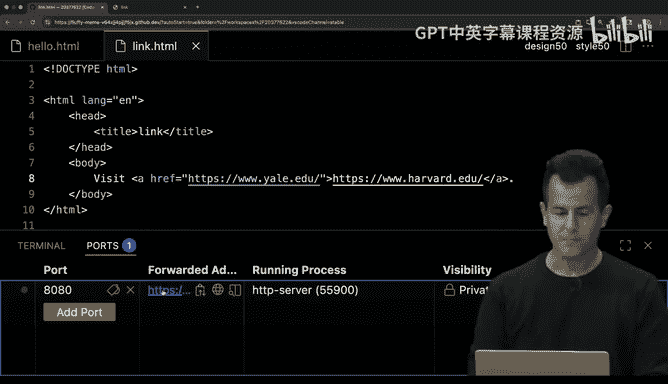

同时，许多URL（但不是全部）在域名的左边还有一个“主机名”。从技术上讲，它指的是你具体请求的服务器的名称。它不一定是一台物理服务器。`www` 可以指代数十、数百甚至数千台服务器。事实上，如果你访问任何流行的网站，如 `gmail.com` 等，即使你只有一个域名，从技术上讲，它指的是集群——数百或数千台服务器，以确保它们能够处理所有可能访问该站点的客户。

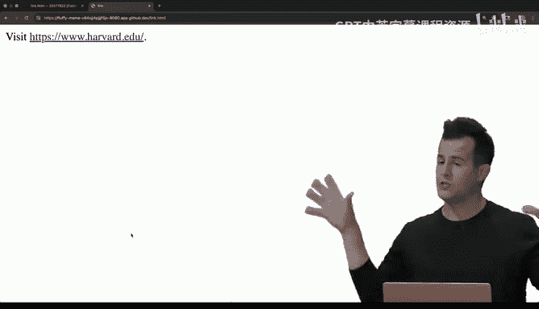

最后，还有这个“方案”或“协议”。具体来说，对于我们今天的讨论，它总是 `https://`，这是理想的，因为它是安全的并且以某种方式加密。但它也可以是 `http://`。

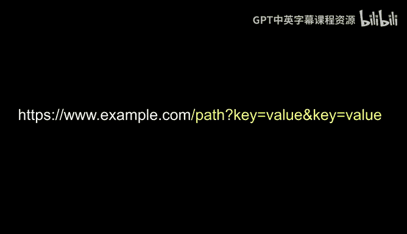

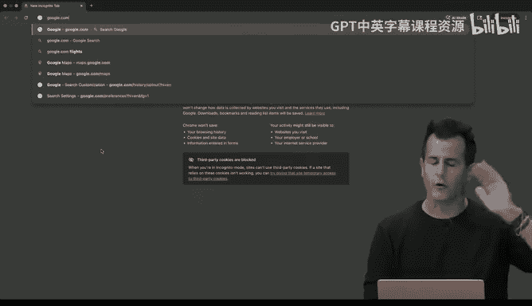

### HTTP消息
这就是关于URL的术语。我们今天要做的实际上是创建存在于类似URL中的内容，并将其提供给我们。

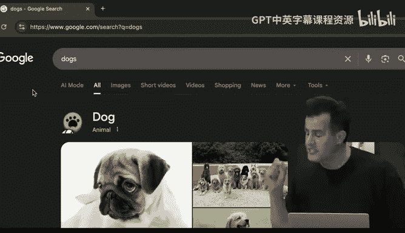

但是，最终进入这些信封的消息是什么样子的？URL只是将我们带到正确的地方。但我们如何以某种代码形式表达我们想要以这种方式使用加密从这个服务器获取这个文件 `file.html`？

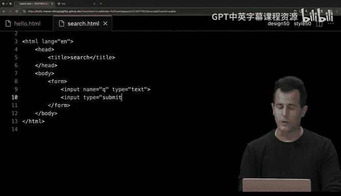

在Phyllis发送给Brian（以及他最终会发送回给她）的虚拟信封内部，是看起来像 `GET`、`POST` 和其他一些“动词”的消息。HTTP支持一系列操作或动词，即 `GET`、`POST` 和其他几个。其中第一个是Phyllis最初会放在她的信封内部的，以便从Brian那里获取一个网页（比如一只猫的图片）。

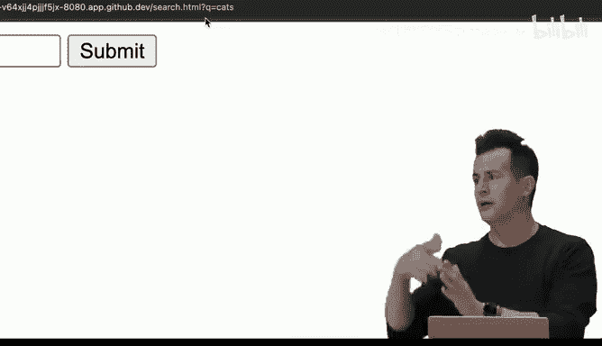

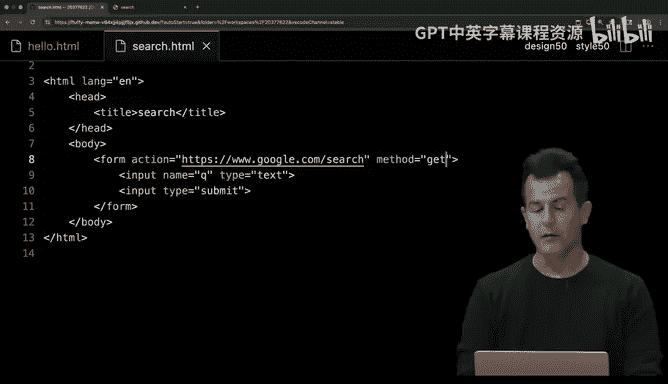

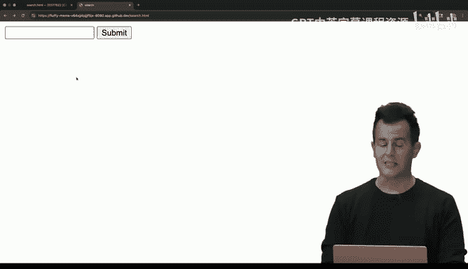

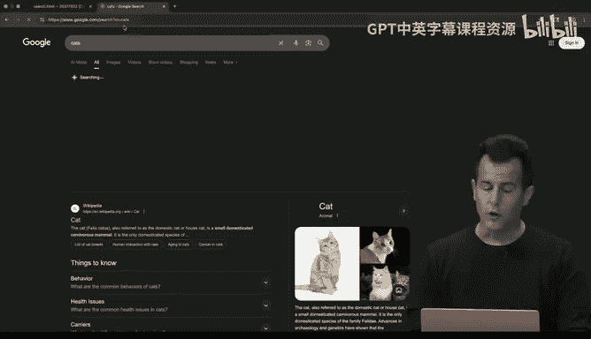

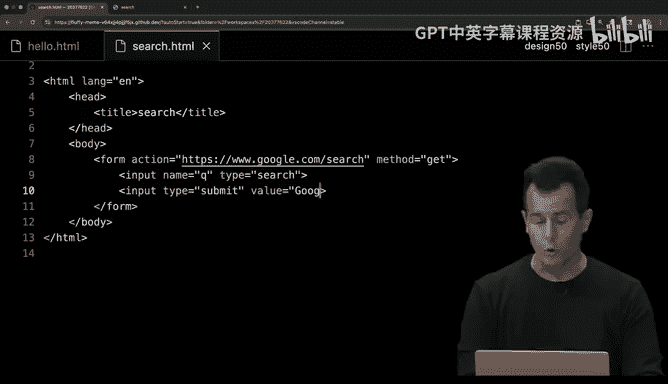

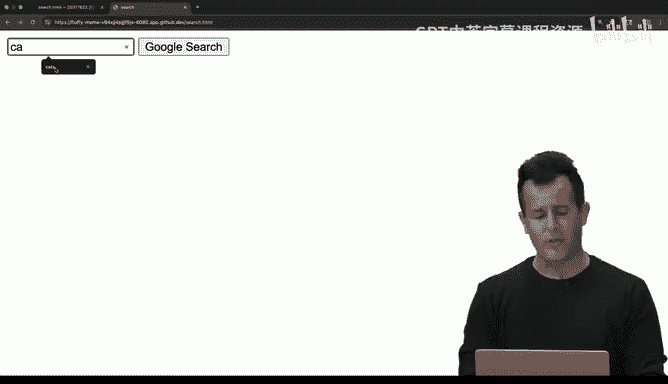

具体来说，在信封内部，她会有一条文本消息。这不是代码本身，没有函数、循环、变量或任何类似的东西。它是一种协议，从某种意义上说，是多年前人类标准化了如果你想从服务器获取网页，信封内部应该出现什么消息。

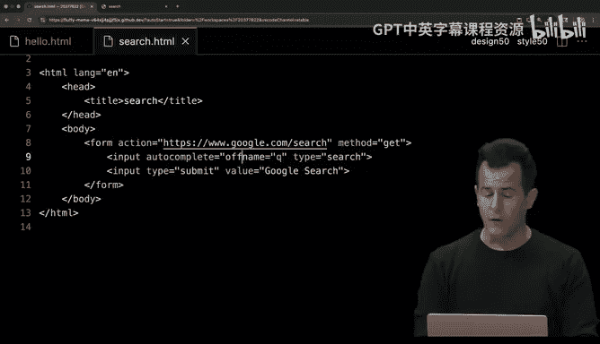

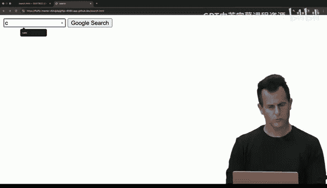

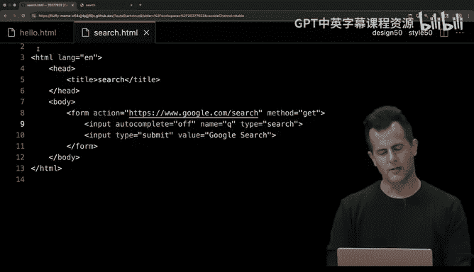

**核心概念：HTTP请求与响应**
例如，如果Brian在这个故事中突然变成了 `harvard.edu`，具体来说是 `www.harvard.edu`，Phyllis的信封会包含一条消息，写着 `GET /`（如果她只想从Brian的服务器获取根目录或默认页面），她使用的HTTP版本（例如版本2），她还会指定主机名（以防Brian在同一台物理机器上为不同域名提供网站服务），以及可能其他几行信息。

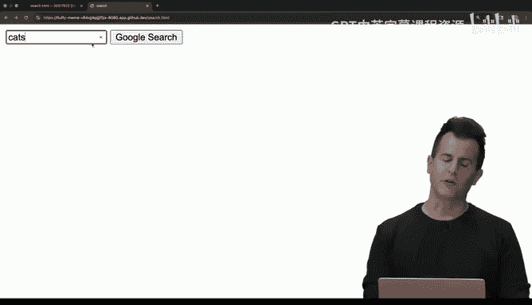

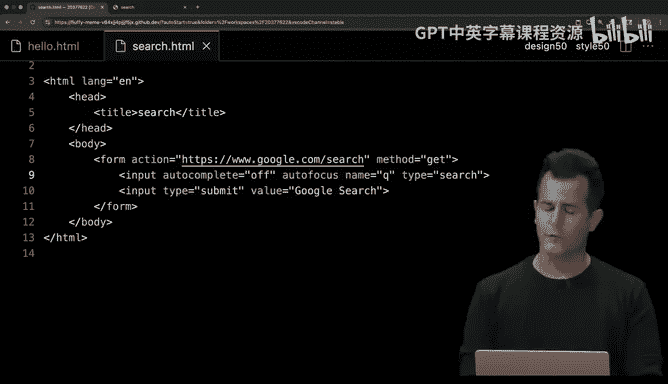

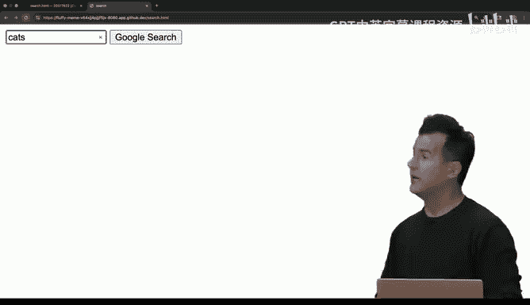

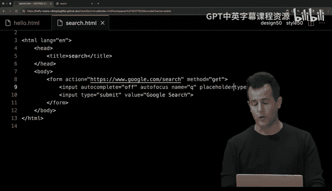

如果一切顺利，Brian会用自己的信封响应，其中包含一个HTTP响应，作为对她HTTP请求的答复。Brian的信封会包含一条文本消息，确认他使用的HTTP版本、一个状态码（只是一个神秘的数字，表示在这种情况下一切正常），并且他会指定他发送回给她的内容类型。因为它可能是HTML（稍后详述）、JPEG、PDF或许多其他文件格式。这只是给Phyllis浏览器的一个提示，告诉她将要收到什么。然后可能还有其他一些信息。

### 使用cURL查看HTTP
即使这些底层实现细节对你来说可能是新的，如果你从未真正思考过它，但事实证明，我们作为有抱负的程序员实际上可以看到并探索这些构建块，并最终利用它们。

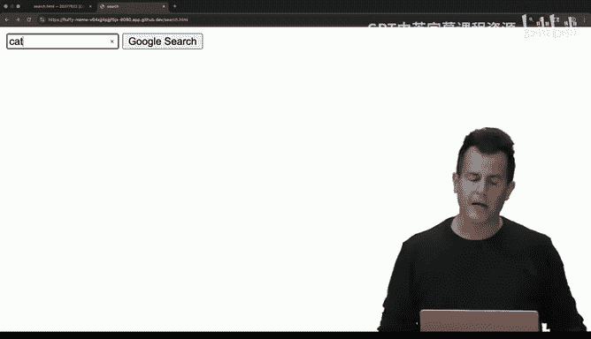

你将看到一个名为 `curl` 的程序，它代表“连接URL”。它安装在像CS50这样的Linux系统中，也经常随Mac和PC一起提供，或者你可以轻松安装它。本质上，它是一个“无头浏览器”，允许你假装成浏览器，通过实际发送像这样的信封内容来获取服务器的响应。

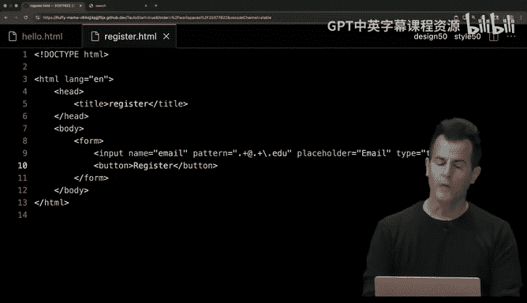

例如，如果我想假装成浏览器并请求 `harvard.edu`，我可以在我的CS50环境中输入以下命令：
```bash
curl -I https://www.harvard.edu
```
`-I` 选项专门只显示“头部”，即我们刚才讨论的文本，而不会发送哈佛网站的任何内容。如果我输入这个，我会看到哈佛的主页，但在这个例子中，我只会在终端中看到黑白文本，具体来说，只看到服务器响应的前几行，即所谓的“头部”。

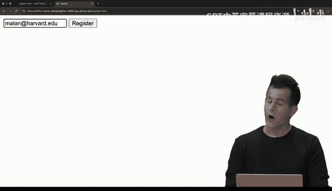

### HTTP状态码
`200 OK` 是最好的可能结果，但还有许多其他可能的结果。例如，有时你得到的不是 `200`，而是 `301`，意思是“永久移动”。通俗地说，这意味着什么？如果服务器以数字代码 `301` 响应浏览器，意味着浏览器应该转到这个“位置”字段指定的地址。这就像在服务器上放了一个绕行标志，说：“这里没有你要的东西，去那边那个位置。”


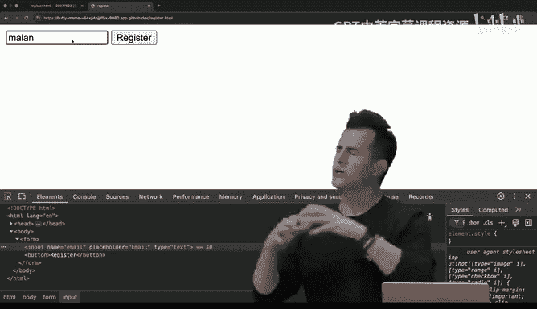

现在注意，在这个例子中，它告诉用户去 `https://www.harvard.edu/`，这实际上是我之前输入的内容。所以我自己不会看到那个，但如果我回到VS Code，运行完全相同的命令，但尝试访问哈佛网站的不安全版本 `http://`（这意味着互联网上任何其他人从技术上讲都可以看到我正在用浏览器做什么，这可能并不理想），这次哈佛服务器不只是告诉我 `200 OK`。它实际上说 `301 Moved Permanently`。如果我往下看这些行，确实有我应该去的“位置”。这是一个细微的差别，它强制我转到 `HTTPS`，而没有实际显示哈佛网站的内容。

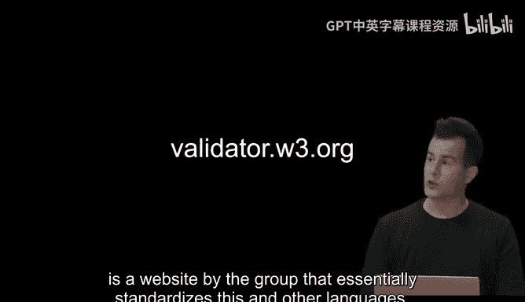

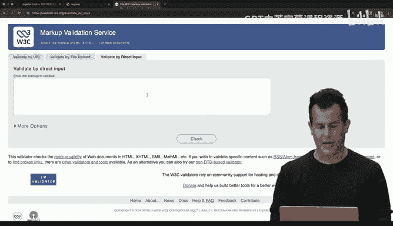

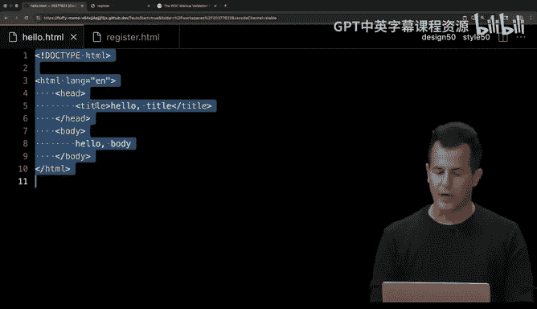

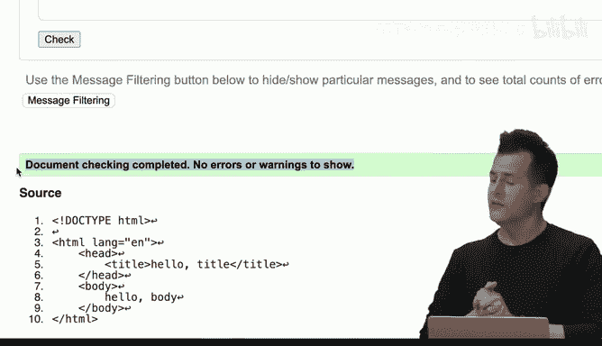

如今，你甚至不必考虑这个，你甚至没有输入 `http://` 或 `https://` 的习惯，但浏览器在这种情况下会自动将你“重定向”到该站点的安全版本。

还有其他状态码。事实上，即使你以前从未意识到，当互联网上出现问题时，你有时会看到什么数字代码？`404`。所以 `404` 是一个奇怪地公开的神秘错误数字或状态码，仅仅意味着“文件未找到”。我们可以模拟如下：例如，如果我在终端窗口中输入 `curl -I https://www.harvard.edu/cats`，假设哈佛有一个专门研究猫的整个部门（实际上并没有），你会看到我得到一个HTTP `404` 状态码，这意味着该网站确实不存在。如果我在浏览器中访问 `https://www.harvard.edu/cats`，我可能会看到某个错误页面，可能显示也可能不显示 `404`。但许多网站（大多数网站）无论好坏都会显示这个数字，以至于这个房间里的几乎每个人都可能熟悉 `404`，即使它的起源是这个非常低级、神秘的状态码，埋藏在像这样的信封内部的HTTP头部中。

还有很多其他状态码。如果你喜欢一些有趣的事实：`200` 确实是OK。`301` 是永久移动。还有其他一些 `3xx` 代码都表示“去别处”。`4xx` 通常意味着你作为用户做错了什么，或者下周当我们开始编写与网络服务器通信的代码时，可能是你的代码在请求网站时做错了什么。`5xx` 真的很糟糕，意味着服务器以某种方式搞砸了，要么不可用，要么程序员在他们的代码中犯了错误，导致它崩溃，例如出现“内部服务器错误”。

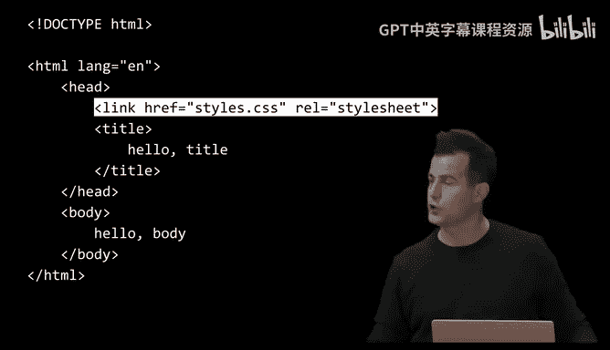

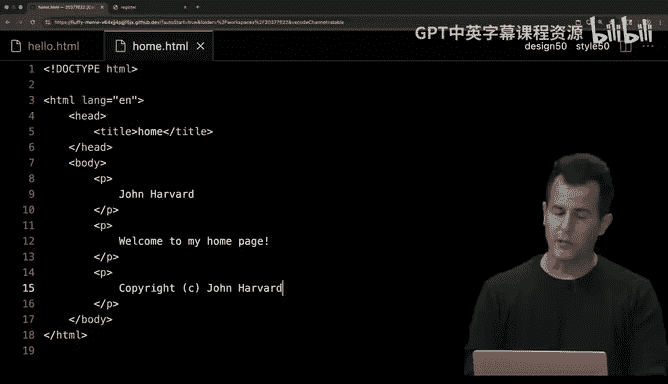

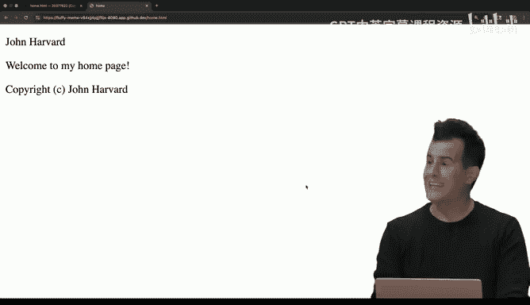

我们包括了 `418`，它实际上不是一个真正的状态码，但它是多年前一个有趣的愚人节玩笑，一群人认为写一个完整的规范来说明服务器用数字 `418` 响应意味着什么会很有趣。这是一个内部笑话，此刻可能不好笑，但如今它已成为互联网传说的一部分。

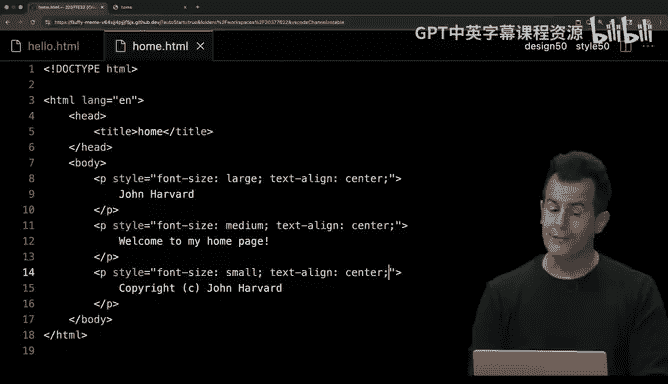

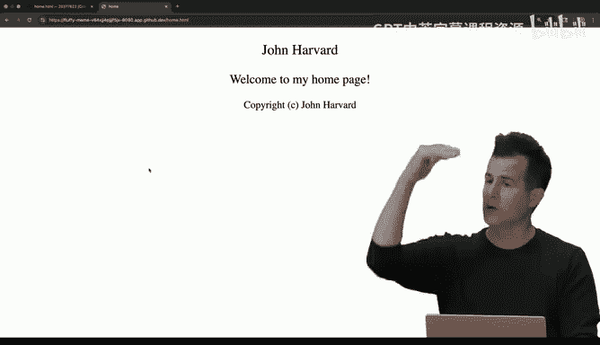

我们可以用这个开个小玩笑，也许要牺牲我们亲爱的朋友。多年来，有人一直在为以下行为付费。让我回到VS Code的终端窗口，输入：
```bash
curl -I http://safetyschool.org
```
你有没有申请过？好吧，让我实际访问 `http://safetyschool.org`，然后按回车。哦，天哪，看看我们在哪里。这是如何实现的？好吧，如果我完成我在这里开始的事情，只是查看信封内部的HTTP头部，我的实际浏览器刚刚发送到 `safetyschool.org`。大约20年来，可能某位哈佛校友一直在支付账单租用这个域名，只是为了实现这个技巧，使得 `301 Moved Permanently` 从此将人们重定向到 `yale.edu`。如果你在Reddit等网站上深入挖掘，还有很多其他例子，斯坦福、伯克利，东海岸和西海岸之间存在健康的竞争。但这都归结为对HTTP如何工作的非常神秘的理解，HTTP是管理数据从Web浏览器发送到Web服务器的协议。

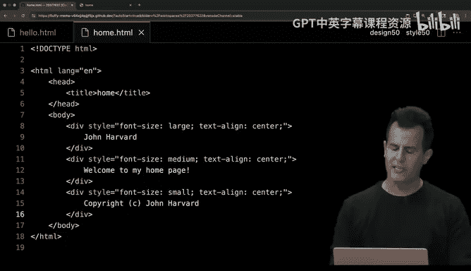

### 使用浏览器开发者工具
当然，你可以在像CS50这样的环境中使用 `curl` 来连接URL。但你也可以一直用你的实际浏览器做类似的事情。如今，大多数浏览器都原生提供了“开发者工具”的能力。也就是说，菜单中应该有一个选项，让你使用开发者工具，这些工具适合懂一点编程的人来探索浏览器引擎盖下的情况。

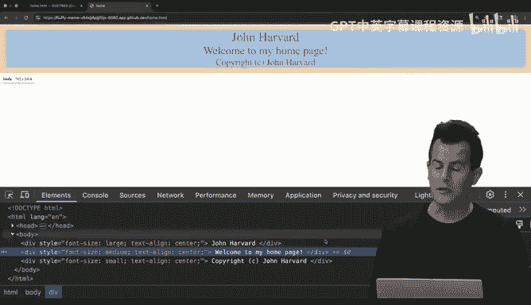

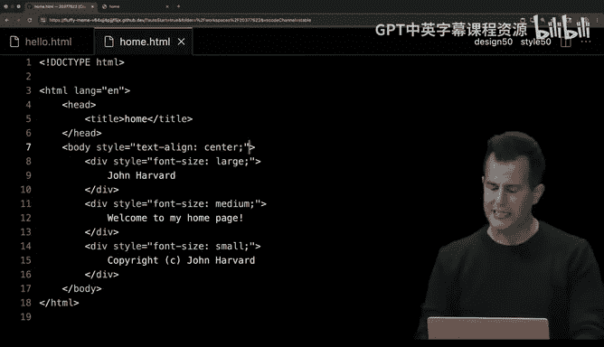

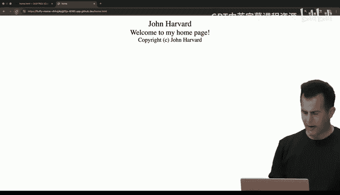

例如，我将打开一个新窗口。我可以在背景上右键点击，或者去Chrome的菜单，选择“检查”，这会调出我们称之为“开发者工具”的东西。我使用无痕模式，原因我们下周会看到，这具有自动清除我的任何cookie、浏览器历史记录的效果，因为今天我用网络浏览器做的任何事情，我都想假装我是第一次做，这样行为就完全符合我们的预期。

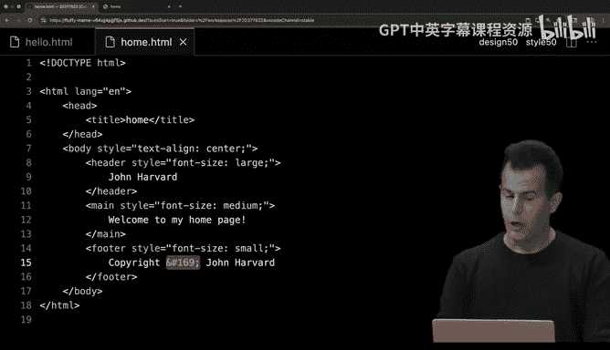

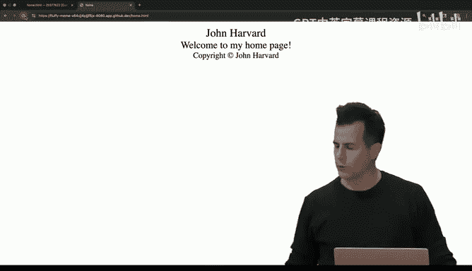

现在我已经在Chrome中打开了所谓的“开发者工具”，它们在Safari、IE和其他许多浏览器中看起来几乎一样。我会看到一个名为“元素”的标签页，显示了这个网页一旦出现后的所有元素，包括所谓的HTML代码。我可以看到一个“控制台”，错误消息有时会出现在那里，类似于VS Code中的终端窗口。我还可以看到浏览器与服务器建立的“网络”连接。这就是我们开始关注的地方。

这里我有一个全新的浏览器窗口。我点击这里的“网络”。为了确保我们能看到一切而不会自动删除，我点击了“保留日志”并“禁用缓存”，这样它的行为就完全符合预期。现在让我第一次在这个无痕窗口中访问 `http://safetyschool.org` 并按回车。你会看到一大堆输出，包括在这个特定模式下的警告。如今，对于不支持HTTPS的网站（这位校友没有付费），这种情况越来越常见，你通常会得到一个警告，说明你可能不想这样做，因为你和B点之间的整个世界都可能知道你在网络上访问什么。我可以继续通过这个警告。事实上，一旦我这样做，点击“连接到网站”，我们会在底部看到更多输出，以及一大堆令人不知所措的输出。

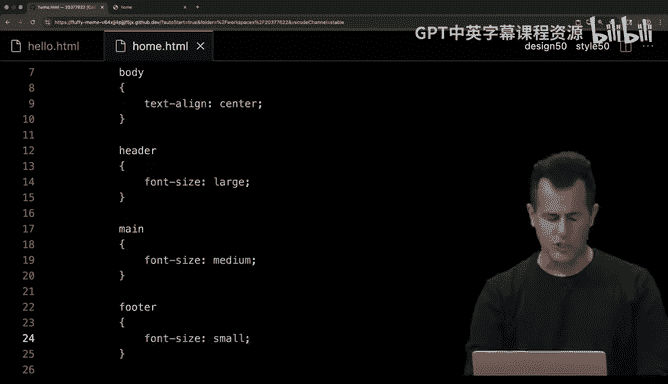

注意左下角，仅仅访问 `safetyschool.org` 就导致了61个HTTP请求，实际上有61个信封来回传递。不过，我将关注最顶部的那些，当我们最终点击通过那个警告，并从访问 `safetyschool.org` 的服务器得到响应时，这里是Chrome对相同信息的呈现，这些信息 `curl` 刚才在终端窗口中显示给我：返回的消息是 `301 Moved Permanently`，使用的协议版本是 `GET`，这里提到了相关的IP地址，以及今天我们将忽略的其他一大堆东西。

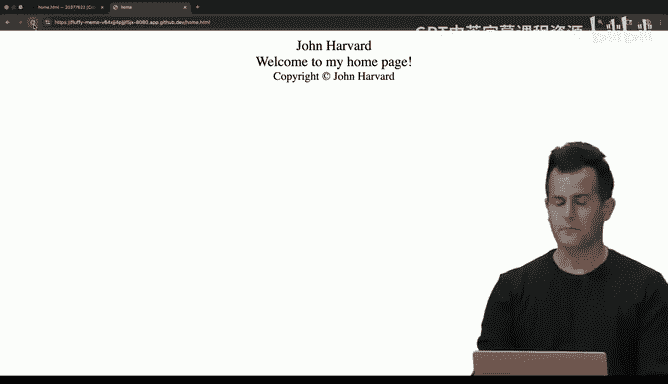

所以一直以来，你都可以看到相同的信息。让我们用一些猫来试试这个。让我点击清除开发者工具中所有内容的小幽灵符号。让我缩小窗口。这次，让我访问 `https://www.harvard.edu/cats`，回想一下，根据 `curl`，它并不存在。如果我按回车，我确实看到了一个网页。有趣的是，哈佛选择相当神秘地向所有访问者显示 `404`，这除了状态码之外没有其他意义。但如果我滚动浏览涉及显示这个非常图形化页面的所有59个请求，并回到顶部，你会看到通过点击第一行（cats本身），我使用了 `GET` 来获取那个URL `/cats`，并且它确实是 `404 Not Found`。

所以，你可以通过探索浏览器一直对你隐藏的内容，自己拥有所有这些乐趣。

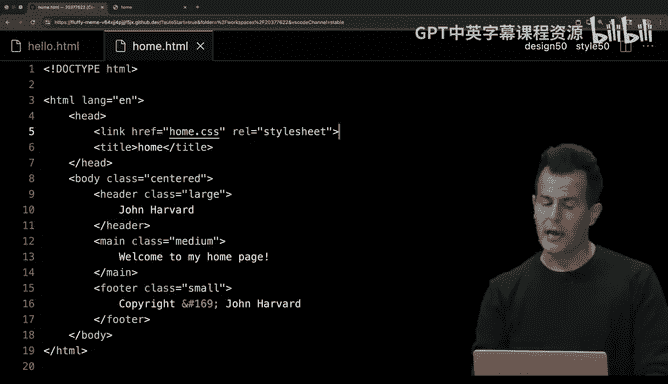

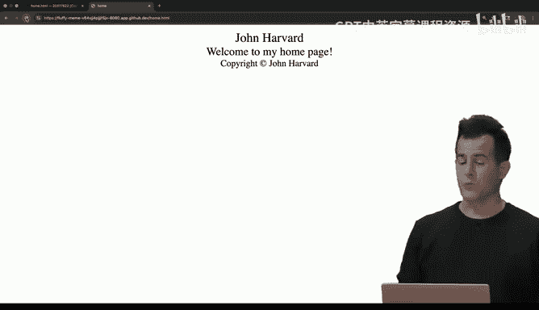

---

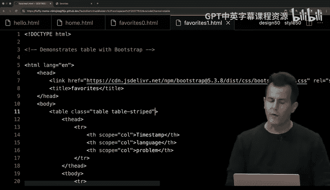

## HTML：超文本标记语言 📄

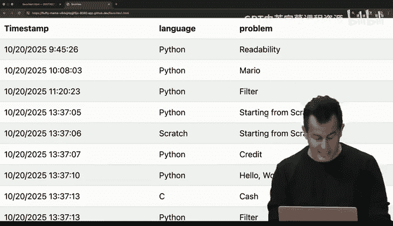

好了，这就是“网络”标签页。让我们看看其他一些标签页，看看我们如何开始自己编写这些东西。

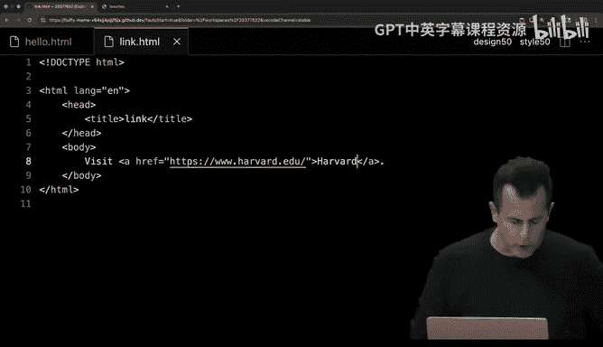

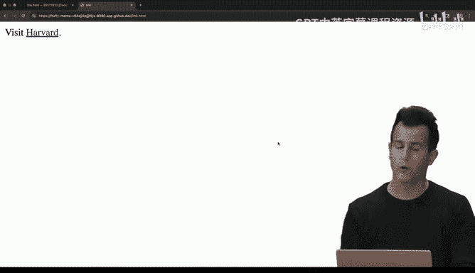

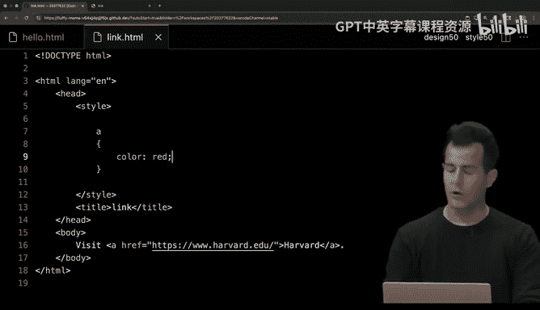

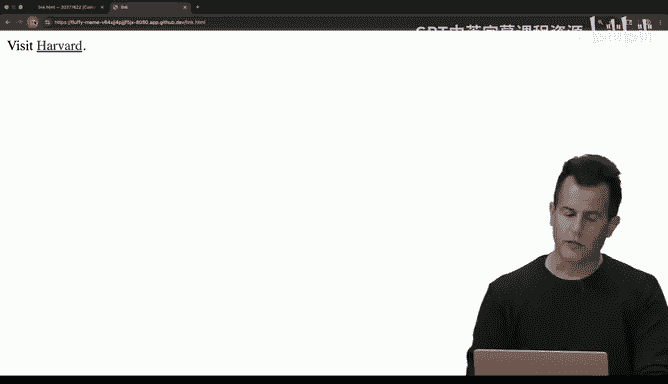

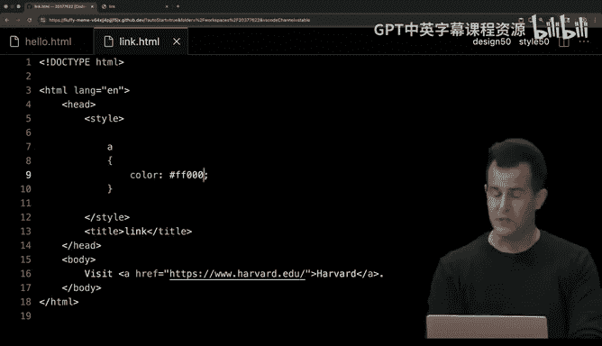

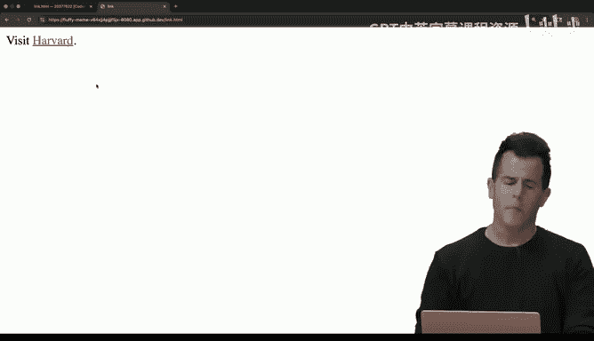

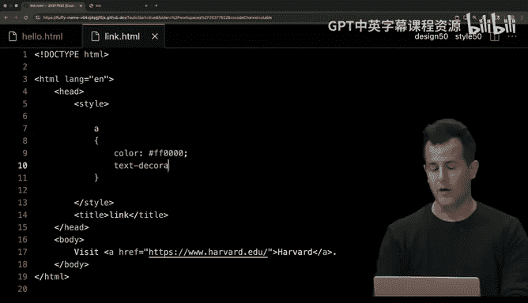

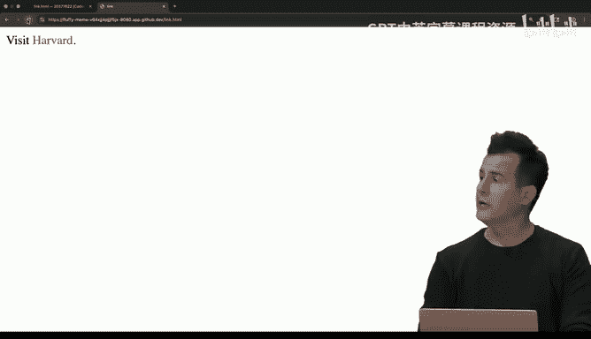

让我访问 `stanford.edu` 并按回车。一大堆东西会飞过屏幕，但这次我要去“元素”标签页。我们即将深入探讨的是一种实际的语言——不是编程语言，而是一种称为HTML（超文本标记语言）的标记语言。其目的只是告诉浏览器在屏幕上显示什么。

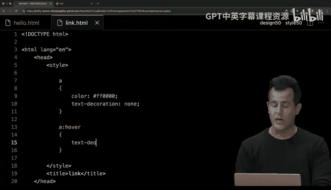

这里是一些人类或斯坦福的软件编写的所有所谓的HTML，用于创建斯坦福的主页，截至今天看起来像这样。但有趣的是，斯坦福编写的用于生成这个网站的代码是作为副本发送给我的。这与我们迄今为止编写的代码完全不同。你在Scratch中编写代码，代码存储在MIT的服务器上；当你编写C代码并运行时，它是在代码空间内部，不会提供给任何可能访问它的用户。

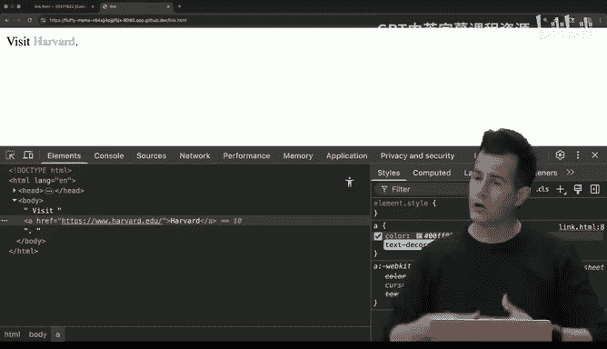

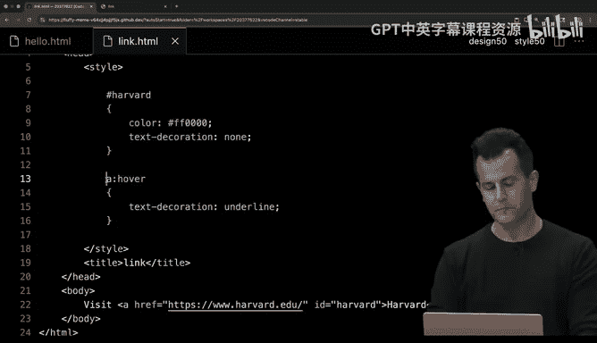

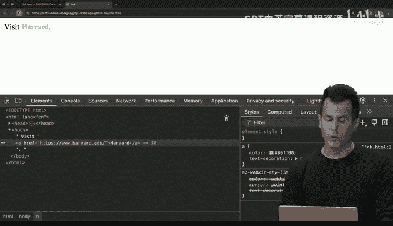

然而，网络的工作方式有点不同。在这些信封内部，实际上是服务器上内容的副本被发送到浏览器。因此，是你的浏览器（所谓的客户端）实际读取这些代码（在这种情况下是HTML），从上到下，从左到右，并弄清楚如何显示它。代码本身不是在服务器上执行的。当我们下周开始使用Python动态生成HTML时，这个故事会有所改变，这样本周之后我们就不用手动编写所有这些代码了。但现在，你看到的一切都是浏览器执行斯坦福编写的代码的结果。

这意味着我们可以用这些相同的开发者工具玩点花样。例如，如果我按住Control键点击或右键点击他们主页中间像“Stanford”这样的词，选择相同的“检查”选项，这些开发者工具的好处是它会跳转到创建网页中间那个斯坦福品牌名称的代码行。这是一个很棒的教学和学习工具，因为在接下来的日子里，当你试图学习更多HTML时，你实际上可以为互联网上的任何网站做这件事，并理解某人如何实现了一个你非常喜欢的设计。你可以从其他网站学习它们是如何构建相同设计的。

所以在这里，你会看到“Stanford”这个词就在这个页面的源代码中，即所谓的HTML中。你知道，只是为了好玩，我可以把它改成“Harvard”并按回车。现在斯坦福的网站看起来像我们去过那里并黑掉了它。当然，黑掉斯坦福的网站没那么容易。我刚才可能只做了什么？我只是改变了我本地该特定网站的副本。所以如果我点击重新加载图标，我实际上会看到斯坦福的网站，无论好坏，仍然看起来像那样。但这说明了我们现在在浏览器内实际操纵和学习引擎盖下情况的能力。

### HTML基础
让我们深入探讨这种称为HTML的语言。它不是一种编程语言，这意味着我们将比平时更快地浏览它，因为它真的只包含一些基本的构建块。它下面确实有一些有趣的知识设计，但大多数情况下，它最终变成了一种练习，就像查找其他存在的标签、阅读文档并弄清楚如何使用它们来实现网站中的其他功能。

让我们看看也许是最简单的网页，并具体从中了解什么是“标签”和“属性”——这将是这种语言中唯一两个需要掌握的术语。没有循环，没有条件，没有变量，除了像这样的基本构建块之外，真的没有复杂性。

以下是最简单网站的HTML。这就像是斯坦福团队在他们服务器上编写的迷你版本，但它只有十几行代码，而不是数百或数千行，无论那个网站有多长。

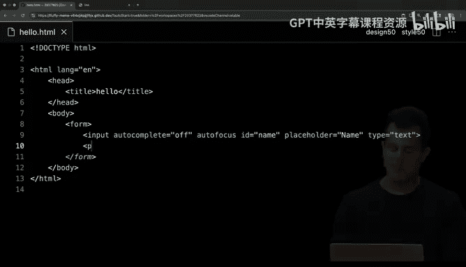

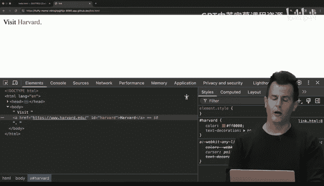

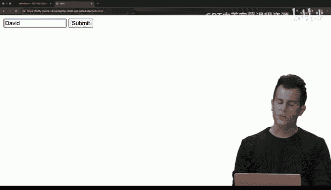

**核心概念：HTML文档结构**
任何今天编写的网页，假设它使用最新版本的HTML（截至今天是版本5），都以如下代码开始：
```html
<!DOCTYPE html>
<html lang="en">
    <head>
        <title>hello, title</title>
    </head>
    <body>
        hello, body
    </body>
</html>
```
这种代码可能会存储在一个名为 `file.html`、`index.html`、`stanford.html` 的文件中，无论文件实际叫什么。这只是将要放在内容内部的东西。你可以将此文件保存在自己的Mac上，打开它，你的浏览器会打开它，但如果它只在你的Mac或PC上，那么世界上只有你能看到该网页的内容。当然，我们将在服务器上编写HTML，这样不仅是你，理论上，特别是对于你的最终项目，世界上任何有互联网连接的人都可以访问它。

在CS50开发环境的上下文中，我们将开始使用一个新命令 `http-server`。其目的只是通过HTTP提供文件。这里有一个有趣的设计，因为如果我们使用CS50.dev（也称为GitHub代码空间），该网站上已经运行了一个Web服务器，因为当你访问CS50并登录并被重定向到某个更长的URL时，你正在使用一个Web应用程序（即VS Code），它允许你在云端编写代码。默认情况下，该应用程序运行在端口80和443上。所以无论你启动 `http` 还是 `https` 都会工作，但这意味着我们今天编写的代码，以及你为下一个问题集或最终项目编写的代码，不能位于端口80或443，因为托管此服务的GitHub公司已经在使用那些默认的标准端口。

但我们可以使用任何其他端口号。我之前声称有数万个数字我们可以使用。这就是我们实际要做的。让我回到VS Code。让我缩小终端窗口。让我创建一个今天的第一个文件，例如 `hello.html` 并按回车。现在我有一个空标签页。我将非常快速地编写我们刚才看到的完全相同的内容。

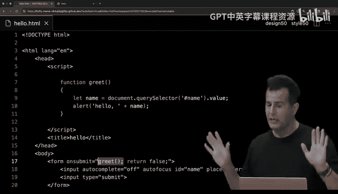

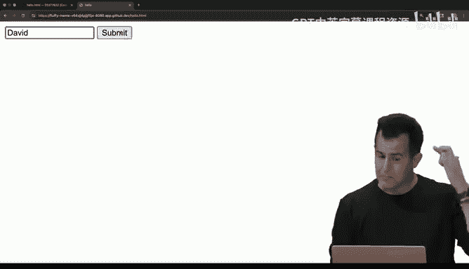

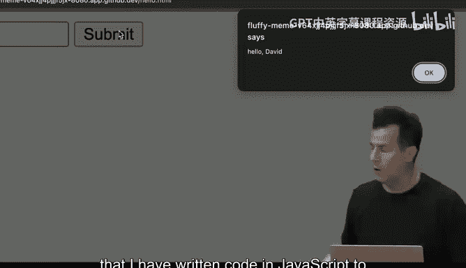

所以，一个尖括号和感叹号，`<!DOCTYPE html>`，然后开括号 `html`，闭括号 `>`，注意自动补全对这个特定语言生效了，所以我不必自己输入所有内容。在这个“标签”内部，我现在要放一个 `head` 标签，里面会有一个 `title` 标签。我会写一些像 `hello, title` 的东西以快速完成。然后在这几行下面，我要放一个所谓的 `body` 标签，里面是 `hello, body` 作为一些快速文本。就这样。

现在这是我的代码空间中的一个文件，终端中没有命令可以编译或运行它，因为目标是用浏览器打开这个HTML文件。如果我想在另一个浏览器标签页中这样做，我需要告诉我的代码空间通过HTTP提供该文件。最简单的方法如下：`http-server` 并按回车。你会在屏幕上看到一大堆文本，希望会弹出一个绿色的按钮，上面写着“在浏览器中打开”，这将允许你打开当前文件夹的内容（我会放大）和一个网络浏览器。

我的URL已经改变，与刚才不同。我今天提前带来了我自己的代码文件夹，像我们通常做的那样，`source8`，其中包含今天所有预先制作的示例，但这里是我刚才创建的文件。如果我点击那个 `hello.html`，我们此刻看到的只是一个目录列表，即我代码空间中所有文件的目录索引。我看到了最简单的网页。它有点 underwhelming，但很明显，这里是 `hello, body`，占据了大约95%的屏幕，即所谓的“视口”，也就是屏幕上的大矩形区域。但标题在标签页上那里。所以，如果你曾经想知道或关心网页中的内容来自哪里。那么，这里是正文内容。这里是头部或标题内容，然后其他一切都只是锦上添花。

### HTML元素与属性
在这一点上，我编写了一个名为 `hello.html` 的文件，它产生了这样的效果：在页面的头部有一些内容，在正文中有一些内容。但让我们实际剖析一下刚才发生了什么。

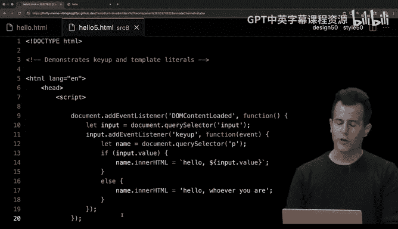

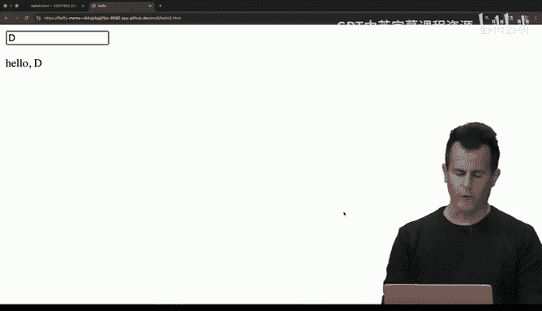

在任何用这种称为HTML的语言编写的文件开头，最新版本（5）实际上就是这样开始的。这只是你记住或复制粘贴的东西：`<!DOCTYPE html>`。它看起来有点不同，因为我们在大多数情况下不会在其他任何地方使用感叹号语法，除非我们使用HTML注释。HTML有注释，就像Python、C和其他语言一样。

但让我们真正关注这个更丰富的部分。这里我们有一个所谓的HTML“元素”。一个元素包括一个开始标签和一个结束标签，或者等价地，一个开标签和一个闭标签。例如，这里的语法本质上会告诉浏览器，当我的浏览器从上到下、从左到右读取这个文件时：“嘿，浏览器，我的页面的HTML来了，这个页面内容是用英语写的。”

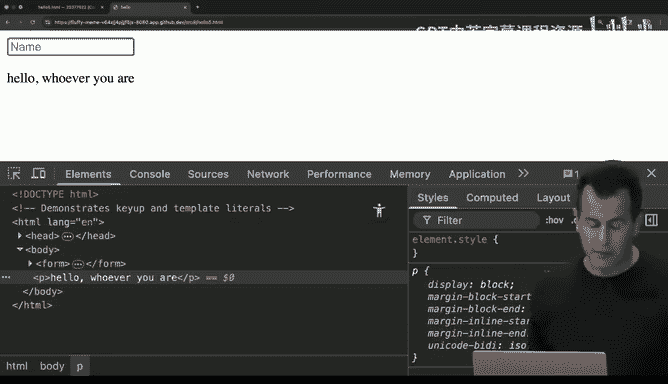

所以，`html` 全小写是标签的名称，等价地，也是元素的名称。`lang` 将被称为“属性”，它只是修改元素的默认行为，`"en"` 是它的值，这是英语的简写符号。大多数人类语言也有简写符号。

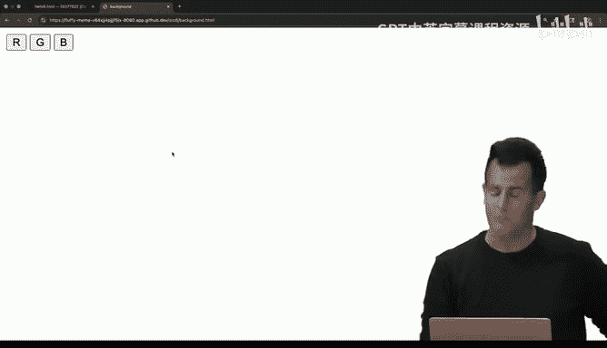

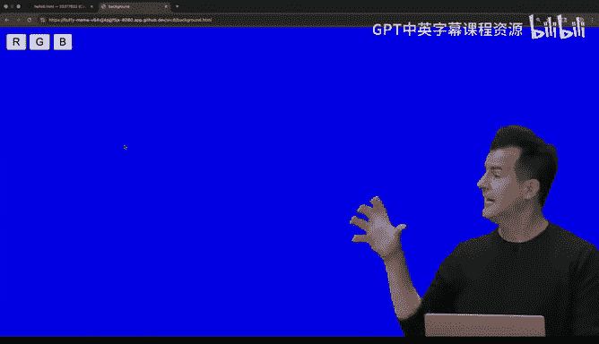

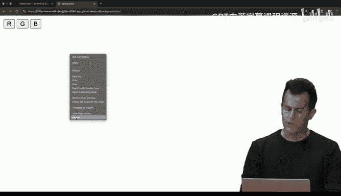

所以你有一个标签名和一个带值的属性。我们在字典、哈希表或任何其他上下文中已经见过很多次这些键值对。在HTML中，键值对用等号分隔，值通常用双引号或单引号括起来，但要保持一致。

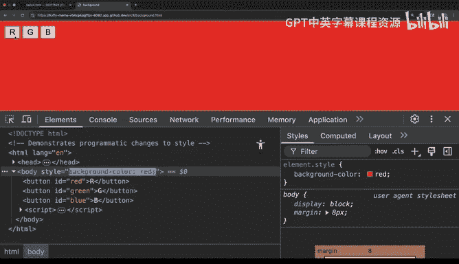

然后注意在这个文件的末尾，根据缩进，这里有对称的东西，其效果是关闭标签或结束标签。这有效地告诉浏览器：“嘿，浏览器，我的HTML到此结束。”同时，其他所有内容都遵循类似的范式，位于这两个标签内部。

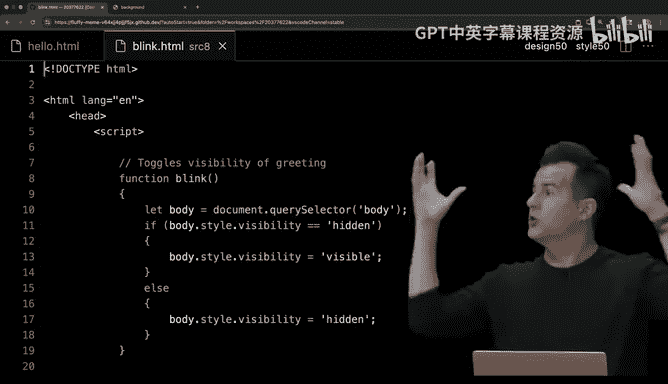

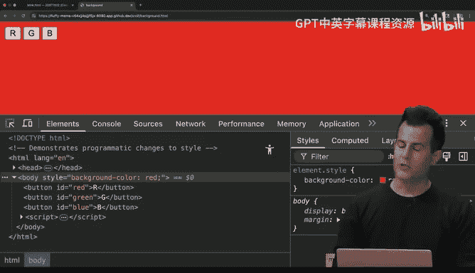

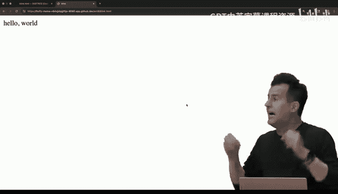

这里是一个 `head` 标签，说：“嘿，浏览器，我的页面的头部来了。嘿，浏览器，页面的头部到此结束。嘿，浏览器，在头部内部，标题来了。标题到此结束。标题是什么？`hello, title`，就像我在代码空间中写的一样。”对于 `body` 也是同样的故事：“嘿，浏览器，页面的正文来了。屏幕的95%。正文到此结束。”但正文中的内容正是那个。缩进是漂亮打印的，我使用了四个空格，就像我们通常做的那样，但并非严格必要。事实上，在我自己的代码空间中，我甚至没有费心把它们放在三行上，我只做了一行，这没关系，因为正如我们将看到的，浏览器通常会忽略空白。但我这样做，就像我们经常做的那样，只是为了确保对我们人类来说可读性强。

让我提一下屏幕上另一件事，直到现在，每次讲座前，我一直在终端窗口中隐藏一大堆标签页，但今天我留下了一个你可能见过但以前没在意的标签页，即“端口”。正是在这个“端口”标签页下，你实际上可以看到TCP端口的真实体现。默认情况下，当你运行命令 `http-server` 时，它会在自己的Web服务器（自己的HTTP服务器）上提供我的当前文件夹的内容，但不是使用默认端口80或443，因为GitHub已经在CS50.dev和他们的产品上使用了这些端口。但默认情况下，我们选择了另一个常见的开发端口号 `8080`，这很有趣，因为它只是 `80` 两次，但这是一个人类惯例，它可能是数千种其他可能性中的任何一个。但这行只是告诉我，我显然在端口 `8080` 上运行了一个服务器。如果我点击那里，我也可以手动打开相同的标签页。但这就是绿色按钮为我做的事情，它通知我：“嘿，你刚刚在这个端口上启动了一个Web服务器，你想用其内容打开一个新标签页吗？”

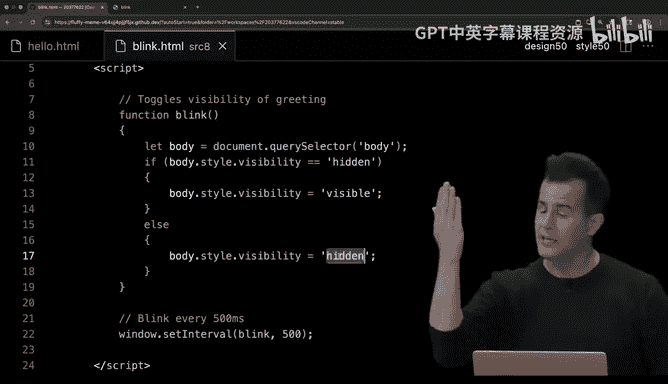

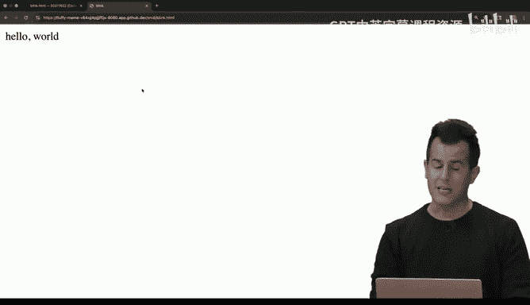

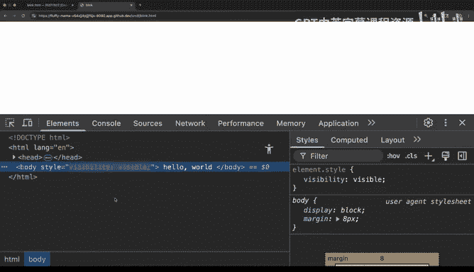

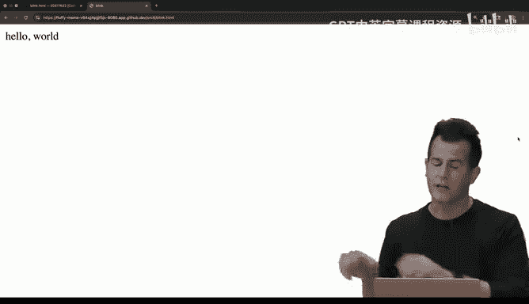

### 文档对象模型
这就是我们现在描绘的画面。让我重新调出我们刚才编写的代码，让我提议，我们真正做的是在浏览器的内存中构建了一棵树。所以我们与第5周讨论树和其他层次结构时的情况形成了完整的循环。

如果我们假设文档可以用一个看起来有点像椭圆的节点来表示，它只代表文件的全部内容。那么，按照惯例，它以一个根元素开始，即 `html` 元素，你的页面只能有一个这样的元素。但里面的 `html` 标签可以有一个 `head` 标签和一个 `body` 标签。在这种情况下，`head` 标签回想一下有一个 `title` 标签以及其实际文本，即 `hello, title`。同时，`body` 也只有其文本。

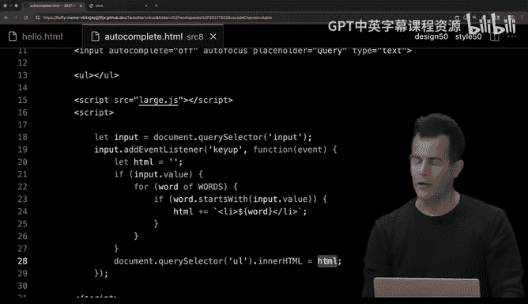

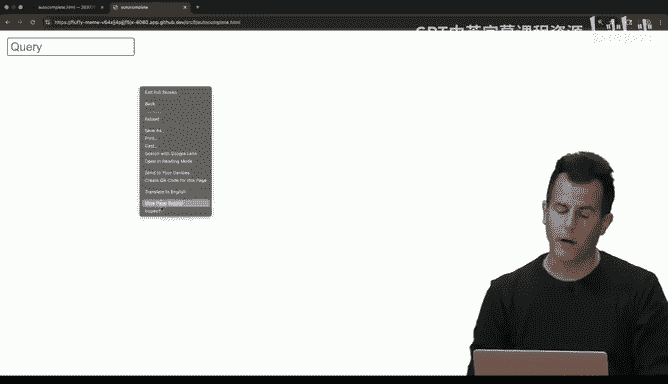

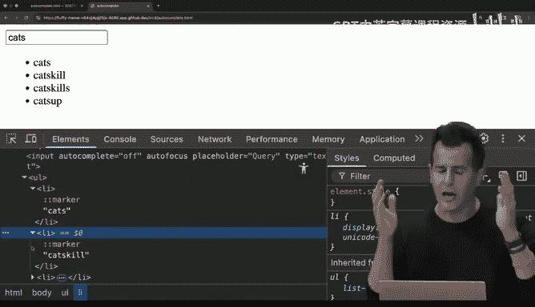

所以，当我不断说浏览器正在下载文件（例如 `hello.html`）并从上到下、从左到右读取它时，它确实是在这样做。但不知何故，它使用 `malloc` 或无论它用什么语言编写来分配节点、节点、节点，并在你的浏览器内存（或RAM）中填充那棵树，一个非常像那样的数据结构。所以这一切都与我们之前的情况相关。


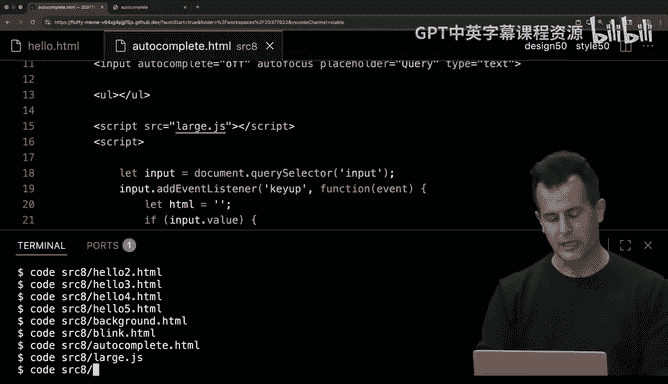

---


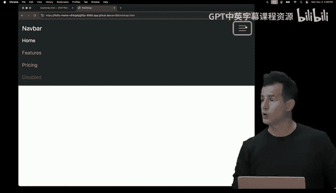

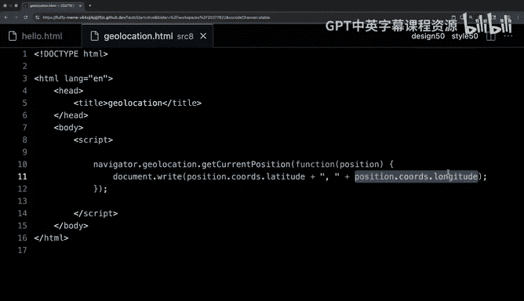

## 更多HTML标签 🏗️

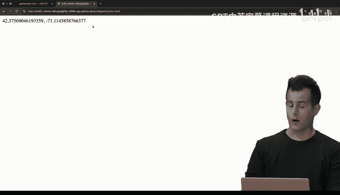


我们回来了，从这里开始，我们所做的一切在结构上看起来都