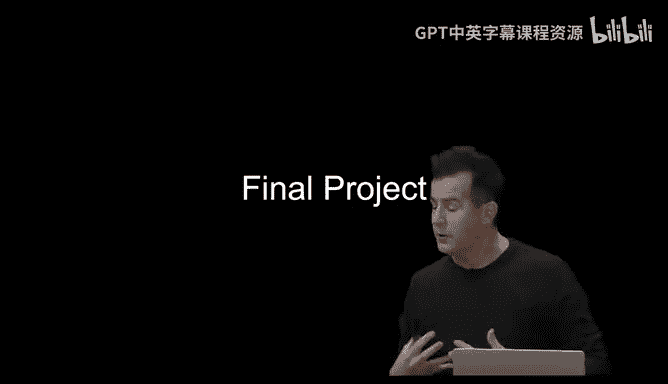
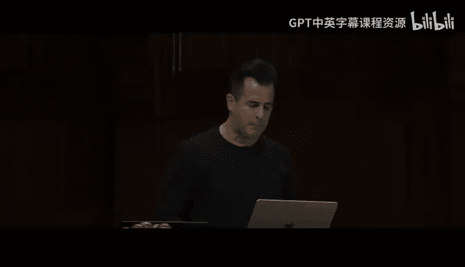
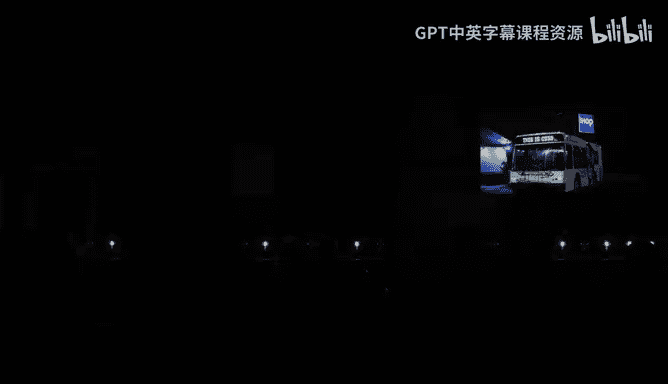
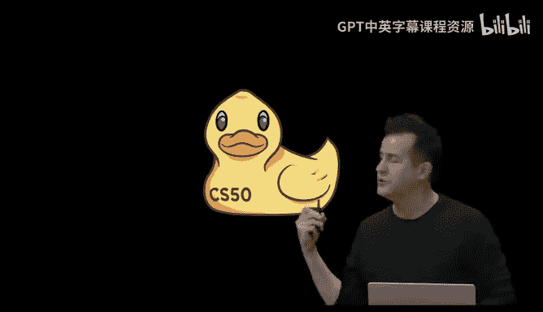
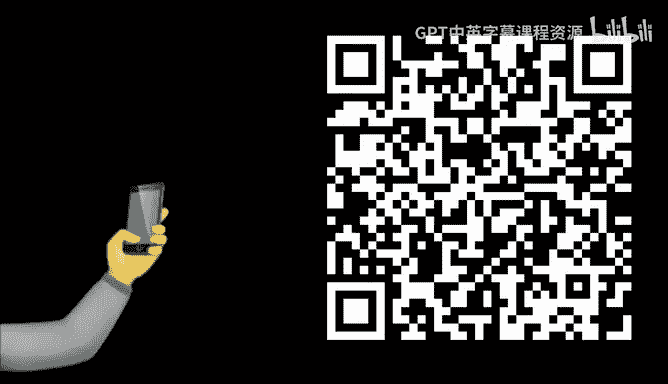
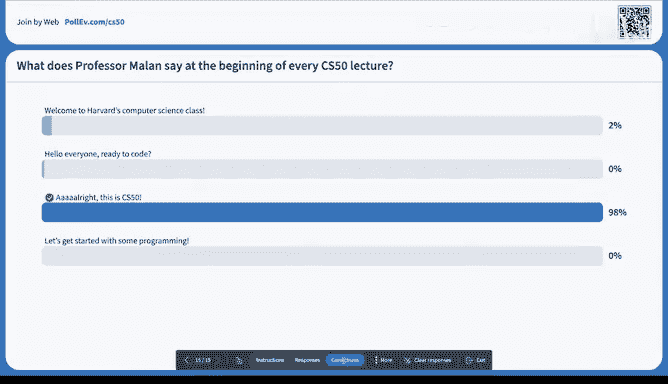
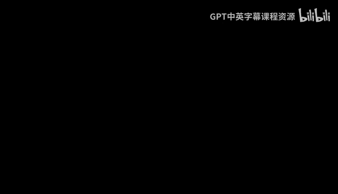

# 012：终点 🎓

## 概述
在本节课中，我们将回顾整个CS50课程的核心思想——解决问题，并通过互动游戏重温关键概念。课程将以一场知识竞赛和庆祝蛋糕作为结束。

---

## 课程回顾与互动练习

上一节我们介绍了本课程的最终目标。本节中，我们来看看如何通过互动来理解编程中的核心挑战：精确性与抽象。

### 编程中的精确性与抽象
为了说明编程中精确指令和适当抽象的重要性，我们进行了一个绘图练习。

以下是绘图练习的步骤：
1.  绘制两条紧挨着的垂直线。
2.  在两条垂直线上方、中间和下方各画一个点。
3.  将左边垂直线的顶端与上方的点连接，右边垂直线的顶端也与上方的点连接。
4.  将左边垂直线的顶端与中间的点连接，右边垂直线的顶端也与中间的点连接。
5.  将左边垂直线的底端与下方的点连接，右边垂直线的底端也与下方的点连接。
6.  在中间的点与下方的点之间画一条线。

然而，听众根据这些指令画出的结果各不相同。原因在于指令缺乏一个更高层次的抽象概念（例如“画一个立方体”），并且对线条的方向、长度和位置描述不够精确。这说明了在编程中，选择合适的抽象层级和提供精确的细节同样重要。

### 反向编程练习
接下来，我们进行了反向练习，由观众通过喊出指令来指导一名志愿者在画板上绘图。

观众混合使用了低层细节指令（如“从那条线的底部画两条对角线”）和抽象概念（如“画一个火柴人”）。抽象概念为绘图者提供了有用的心理模型，而具体指令则用于实现细节。这类似于在函数顶部写注释，然后在函数内部实现逐步指令。

---

## 课程旅程总结

上一节我们通过游戏体验了编程沟通的挑战。本节中，我们来回顾一下过去十周的学习轨迹。

我们的学习路径如下：
*   **第0周：Scratch** - 引入了过程式编程基础，如循环、条件、布尔表达式和变量。
*   **C语言** - 作为一种基础语言，让我们理解了数组、算法、内存管理和数据结构（如哈希表、链表）等底层概念及其权衡。
*   **现代编程** - 以此为基础，过渡到现代编程范式，特别是Web编程（HTML、CSS、JavaScript），并提及了移动应用开发。
*   **人工智能** - 鼓励大家在最终项目中利用AI工具来提升生产力。

整个课程的核心始终是“解决问题就是计算机科学”。我们处理输入（待解决的问题），通过算法（黑箱中的逐步指令）产生输出（解决方案）。

---

## 最终项目与未来支持

上一节我们回顾了所学知识。本节中，我们来看看如何应用这些知识完成最终项目，以及课程结束后可用的资源。

### 最终项目
最终项目的目标是创建你的第一个自定规格项目。你可以从零开始，或借鉴之前问题集的代码。项目要求解决一个你感兴趣的实际问题。

### CS50 Hackathon
CS50 Hackathon是一个传统的深夜活动，旨在帮助你启动最终项目。教学团队将在现场提供指导，帮助你自主寻找资源和解决问题。

### CS50 Fair
CS50 Fair是学期末的展览会，你可以向来自校园各处的访客展示你的最终项目。届时会有气球、拍照亭等活动，并可以领取CS50纪念T恤。

---

## 课后工具与资源

上一节我们介绍了课程结束前的活动。本节中，我们来看看课程结束后你可以使用的工具和继续学习的资源。

### 开发环境
*   **迁移到本地VS Code**：你可以从CS50在线环境迁移到本地安装的Visual Studio Code，以便离线工作并利用更强大的本地计算能力。
*   **其他流行编辑器**：如Cursor、Windsurf等集成开发环境（IDE）。
*   **命令行工具**：在Mac（终端）或Windows上安装类Unix工具，以便在本地使用命令行。

### 代码管理与协作
*   **Git**：学习使用Git进行版本控制和协作。CS50提供了相关教程。
*   **VS Code Live Share**：一个更简单的实时协作工具，允许多人同时编辑同一代码空间。

### 项目部署
*   **静态网站托管**：可以使用GitHub Pages或Netlify（提供免费层）托管HTML、CSS、JavaScript网站。
*   **Web应用托管**：对于需要后端（如Python、数据库）的应用，可以考虑Amazon、Microsoft、Google、Cloudflare等提供的学生优惠套餐，或Heroku、Render等服务。

### 人工智能工具
鼓励在最终项目中使用AI工具（如ChatGPT、Claude、GitHub Copilot）来辅助调试和构建功能，但核心工作仍需自己完成。你可以在CS50代码空间中重新启用GitHub Copilot。

### 社区与学习资源
*   **问答社区**：如Reddit、Stack Overflow。
*   **技术新闻**：如TechCrunch、Hacker News。
*   **更多CS50课程**：edX上提供了更多高级课程，如Python、SQL、网络安全、游戏开发等，可供免费学习。
*   **申请成为教学人员**：未来可以申请成为CS50的教学研究员（TF）或课程助理（CA）。
*   **加入社区**：通过CS50的社交媒体和社区保持联系。

---

## 致谢与结束活动

### 致谢
感谢所有使这门课程成为可能的人，包括纪念礼堂的工作人员、音频团队、Chang's餐厅的朋友，以及CS50的全体教学团队和助教。特别感谢创造了CS50鸭子的团队成员。

### 知识竞赛
我们以一场包含15个关于CS50内容的快速问答竞赛作为结束。问题涵盖了二进制、2038年问题、编译步骤、指针、算法复杂度、数据结构、SQL、HTTP状态码、内存管理、DNS、SQL事务等主题。最终，在“Mal教授每堂课开头说什么？”的问题中，以“Alright, this is CS50”作为课程的正式结束。

---

## 总结
本节课中，我们一起回顾了CS50的核心思想，通过互动游戏理解了编程中精确与抽象的重要性，总结了从Scratch到AI的完整学习路径，并为最终项目及未来的编程之旅指明了工具和资源。课程以一场知识竞赛和分享蛋糕的庆祝活动画上句号。Alright, this was CS50.