# 003：Breakout 🧱

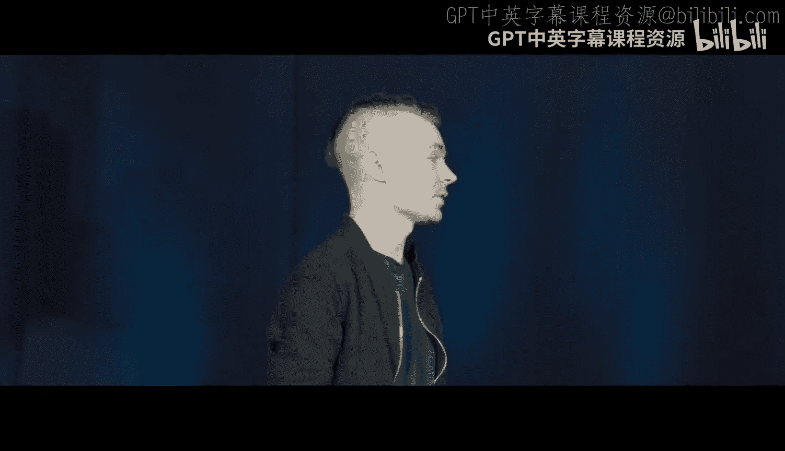

## 概述

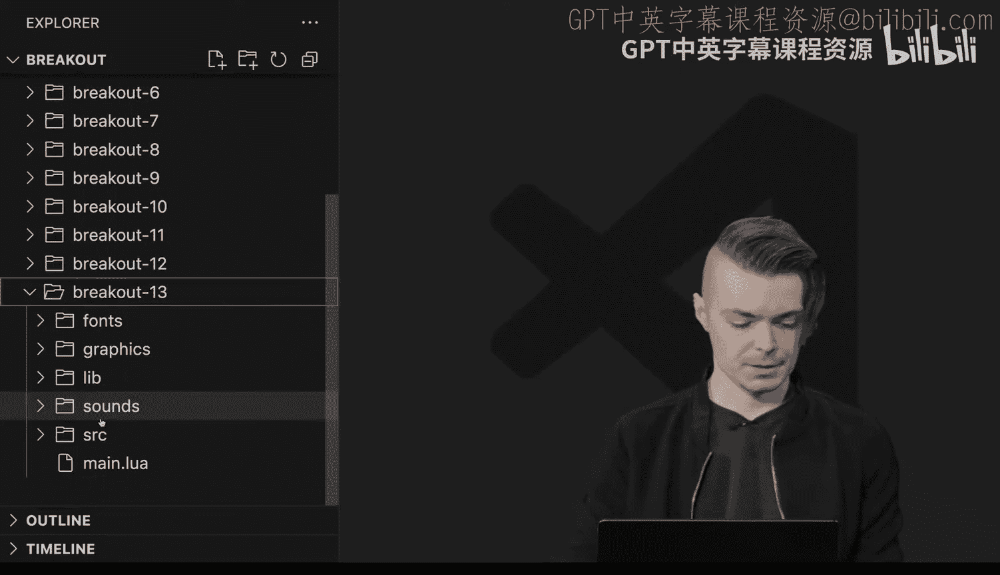

在本节课中，我们将学习如何开发一个名为“Breakout”的经典2D游戏。Breakout是Atari公司在20世纪70年代创建的游戏，可以看作是Pong游戏的延伸。我们将从Pong游戏的基础出发，逐步添加更复杂的游戏机制，如关卡、计分、生命值、粒子系统和持久化数据存储。通过本教程，你将掌握如何使用LÖVE2D框架和Lua语言构建一个功能完整的2D游戏。

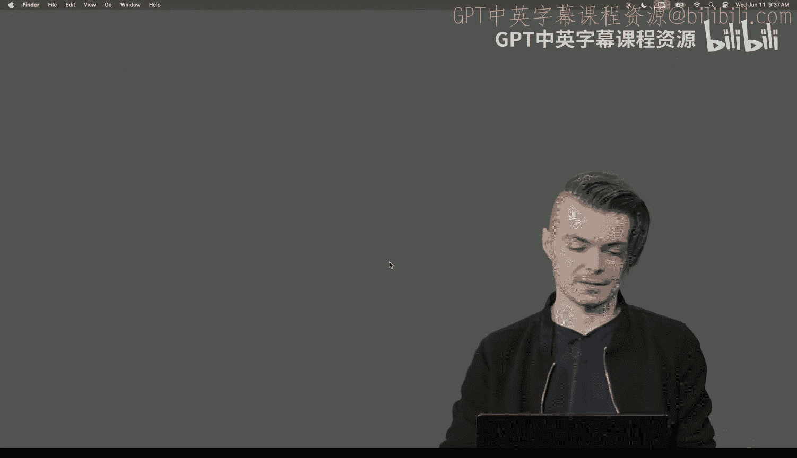

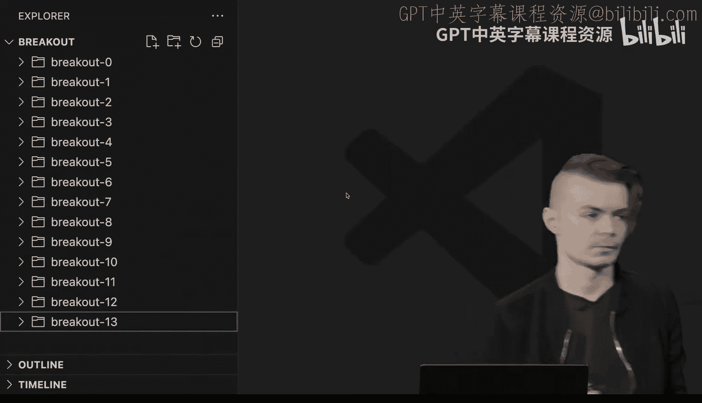

---

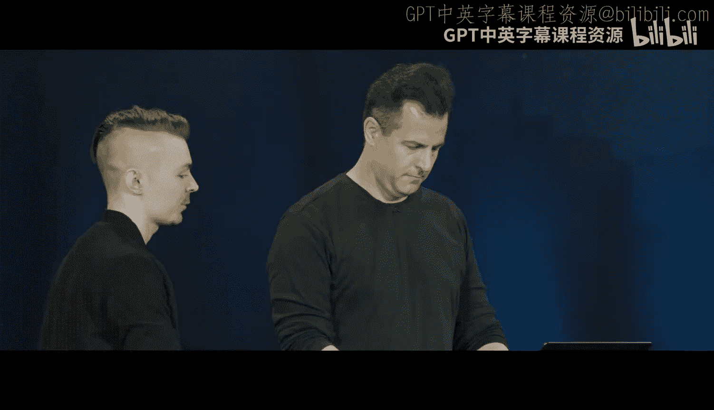

## 第1节：项目结构与状态机 🗂️

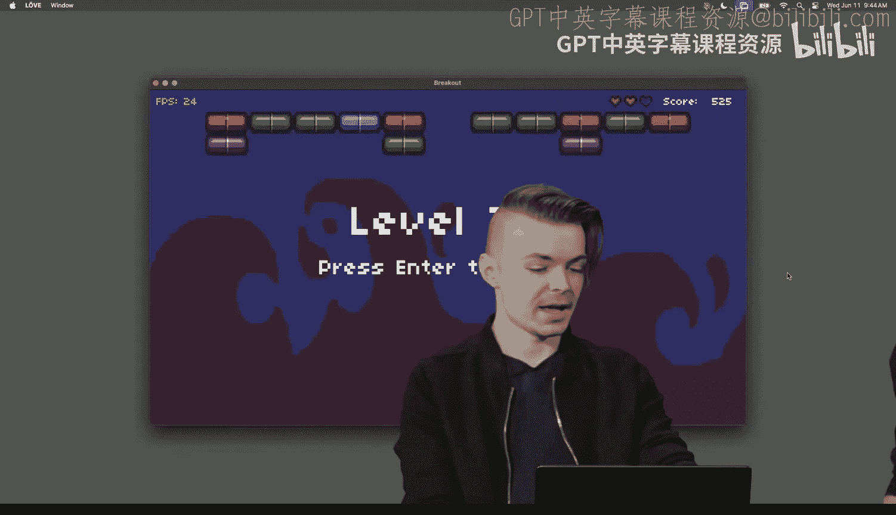

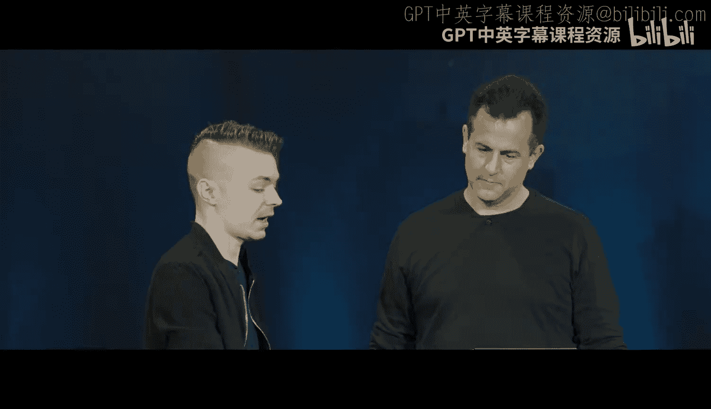

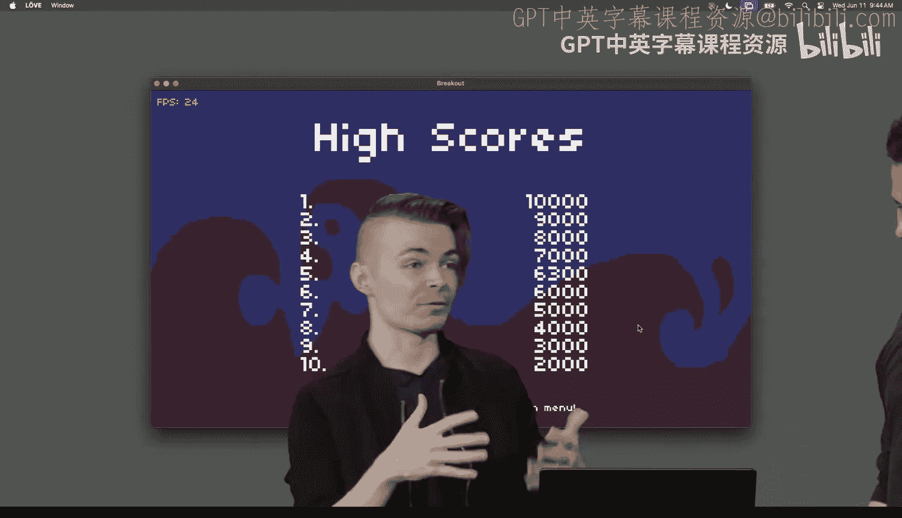

在上一讲中，我们学习了游戏状态的基本概念。本节中，我们将看看如何为Breakout游戏构建一个更复杂的项目结构，并实现一个完整的状态机。

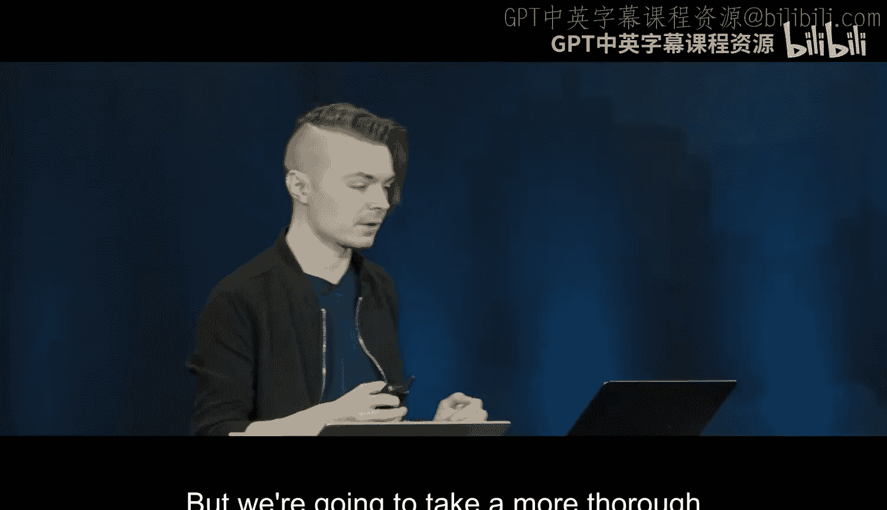

与之前将所有文件放在根目录下的简单项目不同，Breakout项目采用了更清晰的组织结构。我们将代码、资源（如图像、声音、字体）分别存放在不同的文件夹中，以提高项目的可维护性。

以下是项目文件夹结构示例：
```
项目根目录/
├── main.lua
├── source/
│   ├── dependencies.lua
│   ├── constants.lua
│   ├── StateMachine.lua
│   ├── Util.lua
│   └── states/
│       ├── StartState.lua
│       ├── PlayState.lua
│       └── ...
├── graphics/
│   └── breakout.png
├── sounds/
│   ├── paddle_hit.wav
│   └── ...
└── fonts/
    └── font.ttf
```

Breakout游戏包含多个状态，其状态转换关系如下图所示：


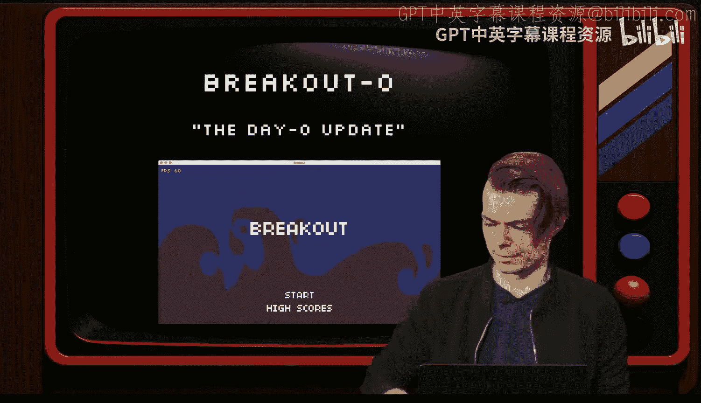

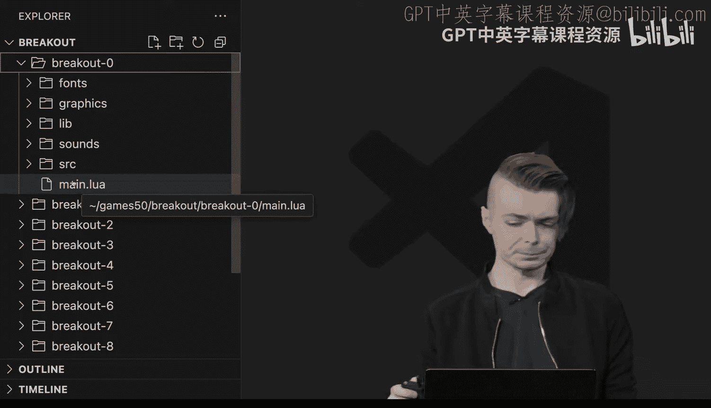

状态机从`StartState`（开始状态）开始，玩家可以选择查看高分或开始游戏。选择开始游戏后，进入`PaddleSelectState`（挡板选择状态），然后进入`ServeState`（发球状态）。按下回车键后，游戏进入核心的`PlayState`（游戏状态）。在游戏过程中，如果玩家失去所有生命值，则进入`GameOverState`（游戏结束状态）；如果清除了所有砖块，则进入`VictoryState`（胜利状态）。根据是否获得高分，游戏可能进入`EnterHighScoreState`（输入高分状态），最终都会回到`StartState`。

在`main.lua`中，我们通过`require`语句集中管理所有依赖，并使用状态机来切换不同的游戏状态。核心代码如下：

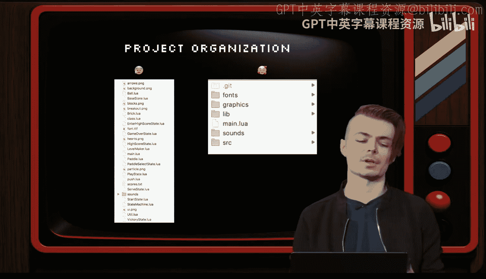

```lua
-- 在main.lua中加载依赖和初始化状态机
require 'source/dependencies'

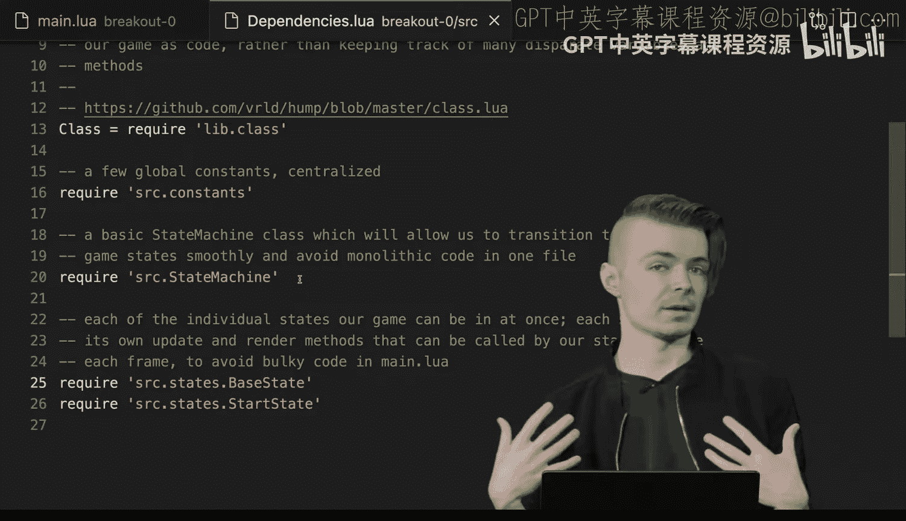

function love.load()
    -- ... 初始化字体、纹理、声音等 ...
    gStateMachine = StateMachine {
        ['start'] = function() return StartState() end,
        ['play'] = function() return PlayState() end,
        -- ... 其他状态 ...
    }
    gStateMachine:change('start')
end
```

---

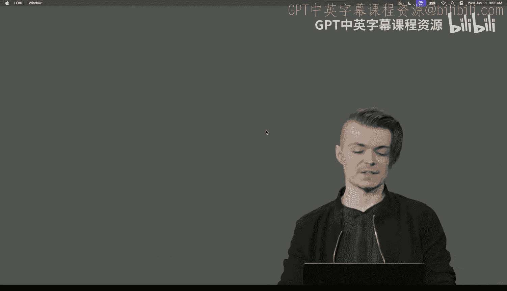

## 第2节：精灵图与四边形（Quads） 🖼️

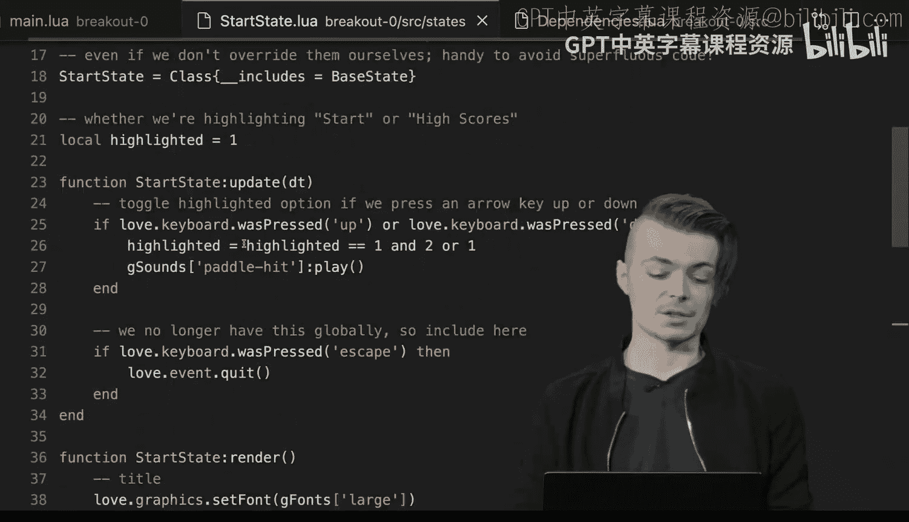

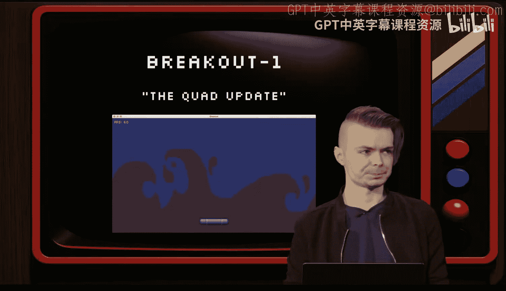

上一节我们介绍了项目的整体结构，本节中我们来看看如何使用精灵图（Sprite Sheets）来高效管理游戏中的大量图像资源。

在Breakout游戏中，我们有多种颜色的挡板、球、砖块和心形图标。如果为每个图像单独保存文件，会非常难以管理。解决方案是使用精灵图，也称为纹理图集（Texture Atlas）。精灵图是一张包含许多小图像的大图。我们通过定义四边形（Quads）来指定大图中每个小图像的位置和大小。

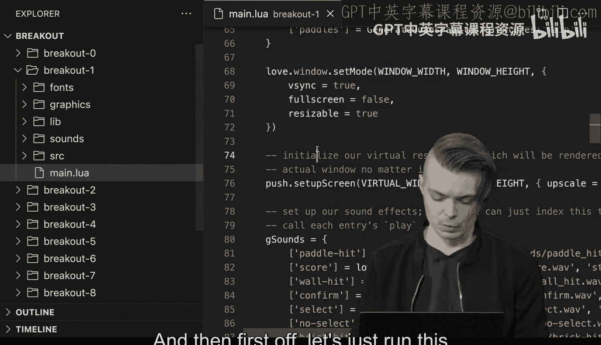

四边形本质上是一个矩形，定义了纹理中要绘制的区域。我们使用`love.graphics.newQuad`函数来创建四边形。

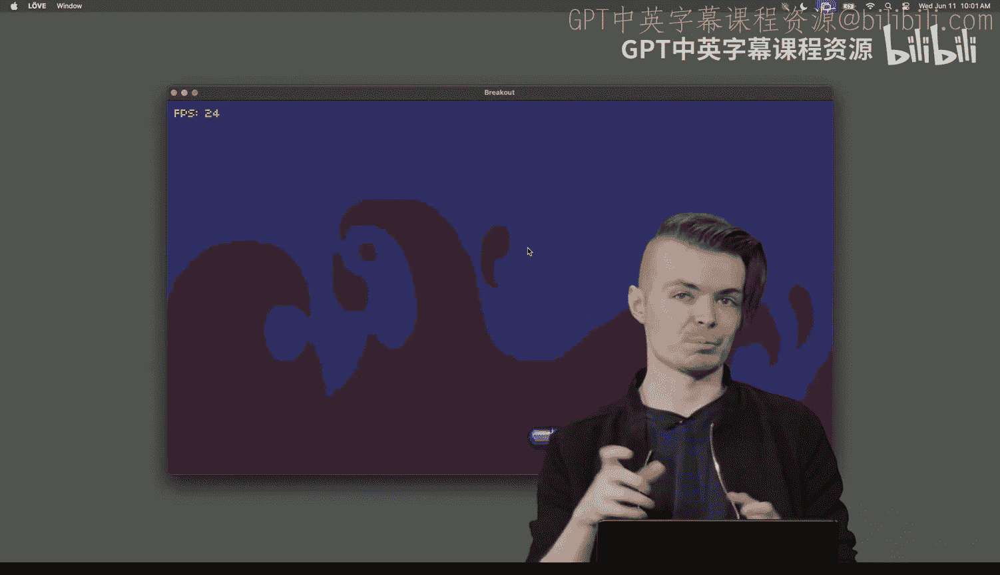

以下是创建四边形并绘制挡板的示例代码：

```lua
-- 在Util.lua中，生成挡板四边形
function generateQuadsPaddles(atlas)
    local quads = {}
    local counter = 1
    for y = 0, 3 do  -- 4种颜色
        for x = 0, 3 do  -- 4种尺寸
            quads[counter] = love.graphics.newQuad(
                x * 32, 64 + y * 16,  -- x, y 坐标
                32, 16,  -- 宽度, 高度
                atlas:getDimensions()
            )
            counter = counter + 1
        end
    end
    return quads
end

-- 在main.lua中加载纹理和四边形
gTextures = {
    ['main'] = love.graphics.newImage('graphics/breakout.png')
}
gFrames = {
    ['paddles'] = generateQuadsPaddles(gTextures['main'])
}

-- 在Paddle.lua中绘制挡板
function Paddle:render()
    love.graphics.draw(gTextures['main'],
                      gFrames['paddles'][self.size + 4 * (self.skin - 1)],
                      self.x, self.y)
end
```

通过这种方式，我们只需加载一张大纹理，就可以绘制出游戏中所有不同颜色和大小的挡板。

---

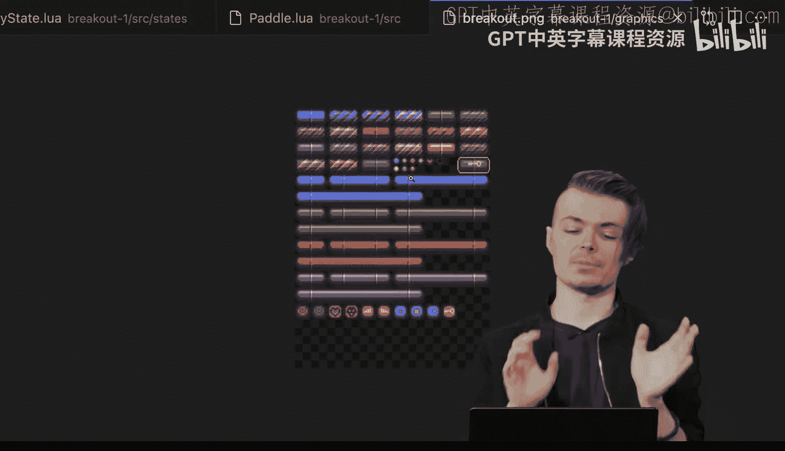

## 第3节：生成砖块与关卡设计 🧱

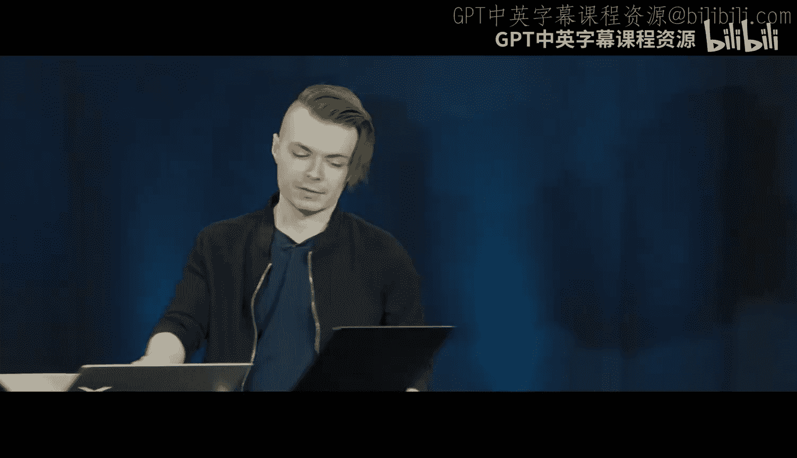

在上一节中，我们学会了如何使用精灵图。本节中，我们将利用这些知识来动态生成游戏的砖块布局。

Breakout的核心玩法是使用球和挡板击碎屏幕顶部的砖块。砖块的布局应该是动态且多样的，以增加游戏的可玩性。我们创建一个`LevelMaker`类来负责生成砖块网格。

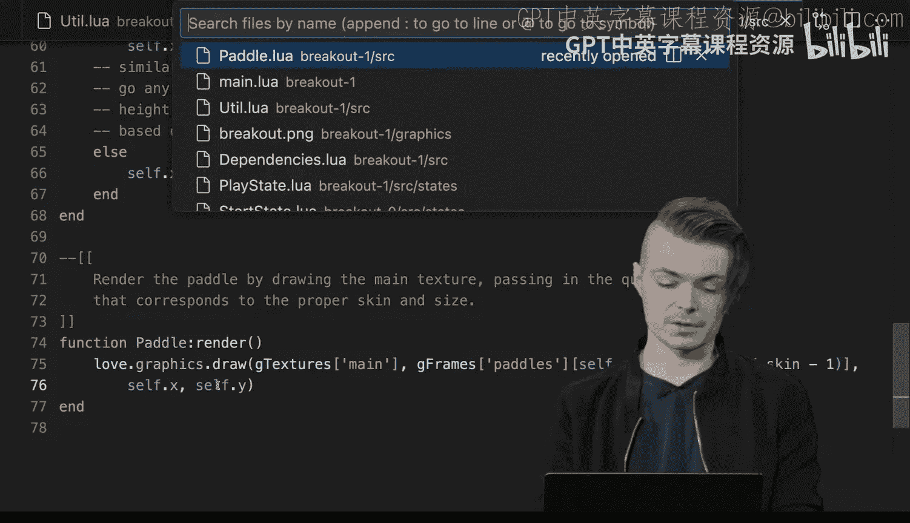

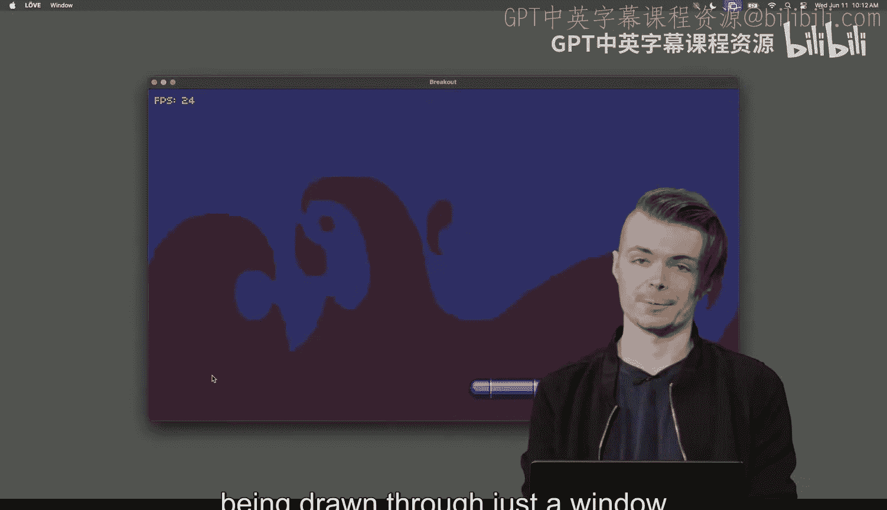

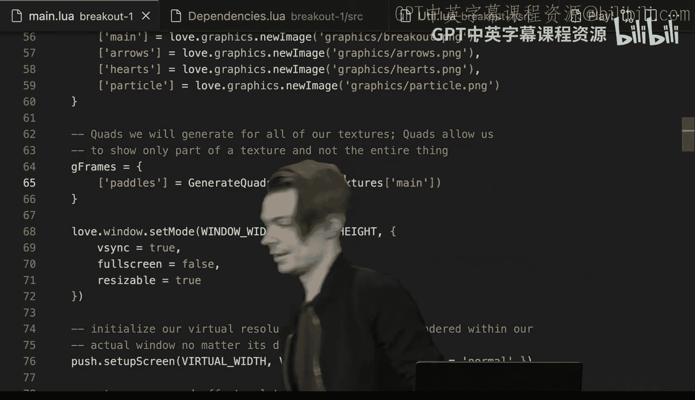

以下是`LevelMaker`生成砖块网格的核心逻辑：

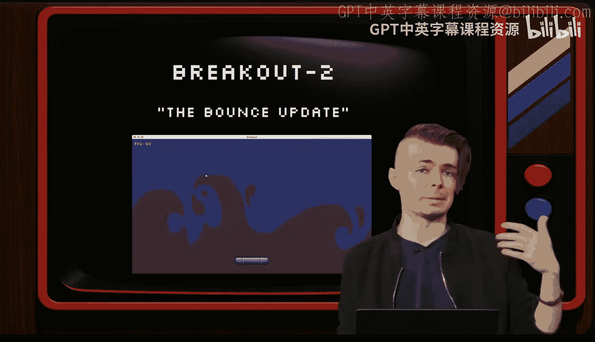

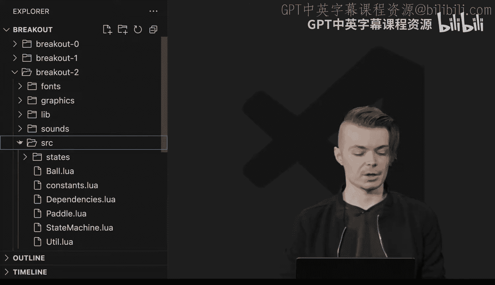

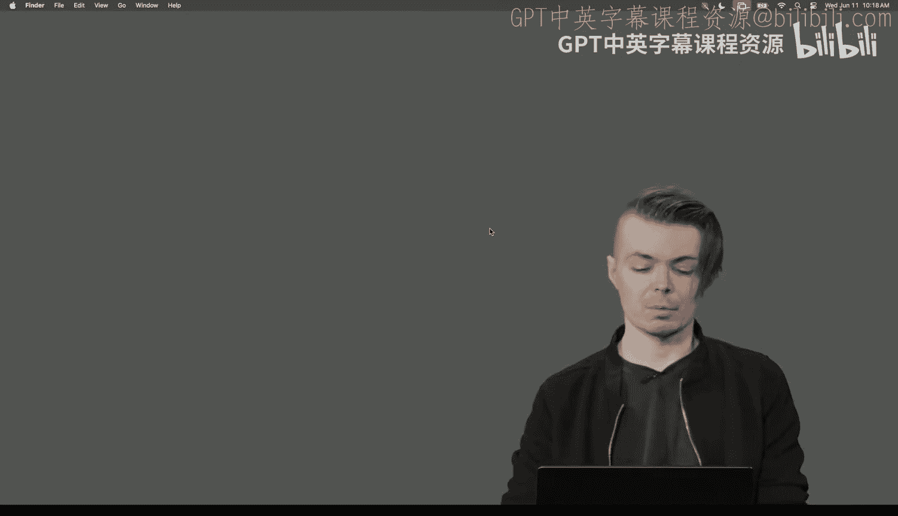

```lua
-- 在LevelMaker.lua中
function LevelMaker.createMap(level)
    local bricks = {}
    local numRows = math.random(1, 5)
    local numCols = math.random(7, 13)
    local numColsOffset = math.floor((13 - numCols) / 2)

    for y = 1, numRows do
        for x = 1, numCols do
            local brick = Brick(
                (x - 1) * 32 + 8 + numColsOffset * 16,
                y * 16
            )
            table.insert(bricks, brick)
        end
    end
    return bricks
end
```

这段代码会随机生成1到5行、7到13列的砖块。通过计算偏移量`numColsOffset`，我们可以确保砖块网格在屏幕上居中显示。

在`PlayState`中，我们调用`LevelMaker`来创建砖块，并在每帧中更新和渲染它们：

```lua
-- 在PlayState.lua中
function PlayState:init()
    self.paddle = Paddle()
    self.ball = Ball()
    self.bricks = LevelMaker.createMap(1)
end

function PlayState:update(dt)
    -- ... 更新球和挡板 ...
    for k, brick in pairs(self.bricks) do
        brick:update(dt)
    end
end

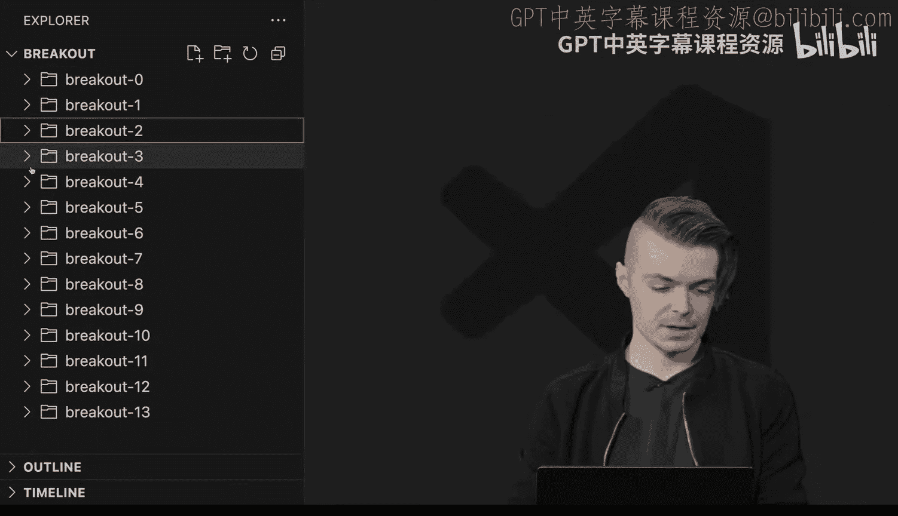

function PlayState:render()
    self.paddle:render()
    self.ball:render()
    for k, brick in pairs(self.bricks) do
        brick:render()
    end
end
```

通过这种方式，我们每次开始游戏或进入新关卡时，都会获得一个随机生成的、居中的砖块布局。

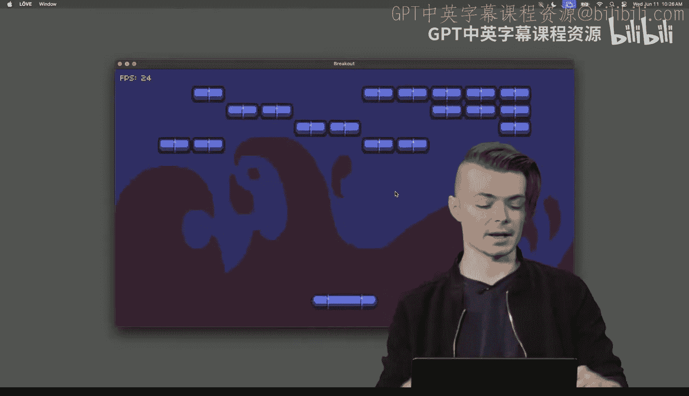

---

## 第4节：碰撞检测进阶 🎯

上一节我们生成了砖块，本节中我们来看看如何实现球与砖块之间更真实的碰撞检测。

在Pong游戏中，碰撞检测相对简单，球只会从挡板的左右两侧反弹。但在Breakout中，球可以从砖块的顶部、底部、左侧或右侧碰撞，我们需要根据碰撞点来改变球的运动方向。

我们采用基于中心点偏移的碰撞检测算法。核心思想是计算球和砖块中心点在X轴和Y轴上的偏移量，通过比较这两个偏移量的大小，来确定碰撞发生在哪个面。

以下是球与砖块碰撞检测的核心代码：

```lua
-- 在PlayState.lua的球与砖块碰撞检测部分
function PlayState:checkCollision(ball, brick)
    -- 计算球和砖块的中心点
    local ballCenterX = ball.x + ball.width / 2
    local ballCenterY = ball.y + ball.height / 2
    local brickCenterX = brick.x + brick.width / 2
    local brickCenterY = brick.y + brick.height / 2

    -- 计算中心点偏移量
    local offsetX = brickCenterX - ballCenterX
    local offsetY = brickCenterY - ballCenterY

    -- 计算半长和
    local halfWidthSum = brick.width / 2 + ball.width / 2
    local halfHeightSum = brick.height / 2 + ball.height / 2

    -- 计算穿透深度
    local penetrationX = halfWidthSum - math.abs(offsetX)
    local penetrationY = halfHeightSum - math.abs(offsetY)

    -- 判断碰撞方向并解决碰撞
    if penetrationX > 0 and penetrationY > 0 then
        if penetrationX < penetrationY then
            -- X轴碰撞（左或右）
            if offsetX > 0 then
                -- 从左侧碰撞
                ball.dx = -math.abs(ball.dx)
                ball.x = ball.x - penetrationX
            else
                -- 从右侧碰撞
                ball.dx = math.abs(ball.dx)
                ball.x = ball.x + penetrationX
            end
        else
            -- Y轴碰撞（上或下）
            if offsetY > 0 then
                -- 从上方碰撞
                ball.dy = -math.abs(ball.dy)
                ball.y = ball.y - penetrationY
            else
                -- 从下方碰撞
                ball.dy = math.abs(ball.dy)
                ball.y = ball.y + penetrationY
            end
        end
        return true
    end
    return false
end
```

当碰撞发生时，我们不仅反转球在相应方向上的速度，还会将球“推”出砖块的范围，防止球卡在砖块内部。

对于挡板与球的碰撞，我们增加了“加塞”效果，即根据球击中挡板的位置来调整反弹角度，使游戏操控感更强。

```lua
-- 在PlayState.lua的挡板与球碰撞检测部分
function PlayState:checkPaddleCollision(ball, paddle)
    if ball:collides(paddle) then
        ball.y = paddle.y - ball.height
        ball.dy = -ball.dy

        -- 计算击中点偏移量，影响反弹角度
        local centerPaddle = paddle.x + paddle.width / 2
        local offset = ball.x + ball.width / 2 - centerPaddle
        ball.dx = offset * 5  -- 5是一个可调整的系数
    end
end
```

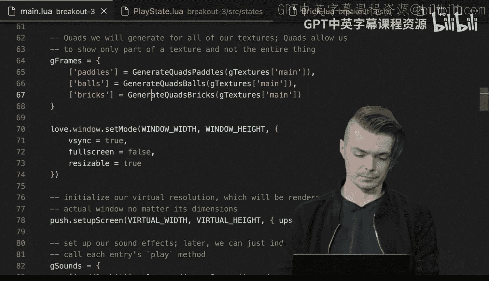

通过这些改进的碰撞检测，Breakout游戏的物理感觉更加真实和有趣。

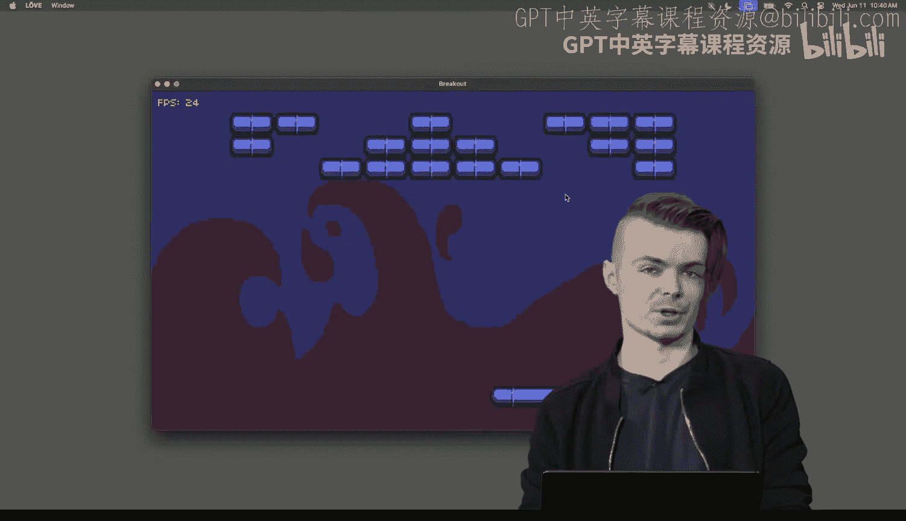

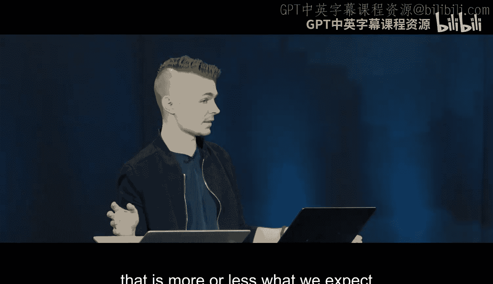

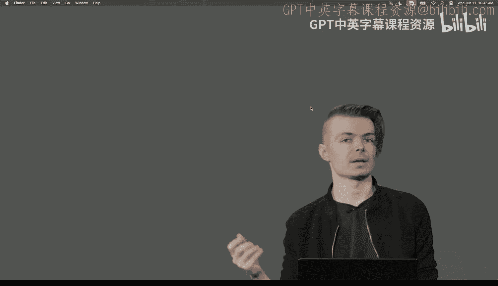

---

## 第5节：游戏状态与生命值 ❤️

在上一节中，我们实现了复杂的碰撞检测。本节中，我们将为游戏添加生命值（HP）和计分系统，并完善游戏在不同状态间的切换。

我们为玩家添加生命值，通常以心形图标表示。初始生命值为3，每当球掉落屏幕底部，玩家失去一颗心。当生命值降为0时，游戏结束。

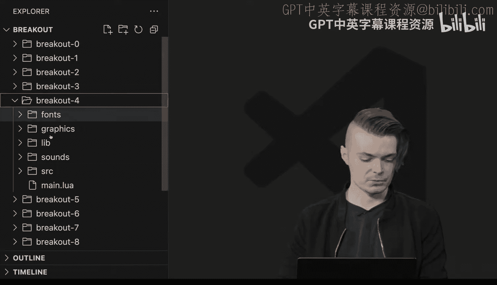

以下是生命值和分数渲染的辅助函数：

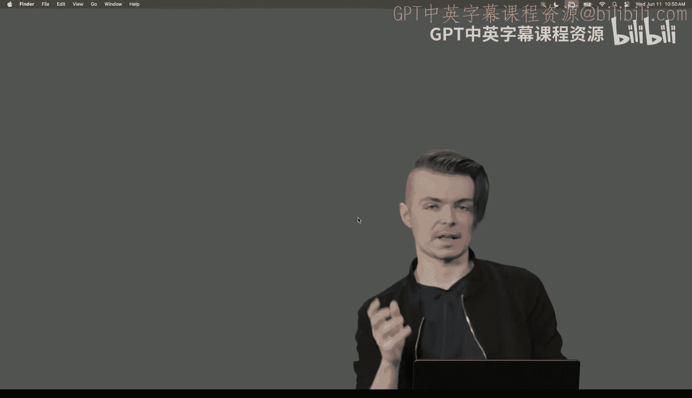

```lua
-- 在main.lua中定义全局渲染函数
function renderHealth(health)
    for i = 1, 3 do
        local frame = 1  -- 红色心形
        if i > health then
            frame = 2    -- 灰色心形
        end
        love.graphics.draw(gTextures['hearts'],
                          gFrames['hearts'][frame],
                          VIRTUAL_WIDTH - 100 + (i-1) * 11, 10)
    end
end

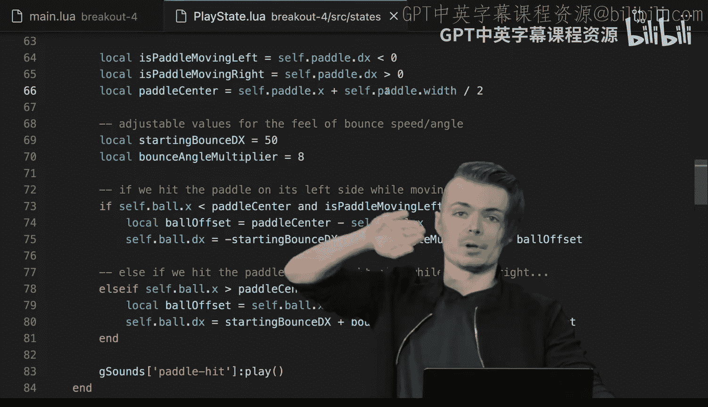

function renderScore(score)
    love.graphics.setFont(gFonts['small'])
    love.graphics.print('Score: ' .. tostring(score), 10, 10)
end
```

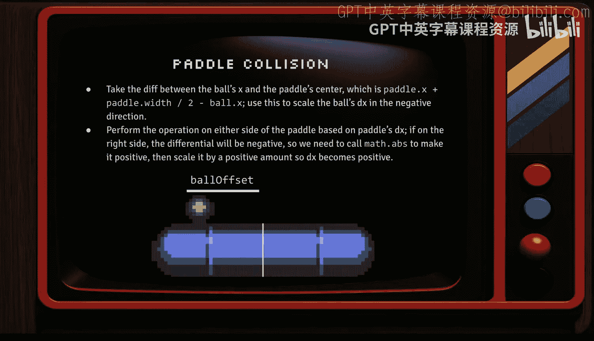

在`PlayState`中，我们检测球是否掉落屏幕底部，并相应地减少生命值：

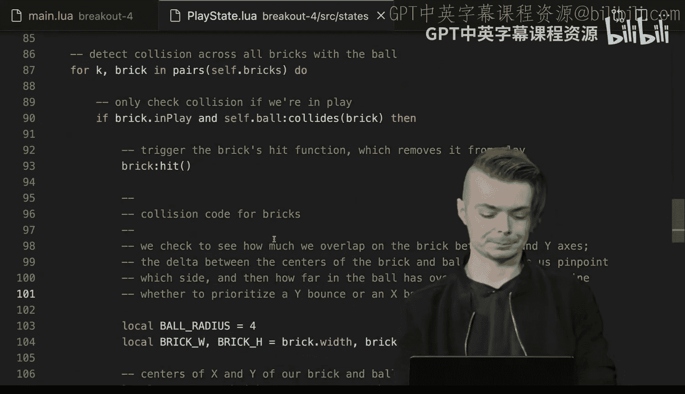

```lua
function PlayState:update(dt)
    -- ... 更新球的位置 ...

    if self.ball.y >= VIRTUAL_HEIGHT then
        self.health = self.health - 1
        if self.health == 0 then
            gStateMachine:change('game-over', {
                score = self.score
            })
        else
            gStateMachine:change('serve', {
                paddle = self.paddle,
                bricks = self.bricks,
                health = self.health,
                score = self.score
            })
        end
    end
end
```

注意，在切换状态时，我们通过一个表（table）来传递当前状态的重要数据（如挡板、砖块、生命值、分数）。这样，新状态可以继承这些数据，保持游戏的连续性。这是通过状态机的`enter`方法实现的：

```lua
-- 在ServeState.lua中
function ServeState:enter(params)
    self.paddle = params.paddle
    self.bricks = params.bricks
    self.health = params.health
    self.score = params.score
end
```

通过这种方式，我们实现了游戏状态间数据的持久化传递。

---

## 第6节：砖块等级与粒子系统 ✨

上一节我们添加了生命值和状态管理，本节中我们将让砖块变得更具挑战性，并添加华丽的视觉特效——粒子系统。

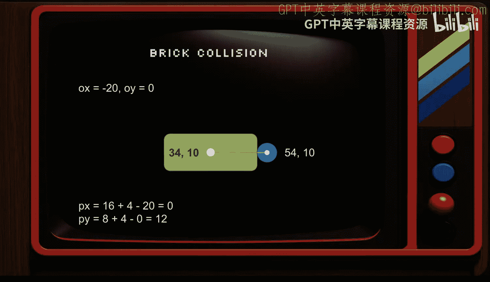

首先，我们为砖块引入“颜色”和“等级”的概念。颜色代表砖块的强度，需要多次击打才能摧毁；等级代表砖块的稀有度，高等级砖块能提供更多分数。

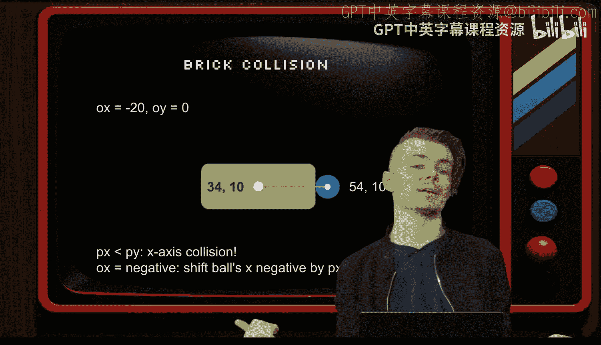

在`LevelMaker`中，我们根据关卡数来生成不同颜色和等级的砖块：

```lua
function LevelMaker.createMap(level)
    -- ... 确定行数和列数 ...
    local highestColor = math.min(5, math.floor(level / 5) + 3)
    local highestTier = math.min(3, math.floor(level / 7))

    for y = 1, numRows do
        for x = 1, numCols do
            local color = math.random(1, highestColor)
            local tier = math.random(0, highestTier)
            local brick = Brick(..., color, tier)
            table.insert(bricks, brick)
        end
    end
    return bricks
end
```

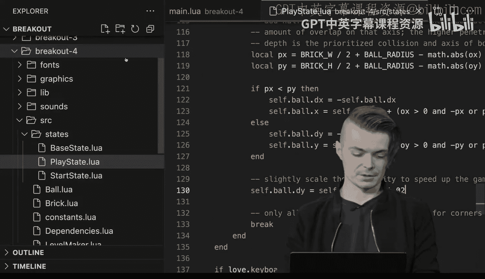

当球击中砖块时，我们根据砖块的颜色和等级计算得分，并降低砖块的强度：

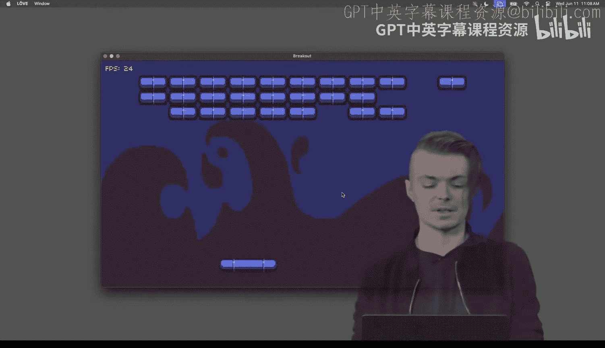

```lua
-- 在Brick.lua中
function Brick:hit()
    self.tier = self.tier - 1
    if self.tier < 0 then
        self.color = self.color - 1
        if self.color < 1 then
            self.inPlay = false
        end
        self.tier = 0
    end
    -- 触发粒子系统
    self.psystem:emit(64)
end
```

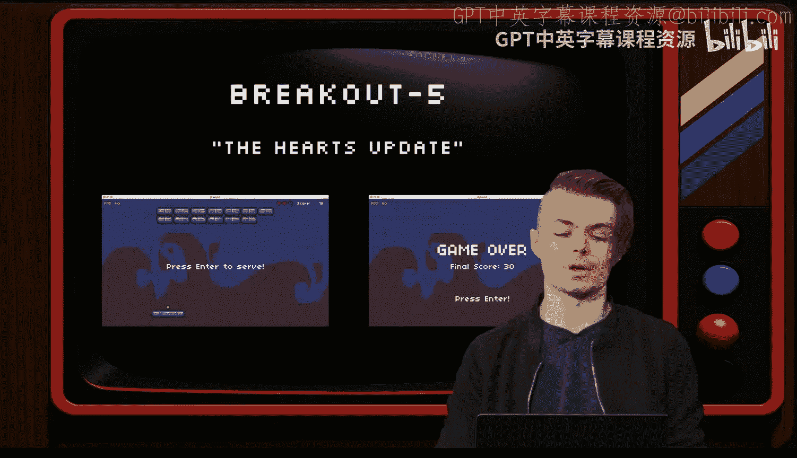

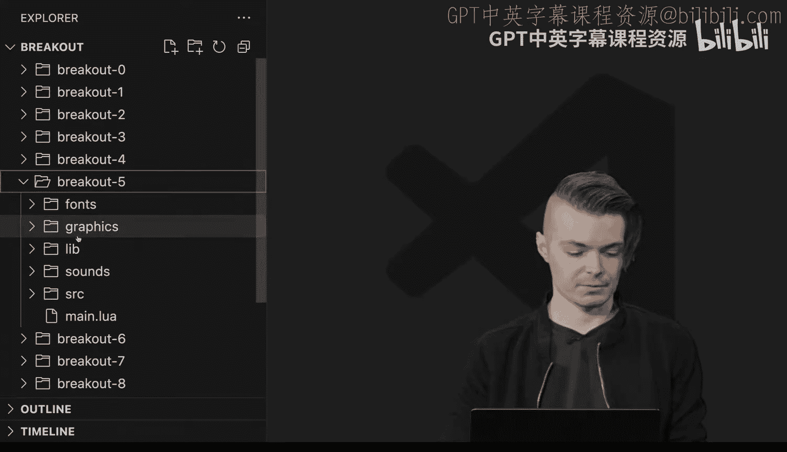

接下来，我们为砖块击碎效果添加粒子系统。粒子系统可以创建诸如爆炸、烟雾、火花等动态视觉效果。

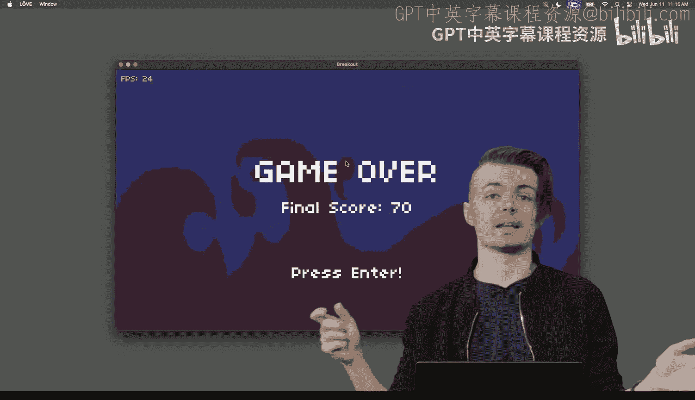

以下是创建和配置砖块粒子系统的代码：

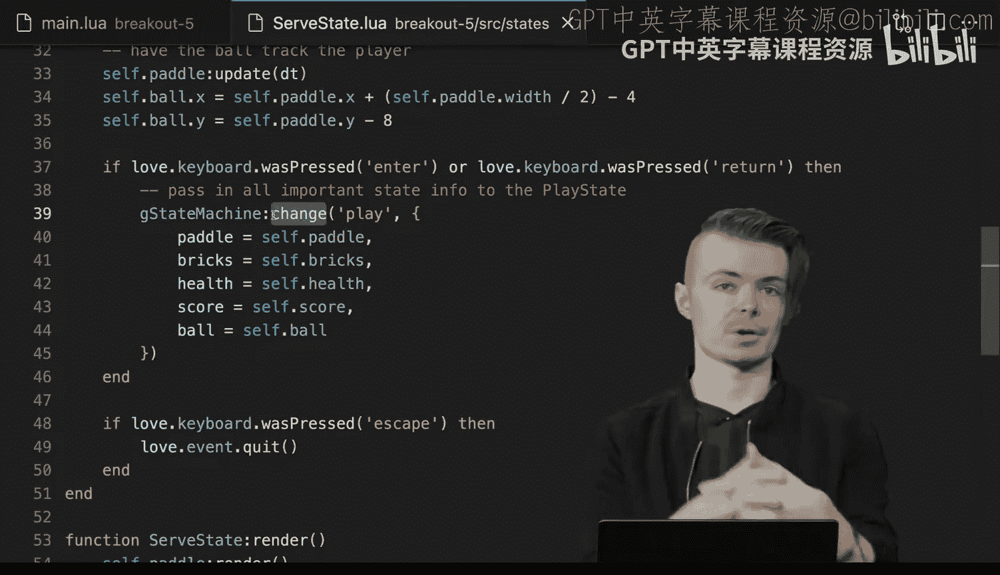

```lua
function Brick:init(x, y, color, tier)
    -- ... 初始化位置、颜色、等级 ...
    self.psystem = love.graphics.newParticleSystem(gTextures['particle'], 64)
    self.psystem:setParticleLifetime(0.5, 1)
    self.psystem:setLinearAcceleration(-15, 0, 15, 80)
    self.psystem:setEmissionArea('normal', 10, 10)
    -- 根据砖块颜色设置粒子颜色
    local r, g, b = unpack(gBrickPalette[color])
    self.psystem:setColors(r, g, b, 255 * (tier+1), r, g, b, 0)
end

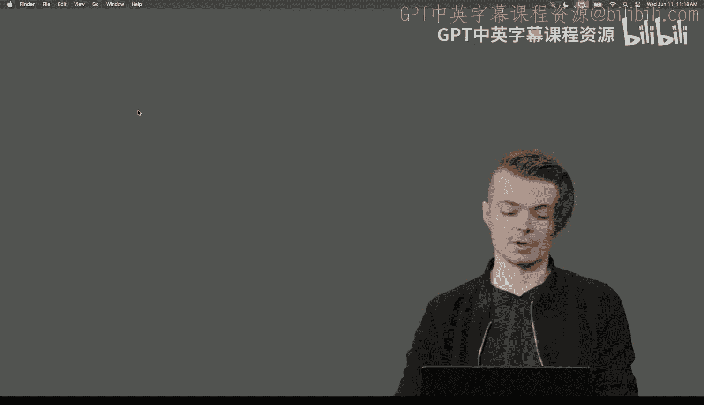

function Brick:render()
    if self.inPlay then
        love.graphics.draw(gTextures['main'], self.quad, self.x, self.y)
    end
    love.graphics.draw(self.psystem, self.x + 16, self.y + 8)
end
```

当砖块被击中时，我们调用`self.psystem:emit(64)`来发射64个粒子。这些粒子会以砖块为中心向外扩散，并逐渐消失，创造出砖块被击碎的视觉效果。

通过添加砖块等级和粒子系统，游戏的视觉反馈和挑战性都得到了显著提升。

---

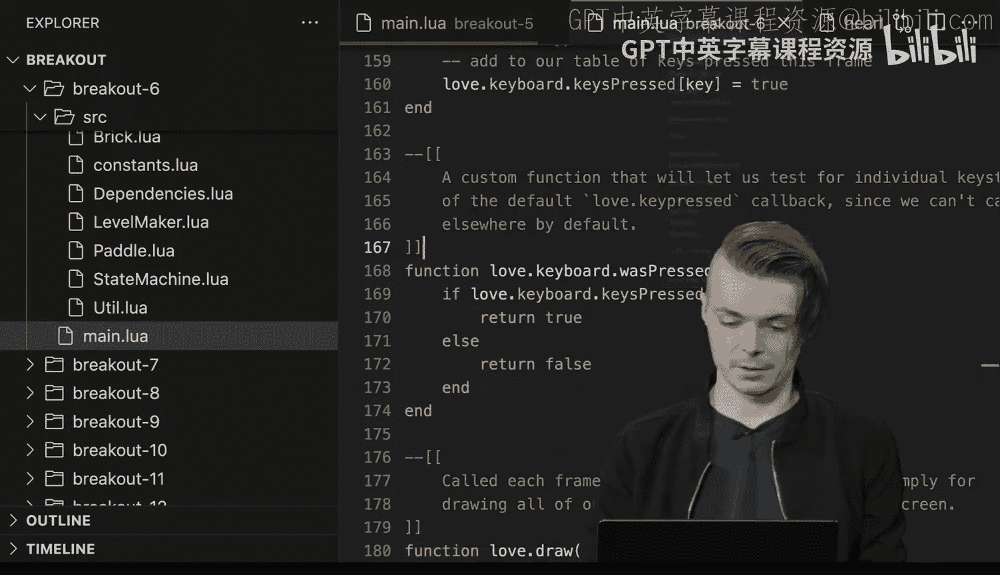

## 第7节：关卡进度与胜利状态 🏆

在上一节，我们为砖块添加了等级和特效。本节中，我们将实现关卡的进度系统。当玩家清除所有砖块后，游戏应进入下一关，难度随之增加。

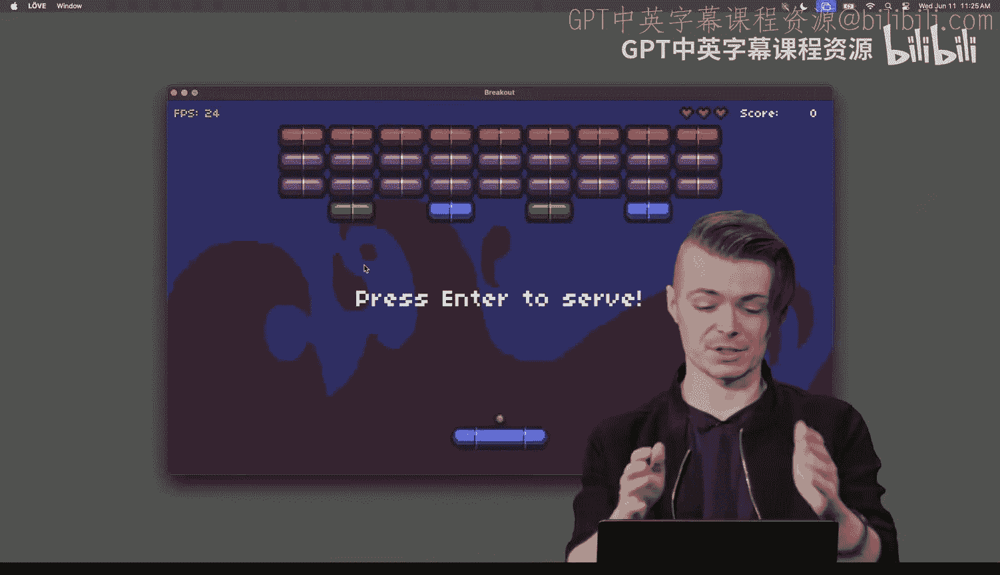

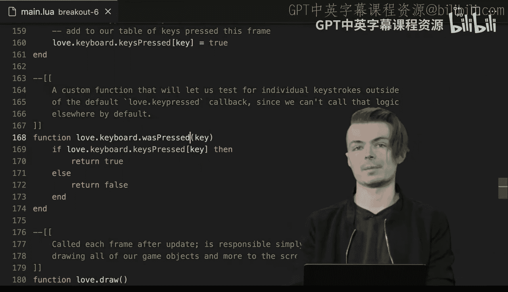

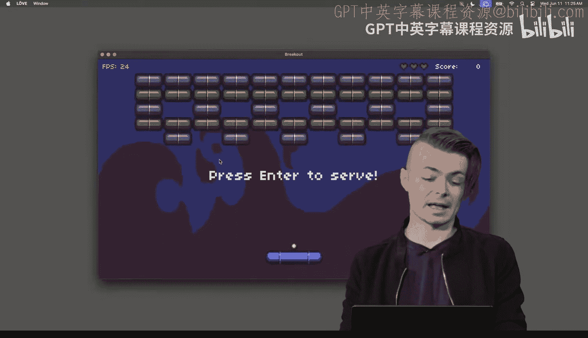


我们需要一个`VictoryState`（胜利状态）来庆祝玩家完成当前关卡，并准备进入下一关。


在`PlayState`中，我们添加一个函数来检查是否所有砖块都被清除：

```lua
function PlayState:checkVictory()
    for k, brick in pairs(self.bricks) do
        if brick.inPlay then
            return false
        end
    end
    return true
end

function PlayState:update(dt)
    -- ... 更新逻辑 ...

    if self:checkVictory() then
        gStateMachine:change('victory', {
            level = self.level,
            paddle = self.paddle,
            health = self.health,
            score = self.score
        })
    end
end
```


当胜利条件满足时，我们切换到`VictoryState`，并传递当前关卡、挡板、生命值和分数。


在`VictoryState`中，我们显示关卡完成的信息，并在玩家按下回车键时递增关卡数，然后进入`ServeState`开始下一关：


```lua
function VictoryState:enter(params)
    self.level = params.level
    self.paddle = params.paddle
    self.health = params.health
    self.score = params.score
end

function VictoryState:update(dt)
    if love.keyboard.wasPressed('enter') or love.keyboard.wasPressed('return') then
        gStateMachine:change('serve', {
            level = self.level + 1,
            paddle = self.paddle,
            health = self.health,
            score = self.score
        })
    end
end


function VictoryState:render()
    -- ... 渲染背景、挡板等 ...
    love.graphics.printf('Level ' .. tostring(self.level) .. ' complete!',
                        0, VIRTUAL_HEIGHT / 2 - 32, VIRTUAL_WIDTH, 'center')
end
```

注意，在切换到`ServeState`时，我们将关卡数加1（`self.level + 1`）。`ServeState`和随后的`PlayState`会使用这个新的关卡数来调用`LevelMaker.createMap`，从而生成更具挑战性的砖块布局。


通过实现关卡进度，游戏有了明确的目标感和成长曲线，玩家可以不断挑战更高的关卡和分数。


---

## 第8节：持久化数据与高分榜 💾

上一节我们实现了关卡进度，本节中我们将学习如何将玩家的高分记录保存到本地文件中，实现数据的持久化。

我们使用LÖVE2D提供的文件系统模块（`love.filesystem`）来读写文件。首先，在游戏启动时，我们从磁盘加载高分榜；在游戏过程中，如果玩家获得新高分，我们将其写入磁盘。


以下是加载高分榜的函数：


```lua
-- 在main.lua中
function loadHighScores()
    love.filesystem.setIdentity('breakout')

    -- 如果高分文件不存在，则创建初始高分榜
    if not love.filesystem.getInfo('breakout.lst') then
        local scores = ''
        for i = 10, 1, -1 do
            scores = scores .. 'CTO\n' .. tostring(i * 1000) .. '\n'
        end
        love.filesystem.write('breakout.lst', scores)
    end

    -- 读取文件并解析为表
    local scores = {}
    local counter = 1
    for line in love.filesystem.lines('breakout.lst') do
        if counter % 2 == 1 then
            scores[counter] = { name = line }
        else
            scores[counter-1].score = tonumber(line)
        end
        counter = counter + 1
    end
    return scores
end

-- 在love.load中调用
gHighScores = loadHighScores()
```


当游戏结束（`GameOverState`）时，我们检查当前分数是否足以进入高分榜：

```lua
function GameOverState:enter(params)
    self.score = params.score
    self.highScores = params.highScores

    local highScore = false
    local scoreIndex = 11
    for i = 10, 1, -1 do
        if self.score > self.highScores[i].score then
            highScore = true
            scoreIndex = i
        end
    end

    if highScore then
        gStateMachine:change('enter-high-score', {
            highScores = self.highScores,
            score = self.score,
            scoreIndex = scoreIndex
        })
    else
        gStateMachine:change('start', {
            highScores = self.highScores
        })
    end
end
```

如果获得高分，则进入`EnterHighScoreState`，让玩家输入姓名缩写。输入完成后，我们更新高分榜并保存到文件：

```lua
function EnterHighScoreState:enter(params)
    self.highScores = params.highScores
    self.score = params.score
    self.scoreIndex = params.scoreIndex
    self.name = {'A', 'A', 'A'}  -- 初始缩写
    self.highlightedChar = 1
end

function EnterHighScoreState:update(dt)
    -- ... 处理键盘输入，让玩家选择字母 ...
end

function EnterHighScoreState:saveHighScore()
    -- 将姓名缩写合并为字符串
    local name = string.char(self.name[1]) ..
                 string.char(self.name[2]) ..
                 string.char(self.name[3])

    -- 将新分数插入到高分榜的适当位置
    table.insert(self.highScores, self.scoreIndex, {
        name = name,
        score = self.score
    })
    table.remove(self.highScores, 11)  -- 移除第11名（最低分）

    -- 将高分榜保存到文件
    local scoresStr = ''
    for i = 1, 10 do
        scoresStr = scoresStr .. self.highScores[i].name .. '\n' ..
                                self.highScores[i].score .. '\n'
    end
    love.filesystem.write('breakout.lst', scoresStr)

    gStateMachine:change('high-scores', {
        highScores = self.highScores
    })
end
```

通过实现持久化数据存储，玩家的高分记录得以保留，增加了游戏的长期可玩性和竞争性。

---

## 第9节：挡板选择与音乐 🎵


在上一节，我们实现了高分榜的持久化。本节中，我们将添加两个最后的润色功能：允许玩家选择挡板皮肤，以及为游戏添加背景音乐。

我们创建一个`PaddleSelectState`，让玩家在开始游戏前选择挡板的颜色。

以下是`PaddleSelectState`的核心代码：


```lua
function PaddleSelectState:enter(params)
    self.highScores = params.highScores
    self.currentPaddle = 1  -- 默认选择第一个皮肤（蓝色）
end


function PaddleSelectState:update(dt)
    if love.keyboard.wasPressed('left') then
        if self.currentPaddle > 1 then
            self.currentPaddle = self.currentPaddle - 1
        end
    elseif love.keyboard.wasPressed('right') then
        if self.currentPaddle < 4 then
            self.currentPaddle = self.currentPaddle + 1
        end
    elseif love.keyboard.wasPressed('enter') or love.keyboard.wasPressed('return') then
        gStateMachine:change('serve', {
            highScores = self.highScores,
            paddleSkin = self.currentPaddle
        })
    end
end
```

在`ServeState`和`PlayState`中，我们将接收到的`paddleSkin`参数传递给`Paddle`对象，用于确定绘制哪个四边形：

```lua
-- 在Paddle.lua中
function Paddle:init(skin)
    self.skin = skin
    -- ... 其他初始化 ...
end


function Paddle:render()
    -- 根据皮肤选择正确的四边形
    local quadIndex = self.size + 4 * (self.skin - 1)
    love.graphics.draw(gTextures['main'], gFrames['paddles'][quadIndex], self.x, self.y)
end
```

最后，我们为游戏添加背景音乐，以增强氛围。在`main.lua`的`love.load`函数中加载并播放音乐：


```lua
function love.load()
    -- ... 加载其他资源 ...
    gSounds['music'] = love.audio.newSource('sounds/music.wav', 'static')
    gSounds['music']:setLooping(true)
    gSounds['music']:play()
end
```

通过添加挡板选择和背景音乐，游戏的个性化体验和沉浸感得到了进一步提升。


---


## 总结

在本节课中，我们一起学习了如何从零开始构建一个完整的Breakout游戏。我们从项目结构和状态机入手，逐步实现了精灵图管理、动态关卡生成、高级碰撞检测、生命值与计分系统、砖块等级、粒子特效、关卡进度、持久化高分榜、挡板皮肤选择以及背景音乐。

通过这个项目，你不仅掌握了2D游戏开发的核心技术，还学会了如何组织一个中等复杂度的游戏项目。这些知识和技能将为后续学习更复杂的游戏（如Match-3、Mario、Zelda）打下坚实的基础。


在接下来的课程中，我们将探索匿名函数、补间动画、计时器以及在益智游戏中的应用。请继续关注，并动手实践Breakout的扩展功能，如生成多个球、改变挡板大小、添加特殊方块等，以巩固所学知识。