# 商业的计算机科学：第1讲：算法分析 🧠

在本节课中，我们将要学习算法的基本概念，以及如何分析算法的效率。我们将重点探讨两种核心算法类型：搜索和排序，并学习使用“大O表示法”来描述算法在不同情况下的运行时间。

---

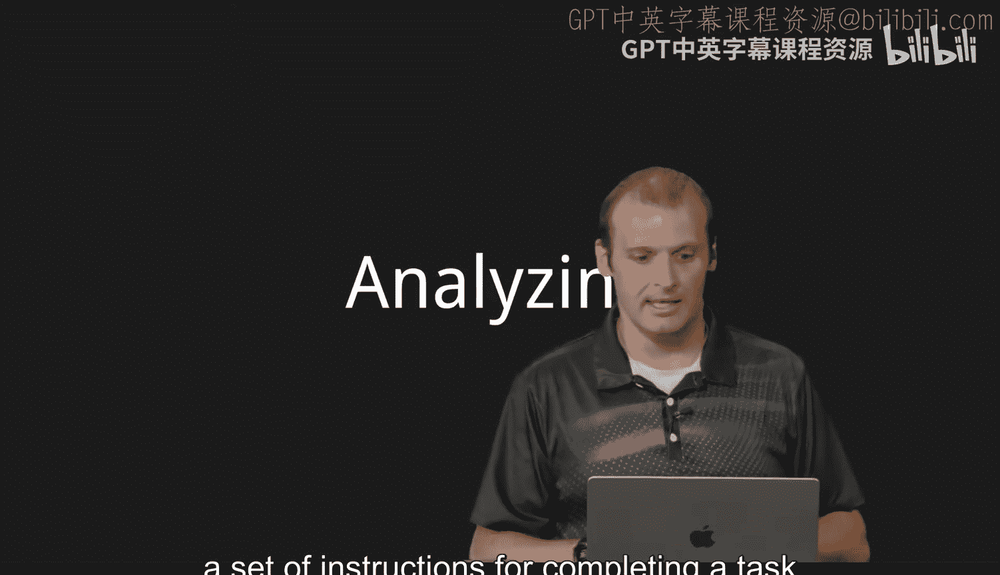

## 什么是算法？ 🤔

算法是为完成特定任务而设计的一系列步骤。在日常生活中，你可能称之为“食谱”或“例行程序”。例如，制作炒鸡蛋的步骤就是一个算法：它有明确的输入（鸡蛋、调料），明确的输出（一盘炒鸡蛋），以及清晰、有序、无歧义的步骤。

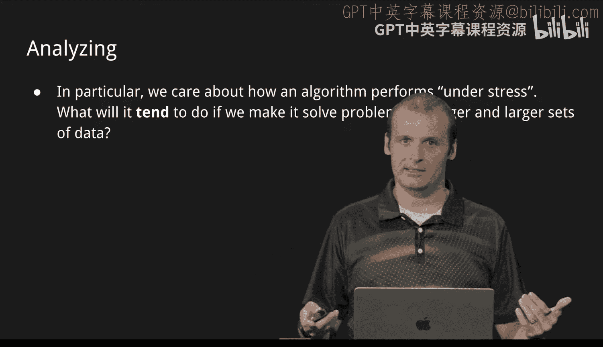

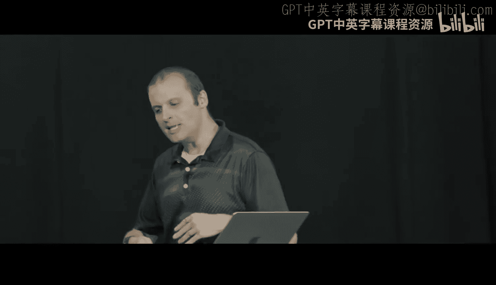

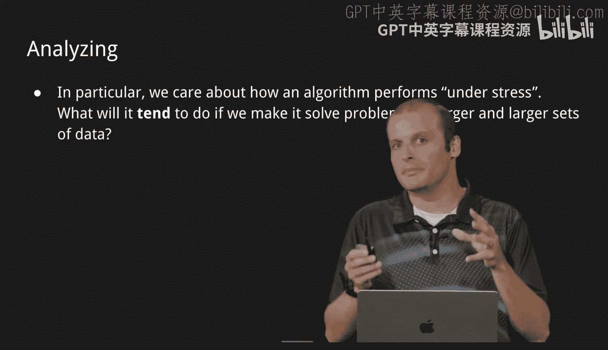

算法具有以下特点：
*   有明确的输入和输出。
*   由有限数量的步骤组成。
*   步骤必须清晰、有序且无歧义。
*   算法本身可能无限运行（例如，一个不断数数的算法），但其步骤定义是有限的。

---

## 如何分析算法？ 📊

在计算机科学中，我们主要从两个维度分析算法：
1.  **时间**：算法运行需要多少步骤。
2.  **空间**：算法运行需要占用多少计算机内存。

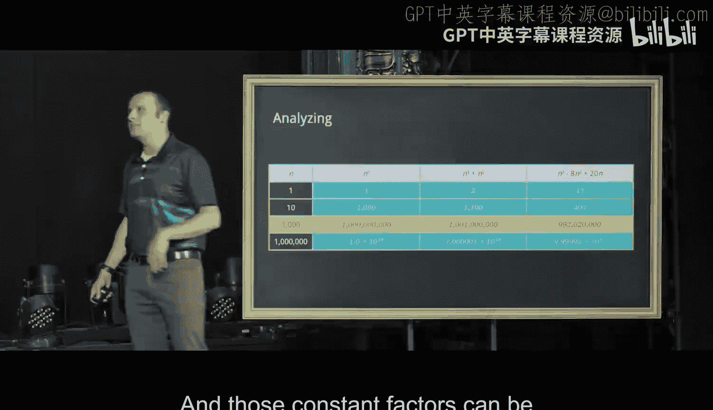

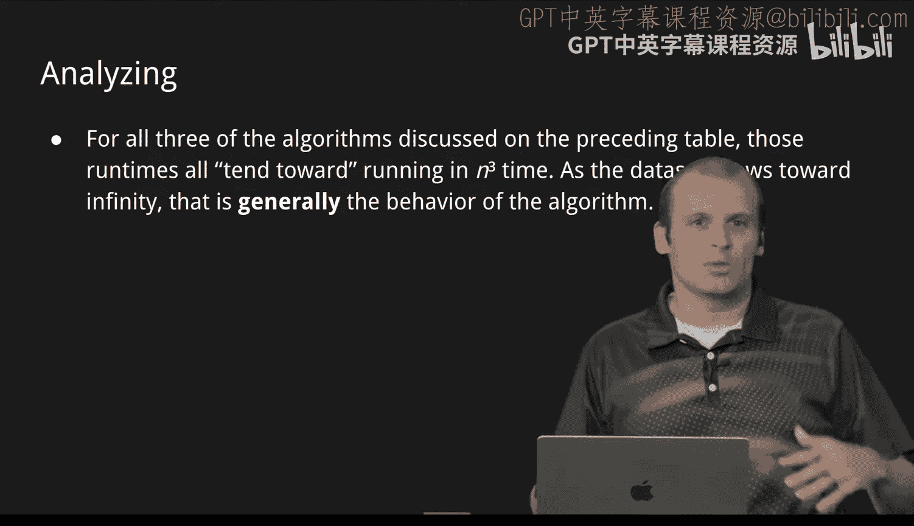

我们通常更关注**时间**，但时间和空间之间常常存在权衡。

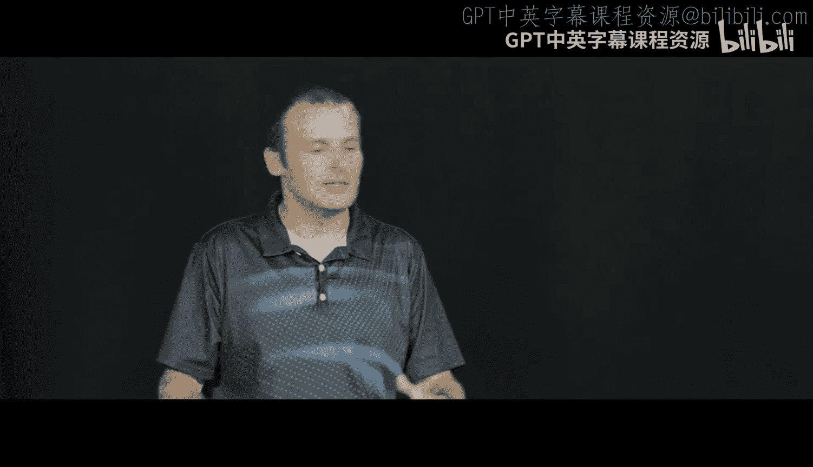

由于不同计算机的处理器速度不同，我们不以实际的秒或分钟来衡量时间，而是关注**算法所需步骤的数量**，特别是当算法处理的数据规模（通常用变量 **n** 表示）变得越来越大时，步骤数量的**增长趋势**。

我们还需要考虑数据的不同状态：
*   **最坏情况**：数据处于对算法最不利的形态。
*   **最好情况**：数据处于对算法最有利的形态。

---

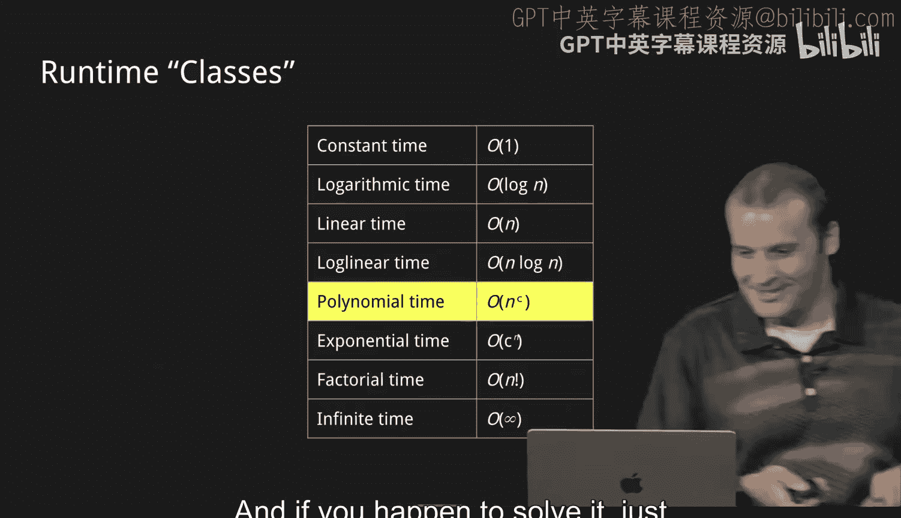

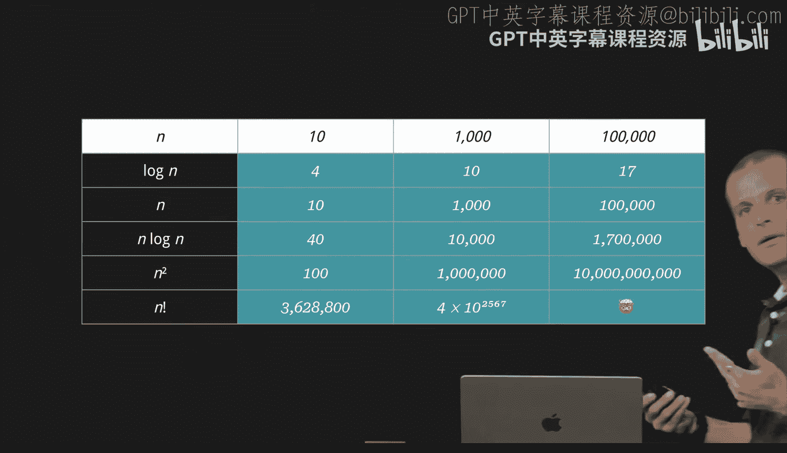

## 算法运行时间的趋势 ⏳

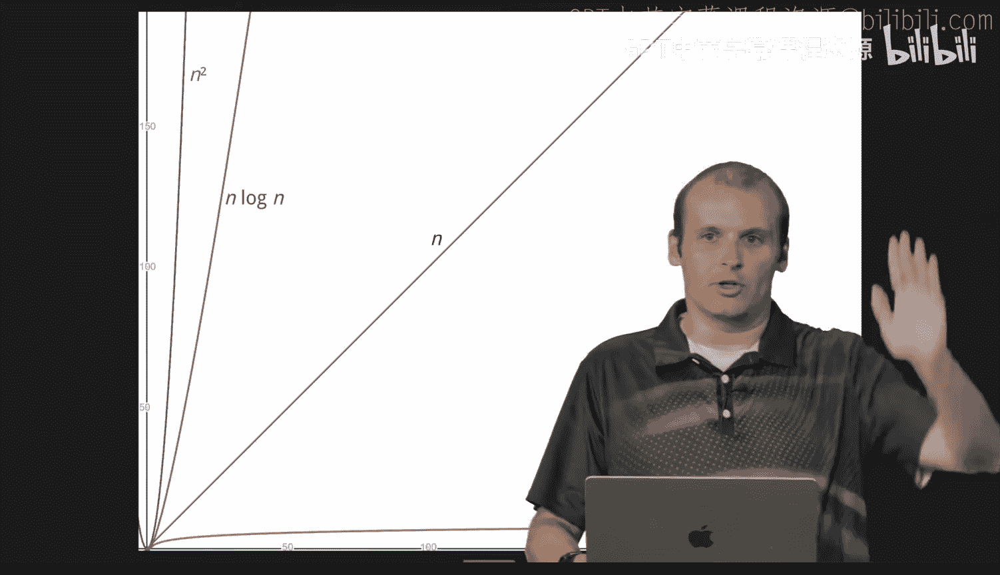

为了理解为什么我们关注增长趋势，请看以下三个虚构算法的运行步骤数（n代表数据规模）：

| 数据规模 (n) | 算法A: n³ | 算法B: n³ + n² | 算法C: 3n³ + 2n² + 10 |
| :--- | :--- | :--- | :--- |
| 1 | 1 | 2 | 13 |
| 10 | 1000 | 1100 | 400 |
| 1000 | 1,000,000,000 | 1,001,000,000 | 992,000,010 |

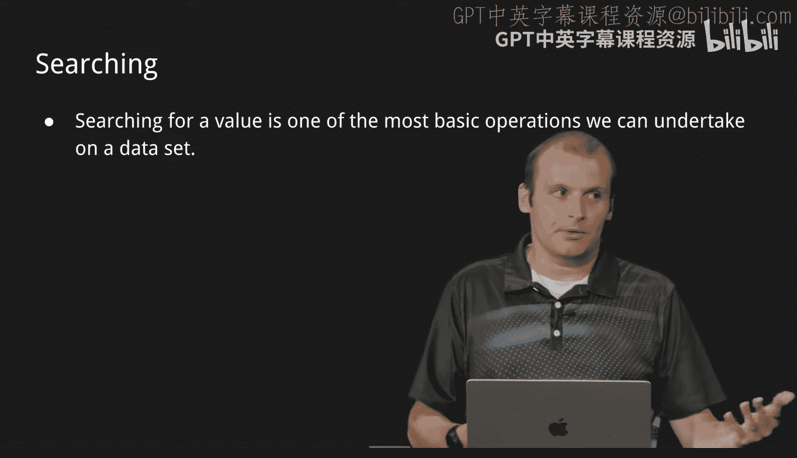

观察可知，当n很小时，算法间差异明显。但随着n变得非常大（例如n=1,000,000），所有算法的运行时间都主要由 **n³** 这一项决定。低阶项（如n²）和常数因子（如3， 10）的影响变得微不足道。

因此，在描述算法运行时间时，我们使用**大O表示法**来关注主导项，忽略常数因子和低阶项。上述三个算法在最坏情况下，我们都会说它们运行在 **O(n³)** 的时间。

*   **大O (O)**：描述算法运行时间的**上界**（最坏情况）。
*   **大Ω (Ω)**：描述算法运行时间的**下界**（最好情况）。

---

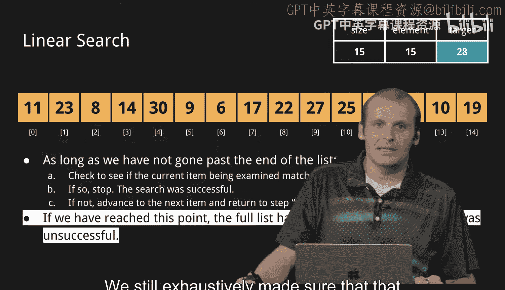

## 常见的算法时间复杂度类别 📈

以下是几种常见的时间复杂度类别，从上到下效率依次降低：

*   **常数时间 O(1)**：运行时间与数据规模n无关。
    *   示例：获取列表的第一个元素。
*   **对数时间 O(log n)**：运行时间随n增长非常缓慢。
    *   示例：二分查找（后续介绍）。
*   **线性时间 O(n)**：运行时间与n成正比。
    *   示例：在列表中线性查找一个值。
*   **线性对数时间 O(n log n)**：运行时间比线性差，但比平方好很多。
    *   示例：归并排序（后续介绍）。
*   **多项式时间 O(n²), O(n³)**：运行时间随n增长较快。
    *   示例：选择排序、冒泡排序（n²）。
*   **指数时间 O(2ⁿ)**：运行时间随n增长急剧上升，通常不实用。
*   **阶乘时间 O(n!)**：运行时间增长极其迅速。
*   **无限时间**：算法可能永远无法结束。

随着数据规模增大，不同时间复杂度带来的步骤数差异会变得巨大。例如，当n=1000时，O(log n)只需约10步，而O(2ⁿ)则是一个天文数字。

---

## 搜索算法 🔍

在数据中查找特定值是商业和计算机科学中的基本操作。对于基础列表，有两种主要的搜索方法。

### 线性查找

线性查找是最直接的搜索方法，适用于任何列表。

**算法步骤（伪代码）**：
1.  从列表开头开始。
2.  只要未到达列表末尾：
    *   检查当前项是否等于目标值。
    *   如果相等，搜索成功，结束。
    *   如果不相等，移动到下一项。
3.  如果到达列表末尾仍未找到，则搜索失败。

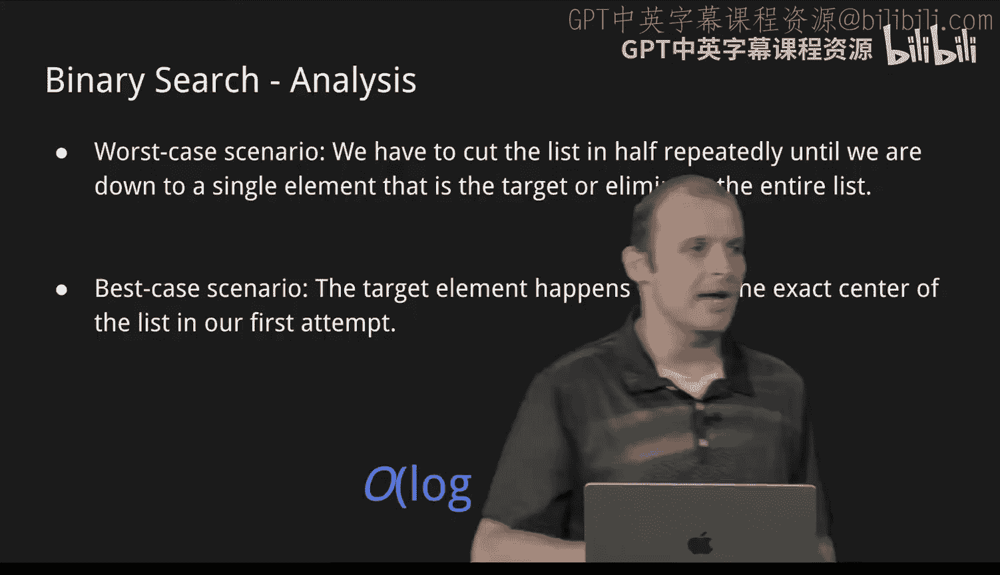

**时间复杂度分析**：
*   **最坏情况**：目标值在列表末尾或不存在，需要检查所有n个元素。时间复杂度为 **O(n)**。
*   **最好情况**：目标值恰好在列表开头，只需检查1个元素。时间复杂度为 **Ω(1)**。

### 二分查找

二分查找效率更高，但前提是**列表必须已排序**。

**算法步骤（伪代码）**：
1.  确定查找范围的起点和终点（初始为整个列表）。
2.  只要起点 ≤ 终点：
    *   计算当前范围的中间点。
    *   检查中间点的值是否等于目标值。
        *   如果相等，搜索成功，结束。
    *   如果目标值 **小于** 中间点的值，则将终点调整为中间点左侧，在左半部分继续查找。
    *   如果目标值 **大于** 中间点的值，则将起点调整为中间点右侧，在右半部分继续查找。
3.  如果起点超过终点，则搜索失败。

**核心优势**：每次比较后，都可以排除一半的搜索范围。
**时间复杂度分析**：
*   **最坏情况**：需要不断对半分割直到只剩一个元素。时间复杂度为 **O(log n)**。
*   **最好情况**：第一次找到的中间点就是目标值。时间复杂度为 **Ω(1)**。

二分查找比线性查找高效得多，尤其是对于大型数据集。这就引出了下一个问题：如何获得一个已排序的列表？

---

## 排序算法 📚

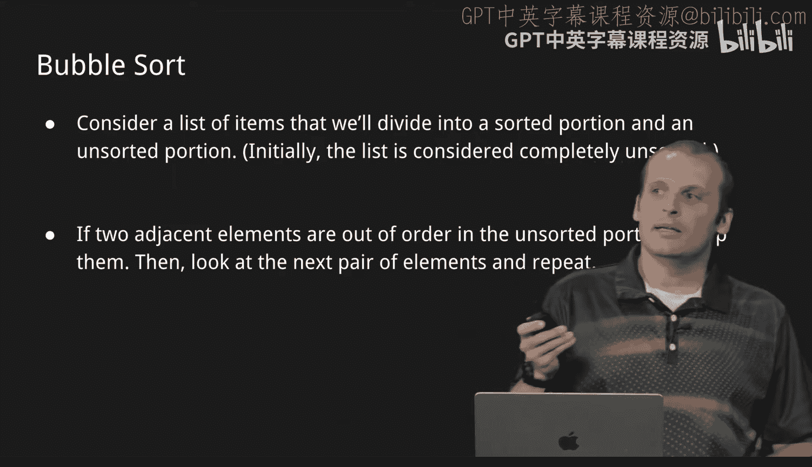

组织数据对商业运营至关重要。排序算法有很多种，我们将探讨五种，并分析它们的效率。

### 选择排序

**算法思路**：
1.  将整个列表视为未排序。
2.  在未排序部分中，找到最小（或最大）的元素。
3.  将该元素与未排序部分的第一个元素交换位置。
4.  现在，第一个元素被视为已排序。缩小未排序范围，重复步骤2-3，直到整个列表有序。

**时间复杂度分析**：
*   无论数据初始状态如何，都需要进行大约n次查找（每次查找范围逐渐缩小），每次查找需要检查约n个元素。
*   因此，最坏情况和最好情况的时间复杂度都是 **O(n²)** 和 **Ω(n²)**。

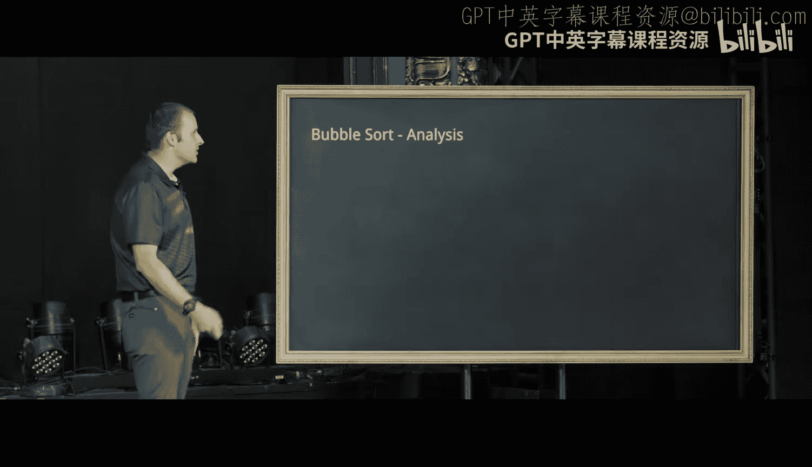

### 冒泡排序

**算法思路**：
1.  从列表开头开始，依次比较相邻的两个元素。
2.  如果它们的顺序错误（例如前一个比后一个大），就交换它们。
3.  这样，每一轮遍历都会将未排序部分中的最大元素“冒泡”到正确位置（末尾）。
4.  记录在一轮遍历中是否进行了任何交换。如果一轮遍历中没有发生任何交换，说明列表已完全有序，算法可以提前终止。

**时间复杂度分析**：
*   **最坏情况**：列表完全逆序，每一轮只能将一个元素归位，需要进行n轮遍历。时间复杂度为 **O(n²)**。
*   **最好情况**：列表已经有序，只需进行一轮遍历（无任何交换）即可确认。时间复杂度为 **Ω(n)**。

### 插入排序

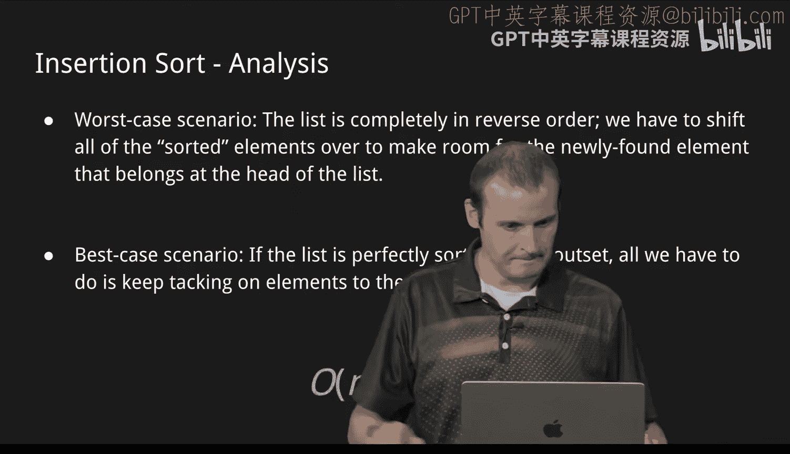

**算法思路**：
1.  将列表的第一个元素视为已排序的序列。
2.  依次取出未排序部分中的第一个元素。
3.  在已排序序列中从后向前扫描，找到该元素应插入的位置。
4.  将已排序序列中该位置之后的元素都向后移动一位，然后将该元素插入。
5.  重复步骤2-4，直到所有元素都插入到已排序序列中。

**时间复杂度分析**：
*   **最坏情况**：列表完全逆序，每次插入都需要移动所有已排序元素。时间复杂度为 **O(n²)**。
*   **最好情况**：列表已经有序，每次取出元素只需比较一次即可插入末尾（无需移动）。时间复杂度为 **Ω(n)**。

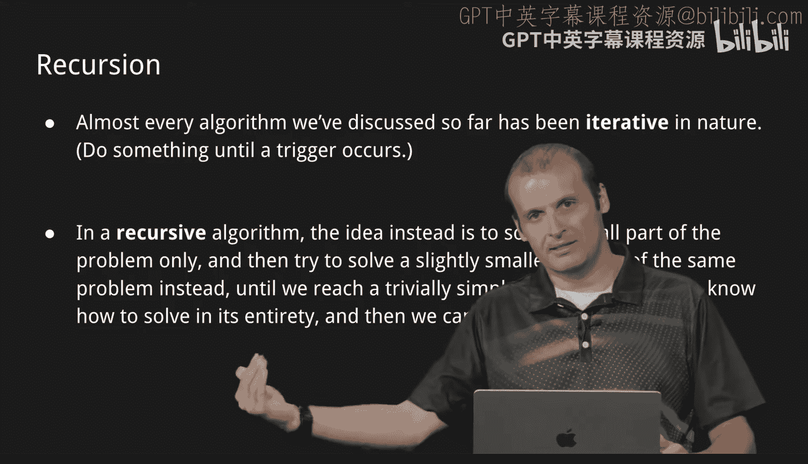

虽然冒泡排序和插入排序在最坏情况下都是O(n²)，在最好情况下都是Ω(n)，但它们的实现思路截然不同。

---

## 递归：一种新的问题解决思路 🔄

在介绍更高效的排序算法前，需要理解**递归**的概念。递归是一种通过将问题分解为更小的、相似的子问题来解决问题的方法。

**迭代 vs 递归**：
*   **迭代**：使用循环重复执行一系列步骤（如我们之前看到的排序算法）。
*   **递归**：函数调用自身来解决规模更小的子问题，直到达到一个可以直接解决的**基础情况**。

**示例：计算阶乘 (n!)**
*   **迭代方法**：使用循环从1乘到n。
*   **递归方法**：
    *   基础情况：如果 n <= 1, 返回 1。
    *   递归步骤：否则，返回 `n * factorial(n-1)`。
    *   例如 `factorial(4)` 的计算过程是：`4 * factorial(3)` -> `4 * (3 * factorial(2))` -> `4 * (3 * (2 * factorial(1)))` -> `4 * (3 * (2 * 1))` = 24。

---

## 归并排序

归并排序是一种利用递归和分治思想的高效排序算法。它通过牺牲额外的内存空间来换取更快的运行时间。

**算法思路**：
1.  **分**：递归地将列表不断对半分割，直到每个子列表只包含一个元素（一个元素的列表自然是有序的）。
2.  **治**：递归地将两个已排序的子列表**合并**成一个新的有序列表。合并时，依次比较两个子列表开头的元素，将较小的放入新列表，直到所有元素合并完毕。

**时间复杂度分析**：
*   分割过程需要O(log n)层递归。
*   每一层合并所有元素的总操作数是O(n)。
*   因此，归并排序的时间复杂度是稳定的 **O(n log n)**。
*   无论是最好情况还是最坏情况，它都需要完成全部分割与合并过程，所以也是 **Ω(n log n)**。

归并排序在处理大型数据集时，效率远高于O(n²)的排序算法。

---

## （趣味算法）Bogo排序

Bogo排序是一种低效且随机的排序算法，主要用于教学演示。

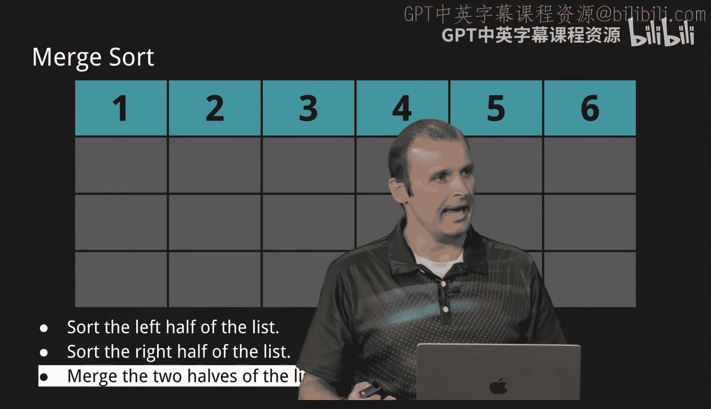

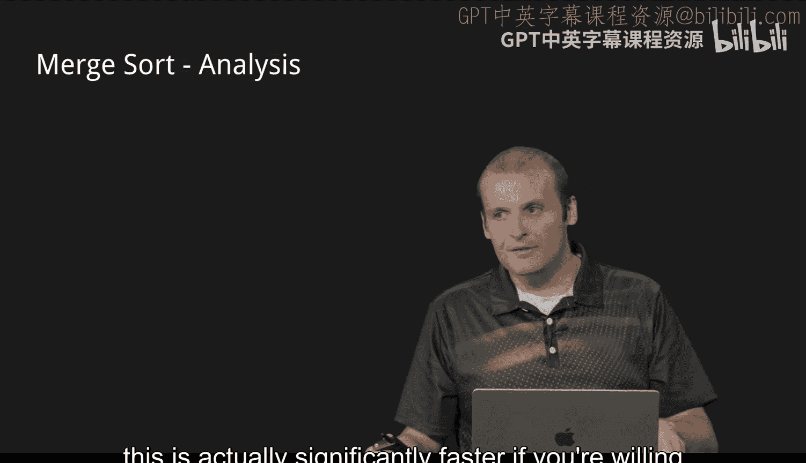

**算法思路**：
1.  检查列表是否已有序。
2.  如果无序，则**随机打乱**列表中所有元素的位置。
3.  重复步骤1-2，直到列表恰好被随机打乱成有序状态。

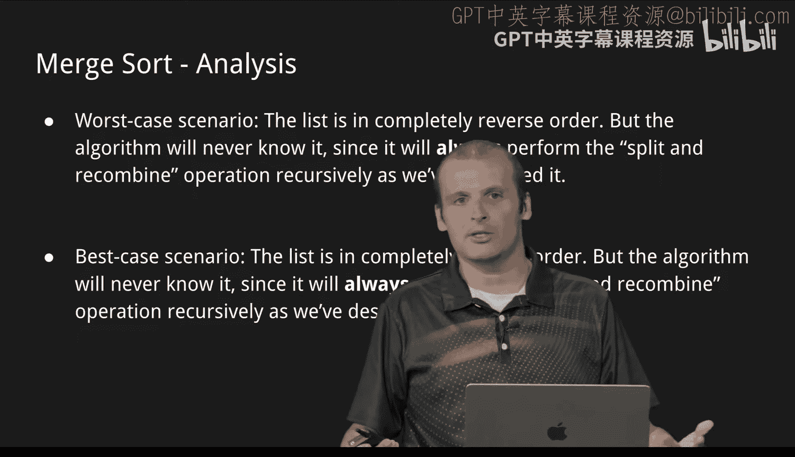

**时间复杂度分析**：
*   **最好情况**：第一次检查时列表就是有序的，或者第一次随机打乱后就得到了有序列表。时间复杂度为 **Ω(n)**（仅需一次线性检查）。
*   **最坏情况**：理论上可能永远无法通过随机打乱得到有序列表。因此，其最坏情况运行时间是**无界的**。

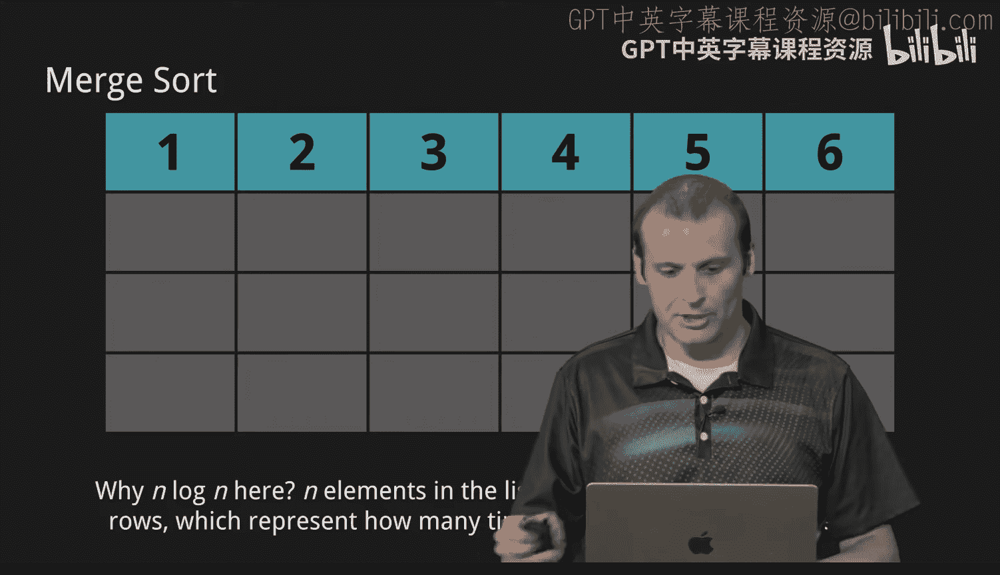

**注意**：Bogo排序绝对不应用于实际场景，它仅仅说明了算法设计不当可能导致的极端低效。

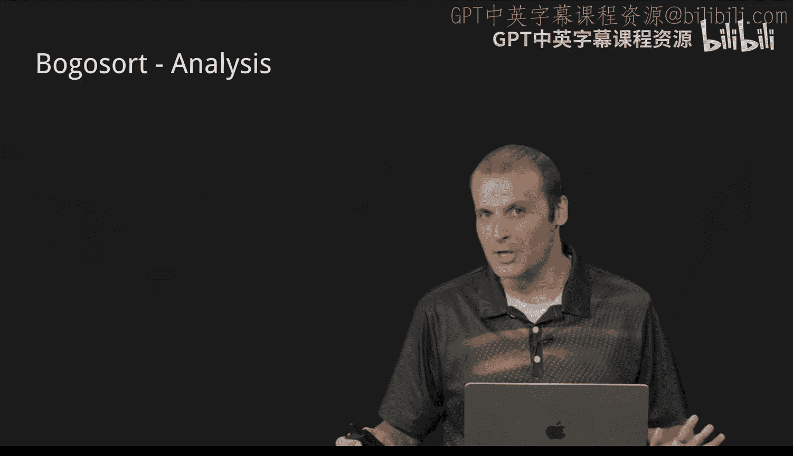

---

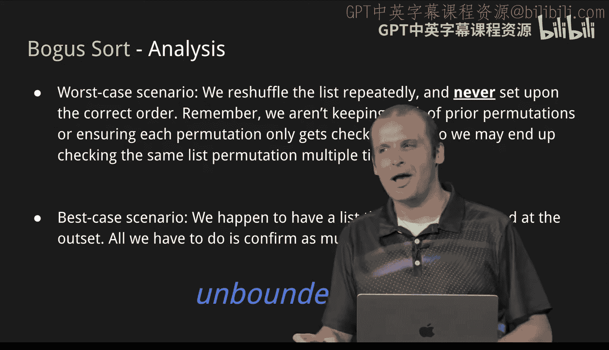

## 总结 🎯

本节课中我们一起学习了算法的核心概念和分析方法。

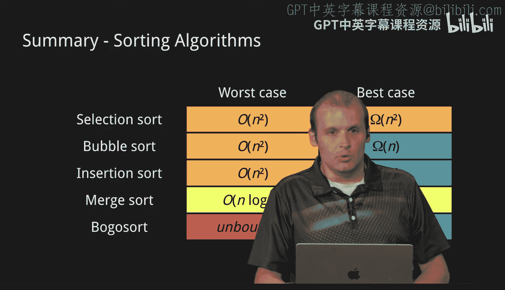

我们了解到：
*   算法是完成任务的明确步骤集合。
*   使用**大O表示法**分析算法随数据规模增长的**时间复杂度**至关重要，它帮助我们关注主导趋势，忽略常数细节。
*   我们深入探讨了**搜索**和**排序**这两类基础算法。
    *   对于搜索，**二分查找 (O(log n))** 比**线性查找 (O(n))** 快得多，但要求数据已排序。
    *   对于排序，我们比较了多种算法：
        *   **选择排序、冒泡排序、插入排序**在最坏情况下都是 **O(n²)**，但在数据接近有序时，冒泡和插入排序的最好情况可达 **Ω(n)**。
        *   **归并排序**利用递归和分治，实现了更优的 **O(n log n)** 时间复杂度，但需要额外的内存空间。
*   算法的**正确性**和**效率**同样重要。不同的算法可能以完全不同的方式（如迭代 vs 递归，时间 vs 空间权衡）解决同一问题，并产生巨大的效率差异。

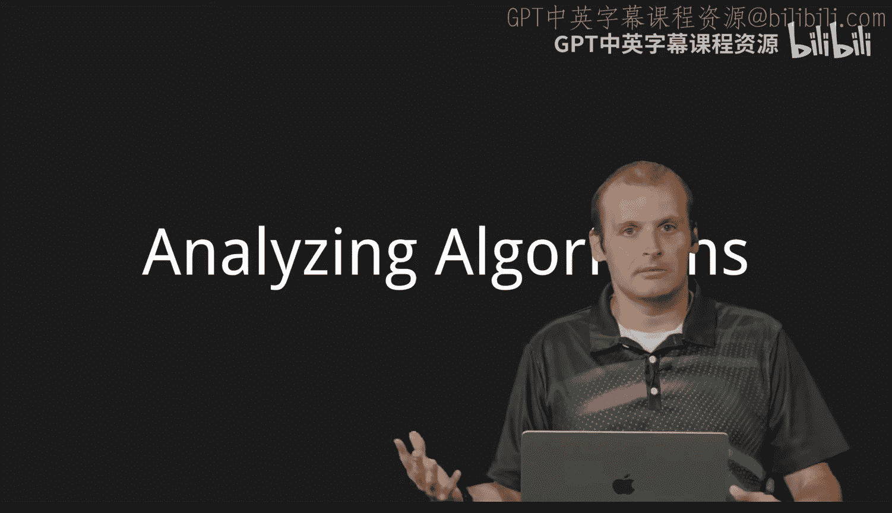

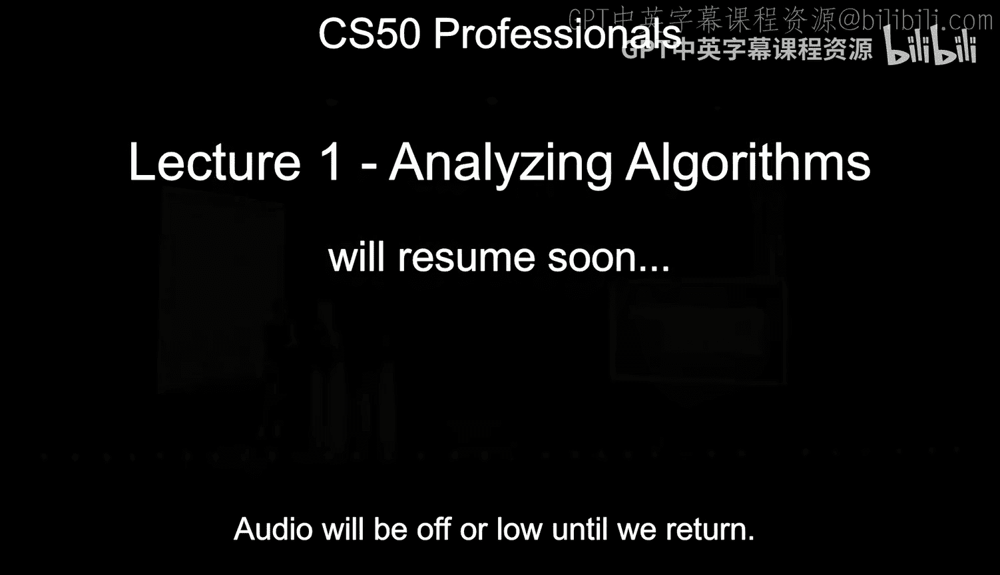

理解这些算法分析的基本词汇和概念，将有助于你在未来与技术团队沟通，并为业务问题选择合适的数据处理方案。