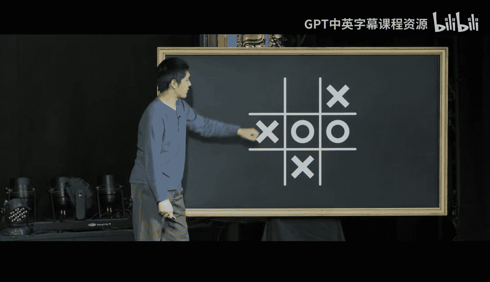
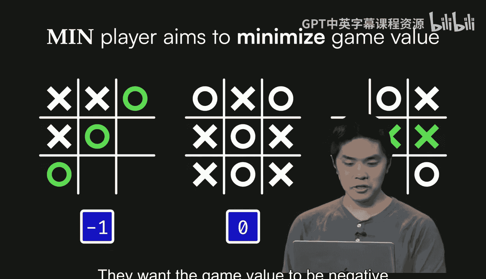
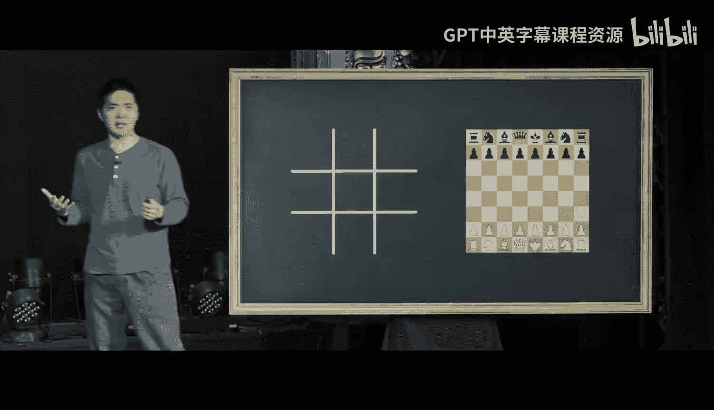
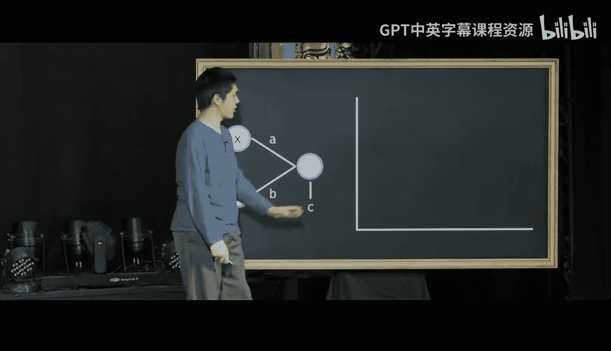
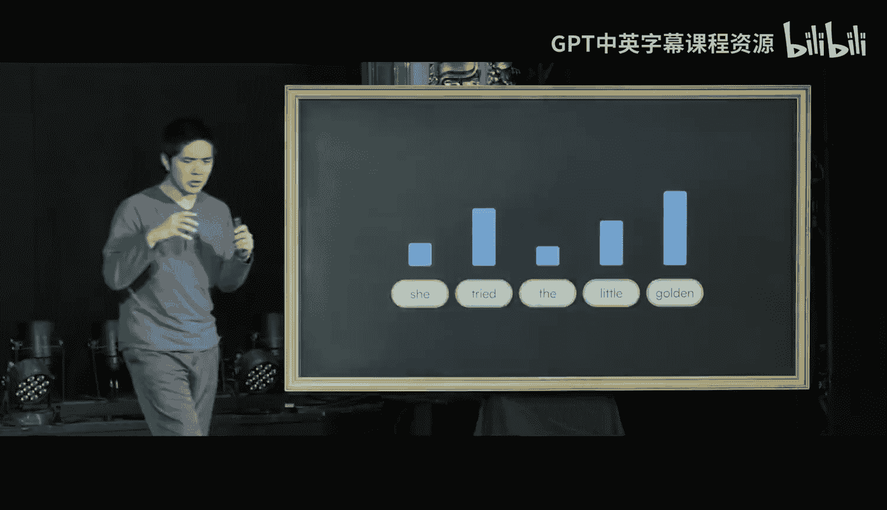
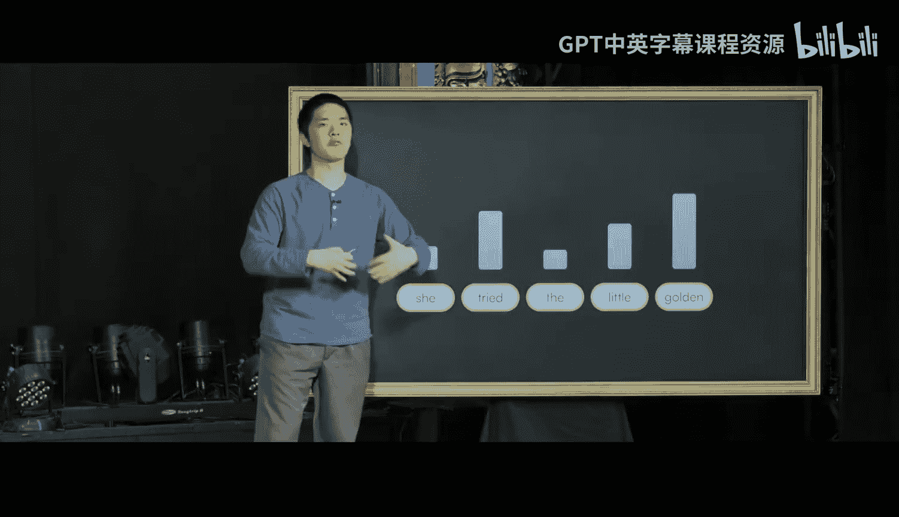

# 005：走近人工智能 🧠


在本节课中，我们将学习人工智能的基础知识。我们将探讨计算机科学家为计算机赋予智能能力所发展出的一些思想、策略和算法。

大家好，我是布莱恩。今天，我们将一起探索人工智能及其背后的思想。我们的目标是帮助你理解人工智能究竟是什么、它是如何工作的、它擅长什么以及它的局限性在哪里。


## 人工智能能做什么？🤔

人工智能有广泛的应用场景。计算机科学家最早探索人工智能的领域之一是游戏领域，他们试图训练计算机玩好游戏，无论是简单的井字棋还是更复杂的国际象棋或围棋。

人工智能也出现在我们的日常生活中。例如，手写识别技术让计算机能够识别你写下的数字或字母。计算机还能以其他方式对数据进行分类，比如你的电子邮箱会自动将一些邮件归类为垃圾邮件，而另一些则不是。计算机需要根据所有输入的邮件，理解哪些应归类为垃圾邮件，以及如何进行这种分类。


其他潜在应用包括推荐系统，例如在线听音乐或观看视频时，流媒体服务或网站会根据你的观看历史推荐你可能喜欢的视频。这需要一定的智能来找出如何推荐你真正会喜欢的内容。

此外，还有文本生成应用。现在，我们可以向大型语言模型提供一些提示或输入，例如“给我一个为期三天的波士顿旅行行程”，并期望计算机能够生成一个智能回复，为我们提供一些关于三天波士顿之旅的好主意。

今天，我们将探讨其中的一些思想，以更好地理解它们的工作原理以及支撑这些人工智能思想的算法。

## 游戏玩法：人工智能的起点 🎮

让我们从游戏玩法开始。这是计算机科学研究和人工智能最早涉足的领域之一，部分原因是游戏提供了一个简化的环境。与现实世界的复杂性和不确定性不同，游戏通常有非常固定的规则和清晰的约束，便于计算机处理。

让我们想象一个你可能熟悉的游戏：打砖块风格的视频游戏。你试图弹跳小球，击中屏幕顶部的物体。你可能会想，如何编程让计算机玩好这个游戏？

计算机将根据游戏中发生的事情采取行动。例如，如果我们观察球的运动，想象一下如果球这样移动，我们希望计算机采取什么行动？我们希望计算机将挡板向左移动，以尝试接住球并确保它不会掉到屏幕底部。

我们可以尝试通过提问并根据答案做出决策来编码这些信息。以下是我们可能采取的方法：

我们可能会问一个问题：“球在挡板的左边吗？” 根据答案是“是”或“否”，我们决定下一步做什么。如果答案是“是”，那么我们应该将挡板向左移动。如果答案是“否”，我们可能需要问另一个问题：“球在挡板的右边吗？” 如果答案是“是”，那么我们应该将挡板向右移动。如果答案也是“否”，那么球可能正垂直下落，我们暂时不需要移动挡板。

将我们的决策过程结构化为提问并根据答案做出决策，其优点是我们可以相对容易地将这个想法转化为代码。以下是用伪代码表示的逻辑：

```
当游戏进行时：
    如果 球在挡板左边：
        将挡板向左移动
    否则，如果 球在挡板右边：
        将挡板向右移动
    否则：
        不移动挡板
```

我们可以想象将同样的提问和决策过程应用到其他游戏中。

## 井字棋与决策树 ❌⭕

现在让我们看另一个游戏：井字棋。游戏规则是，两名玩家 X 和 O 轮流在 3x3 网格的 9 个格子中放置 X 和 O。每个玩家的目标是获得三个连成一线，可以是垂直、水平或对角线。


想象我们正在玩这个游戏，我们是 X 玩家。我们在中间下了一步，O 在顶部回应，然后我们在角落下了一步，O 在另一个角落回应。现在，我们应该走哪一步？如果我们想赢，大多数人会看出正确的走法是在左下角下子，以获得三连一线。


我们是如何得出这个结论的？我们问了一个问题：“我能在这一步赢吗？” 如果可以，我们就下在那一步。但这并不总是可能的。

想象另一个棋盘：我们在右上角开局，O 在中间回应，然后我们在底部下子，O 在右边回应。现在轮到我们，我们无法立即获得三连一线。我们应该怎么做？如果我们仔细玩，可能会注意到 O 已经很接近三连一线了。他们已经有了两连一线。如果我们不想让 O 在下一步赢，我们最好阻止他们，例如在这里放一个 X。


我们也可以用同样的逻辑来编码这个想法：提问并做出决策。我们可能会问：“X 能在这一步赢吗？” 如果答案是“是”，我们就下在能让我们三连一线的地方。如果不是，我们问另一个问题：“O 能在下一步赢吗？” 如果答案是“是”，我们就下在能阻止他们的地方。



但如果答案都是“否”，我们既不能赢也不能阻止对手，情况就变得更复杂了。可能并不立即清楚应该做什么决定。理想情况下，如果我们想让计算机来做这件事，我们不应该需要自己解决这个问题。人工智能的很多内容不仅仅是告诉计算机具体做什么，而是给计算机它需要的工具，让它自己找出正确的决定。

## 极小化极大算法：计算机的决策策略 ⚖️

我们将要使用的游戏玩法算法称为“极小化极大算法”。它是如何工作的？计算机最终用数字表示事物。如果我们想让计算机玩好游戏，我们需要将游戏的概念——玩家、行动、回合、输赢——转化为计算机能够理解的数字。

我们如何将井字棋转化为数字？就计算机而言，井字棋只有三种我们真正关心的结果：O 赢、平局或 X 赢。我们将为每种可能的结果分配一个数字：O 赢为 -1，平局为 0，X 赢为 +1。

一旦我们为这些可能的结果分配了数字，我们就可以定义每个玩家的目标。X 玩家，我们称之为“最大化玩家”，他们的目标是最大化游戏值。他们希望这个蓝色值尽可能高，+1 最好，意味着 X 赢；如果不可能，那么 0（平局）仍然比 -1（O 赢，X 输）好。

与此同时，O 玩家有相反的目标，我们称之为“最小化玩家”。他们的目标是最小化游戏值。他们希望游戏值为 -1，这意味着 O 赢。如果不可能，那么平局仍然比 X 赢好。


让我们看看如何使用这些值来评估游戏中的走法。从一个简单的游戏棋盘开始：游戏结束，X 有三连一线，所以 X 赢了，因此这个游戏的值是 +1。

现在看一个稍微复杂的情况：游戏尚未结束，轮到 O 走棋。我们想问：这个棋盘的值是多少？游戏还没结束，我们不知道 X 会赢、O 会赢还是平局。但极小化极大算法将帮助我们弄清楚：如果双方都采取最优策略，游戏最终的值会是多少？



O 有两个选择：可以在左上角下子，也可以在底部中间下子。极小化极大算法会考虑这两个选项，因为我们需要考虑所有可能的走法来决定哪一步是最好的。

我们考虑两种选择：如果 O 在左上角下子，X 的唯一选择是在底部中间下子，X 将获得三连一线，X 赢，游戏值为 +1。因此，导致这个状态的游戏状态值也是 +1。

如果 O 在底部中间下子，X 的唯一选择是在左上角下子。在这个游戏状态下，没有人赢，所有格子都填满了，是平局，值为 0。因此，导致这个状态的游戏状态值也是 0。

现在，回到最初考虑的状态，O 有两个选择：一个导致值为 +1，另一个导致值为 0。记住，O 玩家是最小化玩家，他们希望分数尽可能低。在这种情况下，他们无法得到 -1，但可以在 +1 和 0 之间选择。他们会选择较小的选项，即在底部中间下子，这很可能也是你会做的，以阻止 X 获得三连一线。这个游戏状态的值也是 0，意味着如果双方都采取最优策略，游戏最终将是平局。

我们在距离游戏结束两步的位置做了这个分析。但你可以在游戏的任何时刻这样做，总是考虑所有可能的走法，对于每个可能的走法，考虑对手的最佳回应，再考虑你对那个回应的最佳回应，依此类推。本质上，计算游戏所有可能的发展方式，然后根据哪个值最高（如果你是 X 玩家）或哪个值最低（如果你是 O 玩家）来做决定。

这个极小化极大算法可以用来最优地玩井字棋。如果你使用这个算法，无论你是哪个玩家，你永远不会输掉一局井字棋，你总是会走出最好的每一步。

## 扩展到复杂游戏：国际象棋的挑战 ♟️

我们可以想象，如果尝试将这种方法应用到其他游戏中会怎样。井字棋是一个相对简单的游戏，但想象一个更复杂的游戏，比如国际象棋，有更多的棋子、更多的格子、更多不同的可能性。你能对国际象棋这样的游戏使用极小化极大算法吗？

事实证明，你可以。我们可以应用完全相同的过程，即想象你所有可能的走法，想象对手对这些走法的最佳回应，最终进行计算以找出正确的走法。虽然这在理论上可行，但在实践中，我们将遇到的挑战是，国际象棋的可能性实在太多，我们很难计算所有可能。


让我解释一下。在井字棋中，第一个玩家有 9 种选择，因为棋盘上有 9 个格子。在国际象棋中，即使你不知道规则，你也知道有很多棋子，每个棋子都有不同的走法。事实上，国际象棋的第一步有 20 种不同的选择。



在井字棋中，第二个回合（O 走棋）有 8 种选择，所以两个回合后有 9 * 8 = 72 种可能性。在国际象棋中，白方第一步有 20 种选择，黑方第一步也有 20 种选择，所以两个回合后就有 20 * 20 = 400 种可能性。

这些可能性会以指数方式继续复合增加。三个回合后，井字棋约有 500 种可能性，国际象棋约有 9000 种。四个回合后，井字棋约 3000 种，国际象棋约 200,000 种。五个、六个、七个、八个回合后……井字棋在九个回合后结束，约有 260,000 种可能性。而国际象棋可能才刚刚开始，我们看到的可能性高达约 2.4 万亿种，并且游戏中还有许多回合要进行。

虽然 260,000 看起来是个大数字，但在实践中，如今一台快速的计算机可以在几秒钟内处理完这 260,000 种可能性，快速探索所有可能的井字棋游戏以找出最佳走法。而在国际象棋中，可能性如此之多，即使你给计算机尽可能多的时间，仍然不足以探索所有可能的国际象棋游戏来识别最佳走法。因此，我们需要某种其他策略来解决这个问题。

## 深度限制与评估函数 🎯

如果我们仍然想训练计算机下好象棋，我们能做什么？挑战在于探索到游戏结束有太多的可能性。可能性呈指数增长，每考虑一个回合、又一个回合，就会增长得非常快。

一个可能的选择是采用“深度限制”方法。也就是说，不要在做出决定前探索整个国际象棋游戏直到结束，而只向前看一定数量的回合，比如向前看五步、六步或七步。

这看起来是怎样的？想象游戏的任何给定状态，我们用这个圆形节点来表示国际象棋的游戏状态。在计算机科学中，如果我们试图表示一堆不同信息之间的关系，我们会将它们放在一个数据结构中，其中的单个单元我们称为“节点”。这个节点代表国际象棋的一个游戏状态。

你可以想象画一个图，将该状态与我们可以为一个玩家的回合选择的所有可能行动连接起来，然后是与这些行动对应的所有可能回应，依此类推，直到游戏结束。一局国际象棋可能持续数百个回合。

在深度限制的极小化极大方法中，我们会说只向前看一定数量的回合，然后就在那里停止，不再进一步探索。这将允许我们限制需要探索的可能性数量。

在计算机科学和人工智能中，通常我们不仅需要考虑做出好的决策，还需要高效地做出决策，以便有足够的时间来做出决定。有时这意味着要找出正确的权衡，为了能在现实的时间框架内决定我们实际想在象棋中走哪一步，我们可以牺牲向前看更多步的能力。

那么，在使用深度限制方法时，我们需要对这个算法做哪些改变？之前，当我们玩井字棋直到游戏结束时，我们到达了游戏结束，然后可以评估谁赢了游戏，是 X 赢、O 赢还是平局，并用它来分配游戏状态的值。

在国际象棋中，如果我们使用深度限制方法，只向前看 5、6、7、8、9 或 10 步，我们可能还没有到达游戏结束，还不知道谁会赢。因此，我们需要对游戏状态将是什么、我们认为游戏的赢家将是谁、我们认为白方表现更好还是黑方表现更好做出一些预测。我们需要在那里做出某种决定。

为此，我们通常会使用一种叫做“评估函数”的东西。什么是评估函数？在计算机科学的这个上下文中，函数只是可以接受一些数据作为输入，代码可以处理该输入，然后产生一些东西作为输出。你可能熟悉数学函数，它接受一个数字作为输入并产生一个数字作为输出。

在这个上下文中，我们的评估函数将接受这些游戏状态之一作为输入，并输出一个我们认为该游戏值的预测。构建这个评估函数有不同的方法。你可能会看一些因素，比如白方有多少棋子 vs 黑方有多少棋子，并以此做出决定；或者你可能会看这些棋子的具体位置。我们也可以通过训练计算机来估计我们认为特定游戏状态的评估值。

这将帮助我们决定哪些状态我们认为比其他状态更好，从而允许我们决定在任何特定游戏中应该走哪一步。

## 强化学习：从经验中学习 📈

这可能类似于你想象的学习玩游戏并变得擅长游戏的过程。你通过经验变得擅长：你尝试一些事情，从中学习。如果你做得好，你学会在未来多做；如果你做得不好，你学会在未来少做，你从错误中学习。

我们可能有的一个想法是为计算机编码同样的可能性，让计算机也能从经验中学习。计算机学习的这个一般领域被称为“机器学习”，但更具体地说，我们在这里感兴趣的是机器学习的一种形式，称为“强化学习”。强化学习是关于计算机从经验中学习：你从一个不擅长执行某项任务的计算机开始，通过经验，计算机在执行该任务方面变得更好。

让我给你一个简化的例子。想象我们有一个网格，一个我们希望计算机能够导航的迷宫。这个网格中的一些单元格是墙，我们不希望计算机撞到。我们就像屏幕左下角的这只计算机化的 AI 鸭子，试图到达这里的蓝色星星。那是我们的目标，我们需要避免撞到墙上。


但想象一下，最初我们的智能体，这里的 AI 智能体，并不知道如何在这个世界中导航。它不知道墙在哪里，不知道根据它所在的方格应该采取什么行动，但它需要以某种方式找到通往目标的路径。它将如何做到这一点？

如果它开始时对一切一无所知，它不知道该朝哪个方向走，不知道墙在哪里，它所能做的最好的事情就是随机尝试。也许我们尝试向右走，结果发现我们撞到了一堵墙。所以那效果不好。我们回到起点，但我们可以从那次经验中学习。计算机可以学习到，下次你处于这种状态时，你不应该向右走，因为上次它没有成功，导致你撞墙，没有实现你的目标。

所以下次我们学会尝试不同的东西。我们学会也许向上走。现在我们处于一个新的状态，我们以前没有经验。所以我们可能会随机尝试，可能会尝试向右走。现在，我们又处于一个新的状态，我们可能会随机尝试，因为我们还不知道该做什么。也许我们尝试向下走，结果发现我们撞到了另一堵墙。

所以现在我们也从中学到了。我们学到，下次我们处于这种状态时，我们最好不要向下走，因为上次那没有带来好的结果。我们可以重复这个过程：试错。每次我们失败并撞到东西，我们都从经验中学习，学会不再那样做。

这种情况会持续发生，因为一开始我们并不擅长这项任务。我们可能会取得一点进展，但仍然会以撞墙告终，并从错误中学习，学会未来不再那样做。如果你重复这个过程足够长的时间，不断地从错误中学习并相应地调整你的行为，最终，我们的智能体可能会找到某种方法来在这个网格中导航，并最终到达目标。

一旦我们实现了目标，一旦我们能够做成功的事情，我们也能从中学习。我们不仅从错误中学习，也从成功中学习。所以一旦我们实现了目标，那么在计算机未来运行的过程中，我们可以说我们知道我们找到了一个效果很好的行动序列，我们可以直接遵循那个行动序列，因为知道上次它很有效，遵循同样的行动序列最终将引导我们回到目标。

这就是强化学习背后的思想之一：从我们的错误中学习，也从我们的成功中学习。你可能注意到的一件事是，虽然我们确实找到了一种到达目标的方法，但我们没有找到最快的方法。事实上，有一条更快的路，如果我们关心找到更快的路，与其向下走并绕过这里的墙，我们可以直接向上走，那会让我们更快到达目标。


但现在我们无法找到那条路了，因为我们已经找到了这条有效的路径，并且我们训练自己说，一旦我们找到了有效的东西，我们就从中学习，学会多做那样的事。因此，在这些强化学习场景中，我们经常需要在两个相互竞争的优先级之间取得平衡。

我们称这些优先级为“探索”和“利用”。一方面，我们希望利用我们现有的知识。如果我们知道有一个行动序列有效，那么我们希望尝试利用这些知识来遵循它，因为我们知道那会带来好的结果。但另一方面，我们有时也想探索新的状态、新的行动，这些是我们以前不一定尝试过的，因为它们可能会带来更好的东西。

计算机在学习做新事物时需要在这些优先级之间取得平衡。你和我每天也参与这个探索和利用的过程。你可能会想，如果你有某种特别喜欢的食物或餐厅，你在决定今天去哪里吃饭时，一方面你想利用你现有的知识，你知道如果你去一个你已经喜欢的地方，你可能会在那里度过愉快的时光；但另一方面，你可能也想探索，尝试新的东西，因为你可能最终会更喜欢它。正确的策略通常不是总是做一件事或总是做另一件事，而是两者的混合，有时在尝试可能有效的新事物和利用你已经拥有的知识之间取得平衡。

计算机可以在各种情况下使用强化学习的想法，而不仅仅是游戏。想象一下推荐系统，例如，一个网站向你推荐你可能想看的电影或视频，或者你可能喜欢的音乐。它们如何做到这一点？

一种想象的方式是尝试给你推荐，并从成功和失败中学习。在这种情况下，成功和失败是什么样的？这不是关于到达星星或撞到墙，而是关于你是否选择点击或观看推荐的视频或电影。例如，如果一个网站向你推荐了某个视频，而你确实点击了它，并且观看了部分或全部内容，那么网站可以从这个成功中学习。它能够根据你之前观看的内容成功地向你推荐了新的东西，并且可以学会在未来向你推荐更多类似的内容。

另一方面，如果他们推荐了一个视频，而你选择不看，或者你开始观看，但几秒钟后就立即停止，因为你发现那不是你想要的，那么推荐系统也可以从那个失败中学习。它可以了解到，好吧，我推荐了一个你可能不太喜欢的视频，所以也许我将来会减少向你推荐那种类型的东西。

因此，通过从自身经验中学习，使系统更擅长产生你可能想要的结果。所以强化学习有广泛的不同可能应用。这是一个我们可以看到人工智能可以从经验中学习的领域，通过体验事物、尝试和实验，你可以从一个不擅长玩游戏、不擅长导航迷宫、不擅长做推荐的算法开始，但通过试错、从反馈中学习，它最终能够更好地解决这类问题。

## 神经网络：模拟人脑 🧠

现在，在人工智能和机器学习领域，我们还有哪些其他工具可用？最流行的是“神经网络”的概念。我们在人工智能中经常看到神经网络的出现。让我们花点时间真正思考一下神经网络是什么，以及它们做什么。

神经网络是受人类大脑启发的。人类大脑由看起来有点像这样的神经元组成，它们相互连接，并传递电信号。如果一个神经元获得足够的电信号，它可以激活或放电，从而触发电信号传递到另一个神经元，依此类推，通过一系列可能相互连接的神经元。

所以，就像我们受人类学习方式的启发而提出强化学习的想法一样，我们也可能受人类大脑结构的启发，想象一下，要构建一个神经网络，一个人工神经网络，需要什么。

那看起来像什么？与生物神经元不同，我们有“人工神经元”，你可以把它想象成这样的一个单元。这个单元将存储一些值，存储一些数字，有点像生物意义上的神经元存储某种电能。这些神经元将通过这些连接相互连接。因此，就像神经元可以将电信号从一个传递到另一个一样，我们神经网络的这些生物神经元或单元将能够将它们的值从一个传递到另一个。

那么神经网络实际上在做什么？它在计算什么？你可以把神经网络看作本质上像一个函数。记住，函数接受输入并产生某种输出。在这种情况下，我们的神经网络将接受输入，这将是两个值。我们稍后会看到，神经网络可以接受比这多得多的输入。但现在，我们有一个接受两个值作为输入的神经网络，它将尝试产生一个值作为输出。

神经网络将学习做的是，它将学习如何将这些输入转换为那个输出，用于我们可能想象的几乎任何预测任务。所以你可以想象各种你可能想尝试预测的事情。也许你在企业工作，想预测你的销售额会是多少。所以你有输入数据，比如你在广告上花了多少钱，你想根据这个输入（即你在广告上花了多少钱）来预测你的销售额会是多少。

也许你试图预测天气，试图预测是否会下雨。所以这里的输出代表是否会下雨，是雨天还是非雨天。你的输入是可能有助于决定是否会下雨的数据片段，比如外面的湿度或气压，这些可能是神经网络的输入值。

现在，如果你只是创建一个像这样的神经网络，并告诉它根据湿度和气压预测是否会下雨，最初，神经网络将无法知道正确答案是什么，我们将无法知道应该做出什么正确的决定。

因此，我们对神经网络所做的是用数据训练它。如果你给计算机提供大量历史日子的数据，并告诉计算机在每一个日子里，这是湿度，这是气压，以及这是否下雨了，那么计算机通过这种神经网络架构可以学习的是，如何根据输入（在这种情况下是湿度和气压）计算那个输出（即是否下雨），并且我们将学习如何基于大量训练数据执行该计算。


那么实际的数学是什么样的？神经网络实际执行的是什么数学运算？

每个输入我们都可以分配一个值，我们称这个为 X，那个为 Y。然后神经网络学习的是许多“参数”。参数是计算机学习使用的具体值。我们将学习一个参数，我们称之为 A，它与第一个输入相关联。我们将学习另一个参数 B，它与第二个输入相关联。我们还将学习第三个参数 C，它与任何输入都不关联，这只是关于我们认为是否可能（在这种情况下，比如是否会下雨）的一般信息。

那么神经网络在计算什么？神经网络真正要计算的是，它将尝试组合来自 X 和 Y 的数据，以预测这个输出属于一个类别还是另一个类别，比如下雨或不下雨。它要做的数学运算是将每个输入乘以其对应的参数（也称为“权重”）。所以我们将 A 乘以 X，将 B 乘以 Y，将它们相加，然后我们还有这个额外的参数 C，通常称为“偏置”，它与这些输入中的任何一个都不关联，我们只是最后加上它。

然后我们只是执行一个比较。我们说，这个值是否至少为 0？如果至少为 0，我们将其归类为一个类别，如下雨。如果小于 0，则将其归类为另一个类别，如不下雨。当然，根据 A、B 和 C 的值，这将决定对于任何特定输入我们得到什么样的输出。

这就是神经网络在学习的东西。当我们谈论神经网络学习做某事（机器学习）时，我们真正的意思是计算机正在学习使用什么数字作为 A、B 和 C，以使这个方程能够很好地完成我们交给计算机的某种预测任务。

举一个简单的例子，想象我们要在图表上绘制这些 X 和 Y 值，比如 X 轴和 Y 轴。想象我想学习将蓝点与红点分开。所以我有一个类别蓝色，另一个类别红色，你可以把它想象成雨天和非雨天，或者你可能想做的任何其他分类。

最初，当你创建神经网络时，这些值 A、B 和 C 将是随机的。我们不知道值应该是什么，我们会随机选择它们。结果，它们不会很好地分离蓝点和红点。这里有一条随机的线，这里有一个蓝点，那里有另一个蓝点，它并没有很好地分离它们。



但随着我们添加数据，我们将要做的是，我们可以从每个额外的数据点中学习。给定一个额外的数据点，我们可以尝试预测，并通过调整 A、B 和 C 的值来调整那条线，以使其对我们给出的数据更准确。这就是为什么试图构建机器学习模型的公司如此关心拥有越来越多的数据的原因之一，因为你拥有的数据越多，你就越能改进这些神经网络正在学习的东西，以更好地进行预测。

例如，当我们添加另一个数据点时，我们可能会了解到，好吧，根据我们预测的线，我们错误地分类了它。我们预测红色在这条线的一边，而实际上它应该在另一边。所以我们学习如何调整那条线，如何进行调整以使其更准确。每次我们得到一个新的数据点，如果我们分类错误，我们就学习应该对这条线进行哪些调整，以便将来能更好地进行分类。

在实践中，数据不太可能这么干净。如果你有越来越多的数据，它会很混乱。你不可能每次都完美地分类事物。但通常，通过这种神经网络训练过程，你可以学会在区分两个不同类别方面做得相当好。

## 处理更复杂的数据：手写识别示例 ✍️

这就是一个有两个输入的神经网络的样子。但随着我们试图处理越来越复杂的数据，这种表示通常会开始看起来更复杂一些。例如，想象我们想解决像手写识别这样的问题。这里有一个手写数字，只是一个 4x4 的像素网格。

你可能想象，计算机表示视觉信息的方式是通过具有一定亮度或不亮度的像素。目前，我只使用白色、黑色和灰色阴影；在实践中，你可能也有彩色像素。但这里的每个像素，我们现在真的可以表示为一个值，描述该像素的明暗程度，其中 0.99 是一个非常亮的像素，0.16 是一个非常暗的像素。

计算机如何学会将这个数字分类为数字 4？我们这里有 16 个数字。所以你可以想象的一种方法是构建一个神经网络，它没有两个输入，而是有 16 个输入，每个输入对应一个可能的像素值。我们希望计算机尝试预测的不是一个类别（比如是否是雨天），而是如果我们试图对数字进行分类，有 10 个不同的类别：是 0、1、2、3、4、5、6、7、8 还是 9。所以我们可能想象神经网络有 10 个输出，每个输出对应我们试图将数字分类为的不同可能类别，然后在它们之间绘制连接。

这个神经网络将学习的东西比我们刚才看到的那个有更多的参数，但它将能够接受 16 个像素作为输入，即这个 4x4 的像素网格，这是神经网络的输入。通过给它大量看起来像这样的数据（一堆像素），并告诉计算机“这是数字 4，你应该学习 4 是什么样子”，神经网络将学会执行这种分类。

事实证明，随着我们添加更大规模的数据，也许你想象的不是 4x4 的像素网格，而是更大的像素网格，我们可能想开始对这种架构进行修改。通常，神经网络有多个不同的层，对数据进行多种转换，使其更容易处理。但最终，其基本思想是相同的：神经网络正在学习一个函数，一个以所有像素数据作为输入并产生输出（预测）的函数。最初，神经网络并不擅长这样做，但通过训练，它学会了为所有这些连接（你在这里看到的许多连接）使用什么值，以便能够有效地预测输出。

这对于计算机可能想要执行的任何不同类型的分类任务都是类似的。我们之前讨论过垃圾邮件分类，你有一个收件箱，收到一堆邮件，计算机将其中一些分类为垃圾邮件，一些则不是。这也是一个分类任务，计算机接受这个输入（一大堆数据），它试图预测的是：这是一封垃圾邮件吗？你可以想象尝试构建一个神经网络来做这件事。

但为了做到这一点，我们需要对自然语言有一定的理解，我们需要让计算机能够进行交流。

## 自然语言处理：从单词到数字 🔤

让计算机处理自然语言有点复杂，因为语言本质上是模糊的。有些词有多种含义，有不同的方式表达同一件事。所以如果我们想让计算机理解像英语这样的语言，我们需要一些策略来弄清楚计算机将如何真正做到这一点。

首先要弄清楚的是，我们将如何将单词转化为数字，因为记住，计算机最终理解的是数字，它们处理的是数字。所以如果我们想让计算机能够理解语言并理解单词，我们需要某种方式将这些单词转化为可以在计算机中表示的数字。

我们如何做到这一点？一种方法是给每个单词一个数字。所以单词“hello”可以是数字 1，单词“cat”可以是数字 2，单词“computer”可以是数字 3，我们可以为我们词汇表中的每个单词都这样做。如果我们有数万个单词，我们就会有数万个数字。

但处理起来会有点棘手，因为很难想象将整个单词的含义编码在仅仅一个数字中。一个数字真的只能代表一件事。所以通常，我们不会使用单个值，而是使用所谓的“分布式表示”。不是用一个值表示一个单词，而是用多个值表示这个单词。在这里，我用五个不同的数字表示单词“hello”。在实践中，可能超过 5 个，我只是展示五个，因为它可以放在屏幕上。

但每个单词，我们可能会关联一个不同的数字序列，一个不同的数字“向量”。所以单词“cat”与另一个五个值的序列相关联，单词“computer”也与另一个值的序列相关联。但这引出了一个问题：这些数字实际上意味着什么？例如，用这些特定值定义单词“computer”意味着什么？

最终，它们的意义在于它们彼此相关。单独来看，一组特定的数字意义不大，但当你将该单词的含义与我们用来表示词汇表中所有其他单词含义的数字进行比较时，它确实有意义。


所以你可以想象，如果你有一个数字，你可以在一维空间的一条线上绘制它。如果你有两个数字，你可以在二维空间的网格上绘制它；三个数字，你可以在三维空间绘制。计算机处理更高维度没有问题，尽管我们可能难以想象 4、5 或 6 维是什么样子，但计算机可以处理多个维度的数据，因为对它们来说这只是另一个数字。


所以你可以想象，如果我们取所有这些数字表示（我们称之为“嵌入”），嵌入是单词含义在这种上下文中的数字表示，我们可以想象在图表上绘制所有这些单词的含义，所有这些嵌入。

我们希望发现的是，我们尝试为单词分配嵌入值的方式，是使得具有相似含义的单词在绘制它们的嵌入值时最终位于相似的位置。所以当我绘制嵌入值时，我希望的是，对于“早餐”和“午餐”这两个词，由于这两个词含义相似，它们最终也应该具有彼此相似的值，它们的数值。


“猫”和“狗”，这些是相似的词。因此，它们也应该有彼此相当接近的向量表示（嵌入），与比如“早餐”和“午餐”不同。这些词在含义上非常不同。所以你可以想象为你词汇表中可能的所有单词都这样做，并找出你想绘制每个单词的位置，以便具有相似含义的单词最终位于相似的位置。


## 注意力机制：理解上下文 🧐


现在，计算机如何知道两个词有相似的含义？一种确定方法是基于单词出现的上下文。这个想法是，如果一个单词出现在与其他单词相似的上下文中，那么这些单词很可能具有相似的含义。


例如，如果我给你这些词：“For ____ she ate.” 什么词可以填空？我们可以用“breakfast”这样的词填空，“For breakfast she ate”是一个合理的填空方式。或者你可以用“lunch”填空，“For lunch she ate”也相当合理，“For dinner she ate”也是如此。

基于此，因为“breakfast”、“lunch”和“dinner”这些词都可以合理地出现在相似的上下文中，我们因此可以得出结论，“breakfast”、“lunch”和“dinner”这些词彼此含义相似。所以如果你给计算机大量的训练数据，一大堆文本，计算机可以学习哪些词倾向于出现在什么上下文中，围绕哪些其他词出现，并利用这些信息来弄清楚哪些词彼此含义相似。


而一个不适合这个空白的词，例如，你可能不会在网上找到很多使用“For excellent she ate.”的示例文本。这可能告诉你，“excellent”这个词与“breakfast”和“lunch”等词的含义非常不同。

使用这种方法，我们可以为每个单词分配一些嵌入，一些表示该单词含义的值序列，然后将其用作神经网络的输入，该网络接受一个数字序列作为输入。这样，我们就可以让神经网络能够接受语言作为输入，处理该输入，并弄清楚如何处理它，以能够接收一封电子邮件并尝试将其分类为垃圾邮件或非垃圾邮件，甚至可能自己生成新的文本。

但为了做好这一点，通常，一个单词的含义在某种程度上取决于出现在它周围的单词。真正知道一个序列中下一个单词是什么，如果你试图像在线大型语言模型那样生成文本，它取决于对单个单词以及这些单词如何相互关联的某种理解。

我这么说是什么意思？想象一下，我们正在尝试做类似预测序列中下一个单词的事情。例如，我们有这样一段文字，这是来自《爱丽丝梦游仙境》的一段话。想象我让你预测在这个单词序列的末尾，下一个单词会是什么。这段文字中的下一个单词是什么？这是一个有趣的问题，因为这正是大型语言模型在你问它问题时试图做的事情。

你问大型语言模型一个问题，它试图回答这个问题的方式就是首先预测答案的第一个单词，然后用它来预测答案的第二个单词，然后预测第三个单词，一次一个单词，本质上试图生成它认为对你所提问题的可能回答。

如果你说“为我计划一个为期三天的波士顿旅行行程”，它将一次一个单词（或者严格来说，一次一个“标记”）地找出该序列中接下来会出现什么，以生成你的行程。

所以我们在这里要求你做的，本质上就是大型语言模型会尝试做的事情，也就是说，给定文本序列，你能弄清楚下一个单词是什么吗？你会怎么做？你可能会通过关注这个序列中特别有助于做出预测的特定单词来做到这一点。

例如，紧挨着我们感兴趣的单词之前的词是“golden”。所以下一个词很可能是某种可以是金色的东西。这段文字中可能还有其他对你有帮助的词。事实上，前面提到“there was something she tried”，所以是某种她可以尝试使用的东西。更早在这段文字中，我们可以看到有一扇门涉及其中。所以是她试图用于门的东西。更早在这段文字中，我们可以看到有一些锁。所以是与门和锁有关的东西。然后更早在这段文字中，我们看到有另一个对“golden”这个词的提及。那描述的是什么？它描述的是一把钥匙。


所有这些线索可能让你得出正确的结论：序列中的下一个词是“key”。你是怎么弄明白的？你通过理解这段文字和上下文弄明白了，特别是通过关注这段文字中能让你弄清楚下一个词是什么的线索。这段文字中的每个词对你做预测并不都有用，但有些词是有用的，你能够关注那些词，以确定哪些与做下一个预测相关。

自然语言处理中的一个关键创新，让计算机真正理解英语和其他自然语言，就是将“注意力”构建到我们的计算机模型中的想法。关于如何让计算机处理自然语言，有各种不同的架构。如今最流行的一种架构类型称为“Transformer 架构”，而 Transformer 架构就是建立在这种注意力思想之上的。



为了预测序列中的下一个单词，我们想做的是允许单词的含义根据序列中出现的其他单词进行更新，通过关注特别相关的单词。那么这是如何工作的呢？给定一个单词序列，比如“she tried the little golden”，取自《爱丽丝梦游仙境》的那段话，Transformer 架构将尝试做的是查看序列，并为我们试图预测的单词（比如我们试图预测下一个单词）弄清楚我们应该关注哪些单词，并基本上为它之前的每个单词计算一个“注意力分数”，以弄清楚我需要关注什么来提高我预测下一个单词的可能性。


所以当你给 Transformer 架构（一个大型语言模型）提供大量训练数据时，计算机实际在学习什么？它学习的是如何进行这个注意力过程，如何弄清楚应该关注哪些单词，以给它最好的机会预测下一个单词。我们可以像训练其他神经网络一样训练它：当我们预测一个单词时，如果我们预测对了，我们就从中学习；如果我们预测一个单词但错了，那么我们需要弄清楚如何调整权重，调整神经网络的参数，以使其在未来更好地执行这类任务。



## 总结 📝


现在，我们已经看到了各种不同的可能方法，关于我们如何进行人工智能，我们可以使用的不同算法，以及尝试进行机器学习的不同方式。我们可以从提供给计算机作为训练数据的数据中学习，我们可以从经验中学习，通过试错进行强化学习，尝试一些事情，如果成功，我们学会多做；如果失败，我们学会少做。所有这些都是我们可以用来为计算机构建智能能力的各种策略、思想和算法。


我希望你喜欢这次对人工智能的探索。今天就到这里，我们下次再见。