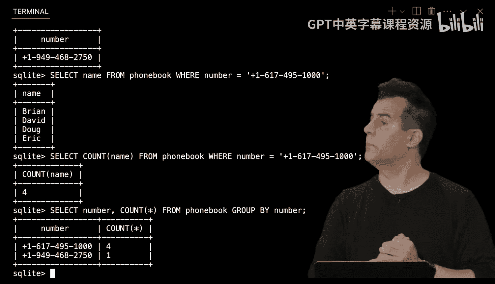
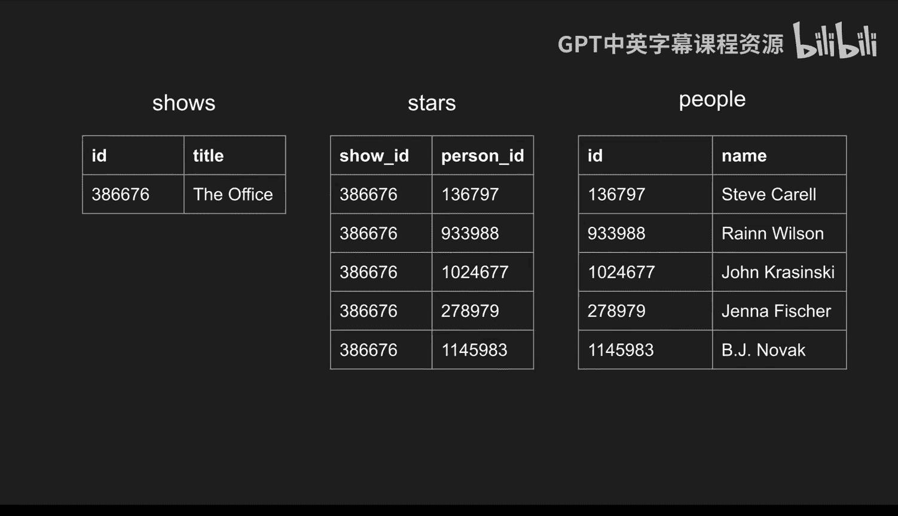
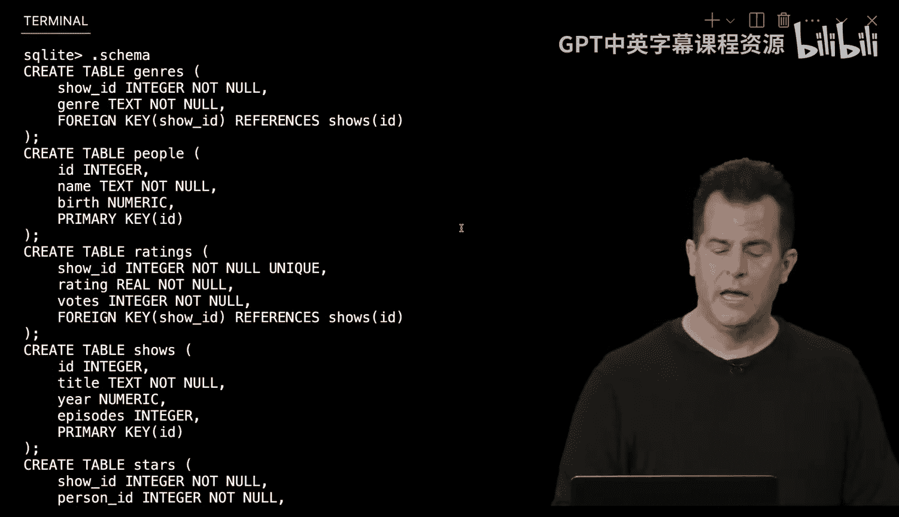
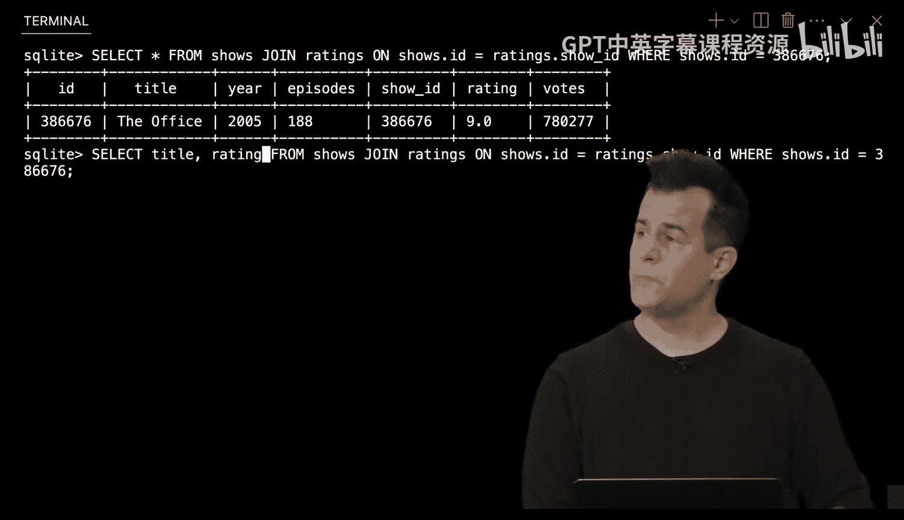
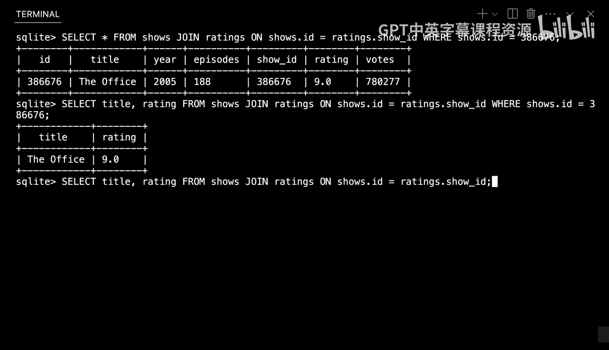
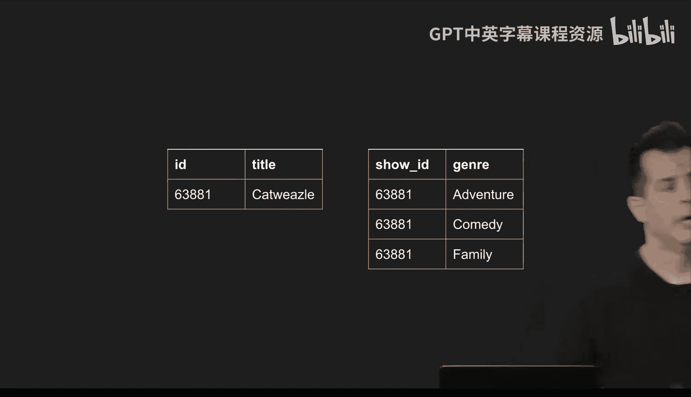
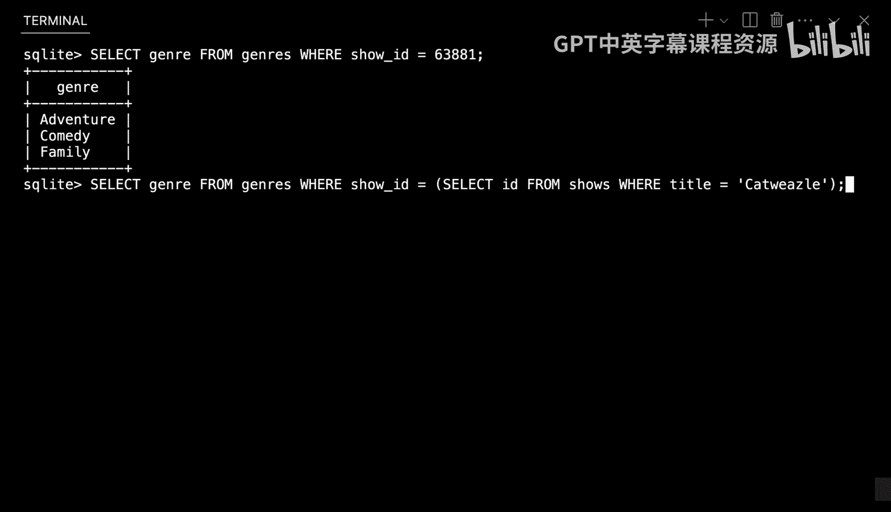
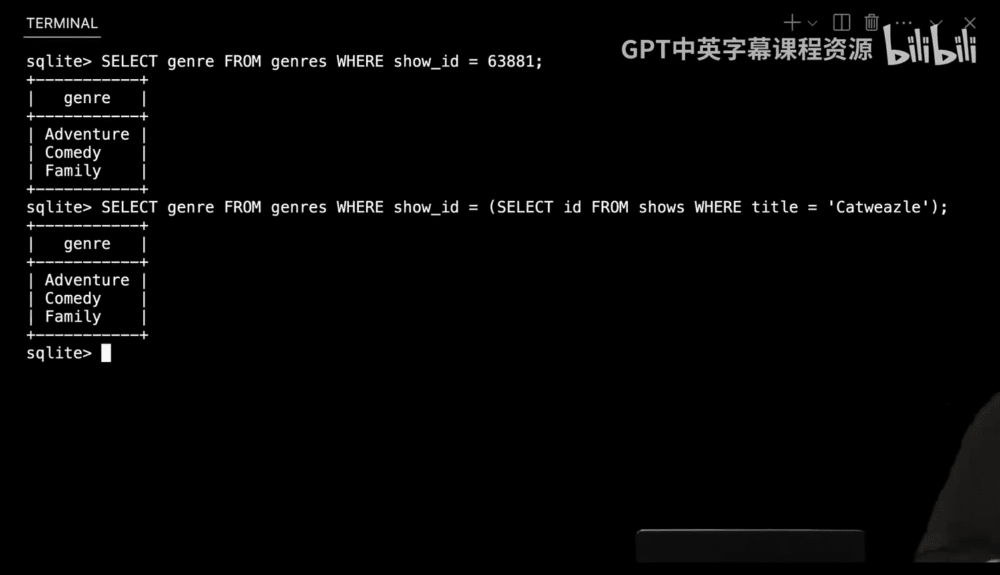
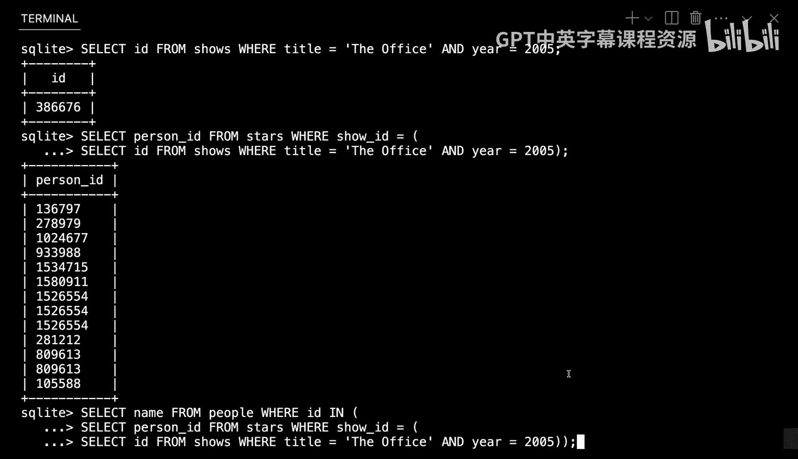
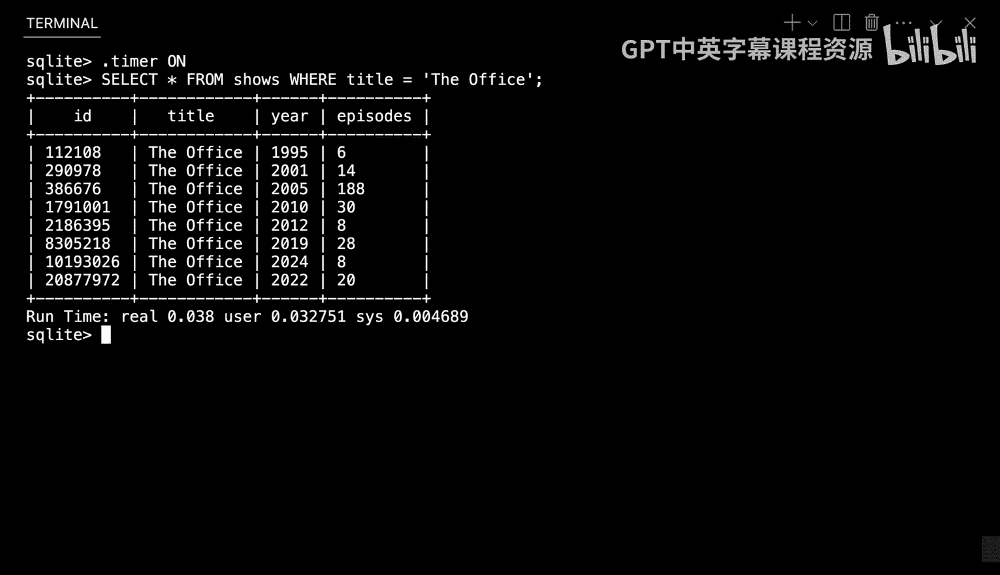

# CS50 Business：第7讲：部署数据库 🗄️


在本节课中，我们将学习如何部署数据库，特别是当我们需要大规模存储大量数据时。我们将从最简单的数据存储方式开始，逐步过渡到功能强大的关系型数据库，并学习如何使用SQL语言来高效地管理和查询数据。


## 什么是数据？ 📊


数据本质上就是信息。这些信息可以是文本形式的，也可以是二进制形式的，比如文件。数据库则是计算机系统中以某种方式组织起来的数据集合。

在数据领域，你可能会听到其他一些术语：
*   **数据仓库**：本质上是数据库的数据库，是你所有数据的集合。
*   **数据集市**：是你数据的子集，例如可能只是你的营销数据库或财务数据库。
*   **数据湖**：本质上是一个混乱的数据集合，你可能将所有文本数据、PDF、文件等倾倒其中，通常打算稍后再进行清理。


今天，我们将主要关注如何在数据库中组织我们的数据。

## 从平面文件到关系型数据库

数据库实际上是在计算机上运行的一个软件。人们常常将数据库与物理服务器混为一谈，但数据库可以只是服务器上运行的众多程序之一。不过，当你开始拥有大量数据时，该服务器往往会专门用于提供数据库服务。

### 平面文件数据库

存储数据最简单的方式之一是使用所谓的**平面文件数据库**。这可能只是一个文本文件，里面存放了你所有的数据。这些数据可能以某种方式结构化，例如，你可以将其存储在行和列中。


一种非常常见的平面文件数据库格式是**CSV文件**。CSV代表“逗号分隔值”，即你使用逗号来分隔一行内的各个数据片段，而每一行则由换行符实现。


以下是CSV文件的一个示例，它存储了姓名和电话号码：

```
name,number
Brian,+1-617-495-1000
David,+1-617-495-1000
Doug,+1-617-495-1000
Eric,+1-617-495-1000
John,+1-949-468-2750
```

第一行是**标题行**，它指示了每一列的含义。下面的行则是实际的数据。

然而，CSV文件的问题是它没有内置的功能。如果我们想通过代码打开这个文件，我们可以使用Python等语言读取它，但如果我们想查找特定信息（例如查找David的电话号码），我们必须编写代码来遍历整个文件。此外，如果我们想修改、添加或删除数据，这通常是一个相当手动的过程。

### 关系型数据库的优势


相比之下，**关系型数据库**不仅为我们存储数据，还提供核心功能。更重要的是，它允许我们以不同的方式关联数据集内的数据。


考虑一个简单的例子：一个包含学校和所在城市的数据集。


| 学校 | 城市 |
| :--- | :--- |
| 哈佛大学 | 剑桥 |
| 麻省理工学院 | 剑桥 |
| 牛津大学 | 牛津 |


这里存在两个问题：
1.  **冗余**：哈佛大学和麻省理工学院都在剑桥市，但“剑桥”这个词被存储了两次。
2.  **歧义**：如果我们添加另一所学校“剑桥大学”，它位于英国的剑桥市，那么仅凭“剑桥”这个词就无法区分两个不同的城市。


为了解决这些问题，我们可以将数据分解成多个表，并使用**唯一标识符**来建立关联。

首先，我们创建一个城市表，并为每个城市分配一个唯一的ID：


| ID | 城市 |
| :--- | :--- |
| 1 | 剑桥（美国） |
| 2 | 牛津 |
| 3 | 剑桥（英国） |


然后，我们创建一个学校表，其中包含一个`city_id`列，用于引用城市表中的ID：


| ID | 学校 | city_id |
| :--- | :--- | :--- |
| 1 | 哈佛大学 | 1 |
| 2 | 麻省理工学院 | 1 |
| 3 | 牛津大学 | 2 |
| 4 | 剑桥大学 | 3 |


通过这种方式，我们消除了冗余（“剑桥”只存储一次），并通过不同的ID消除了歧义。这就是“关系”的体现：我们使用这些唯一标识符将一些数据与其他数据关联起来。


当然，现在数据看起来不那么直观了。但关系型数据库的强大之处在于，它提供了内置的功能，允许我们轻松地查询和组合这些数据，从而得到我们想要的答案。

## 结构化查询语言


为了与关系型数据库交互，我们使用一种称为**SQL**的编程语言。SQL代表“结构化查询语言”。它允许我们通过代码自动化读取和写入数据的过程。


SQL主要支持四种基本操作，通常用缩写**CRUD**来概括：
*   **C** - **Create**：创建数据（例如 `INSERT`）。
*   **R** - **Read**：读取数据（例如 `SELECT`）。
*   **U** - **Update**：更新数据（例如 `UPDATE`）。
*   **D** - **Delete**：删除数据（例如 `DELETE`）。


SQL是一种**声明式语言**。与Python或JavaScript这样的过程式语言不同，在SQL中，你只需声明你想要什么数据，而不必详细说明如何一步步获取它。你不需要过多考虑循环、变量或条件，而是可以用更接近英语的方式来表达你的查询。




### 创建表和导入数据


让我们实际操作一下。我们将使用一个轻量级的SQL版本，称为**SQLite**。首先，我们创建一个数据库文件并导入之前的电话簿CSV数据。


在终端中，我们可以执行以下命令：
```bash
sqlite3 phonebook.db
.mode csv
.import phonebook.csv phonebook
.quit
```


然后，重新打开数据库并查看其结构（模式）：
```bash
sqlite3 phonebook.db
.schema
```


`.schema` 命令会显示数据库中所有表的创建语句。对于我们的 `phonebook` 表，它可能看起来像这样：
```sql
CREATE TABLE phonebook(
    name TEXT,
    number TEXT
);
```

这告诉我们，`phonebook` 表有两列：`name`（文本类型）和 `number`（文本类型）。


### 查询数据

现在，让我们学习如何使用 `SELECT` 语句来查询数据。


**基本查询：**
要查看表中的所有数据，可以使用 `*` 通配符：
```sql
SELECT * FROM phonebook;
```

**选择特定列：**
如果你只关心姓名：
```sql
SELECT name FROM phonebook;
```



**使用函数：**
SQL提供了许多内置函数。例如，要计算表中的行数：
```sql
SELECT COUNT(*) FROM phonebook;
```


要查找不同的（唯一的）电话号码：
```sql
SELECT DISTINCT number FROM phonebook;
```


**使用 WHERE 子句过滤：**
要查找特定人的电话号码（例如John）：
```sql
SELECT number FROM phonebook WHERE name = 'John';
```

要查找所有共享某个电话号码的人：
```sql
SELECT name FROM phonebook WHERE number = '+1-617-495-1000';
```




**分组和聚合：**
要查看每个电话号码出现了多少次：
```sql
SELECT number, COUNT(*) FROM phonebook GROUP BY number;
```


### 修改数据


**删除数据：**
要从电话簿中删除David的记录：
```sql
DELETE FROM phonebook WHERE name = 'David';
```


**插入数据：**
要将David添加回电话簿（但暂时不填号码）：
```sql
INSERT INTO phonebook (name) VALUES ('David');
```
注意，我们没有为 `number` 列提供值，所以它将是 `NULL`（一个特殊的标记值，表示缺失或未定义）。


**更新数据：**
要为David更新电话号码：
```sql
UPDATE phonebook SET number = '+1-617-495-1000' WHERE name = 'David';
```


**排序数据：**
要按姓名字母顺序查看电话簿：
```sql
SELECT * FROM phonebook ORDER BY name ASC; -- ASC 表示升序（默认）
```
要按降序排列：
```sql
SELECT * FROM phonebook ORDER BY name DESC; -- DESC 表示降序
```


## 探索真实世界的数据集：IMDB


现在，让我们转向一个更真实、更复杂的数据集：来自互联网电影数据库的部分数据。这个数据库包含关于演员、电视节目、电影等的大量信息。




### 数据库模式与关系






IMDB数据库被设计成多个相互关联的表。让我们先了解其中几个表：


1.  **shows 表**：存储电视节目信息。
    *   `id`：节目的唯一标识符（主键）。
    *   `title`：节目名称。
    *   `year`：首播年份。
    *   `episodes`：总集数。

2.  **ratings 表**：存储节目评分。
    *   `show_id`：对应节目的ID（外键，引用 `shows.id`）。
    *   `rating`：评分（实数）。
    *   `votes`：投票数。






3.  **people 表**：存储人物信息。
    *   `id`：人物的唯一标识符（主键）。
    *   `name`：人物姓名。
    *   `birth`：出生年份。

4.  **stars 表**：这是一个**联结表**，用于建立节目和人物之间的关联（多对多关系）。
    *   `show_id`：节目ID（外键，引用 `shows.id`）。
    *   `person_id`：人物ID（外键，引用 `people.id`）。


5.  **genres 表**：存储节目类型（一对多关系）。
    *   `show_id`：节目ID（外键）。
    *   `genre`：类型名称。


### 表之间的关系


*   **一对一关系**：例如，`shows` 表和 `ratings` 表。每个节目对应一个评分记录。
*   **一对多关系**：例如，`shows` 表和 `genres` 表。一个节目可以属于多个类型。
*   **多对多关系**：例如，`shows` 表和 `people` 表（通过 `stars` 表）。一个节目有多位明星，一位明星也可以出演多个节目。


### 使用 JOIN 连接表

`JOIN` 是SQL中一个强大的操作，它允许我们将多个表中的数据组合在一起。

**示例：获取节目的评分**
假设我们想知道《办公室》（美国版，2005年）的评分。我们首先需要找到它的ID，然后连接 `shows` 和 `ratings` 表。
```sql
SELECT title, rating
FROM shows
JOIN ratings ON shows.id = ratings.show_id
WHERE title = 'The Office' AND year = 2005;
```

**示例：获取节目的所有类型**
对于节目《猫鼬》（Catweasel），我们可以使用嵌套查询：
```sql
SELECT genre FROM genres
WHERE show_id = (
    SELECT id FROM shows WHERE title = 'Catweasel'
);
```
或者使用 `JOIN`：
```sql
SELECT genre
FROM shows
JOIN genres ON shows.id = genres.show_id
WHERE title = 'Catweasel';
```



**示例：获取节目的所有明星（多对多查询）**
要找出《办公室》（2005）的所有明星，我们需要连接三个表：
```sql
SELECT people.name
FROM shows
JOIN stars ON shows.id = stars.show_id
JOIN people ON stars.person_id = people.id
WHERE shows.title = 'The Office' AND shows.year = 2005;
```


### 使用索引优化查询

随着数据量的增长，查询速度可能会变慢。**索引**是一种优化技术，它通过在内存中创建特殊的数据结构（如B树）来加速对特定列的搜索。

例如，如果我们经常根据节目名称进行搜索，可以为 `shows` 表的 `title` 列创建索引：
```sql
CREATE INDEX title_index ON shows (title);
```
创建索引可能需要一些时间，但之后对 `title` 列的查询（如 `WHERE title = '...'`）会快得多。


索引的权衡是：它们会占用额外的存储空间，并且可能会减慢数据的插入、更新和删除速度。因此，通常只为最常查询的列创建索引。


## 数据库的挑战与风险


### 竞态条件



当多个操作（例如，两个用户同时“喜欢”同一个帖子）试图同时修改同一数据时，可能会发生**竞态条件**。


**问题场景：**
1.  服务器A读取帖子当前的喜欢数：50。
2.  同时，服务器B也读取喜欢数：50。
3.  服务器A计算新值 = 50 + 1 = 51，并更新数据库为51。
4.  服务器B计算新值 = 50 + 1 = 51，并更新数据库为51。
结果：喜欢数应该是52，但最终却是51。


**解决方案：事务**
使用**事务**可以将一系列操作包装成一个原子单元。在事务开始（`BEGIN`）和提交（`COMMIT`）之间，数据库会锁定相关数据，防止其他操作干扰。如果出现问题，可以回滚（`ROLLBACK`）所有更改。
```sql
BEGIN TRANSACTION;
-- 执行一系列SQL命令
COMMIT;
```

### SQL注入攻击

**SQL注入**是一种安全漏洞，攻击者通过在用户输入中注入恶意SQL代码，来操纵后端数据库查询。

**漏洞示例：**
假设一个登录表单的后端代码是这样的：
```python
# 伪代码，危险！
query = f"SELECT * FROM users WHERE username = '{username}' AND password = '{password}'"
```
如果攻击者在用户名输入框中输入：`malan@harvard.edu'--`
那么生成的SQL语句将是：
```sql
SELECT * FROM users WHERE username = 'malan@harvard.edu'--' AND password = '...'
```
`--` 在SQL中是注释符号，这意味着密码检查被完全忽略，攻击者可能无需密码即可登录。

**解决方案：参数化查询**
永远不要信任用户输入。应该使用参数化查询（或预处理语句），让数据库库负责安全地处理输入。
```python
# 伪代码，安全！
query = "SELECT * FROM users WHERE username = ? AND password = ?"
# 然后使用库函数将 username 和 password 安全地绑定到 ? 占位符上
```

## NoSQL：另一种选择

除了关系型数据库，还有一类称为 **NoSQL** 的数据库。NoSQL通常代表“Not Only SQL”。它们不依赖于固定的表和行/列结构，而是使用更灵活的格式，如文档（例如JSON）。

**示例（文档数据库中的一条记录）：**
```json
{
  "_id": 386676,
  "title": "The Office",
  "stars": [
    {"id": 136797, "name": "Steve Carell"},
    {"id": 59270, "name": "Rainn Wilson"}
  ]
}
```
**优点：** 相关数据存储在一起，查询可能更简单直接。
**缺点：** 可能缺乏关系型数据库的严格约束（如外键引用完整性）、事务支持，并且可能导致数据冗余。

## 总结 🎯


在本节课中，我们一起学习了如何部署和管理数据库。我们从最简单的平面文件（如CSV）开始，探讨了其局限性，然后引入了功能强大的关系型数据库。

我们深入学习了SQL语言，掌握了如何使用 `SELECT`、`INSERT`、`UPDATE` 和 `DELETE` 等命令来查询和操作数据。我们通过IMDB示例数据库，理解了表之间的关系（一对一、一对多、多对多），并学会了使用 `JOIN` 操作来组合这些数据。

我们还讨论了数据库性能优化的重要工具——索引，以及数据库应用中常见的挑战，如竞态条件（通过事务解决）和安全漏洞SQL注入（通过参数化查询防范）。最后，我们简要了解了NoSQL作为关系型数据库的替代方案。


无论是使用SQLite、MySQL、PostgreSQL还是其他关系型数据库，掌握这些核心概念都将帮助你构建能够高效、安全地处理大规模数据的应用程序。