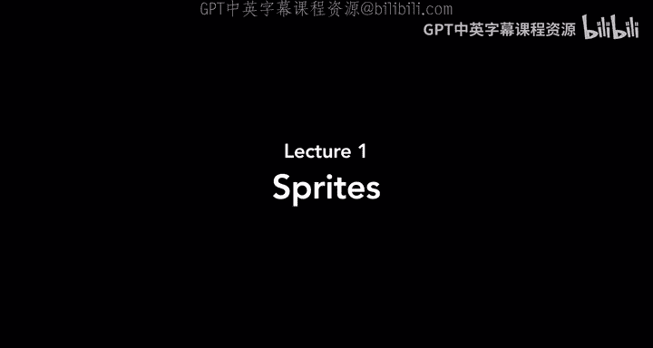
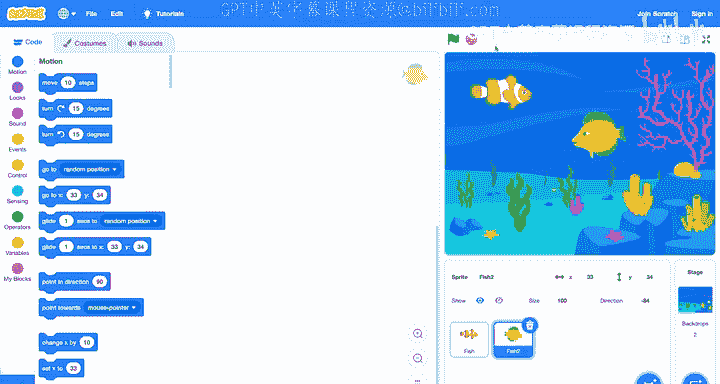

# Scratch 编程入门：第1讲：精灵与舞台 🐱

在本节课中，我们将学习 Scratch 编程的基础知识。Scratch 是由麻省理工学院媒体实验室开发的一款可视化积木式编程语言。通过将不同的 Scratch 积木块组合在一起，你将能够创建视觉故事、动画、游戏以及其他可以与他人分享的程序。在学习 Scratch 的过程中，你将接触到编程的基本概念，例如函数、循环、条件和变量等。尽管 Scratch 的编程语言看起来与其他文本编程语言不同，但它基于相同的计算思维原理。

## 探索 Scratch 界面

上一节我们介绍了 Scratch 的基本概念，本节中我们来看看 Scratch 的界面。

当你访问 Scratch 网站并点击“创建”按钮来新建一个项目时，你会看到一个类似这样的界面。这个界面主要分为几个部分。

*   左侧是**积木库**。你将通过按特定顺序组合积木块来构建 Scratch 项目，以实现你期望的功能。
*   中间部分是**积木编辑器**。你将在这里把积木块组合起来，决定你的项目如何运行。

在开始使用积木块之前，我们今天将主要关注 Scratch 窗口的这个部分。

这个矩形区域就是 Scratch 所称的**舞台**。我们的 Scratch 项目将在这个舞台上运行。当有人运行你的 Scratch 项目时，他们最终看到的就是这个舞台。

## 认识精灵

在 Scratch 舞台上，我们目前只有一个角色，即默认的 Scratch 小猫。Scratch 将每个这样的角色或对象称为一个**精灵**。精灵可以是像动物这样的角色，也可以是舞台上存在的其他物体。我们将学习如何编程控制这些精灵，让它们执行我们想要的动作。

在舞台下方，我们可以看到当前项目中所有精灵的列表。目前，只有一个默认的小猫，它被称为“精灵1”。随着课程的深入，我们将探索界面的其他部分。现在，让我们从探索舞台和舞台上的精灵开始，看看如何操作它们。

## 精灵的位置与坐标

我们的默认 Scratch 小猫目前位于舞台的中心。我可以点击并拖动它，将其移动到屏幕的任意角落。

当你移动小猫时，会注意到舞台下方有几个数值在变化：**X 值**和 **Y 值**。例如，X 值是 177，Y 值是 42。如果我将小猫移动到别处，X 值可能变为 -156，Y 值变为 -77。

Scratch 中的精灵存在于舞台上，并且位于一个特定的位置，这个位置由一个 **XY 坐标网格**来组织。

*   **X 值**代表精灵在舞台上左右移动的距离。
*   **Y 值**代表精灵在舞台上上下移动的距离。

舞台的绝对中心点是 **(0, 0)**。如果 X 等于 0，Y 等于 0，那么精灵将正好位于舞台中央。

*   增加 X 值（使其为正数），精灵会向右移动。
*   减小 X 值（使其为负数），精灵会向左移动。
*   增加 Y 值，精灵会向上移动。
*   减小 Y 值，精灵会向下移动。

我们不仅会在这个界面中看到 X 和 Y 值，稍后当我们开始用积木块编程时，也会用到它们来控制精灵的位置。

如果我想将精灵精确地移动到舞台中心，可以将其拖到大致中心的位置，或者更精确地，直接在 X 和 Y 输入框中分别输入 **0**。

## 精灵的基本属性控制

除了改变精灵的位置，我们还可以在界面的这个区域控制精灵的其他属性。

*   **命名精灵**：我可以给精灵起一个名字。目前，我的精灵叫“精灵1”，这是 Scratch 给新创建精灵的默认名称。我可以将其重命名为“小猫”。重命名后，下方精灵列表中的标签也会相应更新。随着项目中精灵数量的增加，通过名称来区分它们会很有帮助。
*   **显示/隐藏精灵**：我有一个开关可以决定精灵是否显示在舞台上。目前小猫是显示的，但我可以点击这个按钮将其隐藏。如果想再次显示，可以点击“显示”。
*   **控制精灵大小**：这个控件控制精灵的大小。目前大小是 100，表示是正常大小的 100%。如果想让精灵变小一半，可以将大小改为 50。如果想让它变大，可以改为 200。稍后我们将看到如何通过积木块来改变大小。
*   **控制精灵方向**：方向控件控制精灵的朝向。目前是 90 度，意味着小猫面向右边。我可以旋转这个拨盘来改变方向，数值会以度数显示。例如，现在指向 39 度角。我可以将其改回 90 度，让小猫再次面向右边。

使用这个编辑器，我可以控制精灵的许多方面：名称、位置、大小、朝向以及是否显示。但要让我们的程序更有趣，我们不仅仅需要一只猫。

## 添加新精灵

现在，让我们尝试创建一个新精灵。

在编辑器底部，所有精灵所在的区域，有一个加号按钮。这是“创建新精灵”按钮。我有几种创建方式，但如果我点击这个主要的圆形按钮“选择一个精灵”，我会得到一个可以创建的各种精灵的完整列表，包括动物、人物、运动相关或食物相关的精灵等等。

我可以浏览这个列表，找到我想要的。假设我想添加一个动物，比如除了猫以外的另一种动物。我可以在顶部按类别筛选，或者如果我确切知道要找什么，也可以搜索。

我选择“动物”类别，看看有哪些不同的动物。我喜欢鱼，所以选择鱼并将其添加到我的舞台上。

添加后，会发生几件事：
1.  在底部跟踪项目所有精灵的区域，我现在有两个精灵：猫和鱼。
2.  两者都出现在 Scratch 程序的主舞台区域。
3.  我可以移动它们，使它们不重叠。

现在，我有一只猫和一条鱼。在底部被蓝色高亮选中的精灵，是我当前正在操作的精灵，我可以为其添加代码或操作其位置、大小等属性。

例如，这条鱼目前位于 X=73，Y=70。如果我点击底部的猫，就切换到了猫，现在看到的是猫的位置、名称、大小和方向。

利用这个功能，我们可以为 Scratch 项目添加新角色和新物体。如果我们想要多个相同的角色，甚至可以复制一个精灵。

假设我想要两条鱼。我可以点击鱼，然后右键点击或按住 Control 键点击，会弹出一个菜单，选择“复制”。现在我就有了第二条鱼，默认名为“鱼2”。我可以将它们分开放在舞台上。

现在我开始构建这个场景。这就是为什么你可以使用 Scratch 来讲述故事、创建动画或艺术作品——只需决定你希望舞台上存在什么，然后将它们添加进去。

## 精灵的造型

你可能会注意到，因为我复制了鱼，所以两条鱼看起来一模一样。它们指向相同的方向。我可以改变其中一条鱼的方向或大小，使其看起来与另一条不同。

但我真正想做的是改变它的整体外观，让舞台上有两条不同的鱼，而不是看起来相同的两个副本。

这就引入了 Scratch 中的另一个概念：**造型**。每个精灵都可以拥有不同的造型。造型决定了精灵的外观。

让我们探索如何改变其中一条鱼的造型。

在 Scratch 窗口顶部，你会注意到几个标签页。默认选中的是“代码”标签页。虽然我们还没有为项目添加任何代码，但最终当你开始构建更复杂的项目时，你将使用这个标签页，将代码积木拖入代码编辑器，来决定你的 Scratch 精灵要做什么。

我们现在感兴趣的是第二个标签页，叫做“造型”标签页。它允许我们查看、编辑和修改任何给定精灵的造型。

让我们选择其中一条鱼（比如鱼2），然后点击顶部的“造型”标签页。

你会看到，默认情况下，这条鱼有四个不同的造型：鱼-a、鱼-b、鱼-c 和鱼-d。目前鱼-a 被选中，但我可以通过点击不同的造型来改变它。例如，点击鱼-b，现在选中的造型就变了，舞台上鱼的外观也立即改变了。即使它是同一条鱼，视觉上看起来也不同了，因为我们改变了它的造型。

我可以尝试再次改变，看看鱼-c 和鱼-d。你可以尝试查看任何给定精灵默认内置了哪些造型，并按需更改。

猫也有不同的造型，虽然看起来差异不大。你会注意到猫有两种造型，只是腿部姿势不同。在造型1中，腿是直的；在造型2中，腿是弯曲的。如果我在这两个造型之间切换，仔细观察，几乎就像猫在走路一样。这就是为什么我们有两种不同的造型，以便在需要时营造行走的外观。

但让我们回到鱼，它有四个我可以选择的造型，每个看起来都很不同。而且我不局限于这四个。如果我想创建额外的造型，我也可以做到。

在造型编辑器底部，所有造型下方，有另一个加号按钮，很像我们之前看到的创建新精灵的按钮。但这次，这是“创建新造型”按钮。我有几个选择：
*   我可以在 Scratch 自己的造型库中搜索我想要的造型。
*   我也可以**绘制一个新造型**。如果你有艺术感，想创建自己的造型，可以尝试绘制。例如，我可以绘制自己的鱼。这里有许多工具可以使用，比如画笔工具，让我可以为鱼绘制新造型，我还可以选择颜色。
*   我也可以**修改现有的造型**。使用相同的造型编辑器，如果我想用不同颜色填充鱼的一部分，比如加点绿色，我可以调整这些拨盘选择我喜欢的颜色，然后使用填充工具填充鱼的部分区域。
*   你甚至有能力**上传一个造型**。如果你电脑上有想用作 Scratch 程序中造型的照片或图像，可以上传它，或者如果你的电脑有摄像头，甚至可以拍照来添加为造型。

在这个造型编辑器中，你拥有很大的创作自由。你可以通过自己绘制来创建全新的造型，也可以对现有造型进行添加绘制或用不同颜色填充。

## 精灵的声音

除了改变精灵的外观，我们还可以为精灵添加可以播放的声音。

在顶部，你已经注意到我们有“代码”和“造型”标签页。还有一个“声音”标签页，用于管理与每个精灵相关的声音。

稍后，我们将看到如何将这些声音作为项目的一部分。目前，Scratch 中鱼默认有两种声音：一种是“气泡”声，我可以播放它；另一种是“海浪”声。这些是鱼内置的声音。

稍后，当我们用它构建故事时，可能在某些时候会想播放这些声音。在课程后面，我们将看到如何做到这一点。不同的精灵默认内置了不同的声音。例如，猫默认有一种声音，就是“喵”声。

如果我愿意，我可以通过**录制**自己的声音来添加更多声音，或者**上传**声音文件，比如你想为项目添加的音乐或音效。

## 设置舞台背景

现在让我们回到“代码”标签页，我们稍后会再看它。现在我们有了舞台，舞台上有猫和两条鱼。但目前我的项目有点单调的是背景——只是一个空白的白色背景。我也想让它更有创意一些。

我们一直称之为舞台的这个背景，是精灵们生活的地方。每个舞台都可以有**背景**。背景决定了出现在所有精灵后面的图像。默认情况下，当你首次创建 Scratch 项目时，背景是纯白色的，但我们可以改变它。

在右下角，我们看到舞台，我可以通过点击右下角的这个按钮来为我的项目选择一个背景。

如果我点击“选择一个背景”，会看到有各种各样不同环境的背景可供选择。例如，有冬季场景、室内场景、室外城市场景等。这个看起来不错，是一个水下场景。也许可以用它，因为我的舞台上有几条鱼。所以我会选择那个背景，它默认叫“水下1”。

点击“水下1”后，背景立即改变。现在我的两条鱼就生活在这个水下场景中了。

与造型或声音类似，如果我拥有自己的图像或想绘制自己的图像作为 Scratch 项目的背景，我当然也可以这样做。

## 调整精灵与删除精灵

此时，猫开始显得有些格格不入。我正在设计一个水下场景，有两条不同的鱼，猫可能不属于这里。如果我想移除一个精灵，可以这样做：点击猫（因为这是我当前正在编辑的精灵），在选中精灵旁边会出现一个小垃圾桶图标。如果我不想要猫了，只需按下那个垃圾桶图标，猫就会被移除。

现在，我有一个场景，里面有两条鱼在水中游动。我还可以改变场景，比如我想把这条黄绿色的鱼翻转过来，让它面向另一个方向，这样一条鱼向右游，一条鱼向左游。

我该怎么做呢？对于每条鱼，记得我们有一个方向控件。如果我想让一条鱼面向左边，我可以旋转、旋转、旋转，让它面向左边，比如大约 -88 或 -90 度。但这并不完美，因为你可能注意到鱼现在倒过来了。

通常，使用这个方向控件时，它只是按照我指定的方向旋转精灵。这意味着，如果它开始时面向右边，我将其旋转 180 度完全面向另一边，它就会倒过来。这可能不是我想要的。

但 Scratch 有办法解决这个问题。每个精灵可以有几种不同的**旋转样式**。默认情况下，它使用这种“任意旋转”样式，可以面向我们想要的任何方向，全方位旋转。但还有第二种样式，叫做“左右翻转”。这只允许精灵面向两个方向之一：要么向右看，要么向左看。

如果我将旋转样式改为“左右翻转”（点击中间那个有向右和向左箭头的按钮），现在当我旋转一点时，什么也不会发生，因为它只会面向右或面向左。但如果我将其完全旋转到另一边，现在精灵就面向另一个方向了。

这样，我就可以得到一个向右看的精灵和一个向左看的精灵。

## 保存与分享项目

我喜欢这个场景。如果我想全屏查看，右上角有一个全屏图标，点击那个按钮，我就可以全屏看到我的舞台，看看它最终会是什么样子，这很不错。

现在，我有了我的第一个 Scratch 项目。我还没有添加任何代码，但我添加了一些精灵（场景中的角色），还添加了一个不同的背景。

如果我想保存这个项目，以确保可以保留它并在以后使用，我有几个选择：
1.  在“文件”菜单中，我可以**将项目保存到我的电脑**，这会将项目下载到我的电脑。以后如果想再次打开，可以点击“从电脑中上传”来加载那个文件。
2.  如果你还没有 Scratch 账户，可以点击“加入 Scratch”按钮创建一个，然后登录。登录后，你将能够**将项目保存到 Scratch 自己的网站**上。一旦你这样做，如果你愿意，你可以与世界分享你的项目，发送给朋友和家人，让其他使用 Scratch 的人也有机会看到你的项目并尝试它。

## 总结与展望

本节课中我们一起学习了如何创建精灵并将它们放到舞台上。我们可以为想要在 Scratch 中创建的故事、动画、游戏或其他程序创建任何我们想要的环境。

但目前，这些精灵并没有真正做任何事情。舞台始终保持不变，鱼也始终一样。我们接下来要学习的是**编程**：如何编写代码。具体来说，通过使用这些积木块，并将它们组合成执行各种不同活动和任务的积木堆栈，我们将为这些精灵、背景和舞台编程，让它们按照我们的意愿行事，从而创建出更具互动性的故事、游戏和动画。

我们将在下次课程中探索这些内容。今天对 Scratch 的介绍就到这里。下次，我们将看看如何利用这个舞台，并开始为其编程。