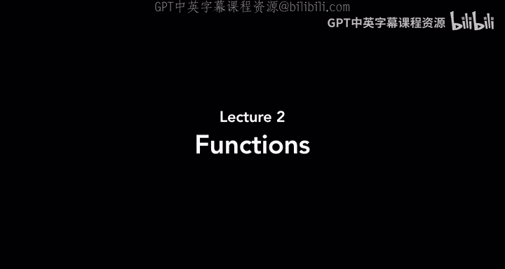
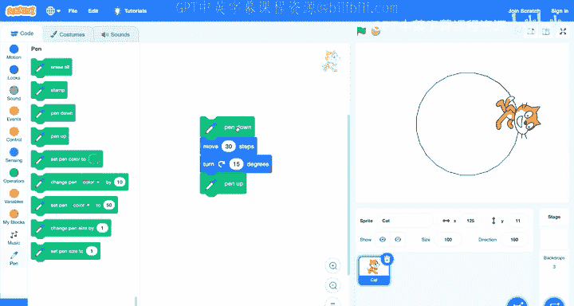

# 002：函数

在本节课中，我们将学习如何通过组合代码块来编写程序，让Scratch项目动起来。我们将探索运动、外观、声音等不同类型的代码块，并了解如何通过“函数”来控制角色。

---

## 从手动操作到编程

上一节我们介绍了Scratch的世界，包括舞台、角色、造型和背景。但之前的所有操作都需要我们手动完成。例如，要移动角色，我们必须手动更改其X和Y坐标。

本节我们将开始为Scratch项目**编程**，通过添加代码块，让程序自动运行并操控项目中的事件。

让我们打开一个新的空白Scratch项目来开始学习。

## 认识代码块与函数

在Scratch窗口的左侧，您会看到许多不同颜色的代码块。每个代码块都能在舞台中执行某个任务或动作。在Scratch中，我们将这些代码块称为**函数**。

一个函数就是一个执行特定任务的代码块。

例如，第一个蓝色代码块是 **`移动 10 步`**。顾名思义，它的作用是让角色移动10步。

要使用一个代码块，您需要将其从左侧的代码库中拖拽到中间的代码编辑区。现在，将 **`移动 10 步`** 块拖到编辑区。

点击这个代码块，您会看到小猫向右移动了10步。同时，角色坐标从 (0, 0) 变成了 (10, 0)。

在这个代码块中，数字“10”所在的位置是一个**输入**。函数可以接收输入，这些输入信息决定了函数的具体行为。对于 **`移动`** 函数，输入的数字代表移动的步数。

您可以更改这个输入。例如，将其改为30，角色每次就会移动30步。如果输入负数，比如-20，角色则会向反方向移动。

## 组合多个代码块

通常，一个程序不会只有一条指令，而是由一系列指令按顺序组成。在Scratch中，我们可以将多个代码块组合在一起。

让我们再拖出一个 **`右转 15 度`** 的代码块。现在编辑区有两个独立的代码块。

您可以将它们连接起来。将 **`右转 15 度`** 块拖近 **`移动 30 步`** 块，当它们高亮时松开鼠标，两个块就会“咔哒”一声连接在一起。

这样形成的代码块堆栈，我们称之为一个**脚本**。当您点击这个脚本时，代码会从上到下依次执行：先移动30步，然后右转15度。

多次点击这个组合脚本，您会看到小猫在舞台上画出一个圆形轨迹。

通过以不同的顺序组合各种代码块，我们可以创建出更有趣的程序。

## 探索更多运动块

Scratch的代码块按类别和颜色组织。蓝色的代码块都属于**运动**类别，用于控制角色的移动。

例如，有一个 **`移到随机位置`** 的代码块。每次点击它，角色都会瞬移到舞台的一个随机位置。

如果您想删除一个不需要的代码块，有两种方法：
1.  右键点击该代码块，选择“删除”。
2.  直接将代码块拖回左侧的代码库区域。

## 实践：让角色走矩形

现在，让我们尝试创建一个程序，让一个角色在舞台上走一个矩形。

首先，我们换一个角色。删除默认的小猫，在动物类别中选择“刺猬”。

我们希望刺猬从舞台左上角开始移动。我们可以使用 **`移到 x: y:`** 代码块，并输入坐标 (-180, 120) 来将其定位到左上角。

接下来，我们计划让它依次走到右上角、右下角和左下角，完成一个矩形。我们可能会尝试连续使用多个 **`移到`** 代码块。

但是，当我们点击这个脚本时，刺猬直接跳到了最后一个位置（左下角），中间的移动过程完全看不到。

这是因为计算机运行程序的速度极快，它瞬间执行了所有四条指令，我们人类的眼睛只能看到最终结果。

为了让移动过程可见，我们需要让程序“慢下来”。Scratch提供了 **`在 1 秒内滑行到 x: y:`** 代码块。这个函数需要三个输入：时间、目标X坐标和目标Y坐标。

我们将后面三个 **`移到`** 块替换为 **`滑行`** 块，并为每个移动设置1秒的持续时间。这样，刺猬就会花时间平滑地移动到每个角落。

最后，我们可以再添加一个滑行块，让刺猬回到起点，形成一个完整的矩形路径。

## 为代码添加注释

随着项目变得复杂，我们可能过段时间会忘记某些代码块的用途。Scratch允许您为代码添加**注释**，即简短的文字说明。

右键点击您的代码堆栈，选择“添加注释”。例如，您可以写上“这些代码块让角色沿矩形移动”。

注释不会影响程序运行，但它对您自己（作为日后提醒）或他人（帮助理解您的思路）都很有用。

## 外观类代码块

接下来，让我们看看**外观**类（紫色）的代码块。它们可以改变角色的外观和对话。

**`说 你好！`** 块会让角色显示一个包含文本“你好！”的对话气泡。

如果我们想让它先说“你好”，再说“再见”，可能会尝试将两个 **`说`** 块堆叠起来。但同样会遇到问题：程序运行太快，“你好”一闪而过，我们只能看到“再见”。

为了解决这个问题，我们需要使用 **`说 你好！ 2 秒`** 块。这个块会让对话气泡持续显示2秒，然后再执行下一个代码块。

外观块不仅能控制对话，还能控制角色的**造型**。例如，我们选择“熊”角色，它有两个造型：`bear-a`（四脚着地）和`bear-b`（站立）。

我们可以通过编程来切换造型。我们可以创建一个脚本：让熊从舞台左侧以`bear-a`造型开始，用 **`滑行`** 块移动到右侧，然后使用 **`换成 bear-b 造型`** 块让它站起来。

通过结合运动和外观块，我们可以开始用角色来讲述小故事。

## 结合背景讲故事

我们还可以通过切换**背景**来让故事更丰富。为舞台添加“森林”和“林间长椅”两个背景。

现在，构建一个故事脚本：
1.  开始时，使用 **`换成 森林 背景`**，并将熊放在舞台左侧。
2.  让熊用 **`滑行`** 块向右移动，仿佛走出舞台。
3.  当熊“走出”舞台后，使用 **`换成 林间长椅 背景`** 切换场景。
4.  立即将熊的X坐标设为舞台最左侧（如-300），让它“重新进入”新场景。
5.  最后，让熊滑行到舞台中央。

运行这个脚本，您会看到一个连贯的场景转换故事。

在外观类别中，还有其他有用的块，如 **`显示`**、**`隐藏`**（控制角色可见性），以及 **`将大小增加 10`**（改变角色大小）。

## 声音与控制块

**声音**类（粉色）代码块可以为角色添加音效。例如，**`播放声音 喵 直到播放完毕`** 块会播放选中的声音。

**控制**类（黄色）代码块用于管理程序流程。一个非常有用的块是 **`等待 1 秒`**，它可以让程序暂停指定的时间，然后再继续执行后续代码。

让我们创建一个有趣的小项目：让一只鸭子玩“躲猫猫”。
1.  添加“鸭子”角色，并将其移到舞台中央。
2.  组合以下代码块：
    *   **`隐藏`** （鸭子消失）
    *   **`等待 1 秒`**
    *   **`显示`** （鸭子出现）
    *   **`播放声音 鸭子 直到播放完毕`**
3.  点击运行，鸭子会先隐藏1秒，然后出现并发出叫声。

## 使用扩展：音乐与画笔

Scratch的**扩展**功能提供了额外的代码块类别。点击编辑器左下角的蓝色加号图标可以添加扩展。

**音乐扩展**允许您演奏音符。例如，**`弹奏音符 60 (0.25) 拍`** 块会弹奏一个音符。点击数字60，会出现一个钢琴键盘，您可以直接点击琴键来选择音符。通过堆叠多个不同音符的块，可以演奏出一段简单的旋律。您还可以使用 **`将乐器设为 吉他`** 或 **`将节奏设为 60`** 等块来改变音色和速度。

**画笔扩展**可以让角色在移动时画出线条。关键块是 **`落笔`** 和 **`抬笔`**。当“笔”落下时，移动角色就会画出轨迹；当“笔”抬起时，移动则不会画线。

结合之前让小猫画圆的运动代码（移动 + 旋转），并在开始前添加 **`落笔`**，在结束后添加 **`抬笔`**，同时使用 **`擦除全部`** 来清除之前的画迹，就可以让小猫画出一个圆形。

---

本节课中，我们一起学习了Scratch编程的核心概念——函数。我们探索了如何使用**运动**块控制角色移动，使用**外观**块改变造型、对话和背景，使用**声音**块添加音效，以及使用**控制**块管理程序节奏。我们还初步尝试了**扩展**功能，用音乐和画笔创作了更丰富的项目。

通过将这些代码块以不同的顺序组合起来，您已经可以创造出各种有趣的小程序。下次课，我们将学习如何利用这些基础，将Scratch项目做得更加强大和智能。下次见！😊