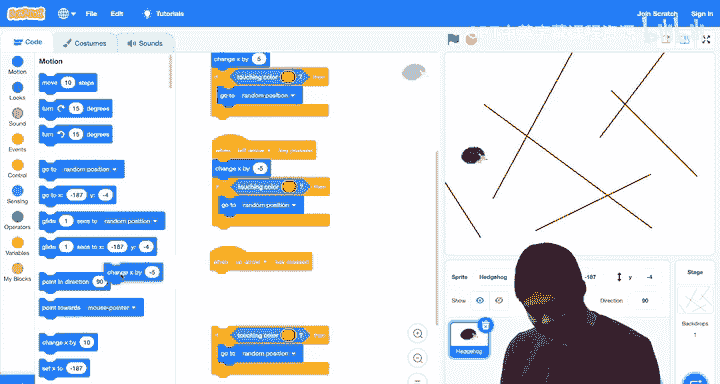

# Scratch编程入门：第5讲：条件语句

## 概述

在本节课中，我们将学习如何在Scratch程序中使用条件语句。条件语句允许我们的程序像人类和计算机一样，通过提问并根据答案做出决策。我们将探索如何询问“是/否”问题，并根据答案执行不同的代码块，从而让我们的项目变得更加智能和互动。

---

## 条件语句的基本概念

上一节我们介绍了如何在程序中存储和使用信息（值）。本节中，我们来看看如何利用这些信息来做出决策。

在现实生活中，我们经常通过提问来做决定。例如，出门前我们会问：“外面冷吗？”如果答案是“是”，我们就会穿上外套。计算机也做同样的事情，比如询问“电池电量低吗？”并根据答案决定是否进入省电模式。

在Scratch中，我们使用 **`如果`** 块来实现这种逻辑。这个块包含两个部分：
1.  一个**六边形**区域，用于放置要询问的问题。
2.  一个**内部空间**，用于放置当答案为“是”时要执行的代码块。

让我们通过一个例子来理解它。

---

## 第一个条件语句：检测触碰

我们将创建一个程序，当按下空格键时，如果小猫碰到了鼠标指针，它就会“喵喵”叫。

以下是实现步骤：
1.  从 **事件** 类别中拖出 `当按下空格键` 块。
2.  从 **控制** 类别中拖出 `如果` 块，并将其连接到事件块下方。
3.  从 **侦测** 类别中找到 `碰到鼠标指针？` 块。这是一个**布尔表达式**，它的答案只能是“是”（真）或“否”（假）。
4.  将这个六边形的布尔表达式块放入 `如果` 块的六边形区域中。
5.  从 **声音** 类别中拖出 `播放声音喵直到播放完毕` 块，并将其放入 `如果` 块的内部。

现在，完整的代码逻辑是：**当按下空格键时，检查小猫是否碰到鼠标指针。如果碰到了，就播放“喵”的声音。**

你可以测试一下：只有当鼠标指针放在小猫身上时按下空格键，才会听到叫声。

---

## 侦测其他精灵和颜色

`碰到鼠标指针？` 块不仅可以检测鼠标，还可以检测是否碰到其他精灵。

例如，你可以添加一个气球精灵，然后将条件改为 `碰到气球？`。这样，只有当小猫碰到气球时，按下空格键才会触发声音。

**侦测**类别中的其他块也很有用：
*   `碰到颜色？`：可以检测精灵是否碰到了某种特定颜色。
*   `到...的距离`：可以计算精灵与其他对象之间的距离。

让我们尝试用颜色侦测来制作一个互动场景。

### 示例：在雪地中寻找树木

1.  将背景切换为“Winter”。
2.  删除之前的代码，新建一个事件：`当按下右移键`。
3.  连接一个 `将x坐标增加10` 块，让小猫向右移动。
4.  添加一个 `如果` 块，在六边形区域放入 `碰到颜色？` 块。
5.  点击颜色方块，然后使用**吸管工具**在舞台的树木上选取绿色。
6.  在 `如果` 块内部，放入 `说“我找到一棵树！”` 块。

现在，当你按下右箭头键移动小猫时，一旦它碰到树木的绿色部分，就会说出那句话。这展示了如何让精灵感知其周围环境（如背景颜色）并做出反应。

---

## 使用运算符进行比较

除了侦测，我们还可以使用**运算符**来比较数值，并据此做出决策。

让我们重温之前“吹气球”的项目，并改进它：让气球在变得太大时“爆炸”。

1.  添加气球精灵，并将其移到舞台中心 `(x:0, y:0)`。
2.  添加事件：`当按下空格键`。
3.  连接 `将大小增加10` 块，模拟吹气。
4.  现在，我们想检查气球是否太大（比如大小等于200）。我们需要一个 `如果` 块。
5.  在 **运算符** 类别中，找到六边形的 `= ` 块。这是一个比较运算符，用于检查两个值是否相等。
6.  将 `= ` 块放入 `如果` 块的六边形区域。
7.  在 `= ` 块的左侧，从 **外观** 类别中拖入 `大小` 值。
8.  在 `= ` 块的右侧，直接输入数字 `200`。
9.  在 `如果` 块内部，依次放入 `隐藏` 块和 `播放声音Pop直到播放完毕` 块。

**程序逻辑**：每次按下空格键，气球变大10个单位，并立即检查大小是否等于200。如果等于，则隐藏气球并播放爆炸声。

测试一下，当气球膨胀到足够大时，它就会“砰”地一声消失！

---

## 处理多种情况：`如果-那么-否则`

有时，我们不仅想在条件为“是”时做一件事，还想在条件为“否”时做另一件事。这时就需要 `如果-那么-否则` 块。

### 示例：判断正负数

我们将创建一个小程序，让鸭子询问一个数字，并判断它是正数、负数还是零。

1.  添加鸭子精灵。
2.  当 `绿旗被点击` 时，让鸭子 `询问“请输入一个数字：”并等待`。
3.  添加一个 `如果-那么-否则` 块（在**控制**类别中）。
4.  在条件区域，放入运算符 `> `（大于），并组合成 `回答 > 0`。
5.  在“那么”部分，放入 `说“正数”`。
6.  在“否则”部分，我们还需要进一步判断。再拖入一个 `如果-那么-否则` 块。
7.  在新的条件区域，放入运算符 `< `（小于），组合成 `回答 < 0`。
8.  在新的“那么”部分，放入 `说“负数”`。
9.  在新的“否则”部分，放入 `说“0”`。

**逻辑解读**：首先检查数字是否大于0。如果是，说“正数”。如果不是（即小于或等于0），则进入第二个判断：检查是否小于0。如果是，说“负数”。如果也不是（那就只能是等于0），则说“0”。

现在运行程序，输入正数、负数和0，鸭子都能正确判断。

---

## 实战项目：迷宫游戏

让我们综合运用所学，创建一个简单的迷宫游戏。玩家用方向键控制刺猬移动，如果碰到红色的墙壁，刺猬就会传送到随机位置。

以下是实现步骤：

1.  **准备舞台和精灵**
    *   选择刺猬精灵，将其 `大小` 设为40。
    *   切换到“舞台”的“背景”页签，使用红色线条工具绘制一个简单的迷宫。

2.  **编写移动与控制代码**
    我们需要为四个方向键分别编写代码。以下是右箭头键的代码，其他键类似：
    *   事件：`当按下右移键`
    *   `将x坐标增加5`（移动幅度小一点以便控制）
    *   `如果` `碰到颜色（红色）？` `那么`
        *   `移到随机位置`（作为碰到墙壁的惩罚）

3.  **复制并修改其他方向**
    *   右键点击刚才搭建的代码块，选择“复制”。
    *   将复制出的事件改为 `当按下左移键`，并将 `将x坐标增加5` 改为 `将x坐标增加-5`。
    *   再次复制，事件改为 `当按下上移键`，将移动块改为 `将y坐标增加5`（在Scratch中，向上移动是增加y坐标）。
    *   最后一次复制，事件改为 `当按下下移键`，移动块改为 `将y坐标增加-5`。

现在，你可以用方向键控制刺猬在迷宫中行走。一旦它碰到红色墙壁，就会瞬间传送到其他地方。你可以在此基础上增加更多功能，比如计时、计分或更复杂的惩罚机制。

---

## 总结

本节课中我们一起学习了Scratch中**条件语句**的强大功能。我们掌握了：
*   使用 **`如果`** 块在条件为真时执行代码。
*   使用 **`如果-那么-否则`** 块来处理两种可能的情况。
*   利用 **侦测** 类别中的布尔表达式（如 `碰到...？`）来感知环境。
*   运用 **运算符** 类别中的比较符号（如 `=`, `>`, `<`）来对数值进行判断。
*   通过组合这些块，我们创建了能做出决策的互动程序，例如颜色检测器、数字判断器和迷宫游戏。

条件语句是编程中实现逻辑和交互的基石。下次课，我们将在此基础上，探索如何让程序重复执行某些操作，使我们的项目功能更加强大。