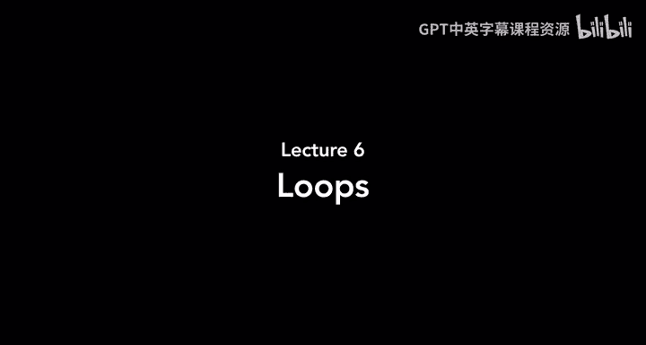
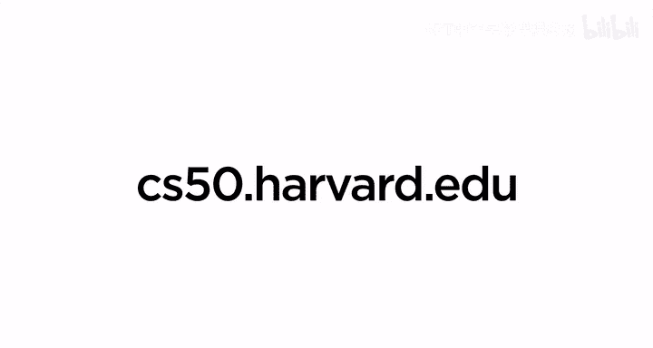

# 006：循环



在本节课中，我们将要学习Scratch编程中一个非常强大的概念：**循环**。循环允许我们让一段代码重复执行多次，而不是只运行一次。这将帮助我们创建更动态、更自动化的程序。

到目前为止，我们已经学习了多种Scratch积木，包括执行任务的函数、存储信息的变量（如精灵的方向、位置、大小），以及用于决策的条件语句。但每次运行程序时，代码都只从上到下执行一次。如果我们想让程序再次运行，就必须再次点击绿旗或触发其他事件。本节课，我们将探索如何让程序自己重复执行某些操作。

## 循环的概念与“重复执行”积木

上一节我们介绍了条件语句，本节中我们来看看如何让动作持续发生。循环是计算机科学中的一个核心概念，它允许代码块重复执行。在Scratch中，最简单的循环是“重复执行”积木。

让我们从一个简单的例子开始。通常，当我们想让小猫移动时，会使用“移动10步”积木。但每次点击绿旗，小猫只移动一次。如果我们想让小猫持续移动，就需要一个循环。

以下是实现方法：
1.  从“控制”类别中，找到“重复执行”积木。
2.  将“移动10步”积木放入“重复执行”积木的内部。
3.  将整个结构连接到“当绿旗被点击”积木下。

现在，代码结构如下：
```scratch
当绿旗被点击
重复执行
  移动10步
```
运行程序后，小猫会一直移动，直到碰到舞台边缘。这是因为“重复执行”积木会不断运行其内部的代码。

为了让小猫在碰到边缘时反弹，我们可以添加“碰到边缘就反弹”积木。同时，为了避免小猫翻转，我们可以将其旋转模式设置为“左右翻转”。

改进后的代码如下：
```scratch
当绿旗被点击
将旋转方式设为 [左右翻转]
重复执行
  移动10步
  如果碰到边缘，就反弹
```

## 使用循环创建动画

仅仅移动看起来还不够真实，因为小猫的腿没有动。我们可以利用循环和切换造型来创建简单的行走动画。

Scratch小猫有两个造型：一个腿是直的，一个腿是弯的。通过快速在它们之间切换，可以产生行走的错觉。

以下是实现动画的步骤：
1.  在“重复执行”循环内，添加“下一个造型”积木（位于“外观”类别）。
2.  为了让动画速度适中，可以在循环内添加“等待0.1秒”积木来稍微减慢循环速度。

完整的动画代码如下：
```scratch
当绿旗被点击
将旋转方式设为 [左右翻转]
重复执行
  移动10步
  如果碰到边缘，就反弹
  下一个造型
  等待0.1秒
```
现在，小猫就能以更自然的方式在舞台上行走。

## “重复执行”循环的其他应用

“重复执行”循环的用途非常广泛。例如，我们可以让一个精灵（如小鱼）始终跟随鼠标指针。

以下是创建跟随鼠标的小鱼的方法：
1.  添加小鱼精灵和水下背景。
2.  为小鱼编写以下代码：
```scratch
当绿旗被点击
重复执行
  面向 [鼠标指针]
  移动5步
```
这样，小鱼就会一直面向鼠标指针并朝其移动。我们还可以为背景添加持续的声效，比如海浪声，让程序更有沉浸感。

## 条件与循环的结合：“如果…那么”与“重复执行”

有时，我们希望程序持续检查某个条件，并在条件满足时做出反应。例如，我们希望当鼠标指针离小猫太近时，小猫会发出“喵”声。

如果只使用“如果…那么”积木，这个检查只会发生一次。我们需要将它放入一个“重复执行”循环中，才能持续监控。

正确的代码如下：
```scratch
当绿旗被点击
重复执行
  如果 <(到 [鼠标指针] 的距离) < [100]> 那么
    播放声音 [喵] 直到播放完毕
  end
```
现在，只要程序运行，小猫就会不断检查距离，并在你靠得太近时发出叫声。

## 有限次循环：“重复…次”积木

不是所有循环都需要无限进行。有时，我们只希望代码重复特定的次数。这时可以使用“重复…次”积木。

例如，如果我们想让小猫叫三声，可以这样写：
```scratch
当绿旗被点击
重复执行 (3) 次
  播放声音 [喵] 直到播放完毕
```
这比连续使用三个“播放声音”积木更高效，也更容易修改。我们甚至可以让用户决定重复的次数：
```scratch
当绿旗被点击
询问 [请输入一个数字] 并等待
重复执行 (回答) 次
  播放声音 [喵] 直到播放完毕
```

## 另一个例子：用循环画圆

还记得如何让精灵绕圈吗？通过将“移动”和“旋转”指令放入“重复…次”循环，我们可以轻松实现。

例如，要让小猫画一个圆，可以重复以下组合24次：
```scratch
当绿旗被点击
重复执行 (24) 次
  移动30步
  右转15度
```

## 条件循环：“重复直到…”积木

最后一种循环是“重复直到…”积木，它结合了循环和条件。代码会一直重复，直到指定的条件变为真。

以气球膨胀程序为例。我们之前用“重复…次”让气球膨胀固定次数后爆炸。但如果我们想让它膨胀到特定大小（比如250%）再爆炸，使用“重复直到…”会更直观。

代码如下：
```scratch
当绿旗被点击
显示
将大小设为100%
重复直到 <(大小) = [250]>
  将大小增加10
  等待0.2秒
隐藏
播放声音 [pop] 直到播放完毕
```
这样，气球会一直膨胀，直到大小达到250%，然后才执行爆炸的代码。我们无需事先计算需要重复多少次。

---

本节课中我们一起学习了Scratch中三种强大的循环结构：
1.  **重复执行**：让代码无限循环，直到程序停止。
2.  **重复…次**：让代码重复执行指定的有限次数。
3.  **重复直到…**：让代码重复执行，直到某个条件被满足。



利用循环，我们可以让程序自动重复任务，减少手动操作，并创造出更复杂、更生动的交互效果。在接下来的课程中，我们将继续探索Scratch的其他功能。