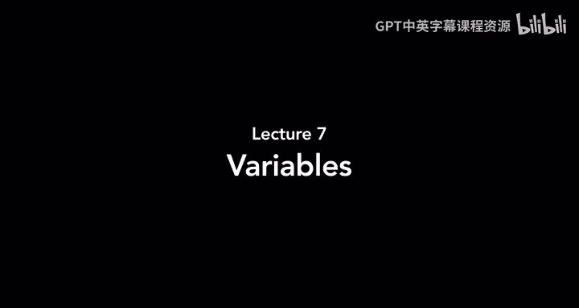
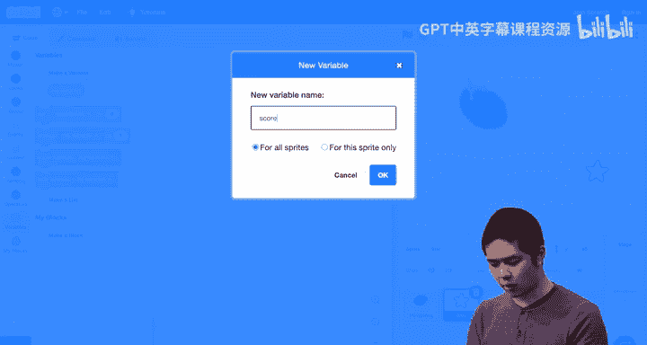
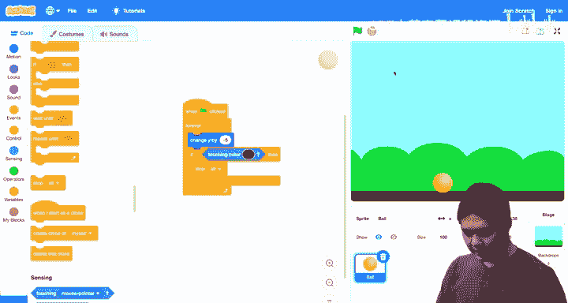
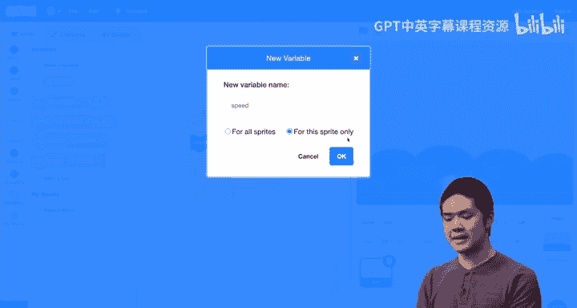
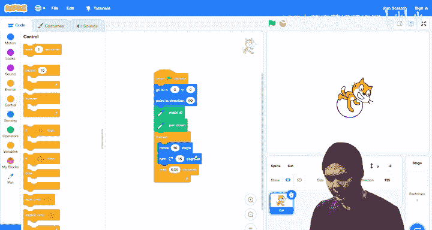
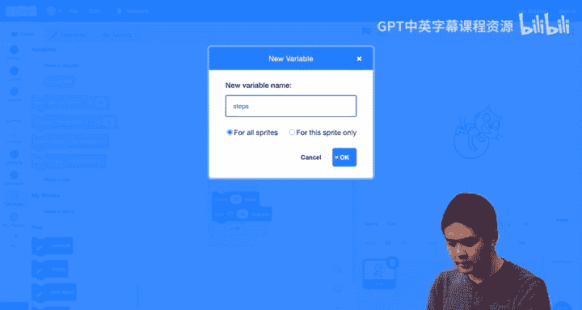
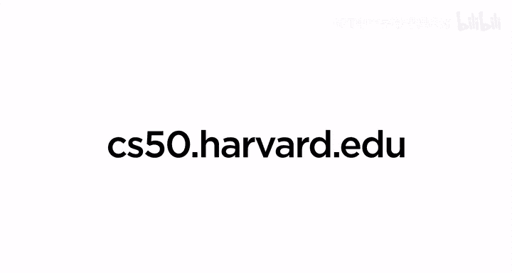

# Scratch编程入门：第7讲：变量



在本节课中，我们将要学习Scratch编程中一个非常强大的概念——**变量**。变量就像一个容器，可以存储信息，例如游戏中的分数、角色的速度或者任何你想跟踪的数据。通过使用变量，我们可以创建更复杂、更动态的程序。

---

## 什么是变量？🤔

上一节我们介绍了程序如何存储和使用信息。本节中，我们来看看如何创建和使用我们自己的信息容器——变量。

变量是程序中用于存储一个值的容器。这个值可以是数字、文本或其他类型的信息。在Scratch中，我们可以创建变量来跟踪程序运行过程中的各种状态。

例如，我们可以创建一个名为 `count` 的变量来记录我们点击小猫的次数。

以下是创建一个新变量的步骤：
1.  点击 **变量** 分类。
2.  点击 **建立一个变量** 按钮。
3.  为变量命名（例如 `count`）。
4.  选择变量的作用范围：**适用于所有角色**（全局变量）或 **仅适用于当前角色**（局部变量）。

创建后，你会在舞台上看到一个显示变量当前值的监视器。

---

## 使用变量：点击计数器 🖱️

让我们通过一个简单的例子来理解变量如何工作。我们将创建一个程序，每次点击小猫时，一个计数器就会增加。

以下是实现点击计数器的核心代码块：

```scratch
当角色被点击时
  变量 [count v] 改变 (1)
  说 (count) (1) 秒
```



*   `当角色被点击时` 是触发事件。
*   `变量 [count] 改变 (1)` 表示将 `count` 变量的值增加1。
*   `说 (count) (1) 秒` 让小猫说出当前 `count` 的值。

为了能重置计数器，我们可以添加一个“重置”按钮角色。当点击这个按钮时，我们将 `count` 变量设置为0。

```scratch
当角色被点击时 // 这是“重置”按钮的代码
  变量 [count v] 设为 (0)
```

因为 `count` 是**适用于所有角色**的全局变量，所以小猫和重置按钮都可以访问和修改它。

---

## 变量在游戏中的应用：计分系统 🎮

变量最常见的用途之一是在游戏中记录分数。让我们创建一个简单的追逐游戏来演示这一点。

在这个游戏中，刺猬会跟随鼠标移动，玩家需要控制刺猬去触碰星星来得分。

首先，我们需要创建一个名为 `score` 的变量来跟踪分数。

以下是星星角色的核心逻辑代码：

```scratch
当 @greenflag 被点击
  变量 [score v] 设为 (0) // 游戏开始时重置分数
  重复执行
    如果 <碰到 [Hedgehog v] ?> 那么
      变量 [score v] 改变 (1) // 得分加1
      如果 <(score) = (10)> 那么 // 检查是否达到10分
        换成 [You Win v] 背景
        停止 [全部 v] // 游戏结束
      否则
        移到随机位置
      结束
    结束
  结束
```

这段代码做了以下几件事：
1.  游戏开始时，将 `score` 设为0。
2.  星星不断检查是否被刺猬碰到。
3.  如果碰到，`score` 增加1，并且星星移动到随机位置。
4.  每次得分后，检查 `score` 是否等于10。如果等于10，就切换到“你赢了”的背景并停止所有脚本。

---

## 控制运动：用变量模拟重力 🏀

变量不仅可以存储静态信息，还可以动态地控制角色的行为。例如，我们可以用变量来模拟一个球受重力影响下落和弹跳的效果。



我们创建一个仅适用于球角色的局部变量 `speed`，用它来控制球在垂直方向（y轴）的移动速度。

以下是球角色的代码逻辑：



```scratch
当 @greenflag 被点击
  变量 [speed v] 设为 (0) // 初始速度设为0
  重复执行
    y 改变 (speed) // 根据当前速度移动
    变量 [speed v] 改变 (-1) // 模拟重力，速度越来越负（向下加速）
    如果 <碰到颜色 [#7b4f19] ?> 那么 // 检查是否碰到地面颜色
      变量 [speed v] 设为 ((speed) * (-0.9)) // 碰到地面时反转速度并损失一些能量（乘以-0.9）
    结束
  结束
```

*   `y 改变 (speed)`：球根据 `speed` 变量的值移动。`speed` 为负则向下移动。
*   `变量 [speed] 改变 (-1)`：每一帧都让 `speed` 减少1，模拟重力带来的持续加速。
*   当球碰到地面颜色时，将 `speed` 乘以一个负数（如 -0.9），使其方向反转（向上弹起），并且绝对值减小，模拟能量损失，弹跳高度逐渐降低。

---

## 与用户互动：滑块控制变量 🎚️

我们还可以让用户直接控制变量，从而与程序互动。例如，创建一个可以用滑块控制大小的气球。

首先，创建一个变量（如 `air`），然后右键点击舞台上该变量的监视器，选择 **滑杆** 显示方式。我们可以进一步设置滑杆的最小值和最大值，使其适合控制气球大小（例如100到200）。

然后，为气球角色编写以下简单代码：

```scratch
当 @greenflag 被点击
  重复执行
    将大小设为 (air) % // 气球的大小始终等于变量 air 的值
  结束
```

现在，用户拖动滑块改变 `air` 变量的值时，气球的大小会实时随之改变。

---

## 创作艺术：用变量绘制螺旋线 🌀

结合画笔工具和变量，我们可以创作出动态的图形。例如，让小猫画一个螺旋线。

我们创建一个变量 `steps`，控制小猫每一步移动的距离。在循环中，我们逐渐增加 `steps` 的值。

以下是绘制螺旋线的核心代码：

```scratch
当 @greenflag 被点击
  变量 [steps v] 设为 (0) // 初始移动距离为0
  移到 x: (0) y: (0) // 回到中心点
  面朝 (90) 方向 // 面朝右
  全部擦除 // 清空画布
  下笔 // 开始绘画
  重复执行
    移动 (steps) 步 // 移动的距离由变量 steps 决定
    变量 [steps v] 改变 (0.5) // 逐渐增加移动距离
    右转 (15) 度 // 每次移动后旋转一定角度
  结束
```

*   小猫从中心开始，面向右方。
*   每次循环，它移动 `steps` 步，然后 `steps` 增加0.5，接着旋转15度。
*   由于移动距离 (`steps`) 在不断缓慢增加，而旋转角度固定，其运动轨迹就从圆形变成了不断向外扩展的螺旋线。





---

## 总结 📚

本节课中我们一起学习了Scratch中**变量**的强大功能。

我们了解到：
1.  变量是存储信息的**容器**，可以是数字或其他数据。
2.  变量有**作用范围**：**全局变量**（所有角色可用）和**局部变量**（仅特定角色可用）。
3.  我们可以用变量来**记录状态**，如游戏分数（`score`）。
4.  变量可以**控制行为**，如模拟物理运动（`speed` 控制下落和弹跳）。
5.  通过**用户输入**（如滑块）可以实时修改变量，实现交互。
6.  结合**循环**和**画笔**，通过动态改变变量可以生成复杂的**动态图形**（如螺旋线）。



变量为我们编写更复杂、更互动、更智能的Scratch项目打开了大门，是编程中不可或缺的基础概念。