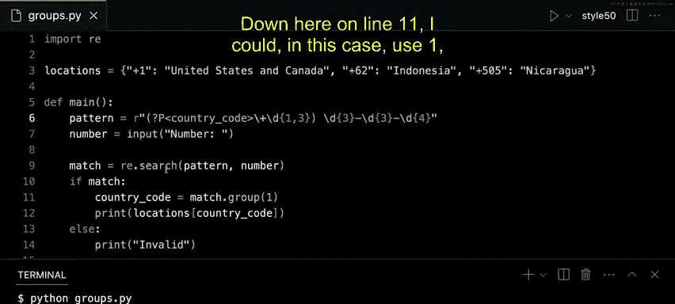

# Python正则表达式教程：P2：捕获组

## 概述
在本节课中，我们将要学习正则表达式中的一个重要概念——捕获组。我们将通过一个国际电话号码验证和解析的实例，了解如何使用捕获组来提取字符串中的特定部分，以及如何为捕获组命名以提高代码的可读性。

## 国际电话号码验证

上一节我们介绍了正则表达式的基础模式匹配。本节中我们来看看如何构建一个模式来验证国际电话号码的格式。

我们首先定义一个包含国家区号的字典，并编写一个程序来验证用户输入的电话号码是否符合特定格式。

```python
import re

locations = {
    "+1": "United States and Canada",
    "+62": "Indonesia",
    "+505": "Nicaragua"
}

def main():
    pattern = r"\+[0-9]{1,3} [0-9]{3}-[0-9]{3}-[0-9]{4}"
    number = input("Enter a phone number: ")
    if re.search(pattern, number):
        print("Valid")
    else:
        print("Invalid")

if __name__ == "__main__":
    main()
```

以下是代码关键部分的解释：
*   `r"\+[0-9]{1,3} [0-9]{3}-[0-9]{3}-[0-9]{4}"`：这是我们的正则表达式模式。
    *   `\+`：匹配字面量加号“+”。反斜杠用于转义，因为加号在正则表达式中有特殊含义。
    *   `[0-9]{1,3}`：匹配1到3位数字（0-9），对应国家区号。
    *   ` `：匹配一个空格。
    *   `[0-9]{3}-[0-9]{3}-[0-9]{4}`：匹配“三位数字-三位数字-四位数字”的本地号码格式。
*   程序运行后，会提示用户输入号码。如果输入匹配模式，则打印“Valid”，否则打印“Invalid”。

运行此程序，输入如 `+1 617-495-1000`、`+62 617-495-1000` 或 `+505 617-495-1000` 的号码，都会得到“Valid”的结果。

## 使用捕获组提取信息

仅仅验证号码格式可能还不够。有时我们还想知道这个号码来自哪个国家。这就需要从匹配的字符串中提取出国家区号部分。

如果我们尝试用简单的字符串切片来提取，会遇到问题：不同国家区号的长度不同（如“+1”是2位，“+62”是3位，“+505”是4位），我们无法预先知道该提取多长的字符。

这时，正则表达式的捕获组功能就派上用场了。捕获组允许我们动态地提取匹配模式中我们关心的特定部分。

创建捕获组的方法非常简单：只需在正则表达式中用圆括号 `()` 将你想要捕获的部分括起来即可。

让我们修改之前的程序，使其能够提取并显示国家区号。

```python
import re

locations = {
    "+1": "United States and Canada",
    "+62": "Indonesia",
    "+505": "Nicaragua"
}

def main():
    pattern = r"(\+[0-9]{1,3}) [0-9]{3}-[0-9]{3}-[0-9]{4}"
    number = input("Enter a phone number: ")
    match = re.search(pattern, number)
    if match:
        country_code = match.group(1)  # 提取第一个捕获组的内容
        print(f"Country Code: {country_code}")
    else:
        print("Invalid")

if __name__ == "__main__":
    main()
```

以下是核心修改点：
*   模式修改为 `r"(\+[0-9]{1,3}) [0-9]{3}-[0-9]{3}-[0-9]{4}"`。注意，国家区号部分 `\+[0-9]{1,3}` 现在被圆括号包围，成为了一个**捕获组**。
*   当 `re.search` 找到匹配项时，会返回一个“匹配对象”。我们可以调用匹配对象的 `.group()` 方法来获取捕获组的内容。
*   `.group(1)` 表示获取**第一个**捕获组的内容（索引从1开始）。这里获取的就是我们匹配到的国家区号字符串，如“+1”、“+62”。

运行修改后的程序，输入号码，程序现在会输出提取到的国家区号。

## 利用捕获组查询国家信息

既然我们已经能提取出国家区号，就可以利用它做更多事情，比如查询这个区号对应的国家名称。

我们之前已经定义了一个 `locations` 字典，其键就是国家区号。现在，我们可以用提取到的 `country_code` 作为键，从字典中获取对应的国家名称。

```python
import re

locations = {
    "+1": "United States and Canada",
    "+62": "Indonesia",
    "+505": "Nicaragua"
}

def main():
    pattern = r"(\+[0-9]{1,3}) [0-9]{3}-[0-9]{3}-[0-9]{4}"
    number = input("Enter a phone number: ")
    match = re.search(pattern, number)
    if match:
        country_code = match.group(1)
        # 使用捕获组提取的区号作为键，查询国家名称
        location = locations.get(country_code, "Unknown location")
        print(f"Calling from: {location}")
    else:
        print("Invalid number format.")

if __name__ == "__main__":
    main()
```

现在，当你输入 `+1 617-495-1000`，程序会输出“Calling from: United States and Canada”。输入 `+62 617-495-1000` 会输出“Calling from: Indonesia”。这模拟了手机来电显示归属地的功能。

## 为捕获组命名

在上面的例子中，我们使用 `.group(1)` 通过数字索引来访问第一个捕获组。当一个正则表达式中有多个捕获组时，使用数字索引可能会变得难以管理和阅读。

为了提高代码的可读性和可维护性，Python允许我们为捕获组**命名**。这样，我们就可以通过有意义的名称而不是数字来引用它们。

为捕获组命名的语法是：在捕获组的开括号 `(` 之后，立即写入 `?P<name>`，其中 `name` 是你为这个组起的名字。

让我们用命名捕获组来重构代码。

```python
import re

locations = {
    "+1": "United States and Canada",
    "+62": "Indonesia",
    "+505": "Nicaragua"
}

def main():
    # 使用命名捕获组，组名为“country_code”
    pattern = r"(?P<country_code>\+[0-9]{1,3}) [0-9]{3}-[0-9]{3}-[0-9]{4}"
    number = input("Enter a phone number: ")
    match = re.search(pattern, number)
    if match:
        # 通过组名来访问捕获的内容
        country_code = match.group("country_code")
        location = locations.get(country_code, "Unknown location")
        print(f"Calling from: {location}")
    else:
        print("Invalid number format.")

if __name__ == "__main__":
    main()
```

以下是命名捕获组的关键点：
*   模式修改为 `r“(?P<country_code>\+[0-9]{1,3}) …”`。`?P<country_code>` 定义了一个名为 `country_code` 的捕获组。
*   提取内容时，使用 `match.group(“country_code”)` 代替了 `match.group(1)`。这样代码的意图更加清晰，即使以后在模式中添加更多捕获组，也不会影响这里提取国家区号的逻辑。



## 总结
本节课中我们一起学习了正则表达式中捕获组的使用。
1.  **捕获组的基本用法**：使用圆括号 `()` 将模式的一部分括起来，形成捕获组，之后可以用 `.group(index)` 方法提取其内容。
2.  **捕获组的应用**：我们通过提取电话号码中的国家区号，并利用它查询对应国家名称的实例，演示了捕获组如何动态解析字符串信息。
3.  **命名捕获组**：通过 `(?P<name>…)` 语法为捕获组命名，然后使用 `.group(“name”)` 来访问，这使得代码在处理复杂模式时更易读、更健壮。


捕获组是正则表达式工具箱中一个非常强大的功能，它能让你不仅检查字符串是否匹配，还能精准地获取匹配内容中的关键片段。