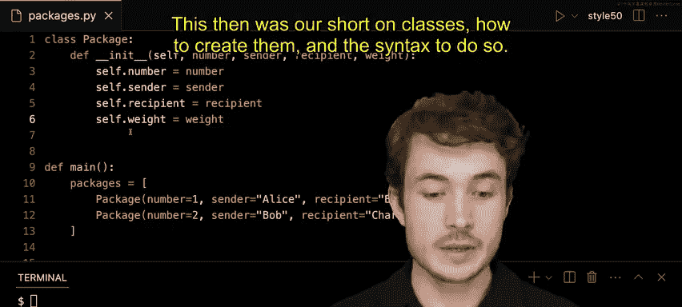

# 003：-03-类

在本节课中，我们将要学习Python中一个核心概念——**类**。我们将探讨为什么需要创建类，以及创建和使用类的具体语法。通过一个模拟包裹追踪的程序示例，你将理解类如何作为一种“模板”来创建结构化的对象，从而更有效地组织和管理数据。

---

### **为什么需要类？**

上一节我们介绍了使用列表和字符串来存储数据。本节中我们来看看这种方法可能存在的问题。

假设我们有一个程序用于追踪不同用户之间发送的包裹。最初，我们可能用一个列表来存储包裹信息，列表中的每个元素是一个描述包裹的字符串。

```python
packages = [
    "Package 1: Alice to Bob, 10 kg",
    "Package 2: Bob to Charlie, 5 kg"
]
```

使用字符串表示包裹信息虽然灵活，但过于灵活也带来了问题。例如，字符串的格式很容易不一致。随着包裹数量增加，很难保证每个字符串都遵循“包裹编号：发件人 到 收件人， 重量”的相同格式。我们需要一种更结构化、更严谨的方式来存储信息。

---

### **类：创建对象的模板**

为了解决上述问题，我们可以使用**类**。类就像一个蓝图或模板，我们可以用它来创建具有相同结构和行为的多个对象。在现实世界中，每个包裹都是一个具体的对象。我们可以定义一个`Package`类作为模板，然后基于它创建一个个具体的包裹对象。

类允许我们将与包裹相关的信息（如ID、发件人、收件人、重量）**封装**在一个单一的实体中，避免了在代码中维护复杂且易错的字符串格式。

---

### **如何定义一个类？**

以下是定义一个`Package`类的基本步骤。

首先，我们使用`class`关键字来声明一个类。按照惯例，类名通常以大写字母开头。

```python
class Package:
```

接下来，我们需要在这个类模板中填充内容。每个类通常需要一个特殊的方法 `__init__`（读作“dunder init”，即双下划线init）。这个方法在我们使用类创建新对象（或称“实例”）时会被自动调用，用于初始化这个新对象。

`__init__`方法必须至少有一个参数，按惯例命名为`self`。`self`代表正在创建的那个对象实例本身。此外，我们还需要传入创建包裹所需的所有信息。

```python
class Package:
    def __init__(self, number, sender, recipient, weight):
```

在`__init__`方法内部，我们将传入的参数赋值给`self`对象的属性。这些属性被称为**实例变量**，它们存储了每个对象独有的数据。

```python
class Package:
    def __init__(self, number, sender, recipient, weight):
        self.number = number
        self.sender = sender
        self.recipient = recipient
        self.weight = weight
```

这段代码的意思是：当创建一个新的`Package`对象时，将传入的`number`、`sender`、`recipient`和`weight`值，分别存储到这个新对象的`.number`、`.sender`、`.recipient`和`.weight`属性中。

---

### **使用类创建对象**

定义好类模板后，我们就可以用它来创建具体的包裹对象了。这被称为**实例化**。

以下是创建包裹对象并将其放入列表的方法：

```python
# 创建一个空的包裹列表
packages = []

# 创建第一个包裹对象并添加到列表
package1 = Package(number=1, sender="Alice", recipient="Bob", weight=10)
packages.append(package1)

# 创建第二个包裹对象并添加到列表
package2 = Package(number=2, sender="Bob", recipient="Charlie", weight=5)
packages.append(package2)

# 也可以直接在列表中创建
packages = [
    Package(number=1, sender="Alice", recipient="Bob", weight=10),
    Package(number=2, sender="Bob", recipient="Charlie", weight=5)
]
```

当我们执行`Package(...)`时，Python会自动调用我们定义的`__init__`方法。参数`self`由Python自动传递（代表新创建的对象`package1`或`package2`），我们只需要提供`number`、`sender`、`recipient`和`weight`的值。

现在，`packages`列表包含的不再是难以解析的字符串，而是两个结构清晰的`Package`对象。每个对象都封装了其专属的数据，访问和管理起来更加方便和可靠。

---

### **总结**

本节课中我们一起学习了Python中**类**的基本概念和使用方法。

*   我们首先了解了使用简单数据结构（如字符串列表）的局限性。
*   接着，我们引入了**类**作为创建结构化对象的**模板**。
*   我们学习了定义类的语法，重点是`__init__`初始化方法以及`self`参数的作用。
*   最后，我们实践了如何使用类来**实例化**具体的对象，从而更优雅地组织数据。

通过使用类，我们的代码变得更加模块化、易于维护和扩展。在后续课程中，我们将学习如何访问和操作这些对象内部的属性（实例变量）。

---




