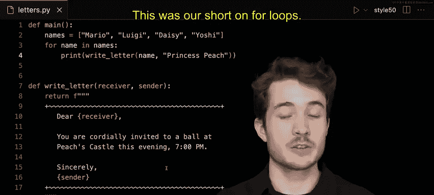

# 006：-07-For循环


## 概述
在本节课中，我们将要学习Python中的`for`循环。`for`循环是一种强大的工具，当你明确知道需要重复执行某段代码的次数，或者需要对一个列表（或任何可迭代对象）中的每个元素执行相同操作时，它非常有用。我们将通过一个为派对客人写邀请函的生动例子来理解其工作原理。

## 初始场景：重复的代码
假设碧琪公主正在为今晚7点的城堡舞会写邀请函。她有一个名为`write_letter`的函数，可以生成格式化的信件。

```python
def write_letter(receiver, sender):
    return f"""
亲爱的 {receiver}：

诚挚地邀请您于今晚7点光临碧琪城堡参加舞会。

此致，
敬礼
{sender}
"""
```

最初，程序通过多次调用这个函数来为每位客人写信：

```python
print(write_letter("马里奥", "碧琪公主"))
print(write_letter("路易吉", "碧琪公主"))
print(write_letter("黛西", "碧琪公主"))
print(write_letter("耀西", "碧琪公主"))
```

运行这个程序会为四位客人打印出邀请函。虽然功能正常，但设计上存在一个问题：如果需要邀请更多客人，就必须不断复制和粘贴代码行，这非常繁琐且容易出错。

## 引入列表管理客人
为了解决上述问题，我们可以先创建一个客人名单列表。

```python
names = ["马里奥", "路易吉", "黛西", "耀西"]
```

现在，我们有了一个集中的客人列表。接下来，我们需要为列表中的每个名字写一封信。

## 第一种`for`循环：使用索引
上一节我们介绍了如何使用列表存储数据。本节中我们来看看如何使用`for`循环遍历这个列表。一种方法是使用`range()`函数生成索引数字，然后用这些索引去访问列表中的元素。

```python
for i in range(len(names)):
    print(i) # 这会打印出 0, 1, 2, 3
```

`range(len(names))`会生成一个从0到列表长度（不包含）的数字序列。变量`i`在每次循环中会依次取这些值。但我们不想邀请数字，我们想邀请名字。因此，我们可以用`i`作为索引来获取对应的名字。

```python
for i in range(len(names)):
    guest_name = names[i]
    letter = write_letter(guest_name, "碧琪公主")
    print(letter)
```

这段代码运行后，会为列表中的每个名字生成一封邀请函。程序变得灵活了：要增加或减少客人，只需修改`names`列表即可，无需改动循环代码。

## 更优雅的`for`循环：直接遍历元素
虽然使用索引的方法有效，但Python提供了一种更简洁、更符合直觉的遍历列表方式：直接迭代列表中的元素。

以下是改进后的写法：

```python
for name in names:
    letter = write_letter(name, "碧琪公主")
    print(letter)
```

在这个循环中，变量`name`会依次代表列表`names`中的每一个元素（“马里奥”、“路易吉”等）。代码变得更加清晰易读。我们不再需要关心索引，而是直接处理我们关心的数据——客人的名字。

现在，增加新客人（比如“库巴”）变得极其简单：

```python
names = ["马里奥", "路易吉", "黛西", "耀西", "库巴"]
```

只需将名字加入列表，循环会自动为所有客人生成信件。

## 总结
本节课中我们一起学习了`for`循环的核心概念和应用。
*   `for`循环用于对序列（如列表、字符串）中的每个项目重复执行代码块。
*   其基本语法是：**`for item in sequence:`**。
*   相比于手动重复代码或使用索引遍历，直接迭代列表元素是更Pythonic（符合Python风格）、更可读的方式。
*   使用`for`循环可以极大地提高代码的灵活性和可维护性，当数据发生变化时，通常只需修改数据源（如列表），而无需重写逻辑。

`for`循环是自动化重复任务的基础，理解它对你后续的编程学习至关重要。




