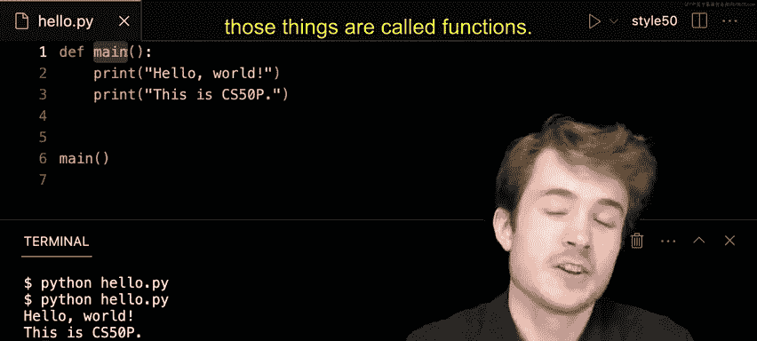

# 007：-08-函数


## 概述

在本节课中，我们将要学习Python编程中的一个核心概念：**函数**。我们将了解什么是函数，如何调用Python内置的函数，以及如何定义和使用我们自己的函数。

---

## 什么是函数？


上一节我们介绍了编程的基本概念，本节中我们来看看什么是函数。函数可以看作是一段执行特定任务的代码块。它接收一些输入（称为参数），执行一系列操作，然后可能返回一个输出。你可以把它想象成一个动词，可以在你的程序中执行。

在Python中，函数的基本结构是：**函数名(参数)**。例如，`print("Hello")` 就是一个函数调用。

---

## 使用内置函数：`print`

Python自带了许多有用的内置函数，其中最常用的是 `print` 函数。它的作用是接收文本作为输入，并将该文本输出到终端。

以下是使用 `print` 函数的步骤：

1.  打开一个文本编辑器或IDE，创建一个名为 `hello.py` 的新文件。
2.  在文件中输入以下代码：
    ```python
    print("Hello World")
    print("This is CS50P")
    ```
3.  保存文件，然后在终端中运行它：
    ```bash
    python hello.py
    ```
4.  你将在终端中看到两行输出：
    ```
    Hello World
    This is CS50P
    ```

在这个例子中，我们**调用**了两次 `print` 函数。每次调用都向函数传递了一个字符串参数（例如 `"Hello World"`），函数则执行了打印这个字符串的任务。

---

## 定义自己的函数

除了使用内置函数，我们还可以创建自己的函数。这让我们能够将代码组织成可重用的模块。

要定义一个函数，我们使用 `def` 关键字（`def` 是 `define` 的缩写），后面跟上函数名和一对括号。

以下是定义一个简单函数的步骤：

1.  我们定义一个名为 `main` 的函数。
    ```python
    def main():
    ```
2.  在函数名后面加上冒号 `:`，然后在新的一行缩进（通常是4个空格或一个Tab键），写下我们希望函数执行的所有代码。
    ```python
    def main():
        print("Hello World")
        print("This is CS50P")
    ```
    现在，我们定义了一个函数 `main`，它包含了两条 `print` 语句。

---

## 调用自定义函数

仅仅定义函数并不会让它运行。我们必须显式地**调用**它，程序才会执行函数内部的代码。

因此，在定义了 `main` 函数之后，我们需要在程序的最后调用它：

```python
def main():
    print("Hello World")
    print("This is CS50P")

main()
```

现在，当我们运行 `python hello.py` 时，程序会从上到下执行：
1.  首先，它定义了 `main` 函数（但此时不运行里面的代码）。
2.  然后，它遇到 `main()` 这行，于是调用 `main` 函数。
3.  执行 `main` 函数内部的代码，即打印两行文本。

---

## 总结

本节课中我们一起学习了Python函数的核心概念。我们了解到：
*   函数是执行特定任务的代码块。
*   我们可以使用Python内置的函数，如 `print`。
*   我们可以使用 `def` 关键字来定义自己的函数。
*   定义函数和调用函数是两个不同的步骤：定义是描述函数做什么，而调用是实际执行它。



通过将代码组织成函数，我们可以使程序更加模块化、清晰且易于维护。随着学习的深入，你会发现编写程序很大程度上就是在创建和组合各种函数。