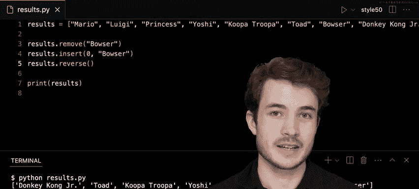

# 011：-12-列表

在本节课中，我们将要学习Python中的列表。列表是一种可以按特定顺序存储信息的数据结构。我们将通过一个模拟赛车游戏排名的例子，来了解如何创建列表、向列表中添加或删除元素，以及使用其他有用的列表方法。

---

上一节我们介绍了课程概述，本节中我们来看看如何创建列表。

在Python中，列表使用方括号 `[]` 表示，其中的元素用逗号分隔。我们可以通过直接赋值的方式创建一个列表。

例如，我们可以创建一个名为 `results` 的列表来存储赛车游戏的比赛结果。假设马里奥获得了第一名，路易吉获得了第二名，我们可以这样创建列表：

```python
results = ["Mario", "Luigi"]
```

这里，我们创建了一个包含两个字符串元素的列表。

---

了解了如何创建列表后，我们来看看如何在程序运行时动态地向列表中添加元素。

Python为列表提供了 `append()` 方法，它可以在列表的末尾添加一个新元素。

假设在比赛后期，桃花公主获得了第三名。我们可以使用 `append()` 方法将她添加到 `results` 列表的末尾：

```python
results.append("Princess")
```

现在，如果我们打印列表，将会看到三个名字：

```python
print(results)
# 输出：['Mario', 'Luigi', 'Princess']
```

我们可以继续使用 `append()` 方法添加更多的赛车手，例如耀西、慢慢龟和奇诺比奥：

```python
results.append("Yoshi")
results.append("Koopa Troopa")
results.append("Toad")
```

---

我们已经学会了逐个添加元素，但如果想一次性添加多个元素该怎么办呢？这时我们可以使用 `extend()` 方法。

假设库巴和森喜刚 Jr. 同时冲过终点线。如果我们错误地使用 `append()` 并传入一个列表，那么这个列表本身会被作为一个元素添加到原列表中，形成一个嵌套列表，这并不是我们想要的结果。

```python
# 错误示范：这会将一个列表作为单个元素添加进去
results.append(["Bowser", "Donkey Kong Jr."])
# 此时 results 末尾会变成：... , ['Bowser', 'Donkey Kong Jr.']
```

为了纠正这个错误，我们可以先使用 `remove()` 方法移除这个嵌套的列表，然后使用 `extend()` 方法。`extend()` 方法接受一个列表作为参数，并将其中的每个元素分别添加到原列表的末尾。

以下是正确的做法：

```python
# 首先，移除之前错误添加的嵌套列表
results.remove(["Bowser", "Donkey Kong Jr."])
# 然后，使用 extend 正确添加
results.extend(["Bowser", "Donkey Kong Jr."])
```

现在，`results` 列表将包含所有八个赛车手，且每个都是独立的元素。

---

除了添加元素，我们还需要掌握如何从列表中移除元素。`remove()` 方法可以根据元素的值来删除列表中第一个匹配的项。

假设我们发现库巴作弊，需要将他从排名中移除：

```python
results.remove("Bowser")
```

执行这行代码后，列表中的第一个 “Bowser” 元素将被删除。

---

如果我们之后想将库巴重新加入列表，并且希望他“不公正地”排在第一位，可以使用 `insert()` 方法。这个方法允许我们在列表的指定位置插入一个元素。

列表的索引从0开始。要在列表的最前面（索引0处）插入“Bowser”，可以这样做：

```python
results.insert(0, "Bowser")
```

这行代码将在 `results` 列表的开头插入 “Bowser” 元素。

---

最后，我们来看一个可以改变列表顺序的方法：`reverse()`。这个方法会将列表中的元素顺序完全反转。

如果我们想颠倒当前的比赛排名，可以调用：

```python
results.reverse()
```

执行后，原本最后一名的赛车手将变成第一名，而第一名则变成最后一名。

---

以下是本节课中我们接触到的核心列表方法总结：

*   **`append(x)`**: 在列表末尾添加元素 `x`。
*   **`extend(iterable)`**: 将可迭代对象 `iterable` 中的所有元素添加到列表末尾。
*   **`remove(x)`**: 删除列表中第一个值为 `x` 的元素。
*   **`insert(i, x)`**: 在索引 `i` 处插入元素 `x`。
*   **`reverse()`**: 反转列表中元素的顺序。

---




本节课中我们一起学习了Python列表的基本操作。我们了解了如何创建列表，如何使用 `append` 和 `extend` 添加元素，如何使用 `remove` 删除元素，如何使用 `insert` 在特定位置插入元素，以及如何使用 `reverse` 反转列表顺序。列表是Python中非常强大和灵活的工具，是存储有序数据集合的基础。