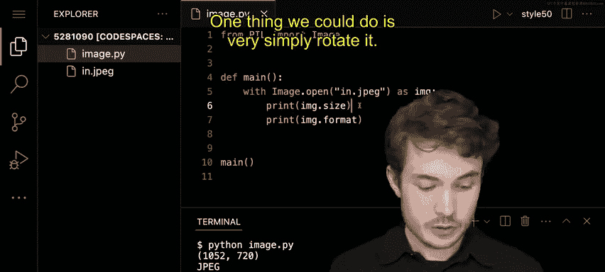
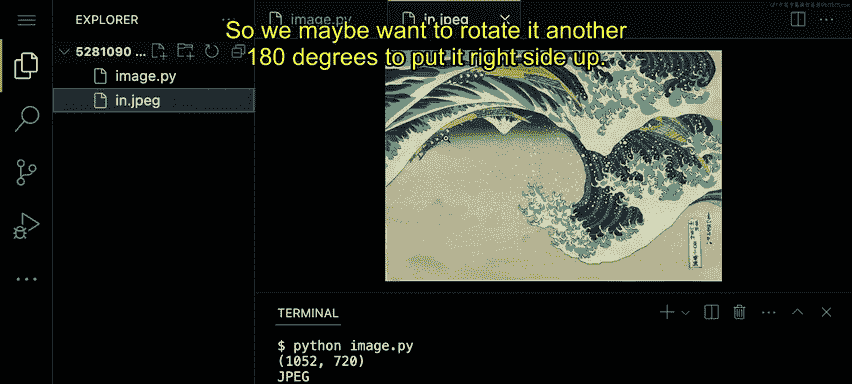
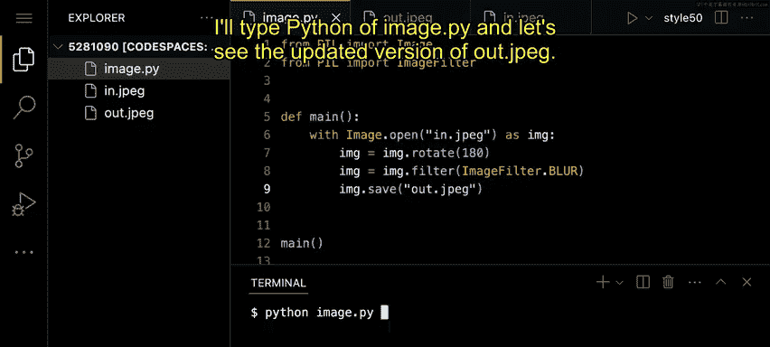
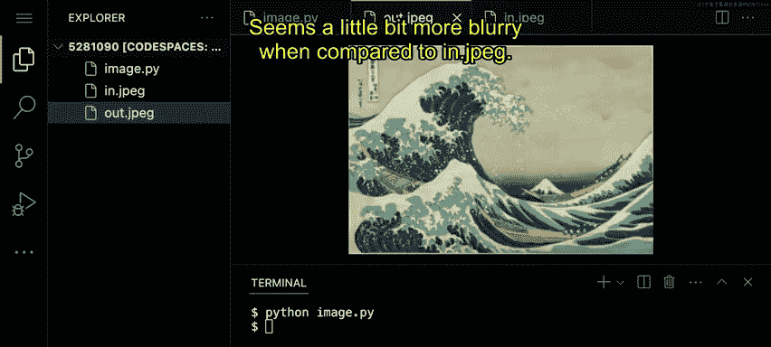
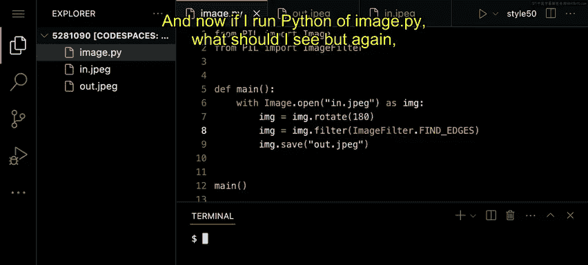
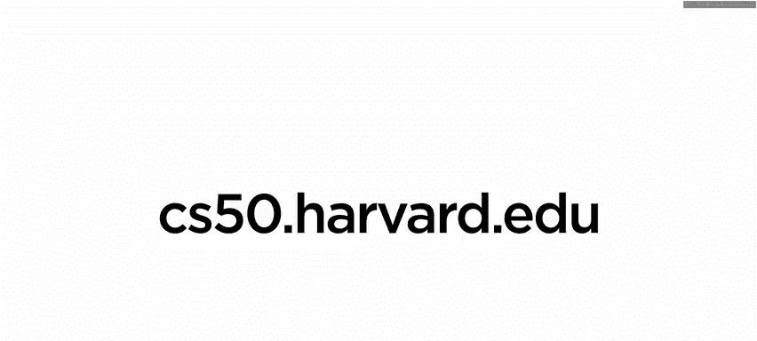

# 013：-14-Pillow库基础教程

在本节课中，我们将要学习如何使用Python的Pillow库来操作图像。我们将从打开和保存图像开始，然后学习如何旋转图像以及应用各种滤镜效果。

---

### **概述**

Pillow是Python中一个强大的图像处理库。本节教程将引导你完成使用Pillow进行基本图像操作的全过程，包括打开文件、获取图像信息、旋转图像以及应用滤镜。

---

### **1. 导入Pillow库**

要使用Pillow库，我们首先需要导入它。Pillow库中有一个名为`Image`的类，它是我们处理图像的核心工具。

```python
from PIL import Image
```

`Image`类就像一个模板，它提供了表示和操作计算机上图像文件所需的功能。

---

### **2. 打开与关闭图像**

上一节我们介绍了如何导入库，本节中我们来看看如何打开一个图像文件。使用`Image.open()`方法可以打开图像。

以下是打开图像的基本步骤：

1.  使用`with`语句和`Image.open()`打开图像文件。这是一种最佳实践，可以确保在使用后自动关闭文件，避免资源泄露。
2.  在`with`代码块内，我们可以通过一个变量（例如`img`）来访问被打开的图像对象。

```python
with Image.open(‘in.jpeg’) as img:
    # 在此代码块内操作图像
    pass
```

---

### **3. 获取图像属性**

打开图像后，我们可以查看它的一些基本属性，例如尺寸和格式。图像对象有`size`和`format`等属性。

以下是获取图像属性的方法：

*   `img.size`: 返回一个元组，包含图像的宽度和高度（单位：像素）。
*   `img.format`: 返回图像的格式（例如，‘JPEG‘， ’PNG‘）。

运行包含这些打印语句的程序，终端会输出类似 `(1052, 720)` 和 `JPEG` 的信息。

---

### **4. 旋转图像**





现在我们已经了解了图像的基本信息，接下来学习如何操作它。一个常见的操作是旋转图像。例如，我们可以将一张倒置的图片旋转180度使其正立。

使用`img.rotate()`方法可以实现旋转。该方法接受一个角度作为参数。

```python
img_rotated = img.rotate(180)
```

旋转后，我们可以使用`img.save()`方法将修改后的图像保存到一个新文件中。

```python
img_rotated.save(‘out_rotated.jpeg’)
```

---

### **5. 应用图像滤镜**

除了旋转，Pillow还允许我们为图像应用各种有趣的滤镜效果。要使用滤镜，我们需要从PIL中额外导入`ImageFilter`类。

```python
from PIL import ImageFilter
```

然后，我们可以使用`img.filter()`方法并传入特定的滤镜来应用效果。



以下是应用滤镜的步骤：

1.  **模糊滤镜**：使用`ImageFilter.BLUR`。
    ```python
    img_blurred = img.filter(ImageFilter.BLUR)
    img_blurred.save(‘out_blurred.jpeg’)
    ```
2.  **边缘检测滤镜**：使用`ImageFilter.FIND_EDGES`来突出显示图像的边缘。
    ```python
    img_edges = img.filter(ImageFilter.FIND_EDGES)
    img_edges.save(‘out_edges.jpeg’)
    ```

运行程序后，你将在文件夹中看到应用了不同滤镜效果的新图像文件。





---

### **总结**



本节课中我们一起学习了Pillow库的基础知识。我们掌握了如何打开和保存图像、如何获取图像的尺寸与格式信息、如何使用`rotate()`方法旋转图像，以及如何通过`ImageFilter`类为图像应用模糊和边缘检测等滤镜效果。Pillow的功能远不止于此，期待你用它创造出更多有趣的图像处理程序。