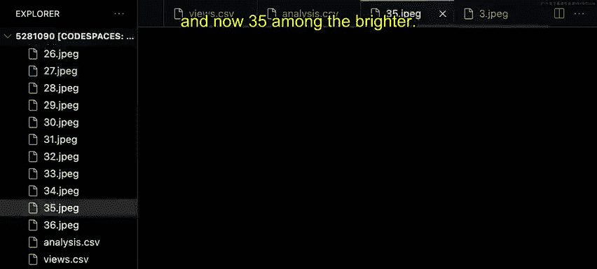

# Python编程入门：P16：-17-读取和写入CSV文件 📊


## 概述
在本节课中，我们将要学习如何使用Python读取和写入CSV文件。CSV文件是一种以逗号分隔值存储数据的格式，非常适合与Python结合进行数据分析。我们将通过一个分析富士山版画亮度的实际项目来掌握这些技能。

---

## 什么是CSV文件？
CSV文件是一种简单的文本文件，用于存储表格数据。每行代表一条记录，每列的值由逗号分隔。这种格式易于生成和解析，是数据交换的常用格式。

---

## 读取CSV文件 📖
上一节我们介绍了CSV文件的基本概念，本节中我们来看看如何用Python读取CSV文件的内容。

首先，我们需要使用Python内置的`csv`库。这个库提供了专门处理CSV文件的工具。

以下是读取CSV文件的基本步骤：

1.  **导入csv模块**：首先需要导入必要的库。
2.  **打开文件**：使用`with open()`语句以读取模式打开文件。
3.  **创建阅读器对象**：使用`csv.DictReader`将文件的每一行读取为一个字典。
4.  **遍历数据**：使用`for`循环遍历阅读器对象，处理每一行数据。

让我们通过代码来实现这些步骤。假设我们有一个名为`views.csv`的文件，其中包含富士山版画的数据。

```python
import csv

with open('views.csv', 'r') as file:
    reader = csv.DictReader(file)
    for row in reader:
        print(row)
```
运行这段代码，你会看到每一行数据都被打印为一个字典。字典的键是CSV文件第一行的列标题（如`ID`、`English title`），值是对应单元格的内容。这种方式让我们可以通过列名轻松访问特定数据。

---

## 处理读取的数据 🔍
成功读取数据后，我们可以进一步处理它。在我们的例子中，`ID`列的值对应着图片的文件名（例如，`1.jpg`）。

我们可以访问每一行字典中的`ID`值，然后将其与文件扩展名组合，构造出完整的图片文件名。

```python
import csv

with open('views.csv', 'r') as file:
    reader = csv.DictReader(file)
    for row in reader:
        filename = f"{row['ID']}.jpg"
        print(filename)
```
这段代码会输出类似`1.jpg`、`2.jpg`的文件名。这样我们就为后续的图片分析（例如计算亮度）准备好了文件路径。

---

## 写入CSV文件 ✍️
上一节我们学会了如何读取数据，本节中我们来看看如何将处理后的数据写入一个新的CSV文件。

写入CSV文件与读取类似，但使用的是`csv.DictWriter`对象。我们的目标是在原有数据的基础上，添加一个新的“亮度”列。

以下是写入CSV文件的核心步骤：

1.  **同时打开两个文件**：一个用于读取原始数据，一个用于写入新数据。
2.  **创建写入器对象**：使用`csv.DictWriter`，并指定新文件的列标题。
3.  **写入标题行**：调用`writeheader()`方法写入列名。
4.  **遍历并写入数据**：读取原始数据的每一行，计算新值（如亮度），然后将其作为新的一行写入新文件。

以下是实现这些步骤的代码框架：

```python
import csv

with open('views.csv', 'r') as views, open('analysis.csv', 'w') as analysis:
    reader = csv.DictReader(views)
    fieldnames = reader.fieldnames + ['brightness']  # 添加新列
    writer = csv.DictWriter(analysis, fieldnames=fieldnames)
    writer.writeheader()

    for row in reader:
        # 1. 根据row[‘ID’]计算图片亮度，结果存入brightness_value
        # brightness_value = calculate_brightness(f"{row['ID']}.jpg")
        # 2. 将亮度值添加到当前行字典中
        row['brightness'] = round(brightness_value, 2)  # 四舍五入保留两位小数
        # 3. 将更新后的行写入新文件
        writer.writerow(row)
```
**关键改进**：注意，我们没有创建一个全新的字典来写入。相反，我们直接向从原始文件中读取的`row`字典添加了一个新的键值对`‘brightness’: brightness_value`，然后直接将这个更新后的字典写入新文件。这种方法更简洁、更高效。

---

## 代码优化与总结 🎯
让我们回顾一下完整的、优化后的流程。我们同时处理了文件的读取和写入，并在过程中添加了新的数据分析维度。

以下是最终优化后的代码逻辑总结：



1.  使用`with`语句同时管理读取和写入的文件对象。
2.  使用`csv.DictReader`读取数据，便于通过列名访问。
3.  通过`reader.fieldnames`获取原始列名，并添加新列名`‘brightness’`。
4.  使用`csv.DictWriter`创建写入器，并写入标题行。
5.  循环遍历原始数据每一行：
    *   计算当前行对应图片的亮度。
    *   将亮度值（经过四舍五入）作为新项添加到当前行字典中。
    *   使用`writer.writerow(row)`将更新后的整行数据写入新CSV文件。

通过这个项目，我们不仅学会了读取CSV文件来获取数据，还掌握了如何将分析结果（图片亮度）写回一个新的、结构更丰富的CSV文件中。`csv.DictReader`和`csv.DictWriter`是处理此类任务非常强大的工具。

---


## 总结
本节课中我们一起学习了Python处理CSV文件的核心操作。我们掌握了如何使用`csv.DictReader`读取文件并将每行数据转化为字典，以及如何使用`csv.DictWriter`将字典数据写入新的CSV文件。通过一个为图片数据集添加亮度分析列的实际案例，我们实践了同时进行文件读取、数据处理和结果写入的完整流程。记住，直接修改读取到的行字典并写入，是保持代码简洁高效的好方法。