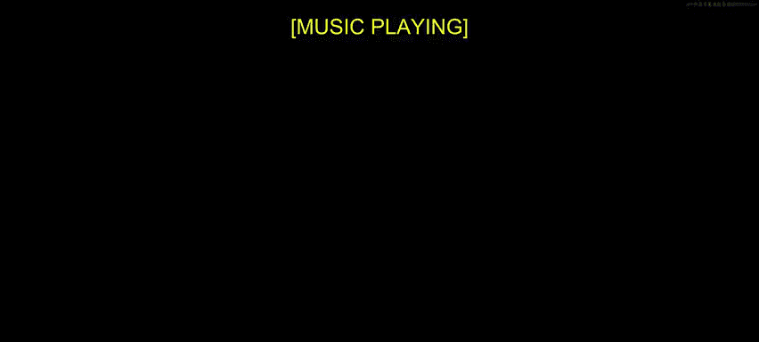
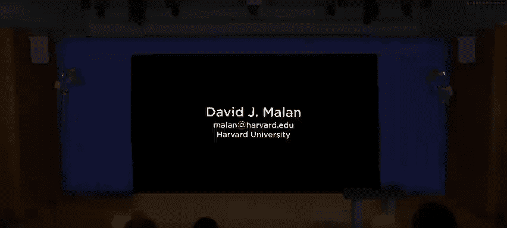
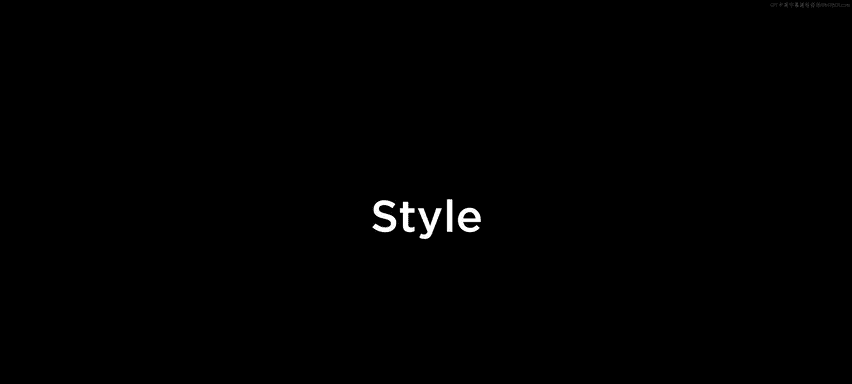
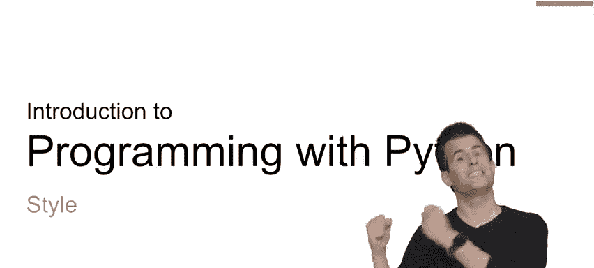

# 019：代码风格

在本节课中，我们将要学习代码风格。到目前为止，我们编写的代码希望至少是正确的。代码完成了你预期的功能，并且希望设计良好。这意味着你使用相对较少的代码行来实现某个目标，同时确保代码可读。你可能使用了函数，避免了重复造轮子。

但是，你的代码可能没有体现出最佳的风格。风格是你可以赋予代码的另一种质量形式。风格或应使用的正确风格相当主观，通常取决于程序员、公司、课程或你实际使用的语言。

然而，在Python社区中，存在一些相当规范的、大多数Python程序员都遵守或期望遵守的标准。这是因为Python语言和社区试图将他们的偏好编纂成文，形式就是所谓的PEP 8。

## 什么是PEP 8？📜

PEP，即Python增强提案，是Python社区内部提出的一系列提案，不仅用于提出新想法，也用于最终编纂某些标准。PEP 8恰好就是这样一个提案，它试图标准化我们的代码应该是什么样子。

换句话说，完全有可能写出不仅正确、甚至设计良好，但看起来一团糟的代码。这样的代码不美观，因此更难阅读，对他人来说也更难理解，从而降低了可维护性。任何让代码更难阅读或更不易维护的做法，都会增加未来引入错误的可能性。

因此，恰当地格式化代码是件好事。就像在写电子邮件、文章、书籍或文档时一样，使用良好的标点符号、段落分隔等是好的做法。即使你是编程新手，至少在英语或你自己的母语中，你可能已经有很多让书面语言看起来美观的实践经验。

## 代码美观的含义 🎨

在编程代码的世界里，“美观”意味着什么？PEP 8本身可以在网上找到，它试图标准化你编写多行代码后可能出现的许多细节。PEP 8以及Python社区风格概念的核心前提是：**可读性很重要**。

通常，包括Python在内的语言都带有一种通常被称为“风格指南”的东西，类似于PEP 8，它试图标准化每个人的代码应该是什么样子。你参加的课程可能有自己的风格指南，你工作的公司可能有自己的风格，你作为专业程序员将来也可能为自己的代码制定风格指南。但在Python社区内部，他们总体上试图标准化这些细节。

> 风格指南是关于一致性的。与Python上下文中的本风格指南保持一致很重要。在项目内部保持一致更重要。在一个模块或函数内部保持一致最重要。

也就是说，这些不一定是硬性规定，而是应该指导你自己代码设计的准则。

## 如何设计代码风格？ ✍️

那么，如何设计或如何为代码应用风格呢？这归结为以下几点以及更多方面：

**缩进**
使用一致的缩进。在某些语言中，当你将一行代码缩进在另一行之下时，缩进不一定是必须的，或者可以是一个空格、两个空格、三个空格、四个空格，甚至八个空格或一个实际的制表符。在Python世界中，他们试图结束这场争论，并规定我们都同意一致使用四个空格。

> 空格，而非制表符。

实际上，在像VS Code这样的工具中，当你按下键盘上的Tab键时，根据程序的配置，它通常会将制表符转换为单个空格。

**最大行长度**
你的代码行越长，可读性就越差，尤其是当它们开始在屏幕上滚动时。因此，Python试图标准化最大行长度，你不应该让代码行超过屏幕右侧的某个字符数。

**空行**
使用一定数量的空行，例如在代码块之间，甚至在注释之间，也有助于使你的代码更具可读性。为什么？因为它不再是一堵代码墙，让你或其他程序员难以阅读。通过添加空行和更普遍的空白，可以让你更容易理解正在发生的事情。

**导入**
即使是像导入库、模块或包这样的操作，Python也规定了通常应该在哪里放置那些包含 `import` 或 `from` 的代码行。

PEP 8还规定了其他许多细节。这些细节不一定是我们在课程中刻意强调的，而是我们在课堂上编写每个示例时实践的。随着你看到越来越多的代码，你会逐渐习惯这些提案中的某些规则。

## 如何检查代码风格？ 🔍

那么，如何检查你的代码是否符合PEP 8或更一般的风格指南呢？你当然可以阅读风格指南本身，然后查看自己的代码，左右对比，决定需要修复哪些地方。

但是，作为程序员，也有工具可以帮助我们解决这些问题。Python世界中最流行的工具之一是一个叫做 `pylint` 的程序，它是一个“linter”的例子。Linter是一种静态分析程序，即从上到下、从左到右读取你的代码，试图找出其中可能存在的错误，或者至少是与规定风格指南不一致的地方。

你可以通过通常的方式（例如使用 `pip`）安装它。但事实证明，还有其他一些工具可能比 `pylint` 的“噪音”更少。如果你在迄今为止编写的大多数程序上运行 `pylint`，你很可能会被它指出的、你在风格上“做错”的事情数量所淹没，即使你的代码可能既正确又设计良好。

因此，至少在一开始，“噪音”较少的选择可能是这个程序，它是Python社区内格式化代码的事实标准：`pycodestyle`（以前称为 `pep8`）。这个程序不仅可以运行在你的电脑上，它实际上会负责为你重新格式化代码的过程。也就是说，如果你的代码风格、缩进、空行和其他细节不符合风格指南，像 `pycodestyle` 这样的工具会为你修复。

## 现代格式化工具：Black ⚫

另一个如今实际上越来越流行、甚至可能更受欢迎的替代方案，简称为 `black`。`black` 也是一个你可以用 `pip` 安装的程序。

`black` 这个名字的词源实际上暗指亨利·福特，他很久以前发明了汽车，并且只销售少数几种黑色的车型。他通常说过类似这样的话：“任何顾客都可以把这辆车漆成任何他想要的颜色，只要它是黑色的。”

思考一下这句话，它并没有提供太多选择。这正是这个名为 `black` 的格式化工具的精神所在：它是“固执己见的”。与许多其他存在的格式化工具相比，你、你的公司或你的课程倾向于用某些规则来配置它们，因此在缩进、导入或空行的处理方式上可能存在差异。不同的公司和不同的人可能有合理的分歧，因此他们有自己的风格指南。有人认为，如果我们甚至在这些基础问题上都无法达成一致，那只会浪费大量时间。

因此，这个名为 `black` 的特定格式化工具是“固执己见”的，因为它为你做了很多这些决定。如果你不喜欢 `black` 格式化你代码的方式，那也没办法，它就会那样做。这可能是Python社区内现在的一种趋势，即减少在这些风格细节上的争论，以便你和我最终能更专注于编写好的代码和解决问题。

## 实践演示 🚀

让我们继续实际操作。我提前在VS Code中创建了一个名为 `students.py` 的程序。这个程序的目的是在程序顶部创建一个字典，包含键值对，键是一些学生的名字，值是他们在霍格沃茨居住的学院。然后，我这里有一个 `for` 循环，遍历每个学生，目前只打印出他们的名字。你当然可以想象对值做更多操作，但目前这是一个简单的程序。

但是，它已经表现出了糟糕的风格，可以说肯定不符合PEP 8。我从经验中知道这一点，仅仅通过观察就意识到：第一行代码完全超出了我自己的屏幕，感觉可能有点长，我甚至需要滚动才能看到发生了什么。这一点更微妙，但如果你看这里的第3行，即使我在技术上缩进得足够（只要我的代码在 `for` 循环下缩进，并且任何后续的代码行都类似地缩进），代码就能工作并且是正确的，但它不符合PEP 8的规定，PEP 8规定每个级别使用四个空格缩进。

那么，我该如何修复这个问题呢？如果我安装了其中一个格式化工具，例如 `black`，我可以在终端窗口中这样做：运行命令 `black students.py` 并按回车键。瞧，你会看到 `students.py` 文件已经被自动重新格式化。

在我的文件顶部，现在有一个字典，和之前的字典一样，但可读性高得多。它不仅没有环绕到屏幕边缘，你还可以在一行中看到每个键值对，并且可以看到它甚至便于以后添加更多内容。事实证明，在最后一行（新行6）的 `Pama in ravencl` 后面有一个尾随逗号，即使在这里不是严格必需的，但这样做并不错误。

为什么？因为 `Pama in ravencl` 是这个特定字典中的最后一个学生。但通常情况下，我可能会在以后开始添加更多的键值对。一个常见的错误来源是意外地忘记：“哦，我之前那里没有逗号。”而我现在正在添加更多的键值对。这就是 `black` 不仅为你修复，而且也有自己见解的那种细节。

## 总结 📝

本节课中，我们一起学习了代码风格的重要性以及如何维护良好的代码风格。我们了解到，代码风格关乎可读性和一致性，而不仅仅是正确性。Python社区通过PEP 8提供了标准化的风格指南。

我们探讨了代码风格的关键方面，包括缩进（使用四个空格）、最大行长度、空行的使用以及导入语句的放置。为了帮助检查和维护代码风格，我们介绍了几个工具：用于静态分析的 `pylint`，用于格式化的 `pycodestyle`，以及“固执己见”的自动格式化工具 `black`。

通过实践演示，我们看到 `black` 如何自动将格式混乱的代码（如过长的行和不一致的缩进）转换为符合PEP 8标准的整洁代码，甚至优化了字典的布局和尾随逗号的使用，以提高可读性和可维护性。

随着你继续编写自己的代码，建议你逐渐内化像PEP 8这样的风格指南中的一些准则。但要知道，作为程序员，你可以使用诸如 `pycodestyle`、`black` 或其他工具，来帮助你更专注于代码的正确性、设计和解决实际问题，同时确保你的代码也能被自动格式化得很好。

