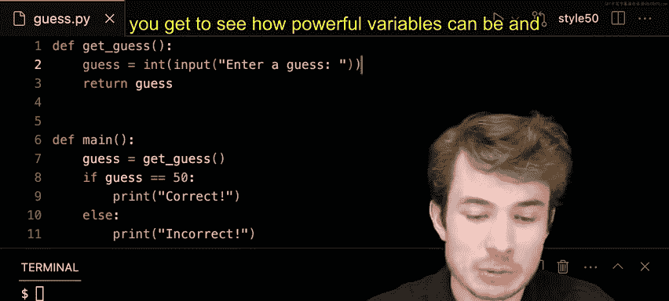

# 020：变量


在本节课中，我们将学习Python编程中的一个核心概念——变量。变量是程序中用于存储和表示可变数据的容器。我们将通过构建一个简单的猜数字游戏，来理解如何创建、使用变量，以及变量类型的重要性。

## 概述


变量是编程的基础构建块，它们允许我们存储信息，并在程序运行过程中引用和修改这些信息。本节将介绍如何声明变量、为变量赋值，以及如何结合函数使用变量。我们还将探讨变量的“作用域”概念和不同的“数据类型”，例如整数和字符串。

## 变量的定义与赋值

上一节我们介绍了变量的概念，本节中我们来看看如何在Python中创建和使用变量。

在Python中，创建一个变量非常简单：首先输入变量的名称，然后使用等号（`=`）为其赋值。这个等号是“赋值运算符”，它的作用是将右侧的值放入左侧命名的“容器”中。

例如，如果我们想存储用户的猜测，可以创建一个名为 `guess` 的变量：

```python
guess = 10
```

这行代码创建了一个名为 `guess` 的变量，并将整数值 `10` 存储在其中。之后，我们可以通过变量名来访问这个值：

```python
print(guess)
```

执行这行代码将在屏幕上输出 `10`。

## 在函数中使用变量

变量与函数结合使用时，会变得非常强大。我们可以创建一个专门用于获取用户猜测的函数。

以下是创建一个名为 `get_guess` 的函数的方法：

```python
def get_guess():
    guess = 10
    return guess
```

这个函数内部定义了一个变量 `guess`，将其赋值为 `10`，然后通过 `return` 语句将这个值返回。我们可以在程序的其他地方调用这个函数并打印其返回值：

```python
print(get_guess())
```

## 获取用户输入

一个让用户每次都要修改源代码来改变猜测的游戏并不实用。理想情况下，程序应该允许用户在终端中输入他们的猜测。Python提供了一个名为 `input` 的内置函数来实现这个功能。

我们可以修改 `get_guess` 函数，使用 `input` 来获取用户输入：

```python
def get_guess():
    guess = input("Enter a guess: ")
    return guess
```

现在，当调用 `get_guess()` 函数时，程序会提示用户“Enter a guess:”，并将用户输入的内容（作为字符串）存储在变量 `guess` 中，然后返回这个值。

## 变量的作用域

在构建更复杂的程序时，我们可能会在多个地方使用相同的变量名。这引出了“作用域”的概念。作用域决定了变量在程序的哪个部分可以被访问。

例如，我们可以在一个 `main` 函数中调用 `get_guess` 函数：

```python
def main():
    guess = get_guess()
    print(guess)
```

这里，`main` 函数内部有一个变量 `guess`，`get_guess` 函数内部也有一个变量 `guess`。它们是两个独立的变量，存在于各自函数的作用域内，互不干扰。`main` 函数中的 `guess` 存储的是 `get_guess` 函数的返回值。

## 比较变量与数据类型

猜数字游戏的核心是比较用户的猜测和预设的答案。我们可以使用 `if` 语句进行比较。

假设正确答案是 `50`：

```python
def main():
    guess = get_guess()
    if guess == 50:
        print("Correct!")
    else:
        print("Incorrect!")
```

然而，直接运行这段代码可能会出现问题。即使用户输入了 `50`，程序也可能输出“Incorrect!”。这是因为 `input` 函数返回的是一个**字符串**（text），而我们用 `==` 将其与一个**整数**（whole number） `50` 进行比较。在Python中，字符串 `"50"` 和整数 `50` 是不相等的。

以下是两种主要的数据类型：
*   **整数**：表示整数值，如 `50`、`-3`、`0`。
*   **字符串**：表示文本，由字符组成，如 `"50"`、`"Hello"`。

## 类型转换

为了使比较生效，我们需要确保比较双方的数据类型一致。我们可以使用 `int()` 函数将用户输入的字符串转换为整数。

修改 `get_guess` 函数：

```python
def get_guess():
    guess = input("Enter a guess: ")
    guess = int(guess)  # 将字符串转换为整数
    return guess
```

现在，`get_guess` 函数返回的是一个整数。此时，`main` 函数中的 `if guess == 50:` 比较就是整数与整数之间的比较，能够正确工作。

当然，你也可以选择将正确答案定义为字符串，然后与用户输入的字符串进行比较：

```python
def main():
    guess = get_guess()  # 假设get_guess现在返回字符串
    if guess == "50":    # 使用字符串“50”进行比较
        print("Correct!")
    else:
        print("Incorrect!")
```

选择使用整数还是字符串，取决于程序的具体需求和上下文。

## 总结




本节课中我们一起学习了Python中变量的核心知识。我们了解到变量是存储数据的命名容器，通过赋值运算符 `=` 来创建和更新。我们探索了如何在函数内部使用变量，并理解了“作用域”如何隔离不同函数中的同名变量。最关键的是，我们认识了不同的**数据类型**，如**整数**和**字符串**，并学会了使用 `int()` 函数进行类型转换，以确保在操作（如比较）时数据类型的一致性。正确理解和使用变量及其类型，是构建有效Python程序的基石。