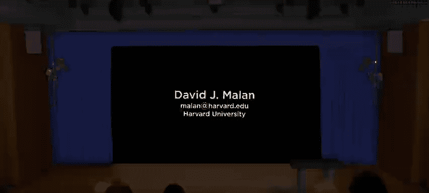
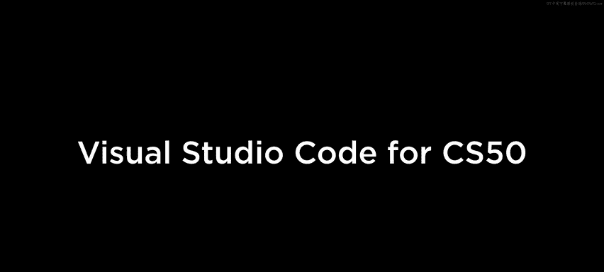
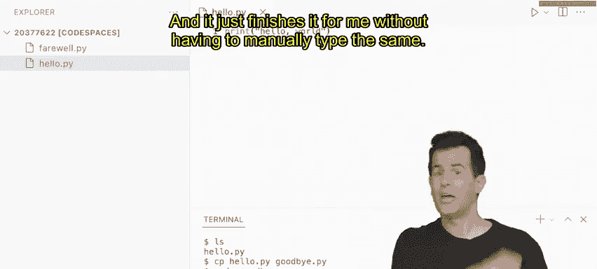
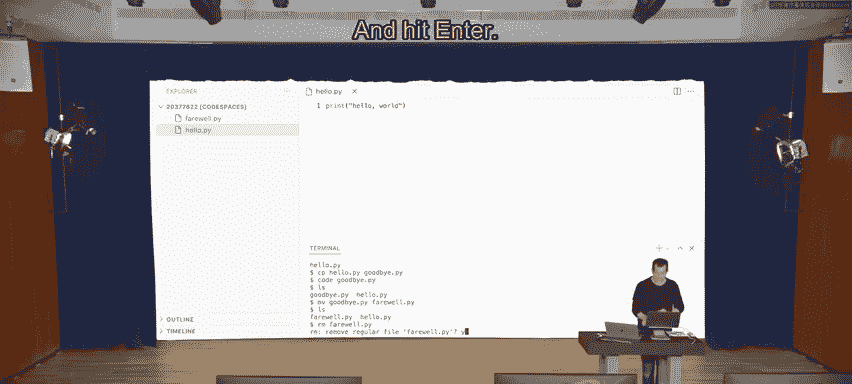
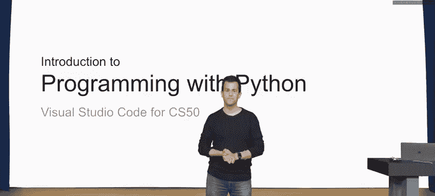

# 021：为 CS50 准备的 Visual Studio Code 🖥️






在本节课中，我们将学习如何为 CS50 课程使用 Visual Studio Code。我们将了解什么是 VS Code，为什么推荐在云端使用它，以及如何通过命令行界面来高效地管理文件和运行程序。

---

## 什么是 Visual Studio Code？

Visual Studio Code，简称 VS Code，是当今非常流行的代码编写程序。从技术上讲，它是一个文本编辑器，或者更准确地说，是一个集成开发环境。这意味着它是一个专门设计用于让你在计算机上高效编写代码的程序。

通常，你会在自己的 Mac 或 PC 上安装 VS Code。它是免费的开源软件，任何人都可以在自己的电脑上下载。然而，为了用它来编写 Python 等语言的程序，通常还需要进行一些额外的配置步骤，例如安装 Python 支持，以及配置计算机的一些底层实现细节。

因此，对于本课程，我们推荐你使用 VS Code，但建议你通过云端的方式使用它，即利用 CS50 在 GitHub Codespaces 上搭建的实现。

---

## 如何使用 CS50 的云端 VS Code

要使用 CS50 的云端 VS Code，请访问 `code.cs50.io`。系统会提示你使用免费的 GitHub 账户登录。几秒或几分钟后，你将被重定向到你的“代码空间”。这是一个位于 GitHub 服务器上的、属于你自己的虚拟空间。

在这个空间里，你将拥有自己的存储空间，本质上是一个云端的硬盘，你可以在其中创建文件、运行程序，甚至用文件夹来组织一切。你还可以通过这个界面编写代码，以及进行更多操作。

你看到的界面通常类似这样：屏幕左上角会有一个**文件资源管理器**，用于查看你在账户中创建的所有文件。顶部区域可以创建多个标签页来编写程序。屏幕底部则是一个你可能不太熟悉的**终端窗口**。

---

## 理解终端窗口

终端窗口是一个**命令行界面**。这与我们如今熟悉的**图形用户界面**形成鲜明对比。我们在这里看到的一切本质上都是图形化的，有按钮、图标和窗口。但在底层，你不仅可以访问云端的虚拟硬盘，实际上还可以访问你自己的服务器。

在 GitHub 服务器上，某种意义上运行着你自己的虚拟服务器。更技术地说，这是一个“容器”，你所有的文件都存放在其中。你可以在该服务器或容器内创建文件、运行程序，甚至安装额外的软件，因为这个服务器容器本身运行着自己的操作系统。

这个操作系统不是你熟悉的 Mac 或 Windows，而是另一个流行的操作系统：**Linux**。如今，许多程序员不仅用它来编写代码，还在自己的服务器上运行它。

---

## 掌握命令行界面

那么，如何利用这个新的命令行界面呢？答案是学习一些你可能从未输入过的命令。这些命令不仅在 Linux 上有效，在 Mac OS 上同样有效，经过一些修改后，在 Windows 上也可能有效。

如果你在 `code.cs50.io` 使用 CS50 的云端 VS Code，你将能够运行所有这些命令。以下是一些你可以输入的命令示例。

现在，我将输入 `code` 命令。这是 VS Code 自带的一个命令，用于创建新文件和打开新标签页。

我将切换到我的电脑屏幕，这里我全屏打开了 CS50 的 VS Code。这是我的浏览器窗口，全屏连接到我的云端代码空间。假设我想创建我的第一个 Python 程序，名为 `hello.py`。

在终端窗口中，我可以输入：
```bash
code hello.py
```
然后按回车键。

在我输入之前，请注意左上角的文件资源管理器里实际上什么都没有，只有一些关于代码空间和我唯一 ID 的提示，还没有任何实际的文件或文件夹。

当我按下回车键，创建名为 `hello.py` 的新文件时，我不仅会立刻在上面看到一个可以编辑它的标签页，还会在这里看到它的图形化表示。这表明这个集成环境是协同工作的。

按下回车键，我的标签页打开了，提示符在闪烁，我可以开始编写代码了。你还会看到 `hello.py` 不仅存在，而且被高亮显示为我已打开的文件。

现在，让我来写一个非常简单的程序：
```python
print("hello, world")
```
正如你将看到的，这可能是用大多数语言编写代码时，最先写出的最经典、最具代表性的程序。

现在，在我的终端窗口中，我将运行另一个你很快就会更深入了解的命令。我将运行 Python 本身，它不仅仅是一种语言，实际上也是一个能理解该语言的程序。

如果我不仅输入 `python`，还在后面加上一个空格和我创建的包含该语言代码的文件名，然后按下回车键，我就运行了我自己的程序。

在 Mac 和 PC 上，我们通常习惯于指向并双击图标，或者在手机上点击图标来启动某个文件或程序。在命令行界面中，一切都是通过键盘完成的。你可以用鼠标上下移动光标，但通常你只用键盘操作，很少用鼠标。屏幕上的其他内容可以点击，但在终端窗口中，你通常会看到这个提示符：一个美元符号 `$`。这并不代表货币，只是一个标准符号，意思是“在这里输入你的命令”，它是一个视觉指示器，表明你可以输入下一个命令。

确实，我迄今为止输入的两个命令是：`code`，用于在 VS Code 内部创建新文件；以及 `python`，我们看到它已经预装在你的代码空间中，这样你从第一天起就拥有了编写自己代码的内置支持。

---

## 图形界面与命令行界面的结合

在这个环境中，我还可以做其他事情。例如，我可以在这里按住 Control 键点击或右键点击，看到一个完整的菜单选项，用于编辑或修改该文件，就像在 Mac OS 或 Windows 上一样。我可以点击左上角的一些图标，比如加号图标来创建新文件或新文件夹。

所有这些图形用户界面的惯例仍然存在。但随着时间的推移，你将并且应该对仅使用命令行界面感到更加舒适，因为它能为你完成所有这些事情，甚至更多。

事实上，这里只是你可以在 Linux 和这个命令行界面中使用的更多命令中的一部分。稍后我们将看到 `ls`，它允许你列出当前文件夹中的所有文件。

以下是几个核心命令及其功能：

*   **`cp`**：复制文件。
    *   例如：`cp hello.py goodbye.py`
*   **`mv`**：移动文件或重命名文件。
    *   例如：`mv goodbye.py farewell.py`
*   **`rm`**：删除文件。
    *   例如：`rm farewell.py`
*   **`mkdir`**：创建目录。
    *   例如：`mkdir folder`
*   **`cd`**：更改目录。
    *   例如：`cd folder`
*   **`rmdir`**：删除目录。
    *   例如：`rmdir folder`
*   **`clear`**：清空终端窗口。

这些只是你可以在 Linux 命令行中键入的一些命令。但它们实际上等同于你我在自己的 Mac 或 PC 上经常做的所有事情。

让我回到 VS Code 这里，让我们尝试其中的几个命令。首先，我将清空我的屏幕，就像从头开始一样，但这不会更改或删除我的任何文件，它只是清空我的终端窗口。我也可以按 `Control + L` 来实现完全相同的效果。

现在，我将输入 `ls`。在我按下回车键之前，请注意 `ls` 听起来像“list”，确实如此。这个命令和几乎所有其他命令都非常简洁，`ls` 意思是“列出”，但你只输入 `l` 和 `s`，而不是 `LIST`。许多命令行界面命令都是如此，只是为了让你我能更快地输入。很多命令都有这种非常简洁的语法和名称。

我输入了 `ls`，然后按回车键。你会看到只有一样东西：`hello.py`。这意味着当我尝试列出当前默认文件夹中的所有文件时，我只看到一个文件存在，我也可以在这里以图形方式看到它。

现在，让我做点别的事情。让我们复制这个文件，并命名为 `goodbye.py`，以便编写第二个程序，说“goodbye world”而不是“hello”。我将输入 `cp` 表示复制，然后是第一个文件名 `hello.py`，接着一个空格，然后是 `goodbye.py` 作为新文件名，最后按回车键。

现在注意，似乎什么都没发生。这通常是件好事。如果你在这里没有看到错误信息，那就说明你做对了。但你确实在这里以图形方式看到了两个文件现在都存在。

我可以通过几种方式打开 `goodbye.py`。我可以直接在这里双击 `goodbye.py` 来打开它，或者我可以输入与之前相同的命令：
```bash
code goodbye.py
```
现在我将在这里打开第二个标签页。为了对称，我可以把这个词从“hello”改成“goodbye”，这样我就有了第二个程序，也保存在第二个文件里。

现在，如果我决定不想要这个文件了，我在这里关闭它。我想重命名它，从 `goodbye.py` 改成 `farewell.py`。它在这里仍然显示为 `goodbye.py`。如果我在下面输入 `ls`，我会看到同一个文件夹中现在有两个文件的列表。

让我输入 `mv` 表示移动：
```bash
mv goodbye.py farewell.py
```
然后按回车键。你会看到它在左边发生了变化，如果我再次输入 `ls`，你会看到它在下面也发生了变化。

好吧，我们别管 `farewell` 了，让我们直接删除这个文件。我可以在这里单击文件资源管理器中的 `farewell.py`，按住 Control 键点击或右键点击，然后选择删除。或者，在下面的命令行界面中，我可以这样做：
```bash
rm farewell.py
```
现在注意，如果我有点厌倦输入这些长文件名，Linux 和命令行界面通常支持自动补全。所以，与其输入 `farewell`，我输入 `fa`，这听起来已经足够完成我剩下的想法了。然后我按键盘上的 Tab 键，它就会自动为我补全，而无需手动输入相同的内容。我按回车键。





现在我会看到一个有点隐晦的信息。必须承认，其中很多信息都是如此。这不是错误，只是一个提示：“删除常规文件‘farewell.py’吗？”。这只是一个安全检查，以确保我同意删除这个文件。通常当被问到这样的问题时，输入 `y` 表示“是”或 `n` 表示“否”，然后按回车键。

现在，似乎没有发生任何不好的事情。但确实，`farewell.py` 现在已经消失了。

---

## 管理文件夹

我们还能做什么呢？让我为了美观起见清空屏幕，让我们创建一个或多个文件夹，而不仅仅是文件。让我在这里用 `mkdir` 创建一个目录，我就叫它 `folder`，当然我可以叫它任何名字。

或者，我可以到我的文件资源管理器这里，点击文件夹图标，手动创建一个新文件夹。但这里再次强调，目标是专注于这个命令行界面。好了，输入 `mkdir folder` 并按回车键。似乎没有发生错误信息，但现在注意，不仅有 `hello.py`，还有一个名为 `folder` 的文件夹或目录。

那么，我现在能用它做什么呢？让我看看里面有什么。在我的图形用户界面中，我可以点击这里的文件夹，看看这个小三角形里面。当然，里面什么都没有，因为我刚刚创建了它。

但让我现在在终端窗口中做这个。让我在下面点击后输入 `ls`，我们会看到我的文件夹，按照惯例，它的末尾有一个斜杠 `/`，以便在视觉上清楚地表明它是一个文件夹而不是文件。还有 `hello.py`。

现在让我更改目录。在 Mac OS 或 Windows 上，我们只需再次点击或双击文件夹就能看到里面有什么。在命令行界面中，你需要更明确地操作：
```bash
cd folder
```
带或不带斜杠都可以，然后按回车键。现在你会看到你的提示符发生了变化。仍然有一个美元符号，但按照惯例，这是一个 CS50 的细节，尽管世界上其他人也这样做，我们在你的提示符前加上了前缀，以快速提醒你所在的文件夹，这样你就不会忘记你是在主文件夹还是其他文件夹里。

我现在输入 `ls` 来列出这个文件夹的内容。当然，里面什么都没有，因为我还没有创建任何文件。但如果我这样做：
```bash
code farewell.py
```
再次把它带回来，但这次是在这个文件夹里。按回车键，你会看到这里打开了一个新标签页，我可以编写更多代码。但你也会在这里看到层级结构，`farewell.py` 现在在这个文件夹里面。

假设这是个错误，我并不是有意这样做的。我能做什么呢？让我在这里关闭标签页，甚至不写任何代码。在我的终端窗口中，让我这样做：我输入 `ls` 来确认，是的，`farewell.py` 存在那里。

但假设我想把它移回我的主文件夹。就像在 Mac 或 Windows 上一样，我可以点击这里的文件 `farewell.py`，然后把它拖上或拖下来放到我想要的位置。但让我们移动它，这次不是重命名，而是使用相同的 `mv` 命令来移动它。

我想把 `farewell.py` 移动到父文件夹。在文件和文件夹的世界里，你可以把它们想象成家谱。如果你想在层级上向上走，你想进入父文件夹，而 `folder` 则是我们开始时默认文件夹的子文件夹。

所以我想把 `farewell.py` 移得更高。我如何表达这一点呢？命令行界面中的另一个语法通常是 `..`。`..` 是父目录的符号表示，无论它的名字是什么。在这种情况下，它是我自己的默认文件夹，它的技术名称甚至无关紧要，屏幕上没有显示。

我按回车键，观察左上角图形化版本中发生的情况。我们应该看到 `farewell.py` 现在从文件夹里弹出来了，缩进发生了变化，意味着它不在文件夹里面了，现在它与 `hello.py` 并列。确实，如果我在这里关闭文件夹，我看不出区别，因为里面也什么都没有。

让我在终端窗口中输入 `ls` 来确认，`folder` 里面什么都没有。现在让我回到我的父目录，我可以用不同的方式做到这一点。就像编程本身一样，有时会有多种方式可以在命令行界面中导航。

这是一种方法：我可以输入 `cd ..` 回到父目录。但另一种技巧，尤其是如果你对这个新世界还不太熟悉的话，就是：每当有疑问时，如果你想回到登录时的默认起点，只需输入 `cd` 后面不加任何内容，然后按回车键，你就会被瞬间带回到起点。

确实，如果我现在输入 `ls`，我会看到 `farewell.py`、我的空文件夹 `folder` 以及 `hello.py`。

现在，我真的不需要这个文件夹了，因为里面还没有任何东西。所以让我们删除它。我可以在文件资源管理器中按住 Control 键点击或右键点击它，然后像在 Mac OS 或 Windows 上一样手动删除它。或者，我可以使用我新学的命令：
```bash
rmdir folder
```
带或不带斜杠都可以，然后按回车键。因为它是空的，我甚至没有被提示，它就直接干净地消失了。

---

## 命令行界面的实用技巧

你会在命令行界面中发现非常有用的最后一个技巧是：它倾向于存储你的整个命令历史。事实上，不仅仅是自动补全，如果我按上箭头、上箭头、上箭头，你会看到我所有先前命令的历史记录在屏幕上滚动，这很有帮助，如果我只想再次执行其中一个命令，我不需要手动输入，我可以上下滚动找到我想要的那个。

那么，这只是云端 Visual Studio Code 中命令行界面功能的冰山一角。无论在你的 Mac 还是 PC 上，大多数这些命令都是相同的，至少如果你使用的是连接到运行 Linux 的计算机的终端窗口，无论是在容器、虚拟机还是云端的实际服务器上。

在本课程接下来的几周里，你将可以访问 `code.cs50.io`，进而访问你自己的代码空间，这样你就可以 24/7/365 仅通过浏览器进行访问，只要你有互联网连接，而无需在自己的 Mac 或 PC 上安装任何东西。在学期末，如果你感觉更舒适，并且希望使用相同的软件 VS Code，甚至 Linux，你也能够免费将它们安装到你自己的 Mac 或 PC 上，并在课程结束后继续编程。

---

## 总结



本节课中，我们一起学习了为 CS50 课程使用 Visual Studio Code。我们了解了 VS Code 作为集成开发环境的作用，掌握了通过云端访问 CS50 代码空间的方法，并学习了如何使用命令行界面来创建、复制、移动、重命名、删除文件和文件夹，以及运行 Python 程序。这些技能是后续编程学习的重要基础。